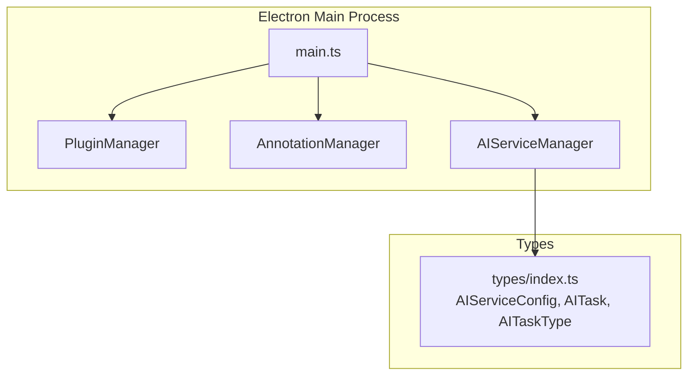
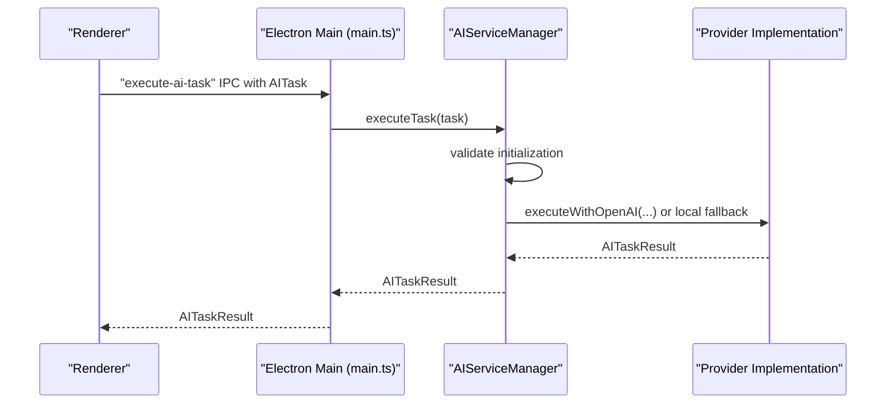
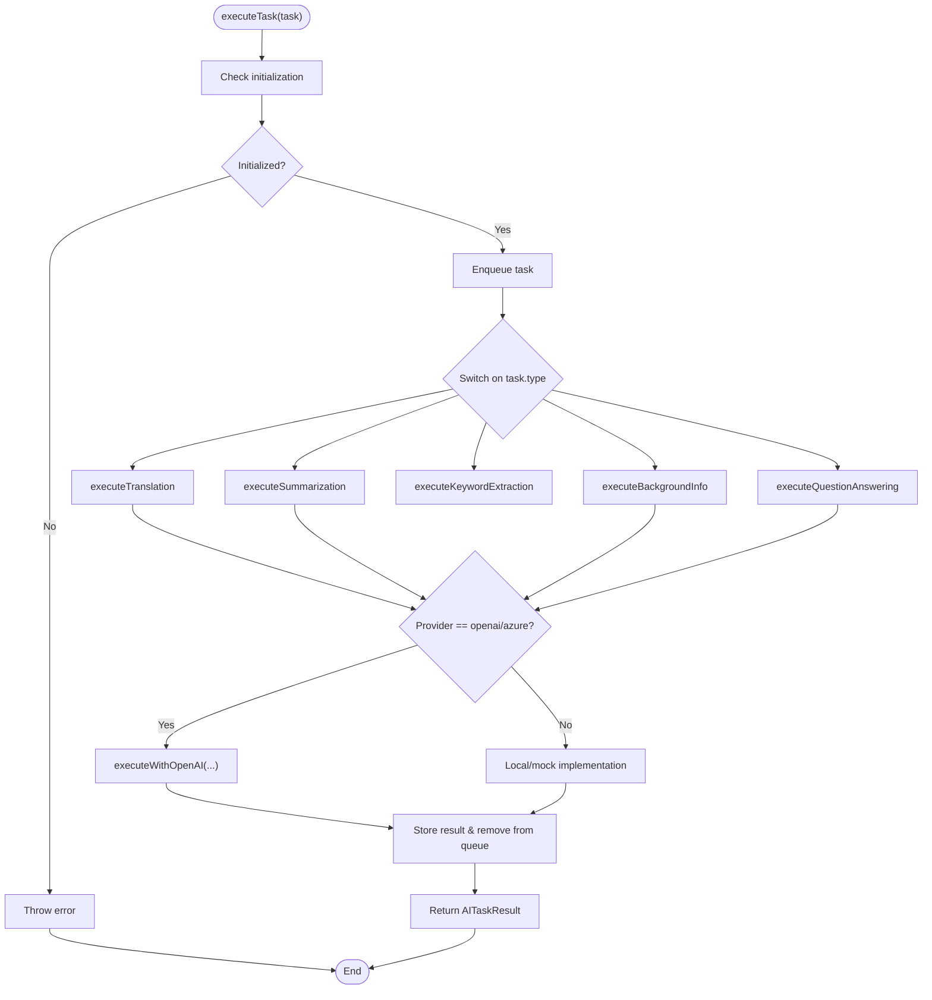
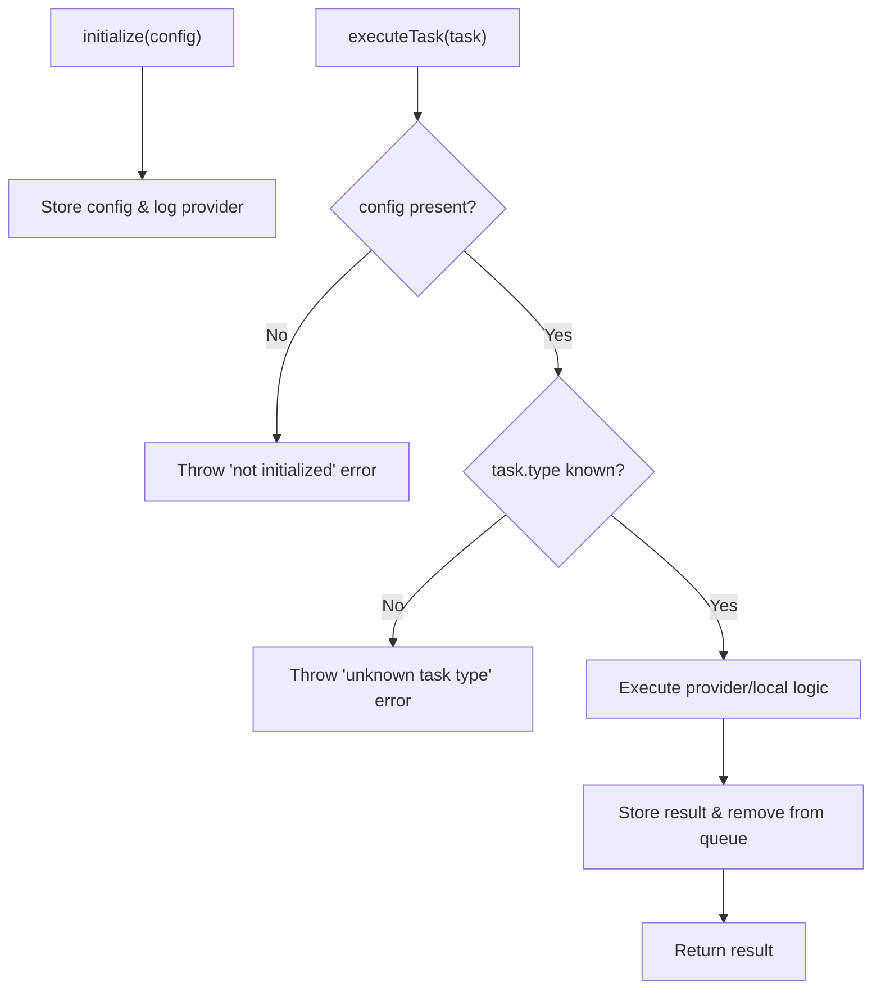
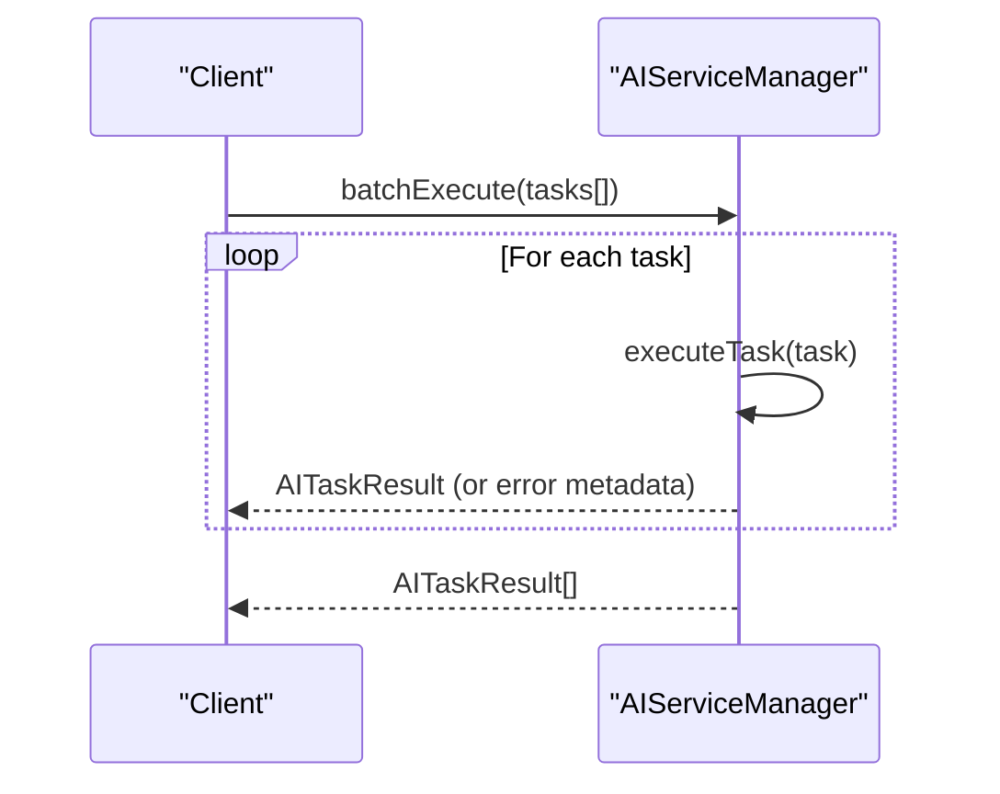
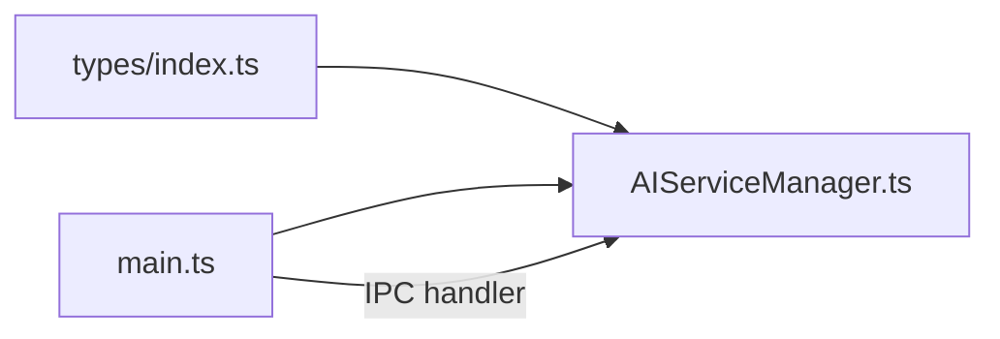

# AI Service Configuration

<cite>
**Referenced Files in This Document**
- [AIServiceManager.ts](file://src/core/AIServiceManager.ts)
- [index.ts](file://src/types/index.ts)
- [main.ts](file://src/main.ts)
- [README.md](file://README.md)
- [DESIGN.md](file://DESIGN.md)
- [PLUGIN-GUIDE.md](file://PLUGIN-GUIDE.md)
- [package.json](file://package.json)
</cite>

## Table of Contents
1. [Introduction](#introduction)
2. [Project Structure](#project-structure)
3. [Core Components](#core-components)
4. [Architecture Overview](#architecture-overview)
5. [Detailed Component Analysis](#detailed-component-analysis)
6. [Dependency Analysis](#dependency-analysis)
7. [Performance Considerations](#performance-considerations)
8. [Troubleshooting Guide](#troubleshooting-guide)
9. [Conclusion](#conclusion)
10. [Appendices](#appendices)

## Introduction
This document provides comprehensive guidance for configuring and optimizing the AI service in the SciPDFReader application. It focuses on the AIServiceConfig interface, initialization and environment-specific configuration, model selection strategies, security best practices for API keys, validation and error handling during initialization, performance tuning, and troubleshooting. It also covers dynamic configuration updates and safe runtime modifications.

## Project Structure
The AI service configuration primarily resides in the core module and type definitions. The Electron main process initializes services, while the renderer interacts with the AI service via IPC handlers.

**Diagram sources**
- [main.ts:45-60](file://src/main.ts#L45-L60)
- [AIServiceManager.ts:1-11](file://src/core/AIServiceManager.ts#L1-L11)
- [index.ts:49-84](file://src/types/index.ts#L49-L84)

**Section sources**
- [main.ts:13-60](file://src/main.ts#L13-L60)
- [index.ts:49-84](file://src/types/index.ts#L49-L84)

## Core Components
- AIServiceConfig: Defines provider selection, API keys, endpoints, model identifiers, and optional temperature.
- AIServiceManager: Manages initialization, task execution, batching, cancellation, and status tracking. It routes tasks to provider-specific implementations and falls back to local/mock behavior when provider is not configured.
- AITask and AITaskType: Define the task contract and supported task types (translation, summarization, background info, keyword extraction, question answering).
- IPC integration: The main process exposes an IPC handler to execute AI tasks from the renderer.

Key configuration options:
- provider: Select among openai, azure, local, or custom.
- apiKey: Optional API key used by providers that require authentication.
- endpoint: Optional custom endpoint for provider-specific integrations.
- model: Identifier for the model to use (e.g., a GPT model).
- temperature: Optional parameter for provider-specific behavior.

Initialization behavior:
- The manager stores the provided configuration and logs the selected provider.
- Tasks require initialization; attempting to execute tasks without initialization throws an error.

**Section sources**
- [index.ts:49-84](file://src/types/index.ts#L49-L84)
- [AIServiceManager.ts:8-11](file://src/core/AIServiceManager.ts#L8-L11)
- [AIServiceManager.ts:13-16](file://src/core/AIServiceManager.ts#L13-L16)

## Architecture Overview
The AI service integrates with the Electron main process and renderer through IPC. The AIServiceManager encapsulates provider logic and task orchestration.

**Diagram sources**
- [main.ts:137-142](file://src/main.ts#L137-L142)
- [AIServiceManager.ts:13-56](file://src/core/AIServiceManager.ts#L13-L56)
- [AIServiceManager.ts:174-193](file://src/core/AIServiceManager.ts#L174-L193)

## Detailed Component Analysis

### AIServiceConfig and Initialization
- AIServiceConfig defines the configuration surface for AI providers, including provider selection, optional API key, endpoint, model identifier, and temperature.
- Initialization sets internal state and logs the provider. The manager enforces initialization before task execution.

Environment-specific configuration:
- The project’s README describes a user-level configuration file with an “ai” section containing provider, apiKey, and model. This indicates a potential external configuration mechanism separate from the in-code AIServiceConfig passed to initialize.

Security considerations:
- The presence of dotenv and dotenv-expand in devDependencies suggests environment variable support. However, the current AIServiceManager does not read environment variables directly; it expects a fully formed AIServiceConfig object.

**Section sources**
- [index.ts:49-55](file://src/types/index.ts#L49-L55)
- [AIServiceManager.ts:8-11](file://src/core/AIServiceManager.ts#L8-L11)
- [README.md:120-139](file://README.md#L120-L139)
- [package.json:19-31](file://package.json#L19-L31)

### Task Execution and Provider Routing
- The manager routes tasks to provider-specific logic when provider is openai or azure; otherwise, it returns local/mock results.
- Task types include translation, summarization, background info, keyword extraction, and question answering.
- Batch execution handles failures per task and aggregates results.

**Diagram sources**
- [AIServiceManager.ts:13-92](file://src/core/AIServiceManager.ts#L13-L92)
- [AIServiceManager.ts:96-171](file://src/core/AIServiceManager.ts#L96-L171)
- [AIServiceManager.ts:174-193](file://src/core/AIServiceManager.ts#L174-L193)

**Section sources**
- [AIServiceManager.ts:13-92](file://src/core/AIServiceManager.ts#L13-L92)
- [AIServiceManager.ts:96-171](file://src/core/AIServiceManager.ts#L96-L171)

### Model Selection Strategies
- The manager defaults to a model identifier when none is provided, indicating that model selection is part of the configuration contract.
- The README’s configuration example uses a GPT model identifier, aligning with OpenAI’s model naming.

Pricing and quality considerations:
- GPT models vary in cost and quality. Higher-end models generally offer better quality at higher cost. Choose models aligned with your budget and performance requirements.
- Temperature controls randomness; lower values yield more deterministic outputs, while higher values increase creativity.

**Section sources**
- [AIServiceManager.ts:188](file://src/core/AIServiceManager.ts#L188)
- [README.md:124-129](file://README.md#L124-L129)

### Environment Variable Configuration and Security
- The project includes dotenv and dotenv-expand in devDependencies, enabling environment variable loading.
- Current AIServiceManager does not read environment variables directly; it expects a configuration object passed to initialize.
- Security best practices:
  - Store API keys in environment variables or secure secret stores.
  - Avoid embedding secrets in source code.
  - Restrict file permissions for configuration files.
  - Use provider-specific credential management (e.g., Azure managed identity) when applicable.

**Section sources**
- [package.json:2515-2531](file://package.json#L2515-L2531)
- [AIServiceManager.ts:8-11](file://src/core/AIServiceManager.ts#L8-L11)

### Configuration Validation and Error Handling
- Initialization validation: The manager requires initialization before executing tasks; otherwise, it throws an error.
- Task execution validation: Unknown task types trigger an error.
- Batch execution: On task failure, the manager records an error in the result metadata and continues processing remaining tasks.

**Diagram sources**
- [AIServiceManager.ts:8-16](file://src/core/AIServiceManager.ts#L8-L16)
- [AIServiceManager.ts:44-46](file://src/core/AIServiceManager.ts#L44-L46)
- [AIServiceManager.ts:58-75](file://src/core/AIServiceManager.ts#L58-L75)

**Section sources**
- [AIServiceManager.ts:8-16](file://src/core/AIServiceManager.ts#L8-L16)
- [AIServiceManager.ts:44-46](file://src/core/AIServiceManager.ts#L44-L46)
- [AIServiceManager.ts:58-75](file://src/core/AIServiceManager.ts#L58-L75)

### Performance Optimization Settings
- Request batching: Use batchExecute to reduce overhead and improve throughput.
- Local fallback: When provider is not configured, the manager uses local implementations, reducing latency and avoiding external dependencies.
- Provider-specific tuning: The configuration includes temperature, enabling provider-specific behavior adjustments.

**Diagram sources**
- [AIServiceManager.ts:58-75](file://src/core/AIServiceManager.ts#L58-L75)

**Section sources**
- [AIServiceManager.ts:58-75](file://src/core/AIServiceManager.ts#L58-L75)

### Dynamic Configuration Updates and Safe Runtime Modifications
- The current AIServiceManager does not expose a method to update configuration after initialization. To safely change settings at runtime, consider adding a re-initialization method that:
  - Validates the new configuration.
  - Cancels pending tasks if necessary.
  - Applies the new configuration and logs the change.
- Ensure that any runtime update is atomic and does not leave the manager in an inconsistent state.

**Section sources**
- [AIServiceManager.ts:8-11](file://src/core/AIServiceManager.ts#L8-L11)

## Dependency Analysis
- AIServiceManager depends on AIServiceConfig, AITask, AITaskType, and AITaskResult from types.
- The main process initializes AIServiceManager and exposes an IPC handler to execute tasks.

**Diagram sources**
- [index.ts:49-84](file://src/types/index.ts#L49-L84)
- [AIServiceManager.ts:1-11](file://src/core/AIServiceManager.ts#L1-L11)
- [main.ts:137-142](file://src/main.ts#L137-L142)

**Section sources**
- [index.ts:49-84](file://src/types/index.ts#L49-L84)
- [AIServiceManager.ts:1-11](file://src/core/AIServiceManager.ts#L1-L11)
- [main.ts:137-142](file://src/main.ts#L137-L142)

## Performance Considerations
- Prefer local implementations when provider is not configured to minimize latency.
- Use batchExecute for multiple tasks to reduce overhead.
- Consider caching provider responses for repeated inputs.
- Monitor task queue length and implement backpressure if needed.

[No sources needed since this section provides general guidance]

## Troubleshooting Guide
Common issues and resolutions:
- Invalid API key:
  - Symptom: Provider-specific execution fails.
  - Resolution: Verify apiKey in configuration and ensure it matches the provider’s expectations.
- Network connectivity problems:
  - Symptom: Delays or failures when provider is openai or azure.
  - Resolution: Check endpoint reachability, firewall rules, and retry logic if implemented.
- Model availability issues:
  - Symptom: Provider returns model not found or unavailable.
  - Resolution: Confirm model identifier and region support; adjust to an available model.
- Not initialized:
  - Symptom: Error thrown when executing tasks.
  - Resolution: Ensure initialize(config) is called before executeTask or batchExecute.
- Unknown task type:
  - Symptom: Error thrown for unsupported task types.
  - Resolution: Use supported AITaskType values.

**Section sources**
- [AIServiceManager.ts:13-16](file://src/core/AIServiceManager.ts#L13-L16)
- [AIServiceManager.ts:44-46](file://src/core/AIServiceManager.ts#L44-L46)

## Conclusion
The AIServiceManager provides a clean configuration surface via AIServiceConfig and robust task execution with provider routing and local fallbacks. By following the outlined configuration strategies, security practices, and troubleshooting steps, you can deploy the AI service reliably across development, staging, and production environments while maintaining performance and safety.

[No sources needed since this section summarizes without analyzing specific files]

## Appendices

### Configuration Examples by Environment
- Development:
  - Use local provider or a sandbox endpoint.
  - Store apiKey in environment variables loaded via dotenv.
- Staging:
  - Point endpoint to staging provider host.
  - Use a dedicated model identifier for testing.
- Production:
  - Use production endpoint and a high-quality model.
  - Store apiKey in a secure secret store and restrict access.

[No sources needed since this section provides general guidance]

### Environment Variable Configuration
- Enable dotenv and dotenv-expand in devDependencies.
- Load environment variables at startup and construct AIServiceConfig accordingly.
- Avoid committing secrets; use CI/CD secret management.

**Section sources**
- [package.json:2515-2531](file://package.json#L2515-L2531)

### Provider Selection and Model Parameters
- Provider selection influences whether provider-specific logic is used.
- Model parameters should align with provider capabilities and performance targets.

**Section sources**
- [AIServiceManager.ts:99-102](file://src/core/AIServiceManager.ts#L99-L102)
- [AIServiceManager.ts:188](file://src/core/AIServiceManager.ts#L188)