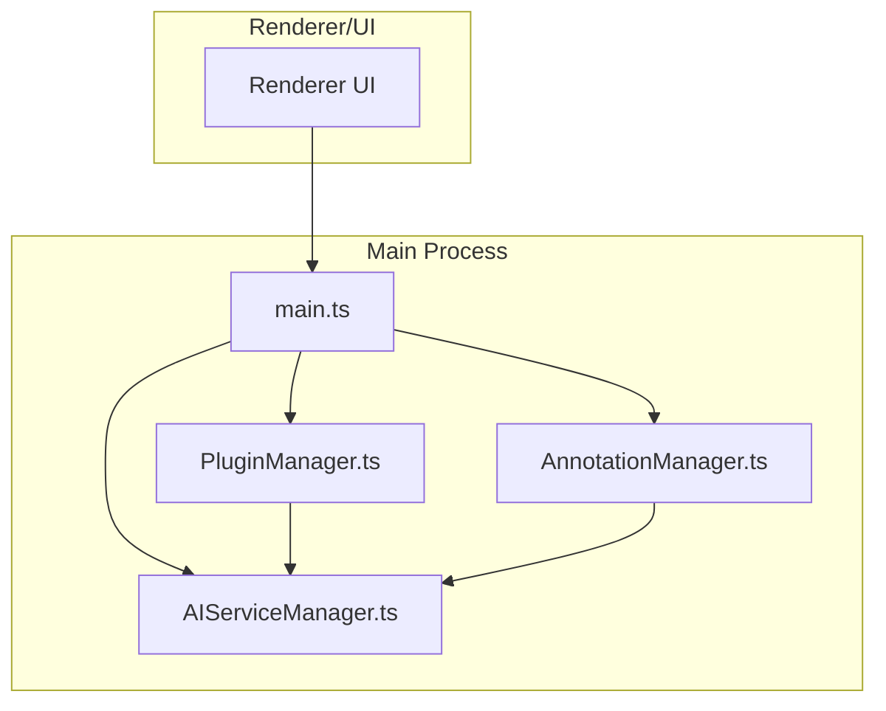
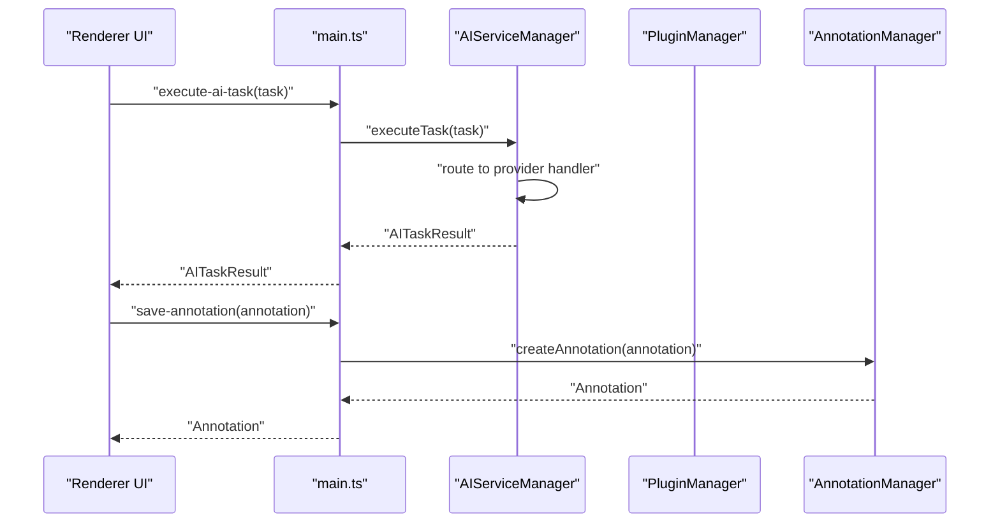
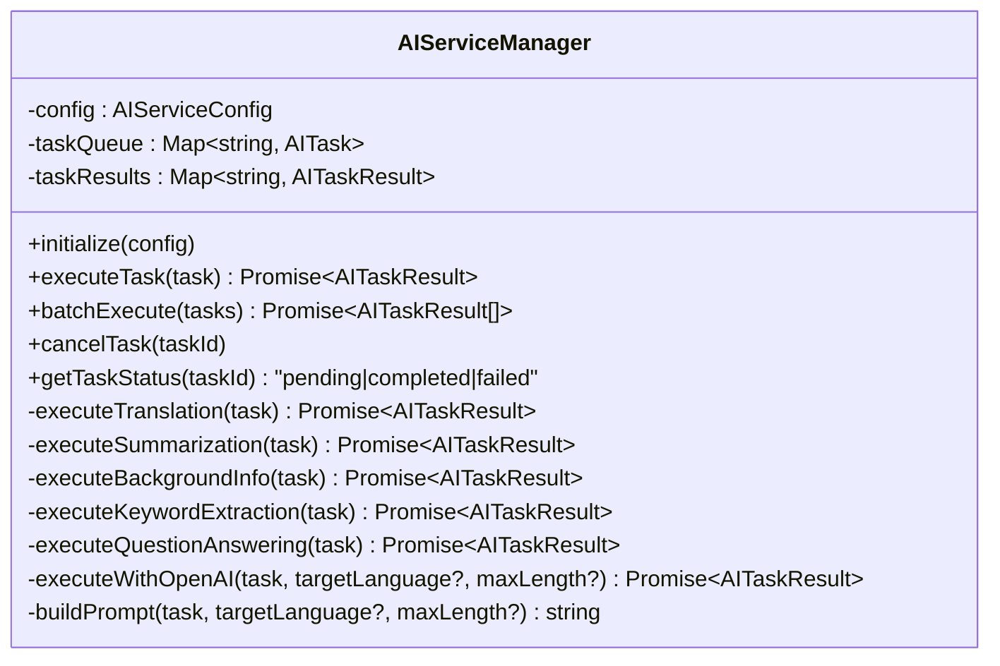
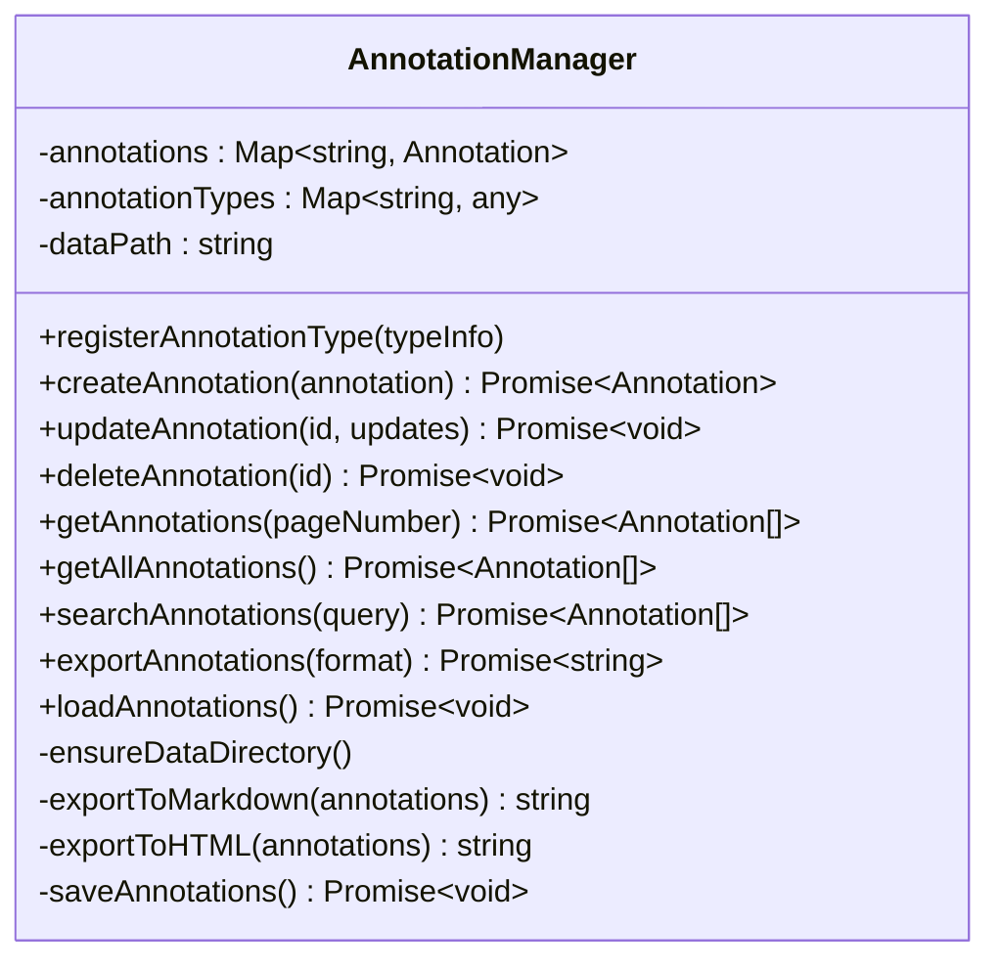
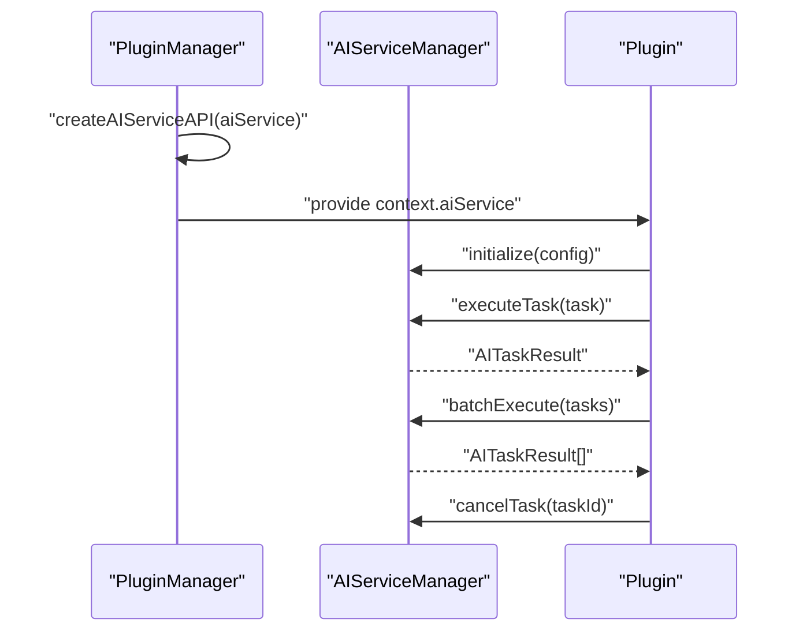
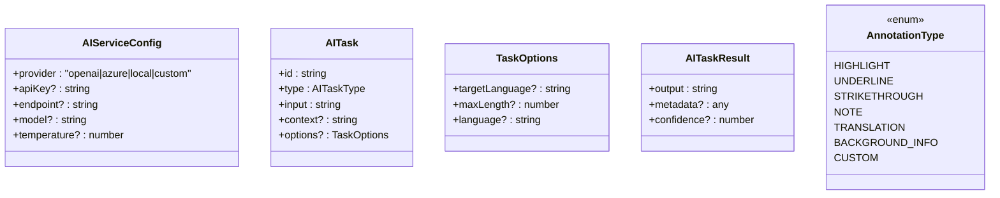
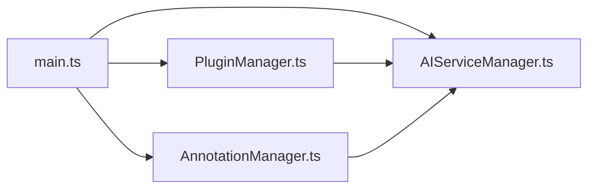

# AI Service Integration

<cite>
**Referenced Files in This Document**
- [AIServiceManager.ts](file://src/core/AIServiceManager.ts)
- [AnnotationManager.ts](file://src/core/AnnotationManager.ts)
- [PluginManager.ts](file://src/core/PluginManager.ts)
- [index.ts](file://src/types/index.ts)
- [main.ts](file://src/main.ts)
- [README.md](file://README.md)
- [PLUGIN-GUIDE.md](file://PLUGIN-GUIDE.md)
</cite>

## Table of Contents
1. [Introduction](#introduction)
2. [Project Structure](#project-structure)
3. [Core Components](#core-components)
4. [Architecture Overview](#architecture-overview)
5. [Detailed Component Analysis](#detailed-component-analysis)
6. [Dependency Analysis](#dependency-analysis)
7. [Performance Considerations](#performance-considerations)
8. [Troubleshooting Guide](#troubleshooting-guide)
9. [Conclusion](#conclusion)
10. [Appendices](#appendices)

## Introduction
This document explains the AI service integration powering automated annotation capabilities in the application. It covers the AI service architecture supporting multiple providers (OpenAI and Azure AI services), the supported AI tasks (translation, background information extraction, summarization, keyword extraction, and question answering), task execution patterns, batch processing, and result handling. It also documents configuration options for AI providers, practical AI-powered workflows, the AI service API, error handling, rate limiting considerations, fallback mechanisms, and how AI services integrate with the annotation system to create intelligent document annotation workflows.

## Project Structure
The AI service integration spans several core modules:
- AIServiceManager: orchestrates AI tasks, provider routing, and result caching
- AnnotationManager: manages annotations and integrates with AI-generated content
- PluginManager: exposes the AI service API to plugins and coordinates lifecycle
- Types: defines AI task types, configuration, and result structures
- Main process: initializes services and exposes IPC handlers for renderer-to-main communication

**Diagram sources**
- [main.ts:44-59](file://src/main.ts#L44-L59)
- [PluginManager.ts:21-35](file://src/core/PluginManager.ts#L21-L35)
- [AIServiceManager.ts:3-11](file://src/core/AIServiceManager.ts#L3-L11)
- [AnnotationManager.ts:6-19](file://src/core/AnnotationManager.ts#L6-L19)

**Section sources**
- [main.ts:44-59](file://src/main.ts#L44-L59)
- [README.md:13-29](file://README.md#L13-L29)

## Core Components
- AIServiceManager: central hub for AI tasks, provider routing, queue management, and result caching
- AnnotationManager: persists and manages annotations, including AI-generated ones
- PluginManager: creates and exposes the AI service API to plugins, enabling extensibility
- Types: define AI task types, configuration, and result structures used across modules

Key responsibilities:
- AIServiceManager: initialize provider, route tasks to provider-specific handlers, maintain task queue and results, expose batch execution and cancellation
- AnnotationManager: create/update/delete annotations, search/export, and persist to disk
- PluginManager: inject AI service API into plugin context and manage plugin lifecycle
- Types: define AIServiceConfig, AITask, AITaskResult, AITaskType, and related interfaces

**Section sources**
- [AIServiceManager.ts:3-11](file://src/core/AIServiceManager.ts#L3-L11)
- [AnnotationManager.ts:6-19](file://src/core/AnnotationManager.ts#L6-L19)
- [PluginManager.ts:21-35](file://src/core/PluginManager.ts#L21-L35)
- [index.ts:49-84](file://src/types/index.ts#L49-L84)

## Architecture Overview
The AI service architecture supports multiple providers and integrates tightly with the annotation system. The main process initializes managers and exposes IPC handlers. Plugins receive an AI service API through the plugin context and can execute tasks, then create annotations with AI-generated content.

**Diagram sources**
- [main.ts:99-104](file://src/main.ts#L99-L104)
- [AIServiceManager.ts:13-56](file://src/core/AIServiceManager.ts#L13-L56)
- [AnnotationManager.ts:46-59](file://src/core/AnnotationManager.ts#L46-L59)

## Detailed Component Analysis

### AIServiceManager
Responsibilities:
- Initialize with provider configuration
- Route tasks to provider-specific handlers (OpenAI/Azure or local/fallback)
- Maintain task queue and results cache
- Expose batch execution and cancellation
- Provide status monitoring

Supported AI tasks:
- Translation: translates text to a target language
- Summarization: generates concise summaries with length constraints
- Background Information: retrieves contextual information for entities
- Keyword Extraction: extracts frequent terms from text
- Question Answering: answers questions given context

Execution patterns:
- Single task execution with error propagation
- Batch execution with per-task error handling and partial results
- Cancellation removes pending tasks
- Status checks indicate pending/completed/failed

Provider routing:
- OpenAI and Azure routes call provider-specific handler
- Other providers use local/fallback implementations

Result caching:
- Results stored in memory keyed by task ID
- Queue maintained during execution

**Diagram sources**
- [AIServiceManager.ts:3-214](file://src/core/AIServiceManager.ts#L3-L214)

**Section sources**
- [AIServiceManager.ts:8-11](file://src/core/AIServiceManager.ts#L8-L11)
- [AIServiceManager.ts:13-56](file://src/core/AIServiceManager.ts#L13-L56)
- [AIServiceManager.ts:58-75](file://src/core/AIServiceManager.ts#L58-L75)
- [AIServiceManager.ts:77-92](file://src/core/AIServiceManager.ts#L77-L92)
- [AIServiceManager.ts:96-171](file://src/core/AIServiceManager.ts#L96-L171)
- [AIServiceManager.ts:174-193](file://src/core/AIServiceManager.ts#L174-L193)
- [AIServiceManager.ts:195-212](file://src/core/AIServiceManager.ts#L195-L212)

### AnnotationManager
Responsibilities:
- Manage annotation lifecycle (create, update, delete)
- Persist annotations to disk and load on startup
- Search annotations by content
- Export annotations in multiple formats

Integration with AI:
- Creates annotations populated with AI-generated content
- Supports annotation types including translation and background info

**Diagram sources**
- [AnnotationManager.ts:6-172](file://src/core/AnnotationManager.ts#L6-L172)

**Section sources**
- [AnnotationManager.ts:46-75](file://src/core/AnnotationManager.ts#L46-L75)
- [AnnotationManager.ts:77-84](file://src/core/AnnotationManager.ts#L77-L84)
- [AnnotationManager.ts:86-94](file://src/core/AnnotationManager.ts#L86-L94)
- [AnnotationManager.ts:96-112](file://src/core/AnnotationManager.ts#L96-L112)
- [AnnotationManager.ts:159-170](file://src/core/AnnotationManager.ts#L159-L170)

### PluginManager and AI Service API Exposure
Responsibilities:
- Create plugin context with APIs exposed to plugins
- Expose AI service API to plugins via context.aiService
- Enable plugins to initialize AI service, execute tasks, and batch execute tasks

**Diagram sources**
- [PluginManager.ts:213-219](file://src/core/PluginManager.ts#L213-L219)
- [AIServiceManager.ts:8-11](file://src/core/AIServiceManager.ts#L8-L11)
- [AIServiceManager.ts:13-56](file://src/core/AIServiceManager.ts#L13-L56)
- [AIServiceManager.ts:58-75](file://src/core/AIServiceManager.ts#L58-L75)
- [AIServiceManager.ts:77-82](file://src/core/AIServiceManager.ts#L77-L82)

**Section sources**
- [PluginManager.ts:213-219](file://src/core/PluginManager.ts#L213-L219)
- [index.ts:166-171](file://src/types/index.ts#L166-L171)

### Types and Configuration
Key types and interfaces:
- AIServiceConfig: provider, apiKey, endpoint, model, temperature
- AITaskType: translation, summarization, background_info, keyword_extraction, question_answering
- AITask: id, type, input, context, options
- AITaskResult: output, metadata, confidence
- AnnotationType: highlight, underline, strikethrough, note, translation, background_info, custom

Configuration options:
- Provider selection (openai, azure, local, custom)
- API key and endpoint for external providers
- Model selection and temperature for provider-specific behavior

**Diagram sources**
- [index.ts:49-55](file://src/types/index.ts#L49-L55)
- [index.ts:65-71](file://src/types/index.ts#L65-L71)
- [index.ts:73-78](file://src/types/index.ts#L73-L78)
- [index.ts:80-84](file://src/types/index.ts#L80-L84)
- [index.ts:3-11](file://src/types/index.ts#L3-L11)

**Section sources**
- [index.ts:49-84](file://src/types/index.ts#L49-L84)

## Dependency Analysis
The main process initializes and wires the managers, exposing IPC handlers for renderer-to-main communication. The plugin manager injects the AI service API into plugin contexts, enabling plugins to execute AI tasks and create annotations.

**Diagram sources**
- [main.ts:44-59](file://src/main.ts#L44-L59)
- [PluginManager.ts:21-35](file://src/core/PluginManager.ts#L21-L35)

**Section sources**
- [main.ts:44-59](file://src/main.ts#L44-L59)
- [PluginManager.ts:21-35](file://src/core/PluginManager.ts#L21-L35)

## Performance Considerations
- Task queue and result caching: AIServiceManager maintains in-memory maps for pending tasks and results. This avoids redundant processing and enables quick status checks.
- Batch execution: The batchExecute method processes tasks sequentially with per-task error handling, returning partial results to minimize failure cascading.
- Provider routing: Routing to provider-specific handlers is straightforward; in-memory caching reduces repeated network calls for identical tasks.
- Disk I/O: AnnotationManager persists annotations to disk, which is efficient for small to moderate datasets but should be considered when exporting large batches.

[No sources needed since this section provides general guidance]

## Troubleshooting Guide
Common issues and resolutions:
- AI Service not initialized: Ensure initialize is called with a valid AIServiceConfig before executing tasks.
- Unknown task type: Verify AITaskType values match supported types.
- Task failures: Inspect AITaskResult.metadata.error for detailed error messages.
- Provider-specific errors: For OpenAI/Azure, confirm API key and endpoint correctness; ensure model availability and permissions.
- Rate limiting: Implement backoff strategies and consider batching to reduce API calls.
- Fallback behavior: When provider is not openai/azure, AIServiceManager falls back to local implementations; verify expectations for mock outputs.

**Section sources**
- [AIServiceManager.ts:14-16](file://src/core/AIServiceManager.ts#L14-L16)
- [AIServiceManager.ts:44-46](file://src/core/AIServiceManager.ts#L44-L46)
- [AIServiceManager.ts:65-71](file://src/core/AIServiceManager.ts#L65-L71)

## Conclusion
The AI service integration provides a robust foundation for automated annotation workflows. It supports multiple providers, offers diverse AI tasks, and integrates seamlessly with the annotation system. The architecture enables plugins to leverage AI capabilities while maintaining clear separation of concerns and extensibility.

[No sources needed since this section summarizes without analyzing specific files]

## Appendices

### AI Tasks and Execution Patterns
Supported tasks:
- Translation: Translate selected text to a target language
- Summarization: Generate concise summaries with configurable length
- Background Information: Retrieve contextual information for entities
- Keyword Extraction: Extract frequent terms from text
- Question Answering: Answer questions given context

Batch processing:
- Execute multiple tasks concurrently with per-task error handling
- Returns an array of results, preserving order

Cancellation:
- Cancel pending tasks by task ID

Status monitoring:
- Pending: task queued
- Completed: result cached
- Failed: error recorded

**Section sources**
- [AIServiceManager.ts:23-42](file://src/core/AIServiceManager.ts#L23-L42)
- [AIServiceManager.ts:58-75](file://src/core/AIServiceManager.ts#L58-L75)
- [AIServiceManager.ts:77-92](file://src/core/AIServiceManager.ts#L77-L92)

### Practical AI Workflows
- Translating selected text:
  - Use TRANSLATION task with targetLanguage option
  - Create translation annotation with AI output
- Generating background information for scientific terms:
  - Use KEYWORD_EXTRACTION to identify key terms
  - Use BACKGROUND_INFO task with document context
  - Create background_info annotations
- Creating automated summaries:
  - Use SUMMARIZATION task with maxLength option
  - Create note annotations with summary content

**Section sources**
- [PLUGIN-GUIDE.md:242-277](file://PLUGIN-GUIDE.md#L242-L277)
- [PLUGIN-GUIDE.md:279-323](file://PLUGIN-GUIDE.md#L279-L323)
- [PLUGIN-GUIDE.md:325-359](file://PLUGIN-GUIDE.md#L325-L359)

### AI Service API Reference
Methods:
- initialize(config): Configure provider and credentials
- executeTask(task): Execute a single AI task
- batchExecute(tasks): Execute multiple tasks
- cancelTask(taskId): Cancel a pending task

Task types:
- TRANSLATION, SUMMARIZATION, BACKGROUND_INFO, KEYWORD_EXTRACTION, QUESTION_ANSWERING

Options:
- targetLanguage, maxLength, language

**Section sources**
- [index.ts:166-171](file://src/types/index.ts#L166-L171)
- [index.ts:57-63](file://src/types/index.ts#L57-L63)
- [index.ts:73-78](file://src/types/index.ts#L73-L78)

### Configuration Options
Provider configuration:
- provider: openai, azure, local, custom
- apiKey: provider API key
- endpoint: provider endpoint URL
- model: model identifier
- temperature: sampling temperature

Example configuration:
- Provider: openai
- API Key: configured in AIServiceConfig
- Model: gpt-3.5-turbo

**Section sources**
- [index.ts:49-55](file://src/types/index.ts#L49-L55)
- [README.md:122-139](file://README.md#L122-L139)

### Integration with Annotation System
- AI-generated content is stored in AITaskResult.output
- Plugins create annotations using AnnotationManager with AI output
- Supported annotation types include translation and background_info

**Section sources**
- [AnnotationManager.ts:21-34](file://src/core/AnnotationManager.ts#L21-L34)
- [PLUGIN-GUIDE.md:242-277](file://PLUGIN-GUIDE.md#L242-L277)