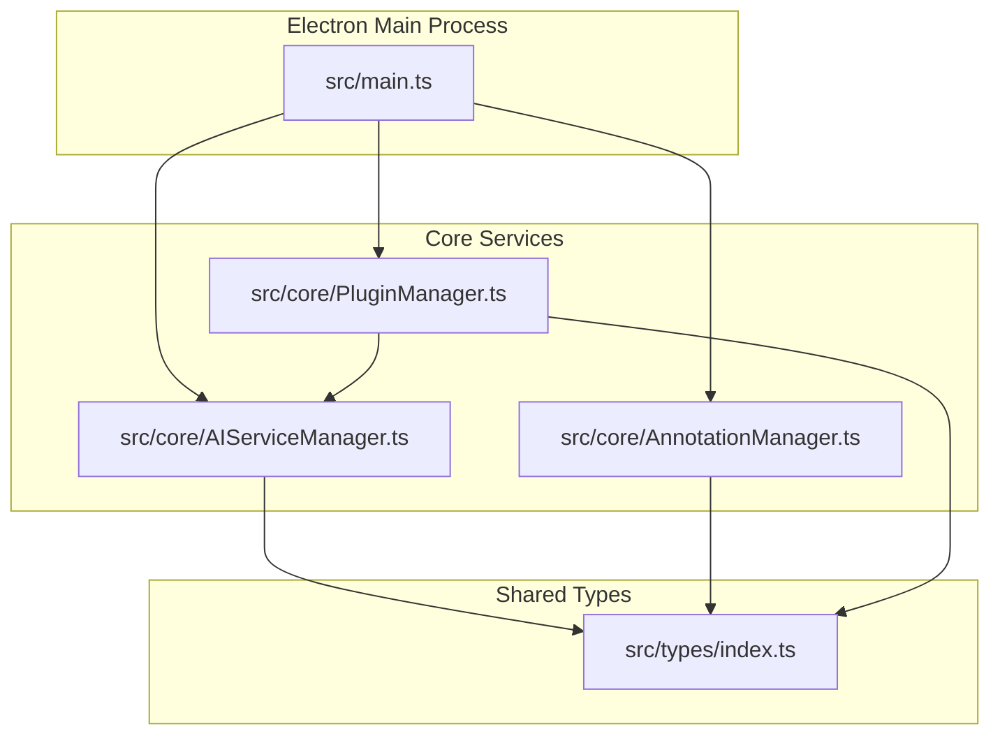
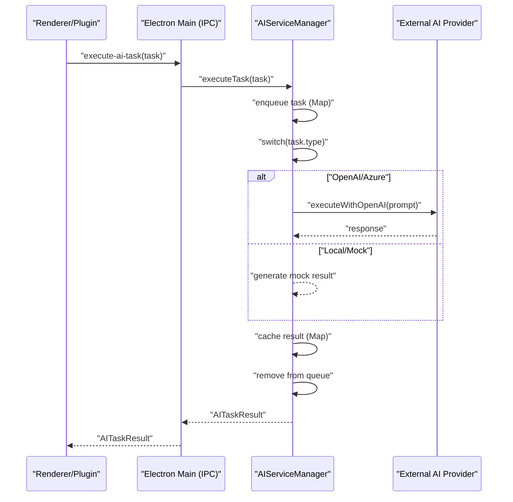
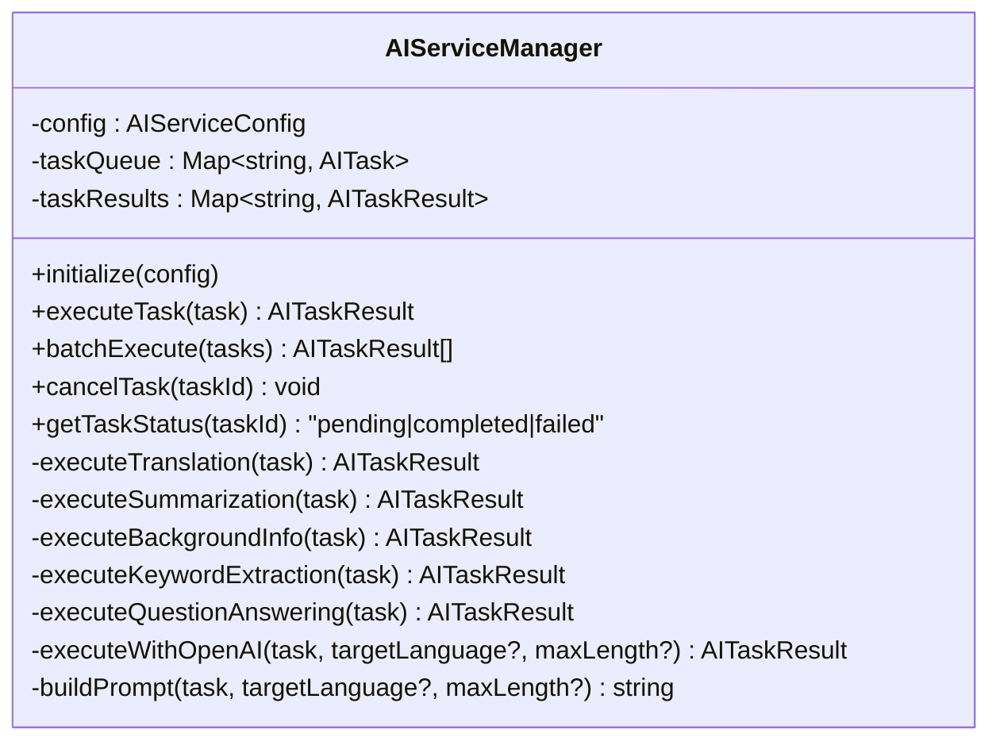
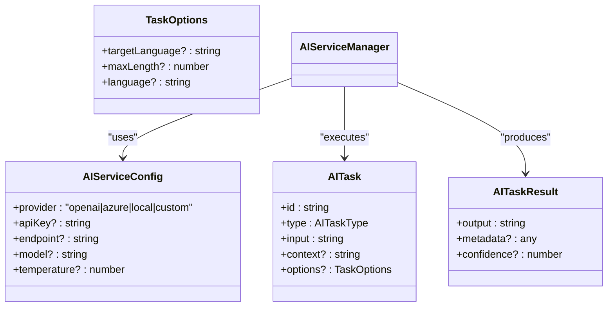
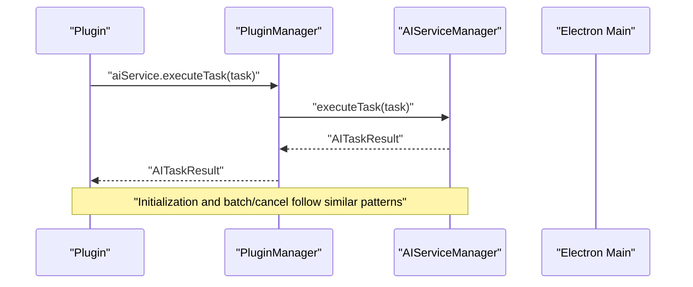
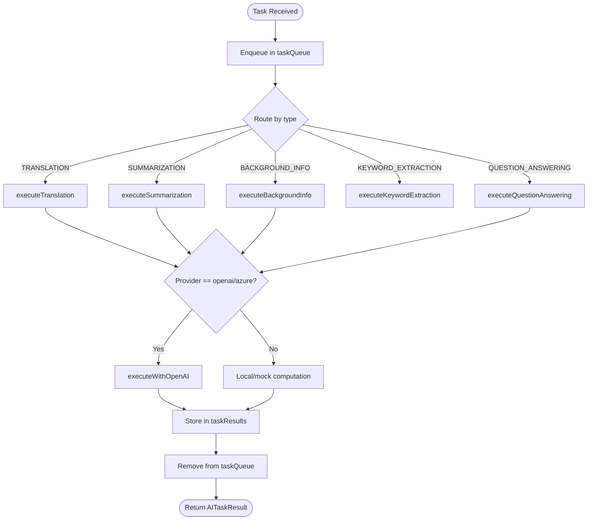
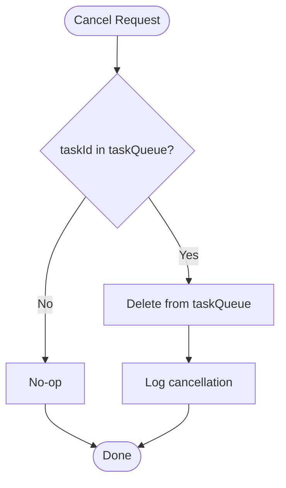
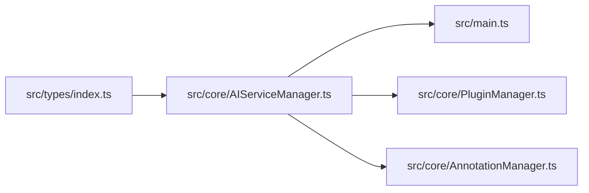

# AI Task Management

<cite>
**Referenced Files in This Document**
- [src/main.ts](file://src/main.ts)
- [src/core/AIServiceManager.ts](file://src/core/AIServiceManager.ts)
- [src/core/AnnotationManager.ts](file://src/core/AnnotationManager.ts)
- [src/core/PluginManager.ts](file://src/core/PluginManager.ts)
- [src/types/index.ts](file://src/types/index.ts)
- [DESIGN.md](file://DESIGN.md)
- [README.md](file://README.md)
- [package.json](file://package.json)
</cite>

## Table of Contents
1. [Introduction](#introduction)
2. [Project Structure](#project-structure)
3. [Core Components](#core-components)
4. [Architecture Overview](#architecture-overview)
5. [Detailed Component Analysis](#detailed-component-analysis)
6. [Dependency Analysis](#dependency-analysis)
7. [Performance Considerations](#performance-considerations)
8. [Troubleshooting Guide](#troubleshooting-guide)
9. [Conclusion](#conclusion)
10. [Appendices](#appendices)

## Introduction
This document explains the AI task execution and management patterns implemented in the project. It covers supported AI task types, the lifecycle from creation to completion, batch processing, cancellation, error handling, queue management, result caching, performance considerations, and debugging techniques. The system centers around an AI service manager that orchestrates tasks, integrates with external providers (OpenAI/Azure), and exposes a simple API for plugins and the renderer process.

## Project Structure
The AI task management is implemented primarily in the Electron main process and core modules:
- Electron main process initializes services and exposes IPC handlers for AI task execution.
- AIServiceManager encapsulates task orchestration, queueing, execution, and result caching.
- Types define the AI task model, task types, and service API contracts.
- PluginManager exposes the AI service API to plugins and manages plugin lifecycle.
- AnnotationManager persists annotations and supports exporting them.

**Diagram sources**
- [src/main.ts:137-142](file://src/main.ts#L137-L142)
- [src/core/AIServiceManager.ts:1-214](file://src/core/AIServiceManager.ts#L1-L214)
- [src/core/AnnotationManager.ts:1-172](file://src/core/AnnotationManager.ts#L1-L172)
- [src/core/PluginManager.ts:1-247](file://src/core/PluginManager.ts#L1-L247)
- [src/types/index.ts:49-84](file://src/types/index.ts#L49-L84)

**Section sources**
- [src/main.ts:45-60](file://src/main.ts#L45-L60)
- [src/core/AIServiceManager.ts:1-214](file://src/core/AIServiceManager.ts#L1-L214)
- [src/types/index.ts:49-84](file://src/types/index.ts#L49-L84)

## Core Components
- AIServiceManager: Initializes AI configuration, executes tasks by type, maintains a task queue and results cache, supports batch execution, cancellation, and status checks.
- AIServiceConfig, AITask, AITaskResult, AITaskType: Strongly typed contracts for AI service configuration, task definition, and result structure.
- PluginManager: Exposes an AI service API to plugins and manages plugin lifecycle.
- AnnotationManager: Manages annotations and persistence; integrates with AI results to create annotations.

Key responsibilities:
- Task creation and routing to specific task executors.
- Queue management and result caching.
- Batch execution with per-task error handling.
- Cancellation of pending tasks.
- Status reporting for task lifecycle.

**Section sources**
- [src/core/AIServiceManager.ts:3-214](file://src/core/AIServiceManager.ts#L3-L214)
- [src/types/index.ts:49-84](file://src/types/index.ts#L49-L84)
- [src/core/PluginManager.ts:213-219](file://src/core/PluginManager.ts#L213-L219)
- [src/core/AnnotationManager.ts:46-84](file://src/core/AnnotationManager.ts#L46-L84)

## Architecture Overview
The AI task execution pipeline connects the renderer process and plugins to the Electron main process, which delegates to the AI service manager.

**Diagram sources**
- [src/main.ts:137-142](file://src/main.ts#L137-L142)
- [src/core/AIServiceManager.ts:13-56](file://src/core/AIServiceManager.ts#L13-L56)
- [src/core/AIServiceManager.ts:174-193](file://src/core/AIServiceManager.ts#L174-L193)

## Detailed Component Analysis

### AIServiceManager
Responsibilities:
- Initialization with provider configuration.
- Task routing by type to specialized executors.
- Queue management using an in-memory map keyed by task ID.
- Result caching using an in-memory map keyed by task ID.
- Batch execution with per-task error handling.
- Cancellation of pending tasks.
- Status reporting for pending/completed/failed states.

Supported AI task types:
- TRANSLATION: Translates input text to a target language.
- SUMMARIZATION: Generates a concise summary with optional length constraint.
- BACKGROUND_INFO: Retrieves contextual background information for an entity.
- KEYWORD_EXTRACTION: Extracts frequent terms from input text.
- QUESTION_ANSWERING: Answers a question given context.

Execution flow:
- Enqueue task by ID.
- Route to executor based on task type.
- For OpenAI/Azure, build a prompt and return a mock response (placeholder for real API).
- For local/mock, return deterministic results.
- Cache result and remove from queue.
- On error, remove from queue and propagate error.

Batch execution:
- Iterates tasks sequentially, executing each via executeTask.
- On failure, pushes a partial result with error metadata.

Cancellation:
- Removes task from queue if present.

Status monitoring:
- Pending if in queue.
- Completed if in results cache.
- Failed otherwise.

**Diagram sources**
- [src/core/AIServiceManager.ts:3-214](file://src/core/AIServiceManager.ts#L3-L214)

**Section sources**
- [src/core/AIServiceManager.ts:8-56](file://src/core/AIServiceManager.ts#L8-L56)
- [src/core/AIServiceManager.ts:58-75](file://src/core/AIServiceManager.ts#L58-L75)
- [src/core/AIServiceManager.ts:77-92](file://src/core/AIServiceManager.ts#L77-L92)
- [src/core/AIServiceManager.ts:96-171](file://src/core/AIServiceManager.ts#L96-L171)
- [src/core/AIServiceManager.ts:174-212](file://src/core/AIServiceManager.ts#L174-L212)

### Task Types and Options
- AITaskType: Enumerates supported task categories.
- AITask: Defines task identity, type, input text, optional context, and options.
- TaskOptions: Provides provider-specific options such as targetLanguage and maxLength.
- AITaskResult: Standardized result with output and optional metadata/confidence.

**Diagram sources**
- [src/types/index.ts:49-84](file://src/types/index.ts#L49-L84)
- [src/core/AIServiceManager.ts:1-11](file://src/core/AIServiceManager.ts#L1-L11)

**Section sources**
- [src/types/index.ts:57-84](file://src/types/index.ts#L57-L84)

### Plugin Integration and IPC
- Electron main process exposes an IPC handler to execute AI tasks.
- PluginManager creates an AI service API for plugins and forwards calls to AIServiceManager.
- Plugins can call initialize, executeTask, batchExecute, and cancelTask.

**Diagram sources**
- [src/core/PluginManager.ts:213-219](file://src/core/PluginManager.ts#L213-L219)
- [src/core/AIServiceManager.ts:13-56](file://src/core/AIServiceManager.ts#L13-L56)
- [src/main.ts:137-142](file://src/main.ts#L137-L142)

**Section sources**
- [src/core/PluginManager.ts:213-219](file://src/core/PluginManager.ts#L213-L219)
- [src/main.ts:137-142](file://src/main.ts#L137-L142)

### Task Execution Lifecycle
- Creation: Task is constructed with id, type, input, optional context/options.
- Enqueue: Task is stored in the internal queue map.
- Dispatch: Switch routes to the appropriate executor based on task type.
- Execution:
  - For OpenAI/Azure, build a prompt and return a mock response (placeholder).
  - For local/mock, compute deterministic results.
- Cache: Store result in results map keyed by task ID.
- Dequeue: Remove task from queue.
- Completion: Return result to caller.

**Diagram sources**
- [src/core/AIServiceManager.ts:13-56](file://src/core/AIServiceManager.ts#L13-L56)
- [src/core/AIServiceManager.ts:96-171](file://src/core/AIServiceManager.ts#L96-L171)
- [src/core/AIServiceManager.ts:174-193](file://src/core/AIServiceManager.ts#L174-L193)

**Section sources**
- [src/core/AIServiceManager.ts:13-56](file://src/core/AIServiceManager.ts#L13-L56)

### Batch Processing
- AIServiceManager.batchExecute iterates tasks sequentially.
- Each task is executed via executeTask.
- On success, result is appended to the results array.
- On failure, a partial result with error metadata is appended to preserve order.

Practical example pattern:
- Prepare an array of AITask objects with distinct ids.
- Call batchExecute(tasks).
- Iterate results and handle per-result metadata.

**Section sources**
- [src/core/AIServiceManager.ts:58-75](file://src/core/AIServiceManager.ts#L58-L75)

### Task Cancellation and Status Monitoring
- Cancellation: cancelTask removes a task from the queue if present.
- Status: getTaskStatus reports pending/completed/failed based on queue/results presence.

**Diagram sources**
- [src/core/AIServiceManager.ts:77-82](file://src/core/AIServiceManager.ts#L77-L82)

**Section sources**
- [src/core/AIServiceManager.ts:77-92](file://src/core/AIServiceManager.ts#L77-L92)

### Result Caching and Retrieval
- Results are cached in an in-memory map keyed by task ID.
- Retrieval is implicit via the execution result; there is no separate retrieval API in the current implementation.
- To reuse results for repeated tasks, ensure the task id remains consistent and re-execute the same task.

**Section sources**
- [src/core/AIServiceManager.ts:6-7](file://src/core/AIServiceManager.ts#L6-L7)
- [src/core/AIServiceManager.ts:48-51](file://src/core/AIServiceManager.ts#L48-L51)

### Practical Examples

- Example: Translation task
  - Construct AITask with type TRANSLATION, input text, and options.targetLanguage.
  - Call executeTask or batchExecute.
  - Use result.output for the translated text.

- Example: Summarization task
  - Construct AITask with type SUMMARIZATION, input text, and options.maxLength.
  - Execute and process result.output.

- Example: Background information task
  - Construct AITask with type BACKGROUND_INFO, input entity, and optional context.
  - Execute and use result.output for background information.

- Example: Keyword extraction task
  - Construct AITask with type KEYWORD_EXTRACTION and input text.
  - Execute and parse result.output (JSON string of keywords).

- Example: Question answering task
  - Construct AITask with type QUESTION_ANSWERING, input question, and context.
  - Execute and use result.output for the answer.

- Example: Batch execution
  - Build an array of tasks with distinct ids.
  - Call batchExecute and iterate results.

- Example: Cancellation
  - Call cancelTask(taskId) before execution completes.

- Example: Status monitoring
  - Call getTaskStatus(taskId) to determine pending/completed/failed.

**Section sources**
- [src/core/AIServiceManager.ts:96-171](file://src/core/AIServiceManager.ts#L96-L171)
- [src/core/AIServiceManager.ts:58-75](file://src/core/AIServiceManager.ts#L58-L75)
- [src/core/AIServiceManager.ts:77-92](file://src/core/AIServiceManager.ts#L77-L92)
- [src/types/index.ts:57-84](file://src/types/index.ts#L57-L84)

## Dependency Analysis
- AIServiceManager depends on types for task/result definitions.
- PluginManager wraps AIServiceManager to expose a plugin-friendly API.
- Electron main process wires IPC handlers to AIServiceManager.
- AnnotationManager persists annotations and can be used to store AI outputs.

**Diagram sources**
- [src/types/index.ts:49-84](file://src/types/index.ts#L49-L84)
- [src/core/AIServiceManager.ts:1-11](file://src/core/AIServiceManager.ts#L1-L11)
- [src/main.ts:137-142](file://src/main.ts#L137-L142)
- [src/core/PluginManager.ts:213-219](file://src/core/PluginManager.ts#L213-L219)
- [src/core/AnnotationManager.ts:46-84](file://src/core/AnnotationManager.ts#L46-L84)

**Section sources**
- [src/core/AIServiceManager.ts:1-11](file://src/core/AIServiceManager.ts#L1-L11)
- [src/core/PluginManager.ts:213-219](file://src/core/PluginManager.ts#L213-L219)
- [src/main.ts:137-142](file://src/main.ts#L137-L142)

## Performance Considerations
- Current implementation uses in-memory maps for queue and results. This is efficient for single-process scenarios but does not persist across restarts.
- Batch execution runs sequentially; concurrency is not implemented. For improved throughput, consider:
  - Limiting concurrent executions with a semaphore.
  - Using worker threads or queues for heavy tasks.
- Memory management:
  - Monitor queue and results maps sizes; consider eviction policies for long-running sessions.
- Concurrent execution limits:
  - Introduce a configurable concurrency cap to prevent resource exhaustion.
- Provider selection:
  - Prefer local/mock for low-latency, offline scenarios; use OpenAI/Azure for higher quality at the cost of network latency.

[No sources needed since this section provides general guidance]

## Troubleshooting Guide
Common issues and remedies:
- AI Service not initialized:
  - Ensure initialize(config) is called before executeTask.
  - Verify provider configuration (provider, apiKey, endpoint, model).

- Unknown task type:
  - Confirm task.type matches supported AITaskType values.

- Task not found for cancellation/status:
  - Cancellation only works for pending tasks still in the queue.
  - Status reflects pending/completed/failed; if absent from both, treat as failed.

- Batch failures:
  - batchExecute continues on errors; inspect per-result metadata for error details.

- OpenAI/Azure integration:
  - The current implementation returns mock responses. Replace the placeholder with actual API calls.

Debugging techniques:
- Enable development mode to open DevTools in Electron main process.
- Add logging around task enqueue/dequeue and result caching.
- Validate task IDs are unique and consistent for repeated tasks.
- Monitor queue and results maps sizes to detect leaks.

**Section sources**
- [src/core/AIServiceManager.ts:8-11](file://src/core/AIServiceManager.ts#L8-L11)
- [src/core/AIServiceManager.ts:44-46](file://src/core/AIServiceManager.ts#L44-L46)
- [src/core/AIServiceManager.ts:77-92](file://src/core/AIServiceManager.ts#L77-L92)
- [src/main.ts:33-35](file://src/main.ts#L33-L35)

## Conclusion
The AI task management system provides a clean, extensible foundation for executing translation, summarization, background information retrieval, keyword extraction, and question answering tasks. It supports batch execution, cancellation, and status monitoring with in-memory queueing and caching. The design cleanly separates concerns between task orchestration, provider integration, and plugin exposure, enabling future enhancements such as concurrency limits, persistent storage, and real AI provider integrations.

[No sources needed since this section summarizes without analyzing specific files]

## Appendices

### API Reference Summary
- AIServiceManager
  - initialize(config)
  - executeTask(task)
  - batchExecute(tasks)
  - cancelTask(taskId)
  - getTaskStatus(taskId)

- Types
  - AIServiceConfig, AITask, AITaskResult, AITaskType, TaskOptions

- IPC and Plugin API
  - Electron main IPC handler for execute-ai-task
  - PluginManager exposes aiService API to plugins

**Section sources**
- [src/core/AIServiceManager.ts:8-92](file://src/core/AIServiceManager.ts#L8-L92)
- [src/types/index.ts:49-84](file://src/types/index.ts#L49-L84)
- [src/main.ts:137-142](file://src/main.ts#L137-L142)
- [src/core/PluginManager.ts:213-219](file://src/core/PluginManager.ts#L213-L219)