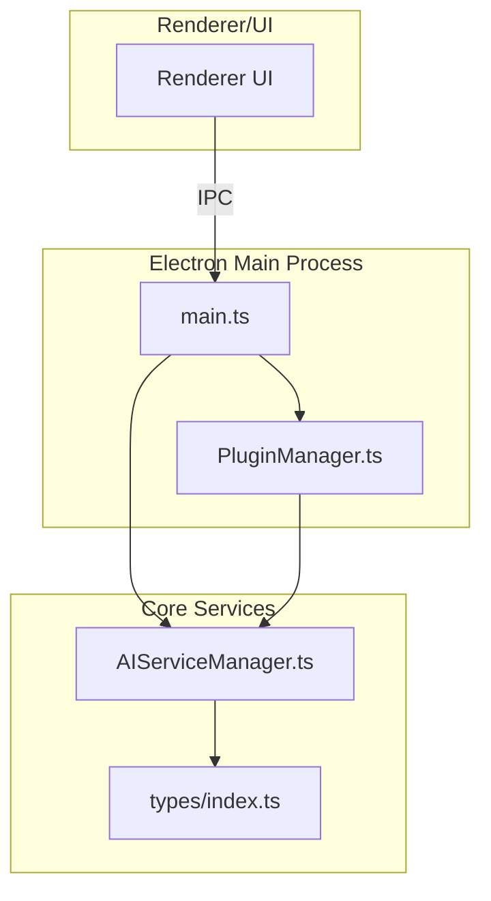
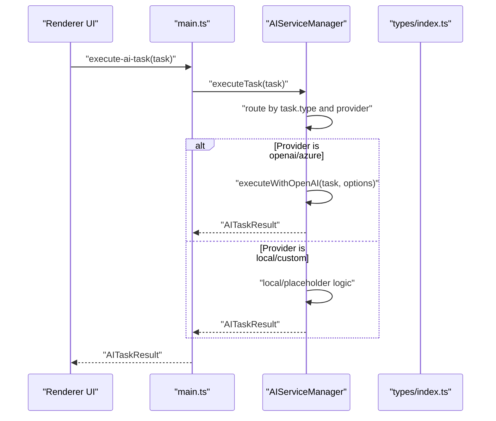
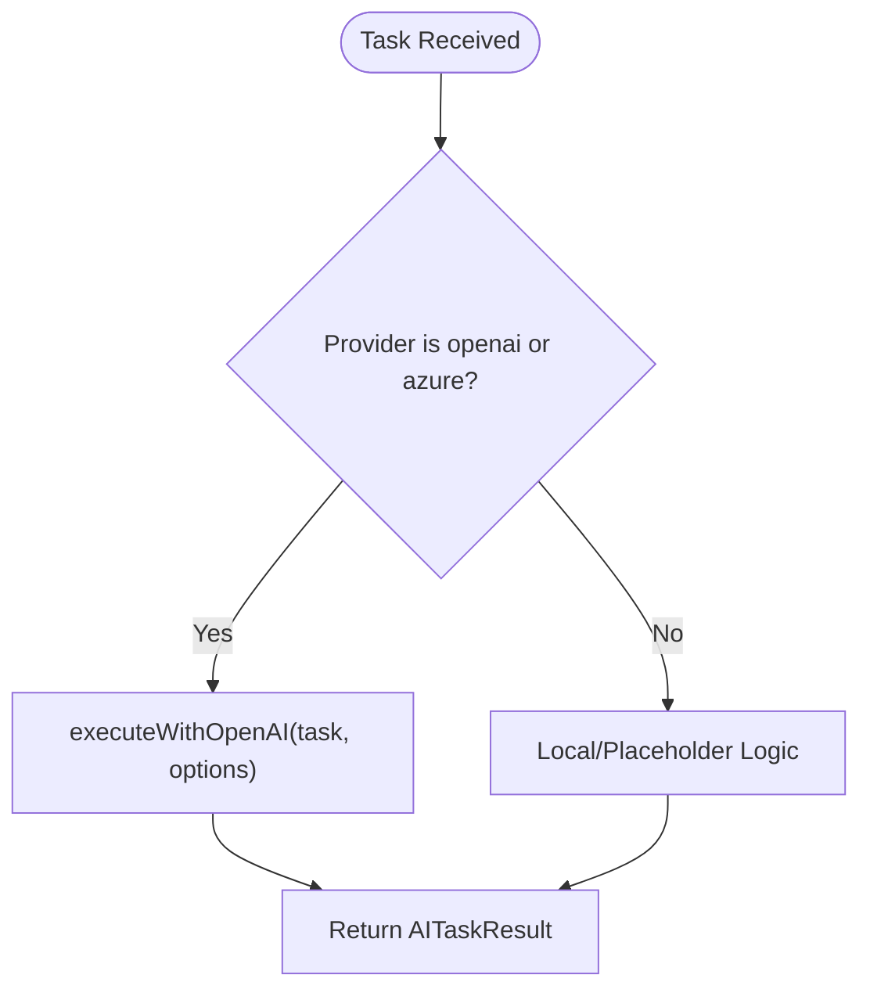
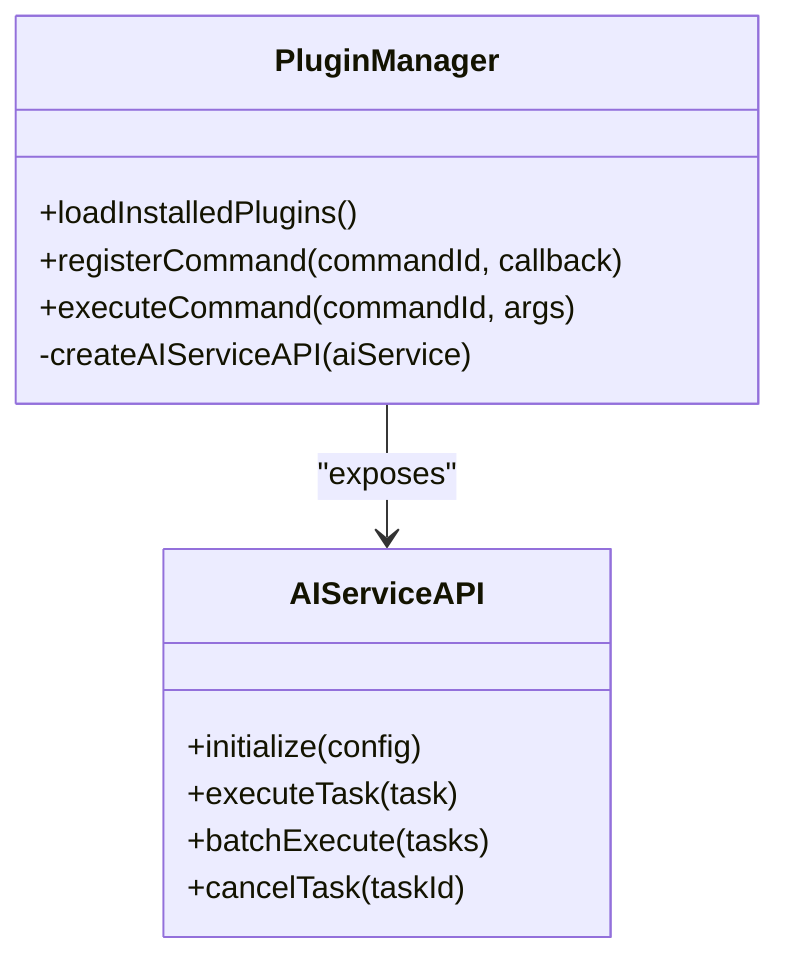
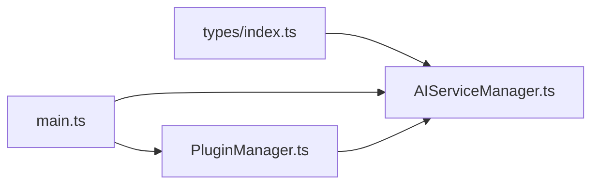

# Supported AI Providers

<cite>
**Referenced Files in This Document**
- [AIServiceManager.ts](file://src/core/AIServiceManager.ts)
- [index.ts](file://src/types/index.ts)
- [main.ts](file://src/main.ts)
- [PluginManager.ts](file://src/core/PluginManager.ts)
- [README.md](file://README.md)
- [DESIGN.md](file://DESIGN.md)
- [PLUGIN-GUIDE.md](file://PLUGIN-GUIDE.md)
- [package.json](file://package.json)
</cite>

## Table of Contents
1. [Introduction](#introduction)
2. [Project Structure](#project-structure)
3. [Core Components](#core-components)
4. [Architecture Overview](#architecture-overview)
5. [Detailed Component Analysis](#detailed-component-analysis)
6. [Dependency Analysis](#dependency-analysis)
7. [Performance Considerations](#performance-considerations)
8. [Troubleshooting Guide](#troubleshooting-guide)
9. [Conclusion](#conclusion)
10. [Appendices](#appendices)

## Introduction
This document explains how AI providers are configured and integrated in the application. It covers the supported providers (OpenAI, Azure AI services, local model alternatives), provider-specific configuration options, API key management, and endpoint setup. It also clarifies the differences between cloud-based providers and local model execution, provides practical configuration examples, describes fallback mechanisms, and outlines rate limiting, cost optimization, and troubleshooting strategies.

## Project Structure
The AI service integration centers around a dedicated service manager and shared type definitions. The Electron main process initializes the AI service and exposes it to the renderer via IPC. Plugins consume the AI service through a stable API.

**Diagram sources**
- [main.ts:45-60](file://src/main.ts#L45-L60)
- [PluginManager.ts:21-35](file://src/core/PluginManager.ts#L21-L35)
- [AIServiceManager.ts:3-11](file://src/core/AIServiceManager.ts#L3-L11)
- [index.ts:49-55](file://src/types/index.ts#L49-L55)

**Section sources**
- [main.ts:45-60](file://src/main.ts#L45-L60)
- [PluginManager.ts:21-35](file://src/core/PluginManager.ts#L21-L35)
- [AIServiceManager.ts:3-11](file://src/core/AIServiceManager.ts#L3-L11)
- [index.ts:49-55](file://src/types/index.ts#L49-L55)

## Core Components
- AIServiceManager: Orchestrates AI tasks and routes them to provider-specific implementations. It supports OpenAI and Azure for advanced tasks and falls back to local/placeholder logic for others.
- AIServiceConfig: Defines provider, API key, endpoint, model, and temperature.
- AITask and AITaskType: Define the task types (translation, summarization, background info, keyword extraction, question answering) and their options.
- PluginManager: Exposes the AI service API to plugins and manages plugin lifecycle.

Key provider routing:
- OpenAI and Azure: Advanced tasks route to a unified OpenAI integration path.
- Local/custom: Tasks fall back to lightweight local logic or placeholder responses.

**Section sources**
- [AIServiceManager.ts:96-171](file://src/core/AIServiceManager.ts#L96-L171)
- [AIServiceManager.ts:174-193](file://src/core/AIServiceManager.ts#L174-L193)
- [index.ts:49-84](file://src/types/index.ts#L49-L84)
- [PluginManager.ts:213-219](file://src/core/PluginManager.ts#L213-L219)

## Architecture Overview
The AI service is initialized with a configuration and executed via a task-based API. The renderer invokes IPC handlers to execute tasks, which are processed by the service manager.

**Diagram sources**
- [main.ts:137-142](file://src/main.ts#L137-L142)
- [AIServiceManager.ts:13-56](file://src/core/AIServiceManager.ts#L13-L56)
- [AIServiceManager.ts:96-171](file://src/core/AIServiceManager.ts#L96-L171)
- [AIServiceManager.ts:174-193](file://src/core/AIServiceManager.ts#L174-L193)

## Detailed Component Analysis

### AIServiceManager
Responsibilities:
- Initialize with AIServiceConfig
- Route tasks to provider-specific logic
- Execute translation, summarization, background info, keyword extraction, and question answering
- Fallback to local logic when provider is not OpenAI/Azure
- Build prompts for OpenAI-compatible tasks

Provider routing highlights:
- Translation, summarization, background info, and question answering delegate to a unified OpenAI integration path when provider is openai or azure.
- Keyword extraction and summarization include a simple local implementation for non-cloud providers.

**Diagram sources**
- [AIServiceManager.ts:96-171](file://src/core/AIServiceManager.ts#L96-L171)
- [AIServiceManager.ts:174-193](file://src/core/AIServiceManager.ts#L174-L193)

**Section sources**
- [AIServiceManager.ts:3-11](file://src/core/AIServiceManager.ts#L3-L11)
- [AIServiceManager.ts:96-171](file://src/core/AIServiceManager.ts#L96-L171)
- [AIServiceManager.ts:174-193](file://src/core/AIServiceManager.ts#L174-L193)

### AIServiceConfig and Task Types
- AIServiceConfig: provider, apiKey, endpoint, model, temperature
- AITaskType: translation, summarization, background_info, keyword_extraction, question_answering
- AITask: id, type, input, context, options
- AITaskResult: output, metadata, confidence

These types define the contract for provider configuration and task execution.

**Section sources**
- [index.ts:49-84](file://src/types/index.ts#L49-L84)

### Plugin Integration
Plugins receive an AI service API through the plugin context and can initialize the service and execute tasks. The PluginManager exposes a clean API surface to plugins.

**Diagram sources**
- [PluginManager.ts:213-219](file://src/core/PluginManager.ts#L213-L219)
- [PluginManager.ts:134-142](file://src/core/PluginManager.ts#L134-L142)

**Section sources**
- [PluginManager.ts:213-219](file://src/core/PluginManager.ts#L213-L219)
- [PluginManager.ts:134-142](file://src/core/PluginManager.ts#L134-L142)

## Dependency Analysis
- AIServiceManager depends on AIServiceConfig and AITask types.
- main.ts initializes AIServiceManager and exposes IPC handlers for task execution.
- PluginManager creates an AI service API for plugins and manages plugin lifecycle.

**Diagram sources**
- [index.ts:49-84](file://src/types/index.ts#L49-L84)
- [AIServiceManager.ts:1-11](file://src/core/AIServiceManager.ts#L1-L11)
- [main.ts:45-60](file://src/main.ts#L45-L60)
- [PluginManager.ts:21-35](file://src/core/PluginManager.ts#L21-L35)

**Section sources**
- [index.ts:49-84](file://src/types/index.ts#L49-L84)
- [AIServiceManager.ts:1-11](file://src/core/AIServiceManager.ts#L1-L11)
- [main.ts:45-60](file://src/main.ts#L45-L60)
- [PluginManager.ts:21-35](file://src/core/PluginManager.ts#L21-L35)

## Performance Considerations
- Request batching: The service supports batchExecute to reduce overhead.
- Caching: Consider caching AI responses for repeated inputs to reduce latency and cost.
- Local fallback: Non-cloud providers use lightweight local logic to avoid network calls.
- Temperature and model tuning: Adjust temperature and model to balance quality and speed.

[No sources needed since this section provides general guidance]

## Troubleshooting Guide
Common issues and resolutions:
- Authentication failures:
  - Verify provider is set to openai or azure and apiKey is present.
  - Ensure the API key is valid and has permissions for the chosen model.
- Network connectivity problems:
  - Confirm endpoint is reachable and not blocked by firewall/proxy.
  - For Azure, ensure the endpoint matches the configured region and resource.
- Quota exceeded errors:
  - Reduce request frequency or increase quotas.
  - Enable local fallback for non-critical tasks.
- Task initialization errors:
  - Ensure AIServiceManager is initialized with a valid AIServiceConfig before executing tasks.

Operational checks:
- Use getTaskStatus to monitor pending/completed/failed tasks.
- Inspect task queue and results maps for diagnostics.

**Section sources**
- [AIServiceManager.ts:13-16](file://src/core/AIServiceManager.ts#L13-L16)
- [AIServiceManager.ts:84-92](file://src/core/AIServiceManager.ts#L84-L92)

## Conclusion
The AI service architecture cleanly separates provider-specific logic behind a unified task interface. OpenAI and Azure are routed to a shared integration path, while local/custom providers fall back to lightweight logic. The design supports easy switching between providers and secure credential management through the configuration object.

[No sources needed since this section summarizes without analyzing specific files]

## Appendices

### Supported AI Providers and Configuration Options
- Providers:
  - openai: Cloud provider with OpenAI-compatible integration path.
  - azure: Cloud provider with Azure OpenAI Service integration path.
  - local: Local model or placeholder logic.
  - custom: Custom provider interface.
- Configuration fields:
  - provider: One of the supported values.
  - apiKey: API key for cloud providers.
  - endpoint: Custom endpoint for cloud providers (e.g., Azure).
  - model: Model identifier (e.g., gpt-3.5-turbo).
  - temperature: Optional parameter for model behavior.

**Section sources**
- [index.ts:49-55](file://src/types/index.ts#L49-L55)
- [DESIGN.md:44-49](file://DESIGN.md#L44-L49)

### Practical Configuration Examples
- OpenAI configuration:
  - provider: openai
  - apiKey: your OpenAI API key
  - model: gpt-3.5-turbo
- Azure configuration:
  - provider: azure
  - apiKey: your Azure OpenAI API key
  - endpoint: Azure resource endpoint
  - model: model deployment name
- Local configuration:
  - provider: local
  - Uses local/placeholder logic for tasks

**Section sources**
- [README.md:120-139](file://README.md#L120-L139)
- [DESIGN.md:44-49](file://DESIGN.md#L44-L49)

### Switching Providers Dynamically
- Initialize the AI service with a new AIServiceConfig to switch providers.
- Ensure the new provider’s credentials and endpoint are valid before switching.
- Cancel or re-execute tasks as needed after switching.

**Section sources**
- [AIServiceManager.ts:8-11](file://src/core/AIServiceManager.ts#L8-L11)
- [PluginManager.ts:213-219](file://src/core/PluginManager.ts#L213-L219)

### Rate Limiting and Cost Optimization
- Batch tasks to minimize API calls.
- Cache results for repeated inputs.
- Prefer local fallback for low-priority tasks.
- Monitor provider quotas and adjust model/temperature accordingly.

[No sources needed since this section provides general guidance]

### Security and Credential Management
- Store apiKey securely (avoid hardcoding).
- Use environment variables or secure vaults.
- Restrict endpoint access and rotate keys periodically.

[No sources needed since this section provides general guidance]