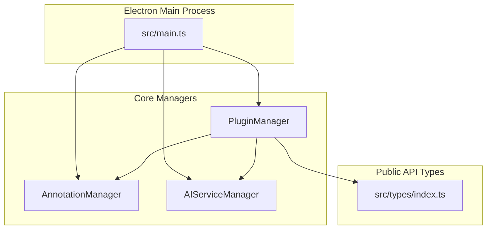
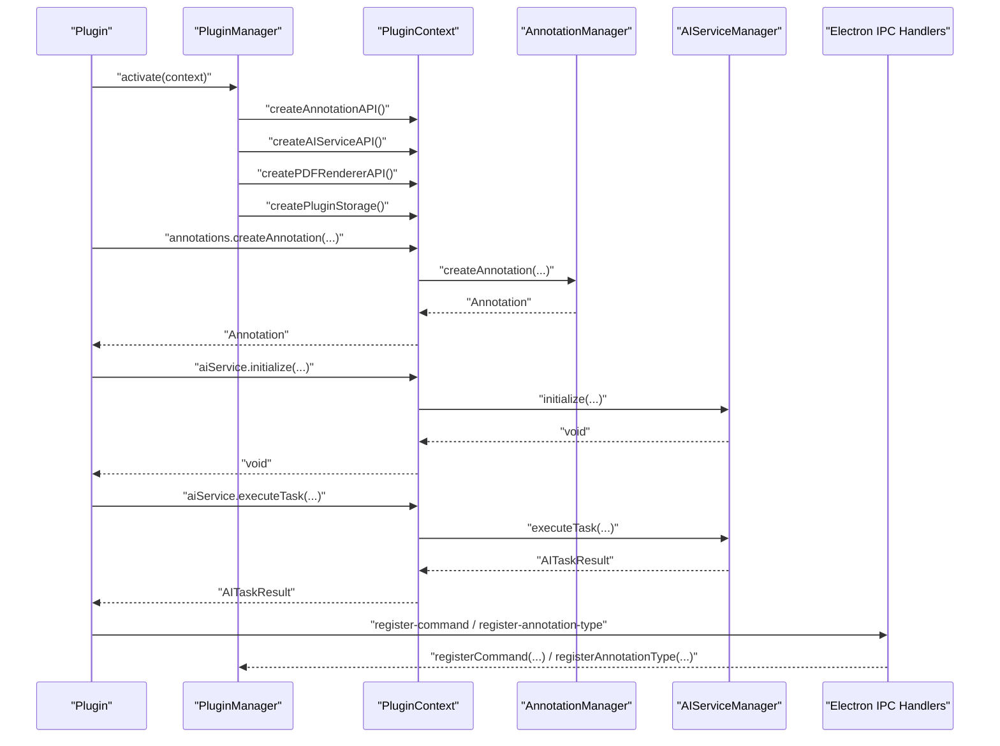
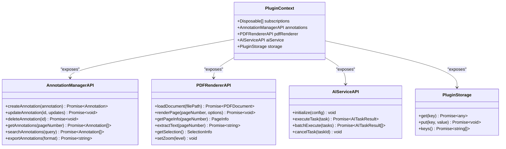
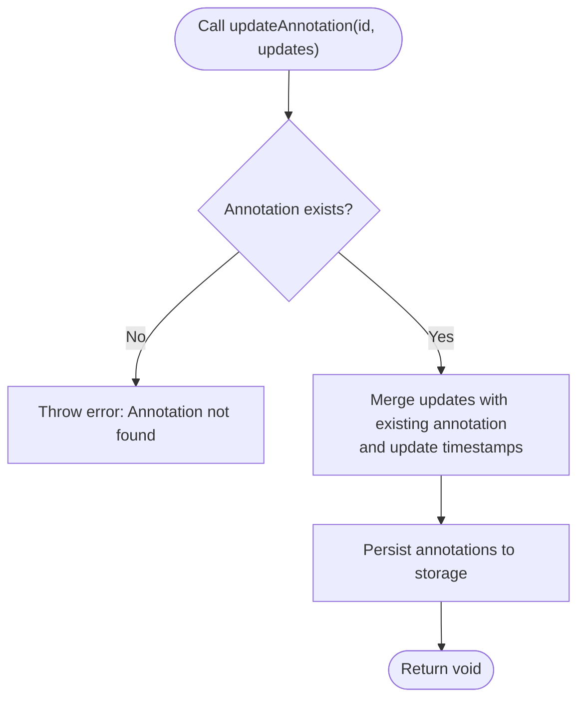
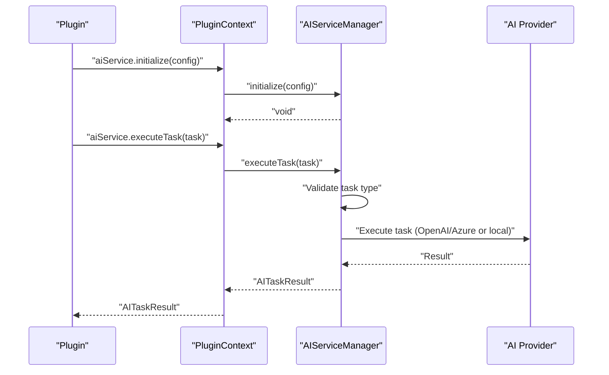
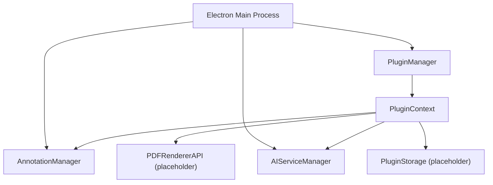

# API Reference

<cite>
**Referenced Files in This Document**
- [src/types/index.ts](file://src/types/index.ts)
- [src/core/AnnotationManager.ts](file://src/core/AnnotationManager.ts)
- [src/core/AIServiceManager.ts](file://src/core/AIServiceManager.ts)
- [src/core/PluginManager.ts](file://src/core/PluginManager.ts)
- [src/main.ts](file://src/main.ts)
- [README.md](file://README.md)
- [PLUGIN-GUIDE.md](file://PLUGIN-GUIDE.md)
- [DESIGN.md](file://DESIGN.md)
- [package.json](file://package.json)
</cite>

## Table of Contents
1. [Introduction](#introduction)
2. [Project Structure](#project-structure)
3. [Core Components](#core-components)
4. [Architecture Overview](#architecture-overview)
5. [Detailed Component Analysis](#detailed-component-analysis)
6. [Dependency Analysis](#dependency-analysis)
7. [Performance Considerations](#performance-considerations)
8. [Troubleshooting Guide](#troubleshooting-guide)
9. [Conclusion](#conclusion)
10. [Appendices](#appendices)

## Introduction
This document provides a comprehensive API reference for the SciPDFReader application programming interfaces. It covers the PluginContext API, Annotation API, AI Service API, PDF Renderer API, and Plugin Storage API. It also includes TypeScript type definitions, error handling patterns, validation requirements, and practical usage examples for plugin developers and advanced users.

## Project Structure
SciPDFReader is an Electron-based desktop application with a modular architecture:
- Electron main process initializes managers and exposes IPC handlers.
- Core modules implement annotation management, AI service orchestration, and plugin lifecycle.
- Types define the public API contracts and shared data structures.
- Plugin system allows third-party extensions to integrate with the application.

**Diagram sources**
- [src/main.ts:44-59](file://src/main.ts#L44-L59)
- [src/core/AnnotationManager.ts:6-19](file://src/core/AnnotationManager.ts#L6-L19)
- [src/core/AIServiceManager.ts:3-11](file://src/core/AIServiceManager.ts#L3-L11)
- [src/core/PluginManager.ts:15-35](file://src/core/PluginManager.ts#L15-L35)
- [src/types/index.ts:136-177](file://src/types/index.ts#L136-L177)

**Section sources**
- [README.md:13-29](file://README.md#L13-L29)
- [package.json:1-56](file://package.json#L1-L56)

## Core Components
This section summarizes the primary APIs and their responsibilities:
- PluginContext: Provides access to annotations, PDF renderer, AI service, and storage for plugins.
- AnnotationManagerAPI: Manages creation, retrieval, update, deletion, search, and export of annotations.
- AIServiceAPI: Initializes AI providers, executes tasks, batches tasks, and cancels tasks.
- PDFRendererAPI: Loads documents, renders pages, extracts text, manages selections, and controls zoom.
- PluginStorage: Provides key-value storage for plugins.

Key type definitions include enums and interfaces for annotations, AI tasks, PDF document metadata, and renderer options.

**Section sources**
- [src/types/index.ts:136-177](file://src/types/index.ts#L136-L177)
- [src/types/index.ts:36-47](file://src/types/index.ts#L36-L47)
- [src/types/index.ts:49-84](file://src/types/index.ts#L49-L84)
- [src/types/index.ts:179-223](file://src/types/index.ts#L179-L223)

## Architecture Overview
The PluginContext API surfaces a unified interface to plugins. PluginManager constructs the context and delegates to core managers. IPC handlers in the main process coordinate with managers for renderer-side operations.

**Diagram sources**
- [src/core/PluginManager.ts:202-245](file://src/core/PluginManager.ts#L202-L245)
- [src/core/AnnotationManager.ts:46-59](file://src/core/AnnotationManager.ts#L46-L59)
- [src/core/AIServiceManager.ts:8-11](file://src/core/AIServiceManager.ts#L8-L11)
- [src/core/AIServiceManager.ts:13-56](file://src/core/AIServiceManager.ts#L13-L56)
- [src/main.ts:107-117](file://src/main.ts#L107-L117)

**Section sources**
- [src/core/PluginManager.ts:15-35](file://src/core/PluginManager.ts#L15-L35)
- [src/main.ts:44-59](file://src/main.ts#L44-L59)

## Detailed Component Analysis

### PluginContext API
The PluginContext is the central API surface for plugins. It exposes:
- subscriptions: An array of Disposable objects for resource cleanup.
- annotations: AnnotationManagerAPI for annotation operations.
- pdfRenderer: PDFRendererAPI for document rendering and text extraction.
- aiService: AIServiceAPI for AI task execution.
- storage: PluginStorage for persistent key-value storage.

**Diagram sources**
- [src/types/index.ts:136-177](file://src/types/index.ts#L136-L177)

**Section sources**
- [src/types/index.ts:136-177](file://src/types/index.ts#L136-L177)

### Annotation API Reference
The Annotation API enables plugins to manage annotations:
- createAnnotation: Creates a new annotation with a generated ID and timestamps.
- updateAnnotation: Updates an existing annotation by ID.
- deleteAnnotation: Removes an annotation by ID.
- getAnnotations: Retrieves annotations for a given page number.
- searchAnnotations: Searches annotations by content or annotation text.
- exportAnnotations: Exports annotations in JSON, Markdown, or HTML formats.

Validation and error handling:
- Throws if an annotation does not exist during update/delete.
- Export formats are validated; unsupported formats fall back to JSON.

**Diagram sources**
- [src/core/AnnotationManager.ts:61-70](file://src/core/AnnotationManager.ts#L61-L70)

**Section sources**
- [src/types/index.ts:148-155](file://src/types/index.ts#L148-L155)
- [src/core/AnnotationManager.ts:46-59](file://src/core/AnnotationManager.ts#L46-L59)
- [src/core/AnnotationManager.ts:61-70](file://src/core/AnnotationManager.ts#L61-L70)
- [src/core/AnnotationManager.ts:77-84](file://src/core/AnnotationManager.ts#L77-L84)
- [src/core/AnnotationManager.ts:86-94](file://src/core/AnnotationManager.ts#L86-L94)
- [src/core/AnnotationManager.ts:96-112](file://src/core/AnnotationManager.ts#L96-L112)

### AI Service API Reference
The AI Service API orchestrates AI tasks:
- initialize: Configures the AI provider and credentials.
- executeTask: Executes a single AI task and returns results.
- batchExecute: Executes multiple tasks and aggregates results.
- cancelTask: Cancels a pending task.

Supported task types:
- TRANSLATION: Translates text to a target language.
- SUMMARIZATION: Generates a concise summary with length constraints.
- BACKGROUND_INFO: Provides contextual information for a concept.
- KEYWORD_EXTRACTION: Extracts frequent terms from text.
- QUESTION_ANSWERING: Answers a question given context.

Provider configuration:
- provider: openai, azure, local, or custom.
- apiKey, endpoint, model, temperature: Provider-specific settings.

**Diagram sources**
- [src/types/index.ts:166-171](file://src/types/index.ts#L166-L171)
- [src/core/AIServiceManager.ts:8-11](file://src/core/AIServiceManager.ts#L8-L11)
- [src/core/AIServiceManager.ts:13-56](file://src/core/AIServiceManager.ts#L13-L56)
- [src/core/AIServiceManager.ts:96-109](file://src/core/AIServiceManager.ts#L96-L109)
- [src/core/AIServiceManager.ts:111-126](file://src/core/AIServiceManager.ts#L111-L126)
- [src/core/AIServiceManager.ts:128-137](file://src/core/AIServiceManager.ts#L128-L137)
- [src/core/AIServiceManager.ts:139-160](file://src/core/AIServiceManager.ts#L139-L160)
- [src/core/AIServiceManager.ts:162-171](file://src/core/AIServiceManager.ts#L162-L171)

**Section sources**
- [src/types/index.ts:49-84](file://src/types/index.ts#L49-L84)
- [src/types/index.ts:57-63](file://src/types/index.ts#L57-L63)
- [src/types/index.ts:166-171](file://src/types/index.ts#L166-L171)
- [src/core/AIServiceManager.ts:8-11](file://src/core/AIServiceManager.ts#L8-L11)
- [src/core/AIServiceManager.ts:58-75](file://src/core/AIServiceManager.ts#L58-L75)
- [src/core/AIServiceManager.ts:77-82](file://src/core/AIServiceManager.ts#L77-L82)

### PDF Renderer API Reference
The PDF Renderer API provides document interaction capabilities:
- loadDocument: Loads a PDF document and returns metadata.
- renderPage: Renders a specific page with scaling and viewport options.
- getPageInfo: Retrieves page dimensions and rotation.
- extractText: Extracts text content from a page.
- getSelection: Returns the current text selection with ranges.
- setZoom: Adjusts the zoom level.

Notes:
- The renderer is currently a placeholder implementation in the plugin context; production integration will provide full functionality.

**Section sources**
- [src/types/index.ts:157-164](file://src/types/index.ts#L157-L164)
- [src/core/PluginManager.ts:222-232](file://src/core/PluginManager.ts#L222-L232)

### Plugin Storage API Reference
The Plugin Storage API offers simple key-value persistence:
- get: Retrieves a stored value by key.
- put: Stores a value under a key.
- keys: Lists all stored keys.

Implementation:
- The current plugin storage is a placeholder; production will implement actual persistence.

**Section sources**
- [src/types/index.ts:173-177](file://src/types/index.ts#L173-L177)
- [src/core/PluginManager.ts:234-245](file://src/core/PluginManager.ts#L234-L245)

### TypeScript Type Definitions and Interfaces
This section enumerates the core type definitions used across the APIs.

- Enums
  - AnnotationType: highlight, underline, strikethrough, note, translation, background_info, custom.
  - AITaskType: translation, summarization, background_info, keyword_extraction, question_answering.

- Interfaces
  - AnnotationPosition: x, y, width, height, optional textOffsets.
  - TextOffset: start, end, top, left.
  - AnnotationMetadata: source, aiModel, confidence, tags, arbitrary key-value pairs.
  - Annotation: id, type, pageNumber, content, optional annotationText, position, optional color, createdAt, updatedAt, optional metadata.
  - AIServiceConfig: provider, optional apiKey, optional endpoint, optional model, optional temperature.
  - AITask: id, type, input, optional context, optional options.
  - TaskOptions: optional targetLanguage, optional maxLength, optional language, arbitrary key-value pairs.
  - AITaskResult: output, optional metadata, optional confidence.
  - PluginManifest: name, displayName, version, description, publisher, engines scipdfreader, main, optional contributes annotations, aiServices, commands, menus, optional activationEvents.
  - AnnotationTypeDefinition: type, label, optional color, optional icon.
  - AIServiceDefinition: name, type, optional endpoint.
  - CommandDefinition: command, title, optional category, optional icon.
  - MenuDefinition: id, items.
  - MenuItemDefinition: command, title, optional group.
  - PluginContext: subscriptions, annotations, pdfRenderer, aiService, storage.
  - Disposable: dispose().
  - AnnotationManagerAPI: createAnnotation, updateAnnotation, deleteAnnotation, getAnnotations, searchAnnotations, exportAnnotations.
  - PDFRendererAPI: loadDocument, renderPage, getPageInfo, extractText, getSelection, setZoom.
  - AIServiceAPI: initialize, executeTask, batchExecute, cancelTask.
  - PluginStorage: get, put, keys.
  - PDFDocument: id, path, numPages, optional metadata.
  - DocumentMetadata: title, author, subject, keywords, creator, producer, creationDate, modificationDate.
  - RenderOptions: optional scale, optional viewport.
  - Viewport: width, height.
  - PageInfo: pageNumber, width, height, rotation.
  - SelectionInfo: text, ranges, optional pageNumber.
  - TextRange: start, end.

**Section sources**
- [src/types/index.ts:3-11](file://src/types/index.ts#L3-L11)
- [src/types/index.ts:13-26](file://src/types/index.ts#L13-L26)
- [src/types/index.ts:28-34](file://src/types/index.ts#L28-L34)
- [src/types/index.ts:36-47](file://src/types/index.ts#L36-L47)
- [src/types/index.ts:49-55](file://src/types/index.ts#L49-L55)
- [src/types/index.ts:57-63](file://src/types/index.ts#L57-L63)
- [src/types/index.ts:65-71](file://src/types/index.ts#L65-L71)
- [src/types/index.ts:73-78](file://src/types/index.ts#L73-L78)
- [src/types/index.ts:80-84](file://src/types/index.ts#L80-L84)
- [src/types/index.ts:86-103](file://src/types/index.ts#L86-L103)
- [src/types/index.ts:105-110](file://src/types/index.ts#L105-L110)
- [src/types/index.ts:112-116](file://src/types/index.ts#L112-L116)
- [src/types/index.ts:118-123](file://src/types/index.ts#L118-L123)
- [src/types/index.ts:125-134](file://src/types/index.ts#L125-L134)
- [src/types/index.ts:136-142](file://src/types/index.ts#L136-L142)
- [src/types/index.ts:144-146](file://src/types/index.ts#L144-L146)
- [src/types/index.ts:148-155](file://src/types/index.ts#L148-L155)
- [src/types/index.ts:157-164](file://src/types/index.ts#L157-L164)
- [src/types/index.ts:166-171](file://src/types/index.ts#L166-L171)
- [src/types/index.ts:173-177](file://src/types/index.ts#L173-L177)
- [src/types/index.ts:179-184](file://src/types/index.ts#L179-L184)
- [src/types/index.ts:186-195](file://src/types/index.ts#L186-L195)
- [src/types/index.ts:197-200](file://src/types/index.ts#L197-L200)
- [src/types/index.ts:202-205](file://src/types/index.ts#L202-L205)
- [src/types/index.ts:207-212](file://src/types/index.ts#L207-L212)
- [src/types/index.ts:214-223](file://src/types/index.ts#L214-L223)

## Dependency Analysis
The PluginManager composes the PluginContext and delegates to core managers. The main process initializes managers and registers IPC handlers for renderer operations.

**Diagram sources**
- [src/core/PluginManager.ts:202-245](file://src/core/PluginManager.ts#L202-L245)
- [src/main.ts:44-59](file://src/main.ts#L44-L59)

**Section sources**
- [src/core/PluginManager.ts:15-35](file://src/core/PluginManager.ts#L15-L35)
- [src/main.ts:44-59](file://src/main.ts#L44-L59)

## Performance Considerations
- Annotation persistence: Writing to disk on every change can be expensive; consider batching writes or using asynchronous queues.
- AI task execution: Batch tasks to reduce overhead; cache results where appropriate; implement cancellation to prevent wasted computation.
- PDF rendering: Defer heavy operations off the UI thread; use virtualization and caching for large documents.
- Plugin lifecycle: Ensure proper disposal of subscriptions and resources to avoid memory leaks.

## Troubleshooting Guide
Common issues and resolutions:
- Annotation not found during update/delete: Ensure the annotation ID exists before calling update or delete.
- AI service not initialized: Call initialize with a valid AIServiceConfig before executing tasks.
- Plugin command not found: Verify the command ID registration and activation events.
- IPC handler errors: Confirm that managers are initialized before handling renderer requests.

**Section sources**
- [src/core/AnnotationManager.ts:63-64](file://src/core/AnnotationManager.ts#L63-L64)
- [src/core/AIServiceManager.ts:14-15](file://src/core/AIServiceManager.ts#L14-L15)
- [src/main.ts:85-90](file://src/main.ts#L85-L90)
- [src/main.ts:99-104](file://src/main.ts#L99-L104)

## Conclusion
SciPDFReader’s API provides a robust foundation for building plugins that enhance PDF reading with AI-powered annotation capabilities. The PluginContext unifies access to annotations, AI services, PDF rendering, and storage, enabling powerful integrations while maintaining clear contracts and error handling.

## Appendices

### API Versioning and Backward Compatibility
- Version alignment: The project version is 0.0.1; plugin manifests specify engine compatibility with scipdfreader ^1.0.0. Align plugin versions with the host application to ensure compatibility.
- Migration considerations: When extending APIs, introduce new methods alongside existing ones to avoid breaking changes. Maintain stable enums and interfaces for core types.

**Section sources**
- [package.json:3](file://package.json#L3)
- [PLUGIN-GUIDE.md:74-96](file://PLUGIN-GUIDE.md#L74-L96)

### Practical Usage Examples
Examples demonstrate typical plugin workflows using the APIs:
- Translation plugin: Uses AI service to translate selected text and creates a translation annotation.
- Background info plugin: Extracts keywords and adds background information annotations.
- Summary generator plugin: Generates a page summary and annotates it.

Refer to the Plugin Guide for complete code examples and best practices.

**Section sources**
- [PLUGIN-GUIDE.md:242-277](file://PLUGIN-GUIDE.md#L242-L277)
- [PLUGIN-GUIDE.md:279-323](file://PLUGIN-GUIDE.md#L279-L323)
- [PLUGIN-GUIDE.md:325-359](file://PLUGIN-GUIDE.md#L325-L359)