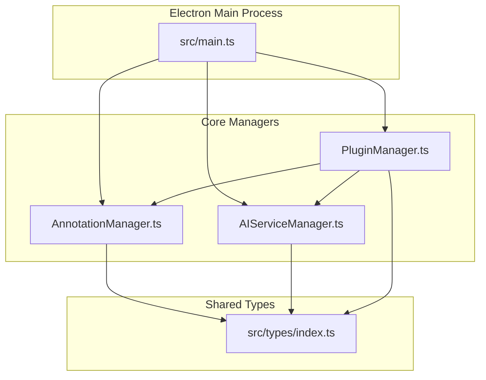
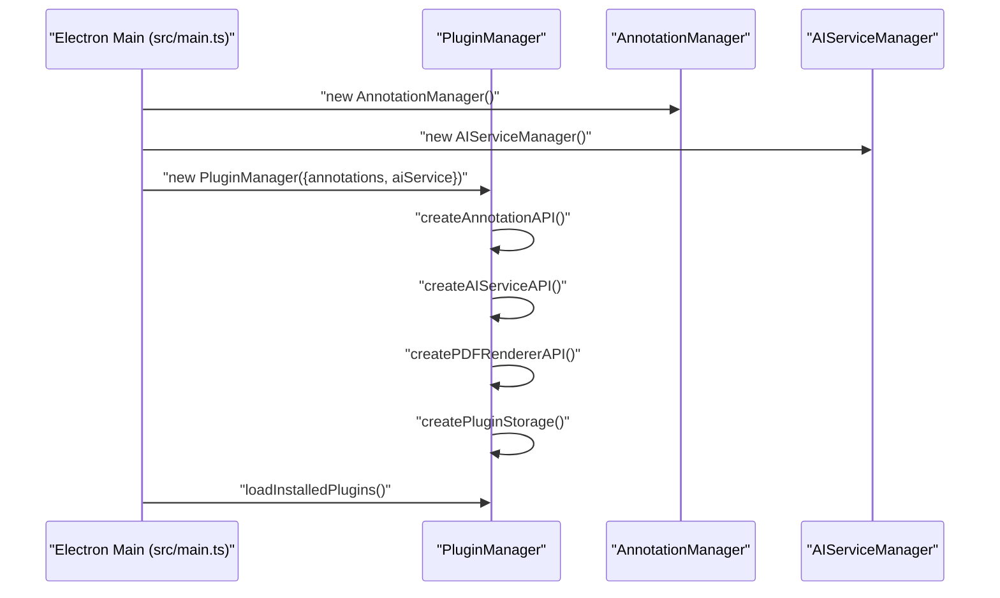
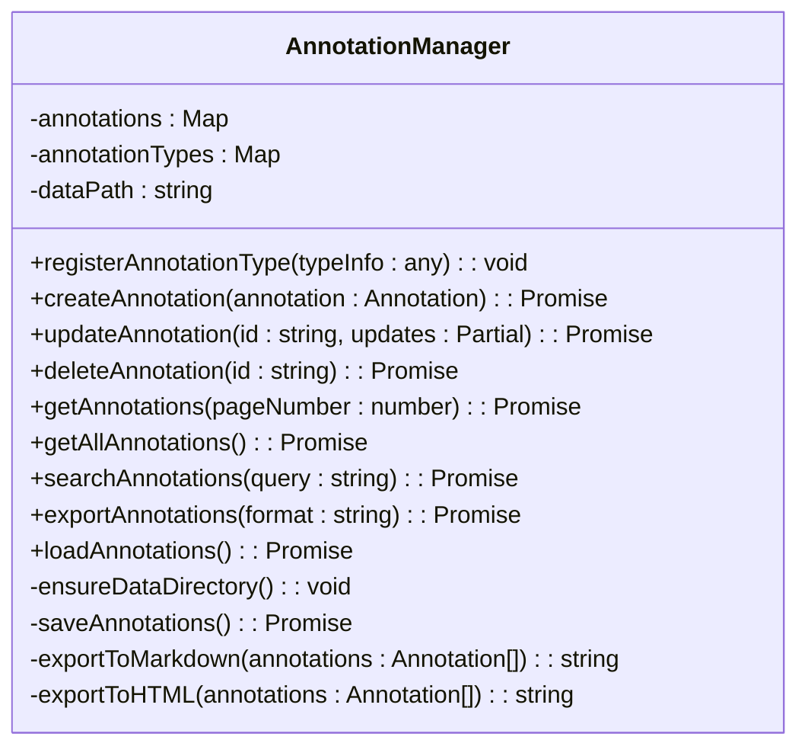
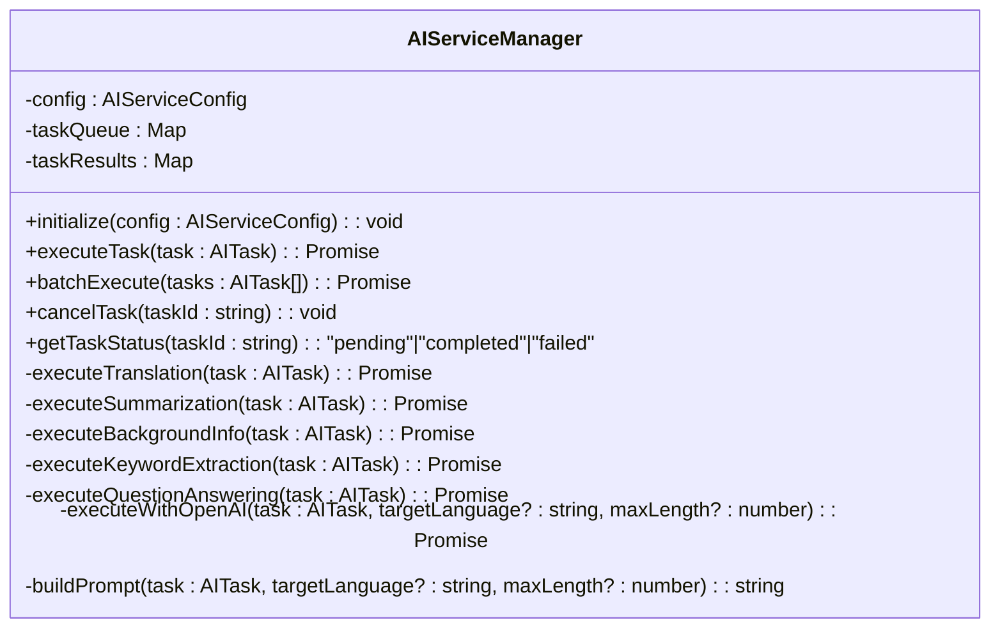
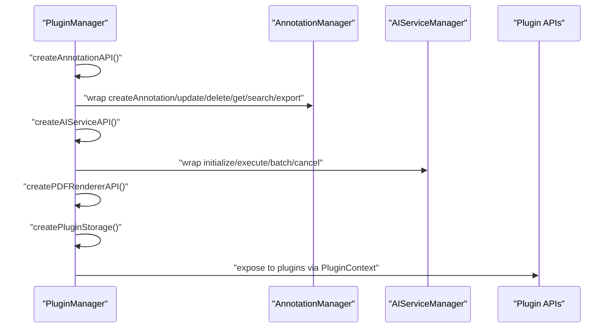
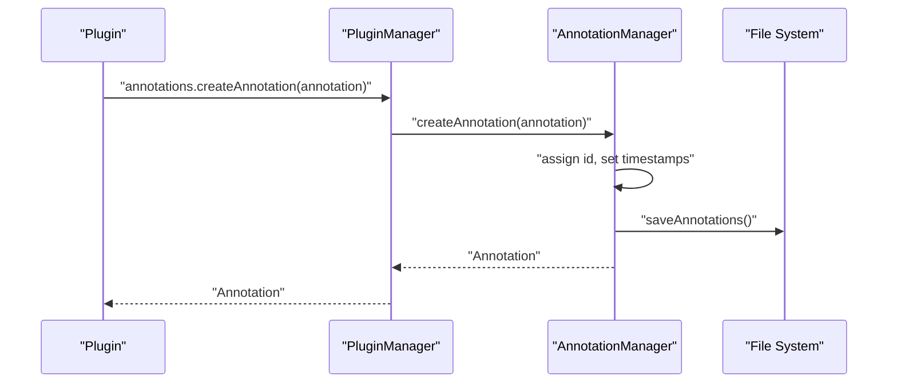
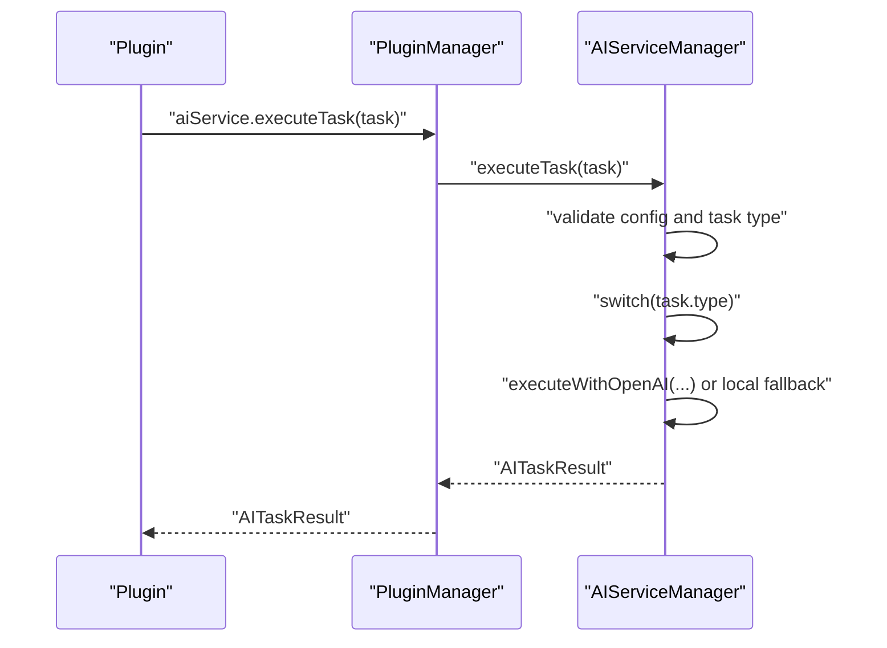
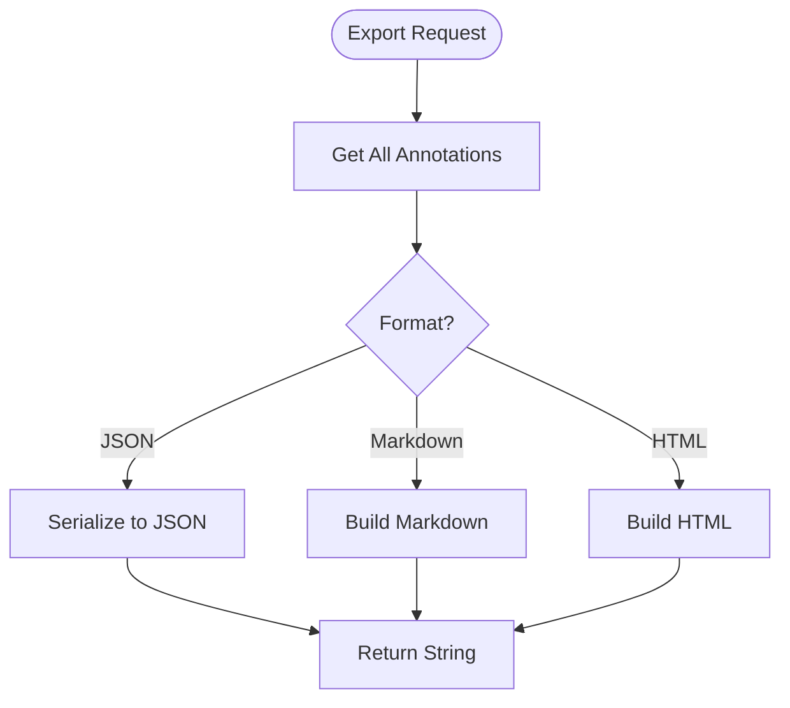
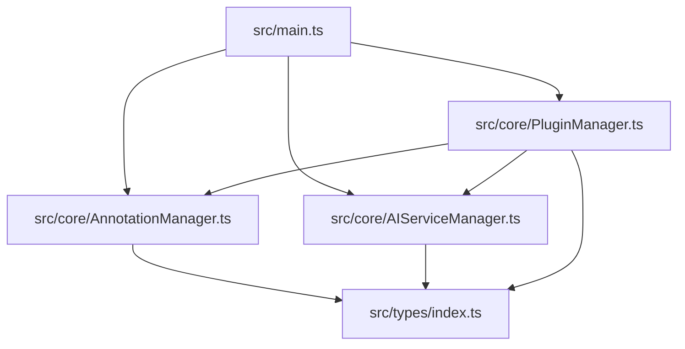

# Core API Documentation

<cite>
**Referenced Files in This Document**
- [src/types/index.ts](file://src/types/index.ts)
- [src/core/AnnotationManager.ts](file://src/core/AnnotationManager.ts)
- [src/core/AIServiceManager.ts](file://src/core/AIServiceManager.ts)
- [src/core/PluginManager.ts](file://src/core/PluginManager.ts)
- [src/main.ts](file://src/main.ts)
- [package.json](file://package.json)
- [README.md](file://README.md)
- [PLUGIN-GUIDE.md](file://PLUGIN-GUIDE.md)
</cite>

## Table of Contents
1. [Introduction](#introduction)
2. [Project Structure](#project-structure)
3. [Core Components](#core-components)
4. [Architecture Overview](#architecture-overview)
5. [Detailed Component Analysis](#detailed-component-analysis)
6. [Dependency Analysis](#dependency-analysis)
7. [Performance Considerations](#performance-considerations)
8. [Troubleshooting Guide](#troubleshooting-guide)
9. [Conclusion](#conclusion)
10. [Appendices](#appendices)

## Introduction
This document provides comprehensive core API documentation for the SciPDFReader application. It focuses on the primary interfaces and their implementations:
- AnnotationManagerAPI for managing annotations
- AIServiceAPI for AI-powered tasks
- PDFRendererAPI for document rendering and text extraction
- PluginStorage for key-value persistence

It also documents the TypeScript type definitions from src/types/index.ts, including data models, enums, and type specifications. The document covers error handling strategies, validation requirements, and exception specifications for each core API endpoint, along with practical usage examples for plugin developers.

## Project Structure
The core application is organized around Electron’s main and renderer processes, with TypeScript type definitions and core managers for annotations, AI services, and plugins.

**Diagram sources**
- [src/main.ts:45-60](file://src/main.ts#L45-L60)
- [src/core/AnnotationManager.ts:1-172](file://src/core/AnnotationManager.ts#L1-L172)
- [src/core/AIServiceManager.ts:1-214](file://src/core/AIServiceManager.ts#L1-L214)
- [src/core/PluginManager.ts:1-247](file://src/core/PluginManager.ts#L1-L247)
- [src/types/index.ts:1-224](file://src/types/index.ts#L1-L224)

**Section sources**
- [src/main.ts:13-60](file://src/main.ts#L13-L60)
- [package.json:1-57](file://package.json#L1-L57)

## Core Components
This section documents the primary APIs and their method signatures, parameters, return types, and error handling patterns.

### AnnotationManagerAPI
The AnnotationManagerAPI provides CRUD operations for annotations, search capabilities, and export functionality.

- Method: createAnnotation
  - Signature: createAnnotation(annotation: Annotation): Promise<Annotation>
  - Parameters:
    - annotation: An object conforming to the Annotation interface. Required fields include type, pageNumber, content, and position. Optional fields include annotationText, color, metadata, and createdAt/updatedAt.
  - Returns: Promise resolving to the created Annotation with an id and timestamps.
  - Errors:
    - Throws if the annotation cannot be persisted (e.g., filesystem write failure). The implementation currently throws descriptive errors for missing data during update operations.
  - Validation:
    - Requires a valid AnnotationType and numeric pageNumber.
    - Validates presence of content and position fields.
  - Persistence:
    - Stores annotations in a JSON file under the user data directory. The path is constructed from APPDATA/HOME plus a fixed subdirectory.

- Method: updateAnnotation
  - Signature: updateAnnotation(id: string, updates: Partial<Annotation>): Promise<void>
  - Parameters:
    - id: Unique identifier of the annotation to update.
    - updates: Partial<Annotation> containing fields to update (e.g., annotationText, color, metadata).
  - Returns: Promise<void>.
  - Errors:
    - Throws if the annotation with the given id does not exist.
  - Validation:
    - Ensures the annotation exists before applying updates.
  - Persistence:
    - Persists the updated annotation immediately after applying changes.

- Method: deleteAnnotation
  - Signature: deleteAnnotation(id: string): Promise<void>
  - Parameters:
    - id: Unique identifier of the annotation to delete.
  - Returns: Promise<void>.
  - Errors:
    - No explicit error thrown; silently handles missing ids.
  - Persistence:
    - Removes the annotation and re-saves the collection.

- Method: getAnnotations
  - Signature: getAnnotations(pageNumber: number): Promise<Annotation[]>
  - Parameters:
    - pageNumber: Integer representing the target page number.
  - Returns: Promise resolving to an array of Annotation objects on the specified page.
  - Errors:
    - No explicit errors; returns an empty array if none found.
  - Validation:
    - Filters annotations by pageNumber equality.

- Method: searchAnnotations
  - Signature: searchAnnotations(query: string): Promise<Annotation[]>
  - Parameters:
    - query: String used to search within content and annotationText.
  - Returns: Promise resolving to an array of matching Annotation objects.
  - Errors:
    - No explicit errors; returns an empty array if none found.
  - Validation:
    - Case-insensitive substring match on content and annotationText.

- Method: exportAnnotations
  - Signature: exportAnnotations(format: string): Promise<string>
  - Parameters:
    - format: One of 'json', 'markdown', or 'html'.
  - Returns: Promise resolving to a formatted string representation of annotations.
  - Errors:
    - Defaults to JSON export if an unsupported format is provided.
  - Validation:
    - Supports only the specified formats; otherwise falls back to JSON.

- Additional Methods:
  - registerAnnotationType(typeInfo: any): Registers custom annotation types with labels, colors, and icons.
  - loadAnnotations(): Loads annotations from persistent storage into memory.
  - getAllAnnotations(): Retrieves all annotations in memory.

**Section sources**
- [src/types/index.ts:148-155](file://src/types/index.ts#L148-L155)
- [src/core/AnnotationManager.ts:46-112](file://src/core/AnnotationManager.ts#L46-L112)
- [src/core/AnnotationManager.ts:153-170](file://src/core/AnnotationManager.ts#L153-L170)

### AIServiceAPI
The AIServiceAPI manages AI service configuration and executes various AI tasks.

- Method: initialize
  - Signature: initialize(config: AIServiceConfig): void
  - Parameters:
    - config: AIServiceConfig specifying provider, apiKey, endpoint, model, and temperature.
  - Returns: void.
  - Errors:
    - No explicit errors; logs initialization details.
  - Validation:
    - Accepts provider values: 'openai', 'azure', 'local', 'custom'.

- Method: executeTask
  - Signature: executeTask(task: AITask): Promise<AITaskResult>
  - Parameters:
    - task: AITask with id, type, input, optional context, and options.
  - Returns: Promise resolving to AITaskResult containing output and optional metadata/confidence.
  - Errors:
    - Throws if the service is not initialized.
    - Throws for unknown task types.
    - Cleans up the task queue on failure.
  - Validation:
    - Validates task type against AITaskType enum.
    - Uses options like targetLanguage and maxLength when applicable.

- Method: batchExecute
  - Signature: batchExecute(tasks: AITask[]): Promise<AITaskResult[]>
  - Parameters:
    - tasks: Array of AITask objects to execute sequentially.
  - Returns: Promise resolving to an array of AITaskResult objects. Failed tasks include metadata with error details.
  - Errors:
    - Logs individual task failures but continues processing remaining tasks.
  - Validation:
    - Executes each task individually and aggregates results.

- Method: cancelTask
  - Signature: cancelTask(taskId: string): void
  - Parameters:
    - taskId: Identifier of the task to cancel.
  - Returns: void.
  - Errors:
    - No explicit errors; logs cancellation attempts.
  - Validation:
    - Removes the task from the internal queue if present.

- Internal Task Execution:
  - executeTranslation: Supports OpenAI/Azure providers and local/custom fallbacks.
  - executeSummarization: Supports OpenAI/Azure and a simple extractive summarization fallback.
  - executeBackgroundInfo: Supports OpenAI/Azure and local fallback.
  - executeKeywordExtraction: Frequency-based keyword extraction.
  - executeQuestionAnswering: Supports OpenAI/Azure and local fallback.
  - executeWithOpenAI: Builds prompts and returns mock responses; intended for future integration with real providers.
  - buildPrompt: Constructs provider-specific prompts based on task type and options.

**Section sources**
- [src/types/index.ts:166-171](file://src/types/index.ts#L166-L171)
- [src/core/AIServiceManager.ts:8-92](file://src/core/AIServiceManager.ts#L8-L92)
- [src/core/AIServiceManager.ts:96-212](file://src/core/AIServiceManager.ts#L96-L212)

### PDFRendererAPI
The PDFRendererAPI defines methods for document loading, page rendering, text extraction, and selection management. The current implementation in PluginManager provides placeholder stubs.

- Method: loadDocument
  - Signature: loadDocument(filePath: string): Promise<PDFDocument>
  - Parameters:
    - filePath: Path to the PDF file.
  - Returns: Promise resolving to a PDFDocument object with id, path, numPages, and optional metadata.
  - Errors:
    - Not implemented in current stub; returns a temporary object.
  - Validation:
    - Intended to validate file existence and PDF format.

- Method: renderPage
  - Signature: renderPage(pageNumber: number, options: RenderOptions): Promise<void>
  - Parameters:
    - pageNumber: Target page number.
    - options: RenderOptions with optional scale and viewport.
  - Returns: Promise<void>.
  - Errors:
    - Not implemented in current stub.
  - Validation:
    - Expects valid page number and options.

- Method: getPageInfo
  - Signature: getPageInfo(pageNumber: number): PageInfo
  - Parameters:
    - pageNumber: Target page number.
  - Returns: PageInfo with pageNumber, width, height, and rotation.
  - Errors:
    - Not implemented in current stub; returns a temporary object.
  - Validation:
    - Returns static defaults in current implementation.

- Method: extractText
  - Signature: extractText(pageNumber: number): Promise<string>
  - Parameters:
    - pageNumber: Target page number.
  - Returns: Promise resolving to extracted text.
  - Errors:
    - Not implemented in current stub; returns empty string.
  - Validation:
    - Intended to validate page number.

- Method: getSelection
  - Signature: getSelection(): SelectionInfo
  - Parameters: None.
  - Returns: SelectionInfo with text, ranges, and optional pageNumber.
  - Errors:
    - Not implemented in current stub; returns empty defaults.
  - Validation:
    - Returns current selection state.

- Method: setZoom
  - Signature: setZoom(level: number): void
  - Parameters:
    - level: Zoom factor.
  - Returns: void.
  - Errors:
    - Not implemented in current stub.
  - Validation:
    - Sets zoom level.

Notes:
- The current implementation in PluginManager returns placeholder stubs. Real implementations will integrate with PDF.js and other rendering libraries.

**Section sources**
- [src/types/index.ts:157-164](file://src/types/index.ts#L157-L164)
- [src/core/PluginManager.ts:222-232](file://src/core/PluginManager.ts#L222-L232)

### PluginStorage API
The PluginStorage API provides key-value operations for plugin persistence. The current implementation in PluginManager provides placeholder stubs.

- Method: get
  - Signature: get(key: string): Promise<any>
  - Parameters:
    - key: Storage key.
  - Returns: Promise resolving to stored value.
  - Errors:
    - Not implemented in current stub; returns null.
  - Validation:
    - Intended to retrieve values by key.

- Method: put
  - Signature: put(key: string, value: any): Promise<void>
  - Parameters:
    - key: Storage key.
    - value: Value to store.
  - Returns: Promise<void>.
  - Errors:
    - Not implemented in current stub.
  - Validation:
    - Intended to persist values.

- Method: keys
  - Signature: keys(): Promise<string[]>
  - Parameters: None.
  - Returns: Promise resolving to an array of stored keys.
  - Errors:
    - Not implemented in current stub; returns empty array.
  - Validation:
    - Intended to enumerate keys.

**Section sources**
- [src/types/index.ts:173-177](file://src/types/index.ts#L173-L177)
- [src/core/PluginManager.ts:234-245](file://src/core/PluginManager.ts#L234-L245)

## Architecture Overview
The application follows an Electron architecture with a main process initializing core managers and a plugin system exposing APIs to plugins.

**Diagram sources**
- [src/main.ts:45-60](file://src/main.ts#L45-L60)
- [src/core/PluginManager.ts:202-245](file://src/core/PluginManager.ts#L202-L245)
- [src/core/AnnotationManager.ts:1-19](file://src/core/AnnotationManager.ts#L1-L19)
- [src/core/AIServiceManager.ts:3-11](file://src/core/AIServiceManager.ts#L3-L11)

## Detailed Component Analysis

### AnnotationManager Implementation
The AnnotationManager maintains in-memory annotations and persists them to disk. It registers default annotation types and supports custom registration.

**Diagram sources**
- [src/core/AnnotationManager.ts:6-171](file://src/core/AnnotationManager.ts#L6-L171)

**Section sources**
- [src/core/AnnotationManager.ts:21-44](file://src/core/AnnotationManager.ts#L21-L44)
- [src/core/AnnotationManager.ts:153-170](file://src/core/AnnotationManager.ts#L153-L170)

### AIServiceManager Implementation
The AIServiceManager orchestrates AI tasks, validates configuration, and executes provider-specific logic.

**Diagram sources**
- [src/core/AIServiceManager.ts:3-213](file://src/core/AIServiceManager.ts#L3-L213)

**Section sources**
- [src/core/AIServiceManager.ts:84-92](file://src/core/AIServiceManager.ts#L84-L92)
- [src/core/AIServiceManager.ts:174-212](file://src/core/AIServiceManager.ts#L174-L212)

### PluginManager Integration
The PluginManager creates API proxies for plugins and manages plugin lifecycle.

**Diagram sources**
- [src/core/PluginManager.ts:202-245](file://src/core/PluginManager.ts#L202-L245)

**Section sources**
- [src/core/PluginManager.ts:202-245](file://src/core/PluginManager.ts#L202-L245)

### API Workflows

#### Annotation Creation Flow

**Diagram sources**
- [src/core/AnnotationManager.ts:46-59](file://src/core/AnnotationManager.ts#L46-L59)
- [src/core/PluginManager.ts:202-211](file://src/core/PluginManager.ts#L202-L211)

#### AI Task Execution Flow

**Diagram sources**
- [src/core/AIServiceManager.ts:13-56](file://src/core/AIServiceManager.ts#L13-L56)
- [src/core/AIServiceManager.ts:96-212](file://src/core/AIServiceManager.ts#L96-L212)
- [src/core/PluginManager.ts:213-219](file://src/core/PluginManager.ts#L213-L219)

#### Export Annotations Flow

**Diagram sources**
- [src/core/AnnotationManager.ts:96-112](file://src/core/AnnotationManager.ts#L96-L112)
- [src/core/AnnotationManager.ts:114-151](file://src/core/AnnotationManager.ts#L114-L151)

## Dependency Analysis
The core modules depend on shared type definitions and are orchestrated by the main process.

**Diagram sources**
- [src/main.ts:45-60](file://src/main.ts#L45-L60)
- [src/core/PluginManager.ts:1-35](file://src/core/PluginManager.ts#L1-L35)
- [src/core/AnnotationManager.ts:1-5](file://src/core/AnnotationManager.ts#L1-L5)
- [src/core/AIServiceManager.ts:1](file://src/core/AIServiceManager.ts#L1)
- [src/types/index.ts:1](file://src/types/index.ts#L1)

**Section sources**
- [package.json:28-34](file://package.json#L28-L34)

## Performance Considerations
- Annotation persistence: File I/O occurs on every create/update/delete operation. Consider batching writes or using an in-memory cache with periodic flushes for high-frequency operations.
- AI task execution: Network calls to external providers can be slow. Implement timeouts and retry logic. BatchExecute already aggregates results and logs failures; extend with configurable retry policies.
- PDF rendering: Rendering is CPU-intensive. Use appropriate scaling and viewport options to balance quality and performance. Defer rendering until needed.
- Plugin storage: Current stubs do not persist data. Implement a robust storage backend (e.g., SQLite or JSON) to avoid losing plugin data across sessions.

## Troubleshooting Guide
Common issues and resolutions:
- Annotation not found during update:
  - Symptom: Error indicating the annotation does not exist.
  - Resolution: Verify the id exists before calling updateAnnotation. Ensure the annotation was created successfully.
  - Reference: [updateAnnotation error handling:61-70](file://src/core/AnnotationManager.ts#L61-L70)

- AI Service not initialized:
  - Symptom: Error stating the AI Service must be initialized before executing tasks.
  - Resolution: Call initialize with a valid AIServiceConfig before executeTask or batchExecute.
  - Reference: [executeTask initialization check:14-16](file://src/core/AIServiceManager.ts#L14-L16)

- Unknown task type:
  - Symptom: Error for unsupported AITaskType.
  - Resolution: Use supported task types: TRANSLATION, SUMMARIZATION, BACKGROUND_INFO, KEYWORD_EXTRACTION, QUESTION_ANSWERING.
  - Reference: [task type switch:23-46](file://src/core/AIServiceManager.ts#L23-L46)

- Plugin storage not implemented:
  - Symptom: get/put/keys return defaults.
  - Resolution: Implement a storage backend in PluginManager.createPluginStorage.
  - Reference: [storage stubs:234-245](file://src/core/PluginManager.ts#L234-245)

- PDF renderer not implemented:
  - Symptom: loadDocument/renderPage/getPageInfo/extractText/getSelection/setZoom return placeholders.
  - Resolution: Integrate PDF.js and implement rendering pipeline.
  - Reference: [renderer stubs:222-232](file://src/core/PluginManager.ts#L222-232)

**Section sources**
- [src/core/AnnotationManager.ts:61-70](file://src/core/AnnotationManager.ts#L61-L70)
- [src/core/AIServiceManager.ts:14-16](file://src/core/AIServiceManager.ts#L14-L16)
- [src/core/AIServiceManager.ts:23-46](file://src/core/AIServiceManager.ts#L23-L46)
- [src/core/PluginManager.ts:222-245](file://src/core/PluginManager.ts#L222-L245)

## Conclusion
SciPDFReader’s core APIs provide a solid foundation for annotation management, AI-powered tasks, and plugin extensibility. The TypeScript type definitions ensure strong typing across the system. While some APIs (PDFRendererAPI and PluginStorage) are currently stubbed, the architecture supports straightforward integration of real implementations. Developers can leverage these APIs to build powerful plugins that enhance PDF reading and annotation workflows.

## Appendices

### TypeScript Interfaces and Enums
Key interfaces and enums defined in src/types/index.ts:

- Enums:
  - AnnotationType: highlight, underline, strikethrough, note, translation, background_info, custom
  - AITaskType: translation, summarization, background_info, keyword_extraction, question_answering

- Interfaces:
  - Annotation, AnnotationPosition, TextOffset, AnnotationMetadata
  - AIServiceConfig, AITask, TaskOptions, AITaskResult
  - PDFDocument, DocumentMetadata, RenderOptions, Viewport, PageInfo, SelectionInfo, TextRange
  - PluginManifest, AnnotationTypeDefinition, AIServiceDefinition, CommandDefinition, MenuDefinition, MenuItemDefinition
  - PluginContext, Disposable
  - AnnotationManagerAPI, PDFRendererAPI, AIServiceAPI, PluginStorage

These definitions are consumed by the core managers and exposed to plugins via PluginContext.

**Section sources**
- [src/types/index.ts:3-11](file://src/types/index.ts#L3-L11)
- [src/types/index.ts:49-84](file://src/types/index.ts#L49-L84)
- [src/types/index.ts:136-177](file://src/types/index.ts#L136-L177)
- [src/types/index.ts:179-224](file://src/types/index.ts#L179-L224)

### Practical Usage Examples
Examples are adapted from the plugin guide and demonstrate common API usage patterns.

- Creating an annotation:
  - Steps:
    - Obtain current selection from PDFRendererAPI.
    - Call annotations.createAnnotation with type, content, position, and pageNumber.
    - Optionally add annotationText and metadata.
  - References:
    - [Annotation API usage:149-156](file://PLUGIN-GUIDE.md#L149-L156)
    - [PDFRenderer API usage:220-238](file://PLUGIN-GUIDE.md#L220-L238)

- Executing AI tasks:
  - Steps:
    - Initialize AI service with provider, apiKey, and model.
    - Execute tasks like translation, summarization, background info, keyword extraction, or question answering.
    - Handle results and create annotations with AI outputs.
  - References:
    - [AI Service API usage:180-214](file://PLUGIN-GUIDE.md#L180-L214)
    - [AITaskType enum:57-63](file://src/types/index.ts#L57-L63)

- Exporting annotations:
  - Steps:
    - Call annotations.exportAnnotations with format 'json', 'markdown', or 'html'.
    - Save or display the resulting string.
  - References:
    - [Export API usage:172-174](file://PLUGIN-GUIDE.md#L172-L174)
    - [Export implementation:96-112](file://src/core/AnnotationManager.ts#L96-L112)

- Plugin lifecycle:
  - Steps:
    - Implement activate(context: PluginContext) to register commands and annotations.
    - Push disposables to context.subscriptions for cleanup.
    - Implement deactivate() to clean up resources.
  - References:
    - [Plugin activation pattern:104-135](file://PLUGIN-GUIDE.md#L104-L135)

**Section sources**
- [PLUGIN-GUIDE.md:149-174](file://PLUGIN-GUIDE.md#L149-L174)
- [PLUGIN-GUIDE.md:180-214](file://PLUGIN-GUIDE.md#L180-L214)
- [PLUGIN-GUIDE.md:220-238](file://PLUGIN-GUIDE.md#L220-L238)
- [PLUGIN-GUIDE.md:104-135](file://PLUGIN-GUIDE.md#L104-L135)