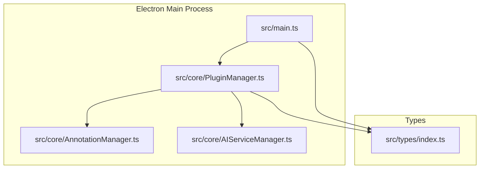
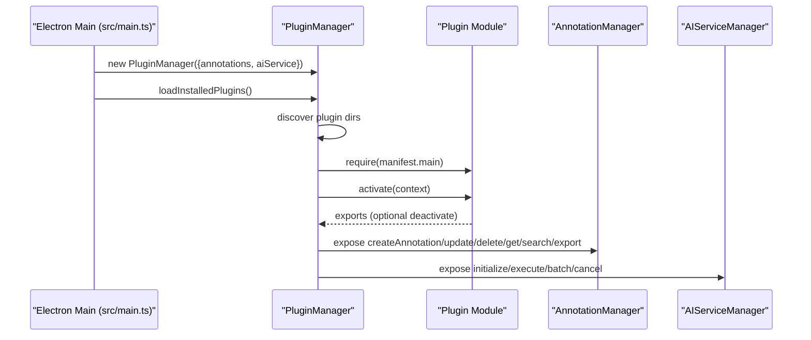
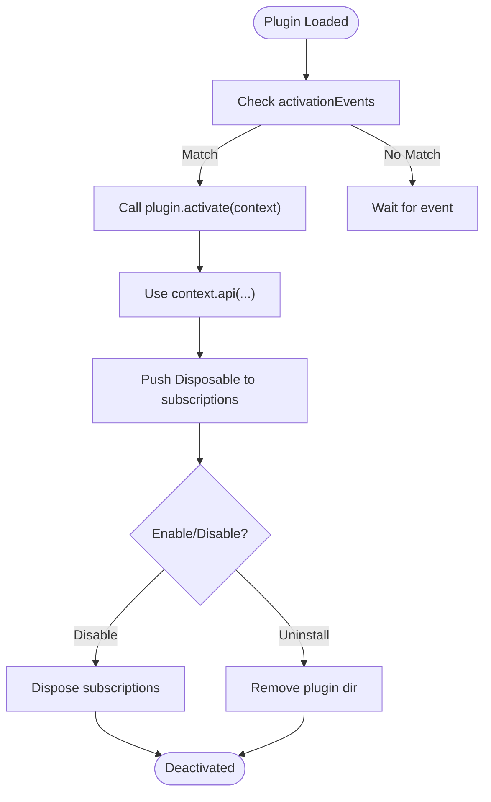
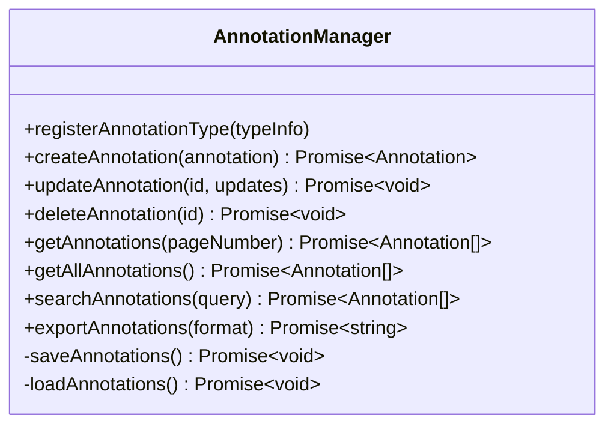
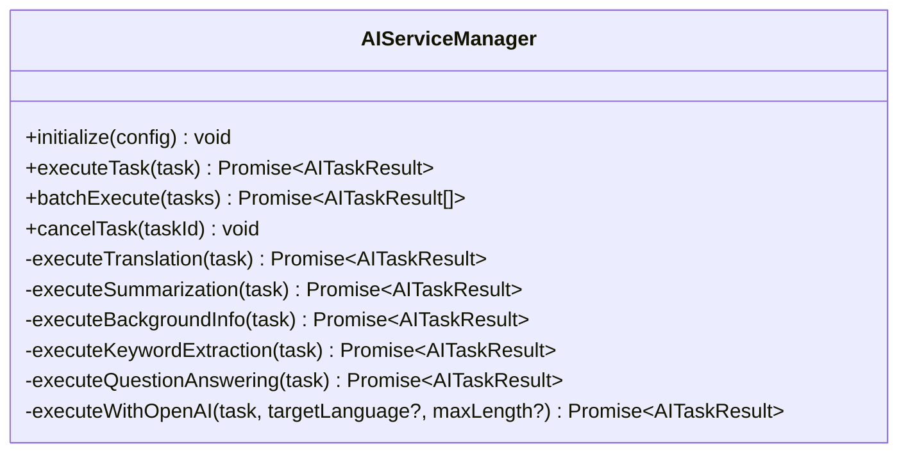
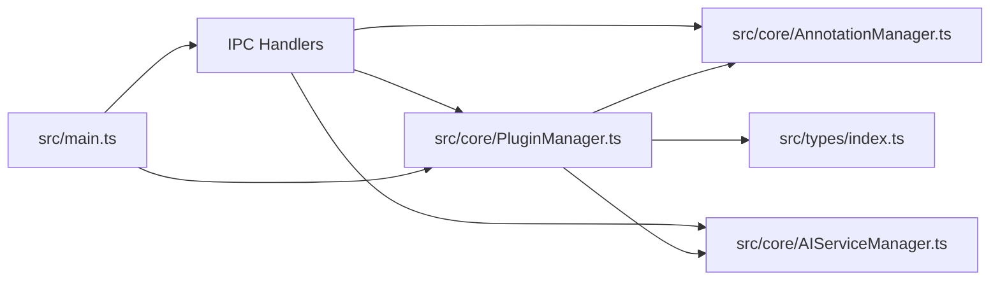

# Plugin API Reference

<cite>
**Referenced Files in This Document**
- [src/main.ts](file://src/main.ts)
- [src/types/index.ts](file://src/types/index.ts)
- [src/core/PluginManager.ts](file://src/core/PluginManager.ts)
- [src/core/AnnotationManager.ts](file://src/core/AnnotationManager.ts)
- [src/core/AIServiceManager.ts](file://src/core/AIServiceManager.ts)
- [README.md](file://README.md)
- [PLUGIN-GUIDE.md](file://PLUGIN-GUIDE.md)
- [package.json](file://package.json)
</cite>

## Table of Contents
1. [Introduction](#introduction)
2. [Project Structure](#project-structure)
3. [Core Components](#core-components)
4. [Architecture Overview](#architecture-overview)
5. [Detailed Component Analysis](#detailed-component-analysis)
6. [Dependency Analysis](#dependency-analysis)
7. [Performance Considerations](#performance-considerations)
8. [Troubleshooting Guide](#troubleshooting-guide)
9. [Conclusion](#conclusion)
10. [Appendices](#appendices)

## Introduction
This document provides a comprehensive Plugin API reference for SciPDFReader’s extensible architecture. It covers the PluginContext interface, the AnnotationManagerAPI, PDFRendererAPI, AIServiceAPI, and PluginStorage, along with the PluginManifest specification and plugin lifecycle management. It also includes practical examples of plugin development patterns, command registration, menu contributions, and context API usage, with security considerations and best practices.

## Project Structure
SciPDFReader is an Electron-based application with a modular core and a TypeScript type system that defines the plugin APIs. The plugin system is inspired by VS Code’s extension model and exposes a PluginContext to plugins upon activation.

**Diagram sources**
- [src/main.ts:45-60](file://src/main.ts#L45-L60)
- [src/core/PluginManager.ts:22-36](file://src/core/PluginManager.ts#L22-L36)
- [src/core/AnnotationManager.ts:11-19](file://src/core/AnnotationManager.ts#L11-L19)
- [src/core/AIServiceManager.ts:3-11](file://src/core/AIServiceManager.ts#L3-L11)
- [src/types/index.ts:136-177](file://src/types/index.ts#L136-L177)

**Section sources**
- [src/main.ts:1-156](file://src/main.ts#L1-L156)
- [src/types/index.ts:1-224](file://src/types/index.ts#L1-L224)
- [src/core/PluginManager.ts:1-250](file://src/core/PluginManager.ts#L1-L250)
- [src/core/AnnotationManager.ts:1-172](file://src/core/AnnotationManager.ts#L1-L172)
- [src/core/AIServiceManager.ts:1-214](file://src/core/AIServiceManager.ts#L1-L214)

## Core Components
This section documents the PluginContext interface and the APIs it exposes to plugins, including subscriptions, annotations, pdfRenderer, aiService, and storage.

- PluginContext
  - subscriptions: Array of Disposable objects used to manage plugin lifecycle and cleanup.
  - annotations: AnnotationManagerAPI for annotation CRUD, search, and export.
  - pdfRenderer: PDFRendererAPI for document interaction (loading, rendering, text extraction, selection).
  - aiService: AIServiceAPI for initializing and executing AI tasks.
  - storage: PluginStorage for key-value persistence.

- AnnotationManagerAPI
  - createAnnotation(annotation): Promise<Annotation>
  - updateAnnotation(id, updates): Promise<void>
  - deleteAnnotation(id): Promise<void>
  - getAnnotations(pageNumber): Promise<Annotation[]>
  - searchAnnotations(query): Promise<Annotation[]>
  - exportAnnotations(format): Promise<string>

- PDFRendererAPI
  - loadDocument(filePath): Promise<PDFDocument>
  - renderPage(pageNumber, options): Promise<void>
  - getPageInfo(pageNumber): PageInfo
  - extractText(pageNumber): Promise<string>
  - getSelection(): SelectionInfo
  - setZoom(level): void

- AIServiceAPI
  - initialize(config): void
  - executeTask(task): Promise<AITaskResult>
  - batchExecute(tasks): Promise<AITaskResult[]>
  - cancelTask(taskId): void

- PluginStorage
  - get(key): Promise<any>
  - put(key, value): Promise<void>
  - keys(): Promise<string[]>

- PluginManifest
  - name, displayName, version, description, publisher, engines, main
  - contributes: annotations, aiServices, commands, menus
  - activationEvents: string[]

**Section sources**
- [src/types/index.ts:136-177](file://src/types/index.ts#L136-L177)
- [src/types/index.ts:86-135](file://src/types/index.ts#L86-L135)

## Architecture Overview
The plugin system initializes core managers (AnnotationManager, AIServiceManager) and constructs a PluginContext. Plugins are discovered from a user-specific plugins directory, loaded, and activated when activation events match. The PluginManager manages command registration, plugin lifecycle, and subscription disposal.

**Diagram sources**
- [src/main.ts:45-60](file://src/main.ts#L45-L60)
- [src/core/PluginManager.ts:72-121](file://src/core/PluginManager.ts#L72-L121)
- [src/core/PluginManager.ts:205-223](file://src/core/PluginManager.ts#L205-L223)

## Detailed Component Analysis

### PluginContext and Lifecycle
- Activation
  - Plugins are loaded from ~/.scipdfreader/plugins/<plugin-name>/package.json.
  - Activation occurs when activationEvents include '*' or 'onStartupFinished'.
  - The activate function receives PluginContext and returns optional exports.

- Subscriptions
  - Plugins push Disposable objects into context.subscriptions to manage cleanup.
  - On disable/uninstall, PluginManager disposes all subscriptions.

- Deactivation
  - If plugin exports a deactivate function, it is invoked during disable.

**Diagram sources**
- [src/core/PluginManager.ts:96-121](file://src/core/PluginManager.ts#L96-L121)
- [src/core/PluginManager.ts:160-175](file://src/core/PluginManager.ts#L160-L175)

**Section sources**
- [src/core/PluginManager.ts:72-121](file://src/core/PluginManager.ts#L72-L121)
- [src/core/PluginManager.ts:160-175](file://src/core/PluginManager.ts#L160-L175)

### AnnotationManagerAPI
- Purpose: Manage annotations for pages, including creation, updates, deletion, retrieval, search, and export.
- Methods:
  - createAnnotation(annotation): Creates and persists an annotation.
  - updateAnnotation(id, updates): Updates an existing annotation.
  - deleteAnnotation(id): Removes an annotation.
  - getAnnotations(pageNumber): Retrieves annotations for a given page.
  - searchAnnotations(query): Searches across content and annotationText.
  - exportAnnotations(format): Exports annotations to JSON, Markdown, or HTML.

**Diagram sources**
- [src/core/AnnotationManager.ts:42-94](file://src/core/AnnotationManager.ts#L42-L94)
- [src/core/AnnotationManager.ts:153-170](file://src/core/AnnotationManager.ts#L153-L170)

**Section sources**
- [src/core/AnnotationManager.ts:42-94](file://src/core/AnnotationManager.ts#L42-L94)
- [src/core/AnnotationManager.ts:153-170](file://src/core/AnnotationManager.ts#L153-L170)

### PDFRendererAPI
- Purpose: Interact with PDF documents from within plugin workflows.
- Methods:
  - loadDocument(filePath): Loads a PDF and returns document metadata.
  - renderPage(pageNumber, options): Renders a page with optional scaling/viewport.
  - getPageInfo(pageNumber): Returns page dimensions and rotation.
  - extractText(pageNumber): Extracts text from a page.
  - getSelection(): Returns current selection text and ranges.
  - setZoom(level): Adjusts zoom level.

Notes:
- The current implementation returns placeholder values; actual PDF rendering integration is pending.

**Section sources**
- [src/core/PluginManager.ts:225-235](file://src/core/PluginManager.ts#L225-L235)
- [src/types/index.ts:157-164](file://src/types/index.ts#L157-L164)

### AIServiceAPI
- Purpose: Integrate AI capabilities for translation, summarization, background information, keyword extraction, and question answering.
- Methods:
  - initialize(config): Initializes provider configuration.
  - executeTask(task): Executes a single task and returns result.
  - batchExecute(tasks): Executes multiple tasks and aggregates results.
  - cancelTask(taskId): Cancels a pending task.

Supported task types:
- TRANSLATION, SUMMARIZATION, BACKGROUND_INFO, KEYWORD_EXTRACTION, QUESTION_ANSWERING

Provider support:
- openai, azure, local, custom

**Diagram sources**
- [src/core/AIServiceManager.ts:8-82](file://src/core/AIServiceManager.ts#L8-L82)
- [src/core/AIServiceManager.ts:96-171](file://src/core/AIServiceManager.ts#L96-L171)
- [src/core/AIServiceManager.ts:174-212](file://src/core/AIServiceManager.ts#L174-L212)

**Section sources**
- [src/core/AIServiceManager.ts:8-82](file://src/core/AIServiceManager.ts#L8-L82)
- [src/core/AIServiceManager.ts:96-171](file://src/core/AIServiceManager.ts#L96-L171)
- [src/core/AIServiceManager.ts:174-212](file://src/core/AIServiceManager.ts#L174-L212)

### PluginStorage API
- Purpose: Provide lightweight key-value storage for plugin data.
- Methods:
  - get(key): Retrieves stored value.
  - put(key, value): Stores value under key.
  - keys(): Lists all stored keys.

Note:
- The current implementation is a placeholder; actual persistence is pending.

**Section sources**
- [src/core/PluginManager.ts:237-248](file://src/core/PluginManager.ts#L237-L248)
- [src/types/index.ts:173-177](file://src/types/index.ts#L173-L177)

### PluginManifest Specification
- Fields:
  - name, displayName, version, description, publisher, engines, main
  - contributes: annotations[], aiServices[], commands[], menus[]
  - activationEvents: string[]

- Contributes:
  - annotations: type, label, color, icon
  - aiServices: name, type, endpoint
  - commands: command, title, category, icon
  - menus: id, items[] with command, title, group

**Section sources**
- [src/types/index.ts:86-135](file://src/types/index.ts#L86-L135)
- [PLUGIN-GUIDE.md:65-97](file://PLUGIN-GUIDE.md#L65-L97)

## Dependency Analysis
The PluginManager composes the PluginContext from core managers and exposes typed APIs to plugins. The main process wires IPC handlers for plugin commands and annotation type registration.

**Diagram sources**
- [src/main.ts:45-60](file://src/main.ts#L45-L60)
- [src/main.ts:144-155](file://src/main.ts#L144-L155)
- [src/core/PluginManager.ts:22-36](file://src/core/PluginManager.ts#L22-L36)

**Section sources**
- [src/main.ts:45-60](file://src/main.ts#L45-L60)
- [src/main.ts:144-155](file://src/main.ts#L144-L155)
- [src/core/PluginManager.ts:22-36](file://src/core/PluginManager.ts#L22-L36)

## Performance Considerations
- Avoid blocking the UI thread in plugin commands; use async operations and progress feedback.
- Batch AI tasks when possible to reduce overhead.
- Limit annotation exports to required formats and sizes.
- Use search and filtering to minimize data transfer across contexts.

## Troubleshooting Guide
Common issues and resolutions:
- Plugin fails to activate
  - Verify activationEvents and that the plugin’s main entry point is correct.
  - Ensure the plugin exports an activate function and optionally deactivate.

- Annotations not persisting
  - Confirm AnnotationManager data directory exists and is writable.
  - Check for errors during saveAnnotations/loadAnnotations.

- AI tasks failing
  - Ensure AIServiceManager is initialized with a valid provider configuration.
  - Validate task types and input options.

- Storage not working
  - The current PluginStorage implementation is a placeholder; implement persistence in the plugin.

**Section sources**
- [src/core/PluginManager.ts:113-121](file://src/core/PluginManager.ts#L113-L121)
- [src/core/AnnotationManager.ts:153-170](file://src/core/AnnotationManager.ts#L153-L170)
- [src/core/AIServiceManager.ts:8-11](file://src/core/AIServiceManager.ts#L8-L11)
- [src/core/PluginManager.ts:237-248](file://src/core/PluginManager.ts#L237-L248)

## Conclusion
SciPDFReader’s plugin system provides a robust, VS Code-inspired architecture for extending PDF reading and annotation capabilities with AI-driven features. The PluginContext exposes typed APIs for annotations, PDF rendering, AI services, and storage, enabling developers to build powerful, interoperable plugins while maintaining clean lifecycle management and resource disposal.

## Appendices

### Practical Plugin Development Patterns
- Command Registration
  - Register commands via scipdf.commands.registerCommand and push the returned Disposable into context.subscriptions.
  - Example patterns are demonstrated in the plugin guide.

- Menu Contributions
  - Define menus in plugin manifest contributes.menus with items referencing registered commands.

- Context API Usage
  - Use context.pdfRenderer to get selections and context.annotations to create annotations.
  - Use context.aiService to execute tasks and annotate results.

- Security and Best Practices
  - Always handle errors and provide user feedback.
  - Clean up subscriptions in deactivate().
  - Avoid blocking operations; use async patterns.
  - Respect provider limits and rate-limits when integrating AI services.

**Section sources**
- [PLUGIN-GUIDE.md:104-140](file://PLUGIN-GUIDE.md#L104-L140)
- [PLUGIN-GUIDE.md:144-238](file://PLUGIN-GUIDE.md#L144-L238)
- [PLUGIN-GUIDE.md:387-394](file://PLUGIN-GUIDE.md#L387-L394)