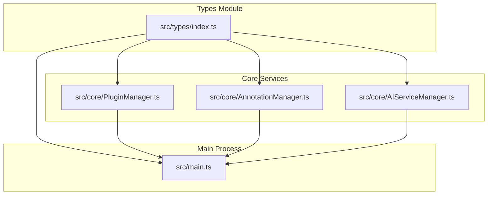
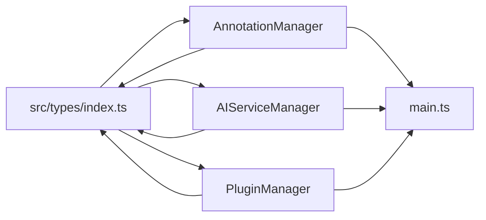

# Type Definitions

<cite>
**Referenced Files in This Document**
- [src/types/index.ts](file://src/types/index.ts)
- [src/core/AnnotationManager.ts](file://src/core/AnnotationManager.ts)
- [src/core/AIServiceManager.ts](file://src/core/AIServiceManager.ts)
- [src/core/PluginManager.ts](file://src/core/PluginManager.ts)
- [src/main.ts](file://src/main.ts)
- [README.md](file://README.md)
- [PLUGIN-GUIDE.md](file://PLUGIN-GUIDE.md)
</cite>

## Table of Contents
1. [Introduction](#introduction)
2. [Project Structure](#project-structure)
3. [Core Components](#core-components)
4. [Architecture Overview](#architecture-overview)
5. [Detailed Component Analysis](#detailed-component-analysis)
6. [Dependency Analysis](#dependency-analysis)
7. [Performance Considerations](#performance-considerations)
8. [Troubleshooting Guide](#troubleshooting-guide)
9. [Conclusion](#conclusion)

## Introduction
This document provides comprehensive TypeScript type definition documentation for the SciPDFReader application. It covers all interfaces, enums, and data models used across the system, including:
- Annotation types and the Annotation interface
- Positioning models for text and coordinates
- AI service configuration and task management
- PDF document and rendering interfaces
- Plugin manifest and plugin APIs
- Relationship mappings and usage examples

The goal is to make these definitions accessible to both technical and non-technical readers, with clear field descriptions, optional properties, and practical usage scenarios.

## Project Structure
The type definitions are centralized in a single module and consumed by core services and the main Electron process.

**Diagram sources**
- [src/types/index.ts:1-224](file://src/types/index.ts#L1-L224)
- [src/core/AnnotationManager.ts:1-172](file://src/core/AnnotationManager.ts#L1-L172)
- [src/core/AIServiceManager.ts:1-214](file://src/core/AIServiceManager.ts#L1-L214)
- [src/core/PluginManager.ts:1-250](file://src/core/PluginManager.ts#L1-L250)
- [src/main.ts:1-156](file://src/main.ts#L1-L156)

**Section sources**
- [src/types/index.ts:1-224](file://src/types/index.ts#L1-L224)
- [src/core/AnnotationManager.ts:1-172](file://src/core/AnnotationManager.ts#L1-L172)
- [src/core/AIServiceManager.ts:1-214](file://src/core/AIServiceManager.ts#L1-L214)
- [src/core/PluginManager.ts:1-250](file://src/core/PluginManager.ts#L1-L250)
- [src/main.ts:1-156](file://src/main.ts#L1-L156)

## Core Components
This section documents the primary type definitions and their roles in the system.

- AnnotationType enum: Defines supported annotation categories.
- Annotation interface: Represents a single annotation with metadata and positioning.
- AnnotationPosition and TextOffset: Positioning models for rendered text and offsets.
- AIServiceConfig: AI provider configuration.
- AITaskType and AITask: AI task definitions and execution parameters.
- PDFDocument, PageInfo, SelectionInfo, RenderOptions, Viewport: PDF rendering and document management interfaces.
- PluginManifest and related plugin APIs: Plugin contribution and runtime context.

**Section sources**
- [src/types/index.ts:3-224](file://src/types/index.ts#L3-L224)

## Architecture Overview
The type system underpins the plugin architecture, annotation management, and AI service integration.

```mermaid
classDiagram
class AnnotationType {
<<enum>>
+HIGHLIGHT
+UNDERLINE
+STRIKETHROUGH
+NOTE
+TRANSLATION
+BACKGROUND_INFO
+CUSTOM
}
class Annotation {
+string id
+AnnotationType type
+number pageNumber
+string content
+string? annotationText
+AnnotationPosition position
+string? color
+Date createdAt
+Date updatedAt
+AnnotationMetadata? metadata
}
class AnnotationPosition {
+number x
+number y
+number width
+number height
+TextOffset[]? textOffsets
}
class TextOffset {
+number start
+number end
+number top
+number left
}
class AnnotationMetadata {
+string? source
+string? aiModel
+number? confidence
+string[]? tags
+any? [key : string] : any
}
class AIServiceConfig {
+("openai"|"azure"|"local"|"custom") provider
+string? apiKey
+string? endpoint
+string? model
+number? temperature
}
class AITaskType {
<<enum>>
+TRANSLATION
+SUMMARIZATION
+BACKGROUND_INFO
+KEYWORD_EXTRACTION
+QUESTION_ANSWERING
}
class AITask {
+string id
+AITaskType type
+string input
+string? context
+TaskOptions? options
}
class TaskOptions {
+string? targetLanguage
+number? maxLength
+string? language
+any? [key : string] : any
}
class AITaskResult {
+string output
+any? metadata
+number? confidence
}
class PDFDocument {
+string id
+string path
+number numPages
+DocumentMetadata? metadata
}
class DocumentMetadata {
+string? title
+string? author
+string? subject
+string? keywords
+string? creator
+string? producer
+string? creationDate
+string? modificationDate
}
class PageInfo {
+number pageNumber
+number width
+number height
+number rotation
}
class SelectionInfo {
+string text
+TextRange[] ranges
+number? pageNumber
}
class TextRange {
+number start
+number end
}
class RenderOptions {
+number? scale
+Viewport? viewport
}
class Viewport {
+number width
+number height
}
class PluginManifest {
+string name
+string displayName
+string version
+string description
+string publisher
+Engines engines
+string main
+Contributions? contributes
+string[]? activationEvents
}
class Engines {
+string scipdfreader
}
class Contributions {
+AnnotationTypeDefinition[]? annotations
+AIServiceDefinition[]? aiServices
+CommandDefinition[]? commands
+MenuDefinition[]? menus
}
class AnnotationTypeDefinition {
+string type
+string label
+string? color
+string? icon
}
class AIServiceDefinition {
+string name
+string type
+string? endpoint
}
class CommandDefinition {
+string command
+string title
+string? category
+string? icon
}
class MenuDefinition {
+string id
+MenuItemDefinition[] items
}
class MenuItemDefinition {
+string command
+string title
+string? group
}
class PluginContext {
+Disposable[] subscriptions
+AnnotationManagerAPI annotations
+PDFRendererAPI pdfRenderer
+AIServiceAPI aiService
+PluginStorage storage
}
class AnnotationManagerAPI {
+createAnnotation(annotation) : Promise<Annotation>
+updateAnnotation(id, updates) : Promise<void>
+deleteAnnotation(id) : Promise<void>
+getAnnotations(pageNumber) : Promise<Annotation[]>
+searchAnnotations(query) : Promise<Annotation[]>
+exportAnnotations(format) : Promise<string>
}
class PDFRendererAPI {
+loadDocument(filePath) : Promise<PDFDocument>
+renderPage(pageNumber, options) : Promise<void>
+getPageInfo(pageNumber) : PageInfo
+extractText(pageNumber) : Promise<string>
+getSelection() : SelectionInfo
+setZoom(level) : void
}
class AIServiceAPI {
+initialize(config) : void
+executeTask(task) : Promise<AITaskResult>
+batchExecute(tasks) : Promise<AITaskResult[]>
+cancelTask(taskId) : void
}
class PluginStorage {
+get(key) : Promise<any>
+put(key, value) : Promise<void>
+keys() : Promise<string[]>
}
Annotation --> AnnotationType
Annotation --> AnnotationPosition
Annotation --> AnnotationMetadata
AITask --> AITaskType
AITask --> TaskOptions
PDFDocument --> DocumentMetadata
SelectionInfo --> TextRange
RenderOptions --> Viewport
PluginManifest --> Engines
PluginManifest --> Contributions
PluginContext --> AnnotationManagerAPI
PluginContext --> PDFRendererAPI
PluginContext --> AIServiceAPI
PluginContext --> PluginStorage
```

**Diagram sources**
- [src/types/index.ts:3-224](file://src/types/index.ts#L3-L224)

## Detailed Component Analysis

### AnnotationType Enum
Supported annotation categories used across the application.

- HIGHLIGHT: Highlights selected text.
- UNDERLINE: Underlines selected text.
- STRIKETHROUGH: Adds a strikethrough effect.
- NOTE: General note annotation.
- TRANSLATION: Annotation containing translated text.
- BACKGROUND_INFO: Annotation with contextual background information.
- CUSTOM: User-defined annotation type.

Usage context:
- Registered by default in the annotation manager.
- Used to categorize annotations and apply styles/icons.

**Section sources**
- [src/types/index.ts:3-11](file://src/types/index.ts#L3-L11)
- [src/core/AnnotationManager.ts:21-34](file://src/core/AnnotationManager.ts#L21-L34)

### Annotation Interface
Represents a single annotation with all metadata and positioning.

Fields:
- id: Unique identifier.
- type: Category from AnnotationType.
- pageNumber: Target page number.
- content: Original text content.
- annotationText: Optional annotation body (e.g., translation or note).
- position: AnnotationPosition for rendering.
- color: Optional color override.
- createdAt: Creation timestamp.
- updatedAt: Last update timestamp.
- metadata: Optional structured metadata (source, model, confidence, tags).

Usage context:
- Created via AnnotationManager.createAnnotation.
- Updated via AnnotationManager.updateAnnotation.
- Exported in multiple formats (JSON, Markdown, HTML).

**Section sources**
- [src/types/index.ts:36-47](file://src/types/index.ts#L36-L47)
- [src/core/AnnotationManager.ts:46-70](file://src/core/AnnotationManager.ts#L46-L70)

### AnnotationPosition and TextOffset Interfaces
Positioning models for precise text placement and glyph-level offsets.

AnnotationPosition:
- x, y: Top-left corner in page coordinates.
- width, height: Bounding box size.
- textOffsets: Optional array of TextOffset for glyph-level precision.

TextOffset:
- start, end: Character indices in the source text.
- top, left: Glyph offset relative to the bounding box.

Usage context:
- Used by PDF renderer to draw highlights/underlines.
- Supports multi-glyph selections and precise text alignment.

**Section sources**
- [src/types/index.ts:13-26](file://src/types/index.ts#L13-L26)

### AnnotationMetadata Interface
Structured metadata for annotations.

Fields:
- source: Origin of the annotation (e.g., user, AI).
- aiModel: Model used for AI-generated content.
- confidence: Confidence score for AI content.
- tags: Optional tags for categorization.
- [key: string]: any: Additional free-form fields.

Usage context:
- Stored with each annotation.
- Enables filtering and analytics.

**Section sources**
- [src/types/index.ts:28-34](file://src/types/index.ts#L28-L34)

### AIServiceConfig Interface
AI service configuration for provider selection and model specification.

Fields:
- provider: Provider selection ("openai" | "azure" | "local" | "custom").
- apiKey: Optional API key.
- endpoint: Optional custom endpoint.
- model: Optional model name.
- temperature: Optional sampling temperature.

Usage context:
- Passed to AIServiceManager.initialize.
- Determines provider-specific behavior and prompts.

**Section sources**
- [src/types/index.ts:49-55](file://src/types/index.ts#L49-L55)
- [src/core/AIServiceManager.ts:8-11](file://src/core/AIServiceManager.ts#L8-L11)

### AITaskType Enum and AITask Interface
Defines AI task types and execution parameters.

AITaskType:
- TRANSLATION: Translate text to a target language.
- SUMMARIZATION: Generate a concise summary.
- BACKGROUND_INFO: Provide contextual background for a concept.
- KEYWORD_EXTRACTION: Extract important keywords.
- QUESTION_ANSWERING: Answer a question given context.

AITask:
- id: Unique task identifier.
- type: Task type from AITaskType.
- input: Input text.
- context: Optional context for background info and QA.
- options: TaskOptions for customization.

TaskOptions:
- targetLanguage: Target language for translation.
- maxLength: Maximum length for summarization.
- language: Language hint for processing.
- [key: string]: any: Additional options.

AITaskResult:
- output: Generated result text.
- metadata: Optional metadata (e.g., model, prompt).
- confidence: Optional confidence score.

Usage context:
- Executed by AIServiceManager.executeTask.
- Supports batch execution and cancellation.

**Section sources**
- [src/types/index.ts:57-84](file://src/types/index.ts#L57-L84)
- [src/core/AIServiceManager.ts:13-75](file://src/core/AIServiceManager.ts#L13-L75)

### PDFDocument, PageInfo, SelectionInfo, RenderOptions, Viewport
PDF rendering and document management interfaces.

PDFDocument:
- id: Document identifier.
- path: File path.
- numPages: Total page count.
- metadata: Optional DocumentMetadata.

DocumentMetadata:
- title, author, subject, keywords, creator, producer, creationDate, modificationDate.

PageInfo:
- pageNumber, width, height, rotation.

SelectionInfo:
- text: Selected text.
- ranges: TextRange array for character indices.
- pageNumber: Optional page number.

TextRange:
- start, end: Character indices.

RenderOptions:
- scale: Zoom/scale factor.
- viewport: Optional viewport dimensions.

Viewport:
- width, height: Rendering canvas size.

Usage context:
- PDF renderer APIs return these types.
- Used by plugin APIs to integrate with rendering.

**Section sources**
- [src/types/index.ts:179-223](file://src/types/index.ts#L179-L223)

### Plugin Manifest and Plugin APIs
Plugin contribution and runtime context.

PluginManifest:
- name, displayName, version, description, publisher.
- engines: scipdfreader version constraint.
- main: Entry module path.
- contributes: Optional contributions (annotations, aiServices, commands, menus).
- activationEvents: Optional activation triggers.

Contributions:
- annotations: AnnotationTypeDefinition[].
- aiServices: AIServiceDefinition[].
- commands: CommandDefinition[].
- menus: MenuDefinition[].

AnnotationTypeDefinition:
- type, label, color, icon.

AIServiceDefinition:
- name, type, endpoint.

CommandDefinition:
- command, title, category, icon.

MenuDefinition and MenuItemDefinition:
- menu identifiers and items.

PluginContext:
- subscriptions: Disposable lifecycle hooks.
- annotations: AnnotationManagerAPI.
- pdfRenderer: PDFRendererAPI.
- aiService: AIServiceAPI.
- storage: PluginStorage.

PluginStorage:
- get(key): Promise<any>
- put(key, value): Promise<void>
- keys(): Promise<string[]>

Usage context:
- Plugins declare capabilities via manifest.
- Runtime exposes APIs to plugins through PluginContext.

**Section sources**
- [src/types/index.ts:86-177](file://src/types/index.ts#L86-L177)
- [src/core/PluginManager.ts:16-36](file://src/core/PluginManager.ts#L16-L36)

## Dependency Analysis
This section maps how types are used across modules and services.

**Diagram sources**
- [src/types/index.ts:1-224](file://src/types/index.ts#L1-L224)
- [src/core/AnnotationManager.ts:1-172](file://src/core/AnnotationManager.ts#L1-L172)
- [src/core/AIServiceManager.ts:1-214](file://src/core/AIServiceManager.ts#L1-L214)
- [src/core/PluginManager.ts:1-250](file://src/core/PluginManager.ts#L1-L250)
- [src/main.ts:1-156](file://src/main.ts#L1-L156)

**Section sources**
- [src/types/index.ts:1-224](file://src/types/index.ts#L1-L224)
- [src/core/AnnotationManager.ts:1-172](file://src/core/AnnotationManager.ts#L1-L172)
- [src/core/AIServiceManager.ts:1-214](file://src/core/AIServiceManager.ts#L1-L214)
- [src/core/PluginManager.ts:1-250](file://src/core/PluginManager.ts#L1-L250)
- [src/main.ts:1-156](file://src/main.ts#L1-L156)

## Performance Considerations
- Prefer minimal metadata to reduce serialization overhead for annotations.
- Use TextOffset arrays judiciously; they increase payload size for complex selections.
- Batch AI tasks when possible to reduce network overhead.
- Cache frequently accessed PDF page info and selections to minimize repeated computations.

## Troubleshooting Guide
Common issues and resolutions:
- Unknown task type: Ensure AITask.type matches AITaskType values.
- Missing AI configuration: Initialize AIServiceManager with AIServiceConfig before executing tasks.
- Annotation not found: Verify annotation id exists before update/delete operations.
- Plugin activation failures: Confirm manifest activationEvents and plugin path validity.

**Section sources**
- [src/core/AIServiceManager.ts:14-16](file://src/core/AIServiceManager.ts#L14-L16)
- [src/core/AnnotationManager.ts:63-65](file://src/core/AnnotationManager.ts#L63-L65)
- [src/core/PluginManager.ts:96-101](file://src/core/PluginManager.ts#L96-L101)

## Conclusion
The type system in SciPDFReader provides a robust foundation for annotations, AI tasks, PDF rendering, and plugin extensibility. By adhering to these interfaces and enums, developers can implement features consistently while maintaining interoperability across modules and plugins.