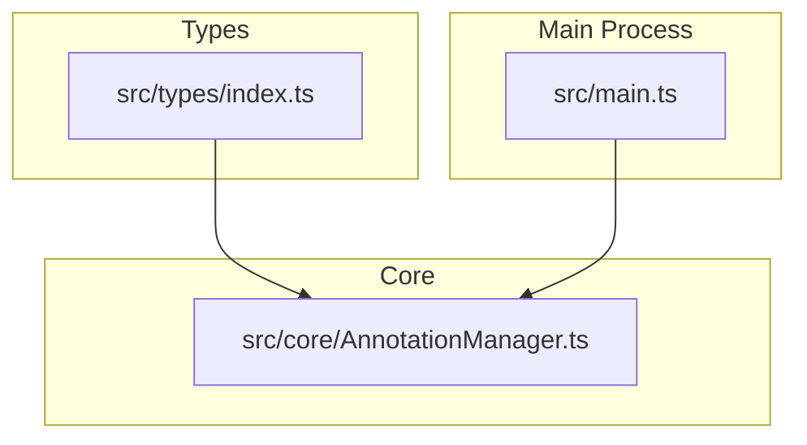
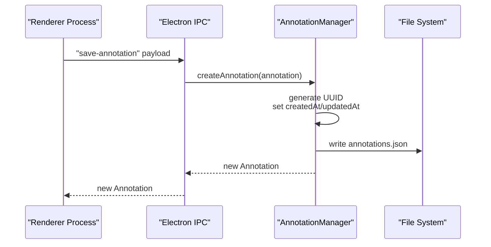
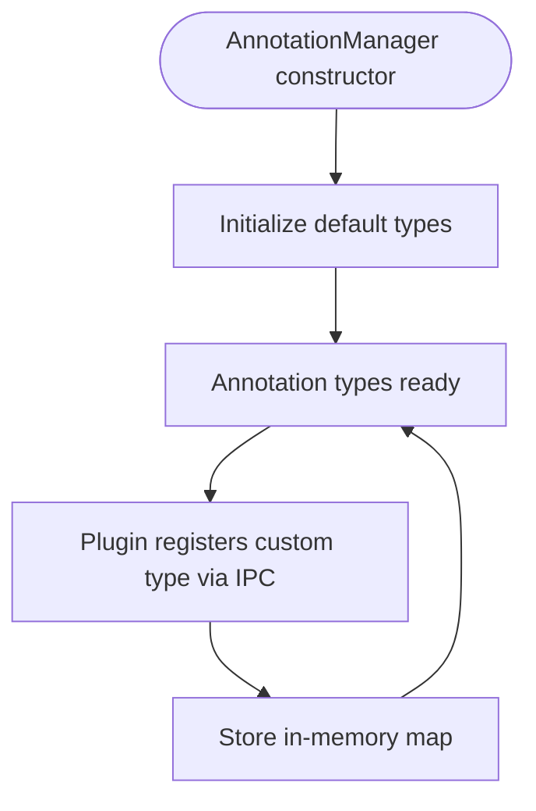
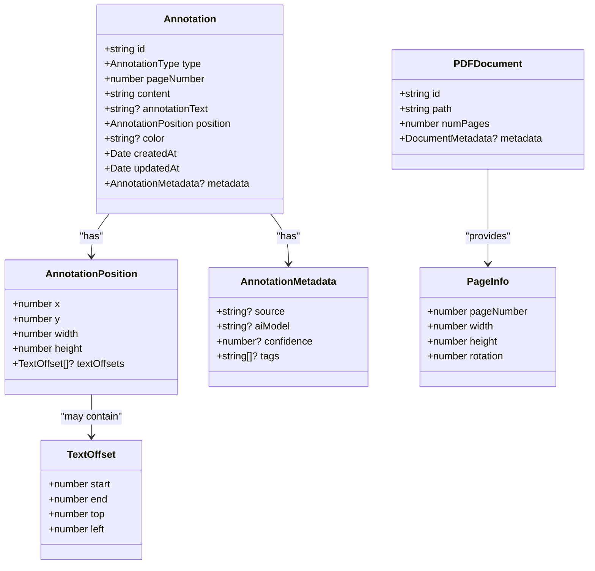
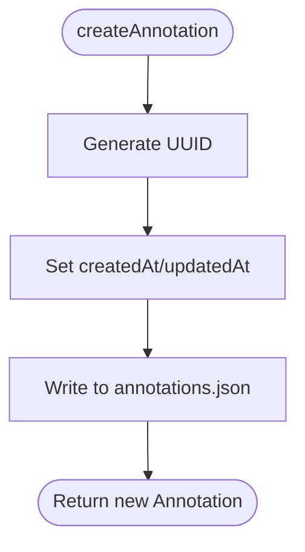
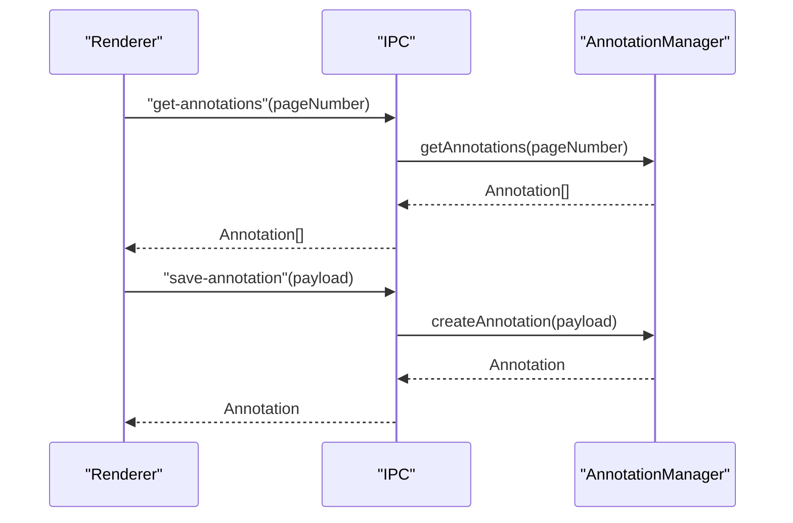
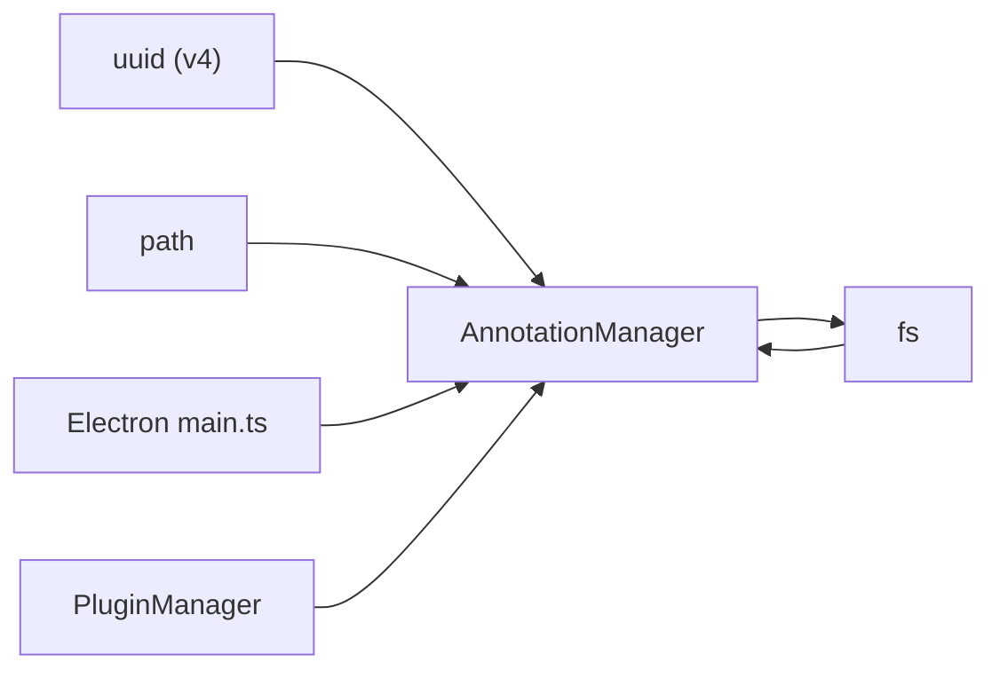

# Annotation Data Model

<cite>
**Referenced Files in This Document**
- [src/types/index.ts](file://src/types/index.ts)
- [src/core/AnnotationManager.ts](file://src/core/AnnotationManager.ts)
- [src/main.ts](file://src/main.ts)
- [DESIGN.md](file://DESIGN.md)
- [README.md](file://README.md)
- [package.json](file://package.json)
</cite>

## Table of Contents
1. [Introduction](#introduction)
2. [Project Structure](#project-structure)
3. [Core Components](#core-components)
4. [Architecture Overview](#architecture-overview)
5. [Detailed Component Analysis](#detailed-component-analysis)
6. [Dependency Analysis](#dependency-analysis)
7. [Performance Considerations](#performance-considerations)
8. [Troubleshooting Guide](#troubleshooting-guide)
9. [Conclusion](#conclusion)
10. [Appendices](#appendices)

## Introduction
This document describes the annotation data model for the SciPDFReader application. It explains the core Annotation interface and related types, the AnnotationType enumeration and its visual semantics, the annotation type registration system, data relationships among annotations, documents, and pages, UUID generation and timestamps for auditability, the annotation positioning system, and practical examples of annotation scenarios.

## Project Structure
The annotation system is primarily defined by shared TypeScript types and implemented by a dedicated AnnotationManager. Electron IPC handlers connect the renderer process to the AnnotationManager for persistence and retrieval.

**Diagram sources**
- [src/types/index.ts:36-47](file://src/types/index.ts#L36-L47)
- [src/core/AnnotationManager.ts:6-19](file://src/core/AnnotationManager.ts#L6-L19)
- [src/main.ts:45-60](file://src/main.ts#L45-L60)

**Section sources**
- [src/types/index.ts:1-224](file://src/types/index.ts#L1-L224)
- [src/core/AnnotationManager.ts:1-172](file://src/core/AnnotationManager.ts#L1-L172)
- [src/main.ts:1-156](file://src/main.ts#L1-L156)

## Core Components
- Annotation interface: Defines the canonical shape of an annotation record, including identifiers, type, page number, content, optional annotation text, position, color, timestamps, and optional metadata.
- AnnotationType enum: Enumerates supported annotation categories with string values.
- AnnotationPosition and TextOffset: Describe spatial coordinates and optional precise text offsets.
- AnnotationManager: Provides CRUD operations, type registration, persistence, and search/export capabilities.
- Electron IPC handlers: Expose AnnotationManager operations to the renderer process.

Key data model elements:
- Annotation.id: Unique identifier generated at creation time.
- Annotation.type: One of the predefined AnnotationType values.
- Annotation.pageNumber: Integer indicating the page index.
- Annotation.content: The original text content being annotated.
- Annotation.annotationText: Optional user-added or AI-generated note or translation.
- Annotation.position: Spatial bounds and optional text offsets.
- Annotation.color: Optional color for visual representation.
- Annotation.createdAt, Annotation.updatedAt: Timestamps for audit trails.
- Annotation.metadata: Optional structured metadata for AI tasks and provenance.

**Section sources**
- [src/types/index.ts:36-47](file://src/types/index.ts#L36-L47)
- [src/types/index.ts:13-19](file://src/types/index.ts#L13-L19)
- [src/types/index.ts:21-26](file://src/types/index.ts#L21-L26)
- [src/core/AnnotationManager.ts:46-75](file://src/core/AnnotationManager.ts#L46-L75)

## Architecture Overview
The annotation lifecycle spans the renderer process, Electron IPC, and the AnnotationManager. Creation triggers UUID generation and timestamp assignment, while updates refresh the updated timestamp. Annotations are persisted to a JSON file under the user’s application data directory.

**Diagram sources**
- [src/main.ts:123-128](file://src/main.ts#L123-L128)
- [src/core/AnnotationManager.ts:46-59](file://src/core/AnnotationManager.ts#L46-L59)
- [src/core/AnnotationManager.ts:153-157](file://src/core/AnnotationManager.ts#L153-L157)

## Detailed Component Analysis

### Annotation Interface and Types
- Annotation: Core record with id, type, pageNumber, content, optional annotationText, position, optional color, createdAt, updatedAt, and optional metadata.
- AnnotationType: Enumerates supported annotation categories with string values.
- AnnotationPosition: Describes bounding box and optional text offsets.
- TextOffset: Captures per-character offsets for precise text alignment.
- AnnotationMetadata: Optional fields for source, AI model, confidence, tags, and arbitrary key-value pairs.

These definitions establish a robust, extensible schema suitable for rendering, exporting, and AI-driven enrichment.

**Section sources**
- [src/types/index.ts:36-47](file://src/types/index.ts#L36-L47)
- [src/types/index.ts:3-11](file://src/types/index.ts#L3-L11)
- [src/types/index.ts:13-19](file://src/types/index.ts#L13-L19)
- [src/types/index.ts:21-26](file://src/types/index.ts#L21-L26)
- [src/types/index.ts:28-34](file://src/types/index.ts#L28-L34)

### AnnotationType Enum and Visual Semantics
The enum defines six built-in types with associated labels and default colors/icons. These are registered by default and can be extended by plugins.

- HIGHLIGHT: Yellow highlight marker.
- UNDERLINE: Green underline.
- STRIKETHROUGH: Red strikethrough.
- NOTE: Orange note.
- TRANSLATION: Light blue translation.
- BACKGROUND_INFO: Plum background info.
- CUSTOM: Placeholder for custom types.

These defaults are initialized during AnnotationManager construction and can be overridden or extended by plugins.

**Section sources**
- [src/types/index.ts:3-11](file://src/types/index.ts#L3-L11)
- [src/core/AnnotationManager.ts:21-34](file://src/core/AnnotationManager.ts#L21-L34)

### Annotation Type Registration System
- Default types are registered automatically upon instantiation of AnnotationManager.
- Plugins can register custom types via an IPC handler that forwards to AnnotationManager.registerAnnotationType.
- Registered types are stored in-memory and influence UI labeling, colors, and icons.

**Diagram sources**
- [src/core/AnnotationManager.ts:11-19](file://src/core/AnnotationManager.ts#L11-L19)
- [src/core/AnnotationManager.ts:21-34](file://src/core/AnnotationManager.ts#L21-L34)
- [src/main.ts:151-155](file://src/main.ts#L151-L155)

**Section sources**
- [src/core/AnnotationManager.ts:42-44](file://src/core/AnnotationManager.ts#L42-L44)
- [src/main.ts:151-155](file://src/main.ts#L151-L155)

### Data Structure Relationships
- Annotations belong to a document and are associated with a specific page number.
- Documents are represented by a minimal interface containing an identifier, path, page count, and optional metadata.
- Pages are described by page number, width, height, and rotation.
- The renderer abstraction exposes page info and selection ranges to support annotation positioning.

**Diagram sources**
- [src/types/index.ts:36-47](file://src/types/index.ts#L36-L47)
- [src/types/index.ts:13-19](file://src/types/index.ts#L13-L19)
- [src/types/index.ts:21-26](file://src/types/index.ts#L21-L26)
- [src/types/index.ts:28-34](file://src/types/index.ts#L28-L34)
- [src/types/index.ts:179-195](file://src/types/index.ts#L179-L195)
- [src/types/index.ts:207-212](file://src/types/index.ts#L207-L212)

**Section sources**
- [src/types/index.ts:179-195](file://src/types/index.ts#L179-L195)
- [src/types/index.ts:207-212](file://src/types/index.ts#L207-L212)

### UUID Generation and Timestamp Management
- UUID generation: A universally unique identifier is generated at creation time and assigned to the id property.
- Timestamps: Both createdAt and updatedAt are set to the current date/time at creation and update respectively.
- Persistence: Annotations are serialized to a JSON file under the user’s application data directory.

**Diagram sources**
- [src/core/AnnotationManager.ts:46-59](file://src/core/AnnotationManager.ts#L46-L59)
- [src/core/AnnotationManager.ts:153-157](file://src/core/AnnotationManager.ts#L153-L157)

**Section sources**
- [src/core/AnnotationManager.ts:46-59](file://src/core/AnnotationManager.ts#L46-L59)
- [src/core/AnnotationManager.ts:61-70](file://src/core/AnnotationManager.ts#L61-L70)
- [src/core/AnnotationManager.ts:153-157](file://src/core/AnnotationManager.ts#L153-L157)

### Annotation Positioning System
- AnnotationPosition defines a rectangle (x, y, width, height) representing the bounding box of the annotation area.
- Optional TextOffset array allows fine-grained mapping of character-level positions within the annotation region.
- PDF rendering and selection APIs expose page dimensions and selection ranges, enabling precise placement of annotations relative to PDF page geometry.

Practical implications:
- Coordinates are relative to the rendered page coordinate system.
- Rotation and scaling should be considered when mapping selections to positions.
- Text offsets can improve visual fidelity for complex text layouts.

**Section sources**
- [src/types/index.ts:13-19](file://src/types/index.ts#L13-L19)
- [src/types/index.ts:21-26](file://src/types/index.ts#L21-L26)
- [src/types/index.ts:207-212](file://src/types/index.ts#L207-L212)
- [DESIGN.md:140-146](file://DESIGN.md#L140-L146)

### Examples of Annotation Objects
Below are representative JSON-like examples illustrating typical and variant annotation records. Replace literal values with actual runtime values as applicable.

- Simple highlight on page 3:
  - id: "<UUID>"
  - type: "highlight"
  - pageNumber: 3
  - content: "machine learning"
  - position: { "x": 120, "y": 200, "width": 140, "height": 20 }
  - color: "#FFFF00"
  - createdAt: "<ISO Date>"
  - updatedAt: "<ISO Date>"

- Detailed note with metadata:
  - id: "<UUID>"
  - type: "note"
  - pageNumber: 5
  - content: "gradient descent"
  - annotationText: "Used to minimize loss functions iteratively."
  - position: { "x": 50, "y": 300, "width": 120, "height": 20 }
  - color: "#FFA500"
  - metadata: { "source": "manual", "tags": ["algorithm", "optimization"] }
  - createdAt: "<ISO Date>"
  - updatedAt: "<ISO Date>"

- AI-generated translation:
  - id: "<UUID>"
  - type: "translation"
  - pageNumber: 7
  - content: "convolutional neural network"
  - annotationText: "Convolutional Neural Network"
  - position: { "x": 80, "y": 150, "width": 160, "height": 20 }
  - color: "#87CEEB"
  - metadata: { "source": "ai", "aiModel": "gpt-3.5-turbo", "confidence": 0.92 }
  - createdAt: "<ISO Date>"
  - updatedAt: "<ISO Date>"

- Background information:
  - id: "<UUID>"
  - type: "background_info"
  - pageNumber: 12
  - content: "Alan Turing"
  - annotationText: "British mathematician who laid groundwork for computer science."
  - position: { "x": 200, "y": 400, "width": 100, "height": 20 }
  - color: "#DDA0DD"
  - metadata: { "source": "ai", "aiModel": "gpt-3.5-turbo" }
  - createdAt: "<ISO Date>"
  - updatedAt: "<ISO Date>"

Notes:
- Replace placeholders like "<UUID>", "<ISO Date>" with actual values at runtime.
- The color field is optional; if omitted, a default color may be used by the UI.
- Metadata is optional and can carry AI task provenance and confidence scores.

**Section sources**
- [src/types/index.ts:36-47](file://src/types/index.ts#L36-L47)
- [src/types/index.ts:28-34](file://src/types/index.ts#L28-L34)
- [src/core/AnnotationManager.ts:21-34](file://src/core/AnnotationManager.ts#L21-L34)

### Annotation Lifecycle and IPC Integration
- Creation: Renderer sends an IPC request to save an annotation; AnnotationManager generates id and timestamps, persists to disk, and returns the new record.
- Retrieval: Renderer requests annotations for a given page number via IPC.
- Updates: Renderer can request updates; AnnotationManager refreshes updatedAt and persists changes.
- Deletion: Renderer can request deletion; AnnotationManager removes the annotation and persists.

**Diagram sources**
- [src/main.ts:130-135](file://src/main.ts#L130-L135)
- [src/main.ts:123-128](file://src/main.ts#L123-L128)
- [src/core/AnnotationManager.ts:77-84](file://src/core/AnnotationManager.ts#L77-L84)
- [src/core/AnnotationManager.ts:46-59](file://src/core/AnnotationManager.ts#L46-L59)

**Section sources**
- [src/main.ts:123-135](file://src/main.ts#L123-L135)
- [src/core/AnnotationManager.ts:77-84](file://src/core/AnnotationManager.ts#L77-L84)
- [src/core/AnnotationManager.ts:46-59](file://src/core/AnnotationManager.ts#L46-L59)

## Dependency Analysis
- AnnotationManager depends on:
  - uuid for generating unique identifiers.
  - Node.js fs/path for local file persistence.
- Electron main process exposes IPC handlers that delegate to AnnotationManager.
- Plugin system can register custom annotation types via IPC.

**Diagram sources**
- [src/core/AnnotationManager.ts:4](file://src/core/AnnotationManager.ts#L4)
- [src/core/AnnotationManager.ts:153-157](file://src/core/AnnotationManager.ts#L153-L157)
- [src/main.ts:45-60](file://src/main.ts#L45-L60)

**Section sources**
- [package.json:33](file://package.json#L33)
- [src/core/AnnotationManager.ts:4](file://src/core/AnnotationManager.ts#L4)
- [src/core/AnnotationManager.ts:153-157](file://src/core/AnnotationManager.ts#L153-L157)
- [src/main.ts:45-60](file://src/main.ts#L45-L60)

## Performance Considerations
- In-memory storage: Annotations are kept in memory for fast access; persistence occurs on disk after each operation.
- Export formats: JSON export is straightforward; Markdown and HTML exports are provided for human-readable summaries.
- Large datasets: Consider pagination or lazy loading of annotations for very large documents.
- Rendering performance: Coordinate calculations should account for zoom level and page rotation to avoid expensive recomputations.

[No sources needed since this section provides general guidance]

## Troubleshooting Guide
Common issues and remedies:
- Annotation not found: Updating or deleting a non-existent annotation throws an error. Verify the id exists before attempting updates/deletes.
- Missing data directory: On first run, the data directory is created automatically. If permissions are restricted, ensure the application has write access to the user data directory.
- IPC errors: If IPC handlers are not initialized, operations may fail. Confirm that AnnotationManager is instantiated and IPC handlers are registered.

**Section sources**
- [src/core/AnnotationManager.ts:63-65](file://src/core/AnnotationManager.ts#L63-L65)
- [src/core/AnnotationManager.ts:36-40](file://src/core/AnnotationManager.ts#L36-L40)
- [src/main.ts:45-60](file://src/main.ts#L45-L60)

## Conclusion
The annotation data model in SciPDFReader centers on a strongly typed Annotation interface with robust defaults for type, position, and timestamps. The AnnotationManager provides a complete lifecycle for annotations, including creation, updates, persistence, and export. The type registration system enables both built-in and custom annotation types, while Electron IPC integrates the renderer with backend operations. Together, these components form a flexible, extensible foundation for annotation workflows, including AI-assisted translations and background information.

[No sources needed since this section summarizes without analyzing specific files]

## Appendices

### Appendix A: AnnotationType Values and Use Cases
- HIGHLIGHT: Emphasize key phrases or sentences; commonly yellow.
- UNDERLINE: Mark important terms; commonly green.
- STRIKETHROUGH: Denote corrections or obsolete content; commonly red.
- NOTE: Add personal commentary or summaries; commonly orange.
- TRANSLATION: Store translated text; commonly light blue.
- BACKGROUND_INFO: Provide contextual knowledge; commonly plum.
- CUSTOM: Extendable type for plugin-defined annotations.

**Section sources**
- [src/types/index.ts:3-11](file://src/types/index.ts#L3-L11)
- [src/core/AnnotationManager.ts:21-34](file://src/core/AnnotationManager.ts#L21-L34)

### Appendix B: Example Scenarios
- Simple highlight: Select a phrase and apply a highlight; the content is captured and positioned.
- Detailed note: Add a note with optional metadata for categorization.
- AI-generated translation: Use an AI task to produce translation text and attach it as annotationText.
- Background information: Extract key terms and enrich with background knowledge.

**Section sources**
- [README.md:71-104](file://README.md#L71-L104)
- [DESIGN.md:351-422](file://DESIGN.md#L351-L422)