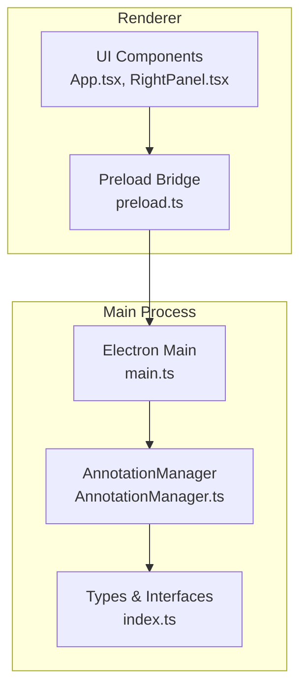
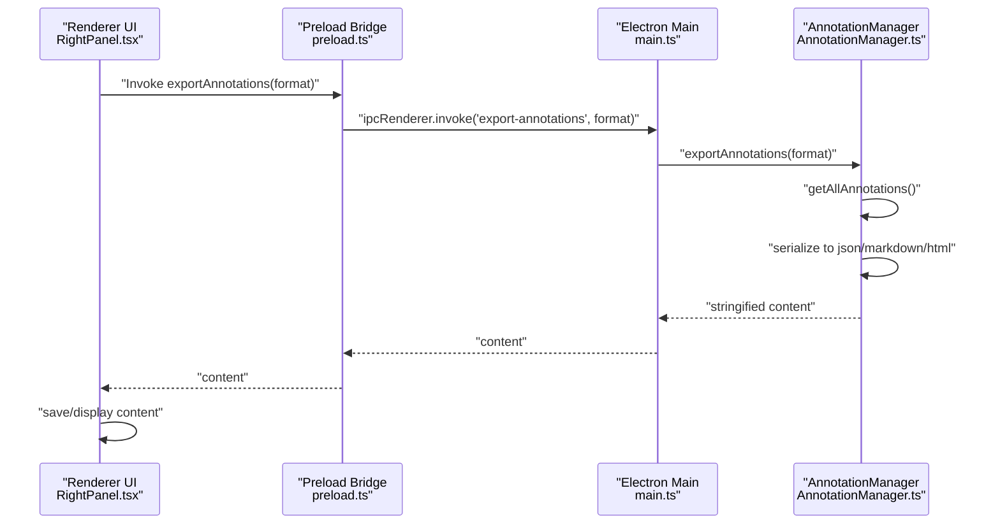
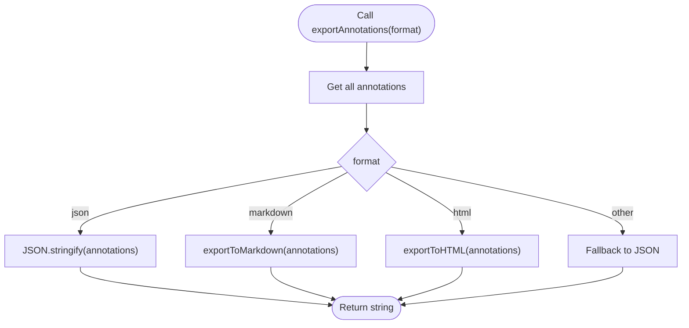
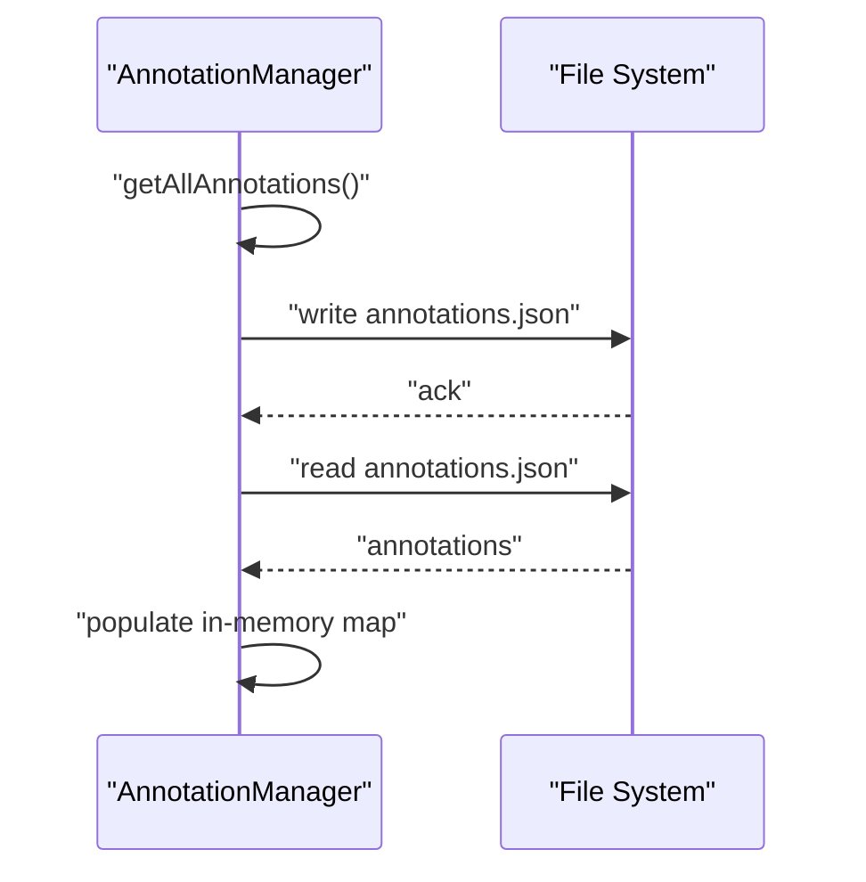
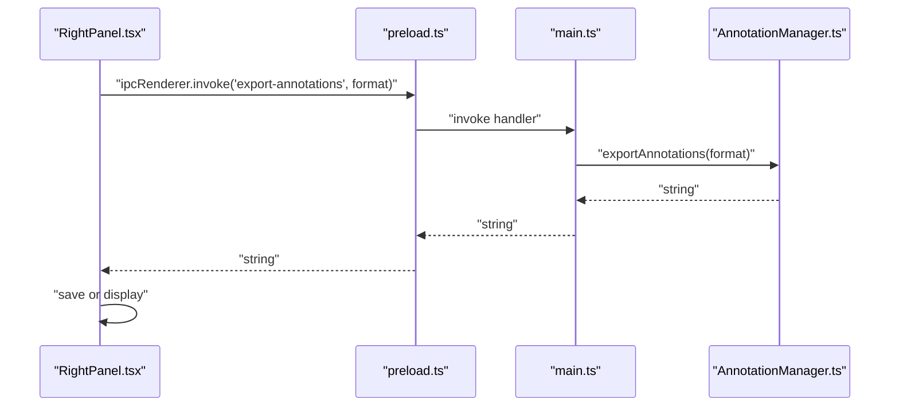
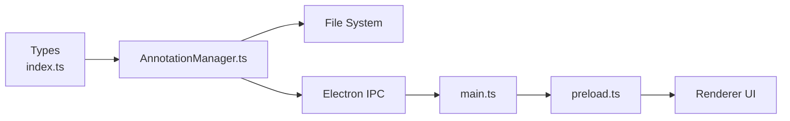
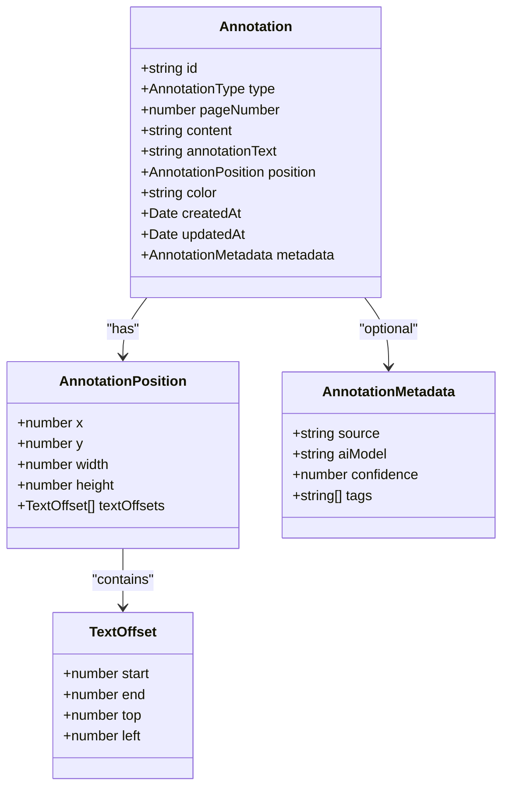

# Annotation Export

<cite>
**Referenced Files in This Document**
- [AnnotationManager.ts](file://src/core/AnnotationManager.ts)
- [index.ts](file://src/types/index.ts)
- [main.ts](file://src/main.ts)
- [preload.ts](file://src/preload.ts)
- [RightPanel.tsx](file://src/renderer/components/RightPanel.tsx)
- [App.tsx](file://src/renderer/App.tsx)
- [package.json](file://package.json)
</cite>

## Table of Contents
1. [Introduction](#introduction)
2. [Project Structure](#project-structure)
3. [Core Components](#core-components)
4. [Architecture Overview](#architecture-overview)
5. [Detailed Component Analysis](#detailed-component-analysis)
6. [Dependency Analysis](#dependency-analysis)
7. [Performance Considerations](#performance-considerations)
8. [Troubleshooting Guide](#troubleshooting-guide)
9. [Conclusion](#conclusion)
10. [Appendices](#appendices)

## Introduction
This document describes the annotation export system in SciPDFReader, focusing on supported export formats and data interchange capabilities. It documents the exportAnnotations method with format parameters (json, markdown, html) and their output structures, explains the JSON export format with complete annotation serialization, details Markdown export with hierarchical organization and formatting conventions, covers the HTML export system with styled presentations, and outlines the export workflow from data retrieval through serialization to file generation. It also addresses performance considerations for large datasets, memory optimization strategies, integration with external systems, and guidance for developing custom export formats.

## Project Structure
The annotation export capability is implemented in the Electron main process and exposed to the renderer via IPC. The core module responsible for export is the AnnotationManager, which serializes annotations to JSON, Markdown, or HTML. The renderer UI integrates with the main process to trigger exports and present results.

**Diagram sources**
- [main.ts:1-156](file://src/main.ts#L1-L156)
- [AnnotationManager.ts:1-172](file://src/core/AnnotationManager.ts#L1-L172)
- [index.ts:1-224](file://src/types/index.ts#L1-L224)
- [preload.ts:1-34](file://src/preload.ts#L1-L34)
- [App.tsx:1-103](file://src/renderer/App.tsx#L1-L103)
- [RightPanel.tsx:1-171](file://src/renderer/components/RightPanel.tsx#L1-L171)

**Section sources**
- [main.ts:1-156](file://src/main.ts#L1-L156)
- [AnnotationManager.ts:1-172](file://src/core/AnnotationManager.ts#L1-L172)
- [index.ts:1-224](file://src/types/index.ts#L1-L224)
- [preload.ts:1-34](file://src/preload.ts#L1-L34)
- [App.tsx:1-103](file://src/renderer/App.tsx#L1-L103)
- [RightPanel.tsx:1-171](file://src/renderer/components/RightPanel.tsx#L1-L171)

## Core Components
- AnnotationManager: Provides exportAnnotations(format) returning serialized content for json, markdown, or html. Also manages persistence and retrieval of annotations.
- Types: Defines the Annotation interface and related structures used by export.
- Electron Main: Registers IPC handlers for annotation operations and exposes the AnnotationManager to the renderer.
- Preload Bridge: Exposes safe IPC methods to the renderer.
- Renderer UI: Integrates with the main process to trigger exports and display results.

Key responsibilities:
- Data retrieval: getAllAnnotations or getAnnotations(pageNumber) to gather annotations for export.
- Serialization: exportAnnotations(format) produces formatted output strings.
- Persistence: saveAnnotations/loadAnnotations manage local storage of annotations.

**Section sources**
- [AnnotationManager.ts:96-171](file://src/core/AnnotationManager.ts#L96-L171)
- [index.ts:36-47](file://src/types/index.ts#L36-L47)
- [main.ts:123-135](file://src/main.ts#L123-L135)
- [preload.ts:5-33](file://src/preload.ts#L5-L33)

## Architecture Overview
The export workflow spans renderer-to-main IPC and main-process serialization. The renderer triggers export via preload, the main process invokes AnnotationManager, which serializes annotations and returns a string. The renderer can then save or display the result.

**Diagram sources**
- [RightPanel.tsx:1-171](file://src/renderer/components/RightPanel.tsx#L1-L171)
- [preload.ts:5-33](file://src/preload.ts#L5-L33)
- [main.ts:123-135](file://src/main.ts#L123-L135)
- [AnnotationManager.ts:96-171](file://src/core/AnnotationManager.ts#L96-L171)

## Detailed Component Analysis

### AnnotationManager.exportAnnotations(format)
The export method accepts a format parameter and returns a string containing serialized annotations. Supported formats:
- json: Full serialization of all annotations with metadata.
- markdown: Human-readable hierarchical structure with fields for each annotation.
- html: Web-friendly presentation with inline styles.

Behavior:
- Retrieves all annotations via getAllAnnotations.
- Switches on format to produce the appropriate output.
- Defaults to JSON if an unsupported format is provided.

Output characteristics:
- json: Complete array of annotations with all fields including id, type, pageNumber, content, annotationText, position, color, createdAt, updatedAt, and metadata.
- markdown: Headings, lists, and field blocks for each annotation.
- html: Structured divs with colored borders and inline emphasis.

**Diagram sources**
- [AnnotationManager.ts:96-112](file://src/core/AnnotationManager.ts#L96-L112)

**Section sources**
- [AnnotationManager.ts:96-112](file://src/core/AnnotationManager.ts#L96-L112)

### JSON Export Format
The JSON export serializes the complete annotation array. Each annotation includes:
- id: Unique identifier.
- type: Annotation type enum value.
- pageNumber: Target page number.
- content: Extracted or selected text.
- annotationText: Optional user note or AI-generated content.
- position: Position geometry and offsets.
- color: Optional color string.
- createdAt/updatedAt: ISO date strings.
- metadata: Optional structured metadata (tags, confidence, provider-specific fields).

Serialization details:
- Uses JSON.stringify with indentation for readability.
- Preserves all fields defined in the Annotation interface.

Example structure outline:
- Array of objects with fields: id, type, pageNumber, content, annotationText, position, color, createdAt, updatedAt, metadata.

Customization options:
- Add or remove fields by extending the Annotation interface and updating serialization logic.
- Filter or transform annotations before serialization.

**Section sources**
- [AnnotationManager.ts:96-101](file://src/core/AnnotationManager.ts#L96-L101)
- [index.ts:36-47](file://src/types/index.ts#L36-L47)

### Markdown Export
The Markdown export organizes annotations under a top-level heading, with each annotation represented as a subsection. Fields included per annotation:
- Type (uppercase).
- Page number.
- Content.
- Optional annotation text.
- Created timestamp (ISO).

Formatting conventions:
- Hierarchical headings for each annotation.
- Field labels with bold emphasis.
- Newlines separate entries.

Customization options:
- Modify field order or labels in exportToMarkdown.
- Adjust heading levels or add frontmatter.

**Section sources**
- [AnnotationManager.ts:114-130](file://src/core/AnnotationManager.ts#L114-L130)

### HTML Export
The HTML export creates a standalone web page with:
- DOCTYPE and basic HTML structure.
- Inline styles for visual distinction:
  - Left border color derived from annotation.color or fallback.
  - Emphasis on content and optional annotation text.
- Per-annotation divs grouped in a body container.

Customization options:
- Externalize styles to a stylesheet.
- Add CSS classes and modular templates.
- Integrate with a templating engine for dynamic layouts.

**Section sources**
- [AnnotationManager.ts:132-151](file://src/core/AnnotationManager.ts#L132-L151)

### Data Retrieval and Persistence
Export relies on retrieving annotations from memory and optionally persisting them to disk. The AnnotationManager maintains an in-memory map of annotations and persists them to a JSON file for later reload.

**Diagram sources**
- [AnnotationManager.ts:153-171](file://src/core/AnnotationManager.ts#L153-L171)

**Section sources**
- [AnnotationManager.ts:77-84](file://src/core/AnnotationManager.ts#L77-L84)
- [AnnotationManager.ts:153-171](file://src/core/AnnotationManager.ts#L153-L171)

### Renderer Integration and Workflow
The renderer integrates with the main process to trigger exports. While the provided files do not show explicit export UI controls, the preload bridge exposes IPC methods for annotation operations. The typical workflow is:
- Renderer requests export via preload.
- Main process calls AnnotationManager.exportAnnotations.
- Renderer receives the serialized content and saves or displays it.

**Diagram sources**
- [RightPanel.tsx:1-171](file://src/renderer/components/RightPanel.tsx#L1-L171)
- [preload.ts:5-33](file://src/preload.ts#L5-L33)
- [main.ts:123-135](file://src/main.ts#L123-L135)
- [AnnotationManager.ts:96-112](file://src/core/AnnotationManager.ts#L96-L112)

**Section sources**
- [preload.ts:5-33](file://src/preload.ts#L5-L33)
- [main.ts:123-135](file://src/main.ts#L123-L135)
- [RightPanel.tsx:1-171](file://src/renderer/components/RightPanel.tsx#L1-L171)

## Dependency Analysis
The export system depends on:
- AnnotationManager for data retrieval and serialization.
- Types for consistent data structures.
- Electron IPC for cross-process communication.
- File system for persistence.

**Diagram sources**
- [index.ts:1-224](file://src/types/index.ts#L1-L224)
- [AnnotationManager.ts:1-172](file://src/core/AnnotationManager.ts#L1-L172)
- [main.ts:1-156](file://src/main.ts#L1-L156)
- [preload.ts:1-34](file://src/preload.ts#L1-L34)

**Section sources**
- [index.ts:1-224](file://src/types/index.ts#L1-L224)
- [AnnotationManager.ts:1-172](file://src/core/AnnotationManager.ts#L1-L172)
- [main.ts:1-156](file://src/main.ts#L1-L156)
- [preload.ts:1-34](file://src/preload.ts#L1-L34)

## Performance Considerations
- Memory footprint:
  - Annotations are stored in-memory as a Map. Large datasets increase memory usage proportional to the number of annotations and their content sizes.
  - Consider pagination or chunked retrieval for very large sets.
- Serialization cost:
  - JSON.stringify is efficient for moderate sizes. For large arrays, streaming or incremental writes could reduce peak memory.
- Disk I/O:
  - saveAnnotations/writeFileSync is synchronous and blocks the event loop. For large exports, offload to a worker thread or use asynchronous APIs.
- Rendering and UI:
  - HTML export includes inline styles; externalizing CSS reduces payload size for large exports.
- Recommendations:
  - Batch export operations and avoid frequent re-exports.
  - Use lazy evaluation for content fields when not needed.
  - Consider compression for large JSON exports.

[No sources needed since this section provides general guidance]

## Troubleshooting Guide
Common issues and resolutions:
- Missing annotations in export:
  - Ensure annotations are saved before export; verify saveAnnotations completes.
  - Confirm getAllAnnotations returns expected results.
- Incorrect or missing color in HTML:
  - Verify annotation.color is set; fallback color is used otherwise.
- Export returns empty or unexpected format:
  - Validate format parameter is one of json, markdown, html.
  - Check default case behavior if an unsupported format is passed.
- File system errors:
  - Ensure the data directory exists and is writable.
  - Handle permission errors gracefully.

**Section sources**
- [AnnotationManager.ts:153-171](file://src/core/AnnotationManager.ts#L153-L171)
- [AnnotationManager.ts:132-151](file://src/core/AnnotationManager.ts#L132-L151)
- [AnnotationManager.ts:96-112](file://src/core/AnnotationManager.ts#L96-L112)

## Conclusion
The annotation export system provides flexible, cross-format serialization suitable for downstream analysis, sharing, and integration. JSON ensures complete fidelity, Markdown offers human-readable organization, and HTML enables quick web previews. The system’s architecture cleanly separates concerns between data management, serialization, and IPC, enabling straightforward extension and optimization for larger datasets.

[No sources needed since this section summarizes without analyzing specific files]

## Appendices

### Data Model Overview
The Annotation interface defines the core structure used by export.

**Diagram sources**
- [index.ts:36-47](file://src/types/index.ts#L36-L47)
- [index.ts:13-26](file://src/types/index.ts#L13-L26)
- [index.ts:28-34](file://src/types/index.ts#L28-L34)

### Example Output Structures
- JSON export:
  - Array of annotation objects with all fields defined in the Annotation interface.
- Markdown export:
  - Top-level heading followed by numbered subsections for each annotation, with field blocks for type, page, content, optional annotation text, and created timestamp.
- HTML export:
  - Standalone HTML document with a heading and a series of styled divs representing each annotation.

[No sources needed since this section describes conceptual outputs]

### Integration and Portability
- Interoperability:
  - JSON export is universally compatible with external tools and databases.
  - Markdown export is portable across documentation systems and editors.
  - HTML export is web-ready but may require CSS adjustments for broader compatibility.
- External systems:
  - Use JSON for ingestion into external applications, analytics pipelines, or storage systems.
  - Convert Markdown to other formats (e.g., PDF) using standard toolchains.
  - Host HTML exports on static sites or embed them in web apps.

[No sources needed since this section provides general guidance]

### Custom Export Formats
Extensibility patterns:
- Extend AnnotationManager:
  - Add new export methods (e.g., exportToCSV, exportToXML) mirroring existing patterns.
  - Keep serialization logic encapsulated and testable.
- Plugin architecture:
  - Leverage the existing plugin system to register custom export commands and handlers.
  - Use the preload bridge to expose new IPC methods for renderer-triggered exports.
- Template-driven exports:
  - Externalize HTML/CSS to templates for easier customization and maintenance.
  - Support configurable themes and layouts.

[No sources needed since this section provides general guidance]