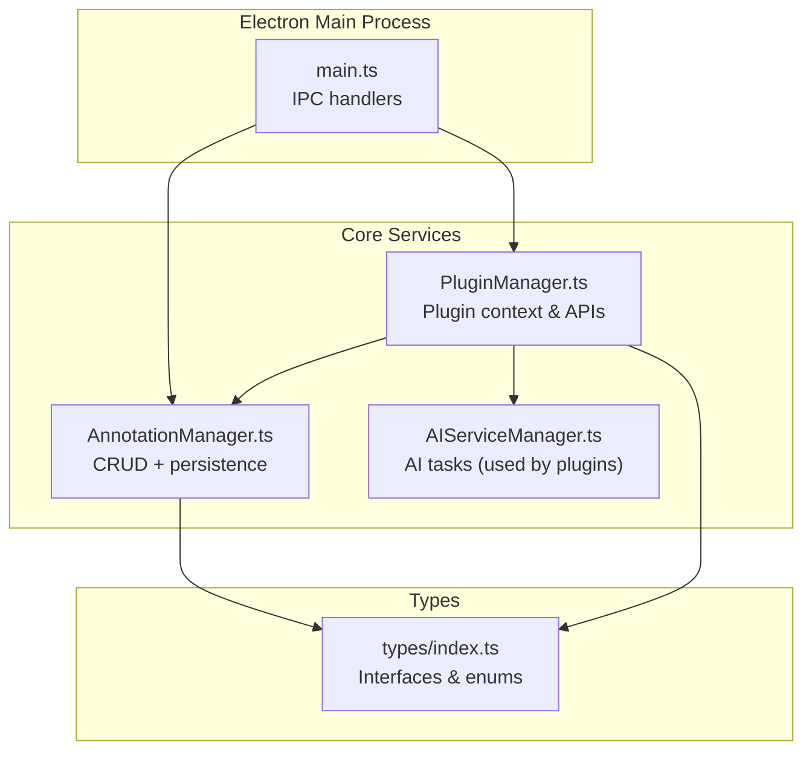
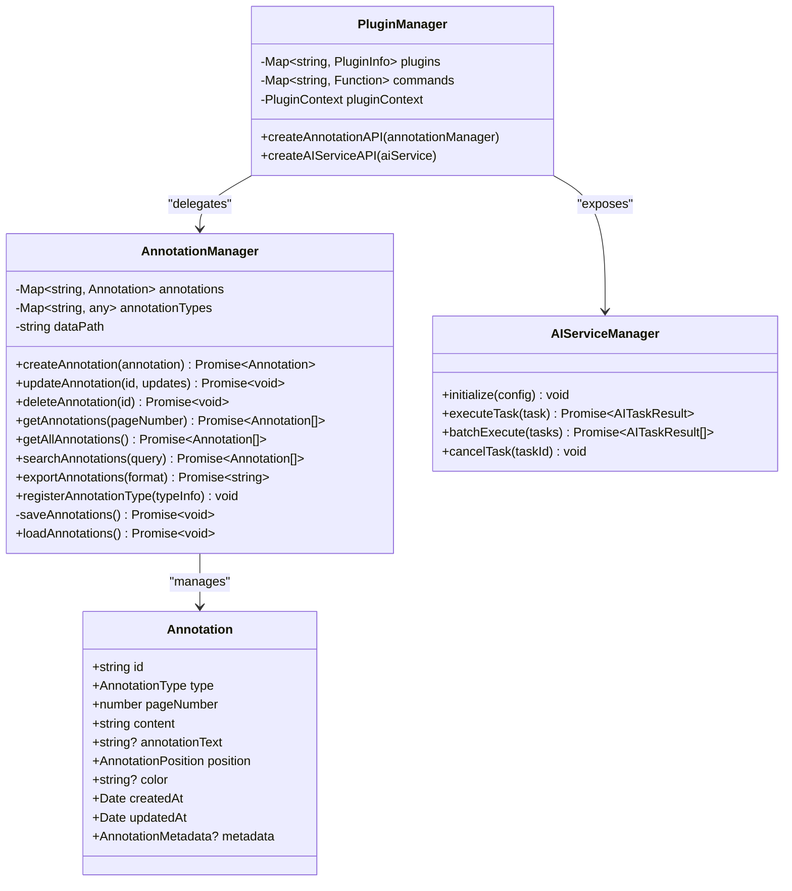
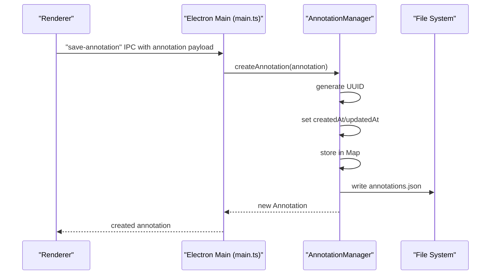
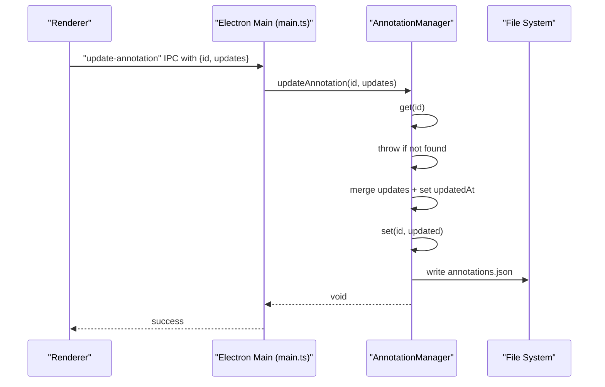
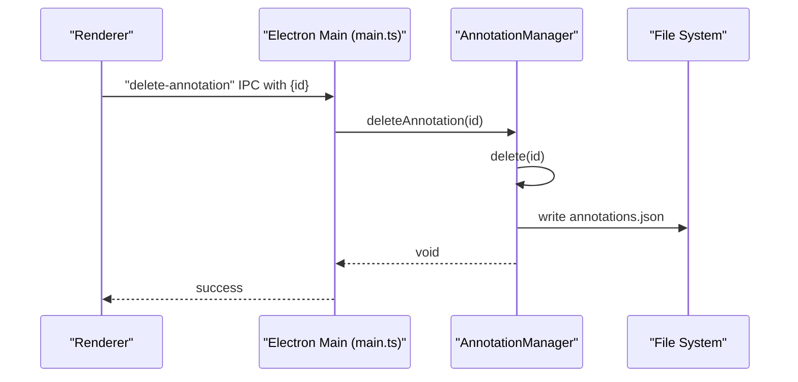
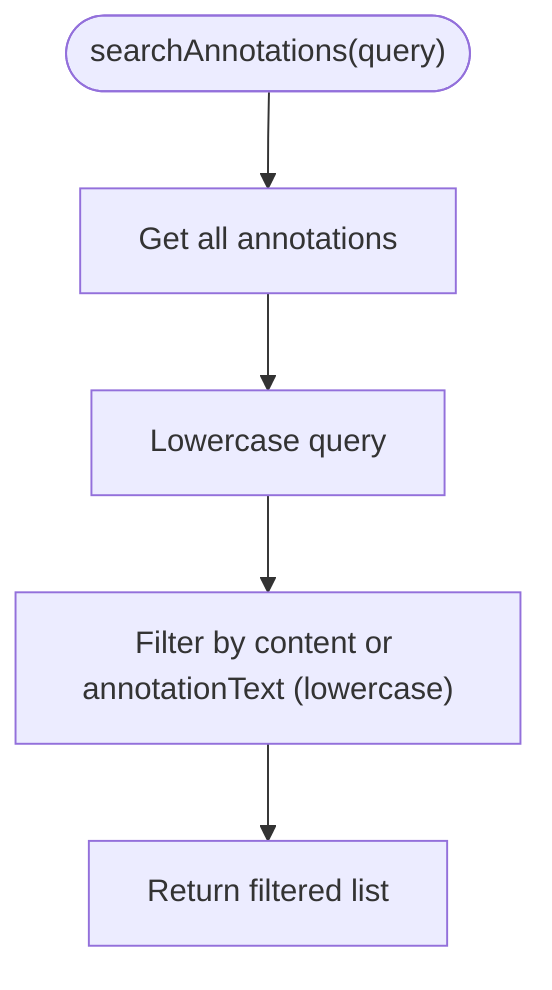
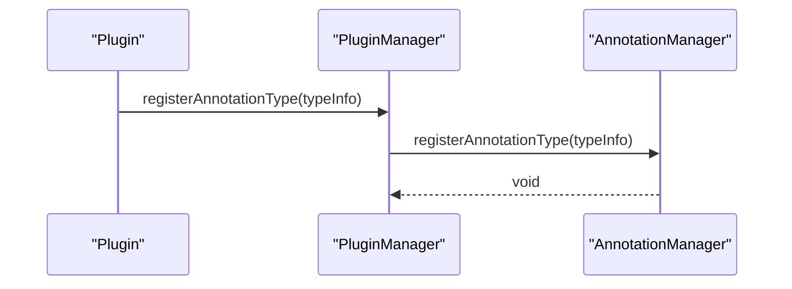
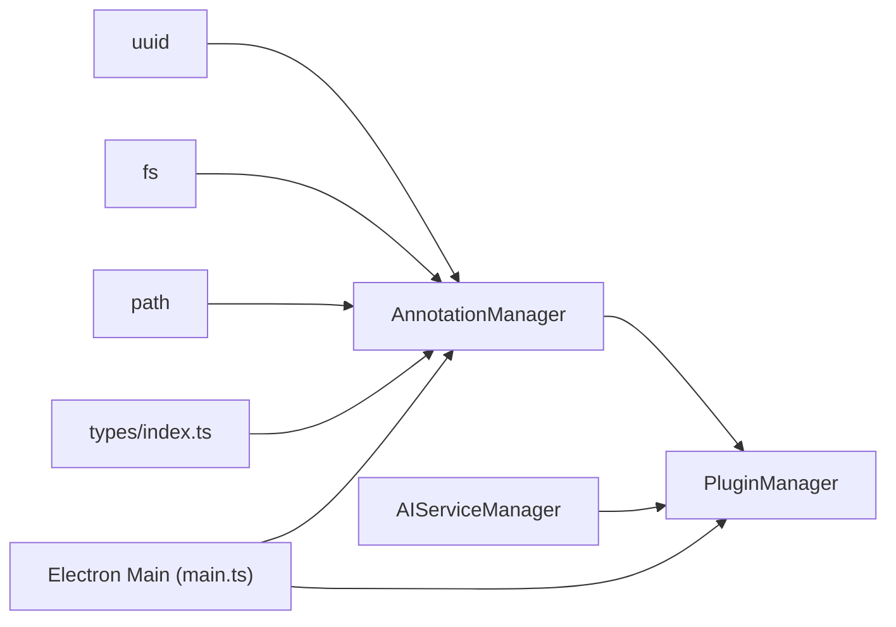
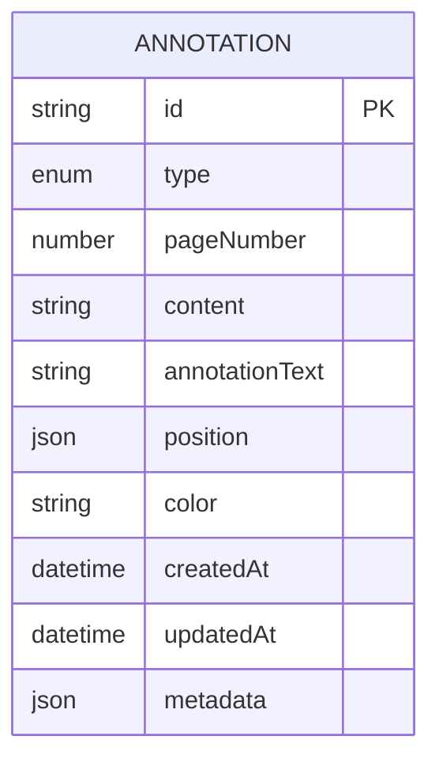

# Annotation Operations

<cite>
**Referenced Files in This Document**
- [AnnotationManager.ts](file://src/core/AnnotationManager.ts)
- [types/index.ts](file://src/types/index.ts)
- [main.ts](file://src/main.ts)
- [PluginManager.ts](file://src/core/PluginManager.ts)
- [AIServiceManager.ts](file://src/core/AIServiceManager.ts)
- [PLUGIN-GUIDE.md](file://PLUGIN-GUIDE.md)
- [README.md](file://README.md)
</cite>

## Table of Contents
1. [Introduction](#introduction)
2. [Project Structure](#project-structure)
3. [Core Components](#core-components)
4. [Architecture Overview](#architecture-overview)
5. [Detailed Component Analysis](#detailed-component-analysis)
6. [Dependency Analysis](#dependency-analysis)
7. [Performance Considerations](#performance-considerations)
8. [Troubleshooting Guide](#troubleshooting-guide)
9. [Conclusion](#conclusion)
10. [Appendices](#appendices)

## Introduction
This document provides comprehensive coverage of annotation operations in the application, focusing on the complete CRUD lifecycle: create, read, update, delete, and search. It explains parameter validation, UUID generation, automatic timestamping, partial updates, conflict resolution, cascading deletion behavior, retrieval of page-specific and full collections, and text-based search with query processing. It also documents the annotation type registration system for extending supported annotation types, outlines performance considerations for large datasets, and provides troubleshooting guidance for common operation failures and data consistency issues.

## Project Structure
The annotation system is centered around a dedicated manager class that stores annotations in memory and persists them to disk. The Electron main process exposes IPC handlers for renderer-side operations, while the plugin system integrates with the annotation manager to provide extensibility.

**Diagram sources**
- [main.ts:1-156](file://src/main.ts#L1-L156)
- [AnnotationManager.ts:1-172](file://src/core/AnnotationManager.ts#L1-L172)
- [PluginManager.ts:1-250](file://src/core/PluginManager.ts#L1-L250)
- [AIServiceManager.ts:1-214](file://src/core/AIServiceManager.ts#L1-L214)
- [types/index.ts:1-224](file://src/types/index.ts#L1-L224)

**Section sources**
- [main.ts:1-156](file://src/main.ts#L1-L156)
- [AnnotationManager.ts:1-172](file://src/core/AnnotationManager.ts#L1-L172)
- [PluginManager.ts:1-250](file://src/core/PluginManager.ts#L1-L250)
- [AIServiceManager.ts:1-214](file://src/core/AIServiceManager.ts#L1-L214)
- [types/index.ts:1-224](file://src/types/index.ts#L1-L224)

## Core Components
- AnnotationManager: Implements CRUD operations, UUID generation, timestamps, persistence, and search.
- Types: Defines the Annotation interface, AnnotationType enum, and related structures.
- PluginManager: Exposes a typed API surface to plugins, forwarding calls to AnnotationManager.
- Electron main process: Provides IPC handlers for renderer to invoke annotation operations.

Key responsibilities:
- Create: Generates a UUID, sets createdAt/updatedAt timestamps, stores in memory, and persists to disk.
- Read: Retrieves page-specific annotations and full collections; supports search by content.
- Update: Performs partial updates with automatic timestamp updates.
- Delete: Removes an annotation and persists the updated collection.
- Search: Case-insensitive substring matching across content and optional annotationText.

**Section sources**
- [AnnotationManager.ts:46-94](file://src/core/AnnotationManager.ts#L46-L94)
- [types/index.ts:36-47](file://src/types/index.ts#L36-L47)
- [PluginManager.ts:205-214](file://src/core/PluginManager.ts#L205-L214)
- [main.ts:123-135](file://src/main.ts#L123-L135)

## Architecture Overview
The annotation system follows a layered architecture:
- Types define the contract for annotations and related structures.
- AnnotationManager encapsulates business logic and persistence.
- PluginManager creates a plugin-facing API that delegates to AnnotationManager.
- Electron main process exposes IPC handlers to the renderer for annotation operations.

**Diagram sources**
- [AnnotationManager.ts:6-172](file://src/core/AnnotationManager.ts#L6-L172)
- [types/index.ts:36-47](file://src/types/index.ts#L36-L47)
- [PluginManager.ts:16-36](file://src/core/PluginManager.ts#L16-L36)
- [AIServiceManager.ts:3-11](file://src/core/AIServiceManager.ts#L3-L11)

## Detailed Component Analysis

### Create Annotation
Behavior:
- Generates a UUID for the new annotation.
- Sets createdAt and updatedAt to the current timestamp.
- Merges incoming annotation with defaults and timestamps.
- Stores in-memory map keyed by ID.
- Persists the entire collection to disk asynchronously.

Validation and constraints:
- No explicit runtime validation is performed in the manager; consumers should ensure required fields are present before calling.
- The Annotation interface defines required fields; missing fields will cause downstream type errors.

Timestamps:
- Both createdAt and updatedAt are set during creation.

Persistence:
- Saves to a JSON file under a user-specific data directory.

**Diagram sources**
- [main.ts:123-128](file://src/main.ts#L123-L128)
- [AnnotationManager.ts:46-59](file://src/core/AnnotationManager.ts#L46-L59)
- [AnnotationManager.ts:153-157](file://src/core/AnnotationManager.ts#L153-L157)

**Section sources**
- [AnnotationManager.ts:46-59](file://src/core/AnnotationManager.ts#L46-L59)
- [AnnotationManager.ts:153-157](file://src/core/AnnotationManager.ts#L153-L157)
- [main.ts:123-128](file://src/main.ts#L123-L128)

### Update Annotation
Behavior:
- Retrieves the existing annotation by ID.
- Throws if not found.
- Creates a merged object with partial updates and updates updatedAt.
- Replaces the stored annotation and persists immediately.

Partial updates:
- Uses a Partial<Annotation> parameter to allow updating only specified fields.

Conflict resolution:
- Overwrites the stored annotation with the merged result.
- No optimistic concurrency control; last-write-wins semantics apply.

**Diagram sources**
- [main.ts:130-135](file://src/main.ts#L130-L135)
- [AnnotationManager.ts:61-70](file://src/core/AnnotationManager.ts#L61-L70)
- [AnnotationManager.ts:153-157](file://src/core/AnnotationManager.ts#L153-L157)

**Section sources**
- [AnnotationManager.ts:61-70](file://src/core/AnnotationManager.ts#L61-L70)
- [main.ts:130-135](file://src/main.ts#L130-L135)

### Delete Annotation
Behavior:
- Removes the annotation by ID from the in-memory map.
- Persists the updated collection to disk.

Cascade effects:
- No cascading deletions are implemented; related data is not automatically removed.
- The manager does not track cross-references to other entities.

**Diagram sources**
- [main.ts:130-135](file://src/main.ts#L130-L135)
- [AnnotationManager.ts:72-75](file://src/core/AnnotationManager.ts#L72-L75)
- [AnnotationManager.ts:153-157](file://src/core/AnnotationManager.ts#L153-L157)

**Section sources**
- [AnnotationManager.ts:72-75](file://src/core/AnnotationManager.ts#L72-L75)
- [main.ts:130-135](file://src/main.ts#L130-L135)

### Retrieve Annotations
- getAnnotations(pageNumber): Filters all annotations by pageNumber and returns matching entries.
- getAllAnnotations(): Returns the entire collection.

Notes:
- These methods operate on the in-memory map and do not filter by other criteria.
- There is no pagination or limit; full collection is returned.

**Section sources**
- [AnnotationManager.ts:77-84](file://src/core/AnnotationManager.ts#L77-L84)

### Search Annotations
Behavior:
- Converts the query to lowercase.
- Filters all annotations where either content or annotationText (if present) contains the query as a substring, case-insensitively.

Algorithm:
- Linear scan over all annotations with O(n) complexity.
- Substring matching using includes().

**Diagram sources**
- [AnnotationManager.ts:86-94](file://src/core/AnnotationManager.ts#L86-L94)

**Section sources**
- [AnnotationManager.ts:86-94](file://src/core/AnnotationManager.ts#L86-L94)

### Export Annotations
Behavior:
- Supports exporting to JSON, Markdown, or HTML formats.
- Uses the in-memory collection for export.

**Section sources**
- [AnnotationManager.ts:96-151](file://src/core/AnnotationManager.ts#L96-L151)

### Annotation Type Registration
Default types:
- The manager initializes with default annotation types (highlight, underline, strikethrough, note, translation, background info).

Extending types:
- registerAnnotationType(typeInfo) allows adding custom types at runtime.
- Plugins can register types via the plugin API and IPC handler.

**Diagram sources**
- [PluginManager.ts:205-214](file://src/core/PluginManager.ts#L205-L214)
- [AnnotationManager.ts:42-44](file://src/core/AnnotationManager.ts#L42-L44)
- [main.ts:151-155](file://src/main.ts#L151-L155)

**Section sources**
- [AnnotationManager.ts:21-34](file://src/core/AnnotationManager.ts#L21-L34)
- [AnnotationManager.ts:42-44](file://src/core/AnnotationManager.ts#L42-L44)
- [PluginManager.ts:205-214](file://src/core/PluginManager.ts#L205-L214)
- [main.ts:151-155](file://src/main.ts#L151-L155)
- [PLUGIN-GUIDE.md:129-135](file://PLUGIN-GUIDE.md#L129-L135)

### Practical Usage Patterns and Error Handling
- Renderer invokes IPC handlers to perform operations.
- Errors thrown by the manager (e.g., update on non-existent ID) propagate to the renderer.
- Plugins can call the annotation API through the plugin context.

Examples from the codebase:
- Creating an annotation via plugin context and AI service integration.
- Registering a custom annotation type from a plugin.

**Section sources**
- [main.ts:123-135](file://src/main.ts#L123-L135)
- [PLUGIN-GUIDE.md:148-174](file://PLUGIN-GUIDE.md#L148-L174)
- [PLUGIN-GUIDE.md:129-135](file://PLUGIN-GUIDE.md#L129-L135)

## Dependency Analysis
- AnnotationManager depends on:
  - uuid for ID generation.
  - fs and path for persistence.
  - Types for data contracts.
- PluginManager depends on AnnotationManager and AIServiceManager to expose APIs to plugins.
- Electron main process depends on AnnotationManager for IPC-backed operations.

**Diagram sources**
- [AnnotationManager.ts:1-4](file://src/core/AnnotationManager.ts#L1-L4)
- [types/index.ts:1-224](file://src/types/index.ts#L1-L224)
- [PluginManager.ts:1-6](file://src/core/PluginManager.ts#L1-L6)
- [AIServiceManager.ts:1-2](file://src/core/AIServiceManager.ts#L1-L2)
- [main.ts:1-7](file://src/main.ts#L1-L7)

**Section sources**
- [AnnotationManager.ts:1-4](file://src/core/AnnotationManager.ts#L1-L4)
- [types/index.ts:1-224](file://src/types/index.ts#L1-L224)
- [PluginManager.ts:1-6](file://src/core/PluginManager.ts#L1-L6)
- [AIServiceManager.ts:1-2](file://src/core/AIServiceManager.ts#L1-L2)
- [main.ts:1-7](file://src/main.ts#L1-L7)

## Performance Considerations
- Data structure: In-memory Map provides O(1) average-time insertion and lookup by ID.
- Retrieval:
  - getAnnotations(pageNumber) performs a linear scan over all annotations; complexity O(n).
  - getAllAnnotations() returns all annotations; complexity O(n).
- Search:
  - searchAnnotations() performs a linear scan and substring match; complexity O(n*m) where n is count and m is average length of searchable fields.
- Persistence:
  - saveAnnotations() writes the entire collection to disk on each change; complexity O(n).
- Recommendations:
  - For large datasets, consider indexing by pageNumber and/or content hash to accelerate filtering and search.
  - Batch updates and periodic saves can reduce write frequency.
  - Implement lazy loading and pagination for getAllAnnotations() to avoid loading the entire collection at once.
  - Use a database-backed store (e.g., SQLite) for persistent storage to improve scalability and ACID guarantees.

[No sources needed since this section provides general guidance]

## Troubleshooting Guide
Common issues and resolutions:
- Annotation not found during update:
  - Cause: Attempting to update a non-existent ID.
  - Resolution: Ensure the ID exists before calling update; consider checking existence or catching and handling the error.
  - Evidence: Update method throws when annotation is not found.
- Missing required fields:
  - Cause: Annotation payload lacks required fields defined by the interface.
  - Resolution: Validate inputs before calling createAnnotation; ensure id, type, pageNumber, content, position, createdAt, updatedAt are provided or defaulted by the manager.
- Search returns unexpected results:
  - Cause: Case-insensitive substring matching; partial matches are included.
  - Resolution: Normalize input (e.g., trim, lowercase) and consider exact match or phrase matching if needed.
- Persistence failures:
  - Cause: Disk write errors or permission issues.
  - Resolution: Verify data directory path and permissions; ensure the directory exists and is writable.
- Plugin registration not taking effect:
  - Cause: Incorrect type definition or IPC handler not invoked.
  - Resolution: Confirm the plugin contributes annotation types and the IPC handler is called; verify the typeInfo shape.

**Section sources**
- [AnnotationManager.ts:63-65](file://src/core/AnnotationManager.ts#L63-L65)
- [AnnotationManager.ts:86-94](file://src/core/AnnotationManager.ts#L86-L94)
- [AnnotationManager.ts:153-157](file://src/core/AnnotationManager.ts#L153-L157)
- [main.ts:151-155](file://src/main.ts#L151-L155)

## Conclusion
The annotation system provides a straightforward, extensible foundation for managing PDF annotations with robust IPC integration and plugin support. While the current implementation prioritizes simplicity and immediate persistence, performance and scalability can be improved with indexing, batching, and a database backend. The type registration mechanism enables plugins to extend supported annotation types, and the search functionality offers a practical way to discover annotations by content.

[No sources needed since this section summarizes without analyzing specific files]

## Appendices

### API Surface Summary
- createAnnotation(annotation): Creates a new annotation with UUID and timestamps.
- updateAnnotation(id, updates): Updates an existing annotation with partial updates and timestamp.
- deleteAnnotation(id): Removes an annotation by ID.
- getAnnotations(pageNumber): Retrieves annotations for a given page.
- getAllAnnotations(): Retrieves all annotations.
- searchAnnotations(query): Searches annotations by content or annotationText.
- exportAnnotations(format): Exports annotations to JSON, Markdown, or HTML.
- registerAnnotationType(typeInfo): Registers a new annotation type.

**Section sources**
- [AnnotationManager.ts:46-94](file://src/core/AnnotationManager.ts#L46-L94)
- [AnnotationManager.ts:96-151](file://src/core/AnnotationManager.ts#L96-L151)
- [types/index.ts:148-155](file://src/types/index.ts#L148-L155)

### Data Model Overview

**Diagram sources**
- [types/index.ts:36-47](file://src/types/index.ts#L36-L47)