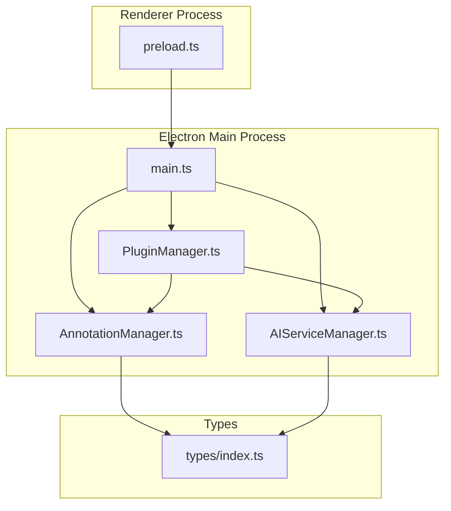
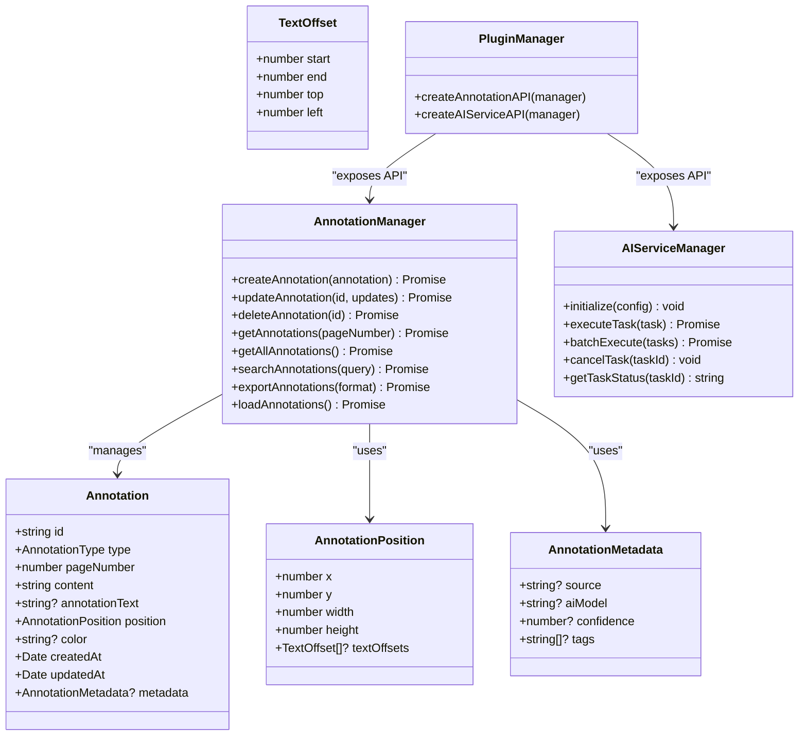
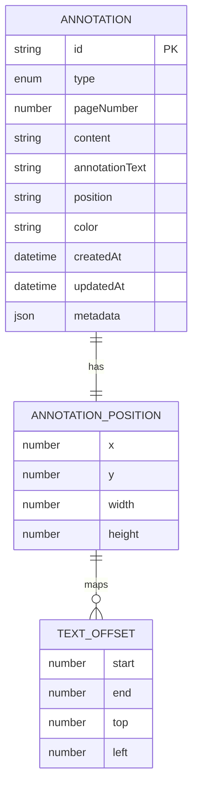
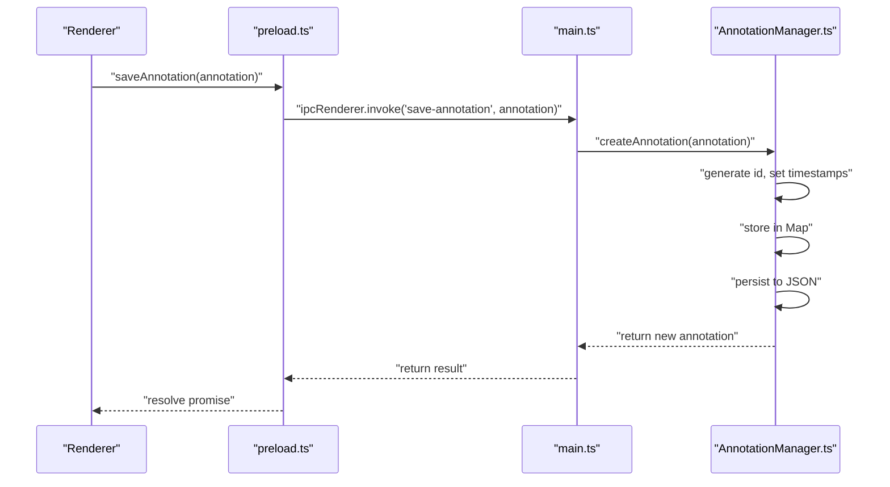
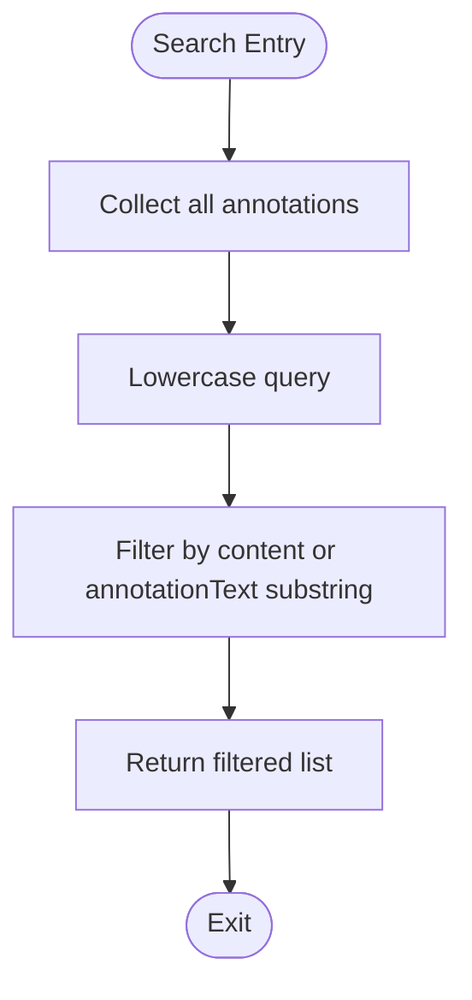
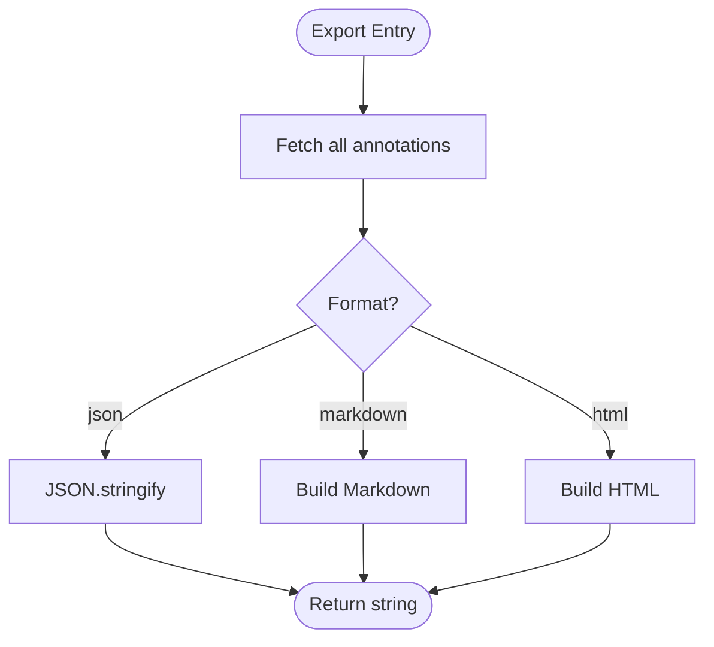
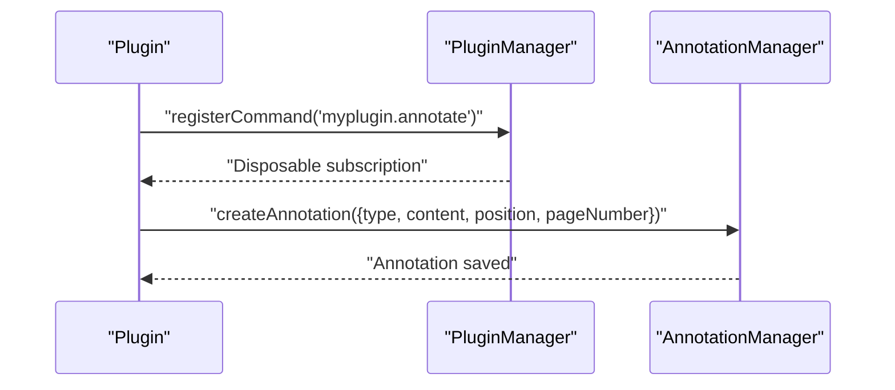
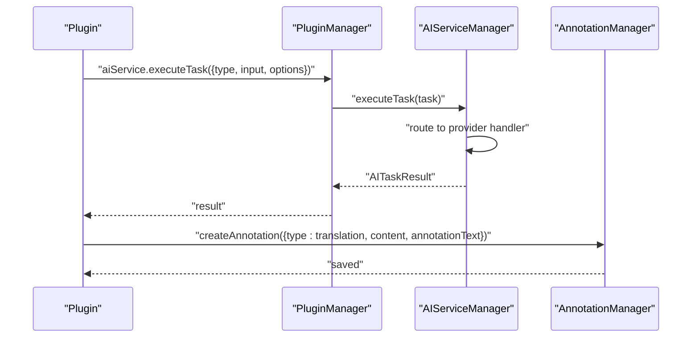
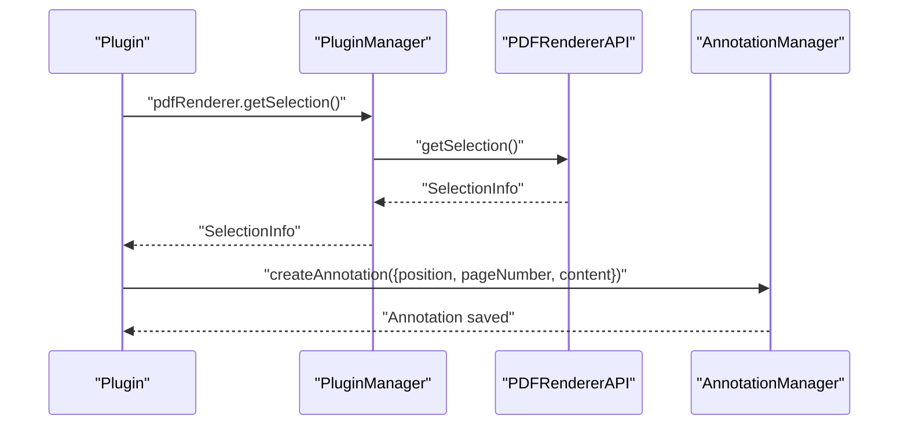
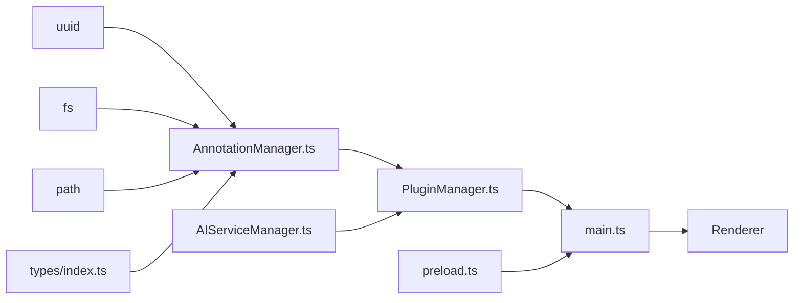

# Annotation System

<cite>
**Referenced Files in This Document**
- [AnnotationManager.ts](file://src/core/AnnotationManager.ts)
- [AIServiceManager.ts](file://src/core/AIServiceManager.ts)
- [PluginManager.ts](file://src/core/PluginManager.ts)
- [index.ts](file://src/types/index.ts)
- [main.ts](file://src/main.ts)
- [preload.ts](file://src/preload.ts)
- [DESIGN.md](file://DESIGN.md)
- [README.md](file://README.md)
- [PLUGIN-GUIDE.md](file://PLUGIN-GUIDE.md)
- [package.json](file://package.json)
</cite>

## Table of Contents
1. [Introduction](#introduction)
2. [Project Structure](#project-structure)
3. [Core Components](#core-components)
4. [Architecture Overview](#architecture-overview)
5. [Detailed Component Analysis](#detailed-component-analysis)
6. [Dependency Analysis](#dependency-analysis)
7. [Performance Considerations](#performance-considerations)
8. [Troubleshooting Guide](#troubleshooting-guide)
9. [Conclusion](#conclusion)
10. [Appendices](#appendices)

## Introduction
This document describes the annotation system for SciPDFReader, focusing on multi-type annotation capabilities, data management, and integration with AI services and PDF rendering. It explains the annotation data model, CRUD operations, search and filtering, export formats, interface design, persistence, synchronization and backup strategies, and practical examples of annotation types. It also covers plugin integration, performance optimization, and troubleshooting guidance.

## Project Structure
The annotation system spans core modules, type definitions, IPC bridges, and plugin integration. The Electron main process initializes managers and exposes IPC handlers for the renderer process. Types define the annotation model and related interfaces.

**Diagram sources**
- [main.ts:1-118](file://src/main.ts#L1-L118)
- [AnnotationManager.ts:1-172](file://src/core/AnnotationManager.ts#L1-L172)
- [AIServiceManager.ts:1-214](file://src/core/AIServiceManager.ts#L1-L214)
- [PluginManager.ts:1-247](file://src/core/PluginManager.ts#L1-L247)
- [preload.ts:1-34](file://src/preload.ts#L1-L34)
- [index.ts:1-224](file://src/types/index.ts#L1-L224)

**Section sources**
- [main.ts:1-118](file://src/main.ts#L1-L118)
- [preload.ts:1-34](file://src/preload.ts#L1-L34)
- [index.ts:1-224](file://src/types/index.ts#L1-L224)

## Core Components
- AnnotationManager: Manages annotation lifecycle, persistence, search, and export.
- AIServiceManager: Orchestrates AI tasks (translation, summarization, background info, keyword extraction, Q&A).
- PluginManager: Exposes APIs to plugins and manages plugin lifecycle.
- Types: Defines the annotation data model, positions, metadata, and API contracts.

Key responsibilities:
- Annotation data model: id, type, page number, content, annotation text, position, color, timestamps, metadata.
- CRUD operations: create, update, delete, list by page, list all.
- Search: substring match on content and annotation text.
- Export: JSON, Markdown, HTML.
- Persistence: JSON file storage in user data directory.
- AI integration: task execution and batching with status tracking.
- Plugin integration: exposes APIs to plugins for creating annotations and executing AI tasks.

**Section sources**
- [AnnotationManager.ts:46-171](file://src/core/AnnotationManager.ts#L46-L171)
- [AIServiceManager.ts:8-213](file://src/core/AIServiceManager.ts#L8-L213)
- [PluginManager.ts:200-246](file://src/core/PluginManager.ts#L200-L246)
- [index.ts:36-47](file://src/types/index.ts#L36-L47)

## Architecture Overview
The annotation system is composed of:
- Data model: Annotation, AnnotationPosition, TextOffset, AnnotationMetadata.
- Managers: AnnotationManager and AIServiceManager.
- IPC bridge: preload.ts exposes safe renderer-facing APIs.
- Plugin integration: PluginManager creates annotation and AI APIs for plugins.
- Persistence: AnnotationManager writes JSON to a user-scoped directory.

**Diagram sources**
- [index.ts:36-47](file://src/types/index.ts#L36-L47)
- [index.ts:13-19](file://src/types/index.ts#L13-L19)
- [index.ts:21-26](file://src/types/index.ts#L21-L26)
- [index.ts:28-34](file://src/types/index.ts#L28-L34)
- [AnnotationManager.ts:6-19](file://src/core/AnnotationManager.ts#L6-L19)
- [AIServiceManager.ts:3-11](file://src/core/AIServiceManager.ts#L3-L11)
- [PluginManager.ts:200-246](file://src/core/PluginManager.ts#L200-L246)

## Detailed Component Analysis

### Annotation Data Model
The annotation model captures:
- Identity and categorization: id, type, color.
- Spatial and textual context: pageNumber, content, position with optional text offsets.
- Content and notes: annotationText.
- Timestamps: createdAt, updatedAt.
- Metadata: source, AI model, confidence, tags, and arbitrary fields.

Position tracking:
- AnnotationPosition defines rectangle bounds and optional text offsets for precise text mapping.
- TextOffset records character-level offsets and layout coordinates for accurate rendering.

Type definitions:
- AnnotationType enumerates built-in types and a custom type for extensibility.
- AnnotationTypeDefinition allows plugins to contribute custom annotation types with label and icon.

**Diagram sources**
- [index.ts:36-47](file://src/types/index.ts#L36-L47)
- [index.ts:13-19](file://src/types/index.ts#L13-L19)
- [index.ts:21-26](file://src/types/index.ts#L21-L26)

**Section sources**
- [index.ts:3-11](file://src/types/index.ts#L3-L11)
- [index.ts:13-26](file://src/types/index.ts#L13-L26)
- [index.ts:28-47](file://src/types/index.ts#L28-L47)

### CRUD Operations
- Create: Generates a UUID, sets timestamps, stores in memory, persists to JSON.
- Read: Retrieve by page number or all annotations.
- Update: Validates existence, merges updates, refreshes timestamps, persists.
- Delete: Removes from memory and persists.

**Diagram sources**
- [preload.ts:10-12](file://src/preload.ts#L10-L12)
- [main.ts:85-90](file://src/main.ts#L85-L90)
- [AnnotationManager.ts:46-59](file://src/core/AnnotationManager.ts#L46-L59)

Practical examples from the codebase:
- Create: [AnnotationManager.createAnnotation:46-59](file://src/core/AnnotationManager.ts#L46-L59)
- Update: [AnnotationManager.updateAnnotation:61-70](file://src/core/AnnotationManager.ts#L61-L70)
- Delete: [AnnotationManager.deleteAnnotation:72-75](file://src/core/AnnotationManager.ts#L72-L75)
- Read by page: [AnnotationManager.getAnnotations:77-84](file://src/core/AnnotationManager.ts#L77-L84)
- Read all: [AnnotationManager.getAllAnnotations:82-84](file://src/core/AnnotationManager.ts#L82-L84)

**Section sources**
- [AnnotationManager.ts:46-84](file://src/core/AnnotationManager.ts#L46-L84)
- [main.ts:85-97](file://src/main.ts#L85-L97)
- [preload.ts:10-12](file://src/preload.ts#L10-L12)

### Search and Filtering
- Full-text search across content and annotationText.
- Case-insensitive substring matching.
- Returns filtered list of annotations.

**Diagram sources**
- [AnnotationManager.ts:86-94](file://src/core/AnnotationManager.ts#L86-L94)

**Section sources**
- [AnnotationManager.ts:86-94](file://src/core/AnnotationManager.ts#L86-L94)

### Export Functionality
Supported formats:
- JSON: Serialized annotations array.
- Markdown: Human-readable list with type, page, content, optional annotation text, and timestamps.
- HTML: Styled HTML document with colored left borders per annotation.

**Diagram sources**
- [AnnotationManager.ts:96-151](file://src/core/AnnotationManager.ts#L96-L151)

**Section sources**
- [AnnotationManager.ts:96-151](file://src/core/AnnotationManager.ts#L96-L151)

### Annotation Interface Design
- Toolbar integration: Plugins can register commands and annotation types via the plugin API.
- Visual presentation: Color and icon metadata enable consistent UI representation.
- Editing workflows: Plugins can create, update, and delete annotations based on AI outputs or user actions.

**Diagram sources**
- [PluginManager.ts:120-142](file://src/core/PluginManager.ts#L120-L142)
- [AnnotationManager.ts:46-59](file://src/core/AnnotationManager.ts#L46-L59)

**Section sources**
- [PLUGIN-GUIDE.md:142-174](file://PLUGIN-GUIDE.md#L142-L174)
- [PluginManager.ts:200-211](file://src/core/PluginManager.ts#L200-L211)

### Persistence Layer
- Storage path: User data directory under a platform-appropriate path.
- Directory creation: Ensures the annotations directory exists.
- Save: Writes annotations JSON to disk.
- Load: Reads annotations JSON and restores in-memory map.

Notes:
- The current implementation uses JSON files for persistence. The design document mentions SQLite as an infrastructure layer, but the current codebase uses JSON. If SQLite is desired, the managers would need to be refactored to use database operations while maintaining the same API surface.

**Section sources**
- [AnnotationManager.ts:153-170](file://src/core/AnnotationManager.ts#L153-L170)
- [AnnotationManager.ts:36-40](file://src/core/AnnotationManager.ts#L36-L40)
- [DESIGN.md:274-294](file://DESIGN.md#L274-L294)

### Synchronization, Conflict Resolution, and Backup Strategies
- Current state: The codebase does not implement synchronization or backup. The design document outlines these capabilities conceptually.
- Recommended approach:
  - Versioning: Include a version field in exported data and metadata.
  - Incremental sync: Track lastModified timestamps and upload deltas.
  - Conflict resolution: Last-write-wins or merge strategies for concurrent edits.
  - Backup: Periodic snapshots of annotations JSON or database exports.

**Section sources**
- [DESIGN.md:274-294](file://DESIGN.md#L274-L294)

### AI Services Integration for Automated Annotation Generation
- Task orchestration: AIServiceManager routes tasks to provider-specific handlers.
- Providers: OpenAI, Azure, local, and custom.
- Tasks: Translation, summarization, background info, keyword extraction, question answering.
- Batch execution and cancellation supported.

**Diagram sources**
- [AIServiceManager.ts:13-56](file://src/core/AIServiceManager.ts#L13-L56)
- [PluginManager.ts:213-219](file://src/core/PluginManager.ts#L213-L219)
- [AnnotationManager.ts:46-59](file://src/core/AnnotationManager.ts#L46-L59)

**Section sources**
- [AIServiceManager.ts:8-213](file://src/core/AIServiceManager.ts#L8-L213)
- [PLUGIN-GUIDE.md:176-214](file://PLUGIN-GUIDE.md#L176-L214)

### Integration with PDF Rendering for Accurate Positioning
- PDF renderer API: Provides loadDocument, renderPage, getPageInfo, extractText, getSelection, setZoom.
- Positioning: Annotations include AnnotationPosition and optional TextOffset for precise placement.
- Workflow: Plugins use getSelection to capture ranges and create annotations with position metadata.

**Diagram sources**
- [PluginManager.ts:222-232](file://src/core/PluginManager.ts#L222-L232)
- [AnnotationManager.ts:46-59](file://src/core/AnnotationManager.ts#L46-L59)

**Section sources**
- [PluginManager.ts:222-232](file://src/core/PluginManager.ts#L222-L232)
- [DESIGN.md:89-110](file://DESIGN.md#L89-L110)

### Examples of Annotation Types
- Built-in types: highlight, underline, strikethrough, note, translation, background_info, custom.
- Plugin-defined types: via AnnotationTypeDefinition with label and icon.
- Practical usage: Plugins can register custom types and create annotations of those types.

**Section sources**
- [AnnotationManager.ts:21-34](file://src/core/AnnotationManager.ts#L21-L34)
- [index.ts:105-110](file://src/types/index.ts#L105-L110)
- [PLUGIN-GUIDE.md:78-96](file://PLUGIN-GUIDE.md#L78-L96)

## Dependency Analysis
- AnnotationManager depends on:
  - UUID generation for ids.
  - File system for persistence.
  - Types for data contracts.
- PluginManager depends on:
  - AnnotationManager and AIServiceManager to expose APIs.
  - File system for plugin storage.
- preload.ts depends on:
  - IPC bridge to main process.
  - Electron’s contextBridge for secure exposure.
- main.ts depends on:
  - AnnotationManager and AIServiceManager initialization.
  - IPC handlers for renderer requests.

**Diagram sources**
- [AnnotationManager.ts:1-5](file://src/core/AnnotationManager.ts#L1-L5)
- [AnnotationManager.ts:153-170](file://src/core/AnnotationManager.ts#L153-L170)
- [PluginManager.ts:1-6](file://src/core/PluginManager.ts#L1-L6)
- [main.ts:1-10](file://src/main.ts#L1-L10)
- [preload.ts:1](file://src/preload.ts#L1)

**Section sources**
- [AnnotationManager.ts:1-5](file://src/core/AnnotationManager.ts#L1-L5)
- [PluginManager.ts:1-6](file://src/core/PluginManager.ts#L1-L6)
- [main.ts:1-10](file://src/main.ts#L1-L10)
- [preload.ts:1](file://src/preload.ts#L1)

## Performance Considerations
- Large document handling:
  - Lazy loading of annotations per page.
  - Virtualization and pagination in UI.
  - Debounced search to reduce re-renders.
- AI request optimization:
  - Batch execution for multiple tasks.
  - Caching of AI responses.
  - Local fallback when network is unavailable.
- Storage optimization:
  - Compress exports.
  - Index frequently searched fields if moving to a database.

[No sources needed since this section provides general guidance]

## Troubleshooting Guide
Common issues and resolutions:
- Annotation not found during update:
  - Ensure the id exists before calling update.
  - Verify the annotation was persisted (check JSON file).
- Export returns empty:
  - Confirm annotations were loaded from disk.
  - Check file permissions in the data directory.
- AI task fails:
  - Ensure AIServiceManager is initialized with a provider.
  - Validate task type and input.
- Plugin commands not registering:
  - Confirm PluginManager.registerCommand is invoked.
  - Verify preload exposes registerCommand to renderer.

**Section sources**
- [AnnotationManager.ts:61-70](file://src/core/AnnotationManager.ts#L61-L70)
- [AnnotationManager.ts:159-170](file://src/core/AnnotationManager.ts#L159-L170)
- [AIServiceManager.ts:8-11](file://src/core/AIServiceManager.ts#L8-L11)
- [PluginManager.ts:120-142](file://src/core/PluginManager.ts#L120-L142)
- [preload.ts:25-32](file://src/preload.ts#L25-L32)

## Conclusion
SciPDFReader’s annotation system provides a robust foundation for multi-type annotations with clear data modeling, CRUD operations, search, and export capabilities. The integration with AI services enables automated annotation generation, while the plugin architecture allows extensibility. Current persistence uses JSON files; future enhancements could adopt SQLite for richer querying and synchronization. The design document outlines advanced features like synchronization and backup, which can be implemented to meet enterprise-grade requirements.

[No sources needed since this section summarizes without analyzing specific files]

## Appendices

### IPC and Renderer Integration
- preload.ts exposes safe APIs to renderer, including saveAnnotation, getAnnotations, executeAITask, registerCommand, and registerAnnotationType.
- main.ts registers IPC handlers for these operations and initializes managers.

**Section sources**
- [preload.ts:5-33](file://src/preload.ts#L5-L33)
- [main.ts:80-118](file://src/main.ts#L80-L118)

### Plugin API Reference
- Annotation API: create, update, delete, get by page, search, export.
- AI Service API: initialize, executeTask, batchExecute, cancelTask.
- PDF Renderer API: loadDocument, renderPage, getPageInfo, extractText, getSelection, setZoom.

**Section sources**
- [PluginManager.ts:200-246](file://src/core/PluginManager.ts#L200-L246)
- [PLUGIN-GUIDE.md:142-238](file://PLUGIN-GUIDE.md#L142-L238)

### SQLite3 Dependency
- The project includes sqlite3 as a dependency. While the current implementation uses JSON persistence, sqlite3 can be leveraged for:
  - Structured queries and indexing.
  - ACID transactions for reliability.
  - Migration support for schema evolution.

**Section sources**
- [package.json:31](file://package.json#L31)