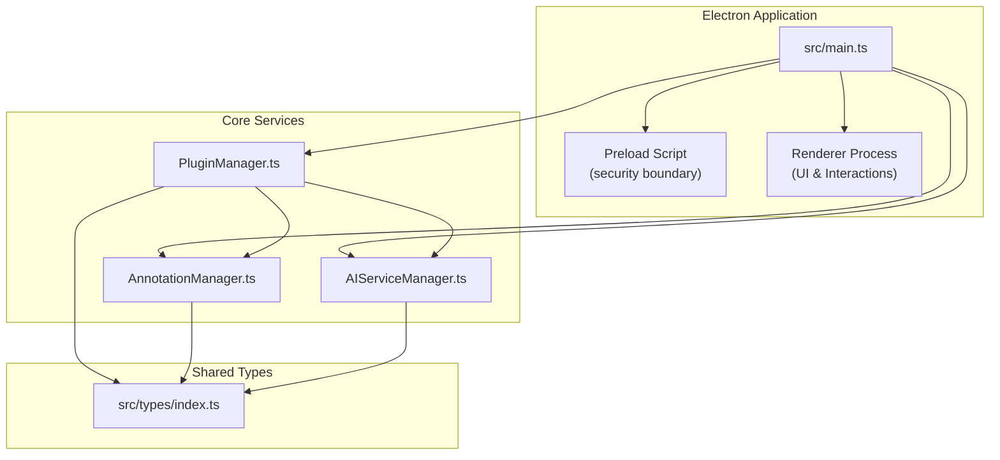
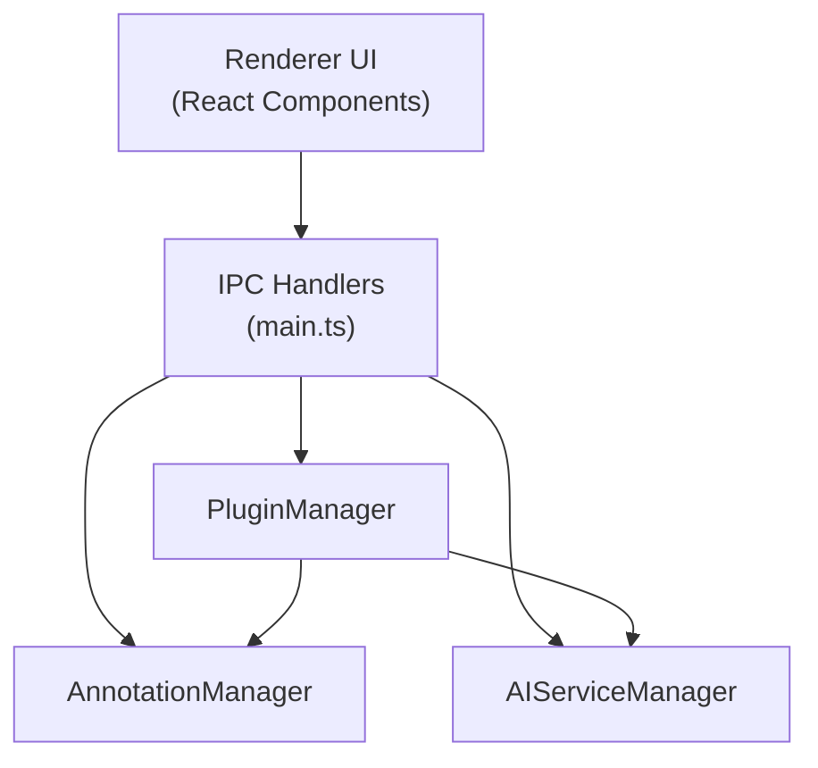
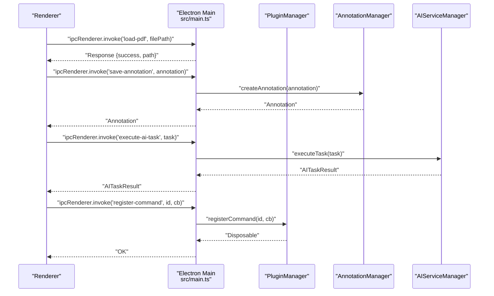
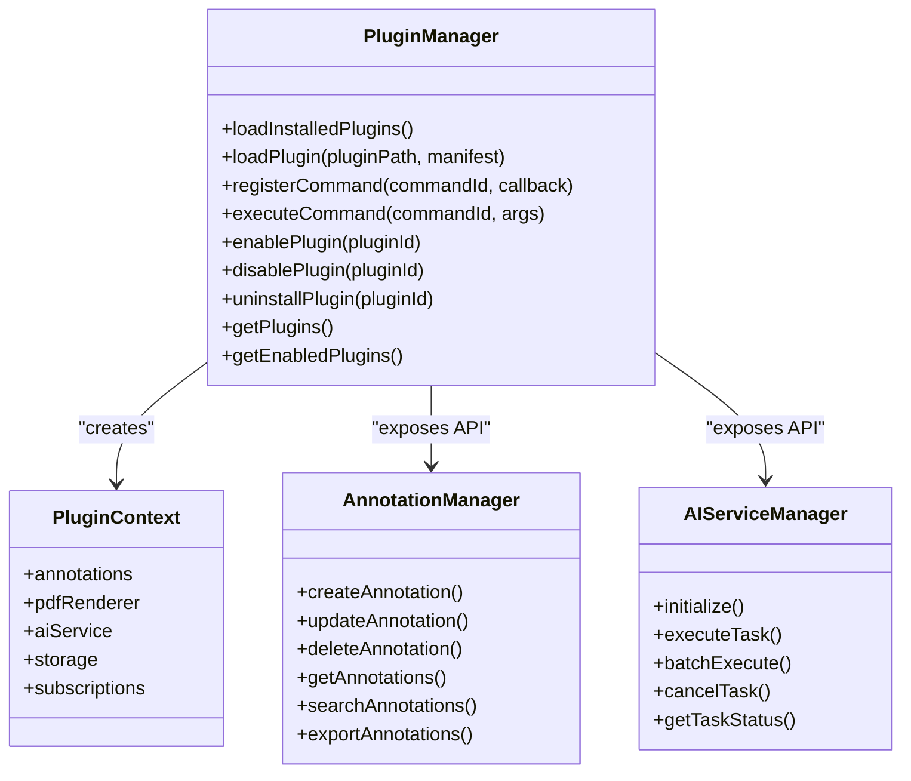
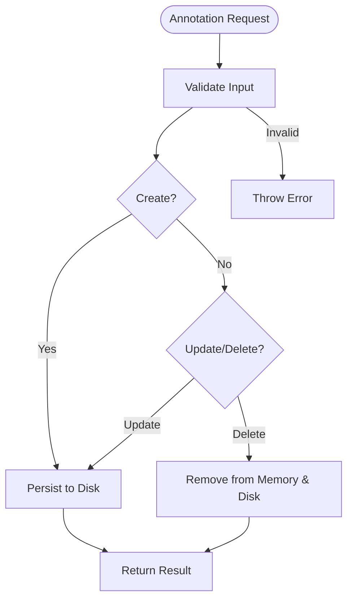
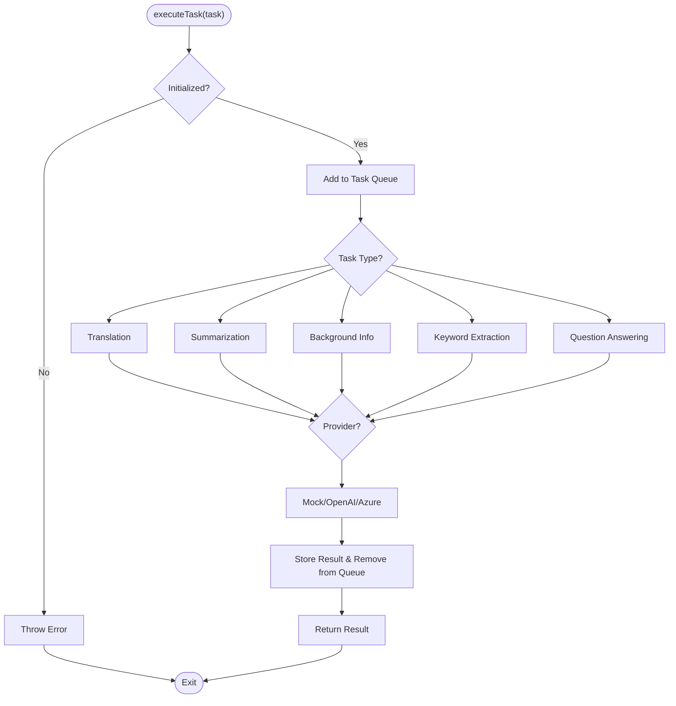
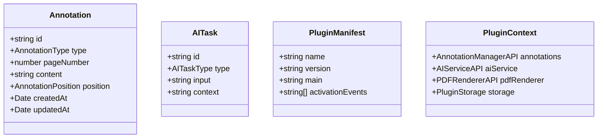
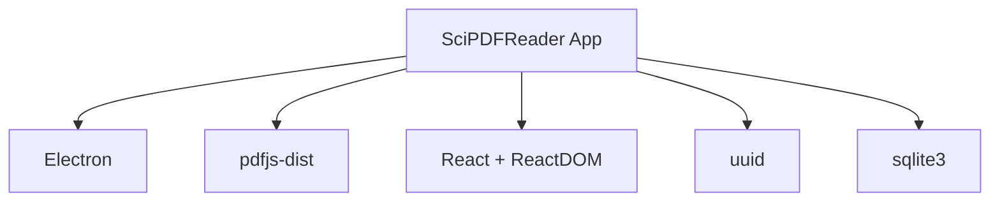

# Architecture Overview

<cite>
**Referenced Files in This Document**
- [main.ts](file://src/main.ts)
- [PluginManager.ts](file://src/core/PluginManager.ts)
- [AnnotationManager.ts](file://src/core/AnnotationManager.ts)
- [AIServiceManager.ts](file://src/core/AIServiceManager.ts)
- [index.ts](file://src/types/index.ts)
- [package.json](file://package.json)
- [tsconfig.json](file://tsconfig.json)
- [README.md](file://README.md)
- [PLUGIN-GUIDE.md](file://PLUGIN-GUIDE.md)
- [DESIGN.md](file://DESIGN.md)
</cite>

## Table of Contents
1. [Introduction](#introduction)
2. [Project Structure](#project-structure)
3. [Core Components](#core-components)
4. [Architecture Overview](#architecture-overview)
5. [Detailed Component Analysis](#detailed-component-analysis)
6. [Dependency Analysis](#dependency-analysis)
7. [Performance Considerations](#performance-considerations)
8. [Troubleshooting Guide](#troubleshooting-guide)
9. [Conclusion](#conclusion)
10. [Appendices](#appendices)

## Introduction
SciPDFReader is an Electron-based desktop application that blends PDF reading with AI-powered annotation capabilities and a VS Code-inspired plugin architecture. The system separates concerns across an Electron main process and a renderer process, communicating securely via IPC handlers. Core service managers encapsulate responsibilities for annotations, AI tasks, and plugin lifecycle management. The TypeScript type system enforces type safety across modules, while the plugin system enables extensibility through dynamic loading and a well-defined API surface.

## Project Structure
The repository follows a layered structure:
- Electron main process entry initializes the BrowserWindow, sets up preload security, and registers IPC handlers.
- Core service managers live under src/core and provide domain-specific services.
- Shared TypeScript types define contracts for annotations, AI tasks, plugin manifests, and APIs.
- The renderer directory contains UI components and assets (not analyzed here).
- Build and runtime dependencies are declared in package.json; TypeScript compilation is configured in tsconfig.json.

**Diagram sources**
- [main.ts:1-118](file://src/main.ts#L1-L118)
- [PluginManager.ts:1-247](file://src/core/PluginManager.ts#L1-L247)
- [AnnotationManager.ts:1-172](file://src/core/AnnotationManager.ts#L1-L172)
- [AIServiceManager.ts:1-214](file://src/core/AIServiceManager.ts#L1-L214)
- [index.ts:1-224](file://src/types/index.ts#L1-L224)

**Section sources**
- [main.ts:1-118](file://src/main.ts#L1-L118)
- [package.json:1-56](file://package.json#L1-L56)
- [tsconfig.json:1-21](file://tsconfig.json#L1-L21)

## Core Components
- Electron Main Process: Creates the BrowserWindow with context isolation and a preload script, initializes core managers, and exposes IPC handlers for renderer-to-main communication.
- PluginManager: Manages plugin discovery, activation, command registration, and provides a controlled API surface to plugins.
- AnnotationManager: Centralizes annotation CRUD, persistence, search, and export operations with local file storage.
- AIServiceManager: Orchestrates AI tasks (translation, summarization, background info, keyword extraction, QA), supports provider-specific execution, and maintains task queues/results.
- Shared Types: Define enums, interfaces, and contracts for annotations, AI tasks, plugin manifests, and service APIs.

Key responsibilities and interactions:
- Renderer triggers actions (e.g., load PDF, save annotation, execute AI task).
- IPC handlers in main route requests to core managers.
- Managers persist data locally and expose typed APIs to plugins via PluginManager.
- PluginManager creates a sandboxed PluginContext for each plugin, limiting exposure to only approved APIs.

**Section sources**
- [main.ts:44-118](file://src/main.ts#L44-L118)
- [PluginManager.ts:15-35](file://src/core/PluginManager.ts#L15-L35)
- [AnnotationManager.ts:6-19](file://src/core/AnnotationManager.ts#L6-L19)
- [AIServiceManager.ts:3-11](file://src/core/AIServiceManager.ts#L3-L11)
- [index.ts:36-84](file://src/types/index.ts#L36-L84)

## Architecture Overview
The system adheres to Electron’s main/renderer separation with a strict security boundary enforced by context isolation and a preload script. IPC handlers act as gatekeepers, ensuring renderer-initiated operations are executed in the main process with appropriate validation and delegation to core services.

**Diagram sources**
- [main.ts:79-118](file://src/main.ts#L79-L118)
- [PluginManager.ts:15-35](file://src/core/PluginManager.ts#L15-L35)
- [AnnotationManager.ts:6-19](file://src/core/AnnotationManager.ts#L6-L19)
- [AIServiceManager.ts:3-11](file://src/core/AIServiceManager.ts#L3-L11)

## Detailed Component Analysis

### Electron Main Process and IPC Communication
- BrowserWindow configuration enables context isolation and loads a preload script, preventing direct Node.js access from the renderer.
- IPC handlers expose safe operations: load PDF, save annotation, get annotations, execute AI tasks, and plugin lifecycle commands.
- Initialization sequence creates managers and auto-loads installed plugins.

**Diagram sources**
- [main.ts:79-118](file://src/main.ts#L79-L118)
- [AnnotationManager.ts:46-59](file://src/core/AnnotationManager.ts#L46-L59)
- [AIServiceManager.ts:13-56](file://src/core/AIServiceManager.ts#L13-L56)
- [PluginManager.ts:120-142](file://src/core/PluginManager.ts#L120-L142)

**Section sources**
- [main.ts:12-42](file://src/main.ts#L12-L42)
- [main.ts:79-118](file://src/main.ts#L79-L118)

### Plugin System Architecture
- Plugin discovery scans a user-specific plugins directory and loads each plugin’s main module.
- Activation occurs based on manifest activation events; plugins receive a PluginContext with restricted APIs.
- Commands registered by plugins are stored and executed by the PluginManager.
- Storage and PDF renderer APIs are placeholders for future integration.

**Diagram sources**
- [PluginManager.ts:15-35](file://src/core/PluginManager.ts#L15-L35)
- [PluginManager.ts:200-245](file://src/core/PluginManager.ts#L200-L245)
- [AnnotationManager.ts:46-94](file://src/core/AnnotationManager.ts#L46-L94)
- [AIServiceManager.ts:8-92](file://src/core/AIServiceManager.ts#L8-L92)

**Section sources**
- [PluginManager.ts:48-104](file://src/core/PluginManager.ts#L48-L104)
- [PluginManager.ts:120-190](file://src/core/PluginManager.ts#L120-L190)
- [PLUGIN-GUIDE.md:1-420](file://PLUGIN-GUIDE.md#L1-L420)

### Annotation Management
- Initializes default annotation types and persists data to a user-specific directory.
- Provides CRUD operations, search, and export in multiple formats.
- Maintains timestamps and integrates with the plugin context for annotation creation.

**Diagram sources**
- [AnnotationManager.ts:46-94](file://src/core/AnnotationManager.ts#L46-L94)
- [AnnotationManager.ts:153-170](file://src/core/AnnotationManager.ts#L153-L170)

**Section sources**
- [AnnotationManager.ts:11-19](file://src/core/AnnotationManager.ts#L11-L19)
- [AnnotationManager.ts:46-94](file://src/core/AnnotationManager.ts#L46-L94)
- [AnnotationManager.ts:153-170](file://src/core/AnnotationManager.ts#L153-L170)

### AI Service Orchestration
- Supports multiple AI task types and provider-specific execution paths.
- Maintains an internal queue and results cache, with cancellation and batch execution support.
- Builds prompts per task type and delegates to provider-specific implementations.

**Diagram sources**
- [AIServiceManager.ts:13-56](file://src/core/AIServiceManager.ts#L13-L56)
- [AIServiceManager.ts:96-171](file://src/core/AIServiceManager.ts#L96-L171)
- [AIServiceManager.ts:174-193](file://src/core/AIServiceManager.ts#L174-L193)

**Section sources**
- [AIServiceManager.ts:8-11](file://src/core/AIServiceManager.ts#L8-L11)
- [AIServiceManager.ts:13-92](file://src/core/AIServiceManager.ts#L13-L92)
- [AIServiceManager.ts:96-171](file://src/core/AIServiceManager.ts#L96-L171)

### TypeScript Type System and Contracts
- Defines enums for annotation and AI task types, interfaces for annotations and AI tasks, and plugin manifest structures.
- Establishes API contracts for AnnotationManagerAPI, AIServiceAPI, PDFRendererAPI, and PluginStorage.
- Ensures type-safe interactions across main, core services, and plugins.

**Diagram sources**
- [index.ts:36-47](file://src/types/index.ts#L36-L47)
- [index.ts:65-71](file://src/types/index.ts#L65-L71)
- [index.ts:86-103](file://src/types/index.ts#L86-L103)
- [index.ts:136-142](file://src/types/index.ts#L136-L142)

**Section sources**
- [index.ts:3-11](file://src/types/index.ts#L3-L11)
- [index.ts:49-84](file://src/types/index.ts#L49-L84)
- [index.ts:136-177](file://src/types/index.ts#L136-L177)

## Dependency Analysis
External dependencies include Electron for runtime, PDF.js for rendering, React for UI, UUID for identifiers, and SQLite for potential future database needs. TypeScript and ESLint ensure code quality and type safety.

**Diagram sources**
- [package.json:27-33](file://package.json#L27-L33)

**Section sources**
- [package.json:1-56](file://package.json#L1-L56)

## Performance Considerations
- Large PDF handling: Virtualize rendering, separate annotation layers, and use background workers for parsing. Cache rendered pages and annotations to reduce repeated work.
- AI request optimization: Batch multiple AI requests, cache results, and provide fallbacks when network is unavailable.
- Data storage: Persist incrementally, compress annotations, and index for fast search.
- UI responsiveness: Keep renderer free of heavy computations; delegate to main process and use IPC sparingly.

[No sources needed since this section provides general guidance]

## Troubleshooting Guide
Common issues and remedies:
- Annotation persistence failures: Verify user data directory permissions and path resolution; confirm JSON serialization/deserialization.
- AI service initialization errors: Ensure provider configuration is present before executing tasks; handle provider-specific API differences.
- Plugin load failures: Confirm plugin manifest validity, correct main entry path, and activation events; inspect console logs for detailed errors.
- IPC handler errors: Validate argument types and presence of initialized managers before invoking handlers.

**Section sources**
- [AnnotationManager.ts:153-170](file://src/core/AnnotationManager.ts#L153-L170)
- [AIServiceManager.ts:14-16](file://src/core/AIServiceManager.ts#L14-L16)
- [PluginManager.ts:71-104](file://src/core/PluginManager.ts#L71-L104)
- [main.ts:85-104](file://src/main.ts#L85-L104)

## Conclusion
SciPDFReader’s architecture cleanly separates the Electron main process from the renderer, enforcing security via context isolation and a preload script. The modular design centers around three core managers—AnnotationManager, AIServiceManager, and PluginManager—each with distinct responsibilities and well-defined interfaces. The VS Code-inspired plugin system enables extensibility, while TypeScript ensures type safety across the board. With careful attention to performance and security, the system scales toward a rich ecosystem of plugins and AI-driven features.

[No sources needed since this section summarizes without analyzing specific files]

## Appendices

### System Boundaries and Integrations
- Main vs. Renderer: Strict boundary enforced by Electron’s context isolation and preload script.
- External Services: AI providers (OpenAI/Azure/local) integrated behind AIServiceManager; PDF rendering to be integrated via PDFRendererAPI.
- Persistence: Local file system for annotations; future enhancements could leverage SQLite.

**Section sources**
- [main.ts:17-26](file://src/main.ts#L17-L26)
- [DESIGN.md:34-49](file://DESIGN.md#L34-L49)
- [DESIGN.md:89-110](file://DESIGN.md#L89-L110)

### Security Through Preload Scripts
- Preload script mediates renderer-to-main communication, exposing only explicitly declared IPC handlers.
- Disables Node.js integration in the renderer and isolates context to prevent direct access to Node/Electron APIs.

**Section sources**
- [main.ts:17-21](file://src/main.ts#L17-L21)
- [README.md:1-170](file://README.md#L1-L170)

### Scalability Patterns for Plugin Management
- Dynamic loading and activation events decouple plugin startup from application boot.
- PluginContext limits plugin access to approved APIs, reducing risk and simplifying maintenance.
- Future directions include a plugin marketplace and sandboxing mechanisms.

**Section sources**
- [PluginManager.ts:48-104](file://src/core/PluginManager.ts#L48-L104)
- [PLUGIN-GUIDE.md:1-420](file://PLUGIN-GUIDE.md#L1-L420)