# Core Component Architecture

<cite>
**Referenced Files in This Document**
- [src/core/AnnotationManager.ts](file://src/core/AnnotationManager.ts)
- [src/core/AIServiceManager.ts](file://src/core/AIServiceManager.ts)
- [src/core/PluginManager.ts](file://src/core/PluginManager.ts)
- [src/types/index.ts](file://src/types/index.ts)
- [src/main.ts](file://src/main.ts)
- [src/preload.ts](file://src/preload.ts)
- [src/renderer/renderer.tsx](file://src/renderer/renderer.tsx)
- [src/renderer/App.tsx](file://src/renderer/App.tsx)
- [src/renderer/index.html](file://src/renderer/index.html)
- [README.md](file://README.md)
- [PLUGIN-GUIDE.md](file://PLUGIN-GUIDE.md)
- [package.json](file://package.json)
</cite>

## Update Summary
**Changes Made**
- Added comprehensive renderer startup logging with detailed process monitoring
- Enhanced error handling in renderer application with improved debugging capabilities
- Implemented extensive logging for file menu interactions and user actions
- Added robust error handling for root element validation and rendering failures
- Improved IPC communication logging for better debugging of component interactions

## Table of Contents
1. [Introduction](#introduction)
2. [Project Structure](#project-structure)
3. [Core Components](#core-components)
4. [Architecture Overview](#architecture-overview)
5. [Detailed Component Analysis](#detailed-component-analysis)
6. [Enhanced Renderer Application](#enhanced-renderer-application)
7. [Dependency Analysis](#dependency-analysis)
8. [Performance Considerations](#performance-considerations)
9. [Troubleshooting Guide](#troubleshooting-guide)
10. [Conclusion](#conclusion)
11. [Appendices](#appendices)

## Introduction
This document explains the core component architecture of the SciPDFReader application, focusing on the three primary service managers and their interactions. It details how the Manager Pattern is implemented by AnnotationManager for annotation persistence and operations, how AIServiceManager coordinates AI service integrations, and how PluginManager manages plugin lifecycle and API exposure. The document also covers the dependency injection pattern used during service initialization, the type system architecture from src/types/index.ts that ensures comprehensive type safety, the factory pattern for dynamic plugin loading, and the observer pattern for event-driven plugin lifecycle management. Component interaction diagrams illustrate data flow between managers and their responsibilities, along with enhanced error handling strategies, service initialization order, circular dependency prevention, and extension points.

## Project Structure
The core architecture centers around three managers located under src/core/, with a shared type system under src/types/. The Electron main process orchestrates initialization and inter-process communication (IPC) handlers. The renderer application now includes comprehensive logging for startup, error handling, and user interactions.

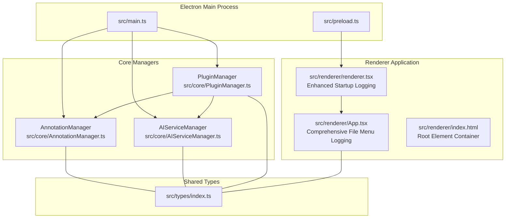

**Diagram sources**
- [src/main.ts:1-165](file://src/main.ts#L1-L165)
- [src/preload.ts:1-35](file://src/preload.ts#L1-L35)
- [src/core/AnnotationManager.ts:6-172](file://src/core/AnnotationManager.ts#L6-L172)
- [src/core/AIServiceManager.ts:3-214](file://src/core/AIServiceManager.ts#L3-L214)
- [src/core/PluginManager.ts:15-250](file://src/core/PluginManager.ts#L15-L250)
- [src/renderer/renderer.tsx:1-16](file://src/renderer/renderer.tsx#L1-L16)
- [src/renderer/App.tsx:1-184](file://src/renderer/App.tsx#L1-L184)
- [src/renderer/index.html:1-13](file://src/renderer/index.html#L1-L13)
- [src/types/index.ts:1-224](file://src/types/index.ts#L1-L224)

**Section sources**
- [README.md:13-29](file://README.md#L13-L29)
- [src/main.ts:1-165](file://src/main.ts#L1-L165)
- [src/preload.ts:1-35](file://src/preload.ts#L1-L35)

## Core Components
This section introduces the three core managers and their responsibilities:

- AnnotationManager: Manages annotation creation, updates, deletion, retrieval, search, and persistence to disk. It also exposes export capabilities and registers annotation types.
- AIServiceManager: Provides AI task execution (translation, summarization, background info, keyword extraction, question answering) with configurable providers and a task queue.
- PluginManager: Loads, activates, and manages plugins, exposing a controlled API surface to plugins while handling lifecycle events and command registration.

These managers are initialized in the Electron main process and injected into PluginManager to expose their capabilities to plugins. The renderer application now includes comprehensive logging for startup, error handling, and user interactions.

**Section sources**
- [src/core/AnnotationManager.ts:6-172](file://src/core/AnnotationManager.ts#L6-L172)
- [src/core/AIServiceManager.ts:3-214](file://src/core/AIServiceManager.ts#L3-L214)
- [src/core/PluginManager.ts:15-250](file://src/core/PluginManager.ts#L15-L250)
- [src/main.ts:45-63](file://src/main.ts#L45-L63)
- [src/renderer/renderer.tsx:6-15](file://src/renderer/renderer.tsx#L6-L15)

## Architecture Overview
The system follows a Manager Pattern with explicit separation of concerns:
- AnnotationManager encapsulates annotation persistence and operations.
- AIServiceManager encapsulates AI task orchestration and provider abstraction.
- PluginManager encapsulates plugin lifecycle, API exposure, and command routing.

The dependency injection pattern is evident in PluginManager's constructor, which receives instances of AnnotationManager and AIServiceManager. The type system in src/types/index.ts defines interfaces and enums that unify contracts across managers and plugins. The renderer application now includes comprehensive logging infrastructure for enhanced debugging and monitoring.

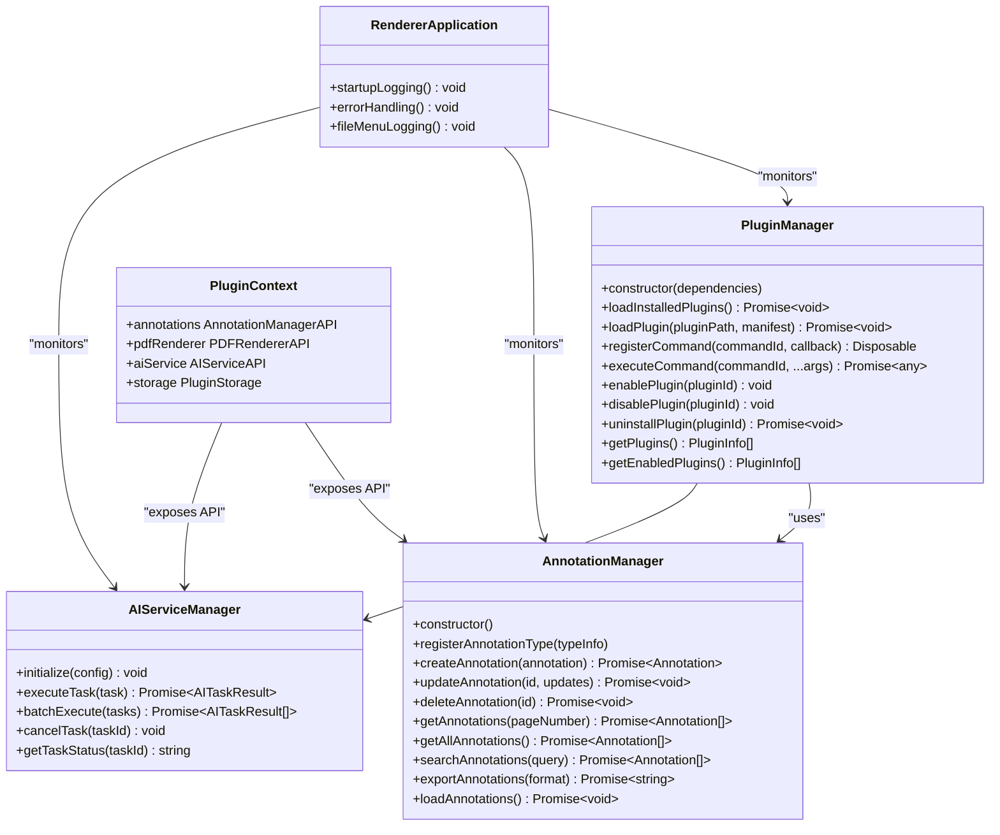

**Diagram sources**
- [src/core/AnnotationManager.ts:6-172](file://src/core/AnnotationManager.ts#L6-L172)
- [src/core/AIServiceManager.ts:3-214](file://src/core/AIServiceManager.ts#L3-L214)
- [src/core/PluginManager.ts:15-250](file://src/core/PluginManager.ts#L15-L250)
- [src/types/index.ts:136-177](file://src/types/index.ts#L136-L177)
- [src/renderer/renderer.tsx:6-15](file://src/renderer/renderer.tsx#L6-L15)
- [src/renderer/App.tsx:78-104](file://src/renderer/App.tsx#L78-L104)

## Detailed Component Analysis

### AnnotationManager
Responsibilities:
- Maintains an in-memory map of annotations and persists them to disk.
- Registers default and custom annotation types.
- Supports CRUD operations, search, and export to multiple formats.
- Initializes a data directory for annotations.

Implementation highlights:
- Uses UUIDs for annotation IDs and timestamps for creation/update.
- Persists annotations to a JSON file under a user-specific directory.
- Exposes a rich API for plugins and the renderer process.

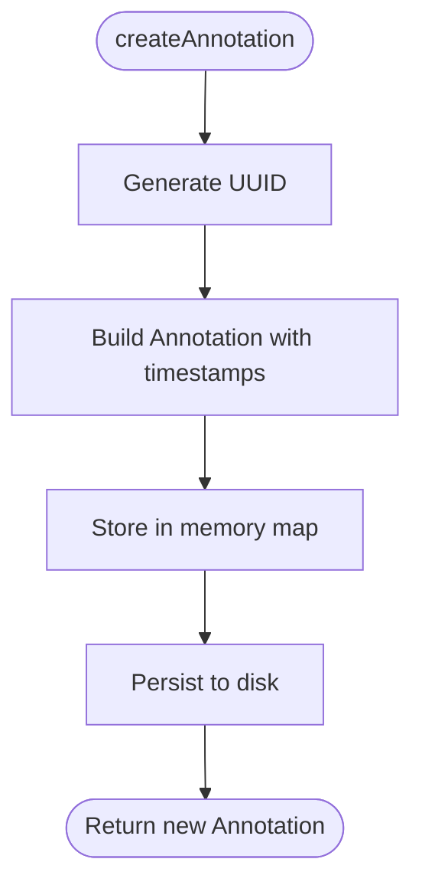

**Diagram sources**
- [src/core/AnnotationManager.ts:46-59](file://src/core/AnnotationManager.ts#L46-L59)
- [src/core/AnnotationManager.ts:153-157](file://src/core/AnnotationManager.ts#L153-L157)

**Section sources**
- [src/core/AnnotationManager.ts:6-172](file://src/core/AnnotationManager.ts#L6-L172)

### AIServiceManager
Responsibilities:
- Orchestrates AI tasks with a task queue and result cache.
- Supports multiple task types and providers (OpenAI, Azure, local).
- Provides batch execution and cancellation.
- Exposes a simple API for plugins and the renderer process.

Implementation highlights:
- Validates initialization before executing tasks.
- Switches on task type to route to provider-specific logic.
- Uses a mock provider fallback for local or unsupported configurations.

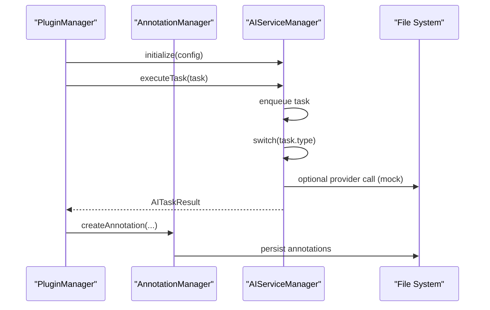

**Diagram sources**
- [src/core/AIServiceManager.ts:8-56](file://src/core/AIServiceManager.ts#L8-L56)
- [src/core/PluginManager.ts:202-220](file://src/core/PluginManager.ts#L202-L220)
- [src/core/AnnotationManager.ts:46-75](file://src/core/AnnotationManager.ts#L46-L75)

**Section sources**
- [src/core/AIServiceManager.ts:3-214](file://src/core/AIServiceManager.ts#L3-L214)

### PluginManager
Responsibilities:
- Discovers and loads installed plugins from a user directory.
- Creates a PluginContext exposing safe APIs to plugins.
- Handles plugin activation, deactivation, enabling/disabling, and uninstallation.
- Registers and executes commands from plugins.

Implementation highlights:
- Factory pattern for dynamic plugin loading via require().
- Observer-like subscription management through Disposable objects.
- Event-driven activation based on activationEvents in plugin manifests.

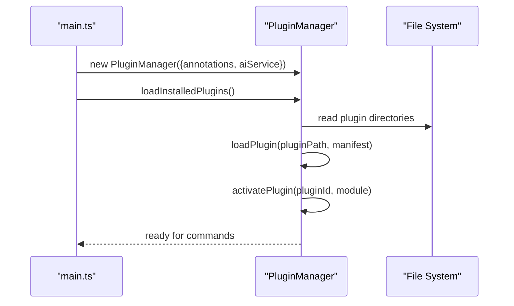

**Diagram sources**
- [src/main.ts:45-63](file://src/main.ts#L45-L63)
- [src/core/PluginManager.ts:48-118](file://src/core/PluginManager.ts#L48-L118)

**Section sources**
- [src/core/PluginManager.ts:15-250](file://src/core/PluginManager.ts#L15-L250)

### Type System Architecture
The type system in src/types/index.ts provides comprehensive type safety across all components:
- Enums define annotation and task types.
- Interfaces define contracts for managers, APIs, and plugin manifests.
- Strong typing for annotations, AI tasks, and plugin context ensures consistent behavior and reduces runtime errors.

Key type categories:
- Annotation types and positions.
- AI service configuration and task/result structures.
- Plugin manifest and contribution definitions.
- Plugin context APIs for annotations, AI service, PDF renderer, and storage.

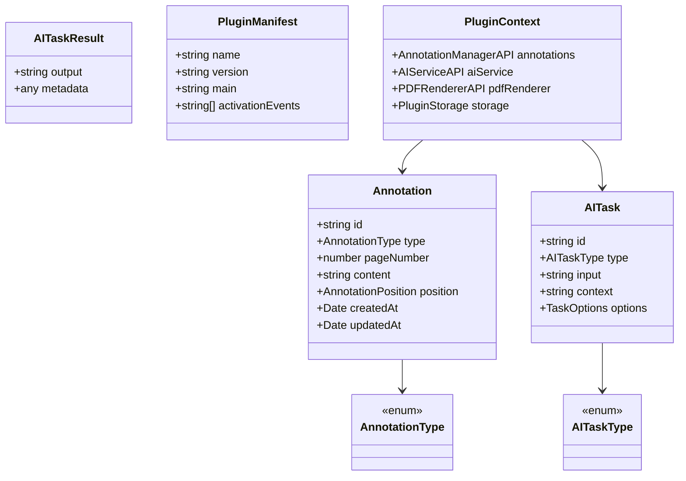

**Diagram sources**
- [src/types/index.ts:3-11](file://src/types/index.ts#L3-L11)
- [src/types/index.ts:57-84](file://src/types/index.ts#L57-L84)
- [src/types/index.ts:86-103](file://src/types/index.ts#L86-L103)
- [src/types/index.ts:136-177](file://src/types/index.ts#L136-L177)

**Section sources**
- [src/types/index.ts:1-224](file://src/types/index.ts#L1-L224)

### Dependency Injection Pattern
The Electron main process initializes managers and injects them into PluginManager. This pattern:
- Prevents tight coupling between managers and plugins.
- Enables testing and mocking of dependencies.
- Ensures predictable initialization order.

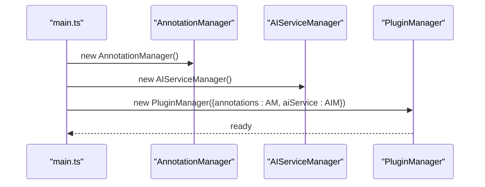

**Diagram sources**
- [src/main.ts:45-63](file://src/main.ts#L45-L63)
- [src/core/PluginManager.ts:21-36](file://src/core/PluginManager.ts#L21-L36)

**Section sources**
- [src/main.ts:45-63](file://src/main.ts#L45-L63)

### Factory Pattern for Dynamic Plugin Loading
PluginManager implements a factory pattern to dynamically load plugins:
- Scans the plugins directory for manifests.
- Requires plugin main modules and invokes their activate function with PluginContext.
- Supports activation events and re-activation on enable.

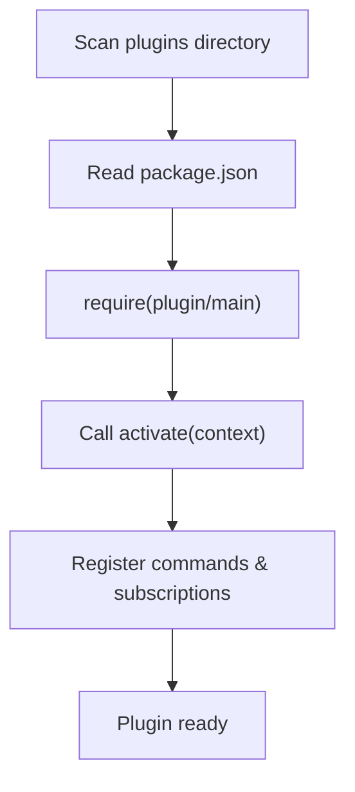

**Diagram sources**
- [src/core/PluginManager.ts:48-118](file://src/core/PluginManager.ts#L48-L118)

**Section sources**
- [src/core/PluginManager.ts:71-118](file://src/core/PluginManager.ts#L71-L118)

### Observer Pattern for Event-Driven Lifecycle
PluginManager uses an observer-like pattern for lifecycle management:
- Subscriptions tracked in PluginContext.subscriptions.
- Disposable objects returned by registrations allow cleanup.
- Activation events trigger plugin activation; deactivation triggers cleanup.

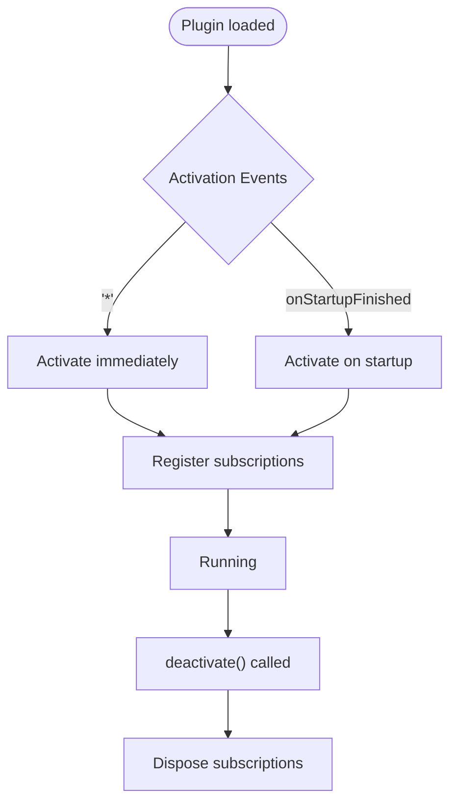

**Diagram sources**
- [src/core/PluginManager.ts:94-118](file://src/core/PluginManager.ts#L94-L118)
- [src/core/PluginManager.ts:166-172](file://src/core/PluginManager.ts#L166-L172)

**Section sources**
- [src/core/PluginManager.ts:106-172](file://src/core/PluginManager.ts#L106-L172)

### Component Interaction Diagrams
This diagram shows the end-to-end flow from plugin activation to annotation creation and AI task execution.

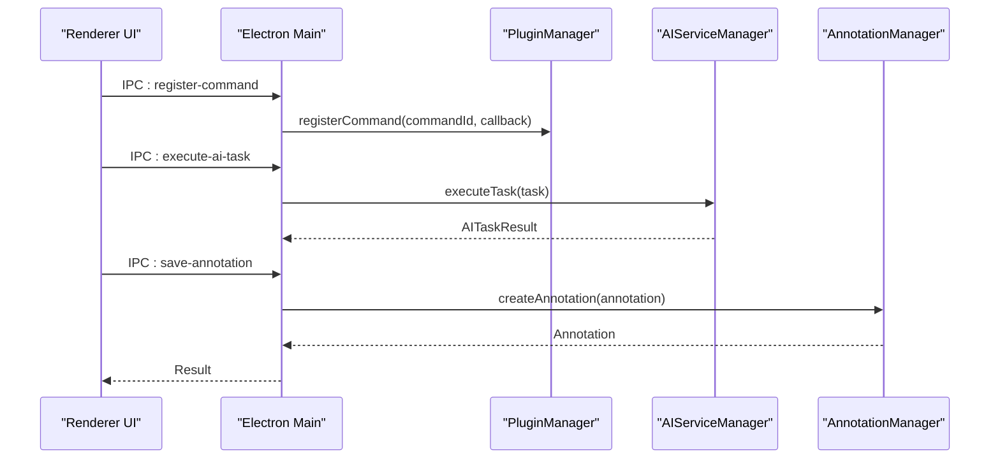

**Diagram sources**
- [src/main.ts:144-155](file://src/main.ts#L144-L155)
- [src/core/AIServiceManager.ts:13-56](file://src/core/AIServiceManager.ts#L13-L56)
- [src/core/AnnotationManager.ts:46-59](file://src/core/AnnotationManager.ts#L46-L59)

**Section sources**
- [src/main.ts:123-155](file://src/main.ts#L123-L155)

## Enhanced Renderer Application

### Startup Logging Infrastructure
The renderer application now includes comprehensive logging for startup processes, providing detailed visibility into the application lifecycle:

- **Process Initialization**: Logs "[Renderer] Starting renderer process..." when the renderer begins initialization
- **DOM Validation**: Checks for root element existence and logs "[Renderer] Found root element, rendering App..." when successful
- **Error Handling**: Logs "[Renderer] Root element not found!" when the DOM container is unavailable
- **Render Completion**: Confirms successful rendering with "[Renderer] App rendered successfully!"

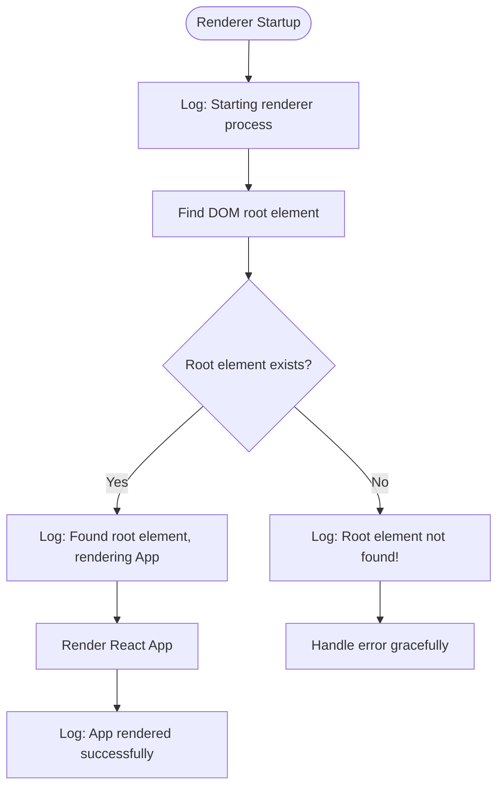

**Diagram sources**
- [src/renderer/renderer.tsx:6-15](file://src/renderer/renderer.tsx#L6-L15)

**Section sources**
- [src/renderer/renderer.tsx:6-15](file://src/renderer/renderer.tsx#L6-L15)

### Comprehensive File Menu Interaction Logging
The App component now implements extensive logging for file menu interactions, enabling detailed debugging of user actions:

- **Menu State Management**: Logs "[FileMenu] Hamburger clicked, current state: [state]" for menu toggle operations
- **File Operations**: Logs "[FileMenu] Open File clicked", "[FileMenu] Save clicked", "[FileMenu] Save As clicked", "[FileMenu] Close clicked", "[FileMenu] Exit clicked"
- **Action Confirmation**: Each menu action logs the specific operation performed and state changes
- **Event Flow**: Integrates with IPC handlers to coordinate with main process operations

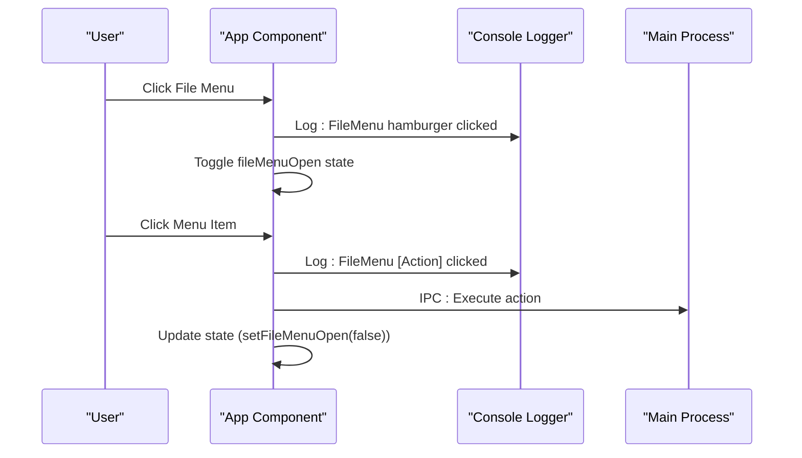

**Diagram sources**
- [src/renderer/App.tsx:78-104](file://src/renderer/App.tsx#L78-L104)
- [src/renderer/App.tsx:114-117](file://src/renderer/App.tsx#L114-L117)

**Section sources**
- [src/renderer/App.tsx:78-104](file://src/renderer/App.tsx#L78-L104)
- [src/renderer/App.tsx:114-117](file://src/renderer/App.tsx#L114-L117)

### Enhanced Error Handling
The renderer application implements robust error handling mechanisms:

- **Graceful Degradation**: When root element is not found, the application logs the error and continues without crashing
- **Try-Catch Blocks**: Critical operations wrap potential errors with comprehensive logging
- **State Management**: Error states are handled without disrupting the overall application flow
- **IPC Communication**: File operations integrate with main process error handling for consistent error reporting

**Section sources**
- [src/renderer/renderer.tsx:13-15](file://src/renderer/renderer.tsx#L13-L15)
- [src/renderer/App.tsx:40-54](file://src/renderer/App.tsx#L40-L54)

## Dependency Analysis
The managers depend on each other and on shared types. The dependency graph avoids cycles by centralizing injection in main.ts and exposing only necessary APIs through PluginContext. The renderer application maintains loose coupling while providing comprehensive logging infrastructure.

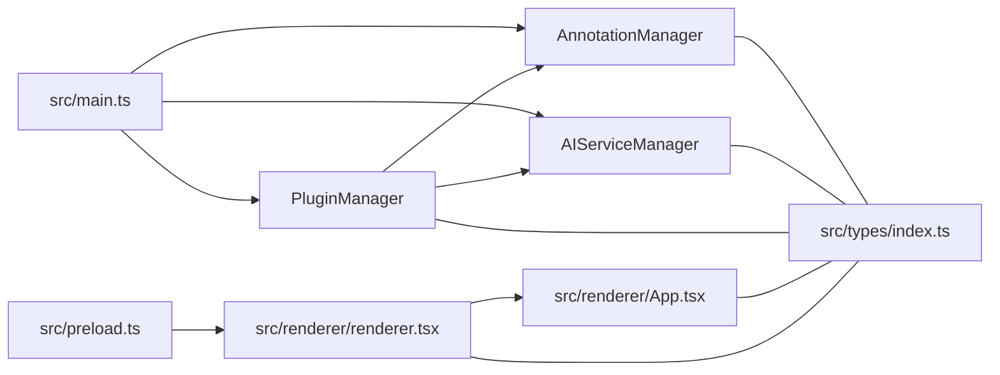

**Diagram sources**
- [src/main.ts:45-63](file://src/main.ts#L45-L63)
- [src/core/PluginManager.ts:21-36](file://src/core/PluginManager.ts#L21-L36)
- [src/preload.ts:1-35](file://src/preload.ts#L1-L35)
- [src/renderer/renderer.tsx:1-16](file://src/renderer/renderer.tsx#L1-L16)
- [src/renderer/App.tsx:1-184](file://src/renderer/App.tsx#L1-L184)
- [src/types/index.ts:1-224](file://src/types/index.ts#L1-L224)

**Section sources**
- [src/main.ts:45-63](file://src/main.ts#L45-L63)
- [src/core/PluginManager.ts:21-36](file://src/core/PluginManager.ts#L21-L36)
- [src/preload.ts:1-35](file://src/preload.ts#L1-L35)

## Performance Considerations
- Annotation persistence: Batch writes to reduce disk I/O; consider debouncing frequent saves.
- AI task execution: Use batchExecute for multiple tasks; implement rate limiting for external providers.
- Plugin loading: Cache plugin metadata and avoid repeated filesystem scans.
- Memory usage: Limit in-memory annotations to recent pages; implement pagination for large datasets.
- Renderer logging: Console logging is optimized for development; consider conditional logging in production builds.
- IPC communication: Minimize unnecessary IPC calls by batching operations where possible.

## Troubleshooting Guide
Common issues and resolutions:
- Initialization errors: Ensure AnnotationManager and AIServiceManager are constructed before PluginManager.
- Plugin load failures: Verify plugin manifest validity and main entry path; check activationEvents.
- AI provider errors: Confirm provider configuration and API keys; handle network timeouts gracefully.
- Annotation persistence errors: Validate data directory permissions and disk space.
- Renderer startup failures: Check that index.html contains the root element with id "root".
- File menu interaction errors: Verify IPC handlers are properly registered in main process.
- Logging infrastructure issues: Ensure console logging is enabled and not filtered by browser settings.

**Section sources**
- [src/core/AnnotationManager.ts:153-170](file://src/core/AnnotationManager.ts#L153-L170)
- [src/core/AIServiceManager.ts:14-16](file://src/core/AIServiceManager.ts#L14-L16)
- [src/core/PluginManager.ts:58-69](file://src/core/PluginManager.ts#L58-L69)
- [src/renderer/renderer.tsx:13-15](file://src/renderer/renderer.tsx#L13-L15)
- [src/renderer/App.tsx:78-104](file://src/renderer/App.tsx#L78-L104)

## Conclusion
The SciPDFReader core architecture demonstrates robust Manager Pattern implementation with clear separation of concerns. The dependency injection pattern in main.ts, combined with a comprehensive type system, ensures type safety and maintainability. PluginManager's factory and observer patterns enable dynamic, event-driven plugin lifecycle management. The enhanced renderer application now provides comprehensive logging infrastructure for startup processes, error handling, and user interactions, significantly improving debugging capabilities and user experience monitoring. The component interaction diagrams clarify data flow and responsibilities, while the troubleshooting guide addresses common pitfalls. Together, these patterns provide a scalable foundation for extending the application with plugins and AI integrations.

## Appendices
- Extension points:
  - Add new annotation types via registerAnnotationType.
  - Extend AI tasks by adding new AITaskType variants and provider logic.
  - Introduce new plugin contributions through PluginManifest and PluginContext.
  - Enhance logging infrastructure by adding new log categories and levels.
- Integration examples:
  - See PLUGIN-GUIDE.md for practical plugin development patterns.
  - Use IPC handlers in main.ts to integrate UI actions with managers.
  - Leverage renderer logging patterns for debugging custom components.
  - Implement comprehensive error handling using the established patterns.

**Section sources**
- [PLUGIN-GUIDE.md:142-240](file://PLUGIN-GUIDE.md#L142-L240)
- [src/main.ts:123-155](file://src/main.ts#L123-L155)
- [src/renderer/renderer.tsx:6-15](file://src/renderer/renderer.tsx#L6-L15)
- [src/renderer/App.tsx:78-104](file://src/renderer/App.tsx#L78-L104)