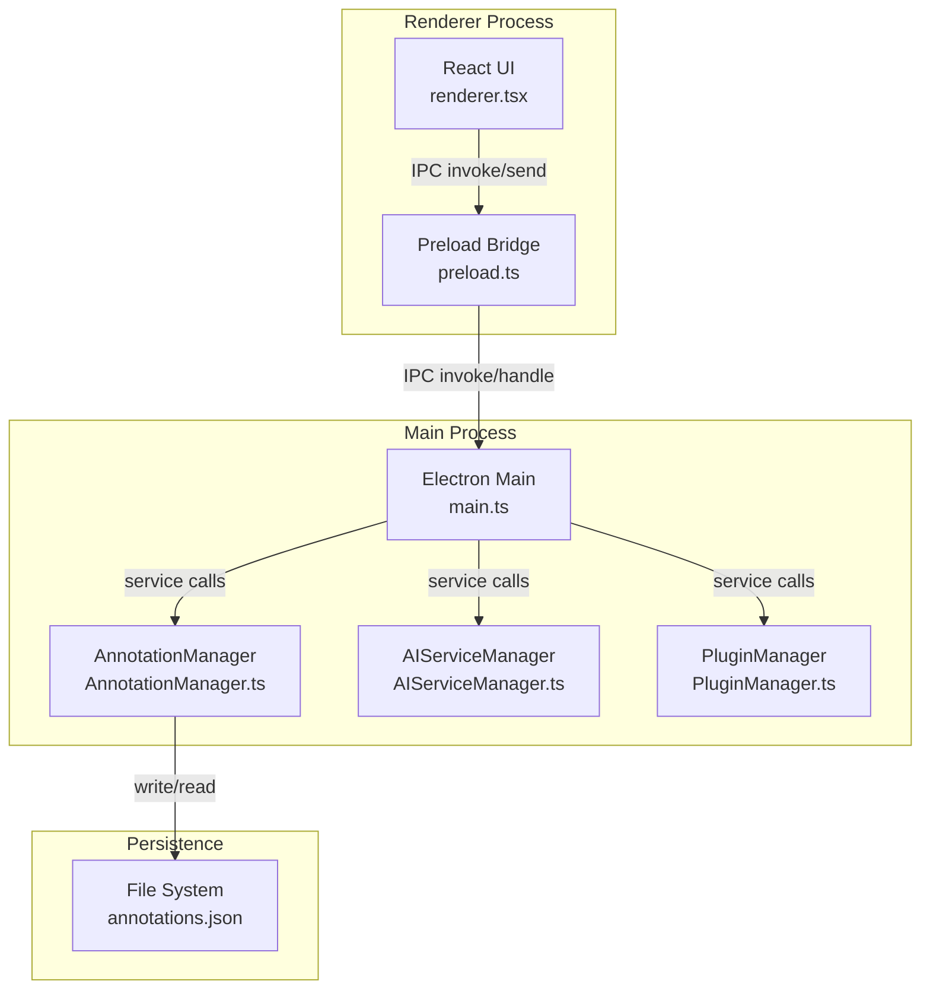
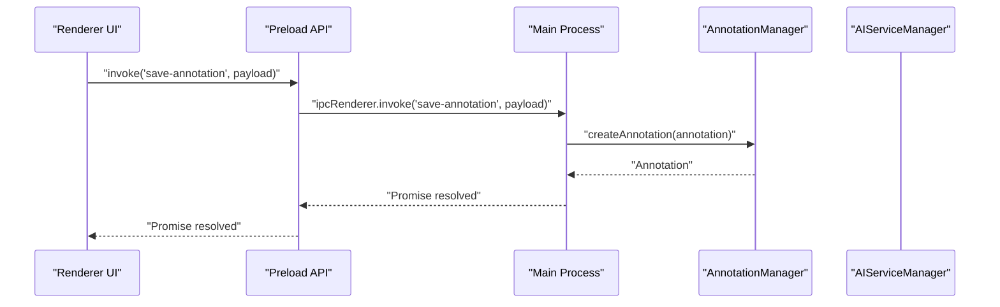
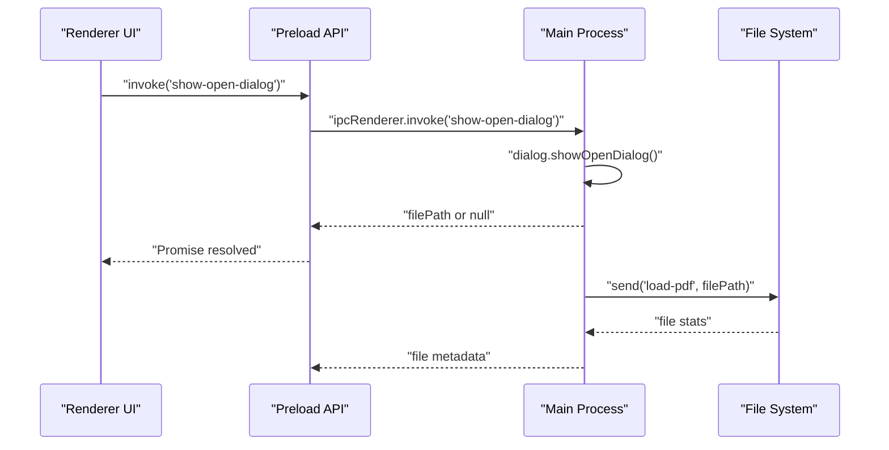
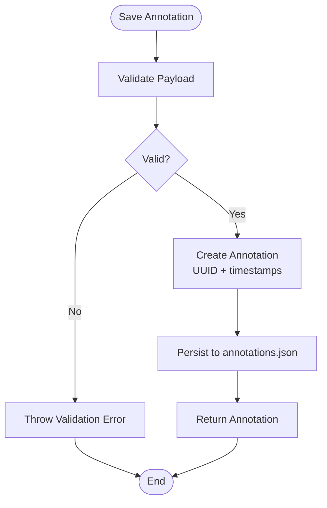
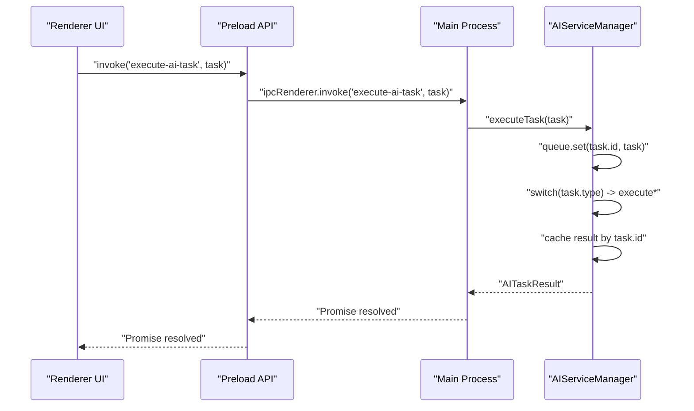
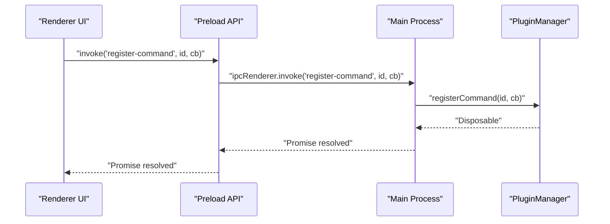
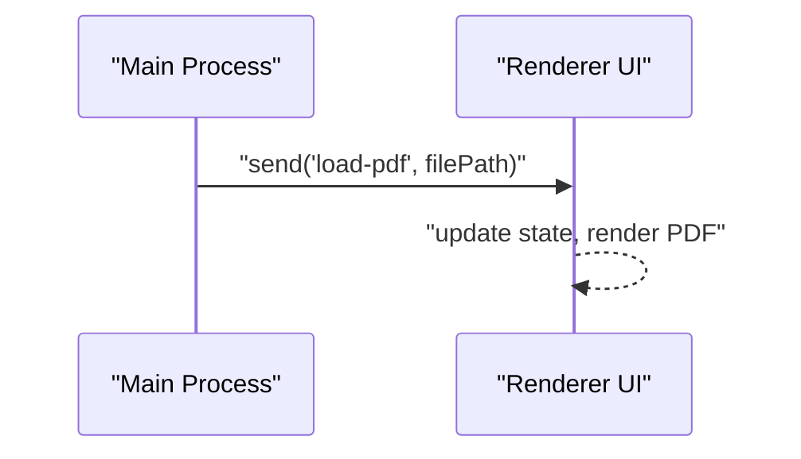
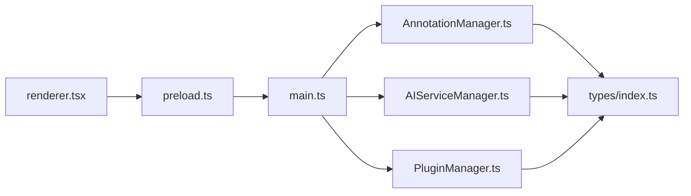
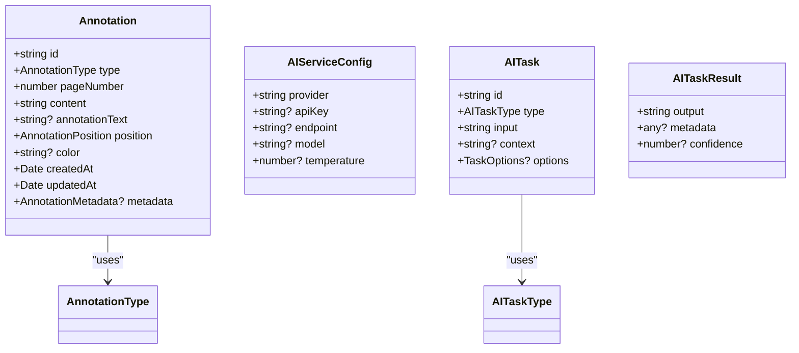

# Data Flow Architecture

<cite>
**Referenced Files in This Document**
- [src/main.ts](file://src/main.ts)
- [src/preload.ts](file://src/preload.ts)
- [src/renderer/renderer.tsx](file://src/renderer/renderer.tsx)
- [src/core/AnnotationManager.ts](file://src/core/AnnotationManager.ts)
- [src/core/AIServiceManager.ts](file://src/core/AIServiceManager.ts)
- [src/core/PluginManager.ts](file://src/core/PluginManager.ts)
- [src/types/index.ts](file://src/types/index.ts)
- [DESIGN.md](file://DESIGN.md)
- [README.md](file://README.md)
- [PLUGIN-GUIDE.md](file://PLUGIN-GUIDE.md)
- [package.json](file://package.json)
</cite>

## Table of Contents
1. [Introduction](#introduction)
2. [Project Structure](#project-structure)
3. [Core Components](#core-components)
4. [Architecture Overview](#architecture-overview)
5. [Detailed Component Analysis](#detailed-component-analysis)
6. [Dependency Analysis](#dependency-analysis)
7. [Performance Considerations](#performance-considerations)
8. [Troubleshooting Guide](#troubleshooting-guide)
9. [Conclusion](#conclusion)
10. [Appendices](#appendices)

## Introduction
This document describes the data flow architecture of SciPDFReader, focusing on how information moves across the Electron renderer process, IPC handlers in the main process, core services, and persistent storage. It covers:
- User interaction flow from renderer events through IPC to main services and storage
- Annotation data flow from creation to persistence and retrieval
- AI service data flow from user requests to external providers and result caching
- Plugin data flow from user commands to plugin execution and result propagation
- Bidirectional data flows for real-time updates and state synchronization
- Data transformations, validation strategies, and error propagation
- Asynchronous patterns using promises and callbacks
- Performance considerations including caching, lazy loading, and memory management

## Project Structure
SciPDFReader is an Electron application with a clear separation between the renderer (UI), preload bridge, and main process services. Core services include AnnotationManager, AIServiceManager, and PluginManager. Types define the shared data contracts.

**Diagram sources**
- [src/renderer/renderer.tsx:1-11](file://src/renderer/renderer.tsx#L1-L11)
- [src/preload.ts:1-34](file://src/preload.ts#L1-L34)
- [src/main.ts:1-156](file://src/main.ts#L1-L156)
- [src/core/AnnotationManager.ts:1-172](file://src/core/AnnotationManager.ts#L1-L172)
- [src/core/AIServiceManager.ts:1-214](file://src/core/AIServiceManager.ts#L1-L214)
- [src/core/PluginManager.ts:1-250](file://src/core/PluginManager.ts#L1-L250)

**Section sources**
- [src/main.ts:1-156](file://src/main.ts#L1-L156)
- [src/preload.ts:1-34](file://src/preload.ts#L1-L34)
- [src/renderer/renderer.tsx:1-11](file://src/renderer/renderer.tsx#L1-L11)
- [src/core/AnnotationManager.ts:1-172](file://src/core/AnnotationManager.ts#L1-L172)
- [src/core/AIServiceManager.ts:1-214](file://src/core/AIServiceManager.ts#L1-L214)
- [src/core/PluginManager.ts:1-250](file://src/core/PluginManager.ts#L1-L250)
- [src/types/index.ts:1-224](file://src/types/index.ts#L1-L224)

## Core Components
- Electron Main: Initializes BrowserWindow, sets up IPC handlers, and orchestrates services.
- Preload Bridge: Exposes a controlled API surface to the renderer via contextBridge.
- Renderer UI: React-based UI that triggers actions and receives updates.
- AnnotationManager: Manages annotation lifecycle, default types, and file-based persistence.
- AIServiceManager: Executes AI tasks, supports batching, cancellation, and status tracking.
- PluginManager: Loads, activates, and manages plugins; exposes APIs to plugins.

Key data contracts are defined in types/index.ts, ensuring consistent shapes across modules.

**Section sources**
- [src/main.ts:45-60](file://src/main.ts#L45-L60)
- [src/preload.ts:5-33](file://src/preload.ts#L5-L33)
- [src/core/AnnotationManager.ts:6-19](file://src/core/AnnotationManager.ts#L6-L19)
- [src/core/AIServiceManager.ts:3-11](file://src/core/AIServiceManager.ts#L3-L11)
- [src/core/PluginManager.ts:16-36](file://src/core/PluginManager.ts#L16-L36)
- [src/types/index.ts:36-47](file://src/types/index.ts#L36-L47)

## Architecture Overview
The system follows a unidirectional data flow pattern with explicit boundaries:
- Renderer initiates operations via preload API.
- Main process IPC handlers validate inputs, delegate to services, and return structured results.
- Services transform data, interact with external systems (AI providers), and persist state.
- Persistence is file-based for annotations; AI results are cached in-memory by AIServiceManager.

**Diagram sources**
- [src/preload.ts:10-12](file://src/preload.ts#L10-L12)
- [src/main.ts:123-128](file://src/main.ts#L123-L128)
- [src/core/AnnotationManager.ts:46-59](file://src/core/AnnotationManager.ts#L46-L59)

**Section sources**
- [src/main.ts:80-156](file://src/main.ts#L80-L156)
- [src/preload.ts:1-34](file://src/preload.ts#L1-L34)
- [src/core/AnnotationManager.ts:153-157](file://src/core/AnnotationManager.ts#L153-L157)

## Detailed Component Analysis

### Renderer Interaction Flow
- The renderer initializes a React app and interacts with the main process exclusively through the preload bridge.
- IPC invoke/send patterns are used for request/response and event-driven updates.
- Typical flows include opening a PDF, reading file buffers, saving annotations, retrieving annotations, executing AI tasks, registering commands, and registering annotation types.

**Diagram sources**
- [src/preload.ts:17-18](file://src/preload.ts#L17-L18)
- [src/main.ts:106-121](file://src/main.ts#L106-L121)

**Section sources**
- [src/renderer/renderer.tsx:1-11](file://src/renderer/renderer.tsx#L1-L11)
- [src/preload.ts:17-23](file://src/preload.ts#L17-L23)
- [src/main.ts:106-121](file://src/main.ts#L106-L121)

### Annotation Data Flow
- Creation: Renderer invokes save-annotation; main process delegates to AnnotationManager; UUID generation, timestamps, and immediate persistence occur.
- Retrieval: Renderer queries annotations per page; main process delegates to AnnotationManager; filtering by page number.
- Persistence: Annotations are stored as a JSON array on disk under a user-specific directory.

**Diagram sources**
- [src/main.ts:123-128](file://src/main.ts#L123-L128)
- [src/core/AnnotationManager.ts:46-59](file://src/core/AnnotationManager.ts#L46-L59)
- [src/core/AnnotationManager.ts:153-157](file://src/core/AnnotationManager.ts#L153-L157)

**Section sources**
- [src/main.ts:123-135](file://src/main.ts#L123-L135)
- [src/core/AnnotationManager.ts:46-94](file://src/core/AnnotationManager.ts#L46-L94)
- [src/core/AnnotationManager.ts:153-170](file://src/core/AnnotationManager.ts#L153-L170)

### AI Service Data Flow
- Execution: Renderer submits task; main process routes to AIServiceManager; task queued and executed based on type.
- Providers: Supports OpenAI/Azure or local/custom implementations; prompts are constructed per task type.
- Caching: Results are cached in-memory keyed by task ID; pending/completed/failed status tracked.

**Diagram sources**
- [src/preload.ts:14-15](file://src/preload.ts#L14-L15)
- [src/main.ts:137-142](file://src/main.ts#L137-L142)
- [src/core/AIServiceManager.ts:13-56](file://src/core/AIServiceManager.ts#L13-L56)

**Section sources**
- [src/main.ts:137-142](file://src/main.ts#L137-L142)
- [src/core/AIServiceManager.ts:13-92](file://src/core/AIServiceManager.ts#L13-L92)

### Plugin Data Flow
- Registration: Renderer registers commands and annotation types via preload; main process stores callbacks and types.
- Activation: PluginManager loads installed plugins from user directory, constructs plugin context, and activates compatible plugins.
- Execution: Renderer triggers registered commands; main process executes command handler; plugin may call AI or annotation APIs.

**Diagram sources**
- [src/preload.ts:25-28](file://src/preload.ts#L25-L28)
- [src/main.ts:144-149](file://src/main.ts#L144-L149)
- [src/core/PluginManager.ts:123-135](file://src/core/PluginManager.ts#L123-L135)

**Section sources**
- [src/main.ts:144-155](file://src/main.ts#L144-L155)
- [src/core/PluginManager.ts:49-107](file://src/core/PluginManager.ts#L49-L107)

### Bidirectional Data Flow and Real-Time Updates
- Event-driven updates: Main process sends load-pdf events to renderer after file dialog selection, enabling real-time UI updates.
- Plugin subscriptions: PluginManager maintains Disposable subscriptions for resource cleanup and lifecycle management.
- Status reporting: AIServiceManager exposes task status for UI polling or event signaling.

**Diagram sources**
- [src/main.ts:114-118](file://src/main.ts#L114-L118)

**Section sources**
- [src/main.ts:114-121](file://src/main.ts#L114-L121)
- [src/core/PluginManager.ts:130-135](file://src/core/PluginManager.ts#L130-L135)
- [src/core/AIServiceManager.ts:84-92](file://src/core/AIServiceManager.ts#L84-L92)

### Data Transformation Patterns
- Annotation creation: Adds UUID and timestamps; returns normalized object.
- AI task execution: Builds provider-specific prompts; returns standardized AITaskResult with optional metadata.
- Export formats: Supports JSON, Markdown, HTML; transforms internal annotations to target formats.

**Section sources**
- [src/core/AnnotationManager.ts:46-59](file://src/core/AnnotationManager.ts#L46-L59)
- [src/core/AIServiceManager.ts:174-193](file://src/core/AIServiceManager.ts#L174-L193)
- [src/core/AnnotationManager.ts:96-151](file://src/core/AnnotationManager.ts#L96-L151)

### Validation Strategies
- Input validation occurs at IPC boundaries and within services:
  - Main process handlers validate presence of managers before delegating.
  - AnnotationManager throws on missing annotations during updates/deletes.
  - AIServiceManager validates initialization and task type before execution.

**Section sources**
- [src/main.ts:123-128](file://src/main.ts#L123-L128)
- [src/core/AnnotationManager.ts:61-70](file://src/core/AnnotationManager.ts#L61-L70)
- [src/core/AIServiceManager.ts:14-16](file://src/core/AIServiceManager.ts#L14-L16)

### Error Propagation Mechanisms
- Synchronous errors: Thrown when managers are uninitialized or annotations are missing.
- Asynchronous errors: AI tasks propagate exceptions; PluginManager logs failures while loading plugins.
- Renderer resilience: Preload API wraps IPC calls; callers should handle rejected promises.

**Section sources**
- [src/main.ts:90-93](file://src/main.ts#L90-L93)
- [src/core/AnnotationManager.ts:64-65](file://src/core/AnnotationManager.ts#L64-L65)
- [src/core/AIServiceManager.ts:52-55](file://src/core/AIServiceManager.ts#L52-L55)
- [src/core/PluginManager.ts:60-67](file://src/core/PluginManager.ts#L60-L67)

## Dependency Analysis
- Renderer depends on preload for IPC; preload depends on Electron’s contextBridge and ipcRenderer.
- Main process depends on core managers; managers depend on filesystem for persistence.
- Types define contracts consumed by all modules.

**Diagram sources**
- [src/renderer/renderer.tsx:1-11](file://src/renderer/renderer.tsx#L1-L11)
- [src/preload.ts:1-34](file://src/preload.ts#L1-L34)
- [src/main.ts:1-156](file://src/main.ts#L1-L156)
- [src/core/AnnotationManager.ts:1-172](file://src/core/AnnotationManager.ts#L1-L172)
- [src/core/AIServiceManager.ts:1-214](file://src/core/AIServiceManager.ts#L1-L214)
- [src/core/PluginManager.ts:1-250](file://src/core/PluginManager.ts#L1-L250)
- [src/types/index.ts:1-224](file://src/types/index.ts#L1-L224)

**Section sources**
- [src/main.ts:45-60](file://src/main.ts#L45-L60)
- [src/types/index.ts:36-47](file://src/types/index.ts#L36-L47)

## Performance Considerations
- Caching:
  - AIServiceManager caches task results in-memory by task ID.
  - Consider adding result TTL and eviction policies for long-running sessions.
- Lazy Loading:
  - Annotations are persisted as a single JSON file; consider partitioning by document or page for very large datasets.
- Memory Management:
  - Avoid retaining large arrays of annotations; use streaming or pagination for exports.
  - Dispose plugin subscriptions to prevent leaks.
- Asynchrony:
  - Batch AI tasks where possible to reduce overhead.
  - Debounce renderer-triggered operations to minimize IPC churn.

[No sources needed since this section provides general guidance]

## Troubleshooting Guide
- PDF load failures:
  - Verify file path existence and permissions; check error responses from IPC handlers.
- Annotation persistence issues:
  - Confirm data directory creation and write permissions; inspect annotations.json location.
- AI execution errors:
  - Ensure AIServiceManager is initialized; confirm provider configuration; review task type validity.
- Plugin load failures:
  - Check plugin manifest validity and activation events; review console logs for detailed errors.

**Section sources**
- [src/main.ts:90-93](file://src/main.ts#L90-L93)
- [src/core/AnnotationManager.ts:36-40](file://src/core/AnnotationManager.ts#L36-L40)
- [src/core/AIServiceManager.ts:14-16](file://src/core/AIServiceManager.ts#L14-L16)
- [src/core/PluginManager.ts:60-67](file://src/core/PluginManager.ts#L60-L67)

## Conclusion
SciPDFReader employs a clean, IPC-mediated architecture that separates concerns between renderer, preload, and main process services. The core managers implement robust data flows with explicit validation and error handling. In-memory caching and file-based persistence provide a balanced approach to performance and reliability. Extensibility is achieved through a plugin system that leverages shared types and a controlled API surface.

[No sources needed since this section summarizes without analyzing specific files]

## Appendices

### API Surface Summary
- Renderer IPC invocations exposed via preload:
  - loadPDF, readFileAsArrayBuffer, saveAnnotation, getAnnotations, executeAITask, openFileDialog, registerCommand, registerAnnotationType
- Main process IPC handlers:
  - load-pdf, read-file-as-array-buffer, show-open-dialog, save-annotation, get-annotations, execute-ai-task, register-command, register-annotation-type

**Section sources**
- [src/preload.ts:5-33](file://src/preload.ts#L5-L33)
- [src/main.ts:80-156](file://src/main.ts#L80-L156)

### Data Models Overview

**Diagram sources**
- [src/types/index.ts:36-47](file://src/types/index.ts#L36-L47)
- [src/types/index.ts:49-55](file://src/types/index.ts#L49-L55)
- [src/types/index.ts:65-71](file://src/types/index.ts#L65-L71)
- [src/types/index.ts:80-84](file://src/types/index.ts#L80-L84)