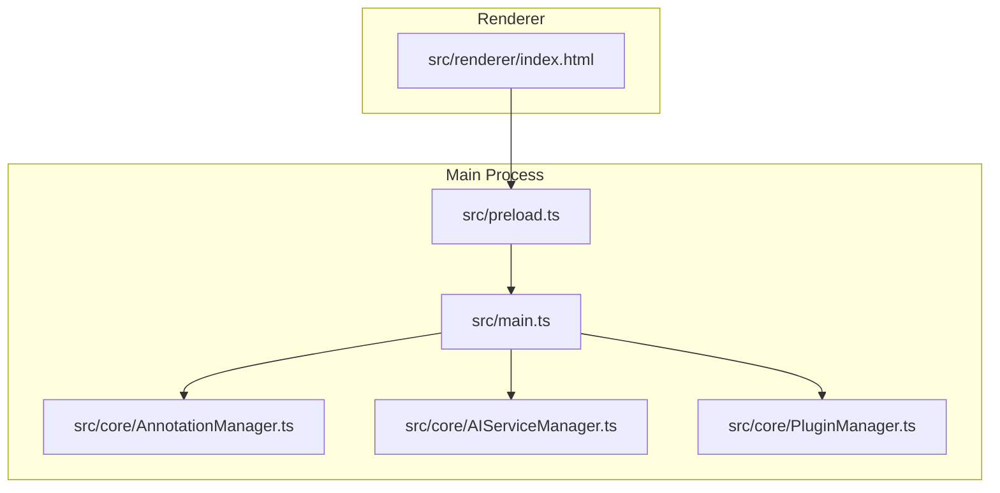
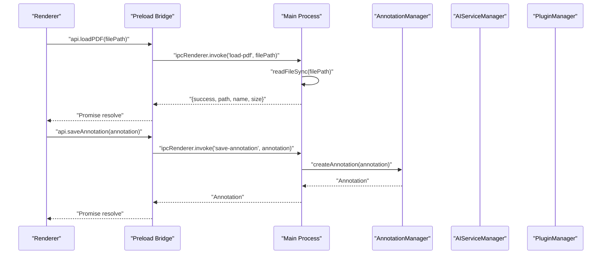
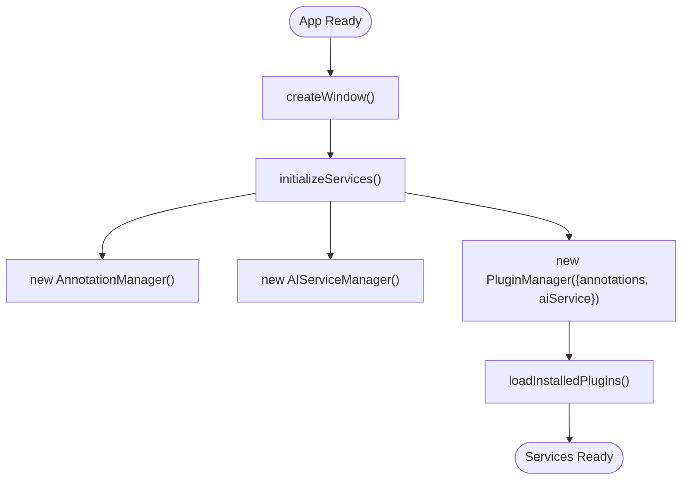
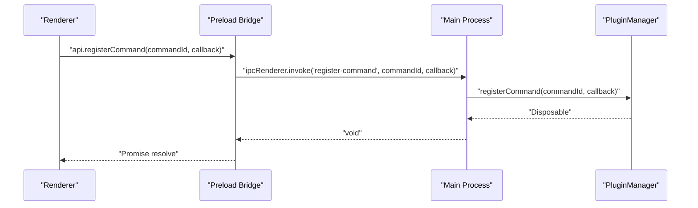
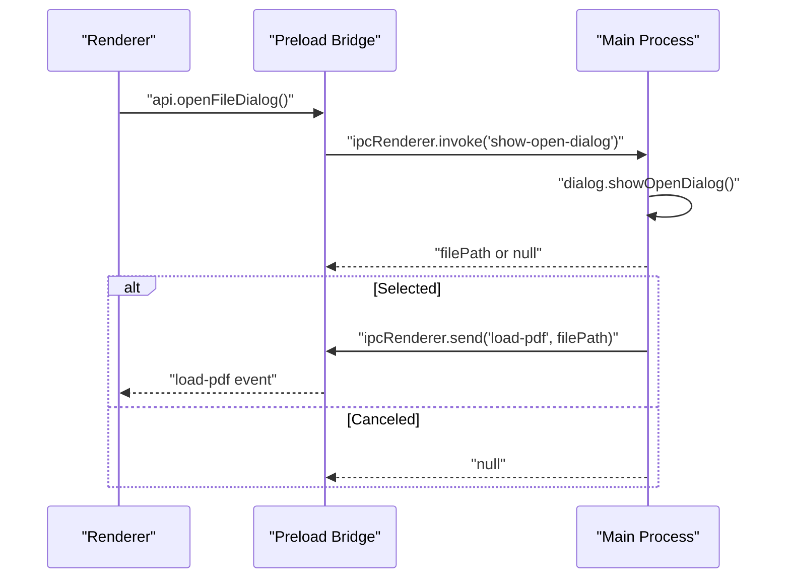
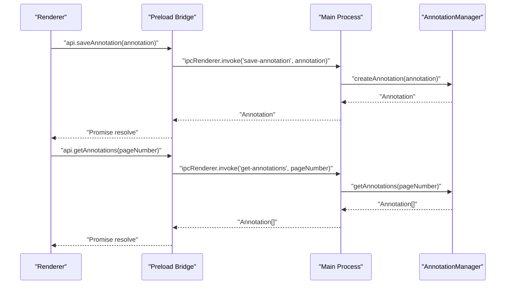
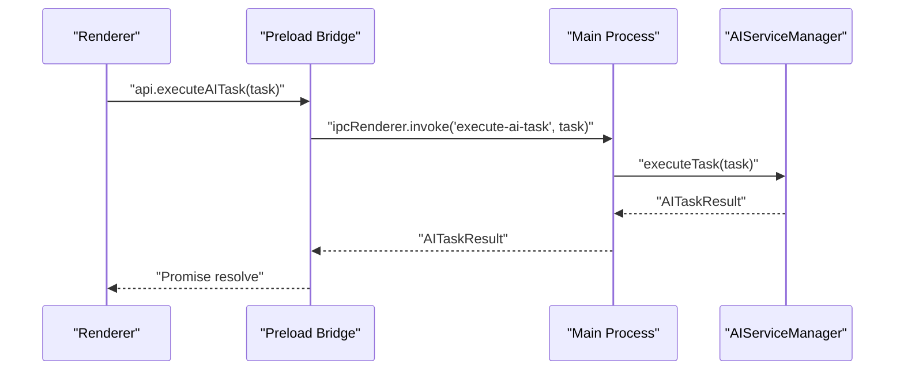
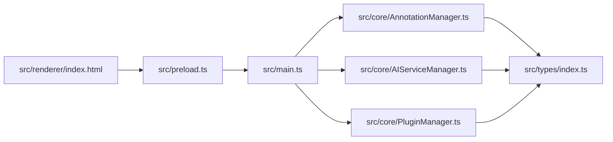

# Main Process Architecture

<cite>
**Referenced Files in This Document**
- [src/main.ts](file://src/main.ts)
- [src/core/AnnotationManager.ts](file://src/core/AnnotationManager.ts)
- [src/core/AIServiceManager.ts](file://src/core/AIServiceManager.ts)
- [src/core/PluginManager.ts](file://src/core/PluginManager.ts)
- [src/types/index.ts](file://src/types/index.ts)
- [src/renderer/index.html](file://src/renderer/index.html)
- [src/preload.ts](file://src/preload.ts)
- [package.json](file://package.json)
</cite>

## Update Summary
**Changes Made**
- Updated file path resolution section to reflect the corrected renderer file loading path
- Enhanced troubleshooting guide with specific guidance for file loading issues
- Added emphasis on proper path resolution for development vs production environments

## Table of Contents
1. [Introduction](#introduction)
2. [Project Structure](#project-structure)
3. [Core Components](#core-components)
4. [Architecture Overview](#architecture-overview)
5. [Detailed Component Analysis](#detailed-component-analysis)
6. [Dependency Analysis](#dependency-analysis)
7. [Performance Considerations](#performance-considerations)
8. [Troubleshooting Guide](#troubleshooting-guide)
9. [Conclusion](#conclusion)
10. [Appendices](#appendices)

## Introduction
This document explains the Electron main process architecture with a focus on the process separation model and IPC communication patterns. It details how the main process initializes the BrowserWindow with security-focused webPreferences, how services are initialized and wired, and how IPC handlers are registered for secure communication between the renderer and main processes. It also covers application lifecycle management, security considerations, and practical IPC usage patterns for PDF loading, annotation saving, AI task execution, and plugin command registration.

## Project Structure
The project follows a clear separation of concerns:
- Main process entry point initializes the BrowserWindow and registers IPC handlers.
- Core services encapsulate business logic for annotations, AI tasks, and plugin management.
- Types define shared interfaces and contracts across the application.
- A preload script exposes a minimal, controlled API surface to the renderer via contextBridge.
- The renderer loads a React-based UI and communicates with the main process through the preload bridge.

**Diagram sources**
- [src/main.ts:1-156](file://src/main.ts#L1-L156)
- [src/core/AnnotationManager.ts:1-172](file://src/core/AnnotationManager.ts#L1-L172)
- [src/core/AIServiceManager.ts:1-214](file://src/core/AIServiceManager.ts#L1-L214)
- [src/core/PluginManager.ts:1-250](file://src/core/PluginManager.ts#L1-L250)
- [src/preload.ts:1-34](file://src/preload.ts#L1-L34)
- [src/renderer/index.html:1-14](file://src/renderer/index.html#L1-L14)

**Section sources**
- [src/main.ts:13-43](file://src/main.ts#L13-L43)
- [src/renderer/index.html:1-14](file://src/renderer/index.html#L1-L14)
- [src/preload.ts:1-34](file://src/preload.ts#L1-L34)

## Core Components
- AnnotationManager: Manages annotations, persistence, and export formats. Provides CRUD operations and search.
- AIServiceManager: Orchestrates AI tasks (translation, summarization, background info, keyword extraction, Q&A) with configurable providers.
- PluginManager: Loads, activates, and manages plugins, exposing a controlled API surface to plugin modules and managing command registration.

These components are instantiated and wired during main process initialization and are referenced by IPC handlers to serve renderer requests.

**Section sources**
- [src/core/AnnotationManager.ts:6-172](file://src/core/AnnotationManager.ts#L6-L172)
- [src/core/AIServiceManager.ts:3-214](file://src/core/AIServiceManager.ts#L3-L214)
- [src/core/PluginManager.ts:16-36](file://src/core/PluginManager.ts#L16-L36)

## Architecture Overview
The main process creates a secure BrowserWindow with context isolation and a preload script. The preload script exposes a limited API to the renderer, which invokes IPC handlers in the main process. Services are initialized once and reused by IPC handlers to fulfill renderer requests.

**Diagram sources**
- [src/main.ts:81-128](file://src/main.ts#L81-L128)
- [src/preload.ts:5-33](file://src/preload.ts#L5-L33)
- [src/core/AnnotationManager.ts:46-59](file://src/core/AnnotationManager.ts#L46-L59)

**Section sources**
- [src/main.ts:13-43](file://src/main.ts#L13-L43)
- [src/main.ts:80-156](file://src/main.ts#L80-L156)
- [src/preload.ts:1-34](file://src/preload.ts#L1-L34)

## Detailed Component Analysis

### Main Process Initialization and Security Model
- BrowserWindow creation sets:
  - nodeIntegration: false
  - contextIsolation: true
  - preload: path to the compiled preload script
- Development mode opens DevTools automatically.
- Window lifecycle events are handled to reset references on close.
- Application lifecycle:
  - Ready: createWindow and register activate handler.
  - All windows closed: quit except on macOS.

**Critical Infrastructure Fix**: The renderer file loading path has been corrected to ensure proper file resolution during application startup. The path now correctly resolves to `'../src/renderer/index.html'` instead of the previous incorrect path `'../renderer/index.html'`.

Security implications:
- Disabling nodeIntegration prevents direct Node.js access from the renderer.
- Enabling contextIsolation ensures renderer code runs in a separate context.
- The preload script defines a minimal API surface via contextBridge, preventing arbitrary exposure of ipcRenderer.

**Section sources**
- [src/main.ts:13-43](file://src/main.ts#L13-L43)
- [src/main.ts:29-30](file://src/main.ts#L29-L30)
- [src/main.ts:62-78](file://src/main.ts#L62-L78)
- [src/preload.ts:1-34](file://src/preload.ts#L1-L34)

### Service Initialization Sequence
- AnnotationManager: Constructed and initializes default annotation types and persistent storage path.
- AIServiceManager: Constructed and ready to execute tasks when configured.
- PluginManager: Constructed with dependencies on AnnotationManager and AIServiceManager, then auto-loads installed plugins.

**Diagram sources**
- [src/main.ts:45-60](file://src/main.ts#L45-L60)
- [src/core/AnnotationManager.ts:11-19](file://src/core/AnnotationManager.ts#L11-L19)
- [src/core/PluginManager.ts:22-36](file://src/core/PluginManager.ts#L22-L36)

**Section sources**
- [src/main.ts:45-60](file://src/main.ts#L45-L60)
- [src/core/AnnotationManager.ts:11-19](file://src/core/AnnotationManager.ts#L11-L19)
- [src/core/PluginManager.ts:49-70](file://src/core/PluginManager.ts#L49-L70)

### IPC Handler Registration Pattern
The main process registers handlers using ipcMain.handle() for each capability:
- PDF operations: load-pdf, read-file-as-array-buffer, show-open-dialog.
- Annotation operations: save-annotation, get-annotations.
- AI operations: execute-ai-task.
- Plugin operations: register-command, register-annotation-type.

Handlers validate initialization state and delegate to services, returning structured results or throwing errors.

**Diagram sources**
- [src/main.ts:145-149](file://src/main.ts#L145-L149)
- [src/core/PluginManager.ts:123-135](file://src/core/PluginManager.ts#L123-L135)
- [src/preload.ts:25-28](file://src/preload.ts#L25-L28)

**Section sources**
- [src/main.ts:80-156](file://src/main.ts#L80-L156)
- [src/core/PluginManager.ts:123-135](file://src/core/PluginManager.ts#L123-L135)

### Application Lifecycle Management
- Creation: createWindow constructs BrowserWindow with security preferences, loads renderer HTML using the corrected path, and initializes services.
- Activation: app.on('activate') re-creates the window if none exist (macOS behavior).
- Closing: app.on('window-all-closed') quits the app except on macOS.

Graceful shutdown:
- No explicit cleanup shown in the main process; services are long-lived singletons referenced by handlers. Proper disposal patterns are available in PluginManager for plugin lifecycles.

**Section sources**
- [src/main.ts:29-30](file://src/main.ts#L29-L30)
- [src/main.ts:62-78](file://src/main.ts#L62-L78)
- [src/main.ts:13-43](file://src/main.ts#L13-L43)
- [src/core/PluginManager.ts:177-193](file://src/core/PluginManager.ts#L177-L193)

### Security Considerations
- nodeIntegration disabled and contextIsolation enabled in BrowserWindow webPreferences.
- Preload script exposes only named methods via contextBridge, minimizing attack surface.
- File system operations are performed in main process handlers; renderer cannot access Node.js APIs directly.
- Dialog operations are handled in main process, emitting events to renderer rather than exposing dialogs to renderer.

**Section sources**
- [src/main.ts:18-22](file://src/main.ts#L18-L22)
- [src/preload.ts:1-34](file://src/preload.ts#L1-L34)
- [src/main.ts:106-121](file://src/main.ts#L106-L121)

### Practical IPC Communication Patterns

#### PDF Loading
- Renderer calls api.loadPDF(filePath) via preload.
- Main process reads file synchronously and returns metadata.
- On open dialog selection, main process emits a load-pdf event to renderer.

**Diagram sources**
- [src/main.ts:106-121](file://src/main.ts#L106-L121)
- [src/preload.ts:17-23](file://src/preload.ts#L17-L23)

**Section sources**
- [src/main.ts:81-94](file://src/main.ts#L81-L94)
- [src/main.ts:106-121](file://src/main.ts#L106-L121)
- [src/preload.ts:7-23](file://src/preload.ts#L7-L23)

#### Annotation Saving and Retrieval
- Renderer saves annotations via api.saveAnnotation(annotation).
- Main process delegates to AnnotationManager and persists data.
- Renderer retrieves annotations via api.getAnnotations(pageNumber).

**Diagram sources**
- [src/main.ts:123-135](file://src/main.ts#L123-L135)
- [src/core/AnnotationManager.ts:46-84](file://src/core/AnnotationManager.ts#L46-L84)
- [src/preload.ts:10-12](file://src/preload.ts#L10-L12)

**Section sources**
- [src/main.ts:123-135](file://src/main.ts#L123-L135)
- [src/core/AnnotationManager.ts:46-84](file://src/core/AnnotationManager.ts#L46-L84)

#### AI Task Execution
- Renderer submits tasks via api.executeAITask(task).
- Main process delegates to AIServiceManager, which routes to provider-specific implementations.

**Diagram sources**
- [src/main.ts:137-142](file://src/main.ts#L137-L142)
- [src/core/AIServiceManager.ts:13-56](file://src/core/AIServiceManager.ts#L13-L56)
- [src/preload.ts:14-15](file://src/preload.ts#L14-L15)

**Section sources**
- [src/main.ts:137-142](file://src/main.ts#L137-L142)
- [src/core/AIServiceManager.ts:13-56](file://src/core/AIServiceManager.ts#L13-L56)

#### Plugin Command Registration
- Renderer registers plugin commands via api.registerCommand(commandId, callback).
- Main process stores the command in PluginManager for later execution.

**Diagram sources**
- [src/main.ts:145-149](file://src/main.ts#L145-L149)
- [src/core/PluginManager.ts:123-135](file://src/core/PluginManager.ts#L123-L135)
- [src/preload.ts:25-28](file://src/preload.ts#L25-L28)

**Section sources**
- [src/main.ts:145-149](file://src/main.ts#L145-L149)
- [src/core/PluginManager.ts:123-135](file://src/core/PluginManager.ts#L123-L135)

### Platform-Specific Behaviors and Development vs Production Differences
- Development:
  - DevTools opened automatically for debugging.
  - NODE_ENV environment variable controls this behavior.
- Production:
  - No automatic DevTools; production builds rely on packaged renderer assets.
- macOS:
  - App does not quit when the last window is closed; activate event re-creates the window.
- Other platforms:
  - App quits when all windows are closed.

**Section sources**
- [src/main.ts:33-35](file://src/main.ts#L33-L35)
- [src/main.ts:75-78](file://src/main.ts#L75-L78)

## Dependency Analysis
The main process depends on core services, which in turn depend on shared types. The preload script bridges the renderer to the main process via a controlled API surface.

**Diagram sources**
- [src/main.ts:1-12](file://src/main.ts#L1-L12)
- [src/core/AnnotationManager.ts:1-5](file://src/core/AnnotationManager.ts#L1-L5)
- [src/core/AIServiceManager.ts:1](file://src/core/AIServiceManager.ts#L1)
- [src/core/PluginManager.ts:1-4](file://src/core/PluginManager.ts#L1-L4)
- [src/preload.ts:1](file://src/preload.ts#L1)
- [src/renderer/index.html:10](file://src/renderer/index.html#L10)
- [src/types/index.ts:1](file://src/types/index.ts#L1)

**Section sources**
- [src/main.ts:1-12](file://src/main.ts#L1-L12)
- [src/core/AnnotationManager.ts:1-5](file://src/core/AnnotationManager.ts#L1-L5)
- [src/core/AIServiceManager.ts:1](file://src/core/AIServiceManager.ts#L1)
- [src/core/PluginManager.ts:1-4](file://src/core/PluginManager.ts#L1-L4)
- [src/preload.ts:1](file://src/preload.ts#L1)
- [src/renderer/index.html:10](file://src/renderer/index.html#L10)
- [src/types/index.ts:1](file://src/types/index.ts#L1)

## Performance Considerations
- Synchronous file operations in main process handlers (e.g., readFileSync) can block the main thread. Consider asynchronous alternatives for large files to keep the UI responsive.
- AI task execution is asynchronous; ensure tasks are queued and results cached where appropriate to avoid redundant computations.
- Plugin loading scans directories and requires modules; cache plugin manifests and avoid repeated disk scans.
- Annotation persistence writes to disk; batch writes or debounce to reduce I/O overhead.

## Troubleshooting Guide
Common issues and resolutions:
- Renderer cannot access Node.js APIs:
  - Verify contextIsolation is true and preload exposes only allowed methods.
- IPC handlers not responding:
  - Confirm handlers are registered before renderer calls them.
  - Check that service instances exist and are initialized.
- Plugin command not found:
  - Ensure registerCommand was invoked and the commandId matches when executing.
- File dialog not opening:
  - Ensure main process dialog handler is registered and called from preload.
- **Renderer fails to load in development**:
  - **Critical**: Verify the renderer file path is correctly set to `'../src/renderer/index.html'` in the main process. The previous incorrect path `'../renderer/index.html'` would cause file loading failures during development.
- **Production build issues**:
  - Ensure the renderer bundle is built and placed in the correct output directory structure.

**Updated** Added specific guidance for the corrected renderer file loading path and development environment troubleshooting.

**Section sources**
- [src/main.ts:18-22](file://src/main.ts#L18-L22)
- [src/main.ts:29-30](file://src/main.ts#L29-L30)
- [src/main.ts:145-149](file://src/main.ts#L145-L149)
- [src/preload.ts:1-34](file://src/preload.ts#L1-L34)

## Conclusion
The main process architecture employs a secure, service-oriented design with clear IPC boundaries. The BrowserWindow is configured with strong security defaults, and the preload script exposes a minimal API surface. Services are initialized once and reused by IPC handlers to provide robust functionality for PDF operations, annotations, AI tasks, and plugin management. Following the patterns documented here ensures predictable behavior, maintainable code, and safe cross-process communication.

## Appendices

### IPC Handler Reference
- load-pdf: Reads a file and returns metadata.
- read-file-as-array-buffer: Returns file content as ArrayBuffer.
- show-open-dialog: Opens a file dialog and emits load-pdf to renderer.
- save-annotation: Persists an annotation via AnnotationManager.
- get-annotations: Retrieves annotations for a page.
- execute-ai-task: Executes an AI task via AIServiceManager.
- register-command: Registers a plugin command in PluginManager.
- register-annotation-type: Registers a new annotation type in AnnotationManager.

**Section sources**
- [src/main.ts:80-156](file://src/main.ts#L80-L156)

### Types Overview
Key shared types define contracts for annotations, AI tasks, plugin manifests, and plugin APIs. These types guide service implementations and ensure consistent IPC payloads.

**Section sources**
- [src/types/index.ts:3-224](file://src/types/index.ts#L3-L224)