# Plugin System Architecture

<cite>
**Referenced Files in This Document**
- [main.ts](file://src/main.ts)
- [PluginManager.ts](file://src/core/PluginManager.ts)
- [AnnotationManager.ts](file://src/core/AnnotationManager.ts)
- [AIServiceManager.ts](file://src/core/AIServiceManager.ts)
- [types/index.ts](file://src/types/index.ts)
- [preload.ts](file://src/preload.ts)
- [README.md](file://README.md)
- [PLUGIN-GUIDE.md](file://PLUGIN-GUIDE.md)
- [DESIGN.md](file://DESIGN.md)
- [package.json](file://package.json)
</cite>

## Table of Contents
1. [Introduction](#introduction)
2. [Project Structure](#project-structure)
3. [Core Components](#core-components)
4. [Architecture Overview](#architecture-overview)
5. [Detailed Component Analysis](#detailed-component-analysis)
6. [Dependency Analysis](#dependency-analysis)
7. [Performance Considerations](#performance-considerations)
8. [Troubleshooting Guide](#troubleshooting-guide)
9. [Conclusion](#conclusion)
10. [Appendices](#appendices)

## Introduction
This document describes the plugin system architecture for a VS Code-inspired plugin platform integrated into an Electron-based PDF reader application. It explains the plugin lifecycle from discovery through activation, including manifest parsing, dependency resolution, and API exposure patterns. It documents the plugin context API that grants access to core services such as annotation management and AI services, and details the command registration system enabling plugins to extend user interface functionality. Security considerations, including sandboxing and permission management, are covered alongside plugin discovery and auto-loading capabilities. Architectural patterns such as factory and observer are highlighted, and the communication pathways between plugins and the main process via IPC handlers, as well as interactions with the renderer process, are explained. Extension points for custom annotation types, AI service providers, and UI extensions are documented with architectural diagrams.

## Project Structure
The plugin system spans the Electron main process, core managers, type definitions, and the renderer process. The main process initializes core services and the plugin manager, exposes IPC handlers for renderer-to-main communication, and manages plugin discovery and activation. The renderer process communicates with the main process through a controlled bridge.

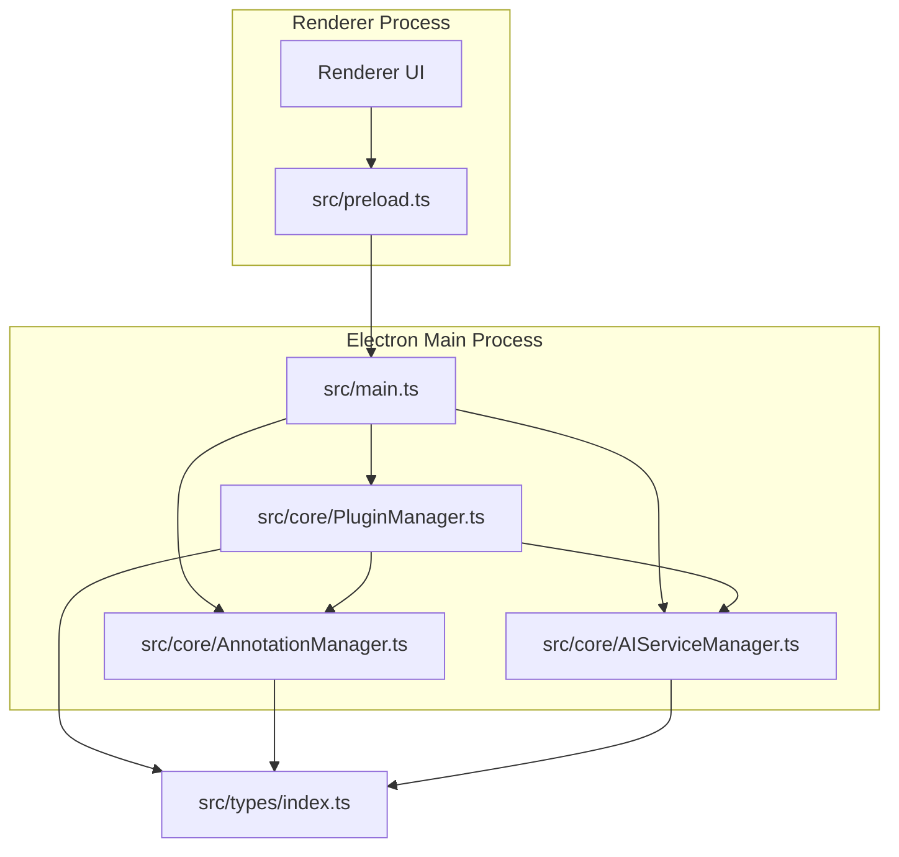

**Diagram sources**
- [main.ts:1-156](file://src/main.ts#L1-L156)
- [PluginManager.ts:1-250](file://src/core/PluginManager.ts#L1-L250)
- [AnnotationManager.ts:1-172](file://src/core/AnnotationManager.ts#L1-L172)
- [AIServiceManager.ts:1-214](file://src/core/AIServiceManager.ts#L1-L214)
- [types/index.ts:1-224](file://src/types/index.ts#L1-L224)
- [preload.ts:1-34](file://src/preload.ts#L1-L34)

**Section sources**
- [main.ts:1-156](file://src/main.ts#L1-L156)
- [package.json:1-61](file://package.json#L1-L61)

## Core Components
- PluginManager: Discovers installed plugins, loads and activates them, registers commands, and exposes a plugin context API to plugins.
- AnnotationManager: Manages annotation creation, updates, deletion, retrieval, search, and export; supports registering custom annotation types.
- AIServiceManager: Provides AI task execution (translation, summarization, background info, keyword extraction, question answering), batching, cancellation, and status tracking.
- Plugin Context API: A typed API surface exposed to plugins via PluginManager, including annotations, pdfRenderer, aiService, and storage.
- IPC Handlers: Main process handlers for PDF operations, annotation operations, AI tasks, and plugin-related actions (command registration, annotation type registration).
- Preload Bridge: Controlled exposure of IPC channels to the renderer process.

**Section sources**
- [PluginManager.ts:16-250](file://src/core/PluginManager.ts#L16-L250)
- [AnnotationManager.ts:6-172](file://src/core/AnnotationManager.ts#L6-L172)
- [AIServiceManager.ts:3-214](file://src/core/AIServiceManager.ts#L3-L214)
- [types/index.ts:136-177](file://src/types/index.ts#L136-L177)
- [main.ts:80-156](file://src/main.ts#L80-L156)
- [preload.ts:1-34](file://src/preload.ts#L1-L34)

## Architecture Overview
The plugin system follows a VS Code-inspired model:
- Discovery: Scans a user-specific plugins directory for plugin packages with a manifest.
- Manifest Parsing: Reads and validates plugin manifests to determine activation conditions and contribution points.
- Activation: Loads plugin modules and invokes their activate function with a restricted plugin context.
- API Exposure: PluginManager constructs a typed context exposing safe APIs for annotations, AI services, PDF renderer stubs, and storage.
- Command Registration: Plugins register commands through the context; PluginManager stores and executes them.
- Lifecycle Events: Plugins can implement deactivate; PluginManager handles enable/disable/uninstall and subscription disposal.

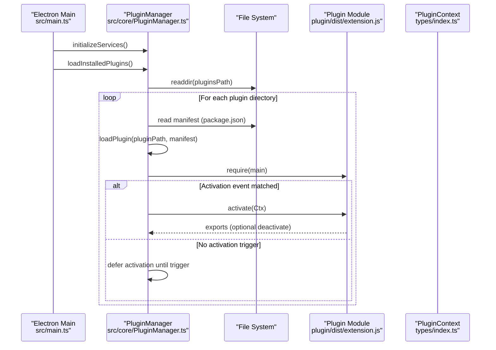

**Diagram sources**
- [main.ts:45-60](file://src/main.ts#L45-L60)
- [PluginManager.ts:49-107](file://src/core/PluginManager.ts#L49-L107)

**Section sources**
- [PluginManager.ts:38-107](file://src/core/PluginManager.ts#L38-L107)
- [main.ts:45-60](file://src/main.ts#L45-L60)

## Detailed Component Analysis

### PluginManager: Discovery, Loading, Activation, and Command Registry
- Discovery and Directory Layout: Uses a user-specific plugins directory derived from environment variables. Ensures the directory exists and scans subdirectories for manifests.
- Manifest Parsing: Reads and parses package.json to obtain plugin metadata and main entry point.
- Loading and Activation: Requires the plugin’s main module and invokes its activate function with a constructed PluginContext. Supports deferred activation based on activationEvents.
- Command Registry: Registers commands with disposal support and executes them with arguments.
- Lifecycle Management: Enables/disables/uninstalls plugins and calls deactivate when present; disposes subscriptions.

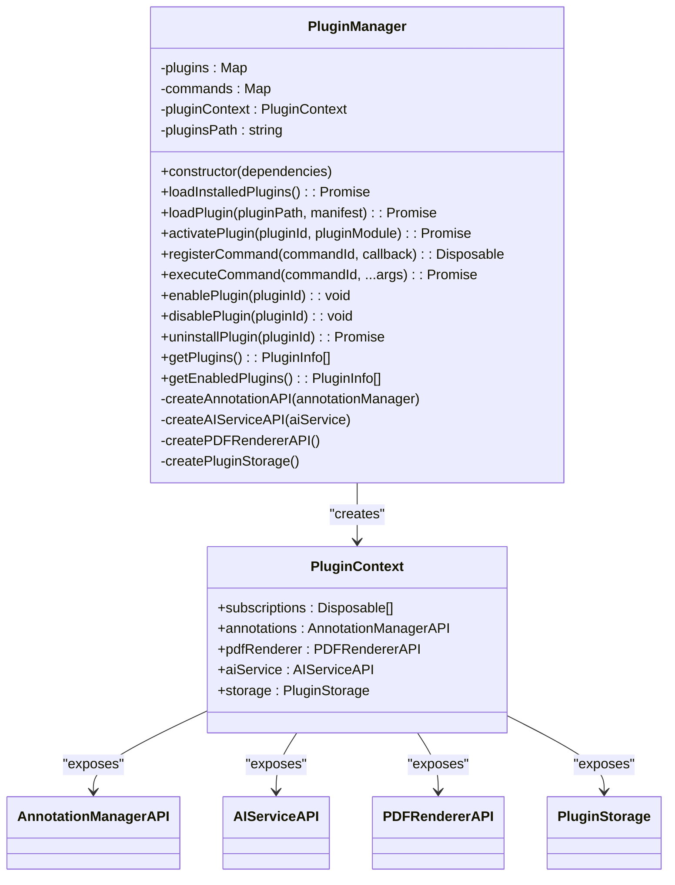

**Diagram sources**
- [PluginManager.ts:16-36](file://src/core/PluginManager.ts#L16-L36)
- [types/index.ts:136-177](file://src/types/index.ts#L136-L177)

**Section sources**
- [PluginManager.ts:16-250](file://src/core/PluginManager.ts#L16-L250)
- [types/index.ts:136-177](file://src/types/index.ts#L136-L177)

### AnnotationManager: Annotation Types, Storage, and Operations
- Default Annotation Types: Initializes built-in annotation types and registers them.
- Custom Type Registration: Allows plugins to register new annotation types via the plugin context.
- Persistence: Stores annotations to a user-specific data directory and supports loading on startup.
- Operations: Create, update, delete, get by page, search, and export in multiple formats.

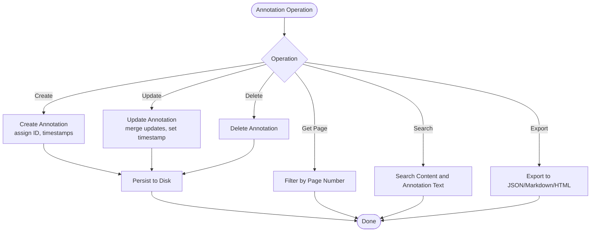

**Diagram sources**
- [AnnotationManager.ts:46-172](file://src/core/AnnotationManager.ts#L46-L172)

**Section sources**
- [AnnotationManager.ts:6-172](file://src/core/AnnotationManager.ts#L6-L172)

### AIServiceManager: Task Execution and Provider Abstraction
- Provider Abstraction: Supports OpenAI/Azure and local/custom providers; initializes with configuration.
- Task Types: Translation, summarization, background info, keyword extraction, question answering.
- Execution Pipeline: Queues tasks, executes based on type, stores results, and exposes batch execution and cancellation.
- Mock Implementations: Provides mock responses for local and unsupported providers.

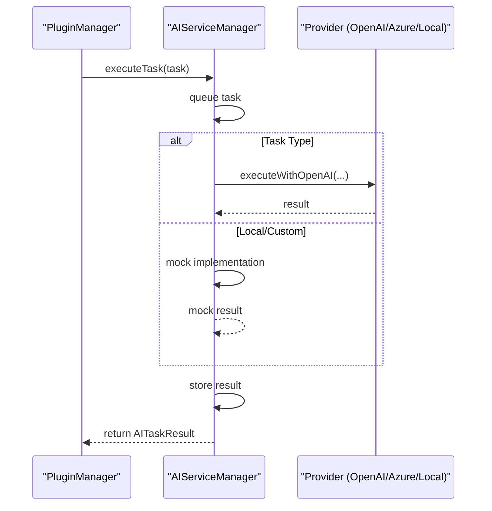

**Diagram sources**
- [AIServiceManager.ts:13-92](file://src/core/AIServiceManager.ts#L13-L92)
- [AIServiceManager.ts:96-212](file://src/core/AIServiceManager.ts#L96-L212)

**Section sources**
- [AIServiceManager.ts:3-214](file://src/core/AIServiceManager.ts#L3-L214)

### Plugin Context API: Exposed Services and Extension Points
- Annotations API: Create, update, delete, get by page, search, export.
- AI Service API: Initialize, execute task, batch execute, cancel task.
- PDF Renderer API: Document loading, page rendering, page info, text extraction, selection, zoom.
- Storage API: Get, put, keys for plugin-scoped storage.

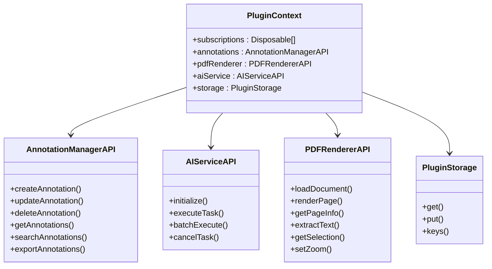

**Diagram sources**
- [types/index.ts:136-177](file://src/types/index.ts#L136-L177)

**Section sources**
- [types/index.ts:136-177](file://src/types/index.ts#L136-L177)

### Command Registration System
- Registration: Plugins register commands via the context; PluginManager stores them with disposal support.
- Execution: Main process routes renderer-triggered commands to PluginManager for execution.
- IPC Integration: Renderer invokes registerCommand and executeCommand via preload bridge.

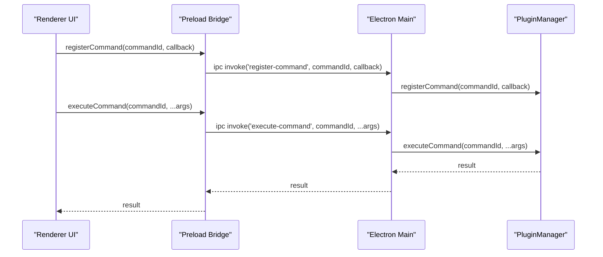

**Diagram sources**
- [preload.ts:25-28](file://src/preload.ts#L25-L28)
- [main.ts:144-149](file://src/main.ts#L144-L149)
- [PluginManager.ts:123-145](file://src/core/PluginManager.ts#L123-L145)

**Section sources**
- [preload.ts:25-28](file://src/preload.ts#L25-L28)
- [main.ts:144-149](file://src/main.ts#L144-L149)
- [PluginManager.ts:123-145](file://src/core/PluginManager.ts#L123-L145)

### Plugin Discovery and Auto-Loading
- Discovery Path: User-specific directory under APPDATA/HOME with a dedicated plugins subfolder.
- Auto-Loading: On application startup, the main process initializes services and triggers loadInstalledPlugins, which scans directories and loads manifests.
- Activation Triggers: Plugins can activate immediately or on specific events (e.g., onStartupFinished).

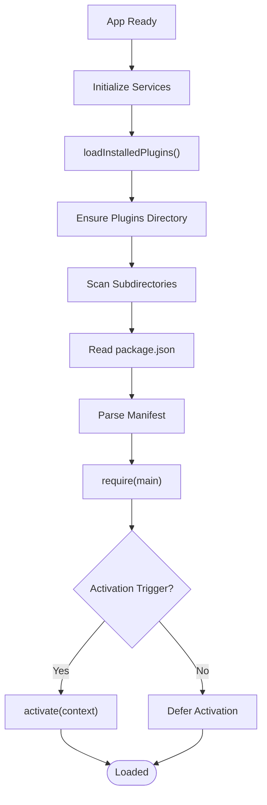

**Diagram sources**
- [main.ts:45-60](file://src/main.ts#L45-L60)
- [PluginManager.ts:38-70](file://src/core/PluginManager.ts#L38-L70)
- [PluginManager.ts:72-107](file://src/core/PluginManager.ts#L72-L107)

**Section sources**
- [main.ts:45-60](file://src/main.ts#L45-L60)
- [PluginManager.ts:38-107](file://src/core/PluginManager.ts#L38-L107)

### Security Model: Sandboxing and Permission Management
- Context Isolation: The main process uses contextIsolation and a preload bridge to expose only specific IPC channels to the renderer.
- Restricted APIs: Renderer can only call whitelisted operations (PDF load, file open dialog, annotation save/get, AI task execution, plugin command registration, annotation type registration).
- Plugin Execution: Plugins run in-process within the Electron main process; future enhancements could introduce sandboxing and permission prompts.

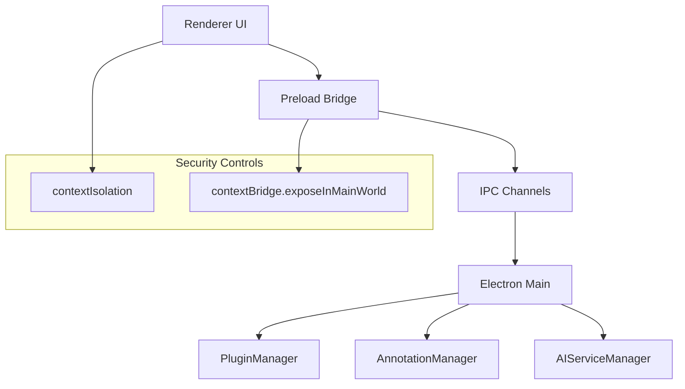

**Diagram sources**
- [main.ts:18-27](file://src/main.ts#L18-L27)
- [preload.ts:5-33](file://src/preload.ts#L5-L33)

**Section sources**
- [main.ts:18-27](file://src/main.ts#L18-L27)
- [preload.ts:5-33](file://src/preload.ts#L5-L33)

### Extension Points
- Custom Annotation Types: Plugins can register new annotation types via the annotations API.
- AI Service Providers: Plugins can initialize AI services with provider configurations and execute tasks.
- UI Extensions: Plugins can register commands and integrate with the UI through the renderer process.

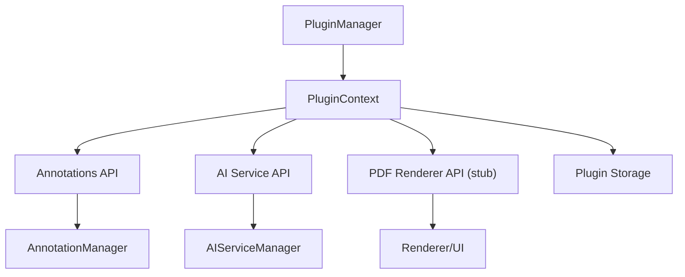

**Diagram sources**
- [PluginManager.ts:203-235](file://src/core/PluginManager.ts#L203-L235)
- [AnnotationManager.ts:42-44](file://src/core/AnnotationManager.ts#L42-L44)
- [AIServiceManager.ts:8-11](file://src/core/AIServiceManager.ts#L8-L11)

**Section sources**
- [PluginManager.ts:203-235](file://src/core/PluginManager.ts#L203-L235)
- [AnnotationManager.ts:42-44](file://src/core/AnnotationManager.ts#L42-L44)
- [AIServiceManager.ts:8-11](file://src/core/AIServiceManager.ts#L8-L11)

## Dependency Analysis
- PluginManager depends on AnnotationManager and AIServiceManager to construct the plugin context.
- Main process depends on PluginManager for plugin lifecycle and on AnnotationManager and AIServiceManager for core services.
- Renderer depends on preload bridge for IPC access to main process.

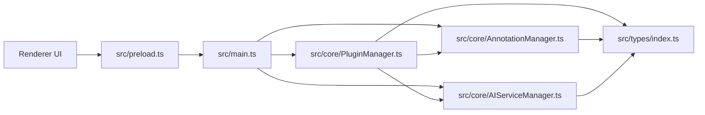

**Diagram sources**
- [main.ts:4-6](file://src/main.ts#L4-L6)
- [PluginManager.ts:1-6](file://src/core/PluginManager.ts#L1-L6)
- [types/index.ts:1-224](file://src/types/index.ts#L1-L224)
- [preload.ts:1-34](file://src/preload.ts#L1-L34)

**Section sources**
- [main.ts:4-6](file://src/main.ts#L4-L6)
- [PluginManager.ts:1-6](file://src/core/PluginManager.ts#L1-L6)
- [types/index.ts:1-224](file://src/types/index.ts#L1-L224)
- [preload.ts:1-34](file://src/preload.ts#L1-L34)

## Performance Considerations
- Plugin Loading: Avoid heavy synchronous work during activation; defer non-critical operations.
- Annotation Persistence: Batch writes and use efficient serialization to minimize disk I/O.
- AI Task Batching: Use batchExecute to reduce overhead and network calls.
- Renderer Integration: Use lazy rendering and virtualization for large PDFs; cache rendered pages and annotations.

## Troubleshooting Guide
- Plugin Not Activating: Verify activationEvents and manifest presence; check console logs for load/activation errors.
- Command Not Found: Ensure commands are registered before execution; confirm IPC channel availability.
- Annotation Persistence Issues: Confirm data directory permissions and path correctness.
- AI Service Initialization: Ensure provider configuration is set before executing tasks.

**Section sources**
- [PluginManager.ts:109-121](file://src/core/PluginManager.ts#L109-L121)
- [main.ts:144-149](file://src/main.ts#L144-L149)
- [AnnotationManager.ts:153-170](file://src/core/AnnotationManager.ts#L153-L170)
- [AIServiceManager.ts:8-11](file://src/core/AIServiceManager.ts#L8-L11)

## Conclusion
The plugin system integrates a VS Code-inspired architecture into an Electron-based PDF reader. It provides robust discovery, manifest-driven activation, and a secure, typed plugin context exposing annotation and AI services. The command registration system enables UI extensions, while IPC handlers mediate communication between the renderer and main processes. Future enhancements can include sandboxing, permission prompts, and a plugin marketplace.

## Appendices

### Plugin Manifest and Contribution Points
- Manifest Fields: name, displayName, version, description, publisher, engines, main, contributes, activationEvents.
- Contributes: annotations, aiServices, commands, menus.
- Activation Events: wildcards and startup triggers.

**Section sources**
- [types/index.ts:86-103](file://src/types/index.ts#L86-L103)
- [PLUGIN-GUIDE.md:65-97](file://PLUGIN-GUIDE.md#L65-L97)

### Renderer-to-Main IPC Channels
- PDF Operations: load-pdf, read-file-as-array-buffer.
- Annotation Operations: save-annotation, get-annotations.
- AI Operations: execute-ai-task.
- Plugin Operations: register-command, register-annotation-type.
- File Dialog: show-open-dialog.

**Section sources**
- [main.ts:80-156](file://src/main.ts#L80-L156)
- [preload.ts:7-32](file://src/preload.ts#L7-L32)