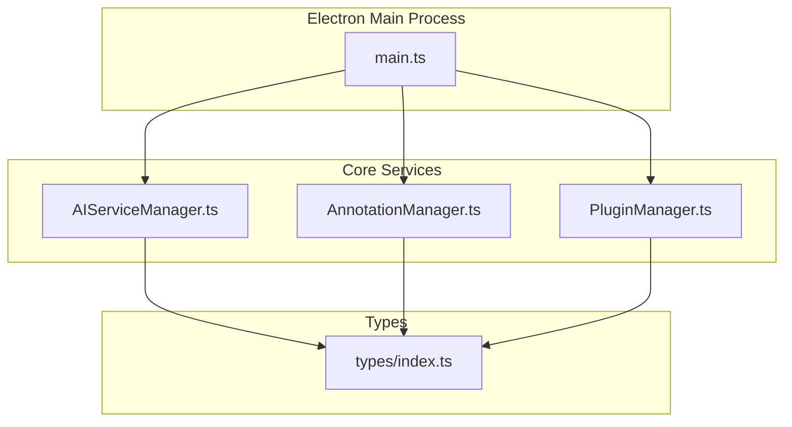
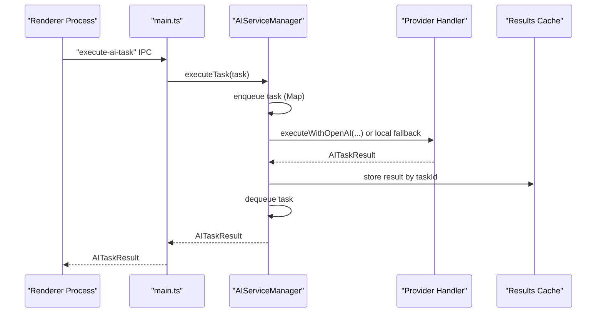
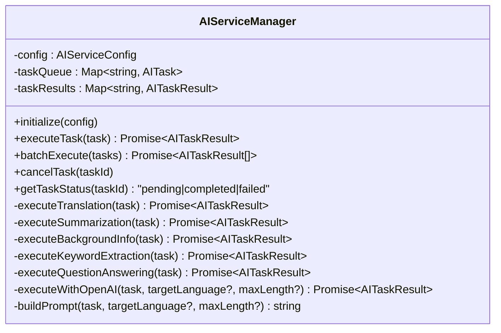
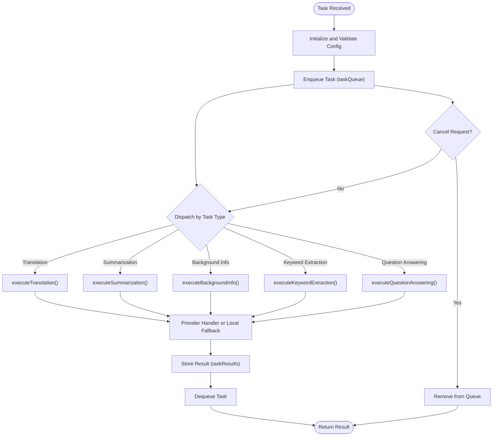
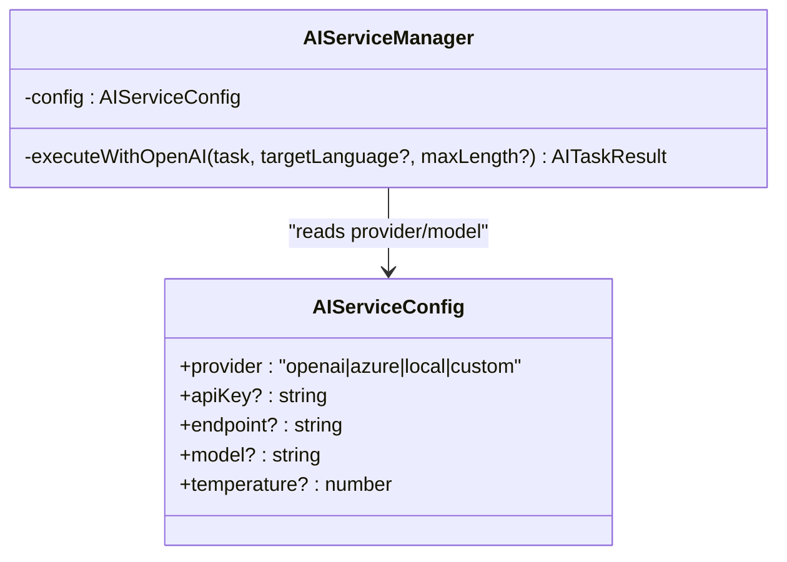
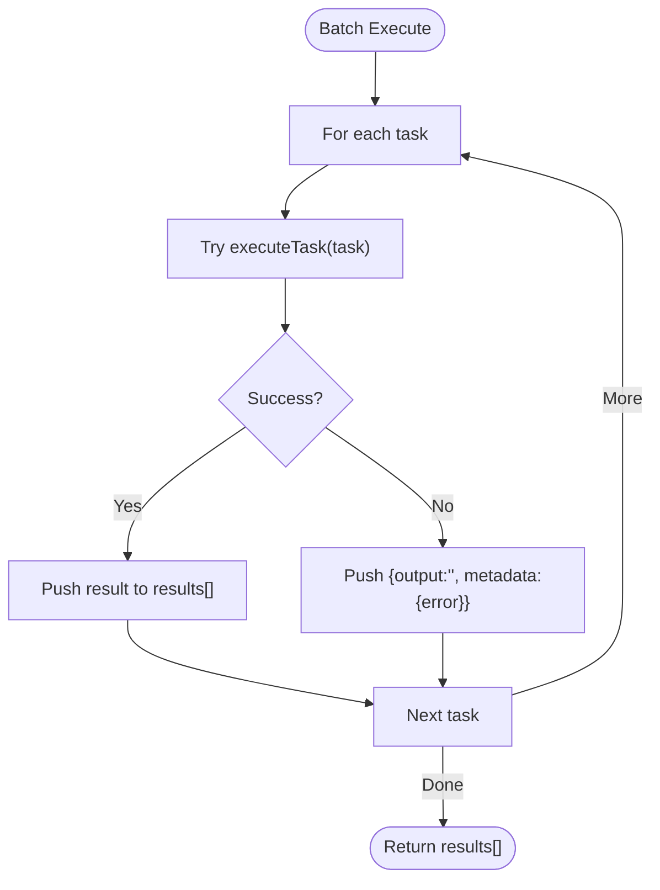
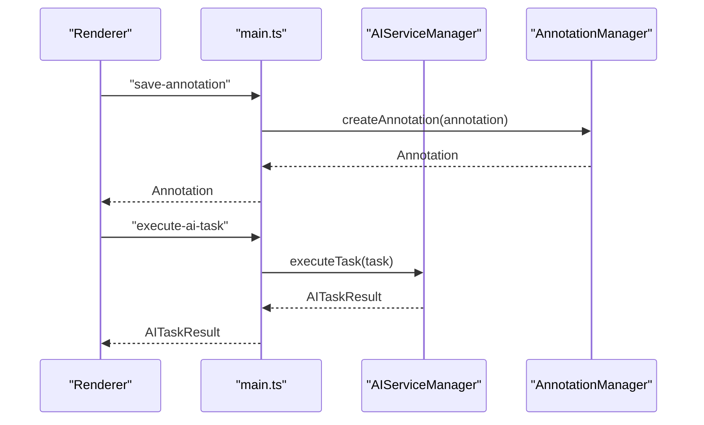
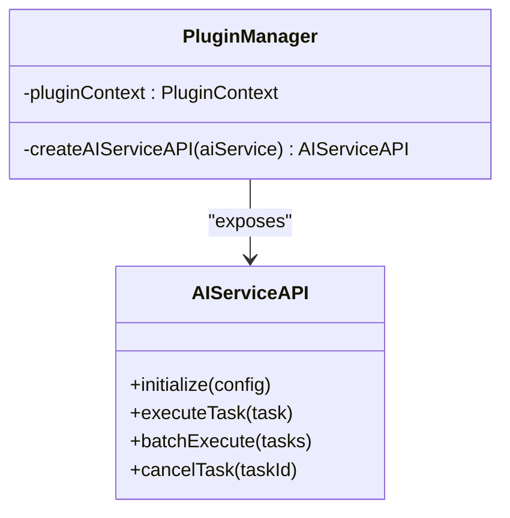
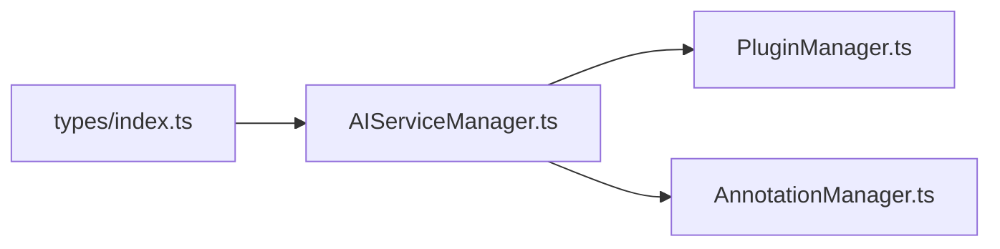

# AI Service Manager

<cite>
**Referenced Files in This Document**
- [AIServiceManager.ts](file://src/core/AIServiceManager.ts)
- [AnnotationManager.ts](file://src/core/AnnotationManager.ts)
- [PluginManager.ts](file://src/core/PluginManager.ts)
- [main.ts](file://src/main.ts)
- [index.ts](file://src/types/index.ts)
- [README.md](file://README.md)
- [DESIGN.md](file://DESIGN.md)
</cite>

## Table of Contents
1. [Introduction](#introduction)
2. [Project Structure](#project-structure)
3. [Core Components](#core-components)
4. [Architecture Overview](#architecture-overview)
5. [Detailed Component Analysis](#detailed-component-analysis)
6. [Dependency Analysis](#dependency-analysis)
7. [Performance Considerations](#performance-considerations)
8. [Troubleshooting Guide](#troubleshooting-guide)
9. [Conclusion](#conclusion)
10. [Appendices](#appendices)

## Introduction
This document provides a comprehensive guide to the AI Service Manager component, focusing on AI service orchestration, provider abstraction, task queue management, batch processing, and integration with the broader application. It explains the AITask interface and lifecycle, provider configuration supporting OpenAI, Azure AI, and local/custom models, scheduling and execution pipeline, result caching, error handling, and retry mechanisms. It also covers integration patterns with the main application, PDF reading, and annotation systems, along with practical usage examples and performance optimization strategies.

## Project Structure
The AI Service Manager resides in the core layer alongside the Annotation Manager and Plugin Manager. The Electron main process initializes these services and exposes IPC handlers for the renderer process to trigger AI tasks and manage annotations.

**Diagram sources**
- [main.ts:41-60](file://src/main.ts#L41-L60)
- [AIServiceManager.ts:1-214](file://src/core/AIServiceManager.ts#L1-L214)
- [AnnotationManager.ts:1-172](file://src/core/AnnotationManager.ts#L1-L172)
- [PluginManager.ts:1-250](file://src/core/PluginManager.ts#L1-L250)
- [index.ts:1-224](file://src/types/index.ts#L1-L224)

**Section sources**
- [main.ts:41-60](file://src/main.ts#L41-L60)
- [DESIGN.md:51-85](file://DESIGN.md#L51-L85)

## Core Components
- AIServiceManager: Orchestrates AI tasks, manages queues, executes provider-specific logic, and maintains results cache.
- AITask and AITaskResult: Typed interfaces defining task inputs, options, and outputs.
- AIServiceConfig: Provider configuration supporting OpenAI, Azure, local, and custom providers.
- PluginManager: Exposes an AI Service API to plugins and integrates with the main process.
- AnnotationManager: Manages annotations and integrates with AI results to create AI-powered annotations.

Key responsibilities:
- Provider abstraction: Switches behavior based on provider configuration.
- Task lifecycle: Queue management, status tracking, cancellation, and result caching.
- Batch processing: Executes multiple tasks with controlled error handling.
- Integration: IPC handlers connect renderer actions to AI execution and annotation creation.

**Section sources**
- [AIServiceManager.ts:1-214](file://src/core/AIServiceManager.ts#L1-L214)
- [index.ts:49-84](file://src/types/index.ts#L49-L84)
- [PluginManager.ts:216-223](file://src/core/PluginManager.ts#L216-L223)
- [AnnotationManager.ts:46-59](file://src/core/AnnotationManager.ts#L46-L59)

## Architecture Overview
The AI Service Manager sits at the center of AI orchestration. It receives tasks from the renderer via IPC, enforces initialization, routes tasks to provider-specific handlers, and caches results. Plugins can initialize and execute AI tasks through the PluginManager’s exposed API.

**Diagram sources**
- [main.ts:137-142](file://src/main.ts#L137-L142)
- [AIServiceManager.ts:13-56](file://src/core/AIServiceManager.ts#L13-L56)
- [AIServiceManager.ts:174-193](file://src/core/AIServiceManager.ts#L174-L193)

## Detailed Component Analysis

### AIServiceManager
The AIServiceManager encapsulates AI orchestration:
- Initialization: Validates configuration and logs provider selection.
- Task execution: Enqueues tasks, dispatches by type, and stores results.
- Provider abstraction: Uses OpenAI/Azure path for translation, summarization, background info, and question answering; falls back to local mocks for other providers.
- Batch execution: Iterates tasks with per-task error handling and partial result collection.
- Task lifecycle: Supports cancellation and status queries.

**Diagram sources**
- [AIServiceManager.ts:3-214](file://src/core/AIServiceManager.ts#L3-L214)

**Section sources**
- [AIServiceManager.ts:8-11](file://src/core/AIServiceManager.ts#L8-L11)
- [AIServiceManager.ts:13-56](file://src/core/AIServiceManager.ts#L13-L56)
- [AIServiceManager.ts:58-75](file://src/core/AIServiceManager.ts#L58-L75)
- [AIServiceManager.ts:77-92](file://src/core/AIServiceManager.ts#L77-L92)
- [AIServiceManager.ts:96-171](file://src/core/AIServiceManager.ts#L96-L171)
- [AIServiceManager.ts:174-212](file://src/core/AIServiceManager.ts#L174-L212)

### AITask and Task Lifecycle
AITask defines the contract for AI operations, while AITaskResult carries outputs and metadata. The lifecycle includes:
- Creation: Task ID, type, input, optional context/options.
- Execution: Dispatch by type; provider-specific logic; result caching.
- Cancellation: Removes pending tasks.
- Status: Pending, completed, or failed based on queue and cache.

**Diagram sources**
- [AIServiceManager.ts:13-56](file://src/core/AIServiceManager.ts#L13-L56)
- [AIServiceManager.ts:96-171](file://src/core/AIServiceManager.ts#L96-L171)
- [index.ts:65-84](file://src/types/index.ts#L65-L84)

**Section sources**
- [index.ts:57-78](file://src/types/index.ts#L57-L78)
- [index.ts:80-84](file://src/types/index.ts#L80-L84)
- [AIServiceManager.ts:77-92](file://src/core/AIServiceManager.ts#L77-L92)

### Provider Configuration and Abstraction
The AIServiceConfig supports multiple providers:
- openai: Integrates with OpenAI API via executeWithOpenAI.
- azure: Uses Azure AI service via executeWithOpenAI.
- local: Uses local model implementations.
- custom: Allows custom provider integrations.

Provider-specific logic is centralized in provider handlers, enabling easy extension and swapping.

**Diagram sources**
- [index.ts:49-55](file://src/types/index.ts#L49-L55)
- [AIServiceManager.ts:174-193](file://src/core/AIServiceManager.ts#L174-L193)

**Section sources**
- [index.ts:49-55](file://src/types/index.ts#L49-L55)
- [AIServiceManager.ts:96-109](file://src/core/AIServiceManager.ts#L96-L109)
- [AIServiceManager.ts:111-126](file://src/core/AIServiceManager.ts#L111-L126)
- [AIServiceManager.ts:128-137](file://src/core/AIServiceManager.ts#L128-L137)
- [AIServiceManager.ts:162-171](file://src/core/AIServiceManager.ts#L162-L171)
- [AIServiceManager.ts:174-193](file://src/core/AIServiceManager.ts#L174-L193)

### Batch Processing and Error Handling
BatchExecute iterates through tasks, executing each individually and collecting results. On failure, it records an error in metadata and continues with subsequent tasks, ensuring partial success scenarios are handled gracefully.

**Diagram sources**
- [AIServiceManager.ts:58-75](file://src/core/AIServiceManager.ts#L58-L75)

**Section sources**
- [AIServiceManager.ts:58-75](file://src/core/AIServiceManager.ts#L58-L75)

### Integration with Main Application and IPC
The main process initializes services and exposes IPC handlers for:
- Loading PDFs and reading files.
- Saving annotations and retrieving annotations.
- Executing AI tasks.

These handlers delegate to AIServiceManager and AnnotationManager, enabling the renderer to trigger AI operations and persist annotations.

**Diagram sources**
- [main.ts:123-142](file://src/main.ts#L123-L142)
- [AnnotationManager.ts:46-59](file://src/core/AnnotationManager.ts#L46-L59)
- [AIServiceManager.ts:13-56](file://src/core/AIServiceManager.ts#L13-L56)

**Section sources**
- [main.ts:123-142](file://src/main.ts#L123-L142)
- [AnnotationManager.ts:46-59](file://src/core/AnnotationManager.ts#L46-L59)

### Integration with Plugin System
The PluginManager creates an AI Service API for plugins, exposing initialize, executeTask, batchExecute, and cancelTask. Plugins can call these methods to perform AI operations and create annotations.

**Diagram sources**
- [PluginManager.ts:216-223](file://src/core/PluginManager.ts#L216-L223)

**Section sources**
- [PluginManager.ts:216-223](file://src/core/PluginManager.ts#L216-L223)
- [index.ts:166-171](file://src/types/index.ts#L166-L171)

### Practical Usage Patterns and Workflows
- Translation workflow: Select text, call executeTask with translation type, create a translation annotation with the result.
- Background info workflow: Extract keywords, iterate entities, call background info task, create background info annotations.
- Summarization workflow: Generate page summary via summarization task and present results.

Examples of usage are demonstrated in the plugin example and README.

**Section sources**
- [README.md:75-104](file://README.md#L75-L104)
- [DESIGN.md:350-448](file://DESIGN.md#L350-L448)

## Dependency Analysis
The AI Service Manager depends on:
- Types: AITask, AITaskResult, AIServiceConfig, AITaskType.
- PluginManager: Provides the AI Service API to plugins.
- AnnotationManager: Used by plugins to create AI-powered annotations.

**Diagram sources**
- [index.ts:49-84](file://src/types/index.ts#L49-L84)
- [AIServiceManager.ts:1-214](file://src/core/AIServiceManager.ts#L1-L214)
- [PluginManager.ts:216-223](file://src/core/PluginManager.ts#L216-L223)
- [AnnotationManager.ts:46-59](file://src/core/AnnotationManager.ts#L46-L59)

**Section sources**
- [index.ts:49-84](file://src/types/index.ts#L49-L84)
- [AIServiceManager.ts:1-214](file://src/core/AIServiceManager.ts#L1-L214)
- [PluginManager.ts:216-223](file://src/core/PluginManager.ts#L216-L223)
- [AnnotationManager.ts:46-59](file://src/core/AnnotationManager.ts#L46-L59)

## Performance Considerations
- Request batching: Use batchExecute to reduce overhead and network calls.
- Result caching: Results are cached in-memory by task ID; consider persistence for long sessions.
- Provider selection: Prefer local models for low-latency operations; use OpenAI/Azure for higher quality.
- Concurrency: Current implementation executes tasks sequentially; consider concurrency limits and rate limiting if extending provider calls.
- Resource management: Avoid excessive memory growth by periodically clearing old results and enforcing queue size limits.

[No sources needed since this section provides general guidance]

## Troubleshooting Guide
Common issues and resolutions:
- AI Service not initialized: Ensure initialize(config) is called before executeTask.
- Unknown task type: Verify AITaskType values match supported types.
- Task cancellation: Use cancelTask(taskId) to remove pending tasks.
- Batch failures: Inspect individual task results’ metadata for errors and handle accordingly.

**Section sources**
- [AIServiceManager.ts:14-16](file://src/core/AIServiceManager.ts#L14-L16)
- [AIServiceManager.ts:44-46](file://src/core/AIServiceManager.ts#L44-L46)
- [AIServiceManager.ts:77-82](file://src/core/AIServiceManager.ts#L77-L82)
- [AIServiceManager.ts:66-71](file://src/core/AIServiceManager.ts#L66-L71)

## Conclusion
The AI Service Manager provides a clean abstraction over multiple AI providers, robust task lifecycle management, and seamless integration with the plugin system and annotation workflows. By leveraging typed contracts, in-memory caching, and batch processing, it enables scalable AI-powered features such as translation, summarization, background information, keyword extraction, and question answering. Extending provider support and adding persistence and rate limiting will further enhance reliability and performance.

[No sources needed since this section summarizes without analyzing specific files]

## Appendices

### API Definitions
- AIServiceConfig: provider, apiKey, endpoint, model, temperature.
- AITask: id, type, input, context, options.
- AITaskResult: output, metadata, confidence.
- AIServiceAPI: initialize, executeTask, batchExecute, cancelTask.

**Section sources**
- [index.ts:49-84](file://src/types/index.ts#L49-L84)
- [index.ts:166-171](file://src/types/index.ts#L166-L171)