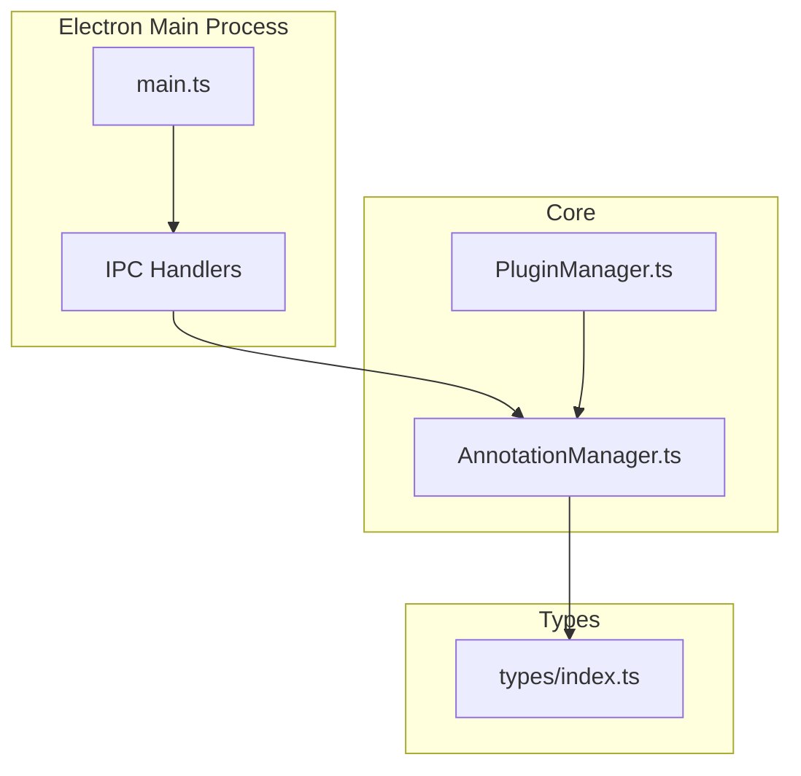
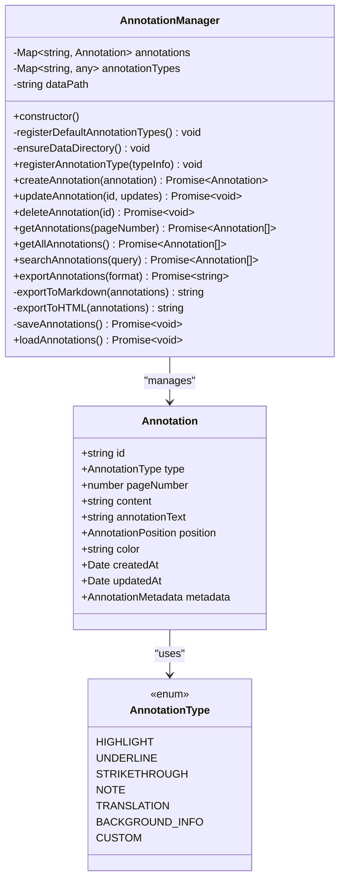
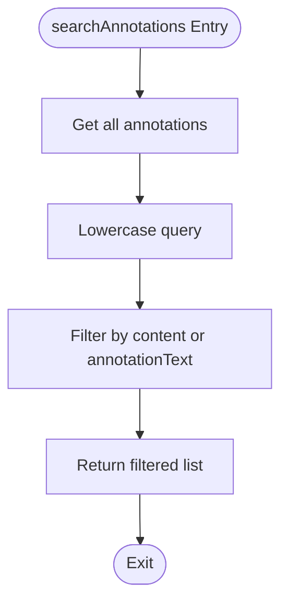
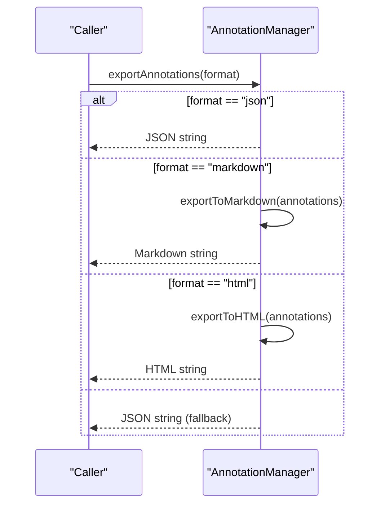
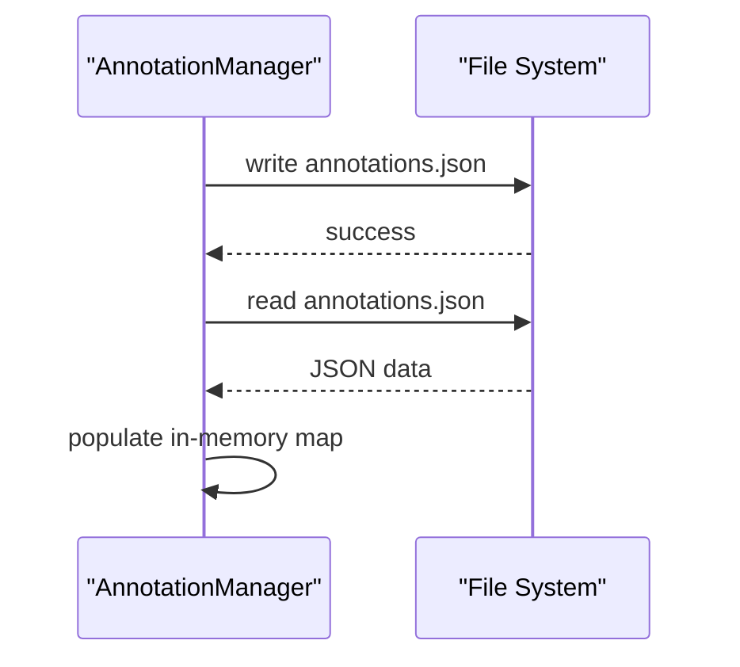
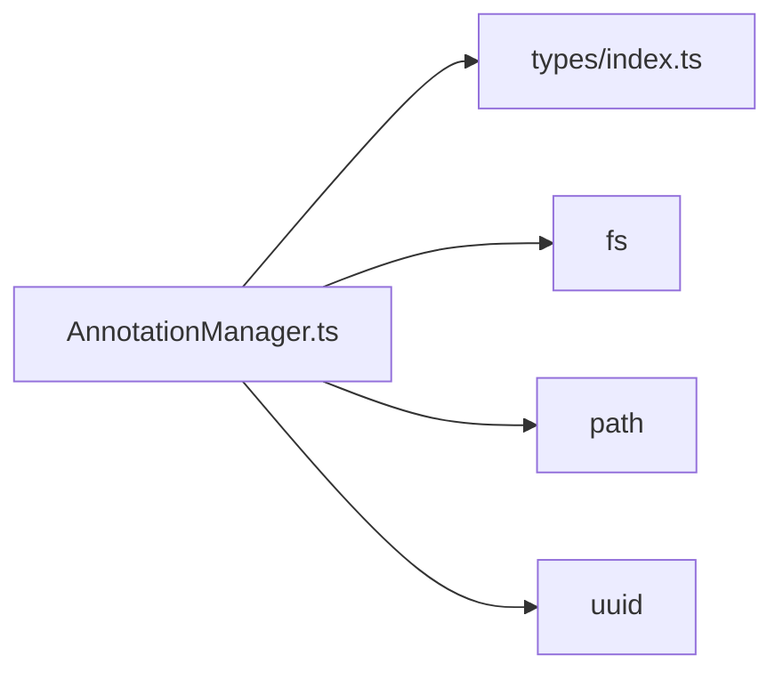

# Annotation Manager

<cite>
**Referenced Files in This Document**
- [AnnotationManager.ts](file://src/core/AnnotationManager.ts)
- [index.ts](file://src/types/index.ts)
- [main.ts](file://src/main.ts)
- [PluginManager.ts](file://src/core/PluginManager.ts)
- [README.md](file://README.md)
</cite>

## Table of Contents
1. [Introduction](#introduction)
2. [Project Structure](#project-structure)
3. [Core Components](#core-components)
4. [Architecture Overview](#architecture-overview)
5. [Detailed Component Analysis](#detailed-component-analysis)
6. [Dependency Analysis](#dependency-analysis)
7. [Performance Considerations](#performance-considerations)
8. [Troubleshooting Guide](#troubleshooting-guide)
9. [Conclusion](#conclusion)
10. [Appendices](#appendices)

## Introduction
This document provides comprehensive technical documentation for the Annotation Manager component. It explains the annotation data model, CRUD operations, search and export capabilities, persistence layer, annotation type registration, and integration points with the broader application. Practical examples are included to illustrate real-world usage patterns derived from the codebase.

## Project Structure
The Annotation Manager resides in the core module alongside other system components. It integrates with the Electron main process via IPC handlers and exposes an API surface to plugins through the Plugin Manager.

**Diagram sources**
- [main.ts:13-60](file://src/main.ts#L13-L60)
- [AnnotationManager.ts:1-172](file://src/core/AnnotationManager.ts#L1-L172)
- [PluginManager.ts:200-211](file://src/core/PluginManager.ts#L200-L211)
- [index.ts:1-224](file://src/types/index.ts#L1-L224)

**Section sources**
- [main.ts:13-60](file://src/main.ts#L13-L60)
- [README.md:13-29](file://README.md#L13-L29)

## Core Components
This section documents the primary data structures and enums used by the Annotation Manager.

- AnnotationType enum defines supported annotation categories.
- Annotation interface describes the complete annotation record structure.
- Supporting interfaces include AnnotationPosition, TextOffset, and AnnotationMetadata.

Key characteristics:
- Immutable identifiers: each annotation has a unique id generated at creation time.
- Timestamps: createdAt and updatedAt track lifecycle of annotations.
- Rich metadata: optional fields enable extensibility for AI-assisted annotations and custom attributes.
- Positional data: supports precise text selection geometry for rendering highlights and overlays.

**Section sources**
- [index.ts:3-11](file://src/types/index.ts#L3-L11)
- [index.ts:36-47](file://src/types/index.ts#L36-L47)
- [index.ts:13-26](file://src/types/index.ts#L13-L26)
- [index.ts:28-34](file://src/types/index.ts#L28-L34)

## Architecture Overview
The Annotation Manager orchestrates in-memory storage, persistence, and export operations. It exposes a plugin-facing API and integrates with Electron’s main process via IPC.

**Diagram sources**
- [AnnotationManager.ts:6-171](file://src/core/AnnotationManager.ts#L6-L171)
- [index.ts:3-11](file://src/types/index.ts#L3-L11)
- [index.ts:36-47](file://src/types/index.ts#L36-L47)

## Detailed Component Analysis

### Data Model and Types
- AnnotationType enum enumerates built-in annotation categories and a custom category for extensibility.
- Annotation interface encapsulates:
  - Identity and timestamps
  - Content and optional note text
  - Position geometry and optional color
  - Metadata for AI tasks and custom attributes
- Supporting structures:
  - AnnotationPosition: rectangle bounds and optional text offsets
  - TextOffset: character-level positioning for precise rendering
  - AnnotationMetadata: flexible key-value pairs for provenance and AI metadata

Validation and constraints:
- All fields except optional note text, color, and metadata are required at creation.
- Position geometry is essential for rendering highlights and overlays.

**Section sources**
- [index.ts:3-11](file://src/types/index.ts#L3-L11)
- [index.ts:13-26](file://src/types/index.ts#L13-L26)
- [index.ts:28-34](file://src/types/index.ts#L28-L34)
- [index.ts:36-47](file://src/types/index.ts#L36-L47)

### CRUD Operations

#### createAnnotation()
- Purpose: Creates a new annotation with a unique id and timestamps.
- Parameters:
  - annotation: Partial of Annotation excluding id, createdAt, updatedAt.
- Behavior:
  - Generates a UUID for id.
  - Sets createdAt and updatedAt to the current time.
  - Stores in memory and persists immediately.
- Return: The newly created Annotation.
- Side effects: Triggers immediate save to disk.

Method signature reference:
- [createAnnotation:46-59](file://src/core/AnnotationManager.ts#L46-L59)

**Section sources**
- [AnnotationManager.ts:46-59](file://src/core/AnnotationManager.ts#L46-L59)

#### updateAnnotation()
- Purpose: Updates an existing annotation by id.
- Parameters:
  - id: string identifier.
  - updates: Partial<Annotation> containing fields to modify.
- Behavior:
  - Throws if the annotation does not exist.
  - Merges updates and sets updatedAt to current time.
  - Persists immediately.
- Return: void.
- Error handling: Throws when id is not found.

Method signature reference:
- [updateAnnotation:61-70](file://src/core/AnnotationManager.ts#L61-L70)

**Section sources**
- [AnnotationManager.ts:61-70](file://src/core/AnnotationManager.ts#L61-L70)

#### deleteAnnotation()
- Purpose: Removes an annotation by id.
- Parameters:
  - id: string identifier.
- Behavior:
  - Deletes from memory and persists immediately.
- Return: void.

Method signature reference:
- [deleteAnnotation:72-75](file://src/core/AnnotationManager.ts#L72-L75)

**Section sources**
- [AnnotationManager.ts:72-75](file://src/core/AnnotationManager.ts#L72-L75)

#### getAnnotations()
- Purpose: Retrieves annotations for a given page number.
- Parameters:
  - pageNumber: number.
- Behavior:
  - Filters all annotations by pageNumber.
- Return: Annotation[].

Method signature reference:
- [getAnnotations:77-84](file://src/core/AnnotationManager.ts#L77-L84)

**Section sources**
- [AnnotationManager.ts:77-84](file://src/core/AnnotationManager.ts#L77-L84)

#### getAllAnnotations()
- Purpose: Retrieves all annotations regardless of page.
- Parameters: None.
- Return: Annotation[].

Method signature reference:
- [getAllAnnotations:82-84](file://src/core/AnnotationManager.ts#L82-L84)

**Section sources**
- [AnnotationManager.ts:82-84](file://src/core/AnnotationManager.ts#L82-L84)

### Search Functionality
- Method: searchAnnotations(query)
- Parameters:
  - query: string to match against content and optional annotationText.
- Behavior:
  - Converts query to lowercase for case-insensitive matching.
  - Filters annotations where either content or annotationText contains the query.
- Return: Annotation[].
- Notes:
  - Matching is performed on the entire collection; consider pagination or indexing for large datasets.

Method signature reference:
- [searchAnnotations:86-94](file://src/core/AnnotationManager.ts#L86-L94)

**Diagram sources**
- [AnnotationManager.ts:86-94](file://src/core/AnnotationManager.ts#L86-L94)

**Section sources**
- [AnnotationManager.ts:86-94](file://src/core/AnnotationManager.ts#L86-L94)

### Export Capabilities
- Method: exportAnnotations(format)
- Parameters:
  - format: 'json' | 'markdown' | 'html'.
- Behavior:
  - Serializes all annotations to the selected format.
  - Defaults to JSON if format is not recognized.
- Formats:
  - JSON: Uses JSON.stringify with indentation.
  - Markdown: Human-readable report with headings, page numbers, and timestamps.
  - HTML: Styled HTML document with colored borders based on annotation color.

Private helpers:
- exportToMarkdown(annotations): Builds a Markdown document with structured entries.
- exportToHTML(annotations): Produces a styled HTML document.

Method signature reference:
- [exportAnnotations:96-112](file://src/core/AnnotationManager.ts#L96-L112)
- [exportToMarkdown:114-130](file://src/core/AnnotationManager.ts#L114-L130)
- [exportToHTML:132-151](file://src/core/AnnotationManager.ts#L132-L151)

**Diagram sources**
- [AnnotationManager.ts:96-112](file://src/core/AnnotationManager.ts#L96-L112)
- [AnnotationManager.ts:114-151](file://src/core/AnnotationManager.ts#L114-L151)

**Section sources**
- [AnnotationManager.ts:96-151](file://src/core/AnnotationManager.ts#L96-L151)

### Persistence Layer
- Data directory:
  - Resolved from APPDATA/HOME or defaults to current directory.
  - Path: ~/.scipdfreader/annotations on Unix-like systems; %APPDATA%\.scipdfreader\annotations on Windows.
- File:
  - annotations.json stores serialized annotations.
- Methods:
  - saveAnnotations(): Writes current in-memory state to disk.
  - loadAnnotations(): Reads annotations.json and populates in-memory map.

Method signature reference:
- [saveAnnotations:153-157](file://src/core/AnnotationManager.ts#L153-L157)
- [loadAnnotations:159-170](file://src/core/AnnotationManager.ts#L159-L170)

**Diagram sources**
- [AnnotationManager.ts:153-170](file://src/core/AnnotationManager.ts#L153-L170)

**Section sources**
- [AnnotationManager.ts:153-170](file://src/core/AnnotationManager.ts#L153-L170)

### Annotation Type Registration System
- Default types:
  - HIGHLIGHT, UNDERLINE, STRIKETHROUGH, NOTE, TRANSLATION, BACKGROUND_INFO.
- Registration:
  - registerAnnotationType(typeInfo): Adds a new annotation type definition.
  - registerDefaultAnnotationTypes(): Initializes built-in types during construction.
- Type definition shape:
  - type: string identifier
  - label: human-readable label
  - color: optional hex color
  - icon: optional emoji or icon

Method signature reference:
- [registerAnnotationType:42-44](file://src/core/AnnotationManager.ts#L42-L44)
- [registerDefaultAnnotationTypes:21-34](file://src/core/AnnotationManager.ts#L21-L34)

**Section sources**
- [AnnotationManager.ts:21-44](file://src/core/AnnotationManager.ts#L21-L44)
- [index.ts:105-110](file://src/types/index.ts#L105-L110)

### Integration with Application and Plugins
- Electron main process:
  - Initializes AnnotationManager and exposes IPC handlers for saving annotations and retrieving them by page.
- Plugin API:
  - PluginManager creates an annotation API wrapper exposing createAnnotation, updateAnnotation, deleteAnnotation, getAnnotations, searchAnnotations, and exportAnnotations.

Method signature reference:
- [main.ts:45-60](file://src/main.ts#L45-L60)
- [main.ts:123-135](file://src/main.ts#L123-L135)
- [PluginManager.ts:202-211](file://src/core/PluginManager.ts#L202-L211)

**Section sources**
- [main.ts:45-60](file://src/main.ts#L45-L60)
- [main.ts:123-135](file://src/main.ts#L123-L135)
- [PluginManager.ts:202-211](file://src/core/PluginManager.ts#L202-L211)

### Practical Examples from the Codebase
- Creating an annotation via plugin command:
  - Example demonstrates registering a command that executes an AI task and then creates a translation annotation.
  - Reference: [README.md:75-104](file://README.md#L75-L104)
- Saving annotations via IPC:
  - Renderer process triggers save via IPC handler.
  - Reference: [main.ts:123-128](file://src/main.ts#L123-L128)
- Retrieving annotations by page:
  - Renderer process requests annotations for a specific page.
  - Reference: [main.ts:130-135](file://src/main.ts#L130-L135)

**Section sources**
- [README.md:75-104](file://README.md#L75-L104)
- [main.ts:123-128](file://src/main.ts#L123-L128)
- [main.ts:130-135](file://src/main.ts#L130-L135)

## Dependency Analysis
The Annotation Manager depends on:
- Types module for type definitions.
- Node.js fs and path for file system operations.
- uuid for generating unique identifiers.

**Diagram sources**
- [AnnotationManager.ts:1-4](file://src/core/AnnotationManager.ts#L1-L4)
- [index.ts:1-224](file://src/types/index.ts#L1-L224)

**Section sources**
- [AnnotationManager.ts:1-4](file://src/core/AnnotationManager.ts#L1-L4)

## Performance Considerations
- In-memory storage:
  - Annotations are stored in a Map for O(1) average-time insertions and lookups.
  - Filtering by page number is O(n) over all annotations; consider indexing by pageNumber for large datasets.
- Search:
  - Current implementation performs linear scan over all annotations; case-insensitive substring matching.
  - For large datasets, consider precomputing lowercased indices or using a search index library.
- Persistence:
  - Each write operation triggers a synchronous file write; consider batching writes or debouncing saves to reduce I/O overhead.
- Rendering:
  - Position geometry is used for highlighting; ensure positions are computed efficiently upstream to avoid rework.

[No sources needed since this section provides general guidance]

## Troubleshooting Guide
Common issues and resolutions:
- Annotation not found when updating:
  - Symptom: updateAnnotation throws an error indicating the annotation was not found.
  - Cause: Attempting to update a non-existent id.
  - Resolution: Verify id validity and ensure annotations are loaded before updates.
  - Reference: [AnnotationManager.ts:61-70](file://src/core/AnnotationManager.ts#L61-L70)
- Export format fallback:
  - Symptom: Unexpected JSON output when requesting markdown or HTML.
  - Cause: Unrecognized format string passed to exportAnnotations.
  - Resolution: Ensure format is one of 'json' | 'markdown' | 'html'.
  - Reference: [AnnotationManager.ts:96-112](file://src/core/AnnotationManager.ts#L96-L112)
- Persistence failures:
  - Symptom: Annotations not saved or lost after restart.
  - Causes: Permission errors, missing data directory, or file corruption.
  - Resolution: Verify data directory existence and permissions; check annotations.json readability.
  - References:
    - [AnnotationManager.ts:153-170](file://src/core/AnnotationManager.ts#L153-L170)
    - [AnnotationManager.ts:36-40](file://src/core/AnnotationManager.ts#L36-L40)

**Section sources**
- [AnnotationManager.ts:61-70](file://src/core/AnnotationManager.ts#L61-L70)
- [AnnotationManager.ts:96-112](file://src/core/AnnotationManager.ts#L96-L112)
- [AnnotationManager.ts:153-170](file://src/core/AnnotationManager.ts#L153-L170)
- [AnnotationManager.ts:36-40](file://src/core/AnnotationManager.ts#L36-L40)

## Conclusion
The Annotation Manager provides a robust foundation for managing annotations with strong typing, extensible annotation types, and straightforward persistence and export mechanisms. While the current implementation prioritizes simplicity and clarity, performance improvements can be introduced through indexing, batching, and asynchronous I/O for large-scale usage.

[No sources needed since this section summarizes without analyzing specific files]

## Appendices

### API Surface Summary
- AnnotationManager methods:
  - createAnnotation, updateAnnotation, deleteAnnotation, getAnnotations, getAllAnnotations, searchAnnotations, exportAnnotations, registerAnnotationType, loadAnnotations, saveAnnotations.
- Plugin API exposure:
  - PluginManager wraps AnnotationManager methods for plugin consumption.

**Section sources**
- [AnnotationManager.ts:46-171](file://src/core/AnnotationManager.ts#L46-L171)
- [PluginManager.ts:202-211](file://src/core/PluginManager.ts#L202-L211)