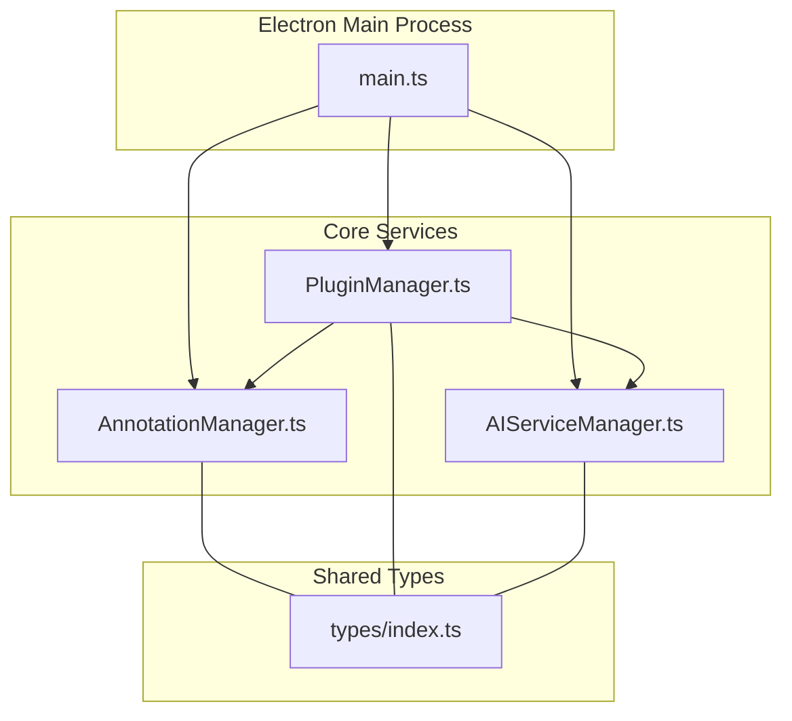
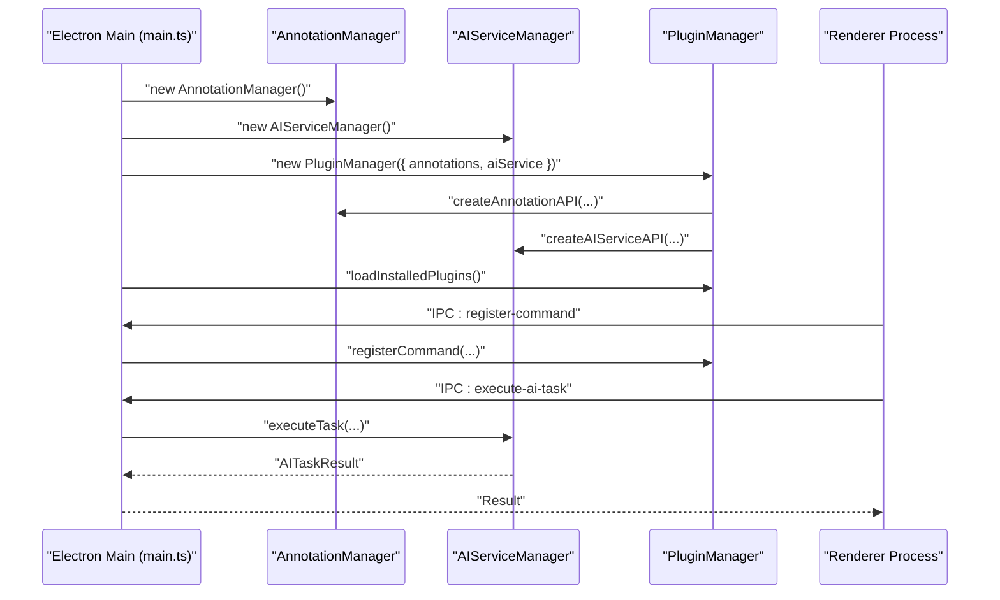
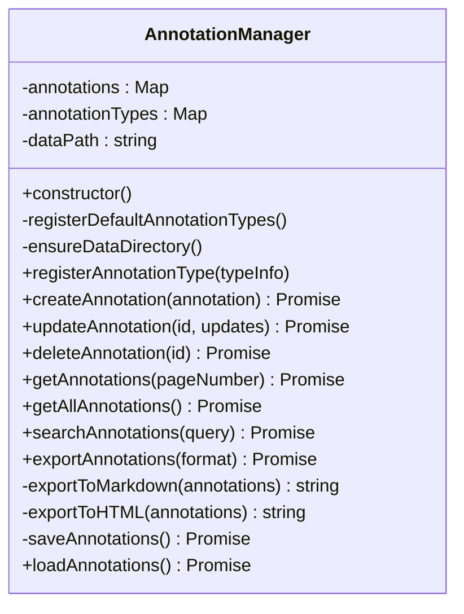
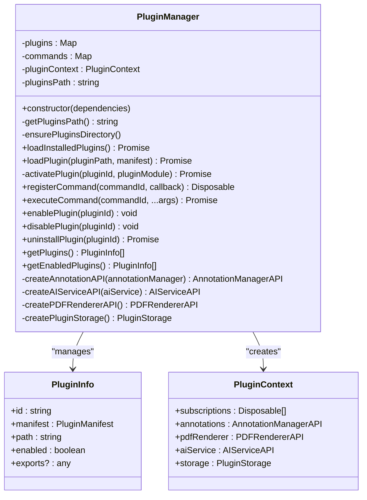
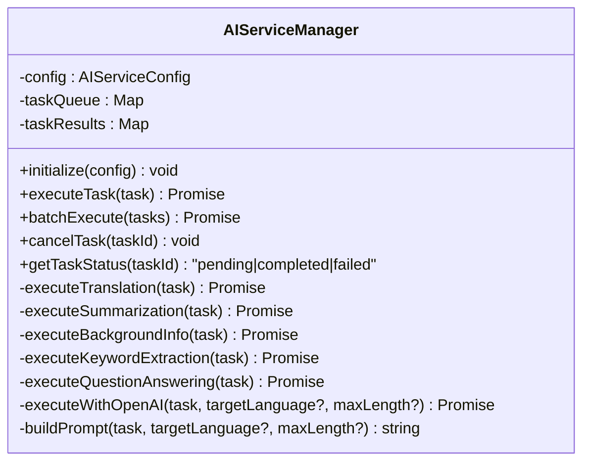
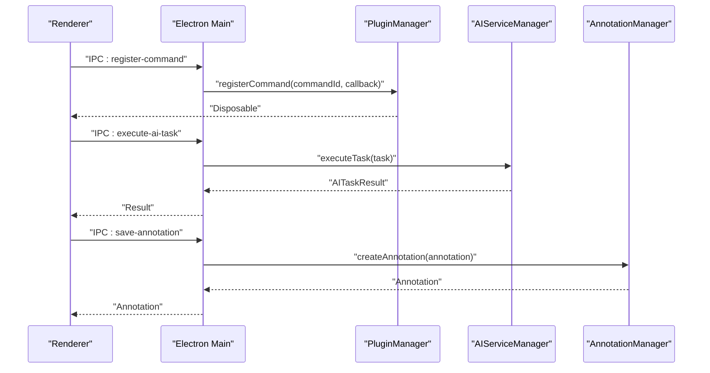
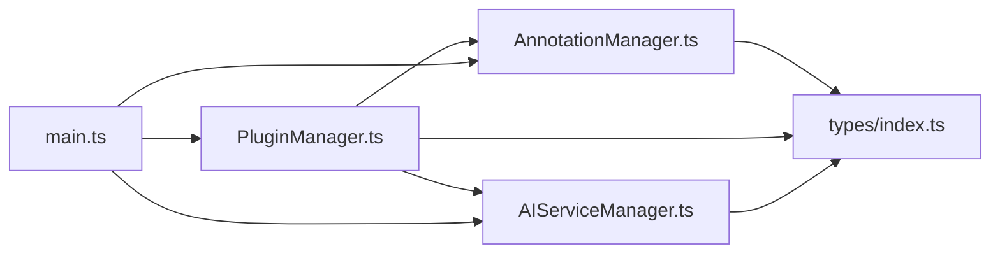

# Core Components

<cite>
**Referenced Files in This Document**
- [AnnotationManager.ts](file://src/core/AnnotationManager.ts)
- [PluginManager.ts](file://src/core/PluginManager.ts)
- [AIServiceManager.ts](file://src/core/AIServiceManager.ts)
- [index.ts](file://src/types/index.ts)
- [main.ts](file://src/main.ts)
- [README.md](file://README.md)
- [PLUGIN-GUIDE.md](file://PLUGIN-GUIDE.md)
</cite>

## Table of Contents
1. [Introduction](#introduction)
2. [Project Structure](#project-structure)
3. [Core Components](#core-components)
4. [Architecture Overview](#architecture-overview)
5. [Detailed Component Analysis](#detailed-component-analysis)
6. [Dependency Analysis](#dependency-analysis)
7. [Performance Considerations](#performance-considerations)
8. [Troubleshooting Guide](#troubleshooting-guide)
9. [Conclusion](#conclusion)
10. [Appendices](#appendices)

## Introduction
This document focuses on the three core service managers that form the backbone of SciPDFReader:
- AnnotationManager: Handles annotation persistence, CRUD operations, search, and export.
- PluginManager: Manages plugin lifecycle, exposes APIs to plugins, registers commands, and enforces security boundaries.
- AIServiceManager: Coordinates AI service integrations, executes tasks, abstracts providers, and handles errors.

It explains implementation details, public interfaces, method signatures, parameter specifications, configuration options, initialization patterns, dependency injection, integration scenarios, and troubleshooting approaches. The content is designed to be accessible to beginners while providing sufficient technical depth for developers extending or modifying these services.

## Project Structure
The core services live under src/core and share type definitions in src/types. The Electron main process initializes and wires these managers together, exposing IPC handlers for the renderer process.

**Diagram sources**
- [main.ts:44-59](file://src/main.ts#L44-L59)
- [AnnotationManager.ts:6-19](file://src/core/AnnotationManager.ts#L6-L19)
- [PluginManager.ts:15-35](file://src/core/PluginManager.ts#L15-L35)
- [AIServiceManager.ts:3-11](file://src/core/AIServiceManager.ts#L3-L11)
- [index.ts:1-224](file://src/types/index.ts#L1-L224)

**Section sources**
- [main.ts:12-59](file://src/main.ts#L12-L59)
- [README.md:13-29](file://README.md#L13-L29)

## Core Components
This section introduces each core manager’s responsibilities and how they fit into the system.

- AnnotationManager
  - Purpose: Centralized annotation storage, CRUD operations, search, and export.
  - Persistence: Stores annotations locally in a JSON file under a user-specific directory.
  - Public surface: Creation, update, deletion, retrieval by page, full listing, search, and export to JSON, Markdown, HTML.
  - Initialization: Constructs default annotation types and sets up a persistent data directory.

- PluginManager
  - Purpose: Loads, activates, and manages plugins; exposes a controlled API surface to plugins; registers and executes commands; enables lifecycle control (enable/disable/uninstall).
  - Security: Uses a PluginContext with explicit APIs (annotations, aiService, storage) and subscription-based resource management.
  - Lifecycle: Discovers plugins from a user directory, loads their main module, and activates on startup or demand.
  - Integration: Provides thin wrappers around AnnotationManager and AIServiceManager for plugins.

- AIServiceManager
  - Purpose: Orchestrates AI tasks (translation, summarization, background info, keyword extraction, question answering) with provider abstraction.
  - Execution: Queues tasks, routes to provider-specific handlers, and stores results.
  - Provider abstraction: Supports OpenAI/Azure and falls back to local/mock implementations.
  - Error handling: Propagates errors from task execution and maintains queue cleanup.

**Section sources**
- [AnnotationManager.ts:6-172](file://src/core/AnnotationManager.ts#L6-L172)
- [PluginManager.ts:15-247](file://src/core/PluginManager.ts#L15-L247)
- [AIServiceManager.ts:3-214](file://src/core/AIServiceManager.ts#L3-L214)
- [index.ts:36-84](file://src/types/index.ts#L36-L84)
- [index.ts:148-171](file://src/types/index.ts#L148-L171)

## Architecture Overview
The managers are initialized in the Electron main process and exposed to the renderer via IPC handlers. PluginManager composes AnnotationManager and AIServiceManager into a PluginContext for plugin activation.

**Diagram sources**
- [main.ts:44-59](file://src/main.ts#L44-L59)
- [PluginManager.ts:200-220](file://src/core/PluginManager.ts#L200-L220)
- [AIServiceManager.ts:13-56](file://src/core/AIServiceManager.ts#L13-L56)

## Detailed Component Analysis

### AnnotationManager
Responsibilities:
- Manage in-memory and persisted annotations.
- Provide CRUD operations and search.
- Export annotations to multiple formats.
- Initialize default annotation types and ensure data directory exists.

Public interface and method signatures:
- Constructor: Initializes defaults and data path.
- registerAnnotationType(typeInfo): Adds a custom annotation type.
- createAnnotation(annotation): Creates a new annotation with ID and timestamps.
- updateAnnotation(id, updates): Updates an existing annotation and persists changes.
- deleteAnnotation(id): Removes an annotation and persists.
- getAnnotations(pageNumber): Retrieves annotations for a given page.
- getAllAnnotations(): Retrieves all annotations.
- searchAnnotations(query): Searches content and annotationText.
- exportAnnotations(format): Exports to JSON, Markdown, or HTML.
- loadAnnotations(): Loads persisted annotations on startup.

Implementation details:
- Uses UUIDs for IDs and Date for timestamps.
- Persists to a JSON file under a user-specific directory.
- Default annotation types include highlight, underline, strikethrough, note, translation, and background info.

Parameter specifications:
- Annotation: id, type, pageNumber, content, annotationText?, position, color?, createdAt, updatedAt, metadata?
- AnnotationType: Enum values for built-in types.
- Export format: 'json' | 'markdown' | 'html'.

Practical examples:
- Renderer invokes IPC to save an annotation; main.ts delegates to AnnotationManager.
- PluginManager exposes annotation APIs to plugins via PluginContext.

Common integration scenarios:
- Creating a translation annotation after an AI translation task.
- Exporting annotations for backup or sharing.

Initialization and persistence:
- Data path derived from APPDATA/HOME; ensures directory exists.
- On load, reads annotations.json and populates memory map.

Security considerations:
- File system access is scoped to the user data directory.
- No external network calls; safe to run in sandboxed environments.

**Section sources**
- [AnnotationManager.ts:6-172](file://src/core/AnnotationManager.ts#L6-L172)
- [main.ts:85-97](file://src/main.ts#L85-L97)
- [PluginManager.ts:202-211](file://src/core/PluginManager.ts#L202-L211)
- [index.ts:36-47](file://src/types/index.ts#L36-L47)

#### Class Diagram

**Diagram sources**
- [AnnotationManager.ts:6-172](file://src/core/AnnotationManager.ts#L6-L172)
- [index.ts:36-47](file://src/types/index.ts#L36-L47)

### PluginManager
Responsibilities:
- Discover and load plugins from a user directory.
- Create a PluginContext exposing controlled APIs to plugins.
- Register and execute commands.
- Enable/disable/uninstall plugins and manage subscriptions.

Public interface and method signatures:
- Constructor(dependencies): Requires AnnotationManager and AIServiceManager.
- loadInstalledPlugins(): Scans plugin directory and loads manifests.
- loadPlugin(pluginPath, manifest): Loads and activates a plugin module.
- registerCommand(commandId, callback): Registers a command with disposal support.
- executeCommand(commandId, ...args): Executes a registered command.
- enablePlugin(pluginId): Re-activates a plugin.
- disablePlugin(pluginId): Deactivates and disposes subscriptions.
- uninstallPlugin(pluginId): Disables and removes plugin directory.
- getPlugins(): Lists all plugins.
- getEnabledPlugins(): Filters enabled plugins.

API exposure to plugins:
- annotations: Thin wrapper around AnnotationManager methods.
- aiService: Thin wrapper around AIServiceManager methods.
- pdfRenderer: Placeholder API for PDF operations.
- storage: Placeholder plugin storage.

Lifecycle management:
- Activation events: Supports '*' and 'onStartupFinished'.
- Deactivation: Calls exports.deactivate() if present.

Security considerations:
- Plugins receive a restricted PluginContext with explicit APIs.
- Subscriptions are tracked for proper cleanup.
- Uses require() to load plugin main module; ensure trusted plugin sources.

Practical examples:
- Renderer registers commands via IPC; main.ts delegates to PluginManager.
- Plugins use aiService.initialize() and executeTask() to perform AI operations.
- Plugins use annotations API to persist results.

Initialization patterns:
- Constructed with dependency injection of AnnotationManager and AIServiceManager.
- Ensures plugin directory exists during construction.

**Section sources**
- [PluginManager.ts:15-247](file://src/core/PluginManager.ts#L15-L247)
- [main.ts:52-58](file://src/main.ts#L52-L58)
- [PLUGIN-GUIDE.md:104-140](file://PLUGIN-GUIDE.md#L104-L140)

#### Class Diagram

**Diagram sources**
- [PluginManager.ts:15-247](file://src/core/PluginManager.ts#L15-L247)
- [index.ts:136-142](file://src/types/index.ts#L136-L142)

### AIServiceManager
Responsibilities:
- Configure AI provider and model.
- Execute tasks with provider abstraction.
- Batch execute tasks and cancel pending tasks.
- Track task status and results.

Public interface and method signatures:
- initialize(config): Sets provider configuration.
- executeTask(task): Enqueues and executes a single task.
- batchExecute(tasks): Executes multiple tasks with partial failure reporting.
- cancelTask(taskId): Cancels a pending task.
- getTaskStatus(taskId): Reports pending/completed/failed.

Task execution patterns:
- Routes tasks by type to provider-specific handlers.
- Supports OpenAI/Azure and falls back to local/mock implementations.
- Maintains internal queues for pending tasks and results.

Provider abstraction:
- Provider options: openai, azure, local, custom.
- Prompt building based on task type and options.

Error handling strategies:
- Throws when uninitialized.
- Cleans up task queue on failures.
- batchExecute collects errors per task and continues.

Practical examples:
- Plugins call aiService.initialize() and executeTask() to perform translations, summarizations, background info, keyword extraction, and question answering.
- Renderer invokes IPC to execute AI tasks; main.ts delegates to AIServiceManager.

Configuration options:
- provider: 'openai' | 'azure' | 'local' | 'custom'
- apiKey: optional
- endpoint: optional
- model: optional
- temperature: optional

**Section sources**
- [AIServiceManager.ts:3-214](file://src/core/AIServiceManager.ts#L3-L214)
- [index.ts:49-55](file://src/types/index.ts#L49-L55)
- [index.ts:65-84](file://src/types/index.ts#L65-L84)
- [PLUGIN-GUIDE.md:182-214](file://PLUGIN-GUIDE.md#L182-L214)

#### Class Diagram

**Diagram sources**
- [AIServiceManager.ts:3-214](file://src/core/AIServiceManager.ts#L3-L214)
- [index.ts:49-84](file://src/types/index.ts#L49-L84)

### Integration Scenarios and Examples
- Renderer-to-Manager flows:
  - Save annotation: Renderer -> IPC handler -> AnnotationManager.createAnnotation.
  - Execute AI task: Renderer -> IPC handler -> AIServiceManager.executeTask.
  - Register command: Renderer -> IPC handler -> PluginManager.registerCommand.
- Plugin-to-Manager flows:
  - Plugin activation receives PluginContext with aiService and annotations APIs.
  - Plugin performs AI tasks and creates annotations using exposed APIs.

**Diagram sources**
- [main.ts:85-117](file://src/main.ts#L85-L117)
- [PluginManager.ts:120-142](file://src/core/PluginManager.ts#L120-L142)
- [AIServiceManager.ts:13-56](file://src/core/AIServiceManager.ts#L13-L56)
- [AnnotationManager.ts:46-59](file://src/core/AnnotationManager.ts#L46-L59)

## Dependency Analysis
- AnnotationManager depends on:
  - File system for persistence.
  - UUID generator for IDs.
  - Types for Annotation and AnnotationType.
- PluginManager depends on:
  - AnnotationManager and AIServiceManager via constructor injection.
  - File system for plugin discovery and loading.
  - Types for PluginManifest and PluginContext.
- AIServiceManager depends on:
  - Types for AIServiceConfig, AITask, AITaskResult, and AITaskType.
  - Provider abstraction for OpenAI/Azure/local/custom.

**Diagram sources**
- [AnnotationManager.ts:1-5](file://src/core/AnnotationManager.ts#L1-L5)
- [PluginManager.ts:1-6](file://src/core/PluginManager.ts#L1-L6)
- [AIServiceManager.ts:1-2](file://src/core/AIServiceManager.ts#L1-L2)
- [main.ts:3-5](file://src/main.ts#L3-L5)
- [index.ts:1-224](file://src/types/index.ts#L1-L224)

**Section sources**
- [AnnotationManager.ts:1-5](file://src/core/AnnotationManager.ts#L1-L5)
- [PluginManager.ts:1-6](file://src/core/PluginManager.ts#L1-L6)
- [AIServiceManager.ts:1-2](file://src/core/AIServiceManager.ts#L1-L2)
- [main.ts:3-5](file://src/main.ts#L3-L5)

## Performance Considerations
- AnnotationManager:
  - In-memory map for O(1) lookups; search filters across all annotations.
  - Persisting on every write operation; consider batching writes for high-frequency updates.
- PluginManager:
  - File system scanning on load; cache plugin metadata if frequent reloads occur.
  - Command execution is synchronous; keep callbacks lightweight.
- AIServiceManager:
  - Single-threaded task execution; consider concurrency limits if many tasks arrive rapidly.
  - Provider fallback avoids network overhead; production deployments should integrate real providers.

[No sources needed since this section provides general guidance]

## Troubleshooting Guide
- AnnotationManager
  - Symptom: Annotations not saved across sessions.
    - Verify data directory exists and is writable under user profile.
    - Confirm loadAnnotations is invoked during initialization.
  - Symptom: Update fails with “not found”.
    - Ensure the ID exists and is passed correctly.
  - Symptom: Export returns unexpected format.
    - Confirm format parameter is one of supported values.

- PluginManager
  - Symptom: Plugin fails to load.
    - Check manifest presence and correctness; verify main module path.
    - Review activation events and ensure conditions match.
  - Symptom: Command not found.
    - Ensure registerCommand was called and the commandId matches.
  - Symptom: Plugin cannot call aiService or annotations.
    - Verify PluginContext was constructed with required dependencies.

- AIServiceManager
  - Symptom: “Not initialized” error.
    - Ensure initialize() is called with a valid AIServiceConfig before executeTask().
  - Symptom: Unknown task type error.
    - Verify AITaskType is one of supported values.
  - Symptom: Batch execution returns partial failures.
    - Inspect individual task metadata for error details.

**Section sources**
- [AnnotationManager.ts:61-70](file://src/core/AnnotationManager.ts#L61-L70)
- [AnnotationManager.ts:159-170](file://src/core/AnnotationManager.ts#L159-L170)
- [PluginManager.ts:71-104](file://src/core/PluginManager.ts#L71-L104)
- [PluginManager.ts:134-142](file://src/core/PluginManager.ts#L134-L142)
- [AIServiceManager.ts:8-11](file://src/core/AIServiceManager.ts#L8-L11)
- [AIServiceManager.ts:44-46](file://src/core/AIServiceManager.ts#L44-L46)
- [AIServiceManager.ts:65-74](file://src/core/AIServiceManager.ts#L65-L74)

## Conclusion
The three core managers—AnnotationManager, PluginManager, and AIServiceManager—provide a robust foundation for SciPDFReader:
- AnnotationManager offers reliable persistence and flexible export.
- PluginManager delivers a secure, extensible plugin ecosystem with clear lifecycles.
- AIServiceManager abstracts provider differences and encapsulates error handling.

Together, they enable powerful AI-assisted annotation workflows and a thriving plugin community, while maintaining a clean separation of concerns and predictable initialization patterns.

[No sources needed since this section summarizes without analyzing specific files]

## Appendices

### Configuration Options
- AnnotationManager
  - Data directory: Derived from APPDATA/HOME; stored under a .scipdfreader subfolder.
- AIServiceManager
  - AIServiceConfig: provider, apiKey, endpoint, model, temperature.
- PluginManager
  - Plugins directory: Derived from APPDATA/HOME; stored under a .scipdfreader/plugins subfolder.

**Section sources**
- [AnnotationManager.ts:16-18](file://src/core/AnnotationManager.ts#L16-L18)
- [AIServiceManager.ts:8-11](file://src/core/AIServiceManager.ts#L8-L11)
- [PluginManager.ts:37-40](file://src/core/PluginManager.ts#L37-L40)
- [README.md:122-139](file://README.md#L122-L139)

### Initialization Patterns and Dependency Injection
- Electron main process constructs managers and injects dependencies into PluginManager.
- AnnotationManager and AIServiceManager are instantiated independently and passed to PluginManager.
- PluginManager ensures plugin directories exist and loads manifests.

**Section sources**
- [main.ts:44-59](file://src/main.ts#L44-L59)
- [PluginManager.ts:21-35](file://src/core/PluginManager.ts#L21-L35)

### IPC Handlers and Usage
- Renderer invokes IPC handlers to:
  - Save annotations via save-annotation.
  - Retrieve annotations via get-annotations.
  - Execute AI tasks via execute-ai-task.
  - Register commands via register-command.
  - Register custom annotation types via register-annotation-type.

**Section sources**
- [main.ts:85-117](file://src/main.ts#L85-L117)