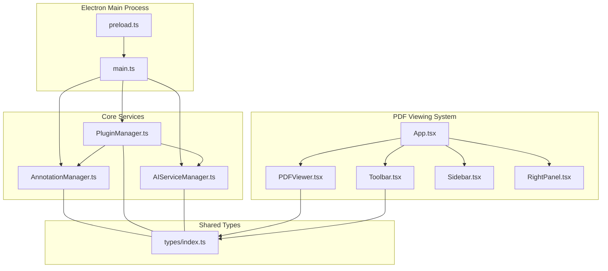
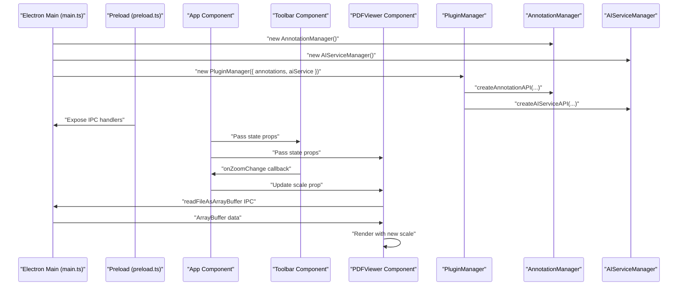
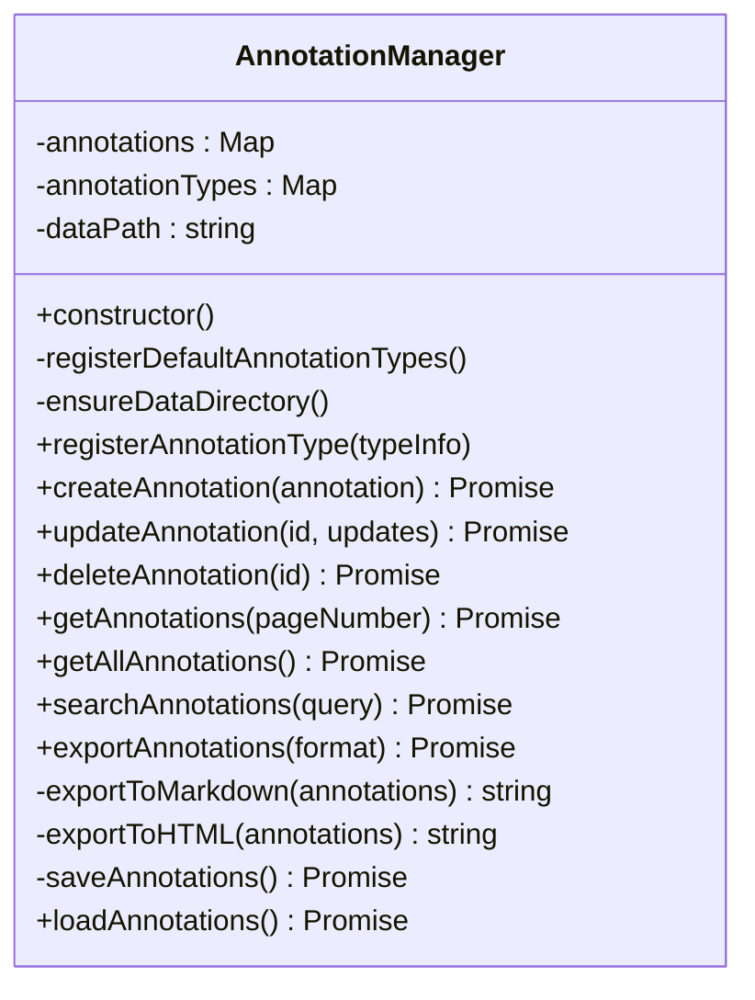
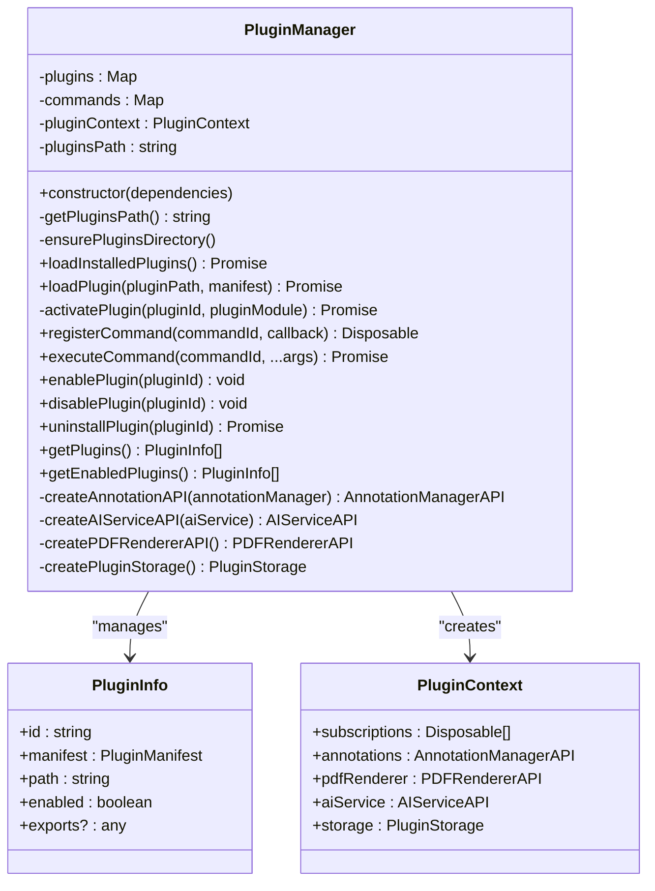
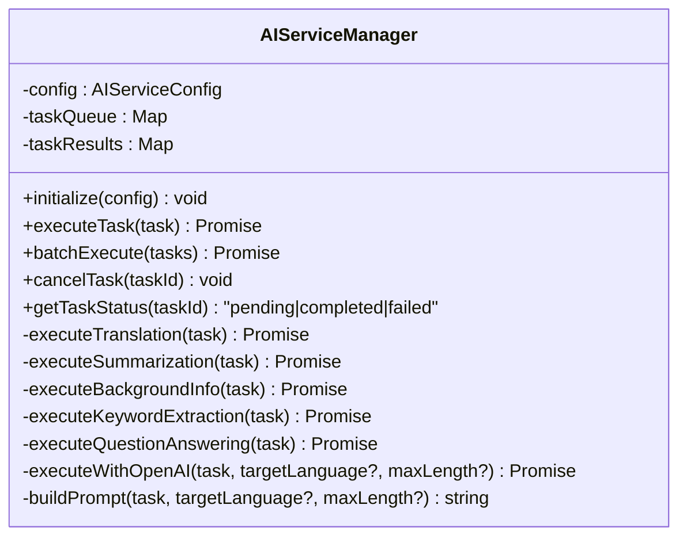
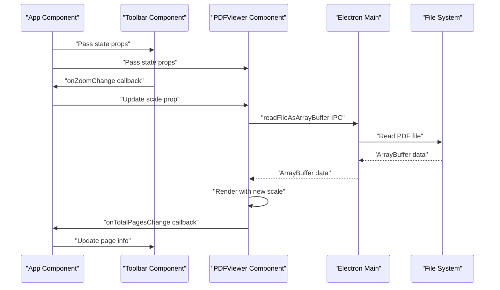
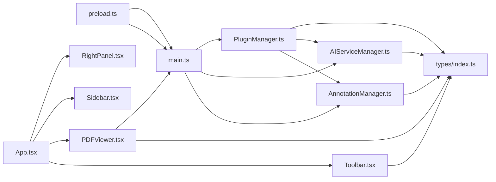

# Core Components

<cite>
**Referenced Files in This Document**
- [AnnotationManager.ts](file://src/core/AnnotationManager.ts)
- [PluginManager.ts](file://src/core/PluginManager.ts)
- [AIServiceManager.ts](file://src/core/AIServiceManager.ts)
- [PDFViewer.tsx](file://src/renderer/components/PDFViewer.tsx)
- [App.tsx](file://src/renderer/App.tsx)
- [Toolbar.tsx](file://src/renderer/components/Toolbar.tsx)
- [Sidebar.tsx](file://src/renderer/components/Sidebar.tsx)
- [RightPanel.tsx](file://src/renderer/components/RightPanel.tsx)
- [main.ts](file://src/main.ts)
- [preload.ts](file://src/preload.ts)
- [index.ts](file://src/types/index.ts)
- [main.css](file://src/renderer/styles/main.css)
- [index.html](file://src/renderer/index.html)
- [renderer.tsx](file://src/renderer/renderer.tsx)
- [README.md](file://README.md)
- [PLUGIN-GUIDE.md](file://PLUGIN-GUIDE.md)
</cite>

## Update Summary
**Changes Made**
- Updated PDF viewer architecture to include comprehensive viewing functionality with zoom controls, page navigation, and scroll modes
- Added detailed documentation for PDFViewer component with zoom (50%-300%), fit-to-width option, and page navigation controls
- Enhanced Toolbar component documentation with zoom controls, page navigation, and scroll mode switching
- Updated App component to demonstrate centralized state management through prop-based communication
- Added new PDFRendererAPI interface for plugin integration with PDF operations
- Enhanced component interaction diagrams to reflect the new PDF viewing architecture

## Table of Contents
1. [Introduction](#introduction)
2. [Project Structure](#project-structure)
3. [Core Components](#core-components)
4. [Architecture Overview](#architecture-overview)
5. [Detailed Component Analysis](#detailed-component-analysis)
6. [PDF Viewing System](#pdf-viewing-system)
7. [Dependency Analysis](#dependency-analysis)
8. [Performance Considerations](#performance-considerations)
9. [Troubleshooting Guide](#troubleshooting-guide)
10. [Conclusion](#conclusion)
11. [Appendices](#appendices)

## Introduction
This document focuses on the three core service managers that form the backbone of SciPDFReader, along with the comprehensive PDF viewing system:
- AnnotationManager: Handles annotation persistence, CRUD operations, search, and export.
- PluginManager: Manages plugin lifecycle, exposes APIs to plugins, registers commands, and enforces security boundaries.
- AIServiceManager: Coordinates AI service integrations, executes tasks, abstracts providers, and handles errors.
- PDFViewer: Provides comprehensive PDF viewing with zoom controls, page navigation, scroll modes, and annotation rendering.

It explains implementation details, public interfaces, method signatures, parameter specifications, configuration options, initialization patterns, dependency injection, integration scenarios, and troubleshooting approaches. The content is designed to be accessible to beginners while providing sufficient technical depth for developers extending or modifying these services.

## Project Structure
The core services live under src/core and share type definitions in src/types. The Electron main process initializes and wires these managers together, exposing IPC handlers for the renderer process. The PDF viewing system consists of React components that communicate through centralized state management.

**Diagram sources**
- [main.ts:1-160](file://src/main.ts#L1-L160)
- [preload.ts:1-35](file://src/preload.ts#L1-L35)
- [AnnotationManager.ts:1-172](file://src/core/AnnotationManager.ts#L1-L172)
- [PluginManager.ts:1-247](file://src/core/PluginManager.ts#L1-L247)
- [AIServiceManager.ts:1-214](file://src/core/AIServiceManager.ts#L1-L214)
- [index.ts:1-224](file://src/types/index.ts#L1-L224)
- [App.tsx:1-249](file://src/renderer/App.tsx#L1-L249)
- [Toolbar.tsx:1-211](file://src/renderer/components/Toolbar.tsx#L1-L211)
- [PDFViewer.tsx:1-230](file://src/renderer/components/PDFViewer.tsx#L1-L230)
- [Sidebar.tsx:1-70](file://src/renderer/components/Sidebar.tsx#L1-L70)
- [RightPanel.tsx:1-171](file://src/renderer/components/RightPanel.tsx#L1-L171)

**Section sources**
- [main.ts:1-160](file://src/main.ts#L1-L160)
- [preload.ts:1-35](file://src/preload.ts#L1-L35)
- [README.md:13-29](file://README.md#L13-L29)

## Core Components
This section introduces each core manager's responsibilities and how they fit into the system.

- AnnotationManager
  - Purpose: Centralized annotation storage, CRUD operations, search, and export.
  - Persistence: Stores annotations locally in a JSON file under a user-specific directory.
  - Public surface: Creation, update, deletion, retrieval by page, full listing, search, and export to JSON, Markdown, HTML.
  - Initialization: Constructs default annotation types and sets up a persistent data directory.

- PluginManager
  - Purpose: Loads, activates, and manages plugins; exposes a controlled API surface to plugins; registers and executes commands; enables lifecycle control (enable/disable/uninstall).
  - Security: Uses a PluginContext with explicit APIs (annotations, aiService, pdfRenderer, storage) and subscription-based resource management.
  - Lifecycle: Discovers plugins from a user directory, loads their main module, and activates on startup or demand.
  - Integration: Provides thin wrappers around AnnotationManager and AIServiceManager for plugins.

- AIServiceManager
  - Purpose: Orchestrates AI service integrations, executes tasks, abstracts providers, and handles errors.
  - Execution: Queues tasks, routes to provider-specific handlers, and stores results.
  - Provider abstraction: Supports OpenAI/Azure and falls back to local/mock implementations.
  - Error handling: Propagates errors from task execution and maintains queue cleanup.

**Section sources**
- [AnnotationManager.ts:6-172](file://src/core/AnnotationManager.ts#L6-L172)
- [PluginManager.ts:15-247](file://src/core/PluginManager.ts#L15-L247)
- [AIServiceManager.ts:3-214](file://src/core/AIServiceManager.ts#L3-L214)
- [index.ts:36-84](file://src/types/index.ts#L36-L84)
- [index.ts:148-171](file://src/types/index.ts#L148-L171)

## Architecture Overview
The managers are initialized in the Electron main process and exposed to the renderer via IPC handlers. PluginManager composes AnnotationManager and AIServiceManager into a PluginContext for plugin activation. The PDF viewing system uses centralized state management through prop-based communication between components.

**Diagram sources**
- [main.ts:44-63](file://src/main.ts#L44-L63)
- [preload.ts:5-34](file://src/preload.ts#L5-L34)
- [App.tsx:213-234](file://src/renderer/App.tsx#L213-L234)
- [Toolbar.tsx:20-32](file://src/renderer/components/Toolbar.tsx#L20-L32)
- [PDFViewer.tsx:44-68](file://src/renderer/components/PDFViewer.tsx#L44-L68)

## Detailed Component Analysis

### AnnotationManager
Responsibilities:
- Manage in-memory and persisted annotations.
- Provide CRUD operations and search.
- Export annotations to multiple formats.
- Initialize default annotation types and ensure data directory exists.

Public interface and method signatures:
- Constructor: Initializes defaults and data path.
- registerAnnotationType(typeInfo): Adds a custom annotation type.
- createAnnotation(annotation): Creates a new annotation with ID and timestamps.
- updateAnnotation(id, updates): Updates an existing annotation and persists changes.
- deleteAnnotation(id): Removes an annotation and persists.
- getAnnotations(pageNumber): Retrieves annotations for a given page.
- getAllAnnotations(): Retrieves all annotations.
- searchAnnotations(query): Searches content and annotationText.
- exportAnnotations(format): Exports to JSON, Markdown, or HTML.
- loadAnnotations(): Loads persisted annotations on startup.

Implementation details:
- Uses UUIDs for IDs and Date for timestamps.
- Persists to a JSON file under a user-specific directory.
- Default annotation types include highlight, underline, strikethrough, note, translation, and background info.

Parameter specifications:
- Annotation: id, type, pageNumber, content, annotationText?, position, color?, createdAt, updatedAt, metadata?
- AnnotationType: Enum values for built-in types.
- Export format: 'json' | 'markdown' | 'html'.

Practical examples:
- Renderer invokes IPC to save an annotation; main.ts delegates to AnnotationManager.
- PluginManager exposes annotation APIs to plugins via PluginContext.

Common integration scenarios:
- Creating a translation annotation after an AI translation task.
- Exporting annotations for backup or sharing.

Initialization and persistence:
- Data path derived from APPDATA/HOME; ensures directory exists.
- On load, reads annotations.json and populates memory map.

Security considerations:
- File system access is scoped to the user data directory.
- No external network calls; safe to run in sandboxed environments.

**Section sources**
- [AnnotationManager.ts:6-172](file://src/core/AnnotationManager.ts#L6-L172)
- [main.ts:127-139](file://src/main.ts#L127-L139)
- [PluginManager.ts:202-211](file://src/core/PluginManager.ts#L202-L211)
- [index.ts:36-47](file://src/types/index.ts#L36-L47)

#### Class Diagram

**Diagram sources**
- [AnnotationManager.ts:6-172](file://src/core/AnnotationManager.ts#L6-L172)
- [index.ts:36-47](file://src/types/index.ts#L36-L47)

### PluginManager
Responsibilities:
- Discover and load plugins from a user directory.
- Create a PluginContext exposing controlled APIs to plugins.
- Register and execute commands.
- Enable/disable/uninstall plugins and manage subscriptions.

Public interface and method signatures:
- Constructor(dependencies): Requires AnnotationManager and AIServiceManager.
- loadInstalledPlugins(): Scans plugin directory and loads manifests.
- loadPlugin(pluginPath, manifest): Loads and activates a plugin module.
- registerCommand(commandId, callback): Registers a command with disposal support.
- executeCommand(commandId, ...args): Executes a registered command.
- enablePlugin(pluginId): Re-activates a plugin.
- disablePlugin(pluginId): Deactivates and disposes subscriptions.
- uninstallPlugin(pluginId): Disables and removes plugin directory.
- getPlugins(): Lists all plugins.
- getEnabledPlugins(): Filters enabled plugins.

API exposure to plugins:
- annotations: Thin wrapper around AnnotationManager methods.
- aiService: Thin wrapper around AIServiceManager methods.
- pdfRenderer: API for PDF operations including document loading, page rendering, and selection handling.
- storage: Placeholder plugin storage.

Lifecycle management:
- Activation events: Supports '*' and 'onStartupFinished'.
- Deactivation: Calls exports.deactivate() if present.

Security considerations:
- Plugins receive a restricted PluginContext with explicit APIs.
- Subscriptions are tracked for proper cleanup.
- Uses require() to load plugin main module; ensure trusted plugin sources.

Practical examples:
- Renderer registers commands via IPC; main.ts delegates to PluginManager.
- Plugins use aiService.initialize() and executeTask() to perform AI operations.
- Plugins use annotations API to persist results.
- Plugins use pdfRenderer API to interact with PDF documents.

Initialization patterns:
- Constructed with dependency injection of AnnotationManager and AIServiceManager.
- Ensures plugin directory exists during construction.

**Section sources**
- [PluginManager.ts:15-247](file://src/core/PluginManager.ts#L15-L247)
- [main.ts:55-62](file://src/main.ts#L55-L62)
- [PLUGIN-GUIDE.md:104-140](file://PLUGIN-GUIDE.md#L104-L140)

#### Class Diagram

**Diagram sources**
- [PluginManager.ts:15-247](file://src/core/PluginManager.ts#L15-L247)
- [index.ts:136-142](file://src/types/index.ts#L136-L142)

### AIServiceManager
Responsibilities:
- Configure AI provider and model.
- Execute tasks with provider abstraction.
- Batch execute tasks and cancel pending tasks.
- Track task status and results.

Public interface and method signatures:
- initialize(config): Sets provider configuration.
- executeTask(task): Enqueues and executes a single task.
- batchExecute(tasks): Executes multiple tasks with partial failure reporting.
- cancelTask(taskId): Cancels a pending task.
- getTaskStatus(taskId): Reports pending/completed/failed.

Task execution patterns:
- Routes tasks by type to provider-specific handlers.
- Supports OpenAI/Azure and falls back to local/mock implementations.
- Maintains internal queues for pending tasks and results.

Provider abstraction:
- Provider options: openai, azure, local, custom.
- Prompt building based on task type and options.

Error handling strategies:
- Throws when uninitialized.
- Cleans up task queue on failures.
- batchExecute collects errors per task and continues.

Practical examples:
- Plugins call aiService.initialize() and executeTask() to perform translations, summarizations, background info, keyword extraction, and question answering.
- Renderer invokes IPC to execute AI tasks; main.ts delegates to AIServiceManager.

Configuration options:
- provider: 'openai' | 'azure' | 'local' | 'custom'
- apiKey: optional
- endpoint: optional
- model: optional
- temperature: optional

**Section sources**
- [AIServiceManager.ts:3-214](file://src/core/AIServiceManager.ts#L3-L214)
- [index.ts:49-55](file://src/types/index.ts#L49-L55)
- [index.ts:65-84](file://src/types/index.ts#L65-L84)
- [PLUGIN-GUIDE.md:182-214](file://PLUGIN-GUIDE.md#L182-L214)

#### Class Diagram

**Diagram sources**
- [AIServiceManager.ts:3-214](file://src/core/AIServiceManager.ts#L3-L214)
- [index.ts:49-84](file://src/types/index.ts#L49-L84)

## PDF Viewing System

### PDFViewer Component
The PDFViewer component provides comprehensive PDF viewing functionality with advanced features:

**Core Features:**
- Zoom controls with 50%-300% range and fit-to-width option
- Page navigation with previous/next buttons and page input
- Dual scroll modes: fit-height and scroll modes
- Real-time annotation rendering overlay
- Loading states and error handling

**State Management:**
- Centralized state in App component with prop-based communication
- Scale (zoom level) managed as a numeric percentage
- Current page tracking with bounds checking
- Scroll mode switching between fit-height and scroll

**Rendering Modes:**
- **Fit-height mode**: Single page centered with adjustable zoom
- **Scroll mode**: All pages rendered vertically with individual canvases

**Implementation Details:**
- Uses pdfjs-dist library with worker-based rendering
- Electron IPC integration for file reading
- Responsive design with container-based scaling
- Efficient canvas rendering with viewport calculations

**Section sources**
- [PDFViewer.tsx:17-230](file://src/renderer/components/PDFViewer.tsx#L17-L230)
- [App.tsx:18-23](file://src/renderer/App.tsx#L18-L23)
- [Toolbar.tsx:20-32](file://src/renderer/components/Toolbar.tsx#L20-L32)

### Toolbar Component
The Toolbar provides comprehensive PDF viewing controls:

**Zoom Controls:**
- Incremental zoom with 25% steps (50%-300%)
- Direct zoom selection dropdown
- Fit-width button for automatic scaling

**Page Navigation:**
- Previous/next page buttons with boundary checking
- Page input field with validation
- Total pages display with dynamic updates

**View Options:**
- Scroll mode toggle (fit-height vs scroll)
- View menu with additional options
- Highlight, underline, note, and translate tools

**State Synchronization:**
- Bidirectional communication with App component
- Real-time zoom level updates
- Page navigation state management

**Section sources**
- [Toolbar.tsx:15-211](file://src/renderer/components/Toolbar.tsx#L15-L211)
- [App.tsx:213-224](file://src/renderer/App.tsx#L213-L224)

### App Component - Centralized State Management
The App component serves as the central state manager for the PDF viewing system:

**State Variables:**
- `currentDocument`: Active PDF document metadata
- `annotations`: Complete annotation collection
- `currentPage`: Current page number (1-indexed)
- `totalPages`: Document page count
- `scale`: Canvas scaling factor (zoom level)
- `zoom`: User-facing zoom percentage
- `scrollMode`: Current viewing mode ('fit-height' | 'scroll')

**Communication Pattern:**
- Props-based communication from App to child components
- Callback-based updates from child components to App
- Centralized state prevents prop drilling issues

**Event Handling:**
- File loading through Electron IPC
- Annotation creation and management
- Toolbar control callbacks
- Window event listeners for cleanup

**Section sources**
- [App.tsx:10-249](file://src/renderer/App.tsx#L10-L249)

### Component Interaction Flow
The PDF viewing system demonstrates modern React patterns with centralized state management:

**Diagram sources**
- [App.tsx:213-234](file://src/renderer/App.tsx#L213-L234)
- [Toolbar.tsx:20-32](file://src/renderer/components/Toolbar.tsx#L20-L32)
- [PDFViewer.tsx:44-68](file://src/renderer/components/PDFViewer.tsx#L44-L68)
- [main.ts:105-113](file://src/main.ts#L105-L113)

## Dependency Analysis
- AnnotationManager depends on:
  - File system for persistence.
  - UUID generator for IDs.
  - Types for Annotation and AnnotationType.
- PluginManager depends on:
  - AnnotationManager and AIServiceManager via constructor injection.
  - File system for plugin discovery and loading.
  - Types for PluginManifest and PluginContext.
- AIServiceManager depends on:
  - Types for AIServiceConfig, AITask, AITaskResult, and AITaskType.
  - Provider abstraction for OpenAI/Azure/local/custom.
- PDFViewer depends on:
  - pdfjs-dist library for PDF rendering.
  - Electron IPC for file access.
  - React hooks for state management.
  - CSS classes for styling.

**Diagram sources**
- [AnnotationManager.ts:1-5](file://src/core/AnnotationManager.ts#L1-L5)
- [PluginManager.ts:1-6](file://src/core/PluginManager.ts#L1-L6)
- [AIServiceManager.ts:1-2](file://src/core/AIServiceManager.ts#L1-L2)
- [main.ts:3-5](file://src/main.ts#L3-L5)
- [preload.ts:1-5](file://src/preload.ts#L1-L5)
- [index.ts:1-224](file://src/types/index.ts#L1-L224)
- [App.tsx:1-249](file://src/renderer/App.tsx#L1-L249)
- [Toolbar.tsx:1-211](file://src/renderer/components/Toolbar.tsx#L1-L211)
- [PDFViewer.tsx:1-230](file://src/renderer/components/PDFViewer.tsx#L1-L230)
- [Sidebar.tsx:1-70](file://src/renderer/components/Sidebar.tsx#L1-L70)
- [RightPanel.tsx:1-171](file://src/renderer/components/RightPanel.tsx#L1-L171)

**Section sources**
- [AnnotationManager.ts:1-5](file://src/core/AnnotationManager.ts#L1-L5)
- [PluginManager.ts:1-6](file://src/core/PluginManager.ts#L1-L6)
- [AIServiceManager.ts:1-2](file://src/core/AIServiceManager.ts#L1-L2)
- [main.ts:3-5](file://src/main.ts#L3-L5)
- [preload.ts:1-5](file://src/preload.ts#L1-L5)

## Performance Considerations
- AnnotationManager:
  - In-memory map for O(1) lookups; search filters across all annotations.
  - Persisting on every write operation; consider batching writes for high-frequency updates.
- PluginManager:
  - File system scanning on load; cache plugin metadata if frequent reloads occur.
  - Command execution is synchronous; keep callbacks lightweight.
- AIServiceManager:
  - Single-threaded task execution; consider concurrency limits if many tasks arrive rapidly.
  - Provider fallback avoids network overhead; production deployments should integrate real providers.
- PDFViewer:
  - Canvas rendering performance depends on zoom level and page complexity.
  - Scroll mode renders all pages at once; consider virtualization for large documents.
  - Worker-based rendering prevents UI blocking but consumes memory for multiple canvases.

## Troubleshooting Guide
- AnnotationManager
  - Symptom: Annotations not saved across sessions.
    - Verify data directory exists and is writable under user profile.
    - Confirm loadAnnotations is invoked during initialization.
  - Symptom: Update fails with "not found".
    - Ensure the ID exists and is passed correctly.
  - Symptom: Export returns unexpected format.
    - Confirm format parameter is one of supported values.

- PluginManager
  - Symptom: Plugin fails to load.
    - Check manifest presence and correctness; verify main module path.
    - Review activation events and ensure conditions match.
  - Symptom: Command not found.
    - Ensure registerCommand was called and the commandId matches.
  - Symptom: Plugin cannot call aiService or annotations.
    - Verify PluginContext was constructed with required dependencies.

- AIServiceManager
  - Symptom: "Not initialized" error.
    - Ensure initialize() is called with a valid AIServiceConfig before executeTask().
  - Symptom: Unknown task type error.
    - Verify AITaskType is one of supported values.
  - Symptom: Batch execution returns partial failures.
    - Inspect individual task metadata for error details.

- PDFViewer
  - Symptom: PDF fails to load.
    - Check Electron IPC connection and file path accessibility.
    - Verify pdfjs-dist worker is properly loaded.
  - Symptom: Canvas rendering issues.
    - Ensure canvas element is available and properly sized.
    - Check zoom level constraints (50%-300%).
  - Symptom: Scroll mode performance problems.
    - Large documents may cause memory issues in scroll mode.
    - Consider switching to fit-height mode for better performance.

**Section sources**
- [AnnotationManager.ts:61-70](file://src/core/AnnotationManager.ts#L61-L70)
- [AnnotationManager.ts:159-170](file://src/core/AnnotationManager.ts#L159-L170)
- [PluginManager.ts:71-104](file://src/core/PluginManager.ts#L71-L104)
- [PluginManager.ts:134-142](file://src/core/PluginManager.ts#L134-L142)
- [AIServiceManager.ts:8-11](file://src/core/AIServiceManager.ts#L8-L11)
- [AIServiceManager.ts:44-46](file://src/core/AIServiceManager.ts#L44-L46)
- [AIServiceManager.ts:65-74](file://src/core/AIServiceManager.ts#L65-L74)
- [PDFViewer.tsx:44-68](file://src/renderer/components/PDFViewer.tsx#L44-L68)
- [PDFViewer.tsx:120-142](file://src/renderer/components/PDFViewer.tsx#L120-L142)

## Conclusion
The three core managers—AnnotationManager, PluginManager, and AIServiceManager—provide a robust foundation for SciPDFReader, enhanced by the comprehensive PDF viewing system:
- AnnotationManager offers reliable persistence and flexible export.
- PluginManager delivers a secure, extensible plugin ecosystem with clear lifecycles.
- AIServiceManager abstracts provider differences and encapsulates error handling.
- PDFViewer provides modern, feature-rich PDF viewing with zoom controls, page navigation, and dual scroll modes.

The centralized state management approach in the App component demonstrates best practices for React applications, while the PDF viewing system showcases advanced techniques for handling complex UI interactions and performance optimization.

## Appendices

### Configuration Options
- AnnotationManager
  - Data directory: Derived from APPDATA/HOME; stored under a .scipdfreader subfolder.
- AIServiceManager
  - AIServiceConfig: provider, apiKey, endpoint, model, temperature.
- PluginManager
  - Plugins directory: Derived from APPDATA/HOME; stored under a .scipdfreader/plugins subfolder.
- PDFViewer
  - Zoom range: 50%-300% with 25% increments.
  - Scroll modes: fit-height (single page) and scroll (all pages).
  - Page navigation: 1-indexed page numbers with boundary validation.

**Section sources**
- [AnnotationManager.ts:16-18](file://src/core/AnnotationManager.ts#L16-L18)
- [AIServiceManager.ts:8-11](file://src/core/AIServiceManager.ts#L8-L11)
- [PluginManager.ts:37-40](file://src/core/PluginManager.ts#L37-L40)
- [Toolbar.tsx:20-32](file://src/renderer/components/Toolbar.tsx#L20-L32)
- [PDFViewer.tsx:152-164](file://src/renderer/components/PDFViewer.tsx#L152-L164)

### Initialization Patterns and Dependency Injection
- Electron main process constructs managers and injects dependencies into PluginManager.
- AnnotationManager and AIServiceManager are instantiated independently and passed to PluginManager.
- PluginManager ensures plugin directories exist and loads manifests.
- PDFViewer uses pdfjs-dist with worker-based architecture for efficient rendering.

**Section sources**
- [main.ts:44-63](file://src/main.ts#L44-L63)
- [PluginManager.ts:21-35](file://src/core/PluginManager.ts#L21-L35)
- [PDFViewer.tsx:25-28](file://src/renderer/components/PDFViewer.tsx#L25-L28)

### IPC Handlers and Usage
- Renderer invokes IPC handlers to:
  - Save annotations via save-annotation.
  - Retrieve annotations via get-annotations.
  - Execute AI tasks via execute-ai-task.
  - Register commands via register-command.
  - Register custom annotation types via register-annotation-type.
  - Load PDF files via load-pdf.
  - Read files as ArrayBuffer via read-file-as-array-buffer.
  - Open file dialogs via show-open-dialog.

**Section sources**
- [main.ts:84-160](file://src/main.ts#L84-L160)
- [preload.ts:5-34](file://src/preload.ts#L5-L34)

### PDFRendererAPI Interface
The PDFRendererAPI provides plugins with comprehensive PDF manipulation capabilities:

**Methods:**
- loadDocument(filePath): Loads and parses PDF document metadata.
- renderPage(pageNumber, options): Renders specific page to canvas context.
- getPageInfo(pageNumber): Retrieves page dimensions and properties.
- extractText(pageNumber): Extracts text content from specified page.
- getSelection(): Gets current text selection information.
- setZoom(level): Sets zoom level for rendering.

**Usage Context:**
- Plugins receive PDFRendererAPI through PluginContext.
- Enables programmatic PDF interaction within plugin workflows.
- Supports both simple rendering and advanced text extraction.

**Section sources**
- [index.ts:157-164](file://src/types/index.ts#L157-L164)
- [PluginManager.ts:212-220](file://src/core/PluginManager.ts#L212-L220)