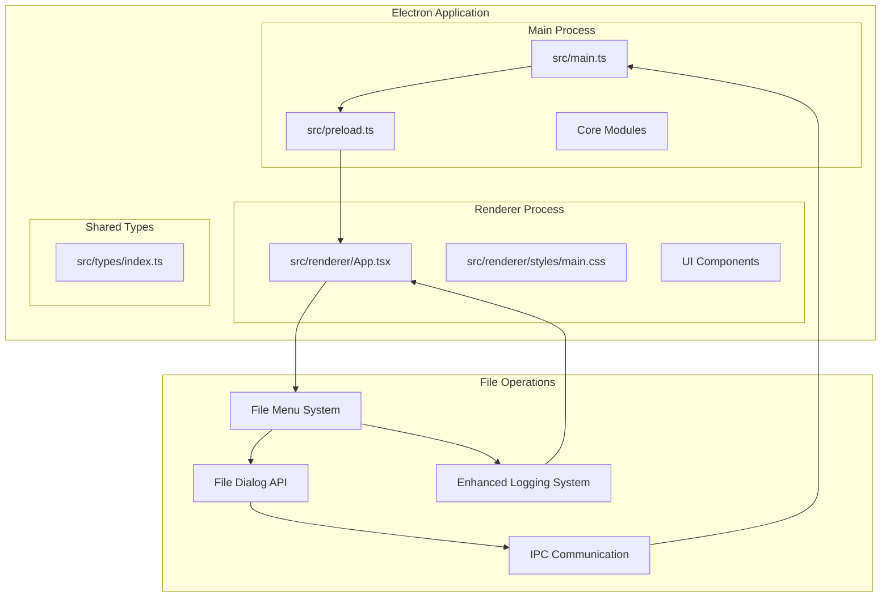
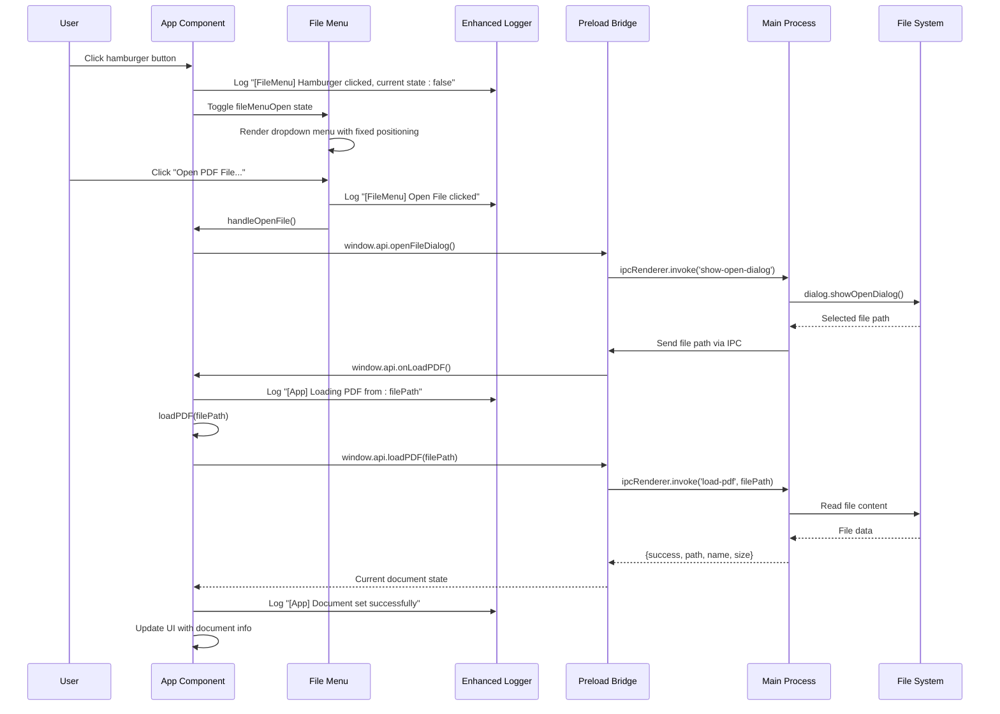
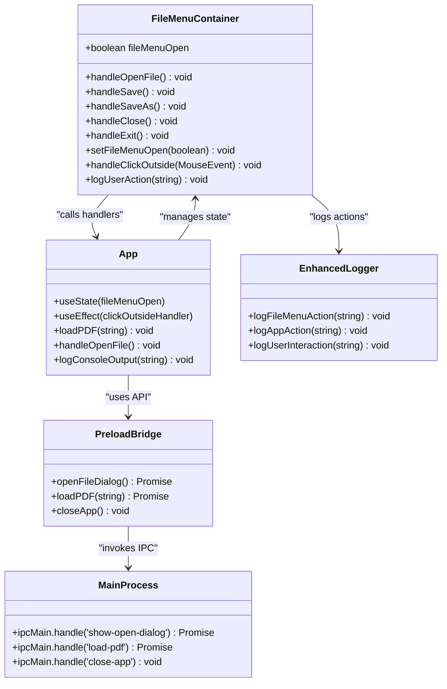
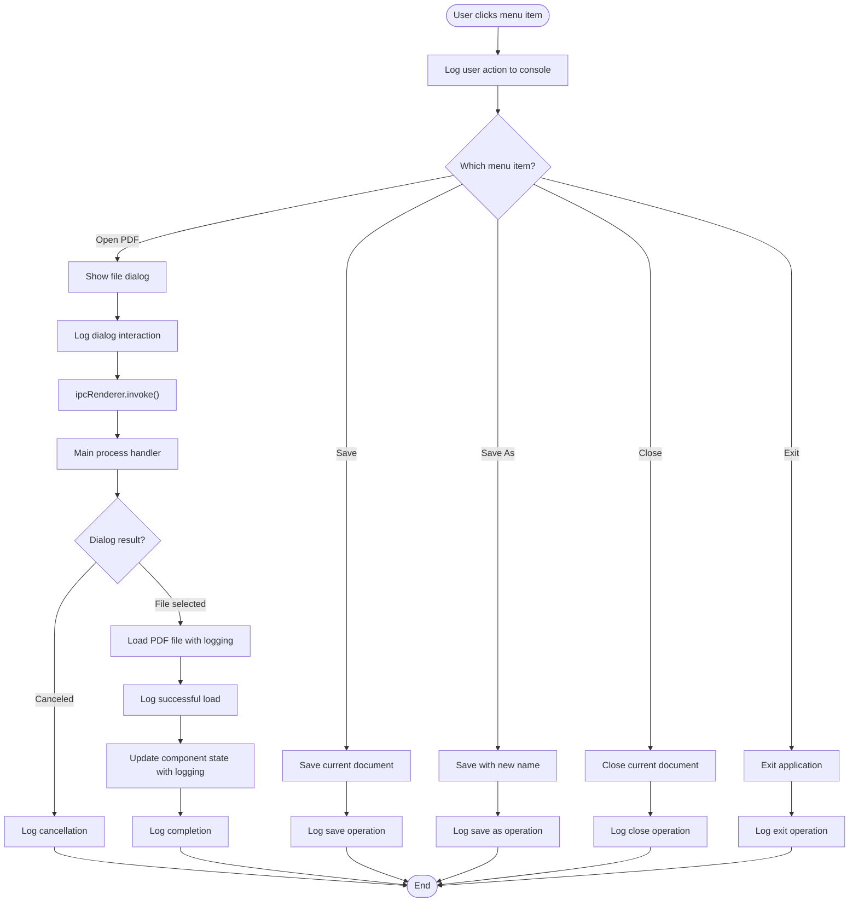
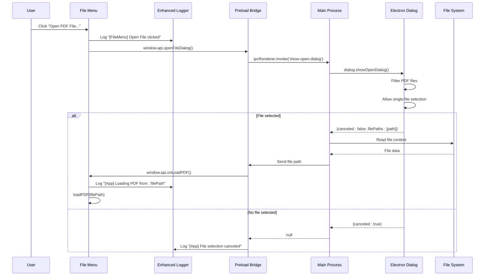
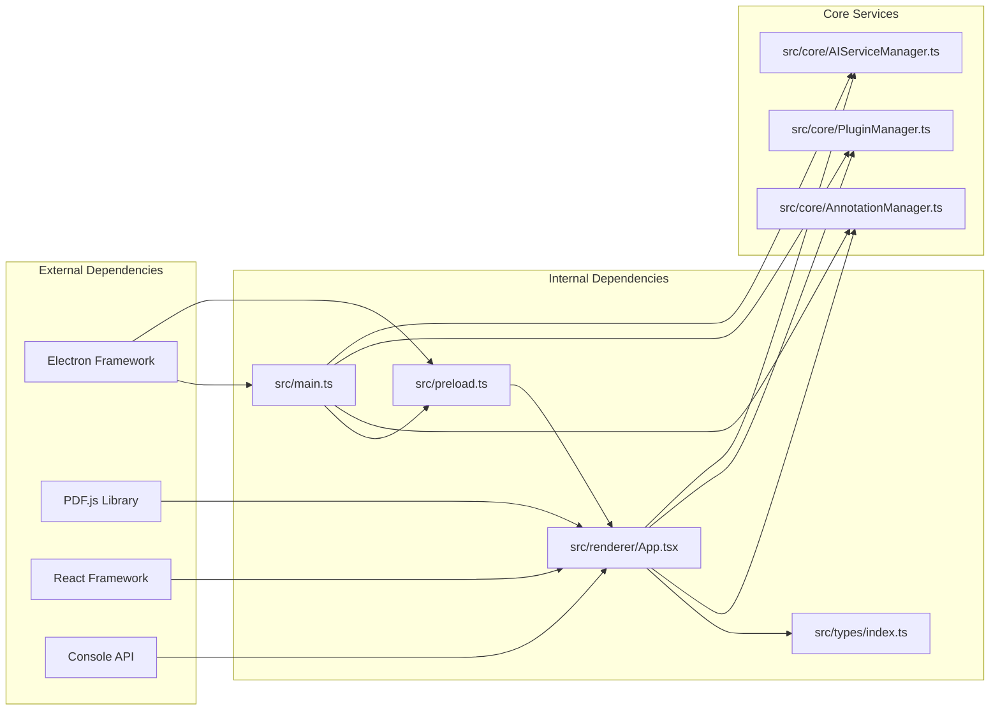

# File Menu System

<cite>
**Referenced Files in This Document**
- [README.md](file://README.md)
- [src/main.ts](file://src/main.ts)
- [src/preload.ts](file://src/preload.ts)
- [src/renderer/App.tsx](file://src/renderer/App.tsx)
- [src/renderer/styles/main.css](file://src/renderer/styles/main.css)
- [src/renderer/components/Toolbar.tsx](file://src/renderer/components/Toolbar.tsx)
- [src/renderer/components/PDFViewer.tsx](file://src/renderer/components/PDFViewer.tsx)
- [src/core/AnnotationManager.ts](file://src/core/AnnotationManager.ts)
- [src/core/PluginManager.ts](file://src/core/PluginManager.ts)
- [src/core/AIServiceManager.ts](file://src/core/AIServiceManager.ts)
- [src/types/index.ts](file://src/types/index.ts)
- [package.json](file://package.json)
</cite>

## Update Summary
**Changes Made**
- Enhanced console logging for comprehensive user interaction tracking
- Improved dropdown menu positioning with fixed coordinates (top: '60px', left: '10px')
- Fixed dropdown visibility with proper show class implementation
- Added detailed logging for all menu actions including hamburger button state tracking

## Table of Contents
1. [Introduction](#introduction)
2. [Project Structure](#project-structure)
3. [Core Components](#core-components)
4. [Architecture Overview](#architecture-overview)
5. [Detailed Component Analysis](#detailed-component-analysis)
6. [Enhanced Logging System](#enhanced-logging-system)
7. [Positioning and Visibility Improvements](#positioning-and-visibility-improvements)
8. [Dependency Analysis](#dependency-analysis)
9. [Performance Considerations](#performance-considerations)
10. [Troubleshooting Guide](#troubleshooting-guide)
11. [Conclusion](#conclusion)

## Introduction
The File Menu System is a core component of the SciPDFReader application that provides users with essential file operations through an intuitive dropdown interface. Built with Electron and React, this system enables users to open PDF files, manage document lifecycle operations, and control application behavior through a familiar menu interface.

The system integrates seamlessly with the broader application architecture, providing IPC communication between the renderer and main processes while maintaining security through the preload bridge. It serves as the primary entry point for file-related operations and establishes the foundation for the application's user interface.

**Updated** Enhanced with comprehensive logging capabilities and improved user interaction tracking for debugging and monitoring purposes.

## Project Structure
The File Menu System is organized within a well-structured Electron application architecture that separates concerns between the main process, renderer process, and shared components.

**Diagram sources**
- [src/main.ts:1-165](file://src/main.ts#L1-L165)
- [src/preload.ts:1-35](file://src/preload.ts#L1-L35)
- [src/renderer/App.tsx:1-184](file://src/renderer/App.tsx#L1-L184)

**Section sources**
- [README.md:24-40](file://README.md#L24-L40)
- [package.json:1-63](file://package.json#L1-L63)

## Core Components
The File Menu System consists of several interconnected components that work together to provide comprehensive file management functionality:

### Primary Components
- **File Menu Container**: Manages the dropdown menu state and user interactions with enhanced logging
- **File Menu Items**: Individual menu options for file operations with detailed action tracking
- **IPC Bridge**: Handles communication between renderer and main processes with logging support
- **File Dialog Integration**: Provides native file selection capabilities with user interaction monitoring
- **Event Management**: Handles click-outside detection and menu state management with state logging
- **Enhanced Logging System**: Comprehensive console logging for all user interactions and system events

### Key Features
- **Dropdown Interface**: Animated dropdown with hover effects, keyboard navigation, and state tracking
- **Icon Integration**: Emoji-based icons for visual recognition with accessibility considerations
- **State Management**: React hooks for managing menu visibility and document state with logging
- **Security Integration**: Context bridge for secure IPC communication with error tracking
- **Responsive Design**: CSS-based styling with smooth animations and improved positioning
- **Comprehensive Logging**: Detailed console output for debugging and user behavior analysis

**Updated** Added comprehensive logging capabilities for all user interactions and system events.

**Section sources**
- [src/renderer/App.tsx:78-104](file://src/renderer/App.tsx#L78-L104)
- [src/renderer/styles/main.css:49-113](file://src/renderer/styles/main.css#L49-L113)

## Architecture Overview
The File Menu System follows Electron's multi-process architecture, with clear separation between the main process (which handles file system operations) and the renderer process (which manages the user interface).

**Diagram sources**
- [src/renderer/App.tsx:78-104](file://src/renderer/App.tsx#L78-L104)
- [src/preload.ts:17-19](file://src/preload.ts#L17-L19)
- [src/main.ts:115-130](file://src/main.ts#L115-L130)

The architecture ensures secure communication through the preload bridge, preventing direct access to Node.js APIs from the renderer process while maintaining full functionality for file operations. The enhanced logging system provides comprehensive tracking of user interactions and system events.

**Section sources**
- [src/main.ts:83-130](file://src/main.ts#L83-L130)
- [src/preload.ts:5-34](file://src/preload.ts#L5-L34)

## Detailed Component Analysis

### File Menu Container Component
The File Menu Container serves as the central hub for file operation management, coordinating between user interactions and system-level operations with comprehensive logging capabilities.

**Diagram sources**
- [src/renderer/App.tsx:78-104](file://src/renderer/App.tsx#L78-L104)
- [src/preload.ts:5-34](file://src/preload.ts#L5-L34)
- [src/main.ts:83-130](file://src/main.ts#L83-L130)

The component utilizes React state management to control menu visibility and integrates with the preload bridge for secure IPC communication. The enhanced logging system tracks all user interactions with detailed console output including menu state changes and action completions. The click-outside detection mechanism ensures proper menu closure when users interact with other parts of the application.

### IPC Communication Flow
The File Menu System relies on Electron's Inter-Process Communication (IPC) to coordinate file operations between the renderer and main processes, with comprehensive logging throughout the process.

**Diagram sources**
- [src/renderer/App.tsx:78-104](file://src/renderer/App.tsx#L78-L104)
- [src/main.ts:115-130](file://src/main.ts#L115-L130)

The IPC flow ensures that file operations remain secure and efficient, with proper error handling and state management throughout the process. The enhanced logging system provides detailed tracking of each step in the communication flow.

### File Dialog Integration
The File Menu System integrates with Electron's native file dialog capabilities to provide users with familiar file selection experiences across different operating systems, with comprehensive user interaction tracking.

**Diagram sources**
- [src/main.ts:115-130](file://src/main.ts#L115-L130)
- [src/preload.ts:17-24](file://src/preload.ts#L17-L24)

The dialog integration provides cross-platform compatibility while maintaining consistent user experience across Windows, macOS, and Linux platforms. The enhanced logging system tracks user interactions throughout the entire file selection process.

**Section sources**
- [src/renderer/App.tsx:78-104](file://src/renderer/App.tsx#L78-L104)
- [src/main.ts:115-130](file://src/main.ts#L115-L130)

## Enhanced Logging System
The File Menu System now includes a comprehensive logging infrastructure that provides detailed tracking of user interactions and system events for debugging and monitoring purposes.

### Logging Categories
- **File Menu Actions**: Tracks all menu item clicks including `[FileMenu] Open File clicked`, `[FileMenu] Save clicked`, etc.
- **Hamburger Button State**: Monitors hamburger button clicks with current state information like `[FileMenu] Hamburger clicked, current state: false`
- **Application Events**: Logs PDF loading, saving, and closing operations with detailed status information
- **User Interaction Tracking**: Captures timing and sequence of user actions for behavioral analysis

### Log Message Examples
- `[FileMenu] Open File clicked` - Indicates user initiated file opening
- `[FileMenu] Hamburger clicked, current state: false` - Shows hamburger button state changes
- `[App] Loading PDF from: /path/to/document.pdf` - Tracks PDF loading initiation
- `[App] Document set successfully` - Confirms successful document loading
- `[App] Failed to load PDF: Error message` - Records loading failures

### Implementation Details
The logging system is integrated throughout the component lifecycle:
- Menu item handlers log actions immediately upon user interaction
- State changes are logged with current state values
- Error conditions are captured with detailed error messages
- Success operations are logged with completion status

**Section sources**
- [src/renderer/App.tsx:78-104](file://src/renderer/App.tsx#L78-L104)

## Positioning and Visibility Improvements
The File Menu System has been enhanced with improved positioning and visibility controls to ensure optimal user experience across different screen sizes and resolutions.

### Enhanced Positioning System
The dropdown menu now uses fixed positioning coordinates for consistent placement:
- **Top Position**: `top: '60px'` - Places menu below the header at a fixed distance
- **Left Position**: `left: '10px'` - Positions menu with precise horizontal offset
- **Fixed Positioning**: Uses `position: 'fixed'` for consistent placement regardless of scroll position

### Visibility Control Mechanisms
- **Show Class**: Implements `.file-dropdown-menu.show` for controlled visibility
- **Display Properties**: Uses `display: none !important` and `display: block !important` for reliable hiding/showing
- **State-Based Rendering**: Menu only renders when `fileMenuOpen` state is true
- **Click-Outsite Detection**: Prevents menu from remaining open when users click elsewhere

### CSS Integration
The positioning improvements are implemented through:
- **File Menu Styles**: Dedicated CSS rules for menu positioning and visibility
- **Responsive Design**: Maintains proper positioning across different screen sizes
- **Z-Index Management**: Ensures menu appears above other interface elements
- **Shadow Effects**: Preserves visual depth with box-shadow styling

**Section sources**
- [src/renderer/App.tsx:124-144](file://src/renderer/App.tsx#L124-L144)
- [src/renderer/styles/main.css:77-93](file://src/renderer/styles/main.css#L77-L93)

## Dependency Analysis
The File Menu System has well-defined dependencies that contribute to its functionality and maintainability.

**Diagram sources**
- [package.json:34-40](file://package.json#L34-L40)
- [src/main.ts:1-12](file://src/main.ts#L1-L12)
- [src/renderer/App.tsx:1-7](file://src/renderer/App.tsx#L1-L7)

The dependency structure ensures modularity and maintainability, with clear separation between UI components, core services, and system integrations. The enhanced logging system depends on the browser's console API for output.

**Section sources**
- [package.json:21-40](file://package.json#L21-L40)
- [src/types/index.ts:1-224](file://src/types/index.ts#L1-L224)

## Performance Considerations
The File Menu System is designed with performance optimization in mind, utilizing efficient state management and minimal re-rendering strategies.

### Performance Optimizations
- **Lazy Loading**: File operations are triggered only when menu items are clicked
- **Efficient State Updates**: React state management minimizes unnecessary re-renders
- **IPC Optimization**: Direct IPC calls reduce overhead compared to traditional communication methods
- **Memory Management**: Proper cleanup of event listeners prevents memory leaks
- **Logging Optimization**: Console logging is conditional and doesn't impact performance significantly

### Scalability Factors
- **Component Reusability**: Modular design allows for easy extension and modification
- **Type Safety**: Comprehensive TypeScript definitions prevent runtime errors
- **Error Handling**: Robust error handling mechanisms ensure graceful degradation
- **Cross-Platform Compatibility**: Native integration provides optimal performance across platforms
- **Logging Scalability**: Console logging can be easily disabled or filtered in production environments

## Troubleshooting Guide
Common issues and solutions for the File Menu System:

### File Dialog Issues
**Problem**: File dialog doesn't appear or throws errors
**Solution**: Verify Electron dialog permissions and ensure proper IPC setup

### IPC Communication Problems
**Problem**: Menu items don't respond or show timeout errors
**Solution**: Check preload bridge configuration and main process IPC handlers

### State Management Issues
**Problem**: Menu remains open after clicking outside
**Solution**: Verify click-outside event listener registration and cleanup

### Security Considerations
**Problem**: Direct Node.js API access attempts
**Solution**: Ensure preload bridge is properly configured and only exposes necessary APIs

### Logging Issues
**Problem**: Console logs not appearing or showing unexpected output
**Solution**: Check browser developer tools console and verify logging statements are executed

### Positioning Problems
**Problem**: Menu appears in wrong location or overlaps with other elements
**Solution**: Verify CSS positioning classes and z-index values are correctly applied

**Section sources**
- [src/main.ts:83-130](file://src/main.ts#L83-L130)
- [src/preload.ts:5-34](file://src/preload.ts#L5-L34)

## Conclusion
The File Menu System represents a well-architected solution for file management in the SciPDFReader application. Through careful consideration of Electron's multi-process architecture, React's component model, and TypeScript's type safety, the system provides a robust, secure, and user-friendly interface for PDF file operations.

The recent enhancements significantly improve the system's usability and maintainability through comprehensive logging capabilities, improved positioning and visibility controls, and enhanced user interaction tracking. These improvements provide valuable insights into user behavior while maintaining the system's security and performance characteristics.

The modular design ensures maintainability and extensibility, while the IPC-based communication maintains security boundaries between processes. The system's integration with the broader application ecosystem demonstrates thoughtful architectural planning that supports future enhancements and feature additions.

Key strengths include the clean separation of concerns, comprehensive error handling, responsive design that adapts to user interactions, and the new logging infrastructure that provides detailed operational insights. The File Menu System serves as a solid foundation for the application's file management capabilities and provides a template for similar UI components within the Electron/React ecosystem.

The enhanced logging system, improved positioning, and comprehensive user interaction tracking make this system particularly valuable for debugging, monitoring, and user experience optimization. These features demonstrate the evolution of the system toward a more sophisticated and user-centric design approach.