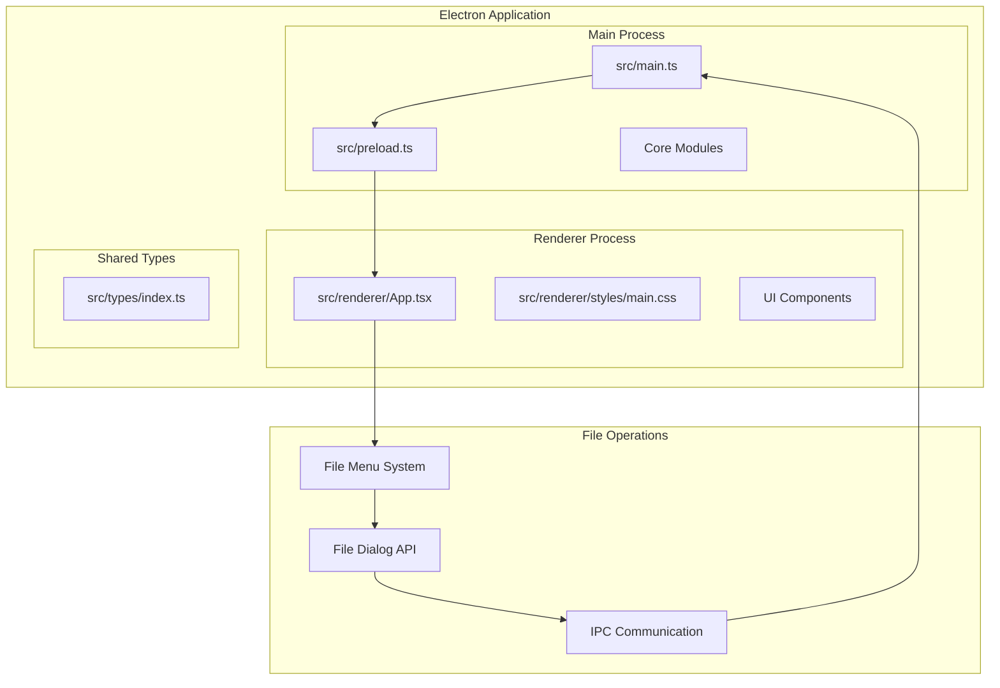
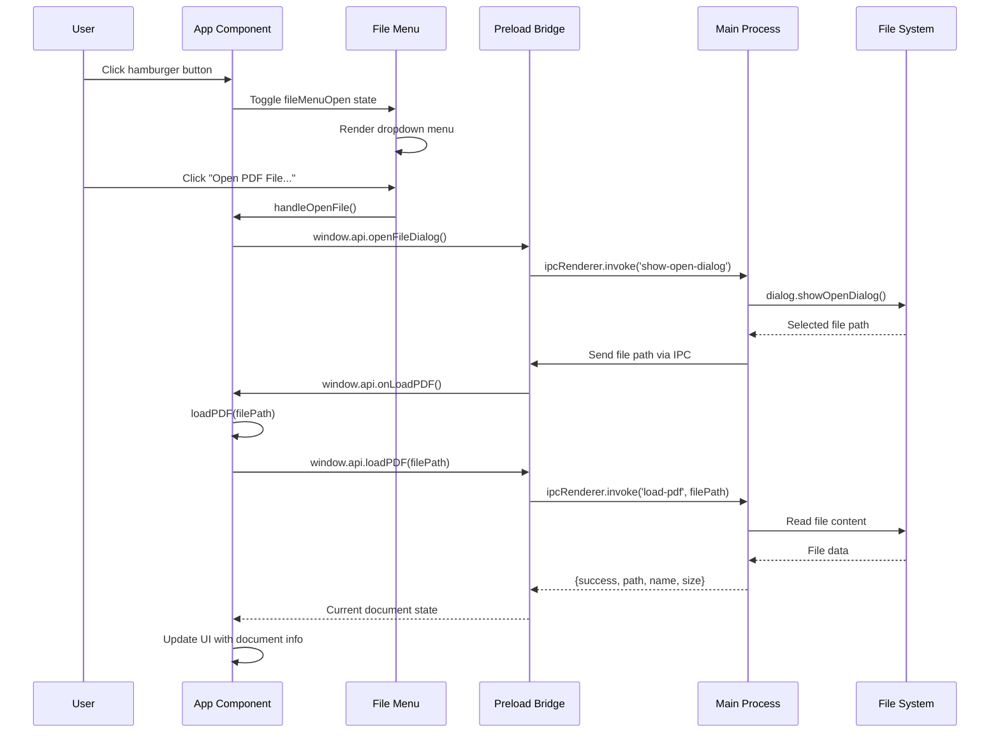
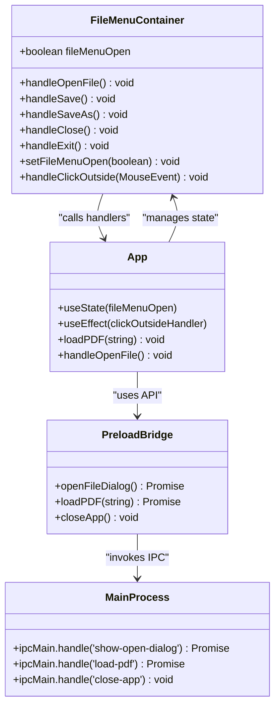
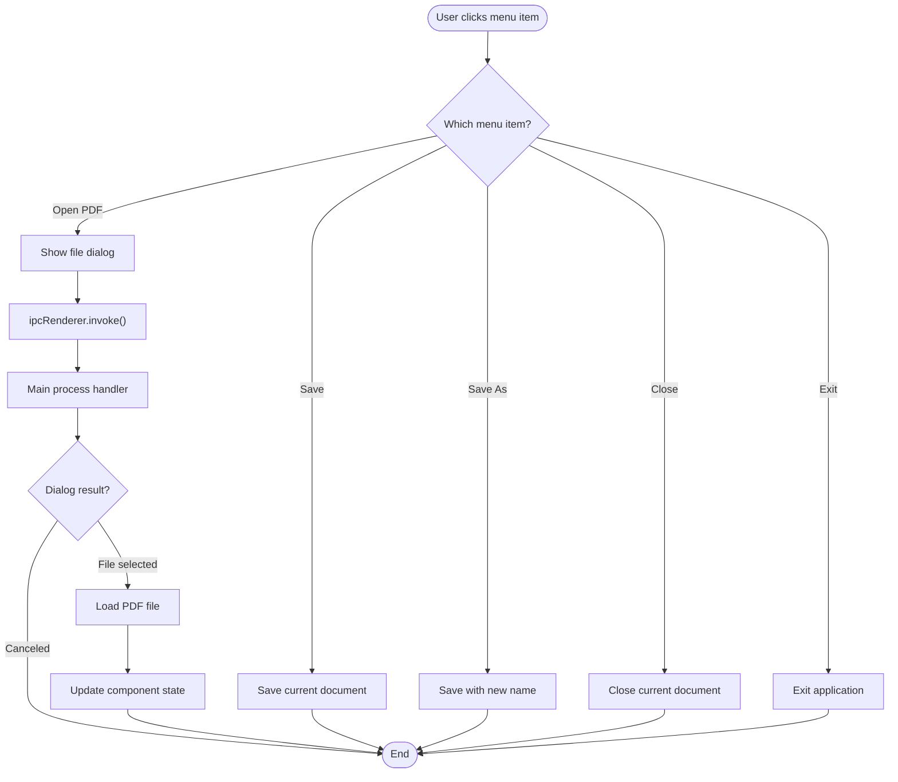
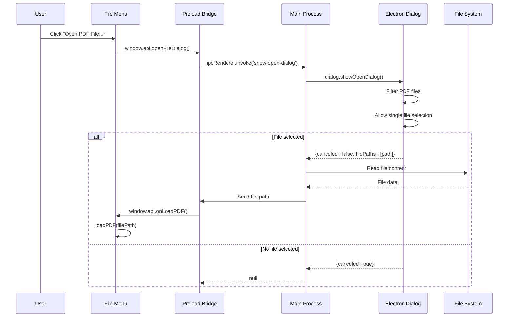
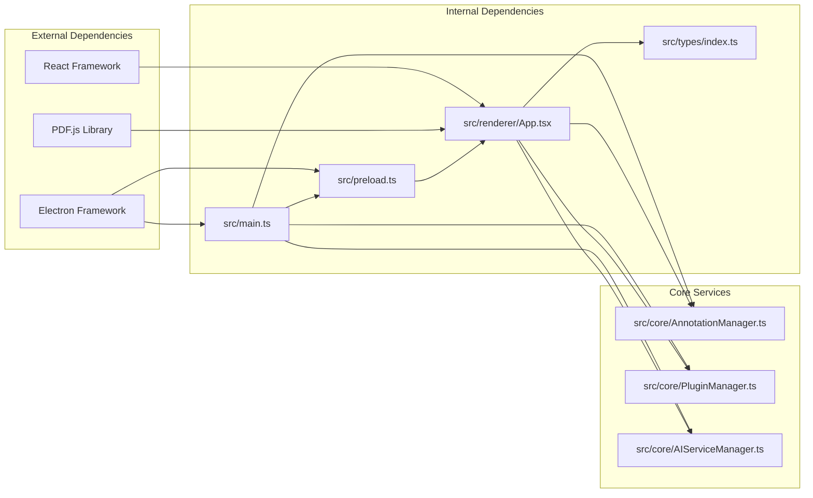

# File Menu System

<cite>
**Referenced Files in This Document**
- [README.md](file://README.md)
- [src/main.ts](file://src/main.ts)
- [src/preload.ts](file://src/preload.ts)
- [src/renderer/App.tsx](file://src/renderer/App.tsx)
- [src/renderer/styles/main.css](file://src/renderer/styles/main.css)
- [src/renderer/components/Toolbar.tsx](file://src/renderer/components/Toolbar.tsx)
- [src/renderer/components/PDFViewer.tsx](file://src/renderer/components/PDFViewer.tsx)
- [src/core/AnnotationManager.ts](file://src/core/AnnotationManager.ts)
- [src/core/PluginManager.ts](file://src/core/PluginManager.ts)
- [src/core/AIServiceManager.ts](file://src/core/AIServiceManager.ts)
- [src/types/index.ts](file://src/types/index.ts)
- [package.json](file://package.json)
</cite>

## Table of Contents
1. [Introduction](#introduction)
2. [Project Structure](#project-structure)
3. [Core Components](#core-components)
4. [Architecture Overview](#architecture-overview)
5. [Detailed Component Analysis](#detailed-component-analysis)
6. [Dependency Analysis](#dependency-analysis)
7. [Performance Considerations](#performance-considerations)
8. [Troubleshooting Guide](#troubleshooting-guide)
9. [Conclusion](#conclusion)

## Introduction
The File Menu System is a core component of the SciPDFReader application that provides users with essential file operations through an intuitive dropdown interface. Built with Electron and React, this system enables users to open PDF files, manage document lifecycle operations, and control application behavior through a familiar menu interface.

The system integrates seamlessly with the broader application architecture, providing IPC communication between the renderer and main processes while maintaining security through the preload bridge. It serves as the primary entry point for file-related operations and establishes the foundation for the application's user interface.

## Project Structure
The File Menu System is organized within a well-structured Electron application architecture that separates concerns between the main process, renderer process, and shared components.

**Diagram sources**
- [src/main.ts:1-162](file://src/main.ts#L1-L162)
- [src/preload.ts:1-35](file://src/preload.ts#L1-L35)
- [src/renderer/App.tsx:1-173](file://src/renderer/App.tsx#L1-L173)

**Section sources**
- [README.md:24-40](file://README.md#L24-L40)
- [package.json:1-63](file://package.json#L1-L63)

## Core Components
The File Menu System consists of several interconnected components that work together to provide comprehensive file management functionality:

### Primary Components
- **File Menu Container**: Manages the dropdown menu state and user interactions
- **File Menu Items**: Individual menu options for file operations
- **IPC Bridge**: Handles communication between renderer and main processes
- **File Dialog Integration**: Provides native file selection capabilities
- **Event Management**: Handles click-outside detection and menu state management

### Key Features
- **Dropdown Interface**: Animated dropdown with hover effects and keyboard navigation
- **Icon Integration**: Emoji-based icons for visual recognition
- **State Management**: React hooks for managing menu visibility and document state
- **Security Integration**: Context bridge for secure IPC communication
- **Responsive Design**: CSS-based styling with smooth animations

**Section sources**
- [src/renderer/App.tsx:103-134](file://src/renderer/App.tsx#L103-L134)
- [src/renderer/styles/main.css:49-113](file://src/renderer/styles/main.css#L49-L113)

## Architecture Overview
The File Menu System follows Electron's multi-process architecture, with clear separation between the main process (which handles file system operations) and the renderer process (which manages the user interface).

**Diagram sources**
- [src/renderer/App.tsx:73-76](file://src/renderer/App.tsx#L73-L76)
- [src/preload.ts:17-19](file://src/preload.ts#L17-L19)
- [src/main.ts:112-127](file://src/main.ts#L112-L127)

The architecture ensures secure communication through the preload bridge, preventing direct access to Node.js APIs from the renderer process while maintaining full functionality for file operations.

**Section sources**
- [src/main.ts:80-127](file://src/main.ts#L80-L127)
- [src/preload.ts:5-34](file://src/preload.ts#L5-L34)

## Detailed Component Analysis

### File Menu Container Component
The File Menu Container serves as the central hub for file operation management, coordinating between user interactions and system-level operations.

**Diagram sources**
- [src/renderer/App.tsx:103-134](file://src/renderer/App.tsx#L103-L134)
- [src/preload.ts:5-34](file://src/preload.ts#L5-L34)
- [src/main.ts:80-127](file://src/main.ts#L80-L127)

The component utilizes React state management to control menu visibility and integrates with the preload bridge for secure IPC communication. The click-outside detection mechanism ensures proper menu closure when users interact with other parts of the application.

### IPC Communication Flow
The File Menu System relies on Electron's Inter-Process Communication (IPC) to coordinate file operations between the renderer and main processes.

**Diagram sources**
- [src/renderer/App.tsx:73-96](file://src/renderer/App.tsx#L73-L96)
- [src/main.ts:112-127](file://src/main.ts#L112-L127)

The IPC flow ensures that file operations remain secure and efficient, with proper error handling and state management throughout the process.

### File Dialog Integration
The File Menu System integrates with Electron's native file dialog capabilities to provide users with familiar file selection experiences across different operating systems.

**Diagram sources**
- [src/main.ts:112-127](file://src/main.ts#L112-L127)
- [src/preload.ts:17-24](file://src/preload.ts#L17-L24)

The dialog integration provides cross-platform compatibility while maintaining consistent user experience across Windows, macOS, and Linux platforms.

**Section sources**
- [src/renderer/App.tsx:17-38](file://src/renderer/App.tsx#L17-L38)
- [src/main.ts:112-127](file://src/main.ts#L112-L127)

## Dependency Analysis
The File Menu System has well-defined dependencies that contribute to its functionality and maintainability.

**Diagram sources**
- [package.json:34-40](file://package.json#L34-L40)
- [src/main.ts:1-12](file://src/main.ts#L1-L12)
- [src/renderer/App.tsx:1-7](file://src/renderer/App.tsx#L1-L7)

The dependency structure ensures modularity and maintainability, with clear separation between UI components, core services, and system integrations.

**Section sources**
- [package.json:21-40](file://package.json#L21-L40)
- [src/types/index.ts:1-224](file://src/types/index.ts#L1-L224)

## Performance Considerations
The File Menu System is designed with performance optimization in mind, utilizing efficient state management and minimal re-rendering strategies.

### Performance Optimizations
- **Lazy Loading**: File operations are triggered only when menu items are clicked
- **Efficient State Updates**: React state management minimizes unnecessary re-renders
- **IPC Optimization**: Direct IPC calls reduce overhead compared to traditional communication methods
- **Memory Management**: Proper cleanup of event listeners prevents memory leaks

### Scalability Factors
- **Component Reusability**: Modular design allows for easy extension and modification
- **Type Safety**: Comprehensive TypeScript definitions prevent runtime errors
- **Error Handling**: Robust error handling mechanisms ensure graceful degradation
- **Cross-Platform Compatibility**: Native integration provides optimal performance across platforms

## Troubleshooting Guide
Common issues and solutions for the File Menu System:

### File Dialog Issues
**Problem**: File dialog doesn't appear or throws errors
**Solution**: Verify Electron dialog permissions and ensure proper IPC setup

### IPC Communication Problems
**Problem**: Menu items don't respond or show timeout errors
**Solution**: Check preload bridge configuration and main process IPC handlers

### State Management Issues
**Problem**: Menu remains open after clicking outside
**Solution**: Verify click-outside event listener registration and cleanup

### Security Considerations
**Problem**: Direct Node.js API access attempts
**Solution**: Ensure preload bridge is properly configured and only exposes necessary APIs

**Section sources**
- [src/main.ts:80-127](file://src/main.ts#L80-L127)
- [src/preload.ts:5-34](file://src/preload.ts#L5-L34)

## Conclusion
The File Menu System represents a well-architected solution for file management in the SciPDFReader application. Through careful consideration of Electron's multi-process architecture, React's component model, and TypeScript's type safety, the system provides a robust, secure, and user-friendly interface for PDF file operations.

The modular design ensures maintainability and extensibility, while the IPC-based communication maintains security boundaries between processes. The system's integration with the broader application ecosystem demonstrates thoughtful architectural planning that supports future enhancements and feature additions.

Key strengths include the clean separation of concerns, comprehensive error handling, and responsive design that adapts to user interactions. The File Menu System serves as a solid foundation for the application's file management capabilities and provides a template for similar UI components within the Electron/React ecosystem.