# PDF Viewer Enhancement

<cite>
**Referenced Files in This Document**
- [README.md](file://README.md)
- [package.json](file://package.json)
- [src/main.ts](file://src/main.ts)
- [src/preload.ts](file://src/preload.ts)
- [src/renderer/App.tsx](file://src/renderer/App.tsx)
- [src/renderer/components/PDFViewer.tsx](file://src/renderer/components/PDFViewer.tsx)
- [src/renderer/components/Toolbar.tsx](file://src/renderer/components/Toolbar.tsx)
- [src/renderer/components/Sidebar.tsx](file://src/renderer/components/Sidebar.tsx)
- [src/renderer/components/RightPanel.tsx](file://src/renderer/components/RightPanel.tsx)
- [src/renderer/styles/main.css](file://src/renderer/styles/main.css)
- [src/renderer/index.html](file://src/renderer/index.html)
- [src/core/AnnotationManager.ts](file://src/core/AnnotationManager.ts)
- [src/core/PluginManager.ts](file://src/core/PluginManager.ts)
- [src/core/AIServiceManager.ts](file://src/core/AIServiceManager.ts)
- [src/types/index.ts](file://src/types/index.ts)
</cite>

## Update Summary
**Changes Made**
- Updated Toolbar component documentation to reflect enhanced zoom functionality with custom numeric input field
- Added detailed explanation of zoom validation and constraint mechanisms with 1-500% range limits
- Enhanced zoom calculation logic with improved dimension reporting capabilities
- Updated styling documentation for zoom input field with focus states and validation feedback
- Clarified that the toolbar now features a numeric zoom input with Enter key validation and blur constraints
- Added comprehensive dimension reporting system with page and container dimension tracking
- Enhanced wheel event handling with improved edge detection logic and `isRendering` state management

## Table of Contents
1. [Introduction](#introduction)
2. [Project Structure](#project-structure)
3. [Core Components](#core-components)
4. [Architecture Overview](#architecture-overview)
5. [Detailed Component Analysis](#detailed-component-analysis)
6. [Dependency Analysis](#dependency-analysis)
7. [Performance Considerations](#performance-considerations)
8. [Troubleshooting Guide](#troubleshooting-guide)
9. [Conclusion](#conclusion)

## Introduction
This document provides a comprehensive analysis of the SciPDFReader PDF Viewer Enhancement project. SciPDFReader is a modern, extensible PDF reader built on Electron with React, featuring AI-powered annotation capabilities and a plugin architecture inspired by VS Code. The project emphasizes cross-platform compatibility, extensibility, and intelligent document interaction through AI services.

The enhancement focuses on improving the PDF viewing experience, annotation system, AI integration, and plugin extensibility. The application supports high-quality PDF rendering via PDF.js, interactive annotation creation and management, AI-driven translation and summarization, and a flexible plugin system for extending functionality.

**Section sources**
- [README.md:1-207](file://README.md#L1-L207)

## Project Structure
The project follows a clear separation of concerns with distinct modules for the main Electron process, renderer React components, core services, and type definitions. The structure promotes maintainability and scalability while supporting the plugin architecture.

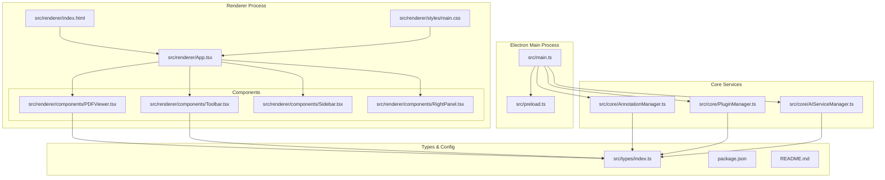

**Diagram sources**
- [src/main.ts:1-160](file://src/main.ts#L1-L160)
- [src/preload.ts:1-35](file://src/preload.ts#L1-L35)
- [src/renderer/App.tsx:1-335](file://src/renderer/App.tsx#L1-L335)
- [src/renderer/components/PDFViewer.tsx:1-379](file://src/renderer/components/PDFViewer.tsx#L1-L379)
- [src/core/AnnotationManager.ts:1-172](file://src/core/AnnotationManager.ts#L1-L172)
- [src/core/PluginManager.ts:1-250](file://src/core/PluginManager.ts#L1-L250)
- [src/core/AIServiceManager.ts:1-214](file://src/core/AIServiceManager.ts#L1-L214)
- [src/types/index.ts:1-224](file://src/types/index.ts#L1-L224)

**Section sources**
- [README.md:24-40](file://README.md#L24-L40)
- [package.json:1-67](file://package.json#L1-L67)

## Core Components
The application's functionality is built around several core components that work together to provide a seamless PDF reading experience:

### Annotation Management System
The AnnotationManager provides comprehensive annotation handling with support for multiple annotation types, persistence, and export capabilities. It manages different annotation types including highlights, underlines, notes, translations, and background information.

### Plugin Architecture
The PluginManager implements a VS Code-inspired plugin system that allows third-party extensions to enhance functionality. Plugins can register commands, annotation types, and AI services, creating a flexible ecosystem for extending the application.

### AI Service Integration
The AIServiceManager coordinates AI-powered features including translation, summarization, background information retrieval, and keyword extraction. It supports multiple providers (OpenAI, Azure, local models) and provides a unified interface for AI operations.

### PDF Rendering Engine
Built on PDF.js, the PDFViewer component handles document loading, page rendering, zoom controls, and scroll modes. It supports both single-page and continuous scrolling modes with responsive scaling and intelligent wheel event handling for enhanced user experience.

**Section sources**
- [src/core/AnnotationManager.ts:1-172](file://src/core/AnnotationManager.ts#L1-L172)
- [src/core/PluginManager.ts:1-250](file://src/core/PluginManager.ts#L1-L250)
- [src/core/AIServiceManager.ts:1-214](file://src/core/AIServiceManager.ts#L1-L214)
- [src/renderer/components/PDFViewer.tsx:1-379](file://src/renderer/components/PDFViewer.tsx#L1-L379)

## Architecture Overview
The application follows a client-server architecture pattern with Electron's main and renderer processes communicating through IPC channels. The design emphasizes separation of concerns and modularity.

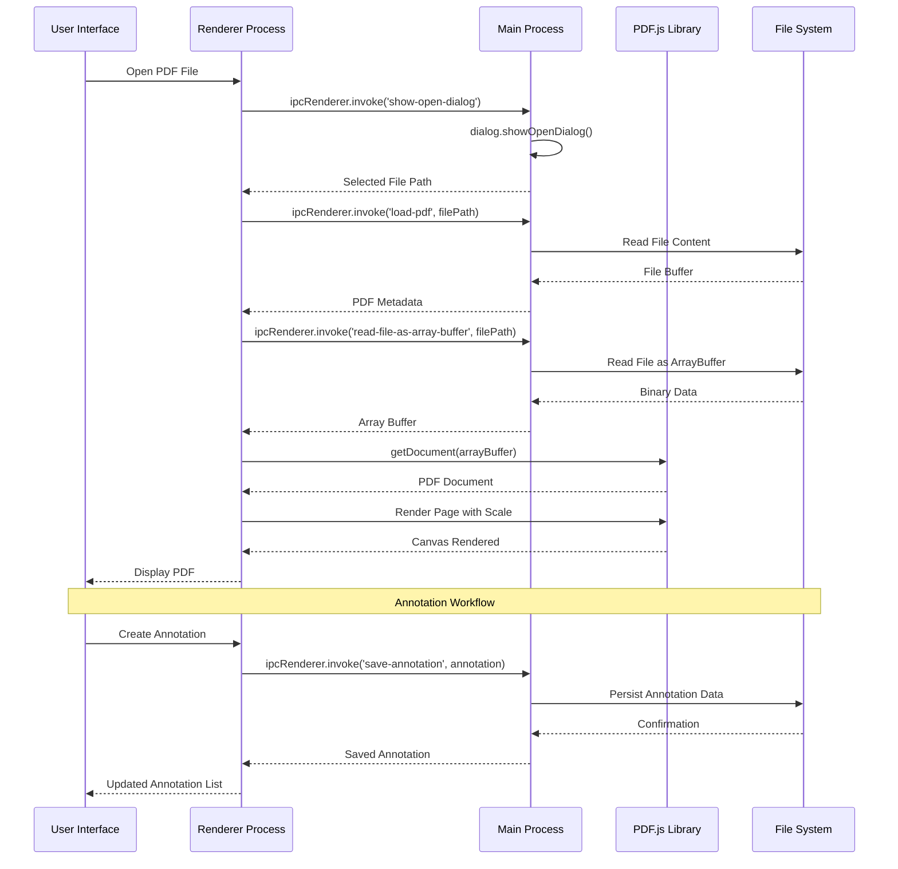

**Diagram sources**
- [src/main.ts:90-125](file://src/main.ts#L90-L125)
- [src/preload.ts:5-34](file://src/preload.ts#L5-L34)
- [src/renderer/App.tsx:56-70](file://src/renderer/App.tsx#L56-L70)
- [src/renderer/components/PDFViewer.tsx:46-78](file://src/renderer/components/PDFViewer.tsx#L46-L78)

The architecture ensures secure communication between processes while maintaining performance through efficient data handling and rendering optimization.

**Section sources**
- [src/main.ts:1-160](file://src/main.ts#L1-L160)
- [src/preload.ts:1-35](file://src/preload.ts#L1-L35)

## Detailed Component Analysis

### PDF Viewer Component
The PDFViewer component serves as the core rendering engine, implementing sophisticated page management and user interaction handling with intelligent wheel event processing.

**Updated** The PDFViewer now includes advanced wheel event handling for single-page scrolling mode with intelligent page navigation:

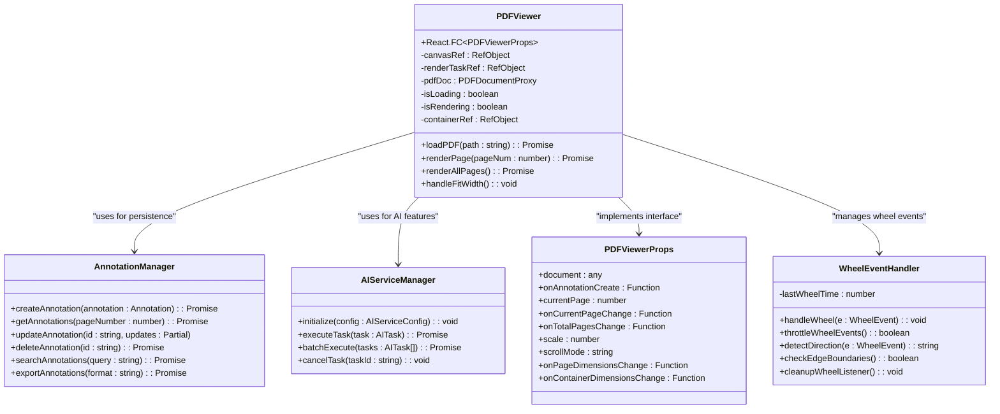

**Diagram sources**
- [src/renderer/components/PDFViewer.tsx:19-379](file://src/renderer/components/PDFViewer.tsx#L19-L379)
- [src/core/AnnotationManager.ts:46-84](file://src/core/AnnotationManager.ts#L46-L84)
- [src/core/AIServiceManager.ts:13-56](file://src/core/AIServiceManager.ts#L13-L56)

The component implements responsive design with dynamic scaling, supports multiple rendering modes, integrates with the annotation system for collaborative document editing, and features intelligent wheel event handling for enhanced single-page navigation.

**Section sources**
- [src/renderer/components/PDFViewer.tsx:19-379](file://src/renderer/components/PDFViewer.tsx#L19-L379)

### Enhanced Zoom Functionality
**New** The Toolbar component now features a sophisticated numeric zoom input system with comprehensive validation and constraint mechanisms:

#### Numeric Zoom Input System
The zoom input field provides precise control over zoom levels with the following features:

1. **Custom Numeric Input Field**: Replaces the previous dropdown-based system with a direct numeric input
2. **Real-time Validation**: Allows typing any value during input without immediate validation
3. **Constraint Validation**: Applies 1-500% range limits when user interacts with the input
4. **Enter Key Processing**: Validates and constrains zoom level when user presses Enter
5. **Blur Handling**: Automatically constrains zoom level when input loses focus
6. **Visual Feedback**: Enhanced styling with focus states and validation indicators

#### Zoom Input Processing Flow
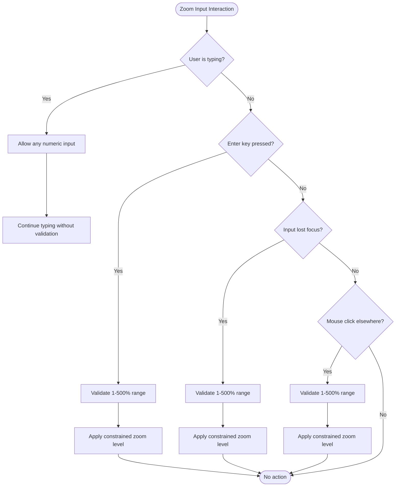

**Diagram sources**
- [src/renderer/components/Toolbar.tsx:106-137](file://src/renderer/components/Toolbar.tsx#L106-L137)

#### Enhanced Dimension Reporting System
**New** The PDFViewer component now includes comprehensive dimension reporting capabilities:

1. **Page Dimension Tracking**: Reports page width and height after successful rendering
2. **Container Dimension Monitoring**: Uses ResizeObserver for real-time container dimension changes
3. **Auto-fit Calculation**: Automatically calculates optimal zoom levels based on available space
4. **Responsive Scaling**: Recalculates zoom levels when window or container dimensions change
5. **Initial Load Reporting**: Reports first page dimensions when PDF is loaded

#### Dimension Reporting Flow
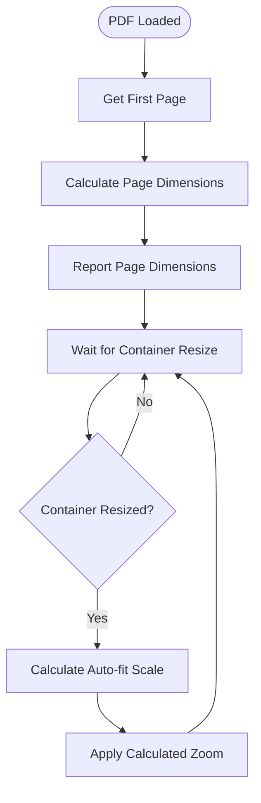

**Diagram sources**
- [src/renderer/components/PDFViewer.tsx:64-70](file://src/renderer/components/PDFViewer.tsx#L64-L70)
- [src/renderer/components/PDFViewer.tsx:119-148](file://src/renderer/components/PDFViewer.tsx#L119-L148)
- [src/renderer/App.tsx:270-288](file://src/renderer/App.tsx#L270-L288)

**Section sources**
- [src/renderer/components/Toolbar.tsx:106-137](file://src/renderer/components/Toolbar.tsx#L106-L137)
- [src/renderer/components/PDFViewer.tsx:64-70](file://src/renderer/components/PDFViewer.tsx#L64-L70)
- [src/renderer/components/PDFViewer.tsx:119-148](file://src/renderer/components/PDFViewer.tsx#L119-L148)
- [src/renderer/App.tsx:270-288](file://src/renderer/App.tsx#L270-L288)

### Wheel Event Handling System
**New** The PDFViewer now includes sophisticated wheel event management for single-page scrolling mode:

#### Enhanced Intelligent Page Navigation Logic
The wheel event handler implements a multi-layered approach to determine when to navigate between pages with improved performance:

1. **Enhanced Throttling Mechanism**: Prevents rapid successive page changes with a 500ms cooldown period (improved from 400ms)
2. **Rendering State Checking**: Checks `isRendering` state to prevent page changes during active rendering
3. **Page Fit Detection**: Determines if the current page fits entirely within the viewport
4. **Improved Edge Boundary Checking**: Identifies when the user has reached the top or bottom edge of a scrollable page with 10px tolerance
5. **Directional Detection**: Uses deltaY values to determine scroll direction
6. **Smart Event Prevention**: Prevents default behavior only when necessary for page navigation

#### Wheel Event Processing Flow
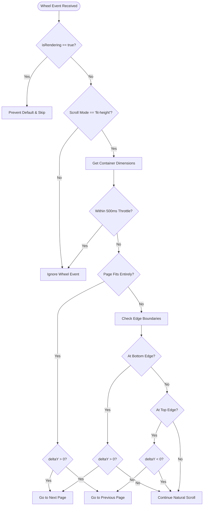

**Diagram sources**
- [src/renderer/components/PDFViewer.tsx:158-225](file://src/renderer/components/PDFViewer.tsx#L158-L225)

#### Enhanced Cleanup and Resource Management
The wheel event handler includes proper cleanup mechanisms:
- Automatic removal of event listeners on component unmount
- Prevention of memory leaks through proper event listener cleanup
- Safe handling of edge cases during component lifecycle
- **Updated** Integration with `isRendering` state for coordinated cleanup

**Section sources**
- [src/renderer/components/PDFViewer.tsx:158-225](file://src/renderer/components/PDFViewer.tsx#L158-L225)

### Rendering Task Management
**New** The PDFViewer now includes comprehensive rendering task management with cancellation support:

#### Rendering Task Cancellation System
The component implements a robust rendering task management system:

1. **Render Task Tracking**: Uses `renderTaskRef` to track active rendering tasks
2. **Automatic Cancellation**: Cancels previous render tasks before starting new ones
3. **State Management**: Tracks rendering state with `isRendering` for coordinated UI updates
4. **Cleanup Mechanisms**: Properly cleans up render tasks on component unmount
5. **Error Handling**: Handles rendering cancellation exceptions gracefully

#### Rendering Lifecycle
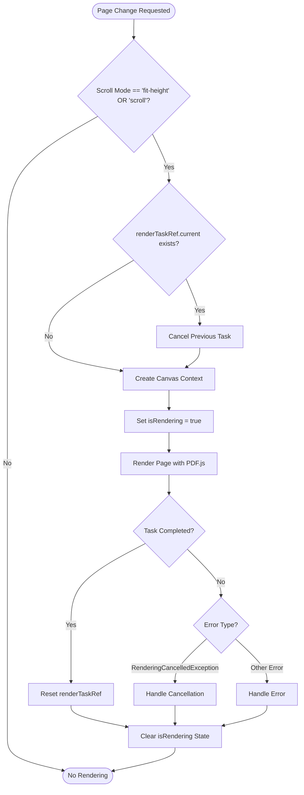

**Diagram sources**
- [src/renderer/components/PDFViewer.tsx:227-288](file://src/renderer/components/PDFViewer.tsx#L227-L288)

#### Smooth Scroll Behavior
The PDFViewer now includes smooth scroll behavior for enhanced user experience:
- CSS `scrollBehavior: 'smooth'` for natural page transitions
- Coordinated wheel event handling with intelligent edge detection
- Responsive rendering with proper task cancellation

**Section sources**
- [src/renderer/components/PDFViewer.tsx:227-288](file://src/renderer/components/PDFViewer.tsx#L227-L288)

### Enhanced Debugging Capabilities
**New** The PDFViewer component includes comprehensive debugging capabilities with extensive console logging:

#### Debug Logging System
The component implements detailed logging throughout the rendering pipeline:

1. **Component Lifecycle Logging**: Logs component mounting, updates, and unmounting
2. **PDF Loading Progress**: Tracks PDF loading stages and errors
3. **Rendering Operations**: Monitors render task creation, completion, and cancellation
4. **Wheel Event Processing**: Logs wheel event handling decisions and outcomes
5. **Dimension Tracking**: Reports page and container dimension changes
6. **State Management**: Logs state transitions and updates

#### Debug Output Examples
The component logs various operational states:
- `[PDFViewer] Rendering - currentPage: X, scale: Y, scrollMode: Z`
- `[PDFViewer] loadPDF called with path: filePath`
- `[PDFViewer] Page X rendered successfully`
- `[PDFViewer] Skipping wheel - rendering in progress`
- `[PDFViewer] At bottom edge - loading next page: X+1`

**Section sources**
- [src/renderer/components/PDFViewer.tsx:28-75](file://src/renderer/components/PDFViewer.tsx#L28-L75)
- [src/renderer/components/PDFViewer.tsx:164-218](file://src/renderer/components/PDFViewer.tsx#L164-L218)
- [src/renderer/components/PDFViewer.tsx:243-277](file://src/renderer/components/PDFViewer.tsx#L243-L277)

### Toolbar Component
The Toolbar component provides the primary user interface controls for PDF navigation and viewing options. **Updated** The toolbar interface has been enhanced with a sophisticated numeric zoom input system while maintaining full functionality.

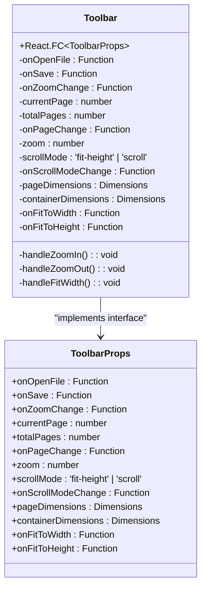

**Diagram sources**
- [src/renderer/components/Toolbar.tsx:3-17](file://src/renderer/components/Toolbar.tsx#L3-L17)
- [src/renderer/components/Toolbar.tsx:19-225](file://src/renderer/components/Toolbar.tsx#L19-L225)

**Updated** The toolbar now features a streamlined interface with enhanced zoom controls:
- File operations (Open, Save)
- Navigation controls (Previous, Next page)
- **Enhanced** Zoom controls with numeric input field (Zoom In, Zoom Out, Custom zoom input)
- View options accessible through dropdown menu
- Annotation tools (Highlight, Underline, Note, Translate)

**Section sources**
- [src/renderer/components/Toolbar.tsx:19-225](file://src/renderer/components/Toolbar.tsx#L19-L225)

### Annotation Management System
The AnnotationManager provides a comprehensive solution for annotation persistence, retrieval, and export functionality.

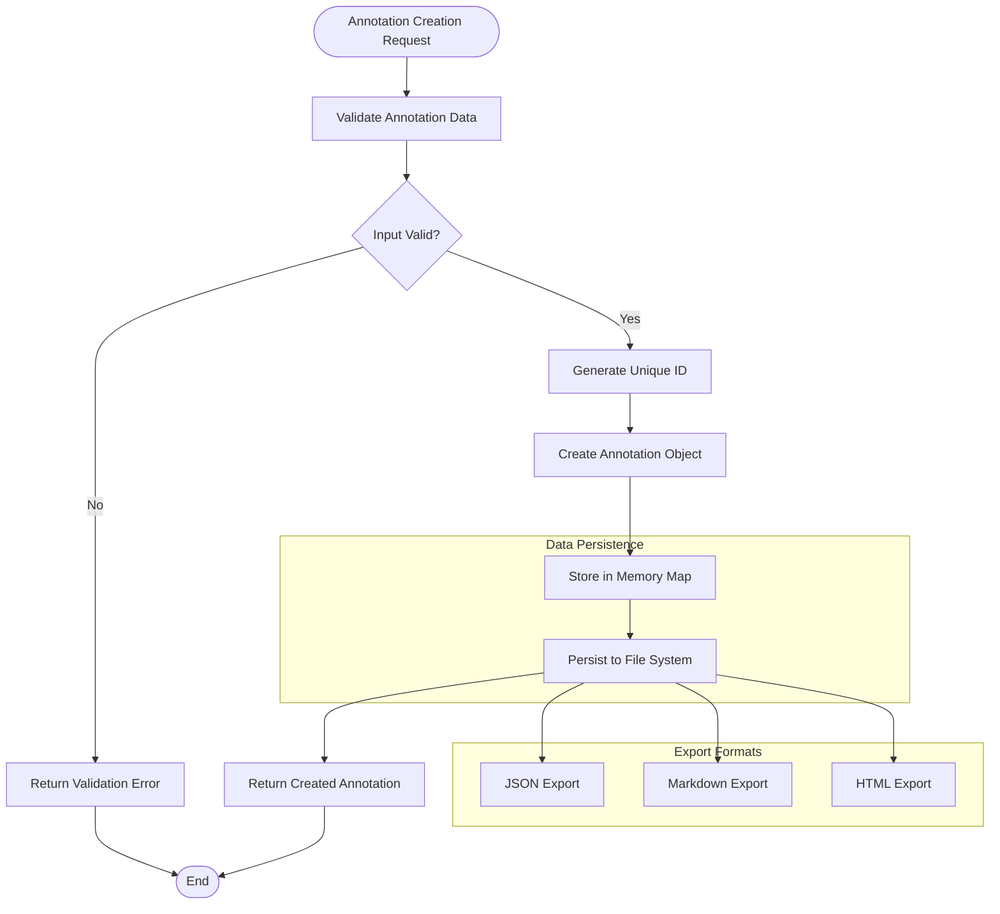

**Diagram sources**
- [src/core/AnnotationManager.ts:46-172](file://src/core/AnnotationManager.ts#L46-L172)

The system supports multiple export formats and maintains data integrity through proper error handling and validation.

**Section sources**
- [src/core/AnnotationManager.ts:1-172](file://src/core/AnnotationManager.ts#L1-L172)

### Plugin Architecture Implementation
The PluginManager implements a sophisticated plugin system that enables third-party extensions to enhance functionality.

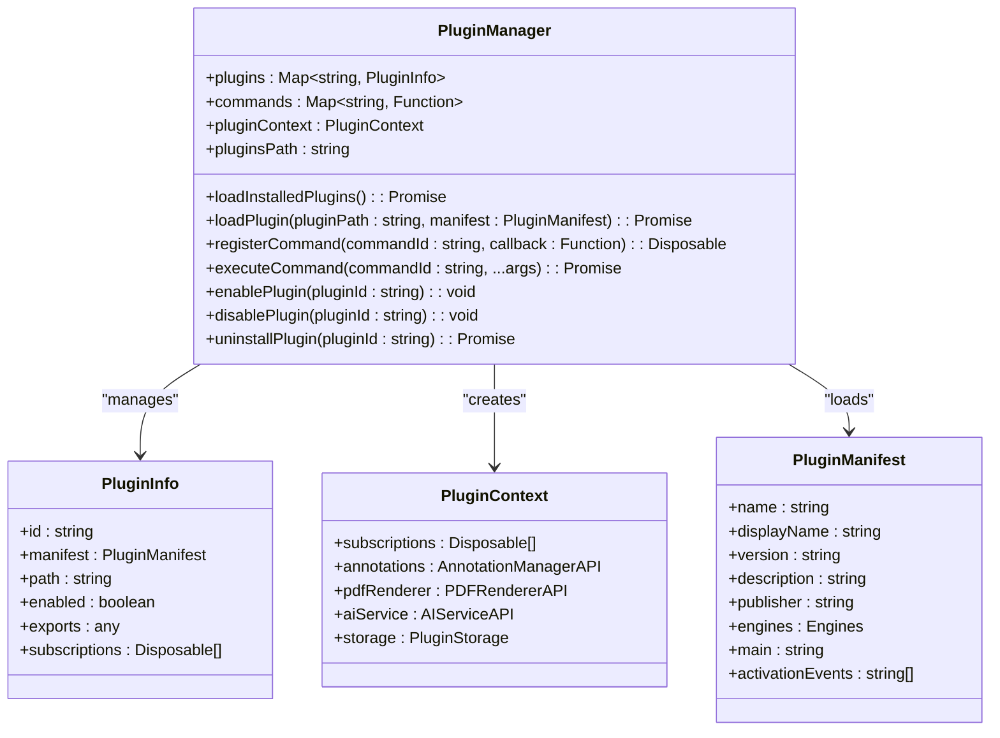

**Diagram sources**
- [src/core/PluginManager.ts:16-250](file://src/core/PluginManager.ts#L16-L250)

The plugin system supports dynamic loading, command registration, and lifecycle management for extensions.

**Section sources**
- [src/core/PluginManager.ts:1-250](file://src/core/PluginManager.ts#L1-L250)

### AI Service Integration
The AIServiceManager provides a unified interface for AI-powered document processing with support for multiple providers and task types.

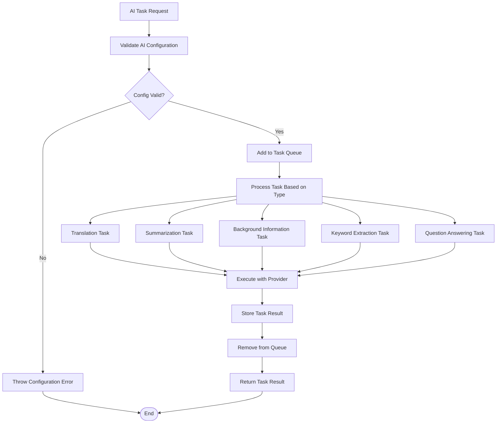

**Diagram sources**
- [src/core/AIServiceManager.ts:13-214](file://src/core/AIServiceManager.ts#L13-L214)

The system supports batch processing, task cancellation, and provider abstraction for flexible AI integration.

**Section sources**
- [src/core/AIServiceManager.ts:1-214](file://src/core/AIServiceManager.ts#L1-L214)

## Dependency Analysis
The project maintains clean dependency boundaries with clear interfaces between components, promoting maintainability and testability.

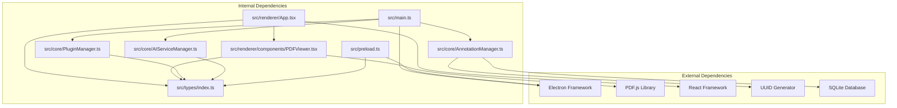

**Diagram sources**
- [package.json:38-44](file://package.json#L38-L44)
- [src/main.ts:1-160](file://src/main.ts#L1-L160)
- [src/core/AnnotationManager.ts:1-172](file://src/core/AnnotationManager.ts#L1-L172)
- [src/core/PluginManager.ts:1-250](file://src/core/PluginManager.ts#L1-L250)
- [src/core/AIServiceManager.ts:1-214](file://src/core/AIServiceManager.ts#L1-L214)

The dependency graph shows a well-structured architecture with minimal circular dependencies and clear separation of concerns.

**Section sources**
- [package.json:1-67](file://package.json#L1-L67)

## Performance Considerations
The application implements several performance optimization strategies:

### Rendering Optimization
- PDF.js worker utilization for background processing
- Efficient canvas rendering with proper memory management
- Lazy loading of PDF pages based on scroll position
- Responsive scaling calculations to minimize reflows
- **Updated** Enhanced rendering task cancellation prevents memory leaks and resource waste
- **Updated** `isRendering` state management optimizes wheel event handling during active rendering

### Memory Management
- Proper cleanup of event listeners and observers
- Efficient annotation data structures using Maps
- Conditional rendering based on component state
- Cleanup of PDF rendering contexts
- **Updated** Intelligent wheel event throttling (500ms) prevents excessive page navigation requests
- **Updated** Improved edge boundary detection reduces unnecessary page changes
- **Updated** Render task tracking with automatic cancellation prevents memory leaks

### Network and I/O Optimization
- Buffered file reading for large PDFs
- Caching mechanisms for frequently accessed data
- Asynchronous operations to prevent UI blocking
- Efficient IPC communication patterns

### Enhanced Zoom Input Performance
**New** The numeric zoom input system includes several performance optimizations:
- Real-time validation prevents unnecessary re-renders during typing
- Constraint validation only occurs on Enter key press or blur events
- 1-500% range limit prevents invalid zoom calculations
- Input field styling with focus states improves user experience
- Debounced zoom change events prevent excessive state updates

### Wheel Event Performance
**New** The wheel event handling system includes several performance optimizations:
- 500ms throttle prevents rapid successive page changes (improved from 400ms)
- `isRendering` state checking prevents page navigation during active rendering
- Enhanced edge boundary checking with 10px tolerance avoids unnecessary DOM operations
- Directional detection uses efficient delta comparison
- Cleanup mechanisms prevent memory leaks
- Passive event listeners with manual prevention for optimal performance
- **Updated** Smooth scroll behavior provides natural page transitions

### Rendering Task Performance
**New** The rendering task management system includes:
- Automatic cancellation of previous render tasks before starting new ones
- `renderTaskRef` tracking for proper cleanup and coordination
- `isRendering` state management for UI responsiveness
- Graceful handling of rendering cancellation exceptions
- Proper cleanup on component unmount to prevent memory leaks

### Dimension Reporting Performance
**New** The dimension reporting system includes:
- ResizeObserver for efficient container dimension monitoring
- Debounced dimension change events prevent excessive re-calculations
- Auto-fit calculations only occur when necessary
- Page dimension caching prevents redundant calculations

### Debugging Performance Impact
**New** The enhanced debugging capabilities include:
- Console logging with performance monitoring
- Component lifecycle tracking for optimization insights
- Rendering progress reporting for performance analysis
- Wheel event processing diagnostics
- Memory leak detection through proper cleanup logging

## Troubleshooting Guide
Common issues and their solutions:

### PDF Loading Issues
- Verify PDF.js worker path configuration
- Check file permissions and accessibility
- Ensure proper MIME type handling
- Validate PDF file integrity

### Annotation Persistence Problems
- Confirm data directory creation and permissions
- Check JSON serialization/deserialization
- Verify UUID generation and collision handling
- Monitor file system write operations

### Plugin Loading Failures
- Validate plugin manifest structure
- Check activation event conditions
- Verify dependency resolution
- Monitor plugin lifecycle hooks

### AI Service Integration Issues
- Validate API key configuration
- Check network connectivity
- Monitor rate limiting and quotas
- Verify task queue management

### Enhanced Zoom Input Issues
**New** Common zoom input handling problems and solutions:
- **Issue**: Zoom input not accepting custom values
  - **Solution**: Ensure numeric input field is properly configured
  - **Solution**: Verify onChange handler accepts any numeric input
  - **Solution**: Check constraint validation logic for 1-500% range

- **Issue**: Zoom input not validating on Enter key
  - **Solution**: Verify onKeyDown handler processes Enter key correctly
  - **Solution**: Check constraint calculation logic in keydown handler
  - **Solution**: Ensure input blur after Enter key processing

- **Issue**: Zoom input not constraining on blur
  - **Solution**: Verify onBlur handler applies constraint validation
  - **Solution**: Check that constrained zoom is different from current zoom
  - **Solution**: Ensure onZoomChange is called with constrained value

- **Issue**: Zoom input styling issues
  - **Solution**: Check CSS class `.zoom-input` styling
  - **Solution**: Verify focus state styling with `.zoom-input:focus`
  - **Solution**: Ensure proper text alignment and padding

### Wheel Event Handling Issues
**New** Common wheel event handling problems and solutions:
- **Issue**: Wheel events not triggering page navigation
  - **Solution**: Ensure scroll mode is set to 'fit-height'
  - **Solution**: Verify container element has proper dimensions
  - **Solution**: Check browser compatibility with wheel events
  - **Solution**: Verify `isRendering` state is false during wheel events

- **Issue**: Excessive page navigation with rapid scrolling
  - **Solution**: Adjust throttle timing in wheel event handler (currently 500ms)
  - **Solution**: Verify edge boundary detection logic with 10px tolerance

- **Issue**: Wheel events not being cleaned up properly
  - **Solution**: Check component unmount lifecycle
  - **Solution**: Verify event listener removal in cleanup function

- **Issue**: Page navigation conflicts with natural scrolling
  - **Solution**: Adjust edge boundary thresholds
  - **Solution**: Fine-tune directional detection sensitivity
  - **Solution**: Ensure `isRendering` state is properly managed

### Rendering Task Issues
**New** Common rendering task management problems and solutions:
- **Issue**: Rendering tasks not being cancelled properly
  - **Solution**: Verify `renderTaskRef.current` is properly tracked
  - **Solution**: Check component unmount cleanup for render task cancellation

- **Issue**: Memory leaks during rapid page navigation
  - **Solution**: Ensure previous render tasks are cancelled before starting new ones
  - **Solution**: Verify `isRendering` state is cleared in finally blocks

- **Issue**: Rendering cancellation exceptions
  - **Solution**: Check for `RenderingCancelledException` in error handling
  - **Solution**: Ensure proper exception handling in rendering tasks

### Dimension Reporting Issues
**New** Common dimension reporting problems and solutions:
- **Issue**: Page dimensions not reported correctly
  - **Solution**: Verify `onPageDimensionsChange` callback is properly invoked
  - **Solution**: Check viewport calculation logic
  - **Solution**: Ensure dimension reporting occurs after successful render

- **Issue**: Container dimensions not updating
  - **Solution**: Verify ResizeObserver is properly configured
  - **Solution**: Check `onContainerDimensionsChange` callback implementation
  - **Solution**: Ensure cleanup of ResizeObserver on component unmount

- **Issue**: Auto-fit calculations incorrect
  - **Solution**: Verify padding calculations (40px constant)
  - **Solution**: Check scale calculation logic for fit-width and fit-height
  - **Solution**: Ensure auto-fit only occurs when dimensions are available

### Debugging Issues
**New** Common debugging problems and solutions:
- **Issue**: Missing debug logs
  - **Solution**: Verify console logging is enabled in development mode
  - **Solution**: Check browser developer tools for console output
  - **Solution**: Ensure proper import statements for debugging utilities

- **Issue**: Excessive console logging affecting performance
  - **Solution**: Implement conditional logging based on environment
  - **Solution**: Use performance.mark/performance.measure for timing
  - **Solution**: Remove debug logs in production builds

**Section sources**
- [src/renderer/components/PDFViewer.tsx:74-78](file://src/renderer/components/PDFViewer.tsx#L74-L78)
- [src/core/AnnotationManager.ts:153-170](file://src/core/AnnotationManager.ts#L153-L170)
- [src/core/PluginManager.ts:60-69](file://src/core/PluginManager.ts#L60-L69)
- [src/renderer/components/PDFViewer.tsx:158-225](file://src/renderer/components/PDFViewer.tsx#L158-L225)
- [src/renderer/components/PDFViewer.tsx:227-288](file://src/renderer/components/PDFViewer.tsx#L227-L288)
- [src/renderer/components/Toolbar.tsx:106-137](file://src/renderer/components/Toolbar.tsx#L106-L137)

## Conclusion
The SciPDFReader PDF Viewer Enhancement project demonstrates a sophisticated approach to building modern desktop applications with AI integration and extensibility. The architecture successfully balances functionality, performance, and maintainability through careful design decisions and modular component organization.

Key strengths of the implementation include:
- Clean separation of concerns between main and renderer processes
- Comprehensive plugin architecture supporting third-party extensions
- Robust annotation system with multiple export formats
- Flexible AI service integration with multiple provider support
- Responsive PDF rendering with advanced scaling capabilities
- **Updated** Enhanced wheel event handling with 500ms throttling for improved user experience
- **Updated** Comprehensive rendering task management with cancellation support
- **Updated** Intelligent edge detection logic with improved boundary checking
- **Updated** Smooth scroll behavior for natural page transitions
- **Updated** `isRendering` state management for coordinated UI updates
- **Updated** Extensive debugging capabilities with comprehensive console logging
- **Updated** Proper cleanup mechanisms preventing memory leaks and resource waste
- **Updated** Sophisticated numeric zoom input system with validation and constraint mechanisms
- **Updated** Comprehensive dimension reporting system with page and container tracking
- **Updated** Enhanced styling with focus states and validation feedback for zoom input

The project provides an excellent foundation for further enhancements, particularly in areas such as advanced PDF parsing, collaborative annotation features, expanded AI capabilities, and refined user interaction patterns. The modular design ensures that future improvements can be integrated seamlessly without disrupting existing functionality.

**Updated** The addition of enhanced zoom functionality with custom numeric input field, improved zoom calculation logic, dimension reporting capabilities, and styling updates significantly enhances the user experience. The numeric zoom input provides precise control with real-time validation, constraint mechanisms, and Enter key processing. The comprehensive dimension reporting system with ResizeObserver ensures optimal zoom calculations and responsive scaling. The enhanced wheel event handling with 500ms throttling, intelligent edge detection, and `isRendering` state management provides smooth single-page navigation. The sophisticated styling system with focus states and validation feedback creates a professional user interface. Together, these enhancements demonstrate a mature approach to PDF viewer functionality with attention to both user experience and technical excellence.