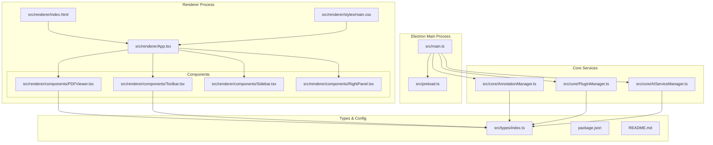
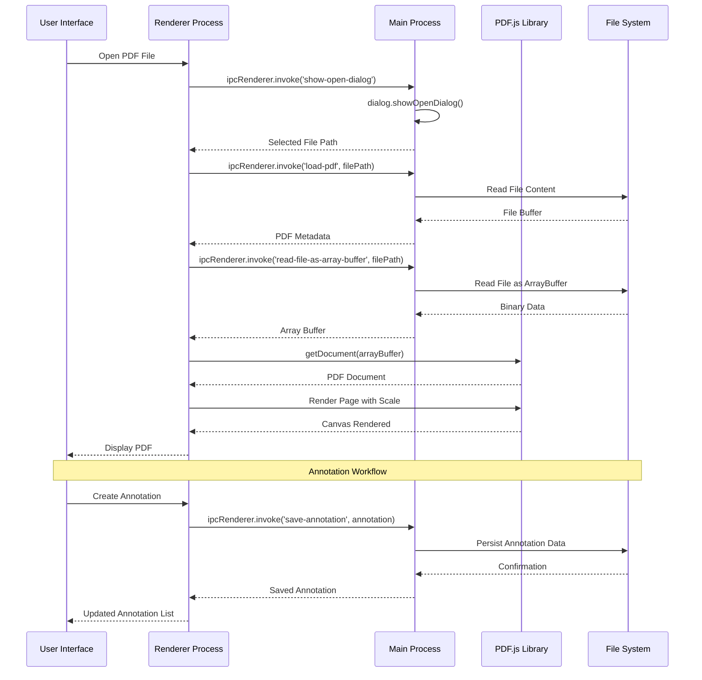
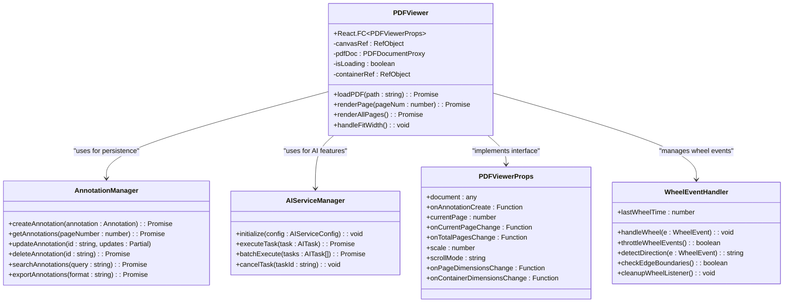
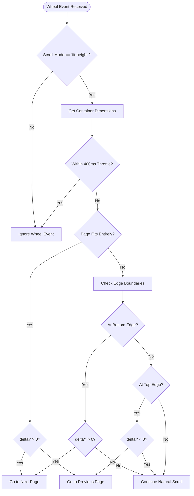
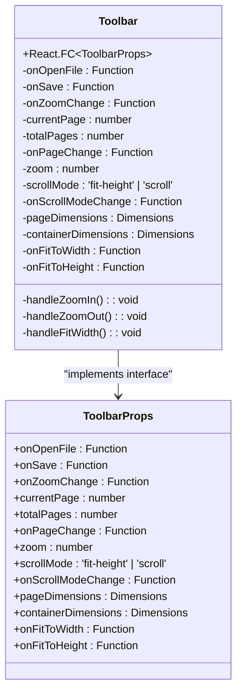
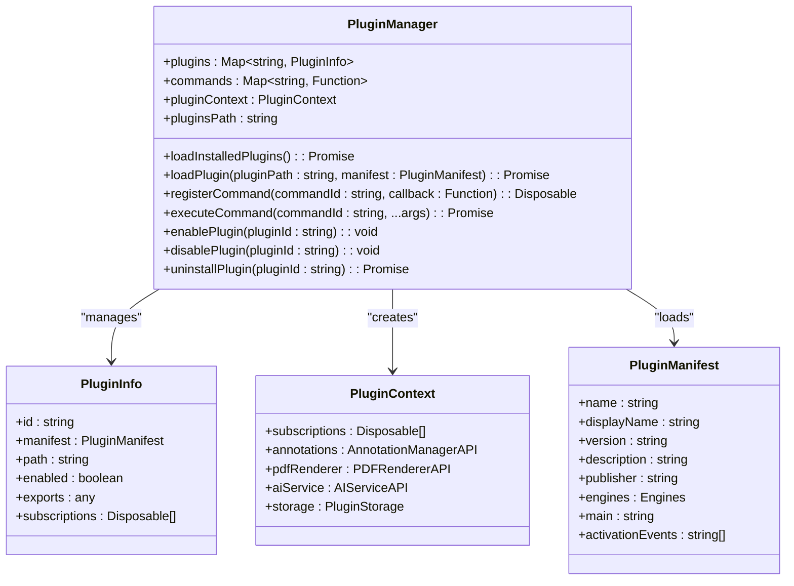
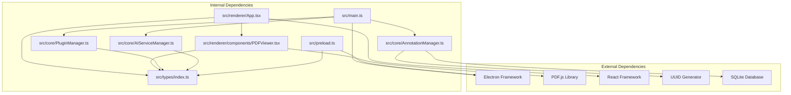

# PDF Viewer Enhancement

<cite>
**Referenced Files in This Document**
- [README.md](file://README.md)
- [package.json](file://package.json)
- [src/main.ts](file://src/main.ts)
- [src/preload.ts](file://src/preload.ts)
- [src/renderer/App.tsx](file://src/renderer/App.tsx)
- [src/renderer/components/PDFViewer.tsx](file://src/renderer/components/PDFViewer.tsx)
- [src/renderer/components/Toolbar.tsx](file://src/renderer/components/Toolbar.tsx)
- [src/renderer/components/Sidebar.tsx](file://src/renderer/components/Sidebar.tsx)
- [src/renderer/components/RightPanel.tsx](file://src/renderer/components/RightPanel.tsx)
- [src/renderer/styles/main.css](file://src/renderer/styles/main.css)
- [src/renderer/index.html](file://src/renderer/index.html)
- [src/core/AnnotationManager.ts](file://src/core/AnnotationManager.ts)
- [src/core/PluginManager.ts](file://src/core/PluginManager.ts)
- [src/core/AIServiceManager.ts](file://src/core/AIServiceManager.ts)
- [src/types/index.ts](file://src/types/index.ts)
</cite>

## Update Summary
**Changes Made**
- Updated PDF Viewer component documentation to reflect intelligent wheel event handling for single-page scrolling mode
- Added detailed explanation of sophisticated wheel event management with throttling, directional detection, and edge boundary checking
- Enhanced component interaction diagrams to show new wheel event handling functionality
- Updated performance considerations section to include wheel event throttling and cleanup mechanisms
- Clarified that wheel event handling is automatically managed and requires no user interaction

## Table of Contents
1. [Introduction](#introduction)
2. [Project Structure](#project-structure)
3. [Core Components](#core-components)
4. [Architecture Overview](#architecture-overview)
5. [Detailed Component Analysis](#detailed-component-analysis)
6. [Dependency Analysis](#dependency-analysis)
7. [Performance Considerations](#performance-considerations)
8. [Troubleshooting Guide](#troubleshooting-guide)
9. [Conclusion](#conclusion)

## Introduction
This document provides a comprehensive analysis of the SciPDFReader PDF Viewer Enhancement project. SciPDFReader is a modern, extensible PDF reader built on Electron with React, featuring AI-powered annotation capabilities and a plugin architecture inspired by VS Code. The project emphasizes cross-platform compatibility, extensibility, and intelligent document interaction through AI services.

The enhancement focuses on improving the PDF viewing experience, annotation system, AI integration, and plugin extensibility. The application supports high-quality PDF rendering via PDF.js, interactive annotation creation and management, AI-driven translation and summarization, and a flexible plugin system for extending functionality.

**Section sources**
- [README.md:1-207](file://README.md#L1-L207)

## Project Structure
The project follows a clear separation of concerns with distinct modules for the main Electron process, renderer React components, core services, and type definitions. The structure promotes maintainability and scalability while supporting the plugin architecture.

**Diagram sources**
- [src/main.ts:1-160](file://src/main.ts#L1-L160)
- [src/preload.ts:1-35](file://src/preload.ts#L1-L35)
- [src/renderer/App.tsx:1-297](file://src/renderer/App.tsx#L1-L297)
- [src/renderer/components/PDFViewer.tsx:1-345](file://src/renderer/components/PDFViewer.tsx#L1-L345)
- [src/core/AnnotationManager.ts:1-172](file://src/core/AnnotationManager.ts#L1-L172)
- [src/core/PluginManager.ts:1-250](file://src/core/PluginManager.ts#L1-L250)
- [src/core/AIServiceManager.ts:1-214](file://src/core/AIServiceManager.ts#L1-L214)
- [src/types/index.ts:1-224](file://src/types/index.ts#L1-L224)

**Section sources**
- [README.md:24-40](file://README.md#L24-L40)
- [package.json:1-67](file://package.json#L1-L67)

## Core Components
The application's functionality is built around several core components that work together to provide a seamless PDF reading experience:

### Annotation Management System
The AnnotationManager provides comprehensive annotation handling with support for multiple annotation types, persistence, and export capabilities. It manages different annotation types including highlights, underlines, notes, translations, and background information.

### Plugin Architecture
The PluginManager implements a VS Code-inspired plugin system that allows third-party extensions to enhance functionality. Plugins can register commands, annotation types, and AI services, creating a flexible ecosystem for extending the application.

### AI Service Integration
The AIServiceManager coordinates AI-powered features including translation, summarization, background information retrieval, and keyword extraction. It supports multiple providers (OpenAI, Azure, local models) and provides a unified interface for AI operations.

### PDF Rendering Engine
Built on PDF.js, the PDFViewer component handles document loading, page rendering, zoom controls, and scroll modes. It supports both single-page and continuous scrolling modes with responsive scaling and intelligent wheel event handling for enhanced user experience.

**Section sources**
- [src/core/AnnotationManager.ts:1-172](file://src/core/AnnotationManager.ts#L1-L172)
- [src/core/PluginManager.ts:1-250](file://src/core/PluginManager.ts#L1-L250)
- [src/core/AIServiceManager.ts:1-214](file://src/core/AIServiceManager.ts#L1-L214)
- [src/renderer/components/PDFViewer.tsx:1-345](file://src/renderer/components/PDFViewer.tsx#L1-L345)

## Architecture Overview
The application follows a client-server architecture pattern with Electron's main and renderer processes communicating through IPC channels. The design emphasizes separation of concerns and modularity.

**Diagram sources**
- [src/main.ts:90-125](file://src/main.ts#L90-L125)
- [src/preload.ts:5-34](file://src/preload.ts#L5-L34)
- [src/renderer/App.tsx:56-70](file://src/renderer/App.tsx#L56-L70)
- [src/renderer/components/PDFViewer.tsx:46-78](file://src/renderer/components/PDFViewer.tsx#L46-L78)

The architecture ensures secure communication between processes while maintaining performance through efficient data handling and rendering optimization.

**Section sources**
- [src/main.ts:1-160](file://src/main.ts#L1-L160)
- [src/preload.ts:1-35](file://src/preload.ts#L1-L35)

## Detailed Component Analysis

### PDF Viewer Component
The PDFViewer component serves as the core rendering engine, implementing sophisticated page management and user interaction handling with intelligent wheel event processing.

**Updated** The PDFViewer now includes advanced wheel event handling for single-page scrolling mode with intelligent page navigation:

**Diagram sources**
- [src/renderer/components/PDFViewer.tsx:19-345](file://src/renderer/components/PDFViewer.tsx#L19-L345)
- [src/core/AnnotationManager.ts:46-84](file://src/core/AnnotationManager.ts#L46-L84)
- [src/core/AIServiceManager.ts:13-56](file://src/core/AIServiceManager.ts#L13-L56)

The component implements responsive design with dynamic scaling, supports multiple rendering modes, integrates with the annotation system for collaborative document editing, and features intelligent wheel event handling for enhanced single-page navigation.

**Section sources**
- [src/renderer/components/PDFViewer.tsx:19-345](file://src/renderer/components/PDFViewer.tsx#L19-L345)

### Wheel Event Handling System
**New** The PDFViewer now includes sophisticated wheel event management for single-page scrolling mode:

#### Intelligent Page Navigation Logic
The wheel event handler implements a multi-layered approach to determine when to navigate between pages:

1. **Throttling Mechanism**: Prevents rapid successive page changes with a 400ms cooldown period
2. **Page Fit Detection**: Determines if the current page fits entirely within the viewport
3. **Edge Boundary Checking**: Identifies when the user has reached the top or bottom edge of a scrollable page
4. **Directional Detection**: Uses deltaY values to determine scroll direction
5. **Boundary Buffer System**: Accounts for minor scroll inaccuracies with 10px tolerance

#### Wheel Event Processing Flow

**Diagram sources**
- [src/renderer/components/PDFViewer.tsx:156-212](file://src/renderer/components/PDFViewer.tsx#L156-L212)

#### Cleanup and Resource Management
The wheel event handler includes proper cleanup mechanisms:
- Automatic removal of event listeners on component unmount
- Prevention of memory leaks through proper event listener cleanup
- Safe handling of edge cases during component lifecycle

**Section sources**
- [src/renderer/components/PDFViewer.tsx:156-212](file://src/renderer/components/PDFViewer.tsx#L156-L212)

### Toolbar Component
The Toolbar component provides the primary user interface controls for PDF navigation and viewing options. **Updated** The toolbar interface has been simplified with certain controls moved to alternative locations while maintaining full functionality.

**Diagram sources**
- [src/renderer/components/Toolbar.tsx:3-17](file://src/renderer/components/Toolbar.tsx#L3-L17)
- [src/renderer/components/Toolbar.tsx:19-208](file://src/renderer/components/Toolbar.tsx#L19-L208)

**Updated** The toolbar now features a streamlined interface with:
- File operations (Open, Save)
- Navigation controls (Previous, Next page)
- Zoom controls (Zoom In, Zoom Out, Zoom selection)
- View options accessible through dropdown menu
- Annotation tools (Highlight, Underline, Note, Translate)

**Section sources**
- [src/renderer/components/Toolbar.tsx:19-208](file://src/renderer/components/Toolbar.tsx#L19-L208)

### Annotation Management System
The AnnotationManager provides a comprehensive solution for annotation persistence, retrieval, and export functionality.

**Diagram sources**
- [src/core/AnnotationManager.ts:46-172](file://src/core/AnnotationManager.ts#L46-L172)

The system supports multiple export formats and maintains data integrity through proper error handling and validation.

**Section sources**
- [src/core/AnnotationManager.ts:1-172](file://src/core/AnnotationManager.ts#L1-L172)

### Plugin Architecture Implementation
The PluginManager implements a sophisticated plugin system that enables third-party extensions to enhance functionality.

**Diagram sources**
- [src/core/PluginManager.ts:16-250](file://src/core/PluginManager.ts#L16-L250)

The plugin system supports dynamic loading, command registration, and lifecycle management for extensions.

**Section sources**
- [src/core/PluginManager.ts:1-250](file://src/core/PluginManager.ts#L1-L250)

### AI Service Integration
The AIServiceManager provides a unified interface for AI-powered document processing with support for multiple providers and task types.

**Diagram sources**
- [src/core/AIServiceManager.ts:13-214](file://src/core/AIServiceManager.ts#L13-L214)

The system supports batch processing, task cancellation, and provider abstraction for flexible AI integration.

**Section sources**
- [src/core/AIServiceManager.ts:1-214](file://src/core/AIServiceManager.ts#L1-L214)

## Dependency Analysis
The project maintains clean dependency boundaries with clear interfaces between components, promoting maintainability and testability.

**Diagram sources**
- [package.json:38-44](file://package.json#L38-L44)
- [src/main.ts:1-160](file://src/main.ts#L1-L160)
- [src/core/AnnotationManager.ts:1-172](file://src/core/AnnotationManager.ts#L1-L172)
- [src/core/PluginManager.ts:1-250](file://src/core/PluginManager.ts#L1-L250)
- [src/core/AIServiceManager.ts:1-214](file://src/core/AIServiceManager.ts#L1-L214)

The dependency graph shows a well-structured architecture with minimal circular dependencies and clear separation of concerns.

**Section sources**
- [package.json:1-67](file://package.json#L1-L67)

## Performance Considerations
The application implements several performance optimization strategies:

### Rendering Optimization
- PDF.js worker utilization for background processing
- Efficient canvas rendering with proper memory management
- Lazy loading of PDF pages based on scroll position
- Responsive scaling calculations to minimize reflows

### Memory Management
- Proper cleanup of event listeners and observers
- Efficient annotation data structures using Maps
- Conditional rendering based on component state
- Cleanup of PDF rendering contexts
- **Updated** Intelligent wheel event throttling prevents excessive page navigation requests
- **Updated** Edge boundary detection reduces unnecessary page changes

### Network and I/O Optimization
- Buffered file reading for large PDFs
- Caching mechanisms for frequently accessed data
- Asynchronous operations to prevent UI blocking
- Efficient IPC communication patterns

### Wheel Event Performance
**New** The wheel event handling system includes several performance optimizations:
- 400ms throttle prevents rapid successive page changes
- Edge boundary checking avoids unnecessary DOM operations
- Directional detection uses efficient delta comparison
- Cleanup mechanisms prevent memory leaks
- Passive event listeners with manual prevention for optimal performance

## Troubleshooting Guide
Common issues and their solutions:

### PDF Loading Issues
- Verify PDF.js worker path configuration
- Check file permissions and accessibility
- Ensure proper MIME type handling
- Validate PDF file integrity

### Annotation Persistence Problems
- Confirm data directory creation and permissions
- Check JSON serialization/deserialization
- Verify UUID generation and collision handling
- Monitor file system write operations

### Plugin Loading Failures
- Validate plugin manifest structure
- Check activation event conditions
- Verify dependency resolution
- Monitor plugin lifecycle hooks

### AI Service Integration Issues
- Validate API key configuration
- Check network connectivity
- Monitor rate limiting and quotas
- Verify task queue management

### Wheel Event Handling Issues
**New** Common wheel event handling problems and solutions:
- **Issue**: Wheel events not triggering page navigation
  - **Solution**: Ensure scroll mode is set to 'fit-height'
  - **Solution**: Verify container element has proper dimensions
  - **Solution**: Check browser compatibility with wheel events

- **Issue**: Excessive page navigation with rapid scrolling
  - **Solution**: Adjust throttle timing in wheel event handler
  - **Solution**: Verify edge boundary detection logic

- **Issue**: Wheel events not being cleaned up properly
  - **Solution**: Check component unmount lifecycle
  - **Solution**: Verify event listener removal in cleanup function

- **Issue**: Page navigation conflicts with natural scrolling
  - **Solution**: Adjust edge boundary thresholds
  - **Solution**: Fine-tune directional detection sensitivity

**Section sources**
- [src/renderer/components/PDFViewer.tsx:74-78](file://src/renderer/components/PDFViewer.tsx#L74-L78)
- [src/core/AnnotationManager.ts:153-170](file://src/core/AnnotationManager.ts#L153-L170)
- [src/core/PluginManager.ts:60-69](file://src/core/PluginManager.ts#L60-L69)
- [src/renderer/components/PDFViewer.tsx:156-212](file://src/renderer/components/PDFViewer.tsx#L156-L212)

## Conclusion
The SciPDFReader PDF Viewer Enhancement project demonstrates a sophisticated approach to building modern desktop applications with AI integration and extensibility. The architecture successfully balances functionality, performance, and maintainability through careful design decisions and modular component organization.

Key strengths of the implementation include:
- Clean separation of concerns between main and renderer processes
- Comprehensive plugin architecture supporting third-party extensions
- Robust annotation system with multiple export formats
- Flexible AI service integration with multiple provider support
- Responsive PDF rendering with advanced scaling capabilities
- **Updated** Intelligent wheel event handling for enhanced single-page navigation experience

The project provides an excellent foundation for further enhancements, particularly in areas such as advanced PDF parsing, collaborative annotation features, expanded AI capabilities, and refined user interaction patterns. The modular design ensures that future improvements can be integrated seamlessly without disrupting existing functionality.

**Updated** The addition of intelligent wheel event handling significantly enhances the user experience in single-page scrolling mode by providing smooth, responsive page navigation with sophisticated edge detection and throttling mechanisms. The wheel event system operates transparently without requiring user intervention, automatically managing page transitions based on scroll behavior and viewport boundaries.