# Plugin Manager

<cite>
**Referenced Files in This Document**
- [PluginManager.ts](file://src/core/PluginManager.ts)
- [AnnotationManager.ts](file://src/core/AnnotationManager.ts)
- [AIServiceManager.ts](file://src/core/AIServiceManager.ts)
- [index.ts](file://src/types/index.ts)
- [main.ts](file://src/main.ts)
- [preload.ts](file://src/preload.ts)
- [PLUGIN-GUIDE.md](file://PLUGIN-GUIDE.md)
- [README.md](file://README.md)
- [DESIGN.md](file://DESIGN.md)
</cite>

## Table of Contents
1. [Introduction](#introduction)
2. [Project Structure](#project-structure)
3. [Core Components](#core-components)
4. [Architecture Overview](#architecture-overview)
5. [Detailed Component Analysis](#detailed-component-analysis)
6. [Dependency Analysis](#dependency-analysis)
7. [Performance Considerations](#performance-considerations)
8. [Security Considerations](#security-considerations)
9. [Troubleshooting Guide](#troubleshooting-guide)
10. [Conclusion](#conclusion)
11. [Appendices](#appendices)

## Introduction
This document explains the Plugin Manager component of SciPDFReader, focusing on plugin discovery, loading, lifecycle management, and the PluginContext API surface. It covers how plugins interact with core services (AnnotationManager and AIServiceManager), the command registration system, activation/deactivation and resource cleanup, the plugin manifest system, and security considerations. Practical development patterns and integration examples are included to help developers build robust plugins.

## Project Structure
SciPDFReader follows a layered architecture with Electron’s main process coordinating core services and the renderer process handling UI. The Plugin Manager resides in the core layer alongside AnnotationManager and AIServiceManager. The preload script exposes a minimal IPC surface to the renderer, while the main process initializes services and loads plugins.

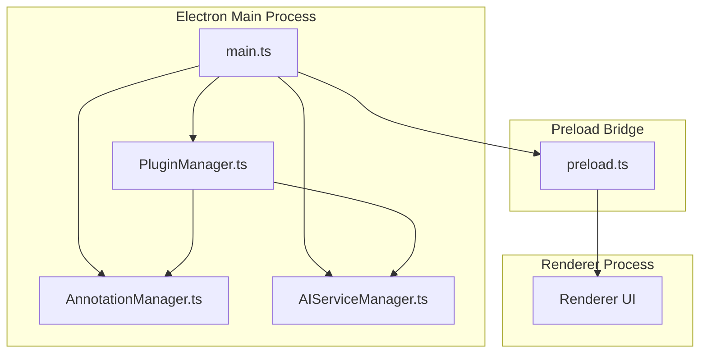

**Diagram sources**
- [main.ts:45-60](file://src/main.ts#L45-L60)
- [PluginManager.ts:15-35](file://src/core/PluginManager.ts#L15-L35)
- [AnnotationManager.ts:6-19](file://src/core/AnnotationManager.ts#L6-L19)
- [AIServiceManager.ts:3-11](file://src/core/AIServiceManager.ts#L3-L11)
- [preload.ts:1-34](file://src/preload.ts#L1-L34)

**Section sources**
- [main.ts:13-60](file://src/main.ts#L13-L60)
- [README.md:13-29](file://README.md#L13-L29)

## Core Components
- PluginManager: Discovers, loads, activates, and manages plugins; exposes PluginContext to plugins; handles enable/disable/uninstall; registers commands.
- AnnotationManager: Manages annotations, persistence, and exports; exposed to plugins via PluginContext.annotations.
- AIServiceManager: Provides AI task execution, batching, cancellation, and status; exposed to plugins via PluginContext.aiService.
- PluginContext: The API surface provided to plugins, including annotations, pdfRenderer, aiService, storage, and subscriptions for lifecycle management.
- Types: Defines PluginManifest, PluginContext, APIs, and data structures used across components.

Key responsibilities:
- Discovery: Scans user data directory for plugin folders and loads package.json manifests.
- Activation: Calls plugin.activate(context) when activation events match.
- Lifecycle: Supports enable/disable and uninstall with resource cleanup.
- Commands: Registers and executes commands from plugins.
- Security: Uses Electron’s contextIsolation and preload bridge to limit renderer access.

**Section sources**
- [PluginManager.ts:48-104](file://src/core/PluginManager.ts#L48-L104)
- [PluginManager.ts:106-118](file://src/core/PluginManager.ts#L106-L118)
- [PluginManager.ts:120-142](file://src/core/PluginManager.ts#L120-L142)
- [PluginManager.ts:144-190](file://src/core/PluginManager.ts#L144-L190)
- [index.ts:86-103](file://src/types/index.ts#L86-L103)
- [index.ts:136-142](file://src/types/index.ts#L136-L142)

## Architecture Overview
The Plugin Manager orchestrates plugin lifecycle and exposes a controlled API surface to plugins. It integrates with AnnotationManager and AIServiceManager to provide annotation and AI capabilities. The main process initializes services and triggers plugin discovery upon startup.

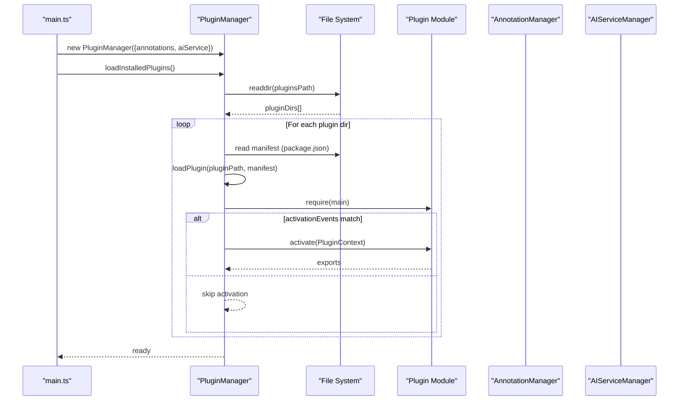

**Diagram sources**
- [main.ts:45-60](file://src/main.ts#L45-L60)
- [PluginManager.ts:48-104](file://src/core/PluginManager.ts#L48-L104)

**Section sources**
- [main.ts:45-60](file://src/main.ts#L45-L60)
- [PluginManager.ts:37-46](file://src/core/PluginManager.ts#L37-L46)
- [PluginManager.ts:71-104](file://src/core/PluginManager.ts#L71-L104)

## Detailed Component Analysis

### Plugin Discovery and Loading
- Discovery path: User data directory under a platform-appropriate path; default subfolder for plugins.
- Directory scanning: Reads plugin directories and looks for package.json manifest.
- Manifest parsing: Validates engine compatibility and resolves main entry point.
- Module loading: Dynamically requires the plugin’s main entry point.
- Activation gating: Respects activationEvents; supports wildcard and startup completion events.

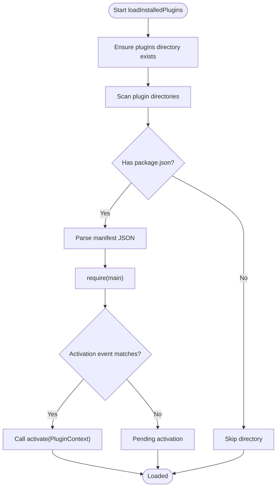

**Diagram sources**
- [PluginManager.ts:48-104](file://src/core/PluginManager.ts#L48-L104)

**Section sources**
- [PluginManager.ts:37-46](file://src/core/PluginManager.ts#L37-L46)
- [PluginManager.ts:48-69](file://src/core/PluginManager.ts#L48-L69)
- [PluginManager.ts:71-104](file://src/core/PluginManager.ts#L71-L104)

### Plugin Lifecycle Management
- Enable/Disable: Updates plugin.enabled flag and re-activates on enable; calls deactivate and disposes subscriptions on disable.
- Uninstall: Disables plugin, removes plugin directory from disk, and deletes plugin entry.
- Resource cleanup: Iterates subscriptions and calls dispose() during disable.

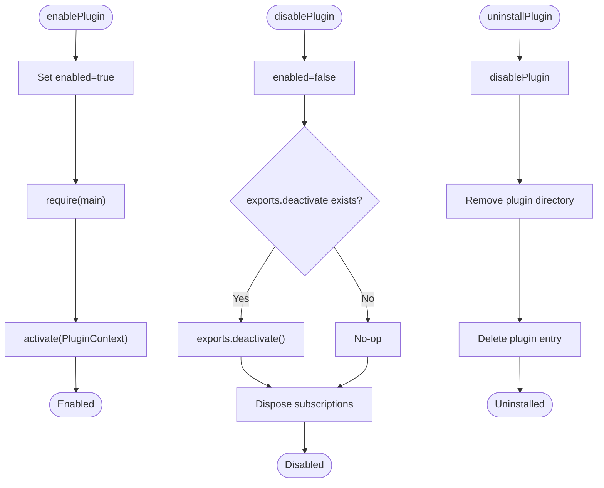

**Diagram sources**
- [PluginManager.ts:144-190](file://src/core/PluginManager.ts#L144-L190)

**Section sources**
- [PluginManager.ts:144-190](file://src/core/PluginManager.ts#L144-L190)

### Plugin API Exposure via PluginContext
The PluginContext exposes:
- annotations: CRUD and search/export for annotations.
- aiService: initialize, executeTask, batchExecute, cancelTask.
- pdfRenderer: placeholder API for document operations.
- storage: plugin-scoped storage helpers.
- subscriptions: lifecycle management for disposables.

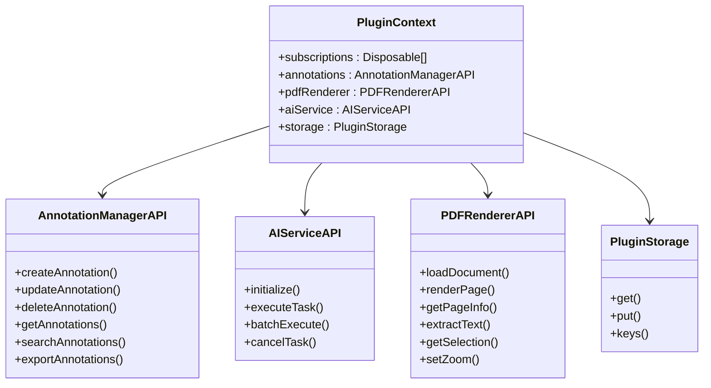

**Diagram sources**
- [index.ts:136-177](file://src/types/index.ts#L136-L177)
- [PluginManager.ts:202-245](file://src/core/PluginManager.ts#L202-L245)

**Section sources**
- [index.ts:136-177](file://src/types/index.ts#L136-L177)
- [PluginManager.ts:28-34](file://src/core/PluginManager.ts#L28-L34)
- [PluginManager.ts:202-245](file://src/core/PluginManager.ts#L202-L245)

### Command Registration System
- Registration: Plugins register commands via PluginContext; PluginManager stores them in a Map keyed by commandId.
- Execution: The main process exposes an IPC handler to register commands; renderer can call registerCommand via preload.
- Invocation: PluginManager.executeCommand(commandId, ...args) invokes the stored callback.

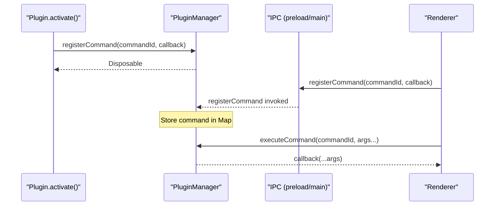

**Diagram sources**
- [PluginManager.ts:120-142](file://src/core/PluginManager.ts#L120-L142)
- [main.ts:144-149](file://src/main.ts#L144-L149)
- [preload.ts:25-28](file://src/preload.ts#L25-L28)

**Section sources**
- [PluginManager.ts:120-142](file://src/core/PluginManager.ts#L120-L142)
- [main.ts:144-149](file://src/main.ts#L144-L149)
- [preload.ts:25-28](file://src/preload.ts#L25-L28)

### Plugin Activation and Deactivation
- Activation: When activationEvents match, PluginManager calls pluginModule.activate(PluginContext) and stores exports.
- Deactivation: On disable, if exports.deactivate exists, it is invoked; subscriptions are disposed.
- Startup events: Supports wildcard and onStartupFinished activation events.

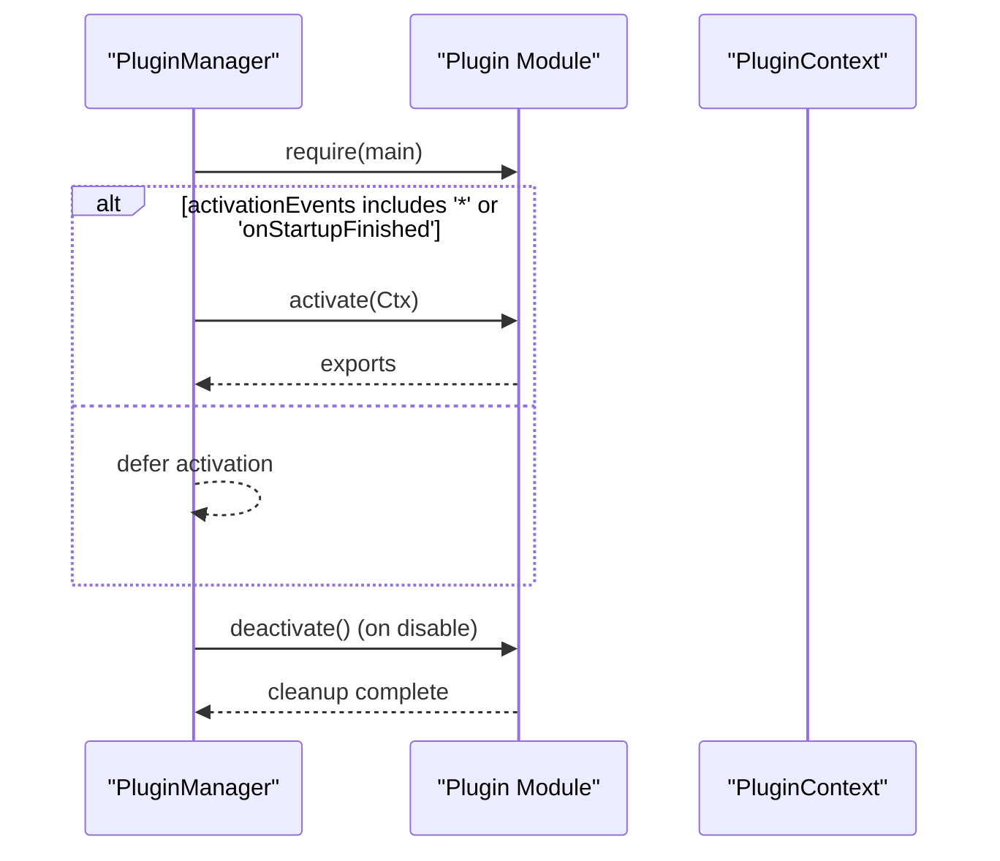

**Diagram sources**
- [PluginManager.ts:94-97](file://src/core/PluginManager.ts#L94-L97)
- [PluginManager.ts:112-117](file://src/core/PluginManager.ts#L112-L117)
- [PluginManager.ts:165-171](file://src/core/PluginManager.ts#L165-L171)

**Section sources**
- [PluginManager.ts:94-97](file://src/core/PluginManager.ts#L94-L97)
- [PluginManager.ts:112-117](file://src/core/PluginManager.ts#L112-L117)
- [PluginManager.ts:165-171](file://src/core/PluginManager.ts#L165-L171)

### Plugin Manifest System and Metadata Parsing
- Manifest fields: name, displayName, version, description, publisher, engines (scipdfreader), main, contributes (annotations, aiServices, commands, menus), activationEvents.
- Contributes: Used by plugin authors to declare UI contributions and capabilities; PluginManager currently focuses on activation and command registration.

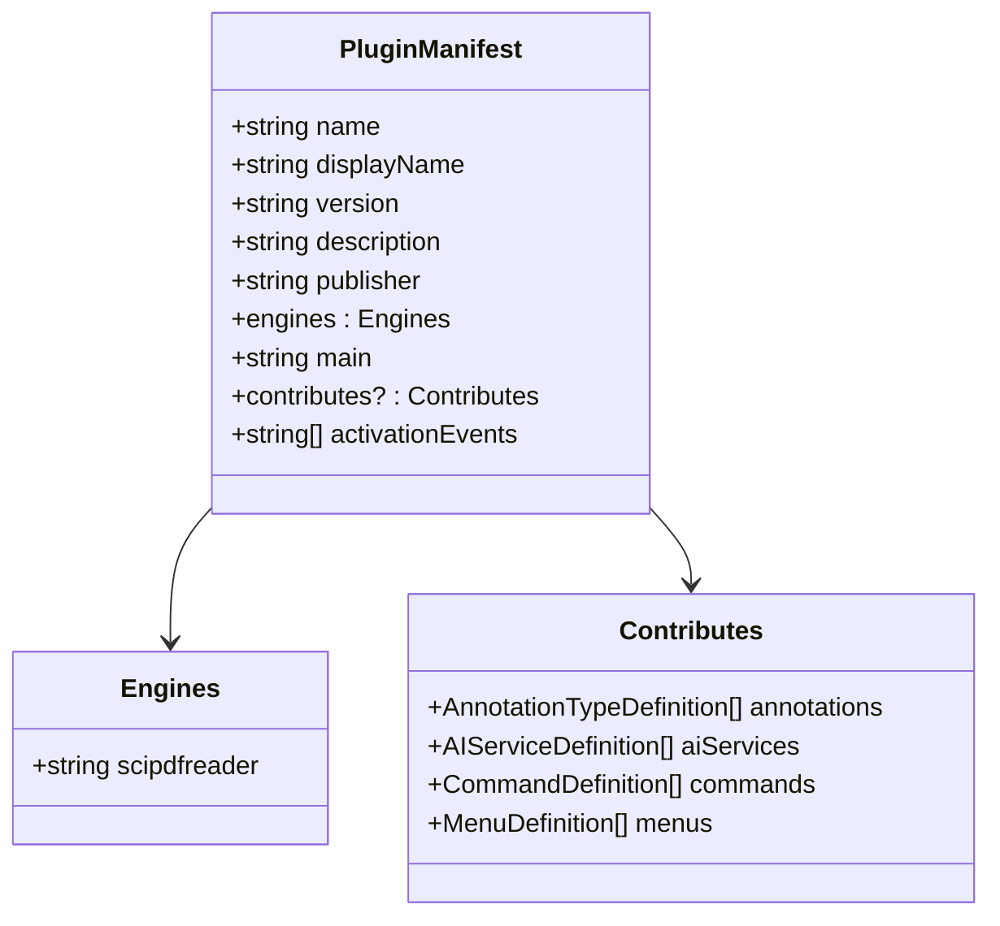

**Diagram sources**
- [index.ts:86-103](file://src/types/index.ts#L86-L103)
- [index.ts:112-134](file://src/types/index.ts#L112-L134)

**Section sources**
- [index.ts:86-103](file://src/types/index.ts#L86-L103)
- [PLUGIN-GUIDE.md:65-97](file://PLUGIN-GUIDE.md#L65-L97)

### Integration with AnnotationManager and AIServiceManager
- Annotation API: PluginManager wraps AnnotationManager methods for create/update/delete/get/search/export.
- AI Service API: PluginManager wraps AIServiceManager initialize/executeTask/batchExecute/cancelTask.
- PDF Renderer API: Placeholder API is exposed; actual implementation is pending.

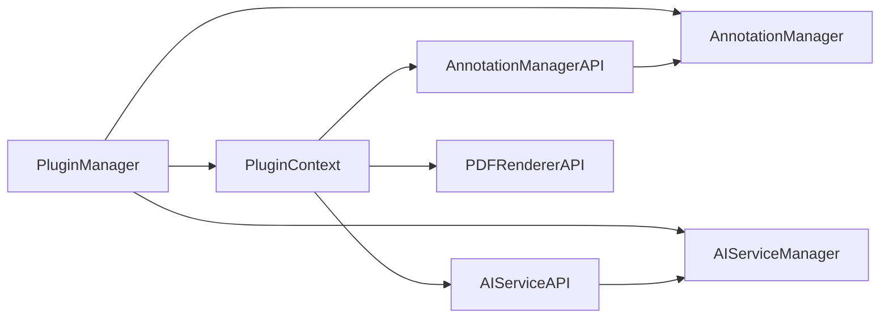

**Diagram sources**
- [PluginManager.ts:202-232](file://src/core/PluginManager.ts#L202-L232)
- [AnnotationManager.ts:46-112](file://src/core/AnnotationManager.ts#L46-L112)
- [AIServiceManager.ts:8-82](file://src/core/AIServiceManager.ts#L8-L82)

**Section sources**
- [PluginManager.ts:202-232](file://src/core/PluginManager.ts#L202-L232)
- [AnnotationManager.ts:46-112](file://src/core/AnnotationManager.ts#L46-L112)
- [AIServiceManager.ts:8-82](file://src/core/AIServiceManager.ts#L8-L82)

### Practical Plugin Development Patterns
- Activation pattern: Implement activate(context) to register commands and annotation types; push disposables into context.subscriptions.
- Command usage: Use context.pdfRenderer.getSelection(), context.annotations.createAnnotation(), and context.aiService.executeTask().
- Example patterns: Translation plugin, background info plugin, and summary generator demonstrate typical workflows.

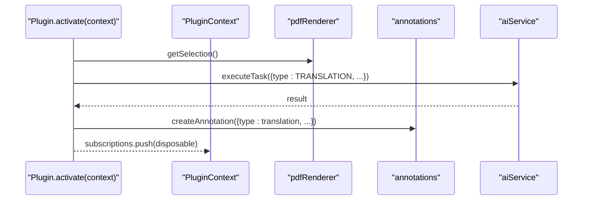

**Diagram sources**
- [PLUGIN-GUIDE.md:249-276](file://PLUGIN-GUIDE.md#L249-L276)

**Section sources**
- [PLUGIN-GUIDE.md:99-140](file://PLUGIN-GUIDE.md#L99-L140)
- [PLUGIN-GUIDE.md:242-359](file://PLUGIN-GUIDE.md#L242-L359)

## Dependency Analysis
- Internal dependencies:
  - PluginManager depends on AnnotationManager and AIServiceManager for API exposure.
  - PluginManager constructs PluginContext with these dependencies.
- External dependencies:
  - Node.js fs and path for filesystem operations.
  - Electron main/preload for IPC and security model.
- Coupling:
  - Low coupling via typed APIs (AnnotationManagerAPI, AIServiceAPI).
  - Cohesion: PluginManager encapsulates discovery, activation, and lifecycle.

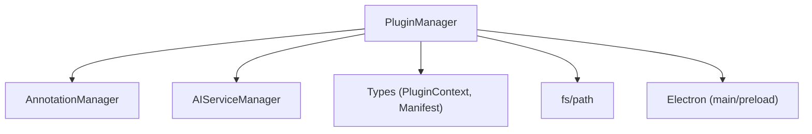

**Diagram sources**
- [PluginManager.ts:1-6](file://src/core/PluginManager.ts#L1-L6)
- [main.ts:4-6](file://src/main.ts#L4-L6)
- [preload.ts:1](file://src/preload.ts#L1)

**Section sources**
- [PluginManager.ts:1-6](file://src/core/PluginManager.ts#L1-L6)
- [main.ts:4-6](file://src/main.ts#L4-L6)
- [preload.ts:1](file://src/preload.ts#L1)

## Performance Considerations
- Lazy activation: Respect activationEvents to avoid heavy work at startup.
- Batch operations: Use AIServiceManager.batchExecute for multiple tasks.
- Resource cleanup: Ensure subscriptions are disposed to prevent memory leaks.
- Storage: Use PluginManager.createPluginStorage for lightweight plugin-scoped persistence.

[No sources needed since this section provides general guidance]

## Security Considerations
- Sandboxing: Electron’s contextIsolation is enabled; preload exposes only whitelisted IPC methods.
- Permission management: Renderer cannot directly access Node APIs; all operations go through IPC handlers.
- Safe execution: Plugins run in-process; future enhancements could consider sandboxing or separate processes.
- Data isolation: Plugin storage is scoped; annotations and AI operations are mediated by managers.

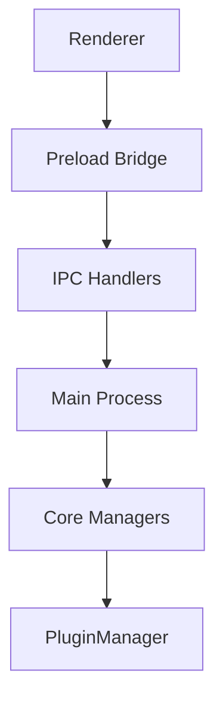

**Diagram sources**
- [main.ts:18-27](file://src/main.ts#L18-L27)
- [preload.ts:5-33](file://src/preload.ts#L5-L33)
- [main.ts:144-155](file://src/main.ts#L144-L155)

**Section sources**
- [main.ts:18-27](file://src/main.ts#L18-L27)
- [preload.ts:5-33](file://src/preload.ts#L5-L33)
- [DESIGN.md:562-566](file://DESIGN.md#L562-L566)

## Troubleshooting Guide
- Plugin fails to load:
  - Verify manifest exists and is valid JSON.
  - Ensure main entry point resolves correctly.
  - Check activationEvents; wildcard or onStartupFinished required for immediate activation.
- Command not found:
  - Confirm commandId is registered and not overwritten.
  - Ensure executeCommand is called with correct arguments.
- Annotation/AI failures:
  - Verify AnnotationManager and AIServiceManager are initialized before plugin activation.
  - Check that PluginContext was passed to activate.

**Section sources**
- [PluginManager.ts:60-66](file://src/core/PluginManager.ts#L60-L66)
- [PluginManager.ts:134-142](file://src/core/PluginManager.ts#L134-L142)
- [main.ts:45-60](file://src/main.ts#L45-L60)

## Conclusion
The Plugin Manager provides a robust foundation for extending SciPDFReader with plugins. It supports discovery, controlled activation, command registration, and lifecycle management while exposing safe, typed APIs to plugins. Integration with AnnotationManager and AIServiceManager enables powerful annotation and AI workflows. Future enhancements can focus on sandboxing, marketplace integration, and richer UI contribution models.

[No sources needed since this section summarizes without analyzing specific files]

## Appendices

### Appendix A: Plugin Manifest Fields Reference
- name, displayName, version, description, publisher
- engines.scipdfreader
- main
- contributes.annotations, contributes.aiServices, contributes.commands, contributes.menus
- activationEvents

**Section sources**
- [index.ts:86-103](file://src/types/index.ts#L86-L103)
- [PLUGIN-GUIDE.md:65-97](file://PLUGIN-GUIDE.md#L65-L97)

### Appendix B: PluginContext API Reference
- annotations: createAnnotation, updateAnnotation, deleteAnnotation, getAnnotations, searchAnnotations, exportAnnotations
- aiService: initialize, executeTask, batchExecute, cancelTask
- pdfRenderer: loadDocument, renderPage, getPageInfo, extractText, getSelection, setZoom
- storage: get, put, keys
- subscriptions: Disposable[] for lifecycle

**Section sources**
- [index.ts:136-177](file://src/types/index.ts#L136-L177)
- [PluginManager.ts:202-245](file://src/core/PluginManager.ts#L202-L245)