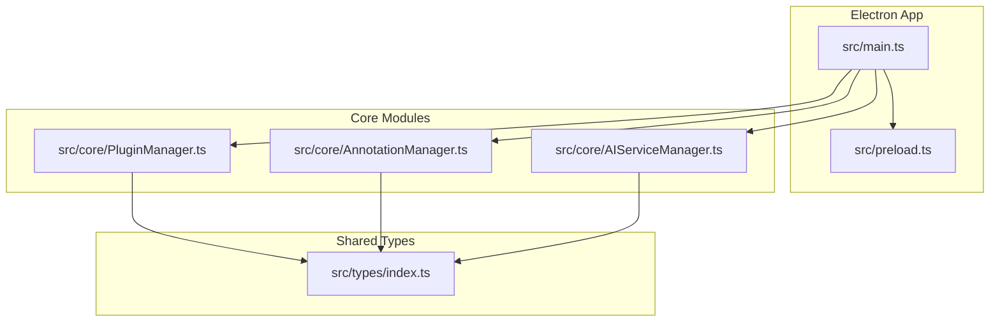
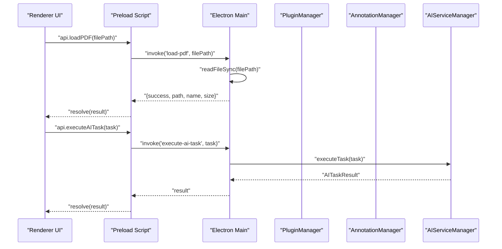
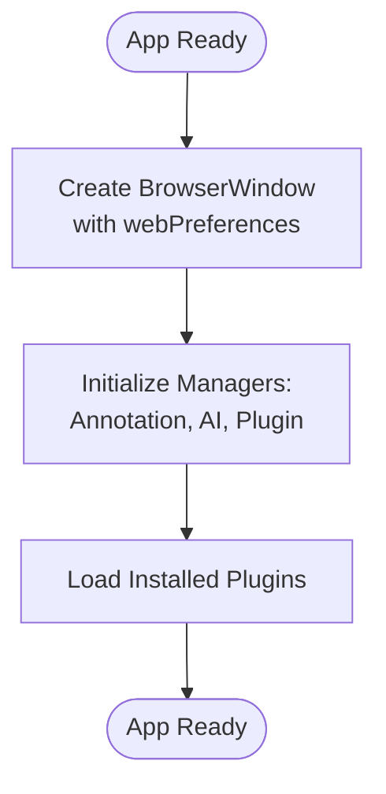
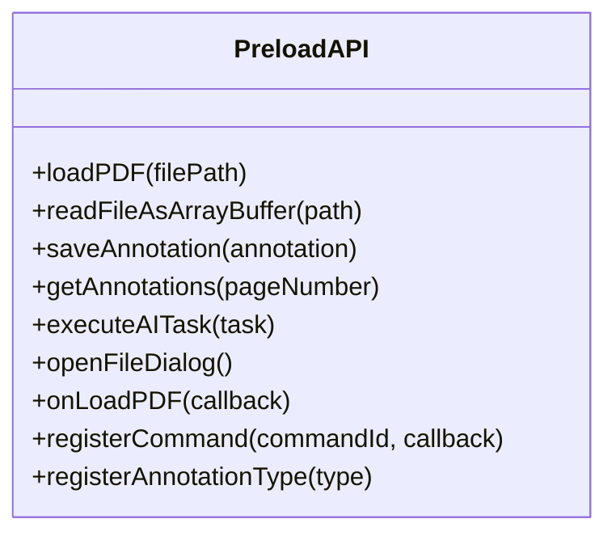
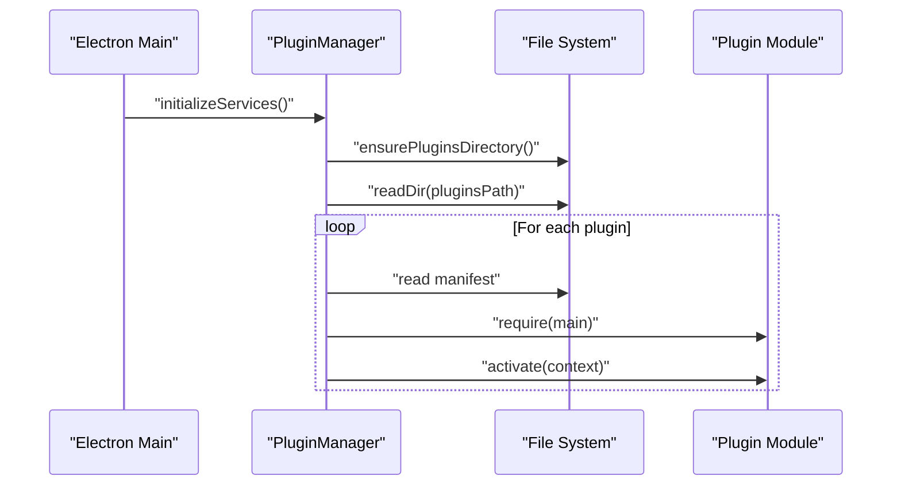
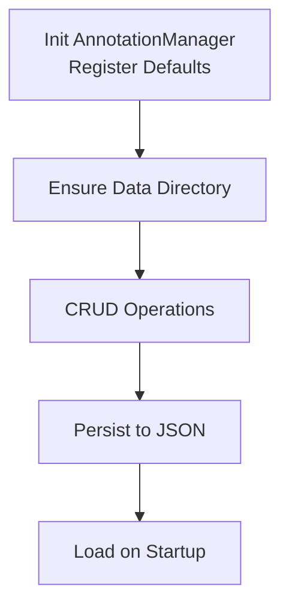
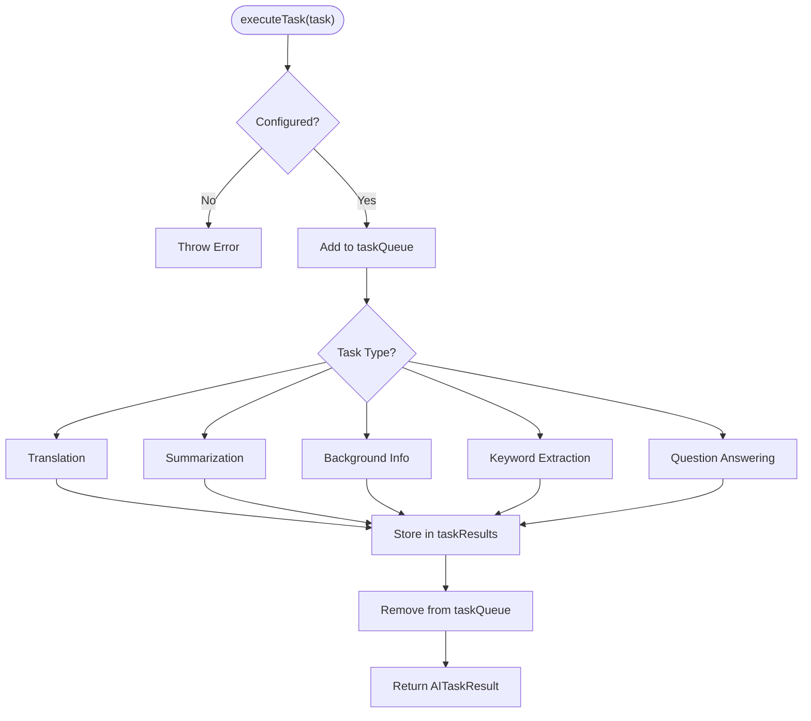
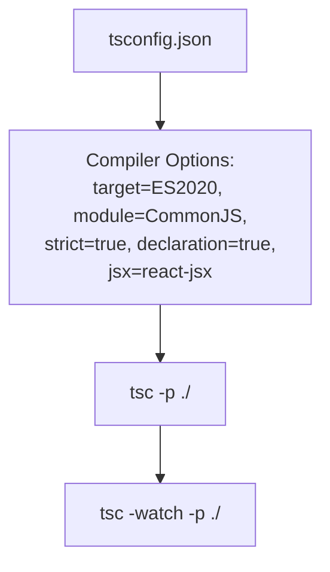
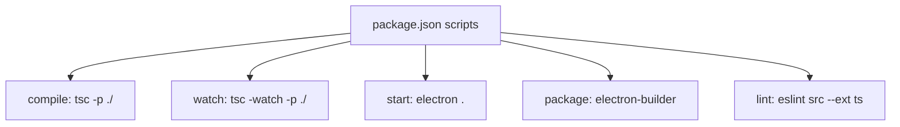
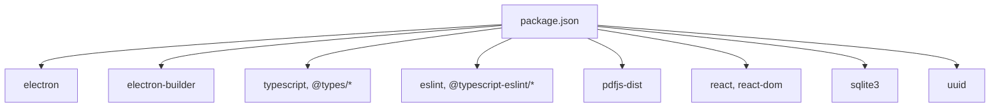

# Development Guide

<cite>
**Referenced Files in This Document**
- [package.json](file://package.json)
- [tsconfig.json](file://tsconfig.json)
- [README.md](file://README.md)
- [PLUGIN-GUIDE.md](file://PLUGIN-GUIDE.md)
- [DESIGN.md](file://DESIGN.md)
- [src/main.ts](file://src/main.ts)
- [src/preload.ts](file://src/preload.ts)
- [src/core/PluginManager.ts](file://src/core/PluginManager.ts)
- [src/core/AnnotationManager.ts](file://src/core/AnnotationManager.ts)
- [src/core/AIServiceManager.ts](file://src/core/AIServiceManager.ts)
- [src/types/index.ts](file://src/types/index.ts)
</cite>

## Table of Contents
1. [Introduction](#introduction)
2. [Project Structure](#project-structure)
3. [Core Components](#core-components)
4. [Architecture Overview](#architecture-overview)
5. [Detailed Component Analysis](#detailed-component-analysis)
6. [Dependency Analysis](#dependency-analysis)
7. [Performance Considerations](#performance-considerations)
8. [Troubleshooting Guide](#troubleshooting-guide)
9. [Contribution Guidelines](#contribution-guidelines)
10. [Testing Strategies](#testing-strategies)
11. [Release Process and Distribution](#release-process-and-distribution)
12. [Debugging and Profiling](#debugging-and-profiling)
13. [Code Standards and Conventions](#code-standards-and-conventions)
14. [Conclusion](#conclusion)

## Introduction
This development guide provides a comprehensive overview of setting up the development environment, building, extending, and contributing to SciPDFReader. It covers Node.js requirements, dependency management, TypeScript configuration, compilation and packaging, linting, cross-platform builds, code standards, contribution workflow, testing strategies, release processes, and practical debugging and optimization tips tailored for the Electron environment.

## Project Structure
SciPDFReader follows a layered architecture:
- Electron main process orchestrates the app lifecycle and exposes IPC handlers.
- A preload script safely bridges the renderer process to the main process via a controlled API surface.
- Core modules implement the plugin system, annotation management, and AI service integration.
- Types define shared interfaces and enums used across the application.

**Diagram sources**
- [src/main.ts:1-156](file://src/main.ts#L1-L156)
- [src/preload.ts:1-34](file://src/preload.ts#L1-L34)
- [src/core/PluginManager.ts:1-247](file://src/core/PluginManager.ts#L1-L247)
- [src/core/AnnotationManager.ts:1-172](file://src/core/AnnotationManager.ts#L1-L172)
- [src/core/AIServiceManager.ts:1-214](file://src/core/AIServiceManager.ts#L1-L214)
- [src/types/index.ts:1-224](file://src/types/index.ts#L1-L224)

**Section sources**
- [README.md:13-29](file://README.md#L13-L29)
- [DESIGN.md:51-85](file://DESIGN.md#L51-L85)

## Core Components
- Electron main process initializes BrowserWindow, sets up IPC handlers, and manages lifecycle events.
- Preload script exposes a minimal, secure API surface to the renderer process.
- PluginManager loads, activates, and manages plugins, exposing a controlled API to plugin code.
- AnnotationManager handles annotation creation, persistence, search, and export.
- AIServiceManager executes AI tasks (translation, summarization, background info, keyword extraction, Q&A) with configurable providers.

Key responsibilities and interactions are defined in the source files listed below.

**Section sources**
- [src/main.ts:1-156](file://src/main.ts#L1-L156)
- [src/preload.ts:1-34](file://src/preload.ts#L1-L34)
- [src/core/PluginManager.ts:1-247](file://src/core/PluginManager.ts#L1-L247)
- [src/core/AnnotationManager.ts:1-172](file://src/core/AnnotationManager.ts#L1-L172)
- [src/core/AIServiceManager.ts:1-214](file://src/core/AIServiceManager.ts#L1-L214)
- [src/types/index.ts:1-224](file://src/types/index.ts#L1-L224)

## Architecture Overview
The runtime architecture connects the renderer UI to the main process via IPC, with the preload script mediating safe communication. Core managers encapsulate domain logic and expose typed APIs to plugins.

**Diagram sources**
- [src/preload.ts:5-33](file://src/preload.ts#L5-L33)
- [src/main.ts:81-142](file://src/main.ts#L81-L142)
- [src/core/AIServiceManager.ts:13-56](file://src/core/AIServiceManager.ts#L13-L56)

**Section sources**
- [src/main.ts:13-43](file://src/main.ts#L13-L43)
- [src/preload.ts:1-34](file://src/preload.ts#L1-L34)

## Detailed Component Analysis

### Electron Main Process
- Creates the BrowserWindow with security-focused webPreferences and loads the renderer HTML.
- Initializes core services (AnnotationManager, AIServiceManager, PluginManager) and auto-loads installed plugins.
- Provides IPC handlers for PDF loading, file reading, dialogs, annotation CRUD, AI task execution, and plugin registration.

**Diagram sources**
- [src/main.ts:63-71](file://src/main.ts#L63-L71)
- [src/main.ts:45-60](file://src/main.ts#L45-L60)

**Section sources**
- [src/main.ts:13-78](file://src/main.ts#L13-L78)

### Preload Security Bridge
- Uses contextBridge to expose a minimal API surface to the renderer.
- Wraps ipcRenderer.invoke and ipcRenderer.on for specific operations (PDF load, file read, open dialog, annotation CRUD, AI tasks, plugin registration).

**Diagram sources**
- [src/preload.ts:5-33](file://src/preload.ts#L5-L33)

**Section sources**
- [src/preload.ts:1-34](file://src/preload.ts#L1-L34)

### Plugin System
- Discovers plugins in a user-specific directory, loads their main module, and invokes activate with a plugin context.
- Exposes APIs for annotations, AI tasks, PDF renderer stubs, and storage to plugins.
- Supports enabling/disabling, deactivation, and uninstallation.

**Diagram sources**
- [src/core/PluginManager.ts:48-99](file://src/core/PluginManager.ts#L48-L99)

**Section sources**
- [src/core/PluginManager.ts:1-247](file://src/core/PluginManager.ts#L1-L247)

### Annotation Management
- Manages annotation types and instances, persists to a user-specific data directory, supports CRUD operations, search, and export to multiple formats.
- Initializes default annotation types and ensures data directory exists.

**Diagram sources**
- [src/core/AnnotationManager.ts:11-40](file://src/core/AnnotationManager.ts#L11-L40)
- [src/core/AnnotationManager.ts:153-170](file://src/core/AnnotationManager.ts#L153-L170)

**Section sources**
- [src/core/AnnotationManager.ts:1-172](file://src/core/AnnotationManager.ts#L1-L172)

### AI Service Management
- Executes AI tasks based on configured provider (OpenAI, Azure, local, custom).
- Implements task queueing, cancellation, and batch execution.
- Provides fallbacks and mock responses when providers are unavailable.

**Diagram sources**
- [src/core/AIServiceManager.ts:13-56](file://src/core/AIServiceManager.ts#L13-L56)
- [src/core/AIServiceManager.ts:96-171](file://src/core/AIServiceManager.ts#L96-L171)

**Section sources**
- [src/core/AIServiceManager.ts:1-214](file://src/core/AIServiceManager.ts#L1-L214)

### TypeScript Configuration and Compilation
- Compiles to ES2020 with CommonJS modules, source maps, strict mode, and declaration files.
- RootDir is src, outDir is out, and JSX is configured for React.

**Diagram sources**
- [tsconfig.json:2-17](file://tsconfig.json#L2-L17)

**Section sources**
- [tsconfig.json:1-21](file://tsconfig.json#L1-L21)

### Build Commands and Packaging
- Scripts include compile, watch, start, package, and lint.
- electron-builder is configured for cross-platform targets (NSIS for Windows, AppImage for Linux) and product metadata.

**Diagram sources**
- [package.json:7-12](file://package.json#L7-L12)
- [package.json:34-54](file://package.json#L34-L54)

**Section sources**
- [package.json:1-56](file://package.json#L1-L56)
- [README.md:61-70](file://README.md#L61-L70)

## Dependency Analysis
External dependencies include Electron, TypeScript, ESLint, and UI/runtime libraries. Build-time configuration defines cross-platform targets and output directories.

**Diagram sources**
- [package.json:16-33](file://package.json#L16-L33)

**Section sources**
- [package.json:16-33](file://package.json#L16-L33)

## Performance Considerations
- Keep the renderer isolated from Node.js APIs via contextBridge to avoid heavy context switching.
- Offload AI and file operations to the main process to prevent UI blocking.
- Use incremental saves and lazy loading for annotations and large PDFs.
- Consider virtualization for large document rendering and batch AI requests where appropriate.

[No sources needed since this section provides general guidance]

## Troubleshooting Guide
Common development issues and resolutions:
- Node.js version mismatch: Ensure Node.js 18+ as per prerequisites.
- Missing native modules: Rebuild native deps against Electron’s Node.js ABI if needed.
- IPC errors: Verify preload exposes the correct API and main process handlers match invocation signatures.
- Plugin load failures: Confirm plugin manifests and main entry paths; check activation events and user plugins directory permissions.
- Lint failures: Run ESLint and fix reported issues; ensure TypeScript strictness is maintained.

**Section sources**
- [README.md:33-59](file://README.md#L33-L59)
- [src/preload.ts:5-33](file://src/preload.ts#L5-L33)
- [src/core/PluginManager.ts:48-69](file://src/core/PluginManager.ts#L48-L69)

## Contribution Guidelines
Workflow:
- Fork and branch from the latest main.
- Install dependencies, compile, and run locally.
- Make focused commits with clear messages.
- Open a Pull Request describing changes, rationale, and testing performed.

Review process:
- Ensure CI passes and code adheres to style and type safety.
- Request reviews from maintainers; address feedback promptly.

Issue reporting:
- Provide environment details, steps to reproduce, expected vs. actual behavior, and logs.

Community collaboration:
- Use GitHub Discussions for ideas and questions.
- Follow the code style and architectural patterns outlined in the repository.

**Section sources**
- [README.md:152-158](file://README.md#L152-L158)

## Testing Strategies
Unit testing:
- Test core managers in isolation using mocks for filesystem and AI providers.
- Validate task execution paths and error handling in AIServiceManager.

Integration testing:
- Verify IPC flows between preload, main, and renderer.
- Test plugin loading and command registration via PluginManager.

Quality assurance:
- Run ESLint and TypeScript checks before committing.
- Use watch mode during development to catch type errors early.

[No sources needed since this section provides general guidance]

## Release Process and Distribution
- Versioning: Increment version in package.json for releases.
- Build: Run the package script to produce distributables for target platforms.
- Distribution: Publish artifacts to your chosen channels (e.g., GitHub Releases, installer repositories).

**Section sources**
- [package.json:3-12](file://package.json#L3-L12)
- [package.json:34-54](file://package.json#L34-L54)

## Debugging and Profiling
Debugging Electron:
- Enable DevTools in development via NODE_ENV in main process.
- Use preload API calls to log and inspect data passed between processes.
- Inspect main process logs and renderer console for errors.

Profiling:
- Use Chrome DevTools for renderer performance.
- Monitor main process resource usage and avoid synchronous heavy work.

Memory management:
- Avoid retaining large buffers; convert to ArrayBuffer views when possible.
- Dispose plugin subscriptions and clear caches when unloading documents.

**Section sources**
- [src/main.ts:33-35](file://src/main.ts#L33-L35)
- [src/preload.ts:5-33](file://src/preload.ts#L5-L33)

## Code Standards and Conventions
- TypeScript best practices:
  - Strict compiler options and explicit typing.
  - Prefer immutable updates and small, pure functions.
  - Use enums and interfaces from shared types for consistency.
- Architectural patterns:
  - Clear separation between main, preload, and renderer.
  - Dependency injection for core managers to facilitate testing.
- Naming conventions:
  - Use PascalCase for classes and enums, camelCase for methods and variables.
  - Prefix Electron IPC handlers consistently (e.g., load-pdf, execute-ai-task).

**Section sources**
- [tsconfig.json:9-16](file://tsconfig.json#L9-L16)
- [src/types/index.ts:1-224](file://src/types/index.ts#L1-L224)
- [src/main.ts:81-156](file://src/main.ts#L81-L156)

## Conclusion
This guide consolidates the essential development practices for SciPDFReader, from environment setup and build configuration to architecture, testing, and release procedures. By following the documented workflows and standards, contributors can efficiently extend the application, integrate plugins, and deliver robust, cross-platform experiences.