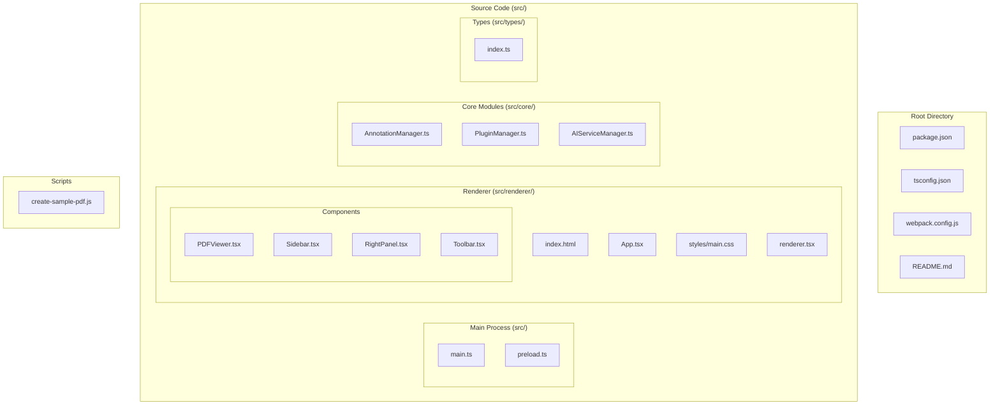
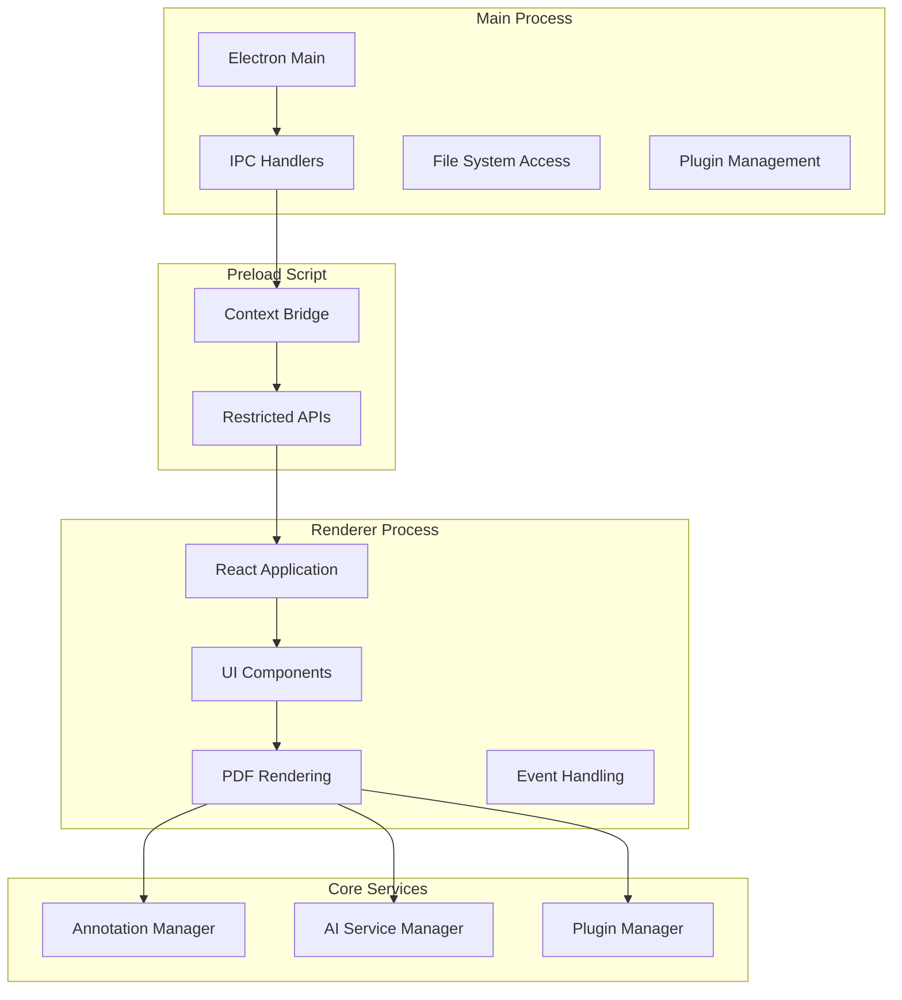
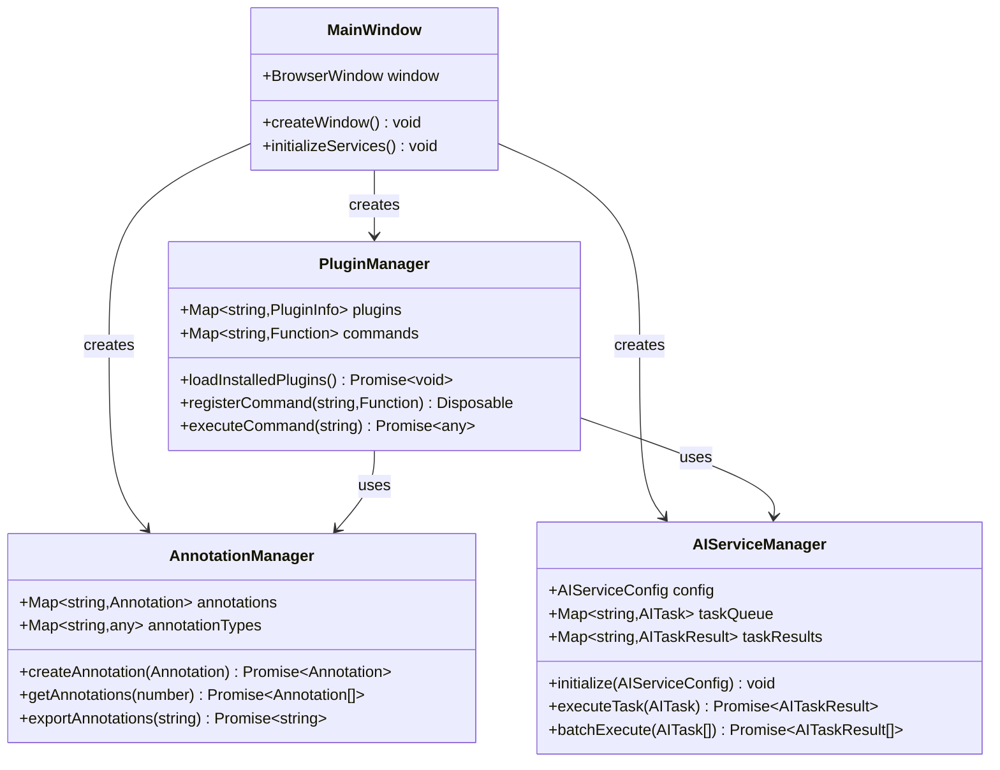
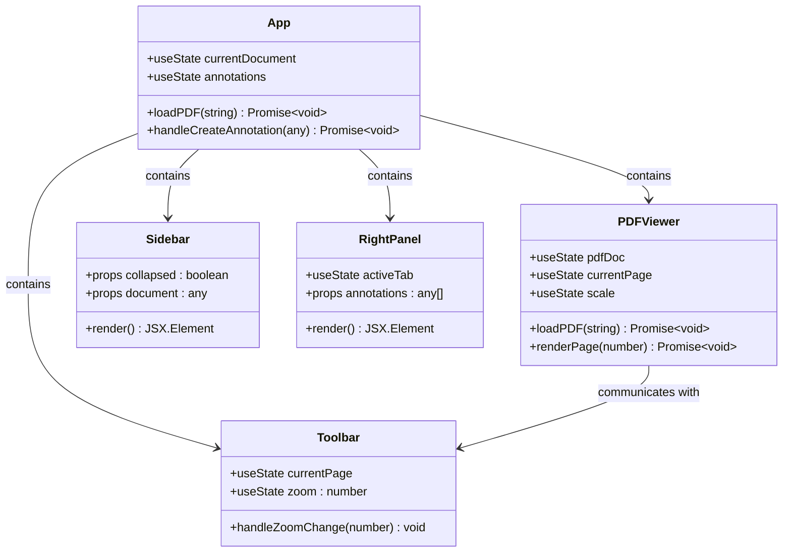
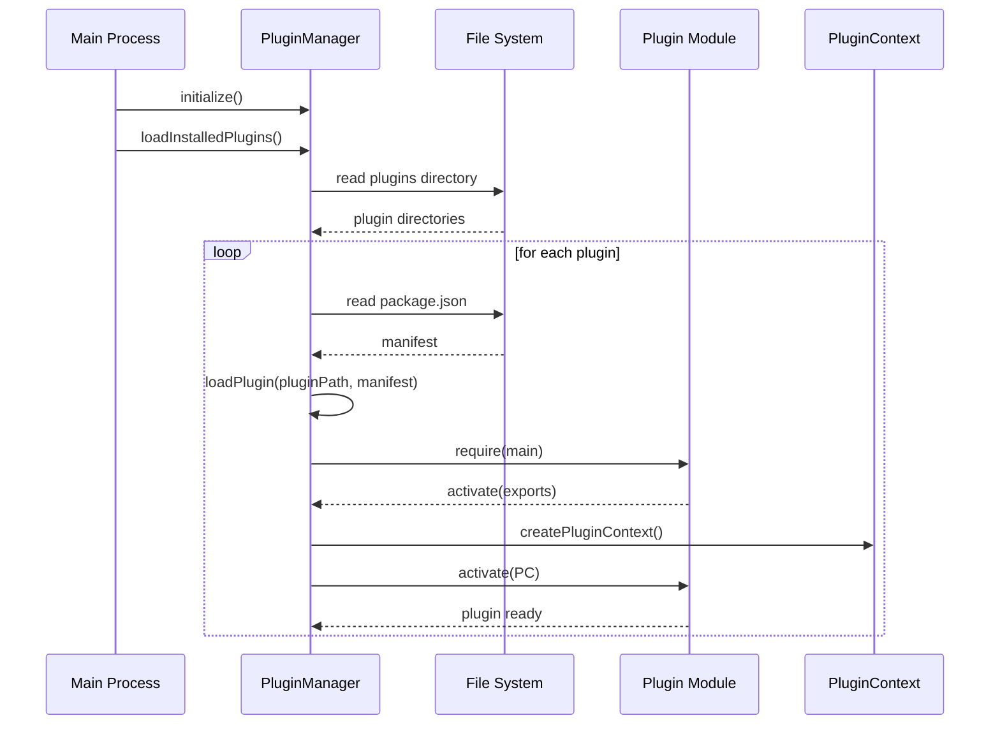
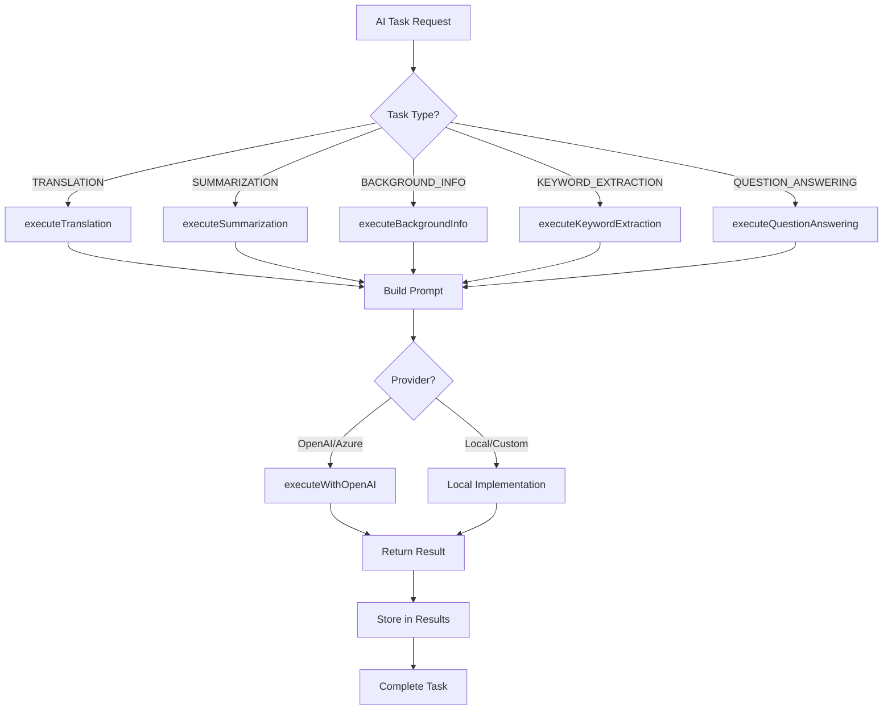
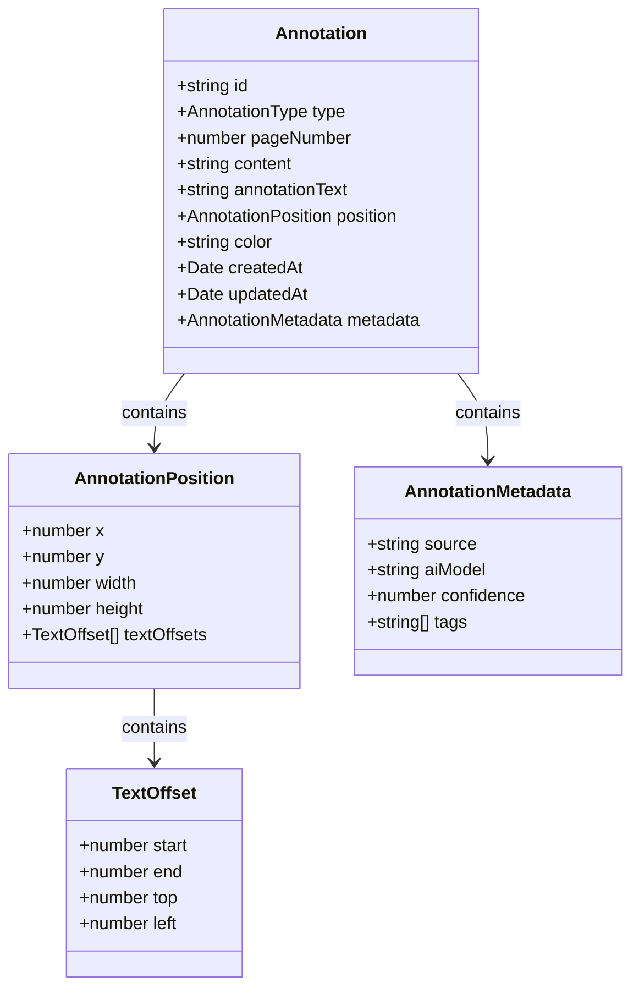
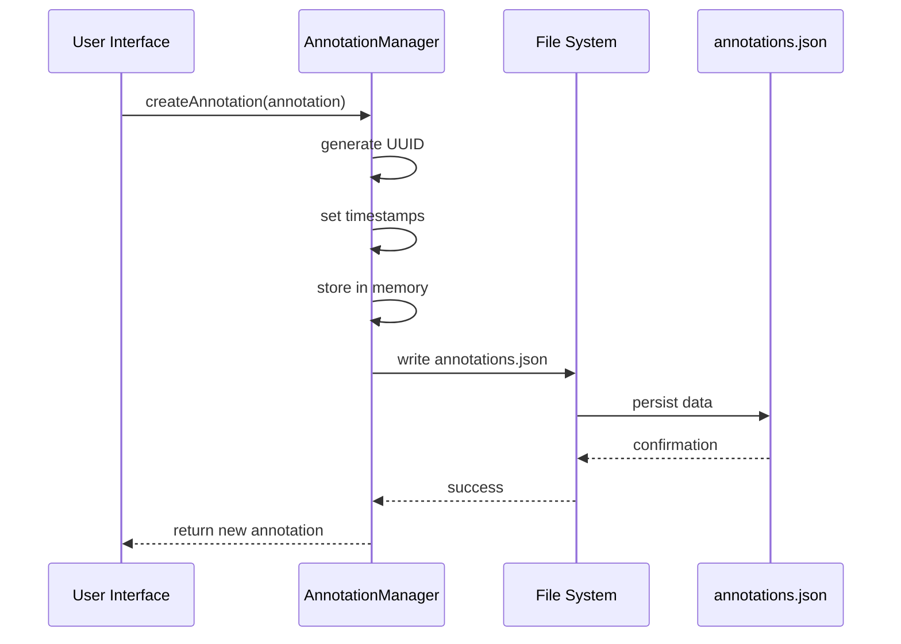
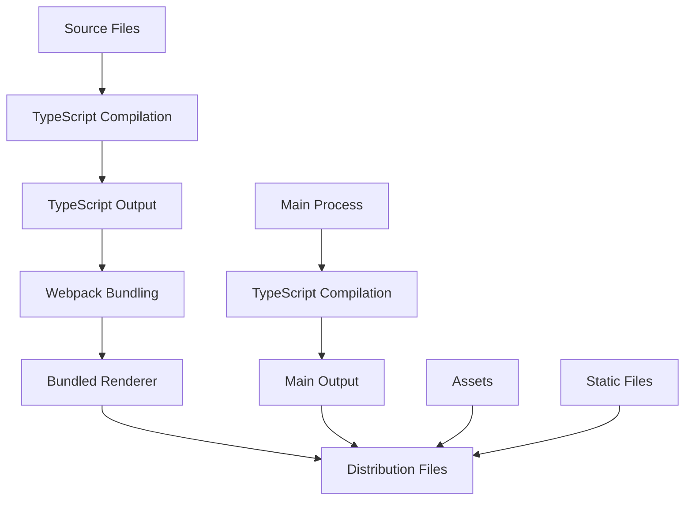
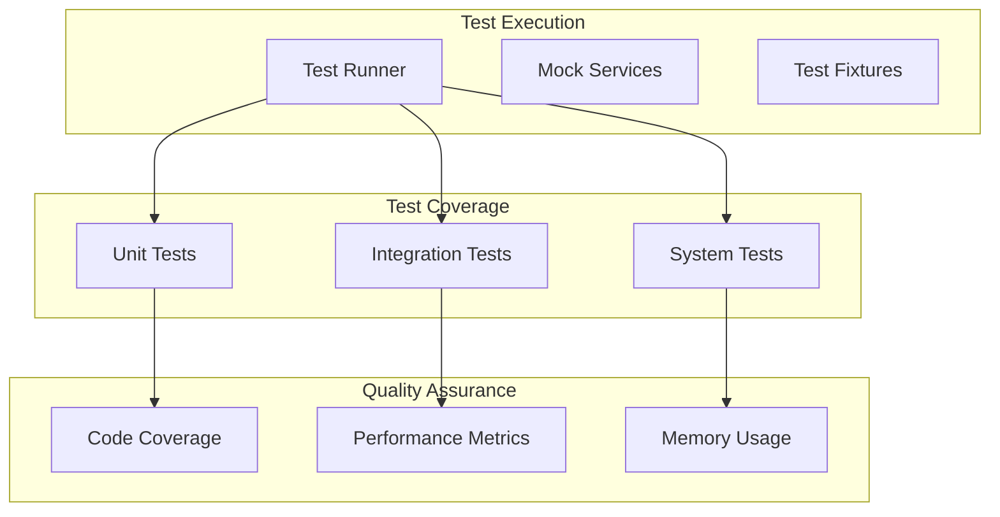

# Development Guide

<cite>
**Referenced Files in This Document**
- [README.md](file://README.md)
- [package.json](file://package.json)
- [src/main.ts](file://src/main.ts)
- [src/preload.ts](file://src/preload.ts)
- [src/renderer/App.tsx](file://src/renderer/App.tsx)
- [src/renderer/components/PDFViewer.tsx](file://src/renderer/components/PDFViewer.tsx)
- [src/renderer/components/Sidebar.tsx](file://src/renderer/components/Sidebar.tsx)
- [src/renderer/components/RightPanel.tsx](file://src/renderer/components/RightPanel.tsx)
- [src/renderer/components/Toolbar.tsx](file://src/renderer/components/Toolbar.tsx)
- [src/core/PluginManager.ts](file://src/core/PluginManager.ts)
- [src/core/AnnotationManager.ts](file://src/core/AnnotationManager.ts)
- [src/core/AIServiceManager.ts](file://src/core/AIServiceManager.ts)
- [src/types/index.ts](file://src/types/index.ts)
- [webpack.config.js](file://webpack.config.js)
- [src/renderer/index.html](file://src/renderer/index.html)
</cite>

## Table of Contents
1. [Introduction](#introduction)
2. [Getting Started](#getting-started)
3. [Project Structure](#project-structure)
4. [Core Architecture](#core-architecture)
5. [Development Environment Setup](#development-environment-setup)
6. [Key Components Analysis](#key-components-analysis)
7. [Plugin System](#plugin-system)
8. [AI Service Integration](#ai-service-integration)
9. [Annotation System](#annotation-system)
10. [Build and Deployment](#build-and-deployment)
11. [Development Workflow](#development-workflow)
12. [Testing Strategy](#testing-strategy)
13. [Troubleshooting Guide](#troubleshooting-guide)
14. [Best Practices](#best-practices)
15. [Contributing Guidelines](#contributing-guidelines)

## Introduction

SciPDFReader is an AI-powered PDF reader application built with Electron and React. It provides a modern, extensible PDF reading experience with annotation capabilities, AI-powered features, and a VS Code-inspired plugin architecture. The application supports cross-platform deployment and offers advanced features like real-time translation, background information lookup, and intelligent document summarization.

The project follows a modular architecture with clear separation between the Electron main process, renderer process, and core services. It leverages TypeScript for type safety and implements a comprehensive plugin system that allows developers to extend functionality without modifying the core application.

## Getting Started

### Prerequisites

Before you begin development, ensure you have the following installed:

- Node.js (version specified in package.json)
- npm (comes with Node.js)
- Git for version control

### Quick Start

The fastest way to get started is using the automated test command:

```bash
npm run test-app
```

This command will:
1. Create a sample PDF file (`test-sample.pdf`)
2. Compile the TypeScript code
3. Launch the SciPDFReader application

### Manual Installation

For manual setup, follow these steps:

1. **Clone the repository:**
   ```bash
   git clone https://github.com/Chunde/SciPDFReader.git
   cd SciPDFReader
   ```

2. **Install dependencies:**
   ```bash
   npm install
   ```

3. **Compile TypeScript:**
   ```bash
   npm run compile
   ```

4. **Run the application:**
   ```bash
   npm start
   ```

### Development Scripts

The project provides several useful development scripts:

| Script | Description |
|--------|-------------|
| `npm run compile` | Compiles TypeScript to JavaScript |
| `npm run watch` | Watches for file changes and recompiles automatically |
| `npm start` | Starts the Electron application |
| `npm run package` | Packages the application for distribution |
| `npm run lint` | Runs ESLint for code quality checking |
| `npm run test-app` | Creates sample PDF and launches application |

## Project Structure

The project follows a well-organized structure that separates concerns across different layers:



**Diagram sources**
- [src/main.ts:1-160](file://src/main.ts#L1-L160)
- [src/renderer/App.tsx:1-196](file://src/renderer/App.tsx#L1-L196)
- [src/core/PluginManager.ts:1-250](file://src/core/PluginManager.ts#L1-L250)

**Section sources**
- [README.md:24-40](file://README.md#L24-L40)
- [package.json:1-67](file://package.json#L1-L67)

## Core Architecture

SciPDFReader implements a multi-process architecture typical of Electron applications, with clear separation between the main process and renderer process:



**Diagram sources**
- [src/main.ts:13-46](file://src/main.ts#L13-L46)
- [src/preload.ts:5-34](file://src/preload.ts#L5-L34)
- [src/renderer/App.tsx:10-38](file://src/renderer/App.tsx#L10-L38)

The architecture follows these key principles:

1. **Security**: The preload script uses contextBridge to expose only necessary APIs to the renderer process
2. **Separation of Concerns**: Main process handles file system operations, while renderer manages UI
3. **Extensibility**: Plugin system allows third-party extensions without core modifications
4. **Type Safety**: Comprehensive TypeScript definitions ensure code reliability

## Development Environment Setup

### Setting Up the Development Environment

1. **Install Dependencies**
   ```bash
   npm install
   ```

2. **Start Development Server**
   ```bash
   npm run watch
   ```

3. **Launch Application**
   ```bash
   npm start
   ```

### Development Tools Configuration

The project includes several development tools configured:

- **TypeScript**: Strong typing and compile-time error checking
- **ESLint**: Code quality and style enforcement
- **Webpack**: Module bundling for the renderer process
- **Electron**: Desktop application framework

### Environment Variables

The application supports environment-specific configurations:

- **Development Mode**: Automatically opens DevTools
- **Production Mode**: Optimized build with minimal logging
- **Debug Mode**: Enhanced logging for troubleshooting

**Section sources**
- [package.json:7-18](file://package.json#L7-L18)
- [src/main.ts:35-38](file://src/main.ts#L35-L38)

## Key Components Analysis

### Main Process Architecture

The main process serves as the foundation for the entire application, managing system resources and coordinating between different components.



**Diagram sources**
- [src/main.ts:8-63](file://src/main.ts#L8-L63)
- [src/core/PluginManager.ts:16-36](file://src/core/PluginManager.ts#L16-L36)
- [src/core/AnnotationManager.ts:6-19](file://src/core/AnnotationManager.ts#L6-L19)
- [src/core/AIServiceManager.ts:3-11](file://src/core/AIServiceManager.ts#L3-L11)

### Renderer Process Components

The renderer process handles the user interface and PDF rendering functionality:



**Diagram sources**
- [src/renderer/App.tsx:10-196](file://src/renderer/App.tsx#L10-L196)
- [src/renderer/components/PDFViewer.tsx:12-158](file://src/renderer/components/PDFViewer.tsx#L12-L158)
- [src/renderer/components/Sidebar.tsx:9-70](file://src/renderer/components/Sidebar.tsx#L9-L70)
- [src/renderer/components/RightPanel.tsx:10-171](file://src/renderer/components/RightPanel.tsx#L10-L171)
- [src/renderer/components/Toolbar.tsx:9-134](file://src/renderer/components/Toolbar.tsx#L9-L134)

**Section sources**
- [src/renderer/App.tsx:10-196](file://src/renderer/App.tsx#L10-L196)
- [src/renderer/components/PDFViewer.tsx:12-158](file://src/renderer/components/PDFViewer.tsx#L12-L158)

## Plugin System

The plugin system provides extensibility similar to VS Code's architecture, allowing developers to create custom functionality without modifying the core application.

### Plugin Architecture



**Diagram sources**
- [src/core/PluginManager.ts:49-107](file://src/core/PluginManager.ts#L49-L107)
- [src/main.ts:48-63](file://src/main.ts#L48-L63)

### Plugin API Surface

The plugin system exposes a comprehensive API surface through the PluginContext:

| API Category | Methods | Purpose |
|--------------|---------|---------|
| **Annotations** | `createAnnotation()`, `updateAnnotation()`, `deleteAnnotation()` | Manage document annotations |
| **AI Services** | `initialize()`, `executeTask()`, `batchExecute()` | Integrate with AI providers |
| **PDF Renderer** | `loadDocument()`, `renderPage()`, `getPageInfo()` | Control PDF rendering |
| **Storage** | `get()`, `put()`, `keys()` | Persistent plugin data |

### Plugin Manifest Structure

Each plugin must include a `package.json` with the following structure:

```json
{
  "name": "plugin-name",
  "displayName": "Plugin Name",
  "version": "1.0.0",
  "description": "Plugin description",
  "publisher": "your-name",
  "engines": {
    "scipdfreader": "^0.0.1"
  },
  "main": "dist/extension.js",
  "activationEvents": ["*"],
  "contributes": {
    "commands": [
      {
        "command": "plugin.command",
        "title": "Command Title"
      }
    ]
  }
}
```

**Section sources**
- [src/core/PluginManager.ts:16-36](file://src/core/PluginManager.ts#L16-L36)
- [src/types/index.ts:86-103](file://src/types/index.ts#L86-L103)

## AI Service Integration

The AI Service Manager provides a unified interface for various AI-powered features, supporting multiple providers and task types.

### AI Task Processing Flow



**Diagram sources**
- [src/core/AIServiceManager.ts:13-56](file://src/core/AIServiceManager.ts#L13-L56)
- [src/core/AIServiceManager.ts:96-171](file://src/core/AIServiceManager.ts#L96-L171)

### Supported AI Tasks

| Task Type | Description | Input Requirements | Output |
|-----------|-------------|-------------------|---------|
| **TRANSLATION** | Text translation to target language | Source text, target language | Translated text |
| **SUMMARIZATION** | Document or text summarization | Input text, max length | Concise summary |
| **BACKGROUND_INFO** | Knowledge base queries | Entity/term, context | Informative response |
| **KEYWORD_EXTRACTION** | Extract important terms | Input text | JSON array of keywords |
| **QUESTION_ANSWERING** | Context-aware Q&A | Question, context | Answer text |

### Configuration Options

The AI service supports multiple configuration providers:

```json
{
  "ai": {
    "provider": "openai",
    "apiKey": "your-api-key",
    "model": "gpt-3.5-turbo",
    "temperature": 0.7
  }
}
```

**Section sources**
- [src/core/AIServiceManager.ts:13-56](file://src/core/AIServiceManager.ts#L13-L56)
- [src/core/AIServiceManager.ts:96-171](file://src/core/AIServiceManager.ts#L96-L171)

## Annotation System

The annotation system provides comprehensive support for highlighting, noting, and organizing PDF content with persistent storage and export capabilities.

### Annotation Data Model



**Diagram sources**
- [src/types/index.ts:36-47](file://src/types/index.ts#L36-L47)
- [src/types/index.ts:13-26](file://src/types/index.ts#L13-L26)
- [src/types/index.ts:28-34](file://src/types/index.ts#L28-L34)

### Annotation Types

The system supports multiple annotation types with predefined defaults:

| Type | Icon | Color | Purpose |
|------|------|-------|---------|
| **HIGHLIGHT** | 🖍️ | Yellow (#FFFF00) | Emphasize important text |
| **UNDERLINE** | 📏 | Green (#00FF00) | Mark significant passages |
| **STRIKETHROUGH** | ❌ | Red (#FF0000) | Mark removed content |
| **NOTE** | 📝 | Orange (#FFA500) | Personal notes |
| **TRANSLATION** | 🌐 | Light Blue (#87CEEB) | Translation annotations |
| **BACKGROUND_INFO** | ℹ️ | Plum (#DDA0DD) | Context information |

### Storage and Persistence

Annotations are stored in a structured JSON format with automatic persistence:



**Diagram sources**
- [src/core/AnnotationManager.ts:46-59](file://src/core/AnnotationManager.ts#L46-L59)
- [src/core/AnnotationManager.ts:153-157](file://src/core/AnnotationManager.ts#L153-L157)

**Section sources**
- [src/core/AnnotationManager.ts:46-84](file://src/core/AnnotationManager.ts#L46-L84)
- [src/types/index.ts:3-11](file://src/types/index.ts#L3-L11)

## Build and Deployment

### Build Process

The application uses a multi-stage build process combining TypeScript compilation and Webpack bundling:



**Diagram sources**
- [webpack.config.js:3-21](file://webpack.config.js#L3-L21)
- [package.json:8-18](file://package.json#L8-L18)

### Build Configuration

The build system is configured through several key files:

**Webpack Configuration** (`webpack.config.js`):
- Entry point: `src/renderer/renderer.tsx`
- Output: `dist/renderer.js`
- TypeScript loader integration
- Development source maps

**Package Scripts** (`package.json`):
- `compile`: TypeScript compilation
- `watch`: Development watch mode
- `build:renderer`: Webpack bundling
- `dev`: Combined development build
- `package`: Electron Builder packaging

### Distribution Targets

The application supports multiple platforms through Electron Builder:

| Platform | Target | Configuration |
|----------|--------|---------------|
| **Windows** | NSIS Installer | `win.target: "nsis"` |
| **macOS** | App Bundle | `mac.category: "public.app-category.productivity"` |
| **Linux** | AppImage | `linux.target: "AppImage"` |

### Asset Management

Static assets are organized in a dedicated structure:

- **Icons**: Application icons for each platform
- **Fonts**: Custom typography assets
- **Styles**: CSS files for UI styling
- **Workers**: PDF.js web workers for rendering

**Section sources**
- [webpack.config.js:3-21](file://webpack.config.js#L3-L21)
- [package.json:45-65](file://package.json#L45-L65)

## Development Workflow

### Daily Development Tasks

1. **Start Development Server**
   ```bash
   npm run watch
   ```

2. **Launch Application**
   ```bash
   npm start
   ```

3. **Code Changes**
   - Modify TypeScript files in `src/`
   - React components in `src/renderer/components/`
   - Core services in `src/core/`
   - Type definitions in `src/types/`

4. **Testing**
   ```bash
   npm run test-app
   ```

### Code Organization Principles

- **TypeScript First**: All code written in TypeScript for type safety
- **Component-Based**: React components organized by feature
- **Service Layer**: Core functionality encapsulated in service classes
- **Interface Contracts**: Clear API boundaries between components

### Debugging Strategies

- **Main Process**: Use Electron DevTools for debugging
- **Renderer Process**: Standard browser DevTools
- **IPC Communication**: Log all inter-process messages
- **Plugin Development**: Monitor plugin loading and activation

## Testing Strategy

### Test Types

The project supports multiple testing approaches:

1. **Unit Testing**: Individual component and service testing
2. **Integration Testing**: Component interaction validation
3. **End-to-End Testing**: Complete user workflow testing
4. **Plugin Testing**: Third-party extension compatibility

### Testing Infrastructure



### Sample Test Commands

```bash
# Run all tests
npm test

# Run with coverage
npm run test -- --coverage

# Watch for changes
npm run test -- --watch
```

## Troubleshooting Guide

### Common Issues and Solutions

**Application Won't Start**
- Verify Node.js and npm installation
- Check port availability (Electron default: 3000)
- Ensure all dependencies are installed

**PDF Loading Failures**
- Verify file permissions
- Check PDF file integrity
- Ensure proper MIME type handling

**Plugin Loading Issues**
- Verify plugin manifest validity
- Check plugin path resolution
- Review activation event conditions

**Build Errors**
- Clean node_modules and reinstall
- Check TypeScript configuration
- Verify webpack dependencies

### Debug Information Collection

Enable verbose logging for troubleshooting:

```bash
# Development mode with enhanced logging
NODE_ENV=development npm start

# Production mode with debug
DEBUG=true npm start
```

### Performance Monitoring

Monitor application performance during development:

- **Memory Usage**: Track memory consumption over time
- **CPU Usage**: Monitor processor utilization
- **Rendering Performance**: Measure PDF rendering speed
- **Plugin Performance**: Track plugin execution time

**Section sources**
- [src/main.ts:35-38](file://src/main.ts#L35-L38)
- [src/renderer/App.tsx:40-54](file://src/renderer/App.tsx#L40-L54)

## Best Practices

### Code Quality Standards

1. **Type Safety**: Always use TypeScript interfaces and types
2. **Error Handling**: Implement comprehensive error handling patterns
3. **Resource Management**: Properly manage file handles and memory
4. **Security**: Follow Electron security best practices
5. **Performance**: Optimize rendering and data processing

### Development Guidelines

- **Component Design**: Keep components small and focused
- **State Management**: Use React hooks appropriately
- **Event Handling**: Implement proper event cleanup
- **IPC Communication**: Minimize data transfer between processes
- **Plugin Architecture**: Follow VS Code extension patterns

### Security Considerations

- **Context Isolation**: Maintain strict separation between main and renderer processes
- **Input Validation**: Sanitize all user inputs and file operations
- **API Exposure**: Limit exposed APIs through contextBridge
- **File System Access**: Restrict file operations to safe locations

### Performance Optimization

- **Lazy Loading**: Load heavy components only when needed
- **Caching**: Implement appropriate caching strategies
- **Memory Management**: Clean up event listeners and timers
- **Rendering Optimization**: Optimize PDF rendering performance

## Contributing Guidelines

### Development Process

1. **Fork the Repository**: Create your own fork
2. **Create Branch**: Use descriptive branch names
3. **Write Code**: Follow established patterns and standards
4. **Add Tests**: Include appropriate test coverage
5. **Submit PR**: Create pull request with clear description

### Code Review Process

- **Peer Review**: All changes require review
- **Testing**: Ensure all tests pass
- **Documentation**: Update relevant documentation
- **Compatibility**: Maintain backward compatibility

### Issue Reporting

When reporting bugs or requesting features:

1. **Search Existing Issues**: Check if issue already exists
2. **Provide Details**: Include reproduction steps and environment info
3. **Expected vs Actual**: Clearly describe expected behavior
4. **Screenshots**: Include relevant screenshots or logs

### Community Guidelines

- **Respectful Communication**: Maintain professional communication
- **Constructive Feedback**: Provide helpful suggestions
- **Collaboration**: Work together toward common goals
- **Inclusivity**: Welcome contributors of all skill levels