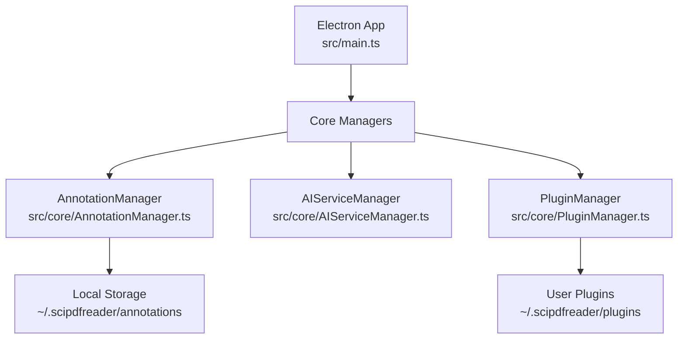

# Getting Started

<cite>
**Referenced Files in This Document**
- [README.md](file://README.md)
- [package.json](file://package.json)
- [tsconfig.json](file://tsconfig.json)
- [src/main.ts](file://src/main.ts)
- [src/core/AnnotationManager.ts](file://src/core/AnnotationManager.ts)
- [src/core/PluginManager.ts](file://src/core/PluginManager.ts)
- [src/core/AIServiceManager.ts](file://src/core/AIServiceManager.ts)
- [src/types/index.ts](file://src/types/index.ts)
- [DESIGN.md](file://DESIGN.md)
- [PLUGIN-GUIDE.md](file://PLUGIN-GUIDE.md)
</cite>

## Table of Contents
1. [Introduction](#introduction)
2. [Prerequisites](#prerequisites)
3. [Installation](#installation)
4. [Initial Configuration](#initial-configuration)
5. [Basic Usage Walkthrough](#basic-usage-walkthrough)
6. [System Requirements](#system-requirements)
7. [Architecture Overview](#architecture-overview)
8. [Troubleshooting Guide](#troubleshooting-guide)
9. [Verification Steps](#verification-steps)
10. [Conclusion](#conclusion)

## Introduction
SciPDFReader is an AI-powered PDF reader with annotation and plugin support, built on Electron with a VS Code-inspired plugin architecture. It enables intelligent PDF reading with features like translation, background information, summarization, and customizable annotations across Windows, macOS, and Linux.

## Prerequisites
Before installing SciPDFReader, ensure your system meets the following requirements:
- Node.js 18+ and npm
- Git
- Platform-specific build tools (varies by OS)

These prerequisites are required for building and running the Electron application locally.

**Section sources**
- [README.md:33-36](file://README.md#L33-L36)

## Installation
Follow these step-by-step instructions to set up SciPDFReader from source:

1. Clone the repository:
   ```bash
   git clone https://github.com/Chunde/SciPDFReader.git
   cd SciPDFReader
   ```

2. Install dependencies:
   ```bash
   npm install
   ```

3. Compile TypeScript:
   ```bash
   npm run compile
   ```

4. Run the application:
   ```bash
   npm start
   ```

These commands will build the project and launch the Electron app. The scripts are defined in the project configuration.

**Section sources**
- [README.md:40-59](file://README.md#L40-L59)
- [package.json:7-12](file://package.json#L7-L12)

## Initial Configuration
Create a configuration file at `~/.scipdfreader/config.json` with the following structure:
- AI provider settings (provider, API key, model)
- Annotation preferences (default color, auto-save)
- Plugin configurations (auto-load)

This configuration file controls AI service integration, annotation behavior, and plugin loading.

**Section sources**
- [README.md:120-139](file://README.md#L120-L139)

## Basic Usage Walkthrough
Once launched, you can:
- Load PDF files using the application interface
- Navigate pages using the built-in navigation controls
- Perform simple annotations by selecting text and choosing annotation types (highlight, underline, note, etc.)

The application initializes core managers for annotations, AI services, and plugins automatically upon startup.

**Section sources**
- [src/main.ts:44-59](file://src/main.ts#L44-L59)

## System Requirements
SciPDFReader supports the following platforms:
- Windows (via NSIS installer)
- macOS (category configured for productivity)
- Linux (AppImage target)

Build targets are defined in the project configuration for cross-platform distribution.

**Section sources**
- [package.json:45-53](file://package.json#L45-L53)

## Architecture Overview
SciPDFReader follows a layered architecture with Electron as the runtime, TypeScript for type safety, and React for the UI. The core modules include:
- AnnotationManager: Manages annotations and persistence
- AIServiceManager: Handles AI tasks and provider integration
- PluginManager: Loads and manages plugins from the user directory



**Diagram sources**
- [src/main.ts:12-59](file://src/main.ts#L12-L59)
- [src/core/AnnotationManager.ts:15-19](file://src/core/AnnotationManager.ts#L15-L19)
- [src/core/PluginManager.ts:37-46](file://src/core/PluginManager.ts#L37-L46)

**Section sources**
- [DESIGN.md:19-84](file://DESIGN.md#L19-L84)
- [src/main.ts:44-59](file://src/main.ts#L44-L59)

## Troubleshooting Guide
Common setup issues and solutions:
- Node.js version mismatch: Ensure Node.js 18+ is installed
- Missing dependencies: Run `npm install` to install all required packages
- TypeScript compilation errors: Verify `npm run compile` succeeds
- Application fails to start: Check `npm start` logs for errors
- Plugin loading failures: Confirm plugin manifests are valid JSON and located in the plugins directory

If encountering permission issues on Unix-like systems, ensure the configuration and plugin directories are writable.

**Section sources**
- [src/core/PluginManager.ts:48-69](file://src/core/PluginManager.ts#L48-L69)
- [src/core/AnnotationManager.ts:36-40](file://src/core/AnnotationManager.ts#L36-L40)

## Verification Steps
After installation, verify your setup:
1. Confirm TypeScript compiles without errors
2. Launch the application and check for UI initialization
3. Verify configuration file exists at the expected path
4. Test basic annotation creation and retrieval
5. Ensure plugin directory is created and accessible

These steps confirm that the build pipeline, runtime, and configuration are functioning correctly.

**Section sources**
- [package.json:8-12](file://package.json#L8-L12)
- [src/main.ts:62-77](file://src/main.ts#L62-L77)
- [src/core/AnnotationManager.ts:159-170](file://src/core/AnnotationManager.ts#L159-L170)

## Conclusion
You are now ready to use SciPDFReader. Start by loading PDFs, creating annotations, and exploring AI-powered features. For advanced customization, refer to the plugin development guide and adjust the configuration file to match your preferences.