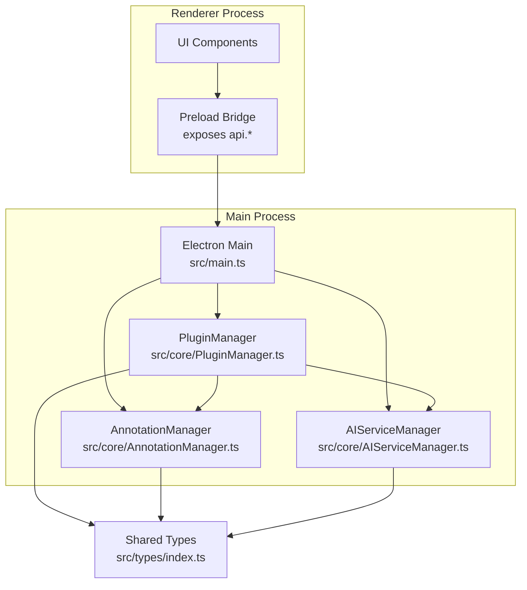
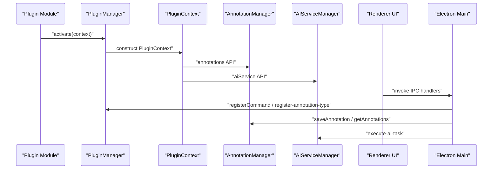
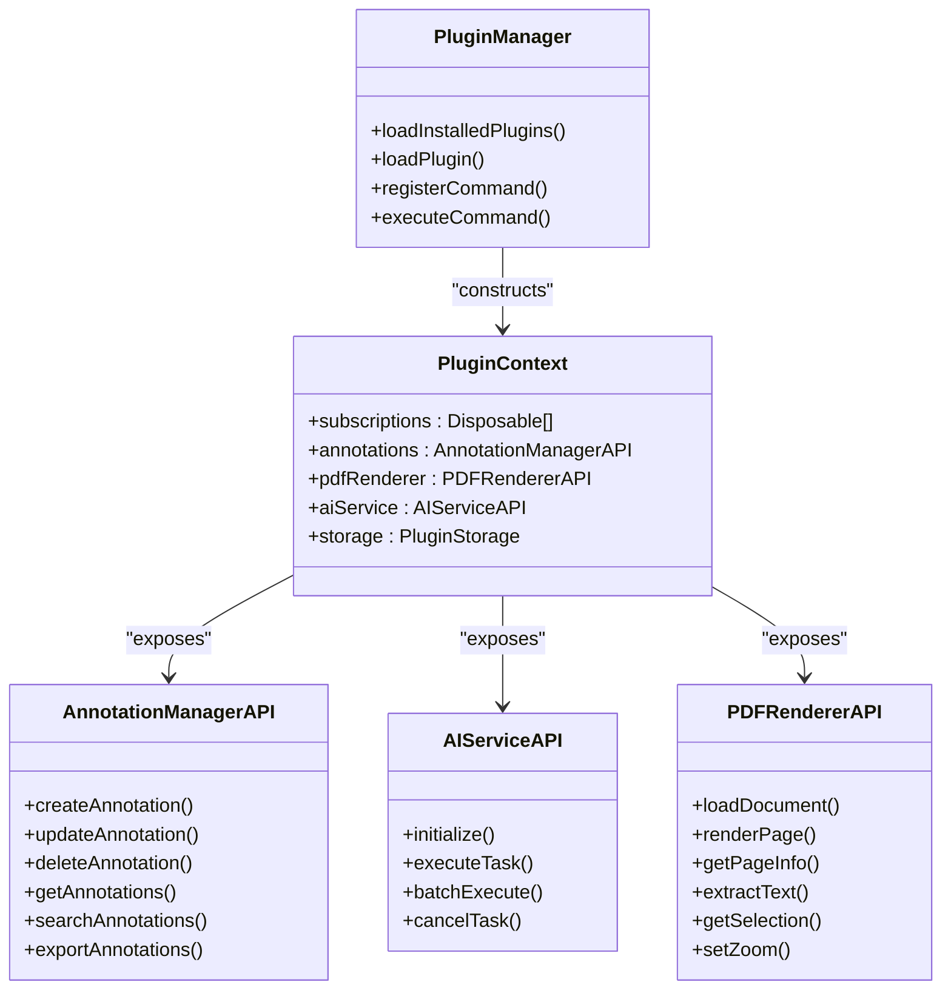

# Plugin APIs Reference

<cite>
**Referenced Files in This Document**
- [src/main.ts](file://src/main.ts)
- [src/preload.ts](file://src/preload.ts)
- [src/types/index.ts](file://src/types/index.ts)
- [src/core/PluginManager.ts](file://src/core/PluginManager.ts)
- [src/core/AIServiceManager.ts](file://src/core/AIServiceManager.ts)
- [src/core/AnnotationManager.ts](file://src/core/AnnotationManager.ts)
- [README.md](file://README.md)
- [PLUGIN-GUIDE.md](file://PLUGIN-GUIDE.md)
- [package.json](file://package.json)
</cite>

## Table of Contents
1. [Introduction](#introduction)
2. [Project Structure](#project-structure)
3. [Core Components](#core-components)
4. [Architecture Overview](#architecture-overview)
5. [Detailed Component Analysis](#detailed-component-analysis)
6. [Dependency Analysis](#dependency-analysis)
7. [Performance Considerations](#performance-considerations)
8. [Troubleshooting Guide](#troubleshooting-guide)
9. [Conclusion](#conclusion)
10. [Appendices](#appendices)

## Introduction
This document provides comprehensive API documentation for the plugin development APIs in SciPDFReader. It covers the PluginContext API surface, including the Annotations API, AI Service API, PDF Renderer API, Commands API, and Window API. It also documents method signatures, parameter specifications, return values, error handling patterns, practical usage examples, and guidance on API versioning and backward compatibility.

SciPDFReader follows a VS Code-inspired plugin architecture. Plugins receive a PluginContext object during activation, which exposes typed APIs for annotations, AI services, PDF rendering, and storage. The renderer process communicates with the main process via IPC handlers, while the preload bridge exposes a minimal, secure API surface to the renderer.

## Project Structure
The plugin APIs are defined in shared type definitions and implemented by core managers. The main process wires IPC handlers and initializes services. The preload script exposes a controlled subset of IPC to the renderer.

**Diagram sources**
- [src/main.ts:1-156](file://src/main.ts#L1-L156)
- [src/preload.ts:1-34](file://src/preload.ts#L1-L34)
- [src/core/PluginManager.ts:1-248](file://src/core/PluginManager.ts#L1-L248)
- [src/core/AnnotationManager.ts:1-172](file://src/core/AnnotationManager.ts#L1-L172)
- [src/core/AIServiceManager.ts:1-214](file://src/core/AIServiceManager.ts#L1-L214)
- [src/types/index.ts:1-224](file://src/types/index.ts#L1-L224)

**Section sources**
- [src/main.ts:1-156](file://src/main.ts#L1-L156)
- [src/preload.ts:1-34](file://src/preload.ts#L1-L34)
- [src/core/PluginManager.ts:1-248](file://src/core/PluginManager.ts#L1-L248)
- [src/core/AnnotationManager.ts:1-172](file://src/core/AnnotationManager.ts#L1-L172)
- [src/core/AIServiceManager.ts:1-214](file://src/core/AIServiceManager.ts#L1-L214)
- [src/types/index.ts:1-224](file://src/types/index.ts#L1-L224)

## Core Components
- PluginContext: The primary API surface passed to plugin activate functions. It includes subscriptions, annotations, pdfRenderer, aiService, and storage.
- AnnotationManager: Manages annotations lifecycle and persistence.
- AIServiceManager: Orchestrates AI tasks and integrates with providers.
- PluginManager: Loads, activates, and manages plugins; constructs PluginContext and exposes APIs to plugins.
- Shared Types: Define enums, interfaces, and contracts for all APIs.

Key responsibilities:
- PluginManager creates and exposes typed APIs to plugins.
- AnnotationManager persists annotations and supports CRUD/search/export.
- AIServiceManager validates initialization, routes tasks, and returns structured results.
- Preload bridge exposes safe IPC methods to renderer.

**Section sources**
- [src/core/PluginManager.ts:29-36](file://src/core/PluginManager.ts#L29-L36)
- [src/core/AnnotationManager.ts:46-112](file://src/core/AnnotationManager.ts#L46-L112)
- [src/core/AIServiceManager.ts:8-56](file://src/core/AIServiceManager.ts#L8-L56)
- [src/types/index.ts:136-177](file://src/types/index.ts#L136-L177)

## Architecture Overview
The plugin system is designed around a typed PluginContext. During activation, plugins receive this context and can register commands, create annotations, and execute AI tasks. IPC bridges renderer actions to main-process managers.

**Diagram sources**
- [src/core/PluginManager.ts:107-119](file://src/core/PluginManager.ts#L107-L119)
- [src/core/PluginManager.ts:203-221](file://src/core/PluginManager.ts#L203-L221)
- [src/main.ts:123-142](file://src/main.ts#L123-L142)
- [src/main.ts:145-155](file://src/main.ts#L145-L155)

## Detailed Component Analysis

### PluginContext API
The PluginContext object is constructed by PluginManager and passed to plugin activate functions. It includes:
- subscriptions: Array of Disposable objects for cleanup.
- annotations: AnnotationManagerAPI for annotation operations.
- pdfRenderer: PDFRendererAPI for PDF interactions.
- aiService: AIServiceAPI for AI tasks.
- storage: PluginStorage for persistent key-value storage.

Implementation details:
- PluginManager composes the context with typed APIs bound to underlying managers.
- PDFRendererAPI is currently a placeholder; actual implementation will be integrated later.

**Section sources**
- [src/core/PluginManager.ts:29-36](file://src/core/PluginManager.ts#L29-L36)
- [src/core/PluginManager.ts:223-233](file://src/core/PluginManager.ts#L223-L233)
- [src/types/index.ts:136-142](file://src/types/index.ts#L136-L142)

### Annotations API
Methods exposed via PluginContext.annotations:

- createAnnotation(annotation: Annotation): Promise<Annotation>
  - Creates a new annotation with a generated ID and timestamps.
  - Persists immediately after creation.
  - Throws if invalid or missing required fields.
  - Returns the created annotation.

- updateAnnotation(id: string, updates: Partial<Annotation>): Promise<void>
  - Updates an existing annotation; throws if not found.
  - Updates the updatedAt timestamp automatically.

- deleteAnnotation(id: string): Promise<void>
  - Deletes an annotation by ID; throws if not found.

- getAnnotations(pageNumber: number): Promise<Annotation[]>
  - Retrieves all annotations for a given page number.

- searchAnnotations(query: string): Promise<Annotation[]>
  - Searches across content and annotationText (case-insensitive).

- exportAnnotations(format: string): Promise<string>
  - Exports annotations to JSON, Markdown, or HTML.
  - Defaults to JSON if format is unsupported.

Data model and types:
- AnnotationType enum defines supported types.
- Annotation interface includes identifiers, positioning, content, and metadata.
- AnnotationPosition and TextOffset define spatial data.

Error handling:
- updateAnnotation/deleteAnnotation throw if ID not found.
- exportAnnotations returns JSON string for unknown formats.

Practical usage examples:
- Create a highlight annotation for selected text.
- Export annotations to Markdown for sharing.
- Search annotations by keyword across documents.

**Section sources**
- [src/core/AnnotationManager.ts:46-112](file://src/core/AnnotationManager.ts#L46-L112)
- [src/core/AnnotationManager.ts:153-170](file://src/core/AnnotationManager.ts#L153-L170)
- [src/types/index.ts:3-47](file://src/types/index.ts#L3-L47)
- [src/types/index.ts:148-155](file://src/types/index.ts#L148-L155)

### AI Service API
Methods exposed via PluginContext.aiService:

- initialize(config: AIServiceConfig): void
  - Initializes the AI service with provider configuration.
  - Validates provider and sets internal config.

- executeTask(task: AITask): Promise<AITaskResult>
  - Executes a single AI task based on type.
  - Supported types: TRANSLATION, SUMMARIZATION, BACKGROUND_INFO, KEYWORD_EXTRACTION, QUESTION_ANSWERING.
  - Throws if not initialized or on unknown task type.
  - Returns structured AITaskResult with output and metadata.

- batchExecute(tasks: AITask[]): Promise<AITaskResult[]>
  - Executes multiple tasks sequentially.
  - Continues on individual task failure, returning partial results with error metadata.

- cancelTask(taskId: string): void
  - Cancels a pending task by removing it from the queue.

Task configuration:
- AITaskType enum defines supported task types.
- AITask includes id, type, input, optional context, and options.
- TaskOptions supports targetLanguage, maxLength, language, and custom fields.
- AITaskResult includes output, optional metadata, and confidence.

Provider support:
- Providers include openai, azure, local, and custom.
- OpenAI/Azure tasks use a prompt builder and return mock responses in current implementation.

Practical usage examples:
- Translate selected text to a target language.
- Summarize a page with a maximum length.
- Extract keywords from document text.
- Retrieve background information for a concept with contextual text.

**Section sources**
- [src/core/AIServiceManager.ts:8-56](file://src/core/AIServiceManager.ts#L8-L56)
- [src/core/AIServiceManager.ts:58-75](file://src/core/AIServiceManager.ts#L58-L75)
- [src/core/AIServiceManager.ts:77-82](file://src/core/AIServiceManager.ts#L77-L82)
- [src/core/AIServiceManager.ts:96-171](file://src/core/AIServiceManager.ts#L96-L171)
- [src/types/index.ts:49-84](file://src/types/index.ts#L49-L84)
- [src/types/index.ts:57-63](file://src/types/index.ts#L57-L63)
- [src/types/index.ts:166-171](file://src/types/index.ts#L166-L171)

### PDF Renderer API
Methods exposed via PluginContext.pdfRenderer:

- loadDocument(filePath: string): Promise<PDFDocument>
  - Loads a PDF document by path.
  - Returns a PDFDocument descriptor with id, path, and numPages.
  - Current implementation returns a placeholder; future integration will provide real document metadata.

- renderPage(pageNumber: number, options: RenderOptions): Promise<void>
  - Renders a page with optional scaling and viewport configuration.
  - Options include scale and viewport dimensions.

- getPageInfo(pageNumber: number): PageInfo
  - Returns static page information (page number, width, height, rotation).
  - Placeholder implementation returns zeros; real implementation will provide actual metrics.

- extractText(pageNumber: number): Promise<string>
  - Extracts text content from a page.
  - Placeholder returns empty string; real implementation will provide extracted text.

- getSelection(): SelectionInfo
  - Returns current selection information including text, ranges, and optional page number.
  - Placeholder returns empty selection.

- setZoom(level: number): void
  - Sets the zoom level for the PDF viewer.
  - Placeholder does nothing; real implementation will adjust zoom.

Notes:
- The PDF renderer API is currently a placeholder in PluginManager.
- Actual PDF rendering and text extraction will be integrated later.

**Section sources**
- [src/core/PluginManager.ts:223-233](file://src/core/PluginManager.ts#L223-L233)
- [src/types/index.ts:157-164](file://src/types/index.ts#L157-L164)
- [src/types/index.ts:179-224](file://src/types/index.ts#L179-L224)

### Commands API
The Commands API enables plugins to register custom commands and receive user-triggered invocations. The API is exposed through the preload bridge and main process.

Registration:
- registerCommand(commandId: string, callback: Function): Disposable
  - Registers a command with a unique identifier and callback.
  - Returns a Disposable to unregister the command.

Execution:
- executeCommand(commandId: string, ...args: any[]): Promise<any>
  - Invokes a registered command with arguments.
  - Throws if the command is not found.

IPC integration:
- Preload exposes registerCommand to renderer.
- Main process handles 'register-command' and 'register-annotation-type' IPC requests.

Practical usage examples:
- Register a command to translate selected text.
- Register a command to summarize the current page.
- Register a command to add background information annotations.

**Section sources**
- [src/core/PluginManager.ts:121-145](file://src/core/PluginManager.ts#L121-L145)
- [src/main.ts:145-155](file://src/main.ts#L145-L155)
- [src/preload.ts:26-28](file://src/preload.ts#L26-L28)

### Window API
The Window API allows plugins to show user notifications. The API is exposed through the preload bridge.

Notification methods:
- showInformationMessage(message: string): void
- showWarningMessage(message: string): void
- showErrorMessage(message: string): void

IPC integration:
- Preload exposes window notification methods to renderer.
- Main process routes renderer notifications to the Electron main window.

Practical usage examples:
- Show success messages after creating annotations.
- Show warnings when no text is selected.
- Show error messages for failed AI operations.

Note: The Window API is not explicitly defined in the shared types; it is exposed via the preload bridge. Plugin authors should treat it as a convenience API for user feedback.

**Section sources**
- [src/preload.ts:26-32](file://src/preload.ts#L26-L32)
- [PLUGIN-GUIDE.md:108-124](file://PLUGIN-GUIDE.md#L108-L124)

### Storage API
The PluginStorage API provides lightweight key-value storage for plugins.

Methods:
- get(key: string): Promise<any>
- put(key: string, value: any): Promise<void>
- keys(): Promise<string[]>

Implementation:
- PluginManager provides a placeholder storage implementation.
- Future versions will persist data securely and efficiently.

Practical usage examples:
- Store plugin preferences or cached results.
- Persist small configuration values across sessions.

**Section sources**
- [src/core/PluginManager.ts:235-246](file://src/core/PluginManager.ts#L235-L246)
- [src/types/index.ts:173-177](file://src/types/index.ts#L173-L177)

## Dependency Analysis
The PluginContext aggregates typed APIs from core managers. The main process coordinates IPC and service initialization. The preload bridge exposes a minimal, secure API surface to the renderer.

**Diagram sources**
- [src/core/PluginManager.ts:29-36](file://src/core/PluginManager.ts#L29-L36)
- [src/types/index.ts:136-171](file://src/types/index.ts#L136-L171)

**Section sources**
- [src/core/PluginManager.ts:29-36](file://src/core/PluginManager.ts#L29-L36)
- [src/types/index.ts:136-171](file://src/types/index.ts#L136-L171)

## Performance Considerations
- Batch AI tasks: Use batchExecute to process multiple tasks efficiently and continue on failures.
- Avoid blocking UI: Perform heavy operations asynchronously and provide user feedback via window notifications.
- Resource cleanup: Dispose subscriptions and unregister commands in deactivate to prevent memory leaks.
- Export formats: Prefer JSON for programmatic consumption and Markdown/HTML for human-readable reports.
- PDF operations: Defer expensive operations until needed; cache page info and selections when appropriate.

## Troubleshooting Guide
Common issues and resolutions:
- AI Service not initialized: Ensure initialize is called before executeTask. The manager throws if not configured.
- Unknown task type: Verify AITaskType values match supported types.
- Command not found: Confirm the commandId was registered and not disposed.
- Annotation not found: Ensure the annotation ID exists before update/delete.
- PDF renderer placeholder: Methods return placeholders; integrate actual PDF rendering when available.

Error handling patterns:
- Wrap AI operations in try/catch blocks and show user-friendly messages.
- Validate inputs before calling APIs (e.g., non-empty selection for translation).
- Log errors with context and provide actionable feedback.

**Section sources**
- [src/core/AIServiceManager.ts:14-16](file://src/core/AIServiceManager.ts#L14-L16)
- [src/core/AnnotationManager.ts:63-64](file://src/core/AnnotationManager.ts#L63-L64)
- [src/core/PluginManager.ts:138-142](file://src/core/PluginManager.ts#L138-L142)

## Conclusion
SciPDFReader’s plugin APIs provide a robust foundation for extending PDF annotation, AI-powered features, and custom commands. The typed PluginContext ensures strong contracts, while IPC and preload bridges maintain security and performance. As PDF rendering and storage implementations mature, plugin developers can rely on consistent APIs for building powerful extensions.

## Appendices

### API Versioning and Backward Compatibility
- Engine compatibility: Plugins declare scipdfreader engine versions in package.json to ensure compatibility with host versions.
- Semantic versioning: Major version changes may introduce breaking API changes; minor/patch versions should preserve compatibility.
- Migration strategies:
  - Monitor deprecation notices and update plugin manifests accordingly.
  - Use feature detection to gracefully handle missing APIs.
  - Maintain separate branches for older host versions if necessary.

**Section sources**
- [PLUGIN-GUIDE.md:74-96](file://PLUGIN-GUIDE.md#L74-L96)
- [README.md:168-170](file://README.md#L168-L170)

### Practical Usage Scenarios and Integration Patterns
- Translation plugin: Combine pdfRenderer.getSelection(), aiService.executeTask(), and annotations.createAnnotation().
- Background info plugin: Extract keywords, query background info, and annotate results.
- Summary generator: Extract page text, summarize, and create a note annotation.

**Section sources**
- [PLUGIN-GUIDE.md:242-359](file://PLUGIN-GUIDE.md#L242-L359)