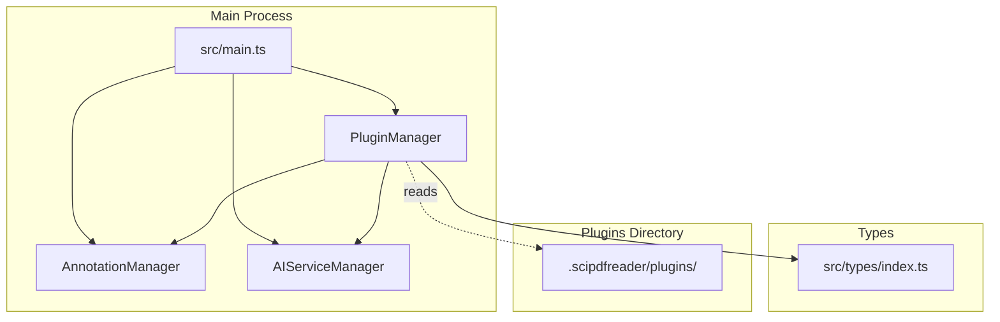
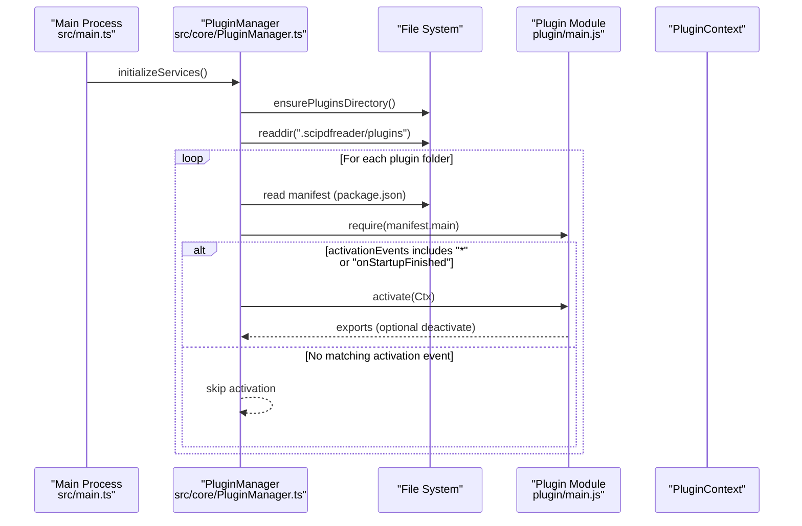
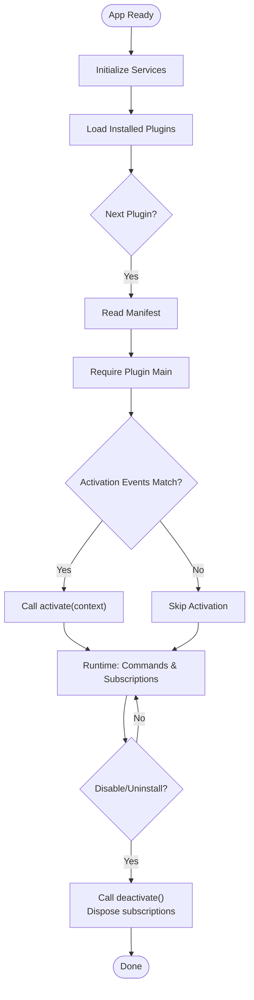
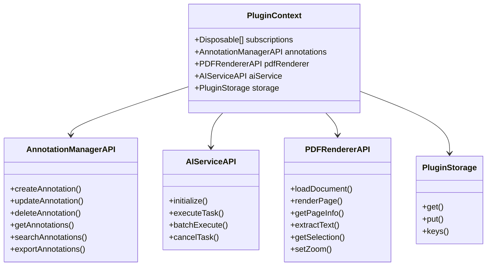
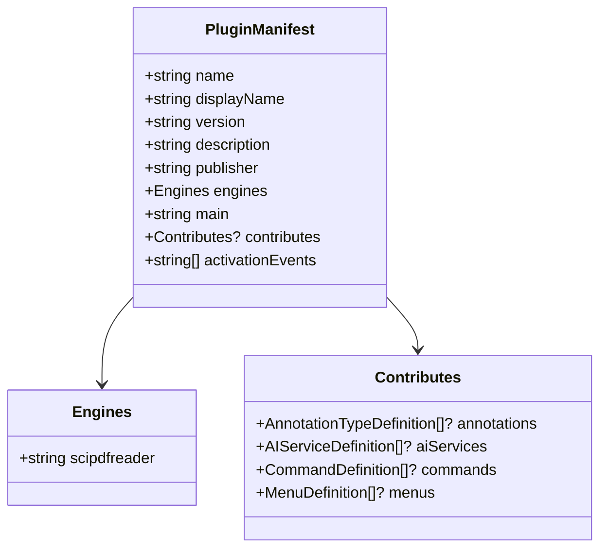
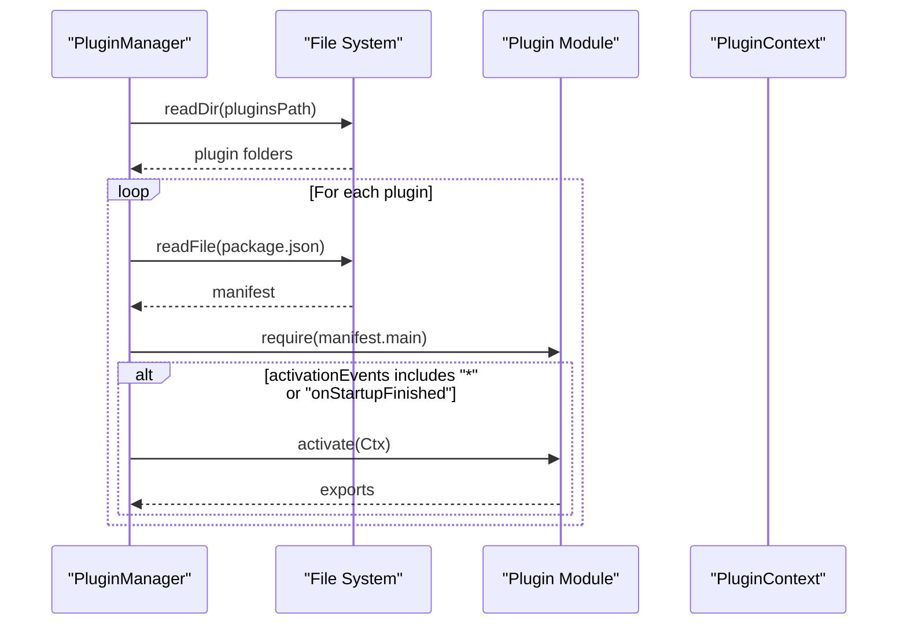
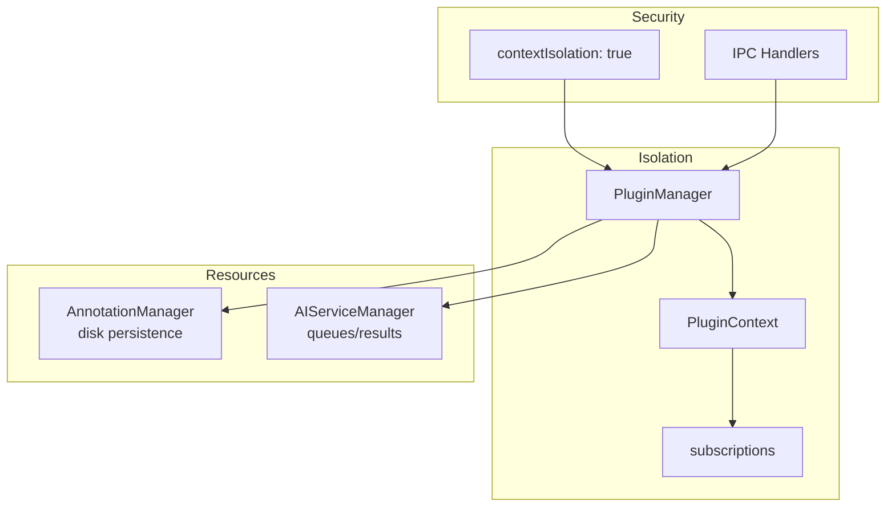
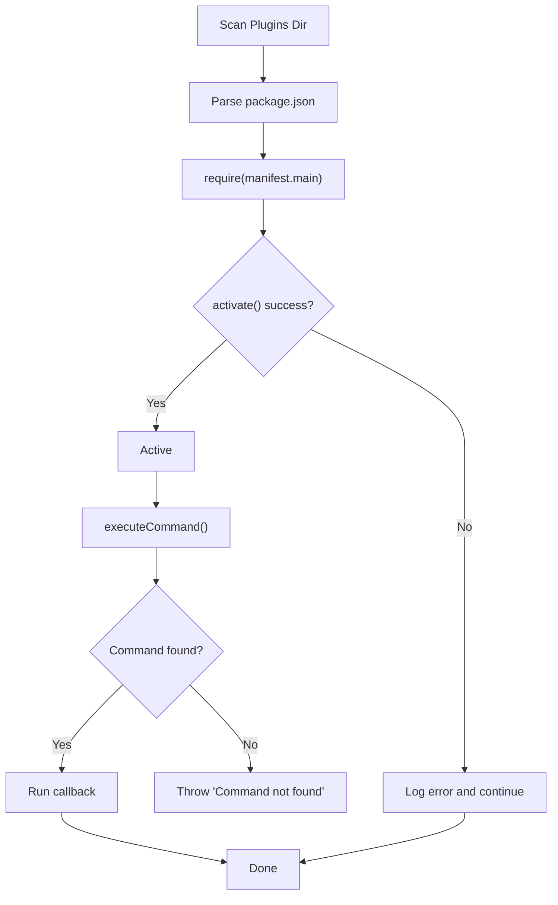
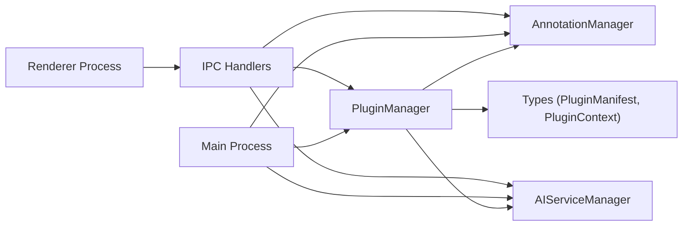

# Plugin Architecture

<cite>
**Referenced Files in This Document**
- [main.ts](file://src/main.ts)
- [PluginManager.ts](file://src/core/PluginManager.ts)
- [AnnotationManager.ts](file://src/core/AnnotationManager.ts)
- [AIServiceManager.ts](file://src/core/AIServiceManager.ts)
- [index.ts](file://src/types/index.ts)
- [PLUGIN-GUIDE.md](file://PLUGIN-GUIDE.md)
- [README.md](file://README.md)
- [package.json](file://package.json)
</cite>

## Table of Contents
1. [Introduction](#introduction)
2. [Project Structure](#project-structure)
3. [Core Components](#core-components)
4. [Architecture Overview](#architecture-overview)
5. [Detailed Component Analysis](#detailed-component-analysis)
6. [Dependency Analysis](#dependency-analysis)
7. [Performance Considerations](#performance-considerations)
8. [Troubleshooting Guide](#troubleshooting-guide)
9. [Conclusion](#conclusion)
10. [Appendices](#appendices)

## Introduction
This document explains the VS Code-inspired plugin architecture used by SciPDFReader. It covers the plugin lifecycle from activation to deactivation, activation events such as onStartupFinished, the PluginContext API that exposes core services (annotations, AI services, PDF renderer, storage), the plugin manifest structure with contributes for annotations, commands, and UI extensions, the factory pattern for dynamic plugin loading and instantiation, isolation and security boundaries, resource management, discovery and dependency resolution, and error handling strategies. Concrete examples are referenced from the codebase to illustrate proper initialization and cleanup patterns.

## Project Structure
SciPDFReader organizes the plugin system around a small set of core modules and shared type definitions. The main process initializes managers and the plugin manager, which discovers and loads plugins from a user-specific directory. Types define the plugin contract, including manifests, context APIs, and data structures.

**Diagram sources**
- [main.ts:45-60](file://src/main.ts#L45-L60)
- [PluginManager.ts:15-35](file://src/core/PluginManager.ts#L15-L35)
- [index.ts:86-103](file://src/types/index.ts#L86-L103)

**Section sources**
- [main.ts:1-156](file://src/main.ts#L1-L156)
- [PluginManager.ts:1-247](file://src/core/PluginManager.ts#L1-L247)
- [index.ts:1-224](file://src/types/index.ts#L1-L224)

## Core Components
- PluginManager: Discovers, loads, activates, and manages plugins; exposes PluginContext to plugins; handles command registration and execution; supports enable/disable/uninstall; manages subscriptions and cleanup.
- AnnotationManager: Provides annotation CRUD, search, export, and persistence; registers default and custom annotation types.
- AIServiceManager: Provides AI task execution (translation, summarization, background info, keyword extraction, question answering) with queueing and cancellation.
- PluginContext: The API surface provided to plugins, including annotations, AI service, PDF renderer stub, and storage.
- Manifest and Types: Define plugin metadata, contributes, activation events, and API contracts.

**Section sources**
- [PluginManager.ts:15-198](file://src/core/PluginManager.ts#L15-L198)
- [AnnotationManager.ts:6-171](file://src/core/AnnotationManager.ts#L6-L171)
- [AIServiceManager.ts:3-213](file://src/core/AIServiceManager.ts#L3-L213)
- [index.ts:86-177](file://src/types/index.ts#L86-L177)

## Architecture Overview
The plugin system follows a VS Code-inspired model:
- Discovery: PluginManager scans a user-specific plugins directory for plugin packages.
- Loading: Each plugin’s manifest is parsed; the main entry is dynamically required.
- Activation: If activationEvents match, the plugin’s activate function is invoked with PluginContext.
- Runtime: Plugins register commands and subscriptions; commands are executed via PluginManager.
- Deactivation: Plugins can export deactivate; PluginManager disposes subscriptions and invokes deactivate when disabling/uninstalling.

**Diagram sources**
- [main.ts:45-60](file://src/main.ts#L45-L60)
- [PluginManager.ts:48-118](file://src/core/PluginManager.ts#L48-L118)

**Section sources**
- [main.ts:45-60](file://src/main.ts#L45-L60)
- [PluginManager.ts:48-118](file://src/core/PluginManager.ts#L48-L118)

## Detailed Component Analysis

### Plugin Lifecycle
- Discovery and Loading:
  - PluginManager ensures the plugins directory exists and enumerates subfolders.
  - For each folder, it reads the manifest and requires the main entry.
- Activation:
  - If activationEvents includes "*" or "onStartupFinished", PluginManager calls the plugin’s activate function with PluginContext.
- Runtime:
  - Plugins register commands and subscriptions via PluginContext.subscriptions.
  - Commands are executed through PluginManager.executeCommand.
- Deactivation:
  - When disabling or uninstalling, PluginManager calls deactivate (if exported) and disposes all subscriptions.

**Diagram sources**
- [main.ts:45-60](file://src/main.ts#L45-L60)
- [PluginManager.ts:48-172](file://src/core/PluginManager.ts#L48-L172)

**Section sources**
- [PluginManager.ts:48-172](file://src/core/PluginManager.ts#L48-L172)

### PluginContext API
PluginContext provides a sandboxed API surface to plugins:
- subscriptions: Array of Disposable objects; PluginManager disposes them on disable/uninstall.
- annotations: AnnotationManagerAPI wrapper exposing create/update/delete/get/search/export.
- aiService: AIServiceAPI wrapper exposing initialize, executeTask, batchExecute, cancelTask.
- pdfRenderer: PDFRendererAPI stub; future implementation will expose document loading, rendering, text extraction, selection, and zoom controls.
- storage: PluginStorage abstraction for persistent key/value storage.

**Diagram sources**
- [index.ts:136-177](file://src/types/index.ts#L136-L177)

**Section sources**
- [index.ts:136-177](file://src/types/index.ts#L136-L177)
- [PluginManager.ts:200-245](file://src/core/PluginManager.ts#L200-L245)

### Plugin Manifest and Contributes
The manifest defines plugin identity, engine compatibility, entry point, activation events, and contribution points:
- name, displayName, version, description, publisher, engines, main
- contributes: annotations, aiServices, commands, menus
- activationEvents: array of activation triggers (e.g., "*", "onStartupFinished")

**Diagram sources**
- [index.ts:86-103](file://src/types/index.ts#L86-L103)

**Section sources**
- [index.ts:86-103](file://src/types/index.ts#L86-L103)
- [PLUGIN-GUIDE.md:65-97](file://PLUGIN-GUIDE.md#L65-L97)

### Factory Pattern for Dynamic Loading
- Discovery: PluginManager enumerates plugin directories and reads manifests.
- Instantiation: PluginManager dynamically requires the module specified by manifest.main.
- Activation: PluginManager passes PluginContext to the plugin’s activate function.
- Command Registration: Plugins push Disposable objects into context.subscriptions; PluginManager maintains a registry of commands.

**Diagram sources**
- [PluginManager.ts:48-118](file://src/core/PluginManager.ts#L48-L118)

**Section sources**
- [PluginManager.ts:48-118](file://src/core/PluginManager.ts#L48-L118)

### Plugin Isolation, Security Boundaries, and Resource Management
- Security:
  - Electron contextIsolation is enabled in the main window; preload scripts mediate IPC.
  - Plugins run in the main process via require; they do not execute in the renderer process.
- Isolation:
  - Each plugin receives a PluginContext with scoped APIs; PluginManager manages subscriptions and disposal.
  - PluginManager maintains separate maps for plugins, commands, and exports.
- Resource Management:
  - PluginManager disposes subscriptions on disable/uninstall.
  - AnnotationManager persists annotations to disk; AIServiceManager manages task queues and results.

**Diagram sources**
- [main.ts:15-27](file://src/main.ts#L15-L27)
- [main.ts:144-155](file://src/main.ts#L144-L155)
- [PluginManager.ts:157-190](file://src/core/PluginManager.ts#L157-L190)

**Section sources**
- [main.ts:15-27](file://src/main.ts#L15-L27)
- [main.ts:144-155](file://src/main.ts#L144-L155)
- [PluginManager.ts:157-190](file://src/core/PluginManager.ts#L157-L190)

### Plugin Discovery, Dependency Resolution, and Error Handling
- Discovery:
  - PluginManager scans user data directory for plugin folders and reads package.json manifests.
- Dependency Resolution:
  - Plugins declare engine compatibility; PluginManager uses manifest.main to locate the entry module.
- Error Handling:
  - PluginManager logs failures during load/activation and rethrows to surface errors.
  - AnnotationManager/AIServiceManager wrap operations with try/catch and propagate errors.
  - IPC handlers validate initialization state and return structured error responses.

**Diagram sources**
- [PluginManager.ts:48-142](file://src/core/PluginManager.ts#L48-L142)

**Section sources**
- [PluginManager.ts:48-142](file://src/core/PluginManager.ts#L48-L142)
- [AnnotationManager.ts:46-75](file://src/core/AnnotationManager.ts#L46-L75)
- [AIServiceManager.ts:13-56](file://src/core/AIServiceManager.ts#L13-L56)
- [main.ts:123-142](file://src/main.ts#L123-L142)

### Concrete Examples from the Codebase
- Plugin Initialization and Cleanup:
  - Example plugin activation pattern and deactivation are shown in the plugin guide, demonstrating how plugins register commands and clean up subscriptions.
- Proper Plugin Initialization:
  - The main process initializes managers and the plugin manager, then auto-loads installed plugins after the app is ready.
- Cleanup Patterns:
  - PluginManager disables plugins and disposes subscriptions; AnnotationManager persists data to disk; AIServiceManager cancels pending tasks.

**Section sources**
- [PLUGIN-GUIDE.md:70-140](file://PLUGIN-GUIDE.md#L70-L140)
- [main.ts:45-60](file://src/main.ts#L45-L60)
- [PluginManager.ts:157-190](file://src/core/PluginManager.ts#L157-L190)
- [AnnotationManager.ts:153-170](file://src/core/AnnotationManager.ts#L153-L170)
- [AIServiceManager.ts:77-82](file://src/core/AIServiceManager.ts#L77-L82)

## Dependency Analysis
The plugin system exhibits low coupling between core modules and plugins:
- PluginManager depends on AnnotationManager and AIServiceManager to construct PluginContext.
- Plugin modules depend on the PluginContext API contract defined in types.
- IPC handlers bridge renderer and main process, delegating to managers and PluginManager.

**Diagram sources**
- [main.ts:45-60](file://src/main.ts#L45-L60)
- [PluginManager.ts:15-35](file://src/core/PluginManager.ts#L15-L35)
- [index.ts:86-177](file://src/types/index.ts#L86-L177)

**Section sources**
- [main.ts:45-60](file://src/main.ts#L45-L60)
- [PluginManager.ts:15-35](file://src/core/PluginManager.ts#L15-L35)
- [index.ts:86-177](file://src/types/index.ts#L86-L177)

## Performance Considerations
- Plugin Loading:
  - Batch plugin discovery and activation; avoid synchronous filesystem operations on the main thread.
- Command Execution:
  - Keep command callbacks lightweight; offload heavy work to background tasks or AI service batching.
- Annotation Persistence:
  - Persist annotations asynchronously to minimize UI blocking.
- AI Tasks:
  - Use batchExecute for multiple tasks; cancel pending tasks on disable/uninstall.

## Troubleshooting Guide
- Plugin fails to load:
  - Verify manifest presence and correctness; check activationEvents; review console logs for load/activation errors.
- Command not found:
  - Ensure the command was registered and the plugin is enabled; confirm the command ID matches.
- Annotation/AI operations fail:
  - Confirm managers are initialized; check error messages returned by IPC handlers.
- Plugin not activating:
  - Ensure activationEvents includes "*" or "onStartupFinished"; verify the plugin’s activate function signature and return.

**Section sources**
- [PluginManager.ts:48-142](file://src/core/PluginManager.ts#L48-L142)
- [main.ts:123-142](file://src/main.ts#L123-L142)

## Conclusion
SciPDFReader’s plugin architecture closely mirrors VS Code’s design: a discoverable, manifest-driven system with a sandboxed PluginContext API, activation events, and robust lifecycle management. The PluginManager orchestrates discovery, loading, activation, command routing, and cleanup, while AnnotationManager and AIServiceManager provide core services. The system balances extensibility with security and resource management, enabling developers to build powerful PDF-centric extensions safely and efficiently.

## Appendices

### Appendix A: Activation Events
- Supported events in this implementation:
  - "*": activate immediately upon load
  - "onStartupFinished": activate after the app is ready
- Future expansion could include events like "onDocumentOpen" by extending activation checks in PluginManager.

**Section sources**
- [PluginManager.ts:94-97](file://src/core/PluginManager.ts#L94-L97)

### Appendix B: Plugin Manifest Reference
- Required fields: name, displayName, version, description, publisher, engines.scipdfreader, main
- Optional fields: contributes (annotations, aiServices, commands, menus), activationEvents

**Section sources**
- [index.ts:86-103](file://src/types/index.ts#L86-L103)
- [PLUGIN-GUIDE.md:65-97](file://PLUGIN-GUIDE.md#L65-L97)

### Appendix C: Example Plugin Structure
- A minimal plugin includes a package.json manifest and an extension.ts with activate/deactivate functions, registering commands and annotations.

**Section sources**
- [PLUGIN-GUIDE.md:52-140](file://PLUGIN-GUIDE.md#L52-L140)