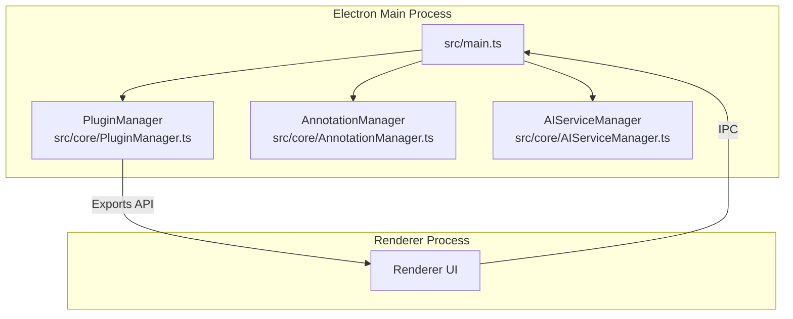
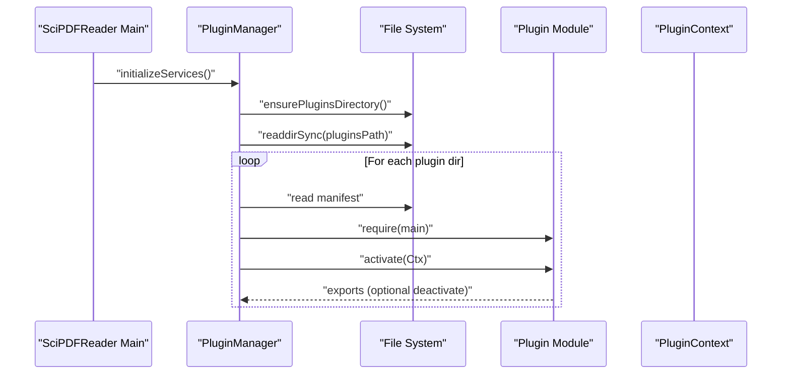
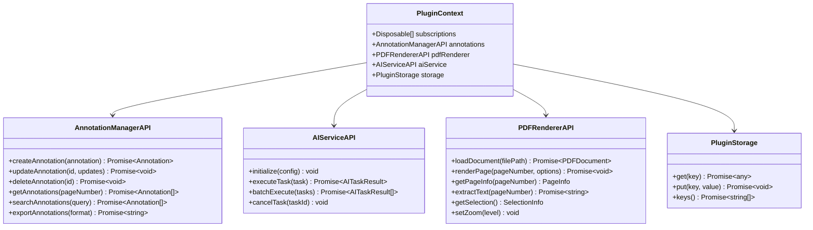
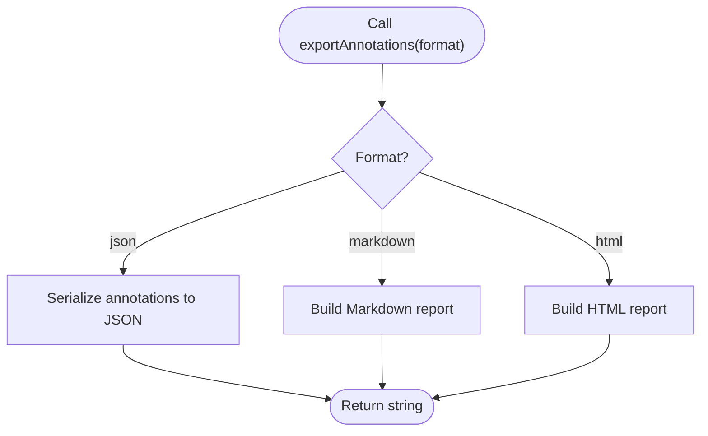
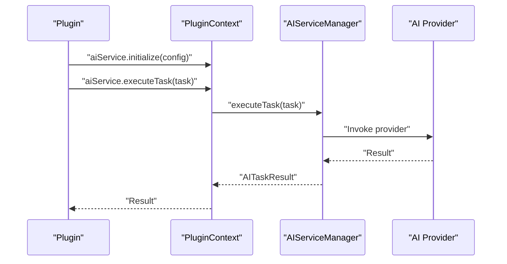
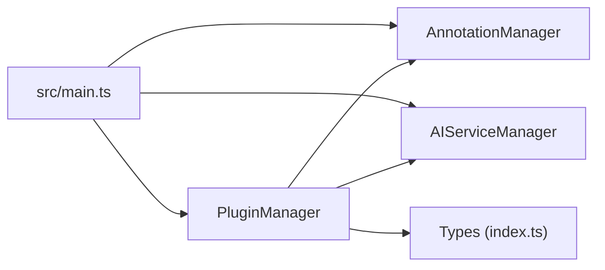

# Plugin Development Guide

<cite>
**Referenced Files in This Document**
- [src/main.ts](file://src/main.ts)
- [src/core/PluginManager.ts](file://src/core/PluginManager.ts)
- [src/core/AnnotationManager.ts](file://src/core/AnnotationManager.ts)
- [src/core/AIServiceManager.ts](file://src/core/AIServiceManager.ts)
- [src/types/index.ts](file://src/types/index.ts)
- [PLUGIN-GUIDE.md](file://PLUGIN-GUIDE.md)
- [README.md](file://README.md)
- [DESIGN.md](file://DESIGN.md)
- [package.json](file://package.json)
</cite>

## Table of Contents
1. [Introduction](#introduction)
2. [Project Structure](#project-structure)
3. [Core Components](#core-components)
4. [Architecture Overview](#architecture-overview)
5. [Detailed Component Analysis](#detailed-component-analysis)
6. [Dependency Analysis](#dependency-analysis)
7. [Performance Considerations](#performance-considerations)
8. [Troubleshooting Guide](#troubleshooting-guide)
9. [Conclusion](#conclusion)
10. [Appendices](#appendices)

## Introduction
This guide explains how to develop plugins for SciPDFReader, following a VS Code-inspired plugin architecture. It covers plugin structure conventions, manifest configuration, activation lifecycle, and the PluginContext API that exposes core services such as annotation management, AI service integration, PDF rendering capabilities, and storage. You will learn how to build everything from a simple “hello world” plugin to advanced functionality involving command registration, UI integration, and data persistence. The guide also includes best practices, security considerations, testing and debugging strategies, distribution, installation, and version management, with concrete examples drawn from the included plugin guide.

## Project Structure
SciPDFReader is an Electron-based application with a modular core and a plugin system. The main process initializes managers for annotations, AI services, and plugins, and exposes IPC handlers for renderer-to-main communication. The plugin system loads installed plugins from a user-specific directory and activates them according to declared activation events.

**Diagram sources**
- [src/main.ts:44-59](file://src/main.ts#L44-L59)
- [src/core/PluginManager.ts:15-35](file://src/core/PluginManager.ts#L15-L35)
- [src/core/AnnotationManager.ts:6-19](file://src/core/AnnotationManager.ts#L6-L19)
- [src/core/AIServiceManager.ts:3-11](file://src/core/AIServiceManager.ts#L3-L11)

**Section sources**
- [src/main.ts:12-59](file://src/main.ts#L12-L59)
- [src/core/PluginManager.ts:37-69](file://src/core/PluginManager.ts#L37-L69)
- [README.md:13-29](file://README.md#L13-L29)

## Core Components
This section introduces the core services that plugins consume through the PluginContext API.

- AnnotationManager: Manages creation, update, deletion, retrieval, search, and export of annotations. It persists annotations locally and registers default annotation types.
- AIServiceManager: Provides AI task execution (translation, summarization, background info, keyword extraction, question answering), batching, cancellation, and status tracking.
- PluginManager: Loads and activates plugins from the user’s plugin directory, constructs the PluginContext, and exposes APIs for commands, annotations, AI services, PDF renderer, and storage.

Key responsibilities:
- Plugin discovery and activation based on manifest activation events.
- Safe subscription management for disposables.
- IPC bridge for renderer-side plugin commands and annotation type registration.

**Section sources**
- [src/core/AnnotationManager.ts:46-112](file://src/core/AnnotationManager.ts#L46-L112)
- [src/core/AIServiceManager.ts:8-92](file://src/core/AIServiceManager.ts#L8-L92)
- [src/core/PluginManager.ts:71-118](file://src/core/PluginManager.ts#L71-L118)

## Architecture Overview
The plugin architecture mirrors VS Code’s model:
- Plugins are self-contained packages with a manifest declaring metadata, contribution points, and activation events.
- Activation occurs when the host application meets declared activation conditions (e.g., startup completion).
- Plugins receive a PluginContext containing typed APIs for annotations, AI services, PDF renderer, and storage.
- Commands are registered via the PluginContext and executed through IPC.

**Diagram sources**
- [src/main.ts:44-59](file://src/main.ts#L44-L59)
- [src/core/PluginManager.ts:48-118](file://src/core/PluginManager.ts#L48-L118)

**Section sources**
- [src/core/PluginManager.ts:15-35](file://src/core/PluginManager.ts#L15-L35)
- [src/main.ts:106-118](file://src/main.ts#L106-L118)

## Detailed Component Analysis

### Plugin Manifest and Conventions
A plugin package must include:
- A manifest (package.json) with required fields: name, displayName, version, description, publisher, engines.scipdfreader, main, and optional contributes and activationEvents.
- A main entry point that exports an activate function receiving PluginContext and optionally a deactivate function.
- A user-installable directory under the platform-specific application data path.

Activation events:
- Supported event patterns include wildcard and startup completion triggers. Plugins are activated when the host signals readiness or when the manifest declares broad activation.

Contribution points:
- annotations: Define custom annotation types with labels, colors, and icons.
- aiServices: Declare AI service endpoints or configurations.
- commands: Register commands with titles and categories.
- menus: Define menu items bound to commands.

**Section sources**
- [src/types/index.ts:86-103](file://src/types/index.ts#L86-L103)
- [src/core/PluginManager.ts:94-97](file://src/core/PluginManager.ts#L94-L97)
- [PLUGIN-GUIDE.md:65-97](file://PLUGIN-GUIDE.md#L65-L97)

### PluginContext API Reference
The PluginContext provides typed access to core services. Each API is exposed via the PluginManager and wraps underlying managers.

- annotations: AnnotationManagerAPI
  - Methods: createAnnotation, updateAnnotation, deleteAnnotation, getAnnotations, searchAnnotations, exportAnnotations
  - Parameters and return types are defined in the types module.
- aiService: AIServiceAPI
  - Methods: initialize, executeTask, batchExecute, cancelTask
  - Parameters and return types are defined in the types module.
- pdfRenderer: PDFRendererAPI
  - Methods: loadDocument, renderPage, getPageInfo, extractText, getSelection, setZoom
  - Parameters and return types are defined in the types module.
- storage: PluginStorage
  - Methods: get, put, keys
  - Parameters and return types are defined in the types module.

**Diagram sources**
- [src/types/index.ts:136-177](file://src/types/index.ts#L136-L177)
- [src/core/PluginManager.ts:200-245](file://src/core/PluginManager.ts#L200-L245)

**Section sources**
- [src/types/index.ts:136-177](file://src/types/index.ts#L136-L177)
- [src/core/PluginManager.ts:200-245](file://src/core/PluginManager.ts#L200-L245)

### Annotation APIs
- createAnnotation: Creates a new annotation with a generated ID and timestamps.
- updateAnnotation: Updates existing annotation fields.
- deleteAnnotation: Removes an annotation.
- getAnnotations: Retrieves annotations for a given page number.
- searchAnnotations: Searches across content and annotation text.
- exportAnnotations: Exports annotations to JSON, Markdown, or HTML.

**Diagram sources**
- [src/core/AnnotationManager.ts:96-151](file://src/core/AnnotationManager.ts#L96-L151)

**Section sources**
- [src/core/AnnotationManager.ts:46-112](file://src/core/AnnotationManager.ts#L46-L112)
- [src/types/index.ts:148-155](file://src/types/index.ts#L148-L155)

### AI Service APIs
- initialize: Configures the AI provider, model, and credentials.
- executeTask: Executes a single AI task and returns results with metadata.
- batchExecute: Processes multiple tasks and aggregates results.
- cancelTask: Cancels a pending task by ID.

**Diagram sources**
- [src/core/AIServiceManager.ts:8-56](file://src/core/AIServiceManager.ts#L8-L56)
- [src/types/index.ts:166-171](file://src/types/index.ts#L166-L171)

**Section sources**
- [src/core/AIServiceManager.ts:8-92](file://src/core/AIServiceManager.ts#L8-L92)
- [src/types/index.ts:166-171](file://src/types/index.ts#L166-L171)

### PDF Renderer APIs
- loadDocument: Loads a PDF and returns document metadata.
- renderPage: Renders a page with optional scaling or viewport.
- getPageInfo: Retrieves page dimensions and rotation.
- extractText: Extracts text from a page.
- getSelection: Returns current selection text and ranges.
- setZoom: Adjusts the zoom level.

Note: The renderer API is currently stubbed in the PluginManager and will be backed by PDF.js in the future.

**Section sources**
- [src/core/PluginManager.ts:222-232](file://src/core/PluginManager.ts#L222-L232)
- [src/types/index.ts:157-164](file://src/types/index.ts#L157-L164)

### Storage APIs
- get: Retrieves a stored value by key.
- put: Stores a value by key.
- keys: Lists stored keys.

Storage is currently a placeholder and will be implemented to persist plugin-scoped data.

**Section sources**
- [src/core/PluginManager.ts:234-245](file://src/core/PluginManager.ts#L234-L245)
- [src/types/index.ts:173-177](file://src/types/index.ts#L173-L177)

### Step-by-Step Plugin Creation Examples

#### Hello World Plugin
- Create a minimal plugin with a manifest and an activate function that logs activation and registers a disposable command.
- Use the PluginContext to access annotations and PDF renderer APIs.
- Ensure the plugin’s main entry exports activate and optionally deactivate.

References:
- [PLUGIN-GUIDE.md:22-140](file://PLUGIN-GUIDE.md#L22-L140)

#### Translation Plugin
- Register a command that translates selected text using the AI service and creates a translation annotation.
- Demonstrate selection retrieval, AI task execution, and annotation creation.

References:
- [PLUGIN-GUIDE.md:242-277](file://PLUGIN-GUIDE.md#L242-L277)

#### Auto Background Info Plugin
- Automatically extract keywords and background information for key concepts on a page.
- Batch-create background info annotations with metadata.

References:
- [PLUGIN-GUIDE.md:279-323](file://PLUGIN-GUIDE.md#L279-L323)

#### Summary Generator Plugin
- Generate page summaries using AI and annotate the document with a note-style annotation.

References:
- [PLUGIN-GUIDE.md:325-359](file://PLUGIN-GUIDE.md#L325-L359)

## Dependency Analysis
The main process initializes and wires core services, while the PluginManager orchestrates plugin lifecycle and exposes APIs to plugins.

**Diagram sources**
- [src/main.ts:44-59](file://src/main.ts#L44-L59)
- [src/core/PluginManager.ts:21-35](file://src/core/PluginManager.ts#L21-L35)
- [src/types/index.ts:1-11](file://src/types/index.ts#L1-L11)

**Section sources**
- [src/main.ts:44-59](file://src/main.ts#L44-L59)
- [src/core/PluginManager.ts:21-35](file://src/core/PluginManager.ts#L21-L35)

## Performance Considerations
- Avoid blocking the UI thread in plugins; use asynchronous operations and batch AI requests when possible.
- Minimize filesystem writes; leverage caching for annotations and AI results.
- Use lazy loading for large documents and annotations.
- Prefer incremental updates and efficient search indexing for annotation queries.

## Troubleshooting Guide
Common issues and remedies:
- Plugin fails to load: Verify manifest fields, correct main entry path, and that activation events match host readiness.
- Annotation operations fail: Ensure AnnotationManager is initialized and accessible via PluginContext.
- AI service errors: Confirm initialize was called with valid provider configuration and credentials.
- IPC command not found: Ensure commands are registered via PluginContext and that the host’s command registry is updated.

**Section sources**
- [src/core/PluginManager.ts:120-142](file://src/core/PluginManager.ts#L120-L142)
- [src/main.ts:85-104](file://src/main.ts#L85-L104)

## Conclusion
SciPDFReader’s plugin system enables powerful extensions following a familiar VS Code-like model. By adhering to manifest conventions, leveraging the PluginContext APIs, and following best practices, developers can create robust, secure, and user-friendly plugins that enhance PDF reading, annotation, and AI-driven insights.

## Appendices

### Plugin Lifecycle Events
- onStartupFinished: Activate when the host finishes initializing core services.
- *: Activate immediately upon discovery.

**Section sources**
- [src/core/PluginManager.ts:94-97](file://src/core/PluginManager.ts#L94-L97)

### Distribution, Installation, and Version Management
- Packaging: Compile TypeScript and package the plugin for distribution.
- Installation: Place the plugin folder under the user’s plugin directory and reload the host application.
- Versioning: Use semantic versioning in the manifest and align engines.scipdfreader with compatible host versions.

**Section sources**
- [PLUGIN-GUIDE.md:361-386](file://PLUGIN-GUIDE.md#L361-L386)
- [package.json:1-56](file://package.json#L1-L56)

### Security Considerations
- Sandboxed plugin execution: Limit plugin access to explicit APIs exposed via PluginContext.
- Input validation: Sanitize inputs for AI tasks and annotation creation.
- Data privacy: Respect user data and provide opt-out mechanisms for cloud-based AI services.
- Permissions: Use minimal permissions and clearly document what each plugin accesses.

**Section sources**
- [DESIGN.md:550-566](file://DESIGN.md#L550-L566)

### Testing Strategies
- Unit tests: Mock PluginContext APIs and test plugin logic in isolation.
- Integration tests: Simulate host activation and command execution via IPC.
- UI tests: Validate annotation creation and rendering behavior.

**Section sources**
- [PLUGIN-GUIDE.md:361-374](file://PLUGIN-GUIDE.md#L361-L374)

### Debugging Techniques
- Enable renderer DevTools during development.
- Log plugin lifecycle events and API calls.
- Use try/catch blocks around AI and annotation operations and surface user-friendly error messages.

**Section sources**
- [src/main.ts:32-34](file://src/main.ts#L32-L34)
- [PLUGIN-GUIDE.md:395-408](file://PLUGIN-GUIDE.md#L395-L408)