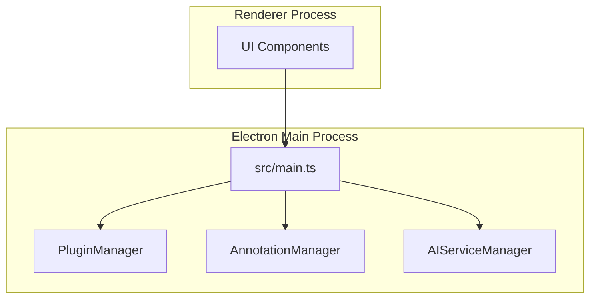
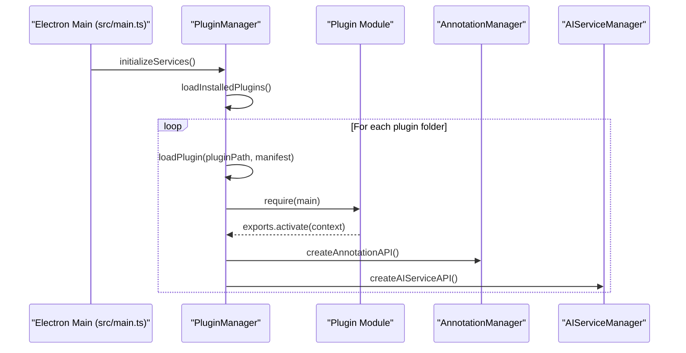
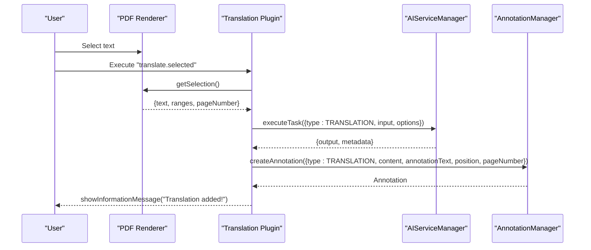
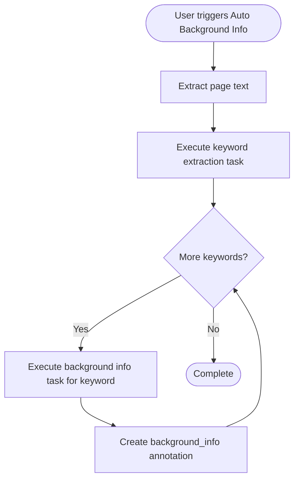
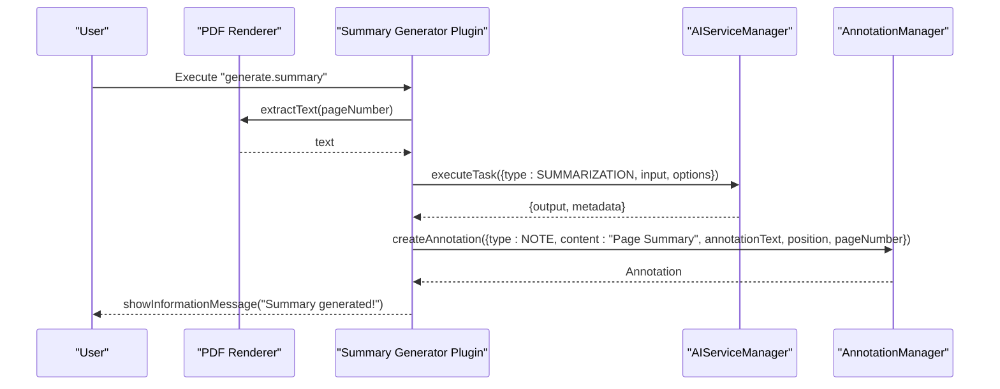
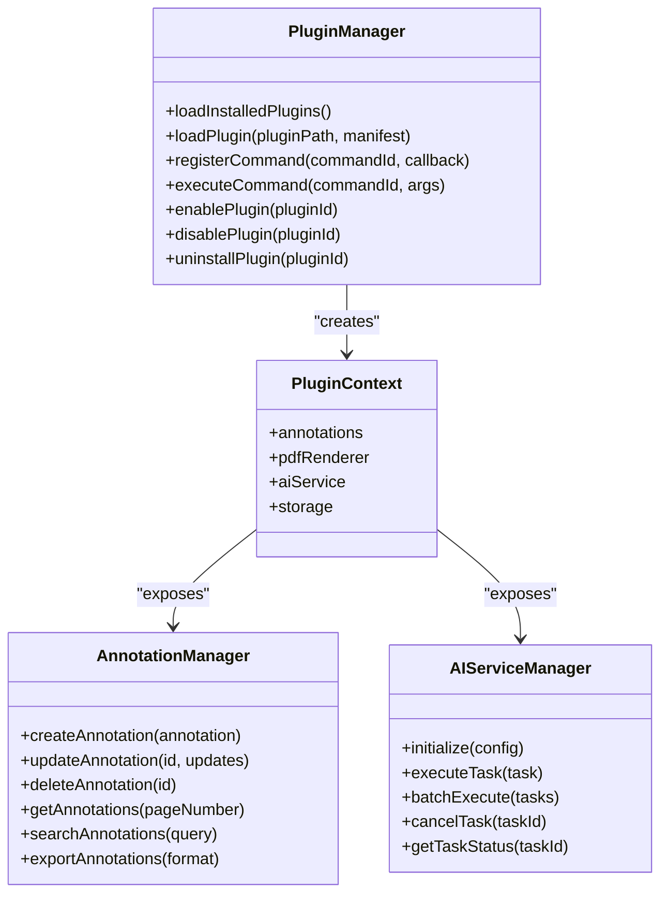

# Plugin Implementation Examples

<cite>
**Referenced Files in This Document**
- [src/main.ts](file://src/main.ts)
- [src/core/PluginManager.ts](file://src/core/PluginManager.ts)
- [src/core/AIServiceManager.ts](file://src/core/AIServiceManager.ts)
- [src/core/AnnotationManager.ts](file://src/core/AnnotationManager.ts)
- [src/types/index.ts](file://src/types/index.ts)
- [PLUGIN-GUIDE.md](file://PLUGIN-GUIDE.md)
- [README.md](file://README.md)
- [DESIGN.md](file://DESIGN.md)
- [package.json](file://package.json)
</cite>

## Table of Contents
1. [Introduction](#introduction)
2. [Project Structure](#project-structure)
3. [Core Components](#core-components)
4. [Architecture Overview](#architecture-overview)
5. [Detailed Component Analysis](#detailed-component-analysis)
6. [Dependency Analysis](#dependency-analysis)
7. [Performance Considerations](#performance-considerations)
8. [Troubleshooting Guide](#troubleshooting-guide)
9. [Conclusion](#conclusion)
10. [Appendices](#appendices)

## Introduction
This document provides practical, step-by-step guidance for developing three example plugins that showcase real-world plugin development patterns in SciPDFReader:
- Translation Plugin: Integrates AI services to automatically translate selected text and attach translations as annotations.
- Auto Background Info Plugin: Detects key concepts and enriches them with background information using AI.
- Summary Generator Plugin: Generates concise summaries of PDF pages using AI.

It covers the complete development lifecycle from project setup to deployment, including TypeScript patterns, error handling, user feedback, advanced topics like batch processing and async operations, UI integration, testing, debugging, performance optimization, and best practices. It also includes templates and boilerplate code to accelerate plugin development.

## Project Structure
SciPDFReader follows a layered architecture with Electron’s main process, a plugin system, and core managers for annotations and AI services. The renderer process interacts with the main process via IPC handlers.

**Diagram sources**
- [src/main.ts:45-60](file://src/main.ts#L45-L60)
- [src/core/PluginManager.ts:16-36](file://src/core/PluginManager.ts#L16-L36)
- [src/core/AnnotationManager.ts:6-19](file://src/core/AnnotationManager.ts#L6-L19)
- [src/core/AIServiceManager.ts:3-11](file://src/core/AIServiceManager.ts#L3-L11)

**Section sources**
- [src/main.ts:13-60](file://src/main.ts#L13-L60)
- [README.md:13-29](file://README.md#L13-L29)

## Core Components
- PluginManager: Loads, activates, and manages plugins; exposes a PluginContext to plugins with APIs for annotations, AI services, PDF renderer stubs, and storage.
- AnnotationManager: Manages annotation creation, updates, deletion, retrieval, search, and export.
- AIServiceManager: Orchestrates AI tasks (translation, summarization, background info, keyword extraction, question answering) with batch execution and cancellation.
- Types: Defines enums, interfaces, and contracts for annotations, AI tasks, plugin manifests, and plugin context.

Key responsibilities:
- PluginManager initializes PluginContext and exposes APIs to plugins.
- AnnotationManager persists annotations and provides search/export.
- AIServiceManager executes tasks and supports batch operations.

**Section sources**
- [src/core/PluginManager.ts:16-250](file://src/core/PluginManager.ts#L16-L250)
- [src/core/AnnotationManager.ts:6-172](file://src/core/AnnotationManager.ts#L6-L172)
- [src/core/AIServiceManager.ts:3-214](file://src/core/AIServiceManager.ts#L3-L214)
- [src/types/index.ts:3-224](file://src/types/index.ts#L3-L224)

## Architecture Overview
The plugin system is inspired by VS Code’s architecture. Plugins are installed under a user-specific plugins directory, loaded dynamically, and activated when their activation events match. Plugins receive a PluginContext containing:
- annotations: CRUD and search/export APIs
- aiService: initialize, executeTask, batchExecute, cancelTask
- pdfRenderer: stubbed PDF renderer APIs
- storage: plugin-scoped storage helpers

**Diagram sources**
- [src/main.ts:45-60](file://src/main.ts#L45-L60)
- [src/core/PluginManager.ts:49-121](file://src/core/PluginManager.ts#L49-L121)

**Section sources**
- [src/core/PluginManager.ts:22-36](file://src/core/PluginManager.ts#L22-L36)
- [src/main.ts:144-156](file://src/main.ts#L144-L156)

## Detailed Component Analysis

### Translation Plugin
Purpose: Automatically translate selected text and attach the translation as an annotation.

Development steps:
1. Create plugin project structure and package.json with contributes for commands and annotations.
2. Implement activate to register a command that:
   - Reads the current selection via pdfRenderer.getSelection().
   - Calls aiService.executeTask with AITaskType.TRANSLATION.
   - Creates an annotation of type AnnotationType.TRANSLATION with the original and translated content.
   - Provides user feedback via informational messages.
3. Handle errors gracefully (e.g., no selection, AI service not initialized).
4. Test by selecting text and invoking the command; verify annotation appears.

Advanced patterns:
- Batch processing: If translating multiple selections, use aiService.batchExecute to reduce latency.
- Async operations: Ensure all async calls are awaited and UI remains responsive.
- UI integration: Use window.showInformationMessage for success, window.showWarningMessage for warnings, and window.showErrorMessage for failures.

**Diagram sources**
- [src/core/AIServiceManager.ts:13-56](file://src/core/AIServiceManager.ts#L13-L56)
- [src/core/AnnotationManager.ts:46-59](file://src/core/AnnotationManager.ts#L46-L59)
- [PLUGIN-GUIDE.md:242-277](file://PLUGIN-GUIDE.md#L242-L277)

**Section sources**
- [PLUGIN-GUIDE.md:242-277](file://PLUGIN-GUIDE.md#L242-L277)
- [src/types/index.ts:3-11](file://src/types/index.ts#L3-L11)

### Auto Background Info Plugin
Purpose: Detect key concepts and enrich them with background information using AI.

Development steps:
1. Create a command that:
   - Extracts text from the current page via pdfRenderer.extractText(pageNumber).
   - Executes a keyword extraction task using aiService.executeTask with AITaskType.KEYWORD_EXTRACTION.
   - Iterates through top keywords and calls aiService.executeTask with AITaskType.BACKGROUND_INFO.
   - Creates annotations of type AnnotationType.BACKGROUND_INFO with metadata indicating auto-generation.
2. Provide user feedback and handle errors (e.g., empty selection, AI service unavailable).
3. Optionally implement throttling or rate limiting for AI calls.

Advanced patterns:
- Batch processing: Use aiService.batchExecute for multiple background info requests.
- Async operations: Process keywords concurrently while respecting rate limits.
- UI integration: Show progress indicators and completion messages.

**Diagram sources**
- [src/core/AIServiceManager.ts:58-75](file://src/core/AIServiceManager.ts#L58-L75)
- [src/core/AnnotationManager.ts:46-59](file://src/core/AnnotationManager.ts#L46-L59)
- [PLUGIN-GUIDE.md:279-323](file://PLUGIN-GUIDE.md#L279-L323)

**Section sources**
- [PLUGIN-GUIDE.md:279-323](file://PLUGIN-GUIDE.md#L279-L323)
- [src/types/index.ts:3-11](file://src/types/index.ts#L3-L11)

### Summary Generator Plugin
Purpose: Generate summaries of PDF pages using AI.

Development steps:
1. Create a command that:
   - Extracts text from the current page.
   - Calls aiService.executeTask with AITaskType.SUMMARIZATION and options like maxLength.
   - Creates a note annotation with the summary content and position.
   - Provides user feedback.
2. Handle errors and edge cases (e.g., empty page text).
3. Optionally integrate with UI to display summary previews.

Advanced patterns:
- Batch processing: Summarize multiple pages by batching tasks.
- Async operations: Ensure UI responsiveness during summarization.
- UI integration: Display summary in a panel or tooltip.

**Diagram sources**
- [src/core/AIServiceManager.ts:111-126](file://src/core/AIServiceManager.ts#L111-L126)
- [src/core/AnnotationManager.ts:46-59](file://src/core/AnnotationManager.ts#L46-L59)
- [PLUGIN-GUIDE.md:325-359](file://PLUGIN-GUIDE.md#L325-L359)

**Section sources**
- [PLUGIN-GUIDE.md:325-359](file://PLUGIN-GUIDE.md#L325-L359)
- [src/types/index.ts:3-11](file://src/types/index.ts#L3-L11)

### Plugin Development Templates and Boilerplate
Use the following templates to accelerate development:

- Basic plugin structure and manifest:
  - [PLUGIN-GUIDE.md:65-97](file://PLUGIN-GUIDE.md#L65-L97)
- Extension entry point:
  - [PLUGIN-GUIDE.md:99-140](file://PLUGIN-GUIDE.md#L99-L140)
- Annotations API usage:
  - [PLUGIN-GUIDE.md:148-174](file://PLUGIN-GUIDE.md#L148-L174)
- AI Service API usage:
  - [PLUGIN-GUIDE.md:178-214](file://PLUGIN-GUIDE.md#L178-L214)
- PDF Renderer API usage:
  - [PLUGIN-GUIDE.md:218-238](file://PLUGIN-GUIDE.md#L218-L238)

Build and run:
- [README.md:46-59](file://README.md#L46-L59)
- [package.json:7-18](file://package.json#L7-L18)

**Section sources**
- [PLUGIN-GUIDE.md:65-140](file://PLUGIN-GUIDE.md#L65-L140)
- [README.md:46-59](file://README.md#L46-L59)
- [package.json:7-18](file://package.json#L7-L18)

## Dependency Analysis
The plugin system depends on:
- Electron main process for IPC and initialization.
- PluginManager for loading and activating plugins.
- AnnotationManager and AIServiceManager for plugin APIs.
- Types for contracts and enums.

**Diagram sources**
- [src/core/PluginManager.ts:16-250](file://src/core/PluginManager.ts#L16-L250)
- [src/core/AnnotationManager.ts:6-172](file://src/core/AnnotationManager.ts#L6-L172)
- [src/core/AIServiceManager.ts:3-214](file://src/core/AIServiceManager.ts#L3-L214)
- [src/types/index.ts:136-177](file://src/types/index.ts#L136-L177)

**Section sources**
- [src/core/PluginManager.ts:22-36](file://src/core/PluginManager.ts#L22-L36)
- [src/types/index.ts:136-177](file://src/types/index.ts#L136-L177)

## Performance Considerations
- Batch processing: Use aiService.batchExecute to reduce network overhead and improve throughput.
- Concurrency: Process multiple tasks concurrently while respecting provider rate limits.
- Caching: Cache AI responses for repeated queries; implement TTL-based invalidation.
- Memory: Avoid retaining large intermediate data structures; dispose subscriptions and timers.
- UI responsiveness: Keep UI off the main thread; use async/await and avoid blocking operations.
- Storage: Persist annotations incrementally and compress large exports.

[No sources needed since this section provides general guidance]

## Troubleshooting Guide
Common issues and resolutions:
- Plugin fails to load:
  - Verify plugin manifest and main entry path.
  - Check activation events and ensure they match startup conditions.
  - Review console logs for load errors.
- AI service not initialized:
  - Ensure aiService.initialize is called with provider credentials before executing tasks.
  - Validate API keys and endpoints.
- No selection or empty page:
  - Guard against empty selections and handle gracefully with user feedback.
- Annotation not appearing:
  - Confirm annotation type registration and permissions.
  - Verify position coordinates and page number alignment.

Testing and debugging:
- Enable development mode to open DevTools.
- Use console logging and window messages for feedback.
- Validate IPC handlers and error propagation.

**Section sources**
- [src/main.ts:33-35](file://src/main.ts#L33-L35)
- [src/main.ts:137-142](file://src/main.ts#L137-L142)
- [src/core/AIServiceManager.ts:8-11](file://src/core/AIServiceManager.ts#L8-L11)
- [PLUGIN-GUIDE.md:395-408](file://PLUGIN-GUIDE.md#L395-L408)

## Conclusion
By following the patterns and templates outlined here, you can build robust, scalable plugins that integrate seamlessly with SciPDFReader’s plugin system. Focus on clean error handling, user feedback, asynchronous operations, and performance optimization. Leverage batch processing and caching for AI-heavy operations, and adhere to best practices for resource management and UI responsiveness.

[No sources needed since this section summarizes without analyzing specific files]

## Appendices

### A. Step-by-Step Plugin Development Workflow
- Project setup:
  - Create plugin directory and initialize package.json.
  - Configure TypeScript compiler options.
  - Reference: [PLUGIN-GUIDE.md:22-50](file://PLUGIN-GUIDE.md#L22-L50)
- Manifest and contribution:
  - Define contributes for commands and annotations.
  - Reference: [PLUGIN-GUIDE.md:65-97](file://PLUGIN-GUIDE.md#L65-L97)
- Activation and context:
  - Implement activate and use PluginContext APIs.
  - Reference: [PLUGIN-GUIDE.md:99-140](file://PLUGIN-GUIDE.md#L99-L140)
- Commands and UI integration:
  - Register commands and provide user feedback.
  - References: [PLUGIN-GUIDE.md:242-277](file://PLUGIN-GUIDE.md#L242-L277), [PLUGIN-GUIDE.md:279-323](file://PLUGIN-GUIDE.md#L279-L323), [PLUGIN-GUIDE.md:325-359](file://PLUGIN-GUIDE.md#L325-L359)
- Testing and deployment:
  - Compile, install locally, and test.
  - References: [PLUGIN-GUIDE.md:361-386](file://PLUGIN-GUIDE.md#L361-L386), [README.md:46-59](file://README.md#L46-L59)

**Section sources**
- [PLUGIN-GUIDE.md:22-50](file://PLUGIN-GUIDE.md#L22-L50)
- [PLUGIN-GUIDE.md:65-140](file://PLUGIN-GUIDE.md#L65-L140)
- [PLUGIN-GUIDE.md:242-359](file://PLUGIN-GUIDE.md#L242-L359)
- [README.md:46-59](file://README.md#L46-L59)

### B. Advanced Patterns and Best Practices
- Batch processing:
  - Use aiService.batchExecute for multiple tasks.
  - Reference: [src/core/AIServiceManager.ts:58-75](file://src/core/AIServiceManager.ts#L58-L75)
- Async operations:
  - Await all promises and avoid blocking UI.
  - Reference: [src/core/PluginManager.ts:114-121](file://src/core/PluginManager.ts#L114-L121)
- UI integration:
  - Provide informative messages and handle errors gracefully.
  - Reference: [PLUGIN-GUIDE.md:395-408](file://PLUGIN-GUIDE.md#L395-L408)
- Error handling:
  - Validate inputs, handle missing selections, and propagate errors.
  - Reference: [src/core/AIServiceManager.ts:14-16](file://src/core/AIServiceManager.ts#L14-L16)
- Performance optimization:
  - Cache results, throttle requests, and minimize memory footprint.
  - Reference: [DESIGN.md:531-549](file://DESIGN.md#L531-L549)

**Section sources**
- [src/core/AIServiceManager.ts:58-75](file://src/core/AIServiceManager.ts#L58-L75)
- [src/core/PluginManager.ts:114-121](file://src/core/PluginManager.ts#L114-L121)
- [PLUGIN-GUIDE.md:395-408](file://PLUGIN-GUIDE.md#L395-L408)
- [DESIGN.md:531-549](file://DESIGN.md#L531-L549)