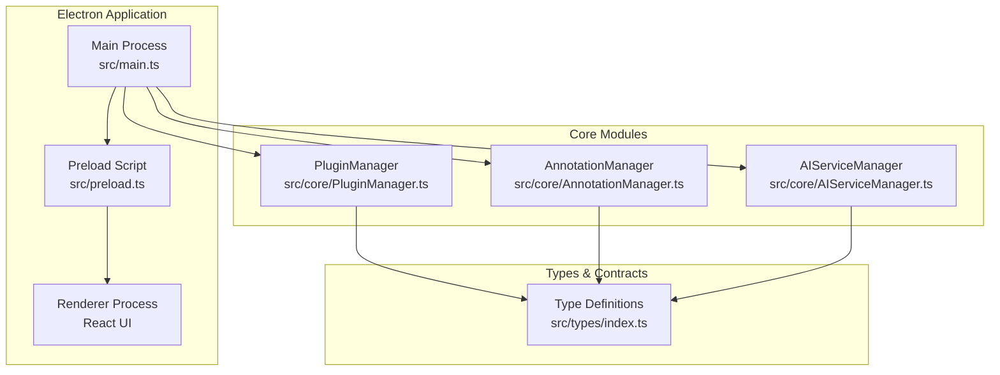
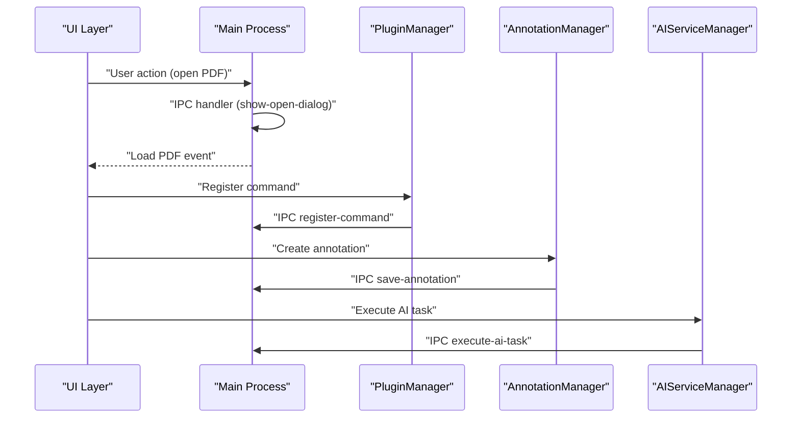
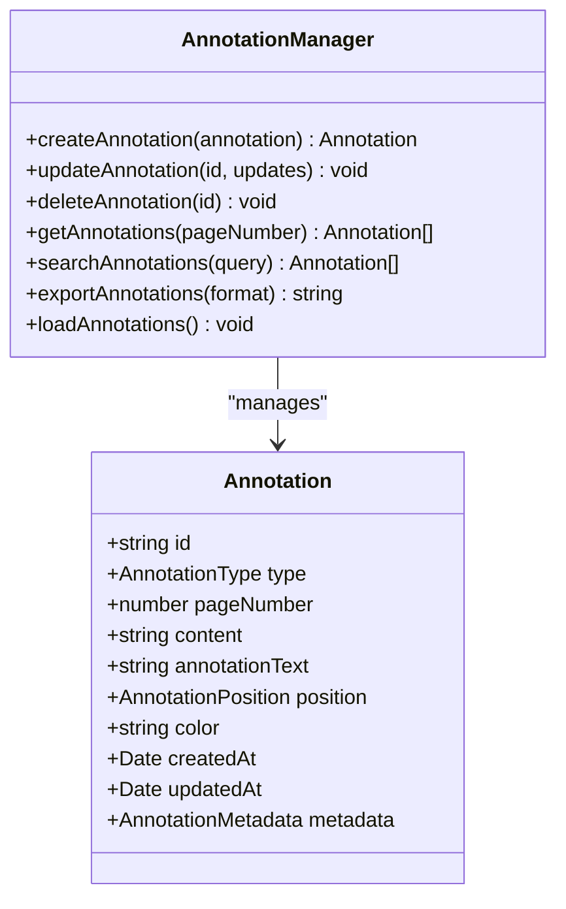
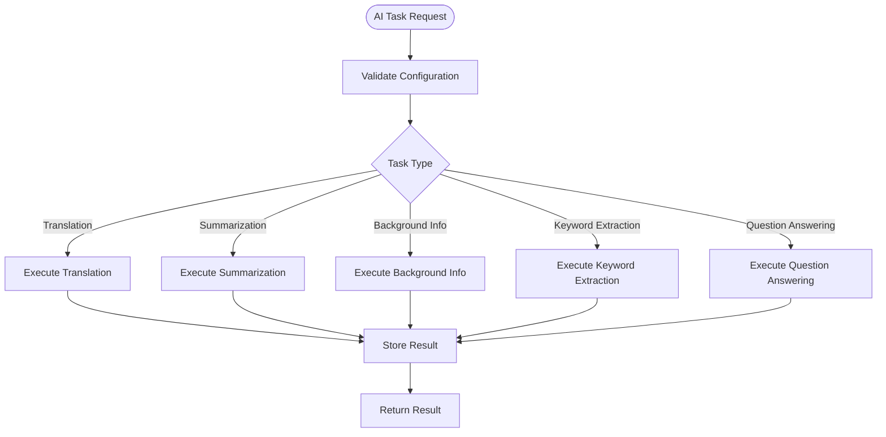
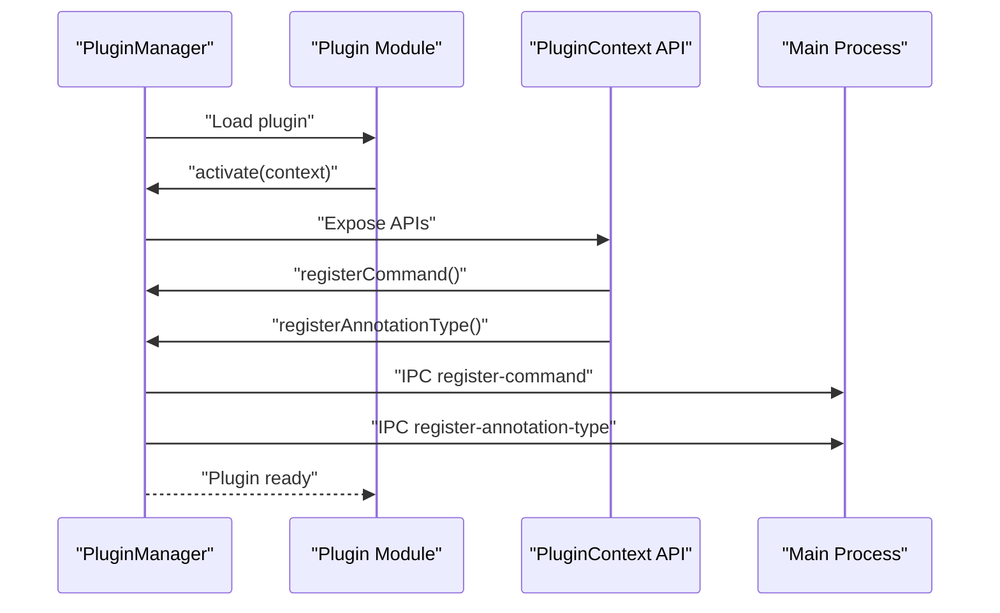
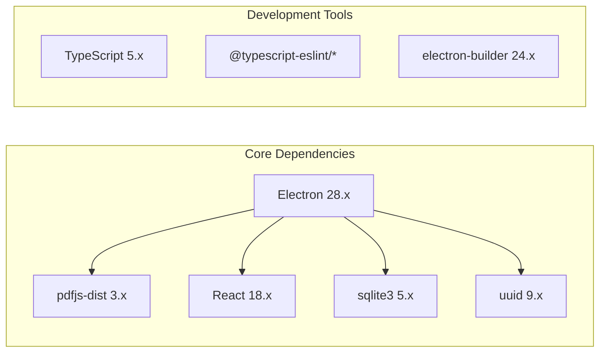

# Features Highlights

<cite>
**Referenced Files in This Document**
- [README.md](file://README.md)
- [PLUGIN-GUIDE.md](file://PLUGIN-GUIDE.md)
- [DESIGN.md](file://DESIGN.md)
- [package.json](file://package.json)
- [src/main.ts](file://src/main.ts)
- [src/preload.ts](file://src/preload.ts)
- [src/core/AnnotationManager.ts](file://src/core/AnnotationManager.ts)
- [src/core/AIServiceManager.ts](file://src/core/AIServiceManager.ts)
- [src/core/PluginManager.ts](file://src/core/PluginManager.ts)
- [src/types/index.ts](file://src/types/index.ts)
- [src/renderer/index.html](file://src/renderer/index.html)
</cite>

## Table of Contents
1. [Introduction](#introduction)
2. [Project Structure](#project-structure)
3. [Core Components](#core-components)
4. [Architecture Overview](#architecture-overview)
5. [Detailed Feature Highlights](#detailed-feature-highlights)
6. [Dependency Analysis](#dependency-analysis)
7. [Performance Considerations](#performance-considerations)
8. [Troubleshooting Guide](#troubleshooting-guide)
9. [Conclusion](#conclusion)

## Introduction
SciPDFReader is an AI-powered, extensible PDF reader built on Electron with a VS Code-inspired plugin architecture. It delivers a modern PDF reading experience with high-quality rendering, intelligent annotation, and powerful AI capabilities. This document highlights the core features and unique value propositions that differentiate SciPDFReader from traditional PDF readers.

## Project Structure
SciPDFReader follows a layered architecture:
- Electron main process orchestrates the application lifecycle and IPC communication
- Renderer process hosts the React-based UI
- Core modules provide annotation management, AI services, and plugin system
- Types define the contracts for annotations, AI tasks, and plugin APIs

**Diagram sources**
- [src/main.ts:1-156](file://src/main.ts#L1-L156)
- [src/preload.ts:1-34](file://src/preload.ts#L1-L34)
- [src/core/AnnotationManager.ts:1-172](file://src/core/AnnotationManager.ts#L1-L172)
- [src/core/AIServiceManager.ts:1-214](file://src/core/AIServiceManager.ts#L1-L214)
- [src/core/PluginManager.ts:1-247](file://src/core/PluginManager.ts#L1-L247)
- [src/types/index.ts:1-224](file://src/types/index.ts#L1-L224)

**Section sources**
- [README.md:13-29](file://README.md#L13-L29)
- [DESIGN.md:51-85](file://DESIGN.md#L51-L85)

## Core Components
- AnnotationManager: Manages annotation creation, updates, deletion, search, and persistence with export capabilities
- AIServiceManager: Provides AI task execution (translation, summarization, background info, keyword extraction, question answering) with configurable providers
- PluginManager: Implements a VS Code-inspired plugin system with command registration, annotation type registration, and plugin lifecycle management

**Section sources**
- [src/core/AnnotationManager.ts:6-172](file://src/core/AnnotationManager.ts#L6-L172)
- [src/core/AIServiceManager.ts:3-214](file://src/core/AIServiceManager.ts#L3-L214)
- [src/core/PluginManager.ts:15-247](file://src/core/PluginManager.ts#L15-L247)

## Architecture Overview
SciPDFReader integrates PDF.js for rendering, Electron for cross-platform desktop deployment, and a plugin architecture enabling extensibility. The main process handles IPC communication, while the renderer process manages the UI and user interactions.

**Diagram sources**
- [src/main.ts:80-156](file://src/main.ts#L80-L156)
- [src/core/PluginManager.ts:120-142](file://src/core/PluginManager.ts#L120-L142)
- [src/core/AnnotationManager.ts:46-75](file://src/core/AnnotationManager.ts#L46-L75)
- [src/core/AIServiceManager.ts:13-56](file://src/core/AIServiceManager.ts#L13-L56)

## Detailed Feature Highlights

### PDF Reading with High-Quality Rendering
- Built on PDF.js for robust, high-quality PDF rendering
- Supports page navigation, zoom controls, and text selection
- Integrates with Electron's preload bridge for secure IPC communication

Practical usage:
- Open PDF files through the native file dialog
- Navigate pages and adjust zoom levels dynamically
- Select text for annotation or AI operations

**Section sources**
- [README.md:7](file://README.md#L7)
- [DESIGN.md:34-49](file://DESIGN.md#L34-L49)
- [src/main.ts:106-121](file://src/main.ts#L106-L121)
- [src/preload.ts:7-18](file://src/preload.ts#L7-L18)

### Annotation System with Persistence and Export
- Multiple annotation types: highlight, underline, strikethrough, note, translation, background info, and custom
- Rich positioning data including text offsets for precise placement
- Persistent storage with automatic save/load
- Export formats: JSON, Markdown, HTML

Key capabilities:
- Create, update, delete annotations with timestamps
- Search annotations by content or metadata
- Export annotations for sharing or archival
- Register custom annotation types from plugins

**Diagram sources**
- [src/types/index.ts:36-47](file://src/types/index.ts#L36-L47)
- [src/core/AnnotationManager.ts:46-172](file://src/core/AnnotationManager.ts#L46-L172)

**Section sources**
- [src/types/index.ts:3-11](file://src/types/index.ts#L3-L11)
- [src/types/index.ts:13-47](file://src/types/index.ts#L13-L47)
- [src/core/AnnotationManager.ts:21-34](file://src/core/AnnotationManager.ts#L21-L34)
- [src/core/AnnotationManager.ts:96-151](file://src/core/AnnotationManager.ts#L96-L151)

### AI Integration Features
- Translation: Instant translation of selected text with configurable target languages
- Background Information: Automatic detection and contextual information for key concepts
- Summarization: Generate concise summaries of pages or sections
- Smart Annotations: AI-powered automatic annotation based on document content
- Configurable providers: OpenAI, Azure, local models, or custom services

Implementation highlights:
- Task queue management with pending/completed/failed states
- Batch execution for improved performance
- Prompt building for different AI task types
- Mock implementations for local/development environments

**Diagram sources**
- [src/core/AIServiceManager.ts:13-56](file://src/core/AIServiceManager.ts#L13-L56)
- [src/core/AIServiceManager.ts:96-171](file://src/core/AIServiceManager.ts#L96-L171)

**Section sources**
- [README.md:9-11](file://README.md#L9-L11)
- [src/core/AIServiceManager.ts:8-11](file://src/core/AIServiceManager.ts#L8-L11)
- [src/core/AIServiceManager.ts:58-75](file://src/core/AIServiceManager.ts#L58-L75)
- [src/types/index.ts:57-84](file://src/types/index.ts#L57-L84)

### Extensible Plugin System (VS Code-Inspired)
- Plugin architecture with activation events and lifecycle management
- Rich plugin APIs: annotations, PDF renderer, AI service, storage
- Command registration system for custom actions
- Annotation type registration for extending capabilities
- Plugin marketplace infrastructure planned

Plugin capabilities:
- Register custom commands triggered from UI or keyboard shortcuts
- Create custom annotation types with icons and colors
- Integrate with AI services for automated document processing
- Persist plugin-specific data using the storage API

**Diagram sources**
- [src/core/PluginManager.ts:71-104](file://src/core/PluginManager.ts#L71-L104)
- [src/core/PluginManager.ts:120-142](file://src/core/PluginManager.ts#L120-L142)
- [src/main.ts:144-156](file://src/main.ts#L144-L156)

**Section sources**
- [README.md:10](file://README.md#L10)
- [PLUGIN-GUIDE.md:5-13](file://PLUGIN-GUIDE.md#L5-L13)
- [src/core/PluginManager.ts:21-35](file://src/core/PluginManager.ts#L21-L35)
- [src/types/index.ts:136-177](file://src/types/index.ts#L136-L177)

### Cross-Platform Support
- Native Electron build targeting Windows, macOS, and Linux
- Platform-specific packaging configurations
- Consistent user experience across operating systems
- File system integration with platform-appropriate paths

Build targets:
- Windows: NSIS installer
- macOS: App bundle with category assignment
- Linux: AppImage packaging

**Section sources**
- [package.json:35-55](file://package.json#L35-L55)
- [DESIGN.md:17](file://DESIGN.md#L17)

### Practical Feature Usage Examples

#### AI Translation Workflow
1. Select text in the PDF
2. Trigger translation command from plugin or menu
3. AI service processes the request
4. Create translation annotation with original and translated text
5. Display translation in sidebar or tooltip

#### Background Information Plugin
1. Extract text from current page
2. Run keyword extraction AI task
3. For each keyword, execute background info task
4. Create background_info annotations
5. Auto-generate contextual information

#### Custom Annotation Plugin
1. Register custom annotation type in plugin manifest
2. Create command to annotate selected text
3. Use PDF renderer to get selection data
4. Create annotation with custom type and metadata

**Section sources**
- [PLUGIN-GUIDE.md:242-277](file://PLUGIN-GUIDE.md#L242-L277)
- [PLUGIN-GUIDE.md:279-323](file://PLUGIN-GUIDE.md#L279-L323)
- [PLUGIN-GUIDE.md:325-359](file://PLUGIN-GUIDE.md#L325-L359)

## Dependency Analysis
SciPDFReader leverages key external libraries and frameworks:

**Diagram sources**
- [package.json:28-34](file://package.json#L28-L34)
- [package.json:16-27](file://package.json#L16-L27)

**Section sources**
- [package.json:1-57](file://package.json#L1-L57)

## Performance Considerations
- PDF rendering optimization: virtual scrolling, layer separation, Web Worker processing, caching strategies
- AI request optimization: batching, result caching, local model fallback, degradation strategies
- Data storage optimization: incremental storage, compression, indexing for search
- Large document handling: paginated loading, background preloading, lazy annotation loading

## Troubleshooting Guide
Common issues and solutions:
- AI service initialization failures: Verify API keys and provider configuration
- Plugin loading errors: Check plugin manifest format and activation events
- Annotation persistence issues: Confirm data directory permissions and path resolution
- PDF rendering problems: Validate PDF.js integration and document compatibility

**Section sources**
- [src/core/AIServiceManager.ts:14-16](file://src/core/AIServiceManager.ts#L14-L16)
- [src/core/PluginManager.ts:48-69](file://src/core/PluginManager.ts#L48-L69)
- [src/core/AnnotationManager.ts:153-157](file://src/core/AnnotationManager.ts#L153-L157)

## Conclusion
SciPDFReader represents a significant advancement in PDF reading technology by combining high-quality rendering, intelligent annotation, and AI-powered capabilities with an extensible plugin architecture. Its VS Code-inspired design enables a thriving ecosystem of third-party extensions, while its cross-platform Electron foundation ensures broad accessibility. The innovative plugin architecture and AI-powered annotation capabilities position SciPDFReader as a transformative tool for researchers, students, and professionals who need sophisticated PDF analysis and annotation workflows.