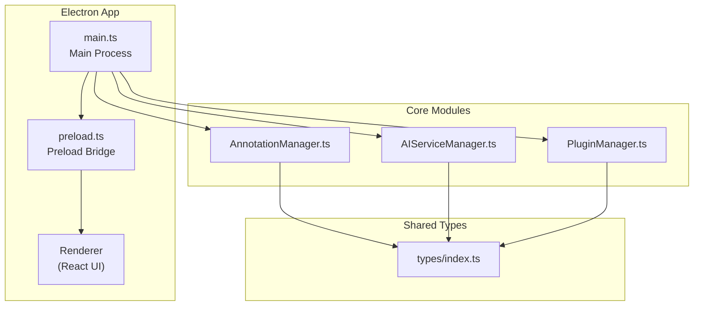
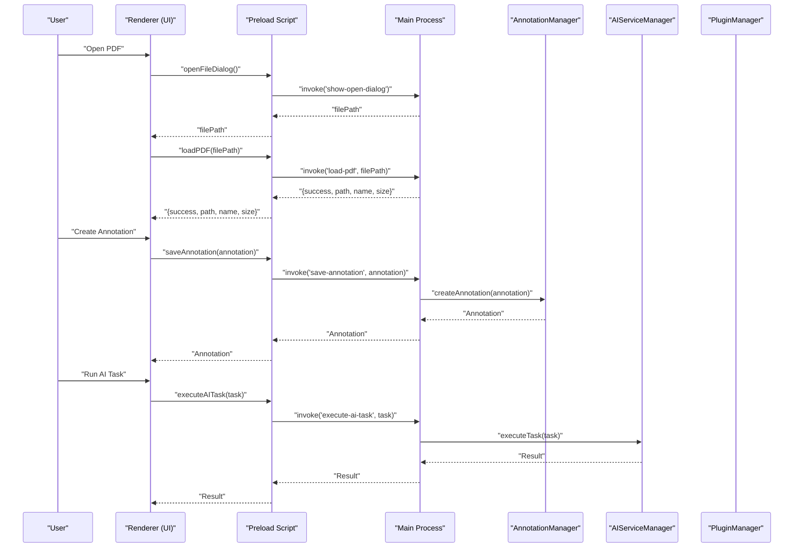
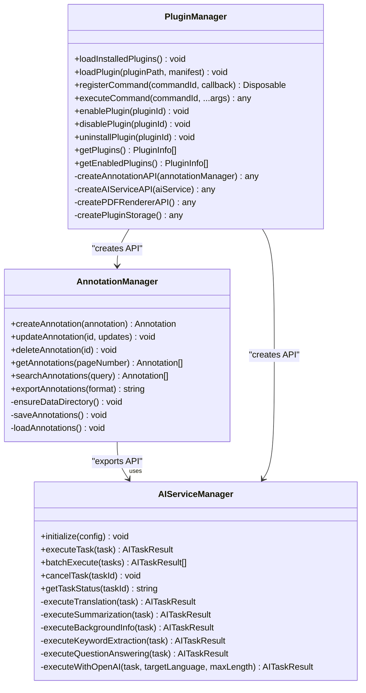
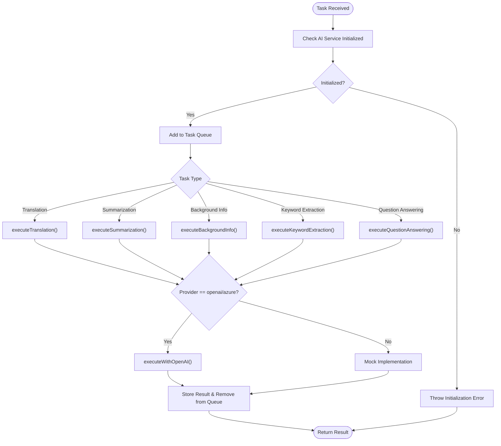
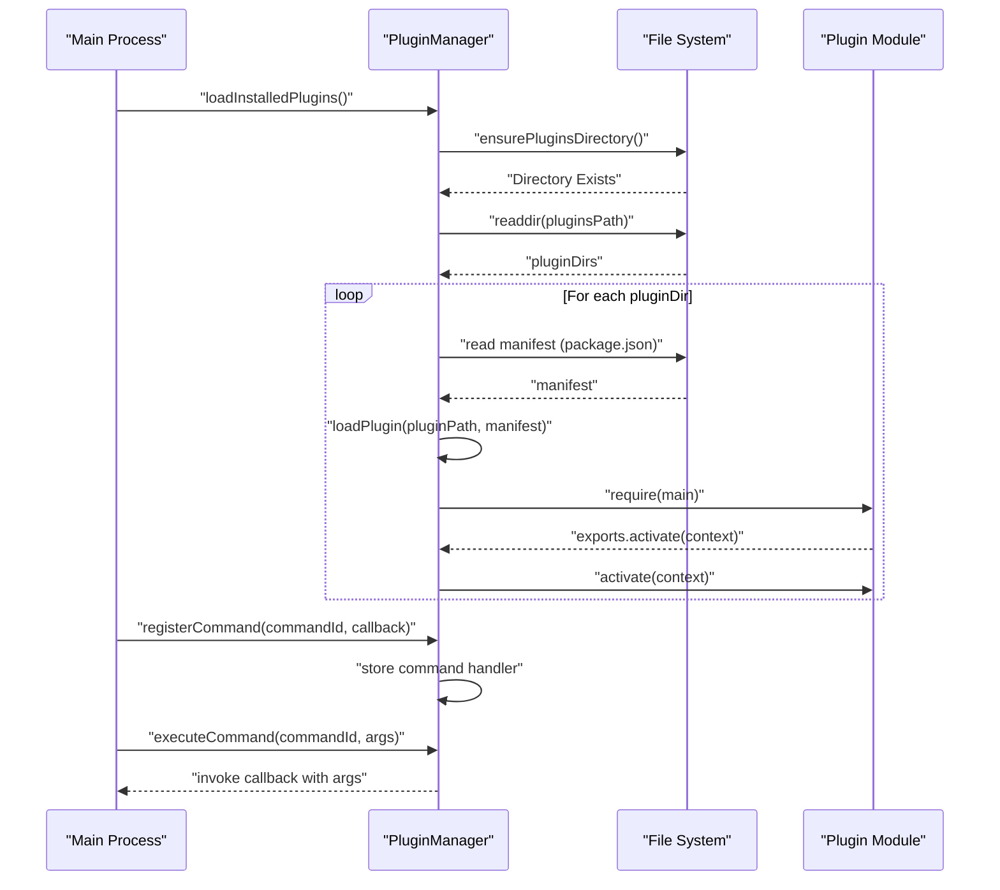
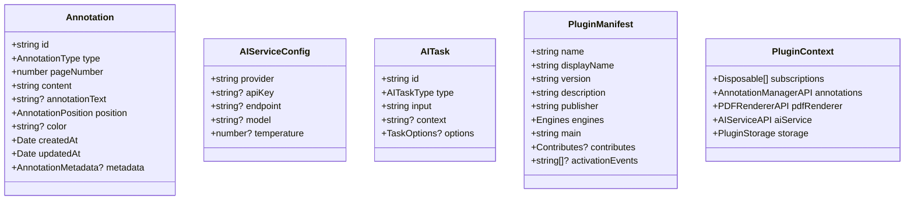

# Getting Started

<cite>
**Referenced Files in This Document**
- [README.md](file://README.md)
- [package.json](file://package.json)
- [tsconfig.json](file://tsconfig.json)
- [src/main.ts](file://src/main.ts)
- [src/preload.ts](file://src/preload.ts)
- [src/core/AnnotationManager.ts](file://src/core/AnnotationManager.ts)
- [src/core/AIServiceManager.ts](file://src/core/AIServiceManager.ts)
- [src/core/PluginManager.ts](file://src/core/PluginManager.ts)
- [src/types/index.ts](file://src/types/index.ts)
- [PLUGIN-GUIDE.md](file://PLUGIN-GUIDE.md)
- [DESIGN.md](file://DESIGN.md)
</cite>

## Table of Contents
1. [Introduction](#introduction)
2. [Project Structure](#project-structure)
3. [Prerequisites](#prerequisites)
4. [Installation](#installation)
5. [Build Commands](#build-commands)
6. [Development Workflow](#development-workflow)
7. [Initial Configuration](#initial-configuration)
8. [Basic Usage](#basic-usage)
9. [Architecture Overview](#architecture-overview)
10. [Detailed Component Analysis](#detailed-component-analysis)
11. [Dependency Analysis](#dependency-analysis)
12. [Performance Considerations](#performance-considerations)
13. [Troubleshooting Guide](#troubleshooting-guide)
14. [Conclusion](#conclusion)

## Introduction
SciPDFReader is an AI-powered PDF reader built with Electron and React. It provides high-quality PDF rendering, a flexible annotation system, AI-driven features (translation, background information, summarization), and a plugin architecture inspired by VS Code. This guide helps you set up the development environment, configure the application, and start using core features quickly.

## Project Structure
The repository follows a modular Electron architecture:
- Electron main process initializes the app window and manages IPC communication
- Preload script exposes secure IPC APIs to the renderer
- Core modules implement annotation management, AI service orchestration, and plugin lifecycle
- Types define shared interfaces and enums
- Renderer contains UI components and assets



**Diagram sources**
- [src/main.ts:1-156](file://src/main.ts#L1-L156)
- [src/preload.ts:1-34](file://src/preload.ts#L1-L34)
- [src/core/AnnotationManager.ts:1-172](file://src/core/AnnotationManager.ts#L1-L172)
- [src/core/AIServiceManager.ts:1-214](file://src/core/AIServiceManager.ts#L1-L214)
- [src/core/PluginManager.ts:1-247](file://src/core/PluginManager.ts#L1-L247)
- [src/types/index.ts:1-224](file://src/types/index.ts#L1-L224)

**Section sources**
- [README.md:13-29](file://README.md#L13-L29)
- [DESIGN.md:51-85](file://DESIGN.md#L51-L85)

## Prerequisites
- Node.js 18+ and npm
- Git

These requirements are necessary to install dependencies, compile TypeScript, and run the Electron application locally.

**Section sources**
- [README.md:33-36](file://README.md#L33-L36)

## Installation
Follow these steps to set up the project locally:

1. Clone the repository:
   ```bash
   git clone https://github.com/Chunde/SciPDFReader.git
   cd SciPDFReader
   ```

2. Install dependencies:
   ```bash
   npm install
   ```

3. Compile TypeScript:
   ```bash
   npm run compile
   ```

4. Start the application:
   ```bash
   npm start
   ```

Verification:
- The app window opens with DevTools open in development mode
- IPC handlers for PDF loading, annotations, AI tasks, and plugin registration are ready

**Section sources**
- [README.md:40-59](file://README.md#L40-L59)
- [src/main.ts:33-43](file://src/main.ts#L33-L43)

## Build Commands
The project defines the following scripts in package.json:

- `npm run compile`: Compiles TypeScript to JavaScript
- `npm run watch`: Starts TypeScript compiler in watch mode for continuous development
- `npm start`: Launches the Electron app
- `npm run package`: Packages the app for distribution using electron-builder
- `npm run lint`: Runs ESLint on the src directory

Purpose and usage:
- Use `compile` after adding new source files or changing TypeScript configurations
- Use `watch` during active development to auto-recompile on changes
- Use `start` to launch the app locally
- Use `package` to build distributable artifacts per platform targets configured in build settings
- Use `lint` to enforce code quality and style consistency

**Section sources**
- [package.json:7-12](file://package.json#L7-L12)
- [README.md:63-69](file://README.md#L63-L69)

## Development Workflow
Recommended workflow for iterative development:

1. Start compilation in watch mode:
   ```bash
   npm run watch
   ```

2. In another terminal, start the Electron app:
   ```bash
   npm start
   ```

3. Edit TypeScript files under src/. The watcher recompiles automatically.

4. Use DevTools (opened automatically in development) to inspect renderer logs and network requests.

5. After making changes, restart the app to pick up new compiled outputs.

Local setup specifics:
- The main process creates a BrowserWindow with context isolation and loads the renderer HTML
- Preload script exposes a minimal API surface via contextBridge to the renderer
- IPC handlers handle PDF loading, file reads, annotation persistence, AI task execution, and plugin registration

**Section sources**
- [src/main.ts:13-43](file://src/main.ts#L13-L43)
- [src/preload.ts:5-33](file://src/preload.ts#L5-L33)

## Initial Configuration
Create a configuration file at `~/.scipdfreader/config.json` with the following structure:

```json
{
  "ai": {
    "provider": "openai",
    "apiKey": "your-api-key",
    "model": "gpt-3.5-turbo"
  },
  "annotations": {
    "defaultColor": "#FFFF00",
    "autoSave": true
  },
  "plugins": {
    "autoLoad": true
  }
}
```

Notes:
- AI provider can be openai, azure, local, or custom
- apiKey is required for OpenAI/Azure providers
- model specifies the LLM to use
- defaultColor sets the default highlight color
- autoSave controls whether annotations are persisted immediately
- autoLoad enables automatic plugin loading at startup

Where it is used:
- AIServiceManager reads provider and model to route tasks
- AnnotationManager persists annotations to a user-specific data directory
- PluginManager loads plugins from a user-specific plugins directory

**Section sources**
- [README.md:122-139](file://README.md#L122-L139)
- [src/core/AIServiceManager.ts:8-11](file://src/core/AIServiceManager.ts#L8-L11)
- [src/core/AnnotationManager.ts:16-18](file://src/core/AnnotationManager.ts#L16-L18)
- [src/core/PluginManager.ts:38-39](file://src/core/PluginManager.ts#L38-L39)

## Basic Usage
Once the app is running:

- Load a PDF:
  - Use the open file dialog to select a PDF
  - The main process handles the dialog and sends the file path to the renderer

- Navigate pages:
  - Use the UI controls to move between pages (implementation depends on the renderer components)

- Perform simple annotations:
  - Select text in the PDF viewer
  - Create annotations (e.g., highlight, note) via the renderer
  - Annotations are saved and retrievable by page number

- Execute AI tasks:
  - Select text and trigger translation, background information, or summarization
  - The main process routes tasks to AIServiceManager

- Plugin commands:
  - Activate plugin-provided commands from the UI or menu
  - Commands are registered via IPC and executed through PluginManager

Verification steps:
- Confirm the app window appears and DevTools is available in development
- Verify that opening a PDF triggers the load event in the renderer
- Ensure annotations persist and can be retrieved by page number
- Test AI task execution and observe results in the UI

**Section sources**
- [src/main.ts:106-121](file://src/main.ts#L106-L121)
- [src/main.ts:123-142](file://src/main.ts#L123-L142)
- [src/core/AnnotationManager.ts:77-84](file://src/core/AnnotationManager.ts#L77-L84)
- [src/core/AIServiceManager.ts:13-56](file://src/core/AIServiceManager.ts#L13-L56)

## Architecture Overview
High-level architecture mapping the main process, preload bridge, renderer, and core modules:



**Diagram sources**
- [src/main.ts:106-142](file://src/main.ts#L106-L142)
- [src/preload.ts:7-15](file://src/preload.ts#L7-L15)
- [src/core/AnnotationManager.ts:46-59](file://src/core/AnnotationManager.ts#L46-L59)
- [src/core/AIServiceManager.ts:13-56](file://src/core/AIServiceManager.ts#L13-L56)

## Detailed Component Analysis

### Core Modules Overview
The core modules implement the application’s primary responsibilities:



**Diagram sources**
- [src/core/AnnotationManager.ts:6-172](file://src/core/AnnotationManager.ts#L6-L172)
- [src/core/AIServiceManager.ts:3-214](file://src/core/AIServiceManager.ts#L3-L214)
- [src/core/PluginManager.ts:15-247](file://src/core/PluginManager.ts#L15-L247)

**Section sources**
- [src/core/AnnotationManager.ts:1-172](file://src/core/AnnotationManager.ts#L1-L172)
- [src/core/AIServiceManager.ts:1-214](file://src/core/AIServiceManager.ts#L1-L214)
- [src/core/PluginManager.ts:1-247](file://src/core/PluginManager.ts#L1-L247)

### AI Task Execution Flow
The AIServiceManager orchestrates AI tasks with provider-specific logic and fallbacks:



**Diagram sources**
- [src/core/AIServiceManager.ts:13-92](file://src/core/AIServiceManager.ts#L13-L92)
- [src/core/AIServiceManager.ts:96-212](file://src/core/AIServiceManager.ts#L96-L212)

**Section sources**
- [src/core/AIServiceManager.ts:13-212](file://src/core/AIServiceManager.ts#L13-L212)

### Plugin Lifecycle and Commands
PluginManager manages plugin discovery, activation, and command registration:



**Diagram sources**
- [src/core/PluginManager.ts:48-142](file://src/core/PluginManager.ts#L48-L142)
- [src/core/PluginManager.ts:120-142](file://src/core/PluginManager.ts#L120-L142)

**Section sources**
- [src/core/PluginManager.ts:48-142](file://src/core/PluginManager.ts#L48-L142)

### Types and Interfaces
Shared types define the contracts for annotations, AI tasks, plugin manifests, and APIs:



**Diagram sources**
- [src/types/index.ts:36-47](file://src/types/index.ts#L36-L47)
- [src/types/index.ts:49-55](file://src/types/index.ts#L49-L55)
- [src/types/index.ts:65-71](file://src/types/index.ts#L65-L71)
- [src/types/index.ts:86-103](file://src/types/index.ts#L86-L103)
- [src/types/index.ts:136-142](file://src/types/index.ts#L136-L142)

**Section sources**
- [src/types/index.ts:1-224](file://src/types/index.ts#L1-L224)

## Dependency Analysis
Key dependencies and their roles:

- Electron runtime and builder for cross-platform desktop apps
- pdfjs-dist for PDF rendering
- React and ReactDOM for the UI
- sqlite3 for local data persistence
- uuid for generating unique identifiers
- TypeScript and ESLint for type safety and code quality

Build configuration:
- TypeScript compiles to ES2020 with source maps
- Output directory is out/
- JSX is handled via react-jsx
- Electron builder targets Windows (NSIS), macOS (AppImage), and Linux (AppImage)

**Section sources**
- [package.json:28-34](file://package.json#L28-L34)
- [package.json:16-27](file://package.json#L16-L27)
- [package.json:35-55](file://package.json#L35-L55)
- [tsconfig.json:2-17](file://tsconfig.json#L2-L17)

## Performance Considerations
- Keep DevTools open only during development to avoid unnecessary overhead
- Use watch mode for rapid iteration without manual recompilation
- Prefer batch operations for AI tasks when possible to reduce latency
- Avoid heavy synchronous operations in the main process; delegate to workers or background tasks
- Minimize large file reads by streaming or chunking where applicable

[No sources needed since this section provides general guidance]

## Troubleshooting Guide
Common setup and runtime issues:

- Node.js version mismatch:
  - Ensure Node.js 18+ is installed; older versions may cause build failures

- Missing native dependencies:
  - On Linux, ensure build tools and dependencies are installed for sqlite3
  - On Windows, ensure Python and Visual Studio build tools are available if compilation fails

- TypeScript compilation errors:
  - Run `npm run compile` to catch type errors early
  - Verify tsconfig.json settings match your environment

- Electron app does not start:
  - Confirm `npm run compile` succeeds before `npm start`
  - Check that main entry in package.json points to the compiled output

- IPC communication issues:
  - Verify preload exposes the expected API methods
  - Ensure main process registers IPC handlers for the invoked channels

- AI provider configuration:
  - Ensure config.json includes a valid provider and API key for OpenAI/Azure
  - Confirm AIServiceManager receives initialization before executing tasks

Verification checklist:
- Application window opens with DevTools in development
- PDF open dialog works and loads files
- Annotations are saved and retrievable by page number
- AI tasks return results without throwing initialization errors
- Plugin commands are registered and executable

**Section sources**
- [README.md:33-36](file://README.md#L33-L36)
- [src/main.ts:33-43](file://src/main.ts#L33-L43)
- [src/preload.ts:5-33](file://src/preload.ts#L5-L33)
- [src/core/AIServiceManager.ts:8-11](file://src/core/AIServiceManager.ts#L8-L11)

## Conclusion
You now have the essentials to set up SciPDFReader, understand the core architecture, configure AI and annotation preferences, and begin using the application. Use the build commands for development, refer to the plugin guide for extending functionality, and consult the troubleshooting section for common issues. As the project evolves, additional PDF rendering and UI components will integrate with the existing core modules.

[No sources needed since this section summarizes without analyzing specific files]