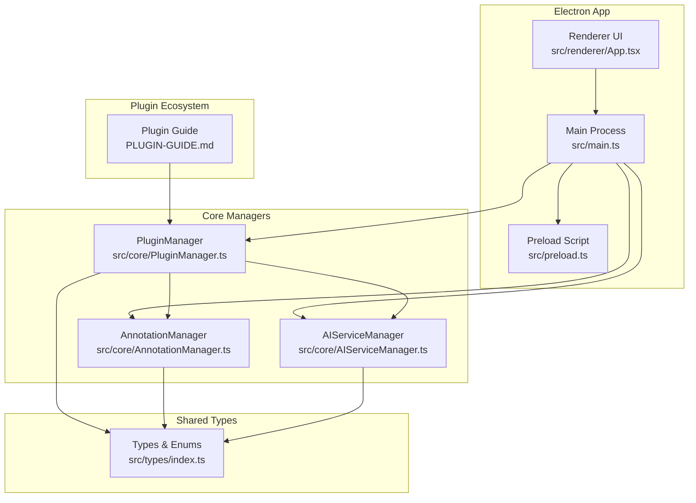
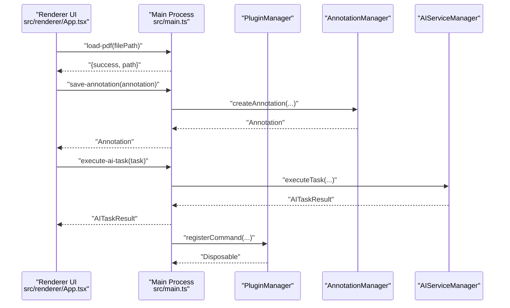
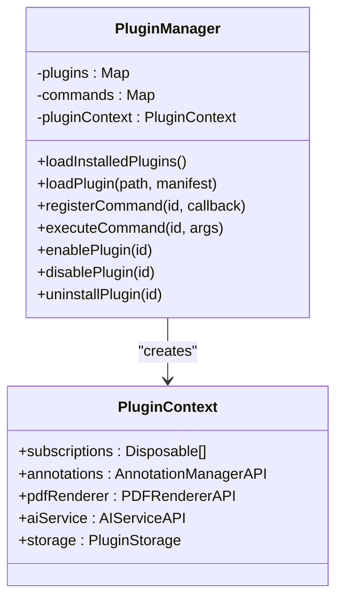
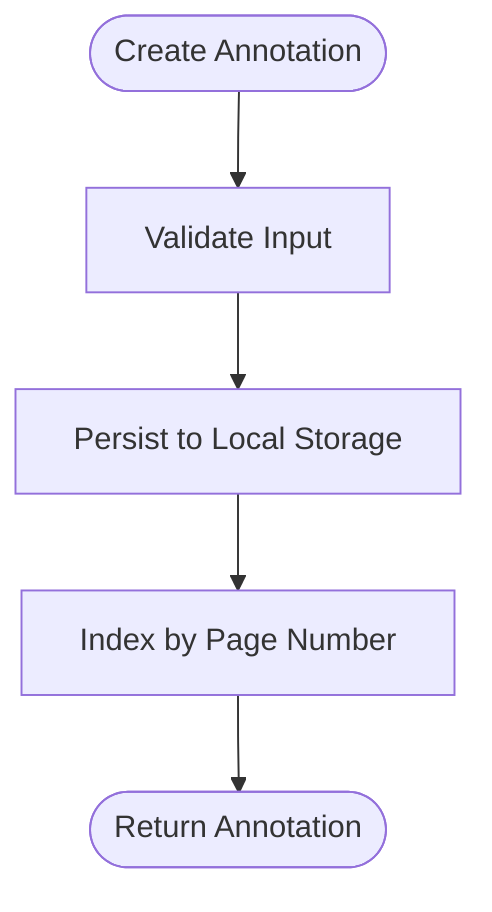
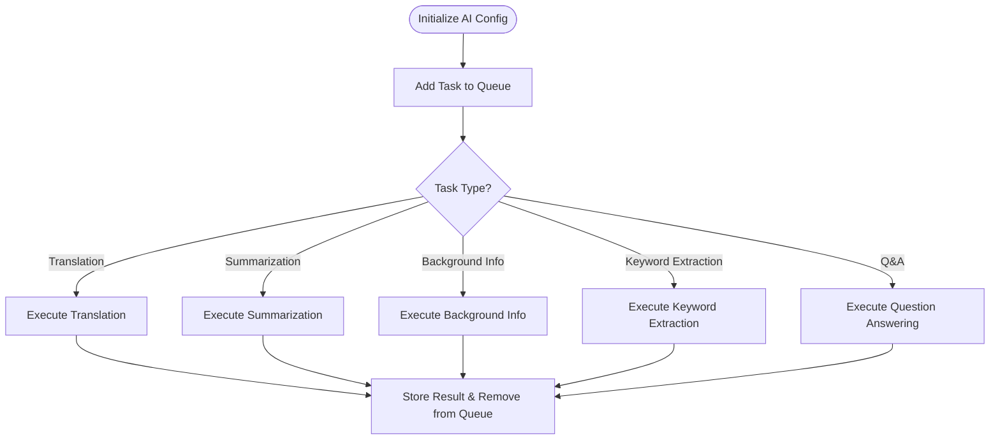
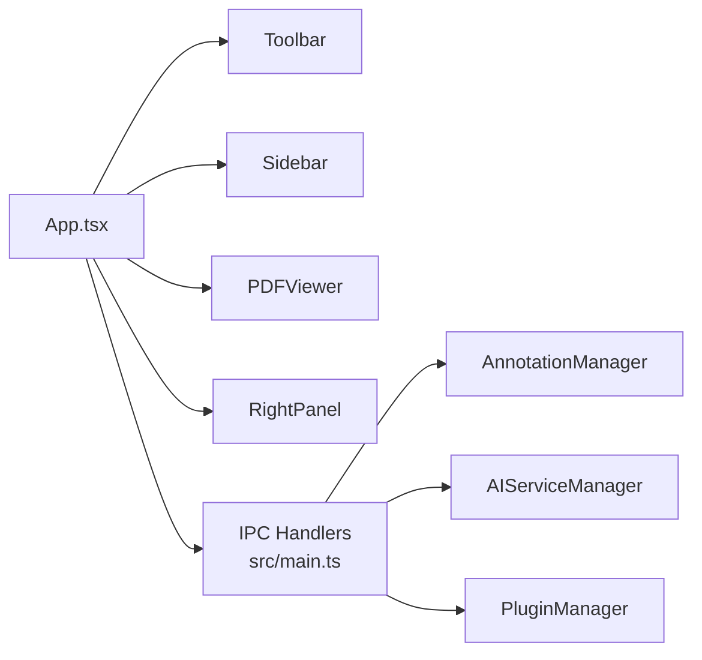
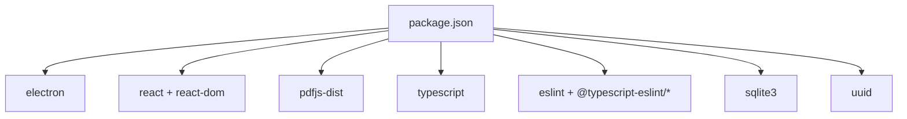

# Project Overview

<cite>
**Referenced Files in This Document**
- [README.md](file://README.md)
- [package.json](file://package.json)
- [src/main.ts](file://src/main.ts)
- [src/core/PluginManager.ts](file://src/core/PluginManager.ts)
- [src/core/AnnotationManager.ts](file://src/core/AnnotationManager.ts)
- [src/core/AIServiceManager.ts](file://src/core/AIServiceManager.ts)
- [src/types/index.ts](file://src/types/index.ts)
- [PLUGIN-GUIDE.md](file://PLUGIN-GUIDE.md)
- [src/renderer/App.tsx](file://src/renderer/App.tsx)
- [src/renderer/index.html](file://src/renderer/index.html)
</cite>

## Table of Contents
1. [Introduction](#introduction)
2. [Project Structure](#project-structure)
3. [Core Components](#core-components)
4. [Architecture Overview](#architecture-overview)
5. [Detailed Component Analysis](#detailed-component-analysis)
6. [Dependency Analysis](#dependency-analysis)
7. [Performance Considerations](#performance-considerations)
8. [Troubleshooting Guide](#troubleshooting-guide)
9. [Conclusion](#conclusion)

## Introduction
SciPDFReader is an AI-powered PDF reader designed for researchers, students, and professionals who need intelligent document annotation and analysis. It combines high-fidelity PDF rendering with a modern, extensible architecture inspired by VS Code’s plugin ecosystem. Built on Electron, it delivers a cross-platform desktop experience while enabling powerful AI-driven insights such as translation, background information, summarization, and smart annotations.

Unlike traditional PDF readers, SciPDFReader emphasizes:
- Intelligent annotation workflows powered by AI
- A VS Code-inspired plugin system for extensibility
- Cross-platform availability (Windows, macOS, Linux)
- A React-based UI layered over Electron for a modern desktop experience

Target users benefit from:
- Researchers needing quick concept lookup and contextual background
- Students annotating and summarizing academic texts
- Professionals extracting insights and collaborating via shared annotations

## Project Structure
At a high level, the project is organized into:
- Electron main process orchestrating the app lifecycle and IPC
- Core managers for annotations, AI services, and plugins
- Strongly typed interfaces and enums under a shared types module
- A React renderer with modular UI components
- Plugin development guide and examples

**Diagram sources**
- [src/main.ts:1-118](file://src/main.ts#L1-L118)
- [src/core/PluginManager.ts:1-247](file://src/core/PluginManager.ts#L1-L247)
- [src/core/AnnotationManager.ts:1-172](file://src/core/AnnotationManager.ts#L1-L172)
- [src/core/AIServiceManager.ts:1-214](file://src/core/AIServiceManager.ts#L1-L214)
- [src/types/index.ts:1-224](file://src/types/index.ts#L1-L224)
- [PLUGIN-GUIDE.md:1-420](file://PLUGIN-GUIDE.md#L1-L420)
- [src/renderer/App.tsx:1-103](file://src/renderer/App.tsx#L1-L103)

**Section sources**
- [README.md:13-29](file://README.md#L13-L29)
- [src/main.ts:12-59](file://src/main.ts#L12-L59)
- [src/renderer/index.html:1-14](file://src/renderer/index.html#L1-L14)

## Core Components
SciPDFReader’s core is composed of three primary subsystems that work together to deliver PDF reading, annotation, and AI-powered features:

- Annotation Manager: Manages creation, persistence, search, and export of annotations across pages.
- AI Service Manager: Provides a unified interface for AI tasks (translation, summarization, background info, keyword extraction, Q&A) with configurable providers.
- Plugin Manager: Loads, activates, and manages plugins with a VS Code-style API surface, exposing annotation, AI, PDF renderer, and storage capabilities.

These managers are wired into the Electron main process and exposed to the renderer via IPC handlers.

**Section sources**
- [src/core/AnnotationManager.ts:6-172](file://src/core/AnnotationManager.ts#L6-L172)
- [src/core/AIServiceManager.ts:3-214](file://src/core/AIServiceManager.ts#L3-L214)
- [src/core/PluginManager.ts:15-247](file://src/core/PluginManager.ts#L15-L247)
- [src/main.ts:44-118](file://src/main.ts#L44-L118)

## Architecture Overview
The application follows a layered architecture:
- Electron main process initializes managers, sets up IPC, and loads the renderer.
- Renderer UI (React) handles user interactions and delegates to main process via IPC.
- Core managers encapsulate domain logic and persist state locally.
- Plugin system extends functionality through a well-defined API surface.

**Diagram sources**
- [src/renderer/App.tsx:29-52](file://src/renderer/App.tsx#L29-L52)
- [src/main.ts:80-118](file://src/main.ts#L80-L118)
- [src/core/AnnotationManager.ts:46-59](file://src/core/AnnotationManager.ts#L46-L59)
- [src/core/AIServiceManager.ts:13-56](file://src/core/AIServiceManager.ts#L13-L56)
- [src/core/PluginManager.ts:120-142](file://src/core/PluginManager.ts#L120-L142)

## Detailed Component Analysis

### Plugin System (VS Code-inspired)
SciPDFReader adopts a VS Code-style plugin architecture:
- Plugins are installed under a user-specific directory and loaded at startup.
- Each plugin receives a PluginContext exposing APIs for annotations, AI services, PDF renderer, and storage.
- Commands can be registered and executed via IPC, enabling seamless UI integration.
- Activation events allow plugins to start on specific triggers (e.g., startup completion).

**Diagram sources**
- [src/core/PluginManager.ts:15-247](file://src/core/PluginManager.ts#L15-L247)
- [src/types/index.ts:136-177](file://src/types/index.ts#L136-L177)

**Section sources**
- [PLUGIN-GUIDE.md:5-14](file://PLUGIN-GUIDE.md#L5-L14)
- [src/core/PluginManager.ts:48-104](file://src/core/PluginManager.ts#L48-L104)
- [src/main.ts:106-118](file://src/main.ts#L106-L118)

### Annotation System
The annotation system supports multiple types (highlight, underline, strikethrough, note, translation, background info, and custom) with persistent storage and export capabilities. Annotations are indexed by page number and support search and export to JSON, Markdown, and HTML.

**Diagram sources**
- [src/core/AnnotationManager.ts:46-59](file://src/core/AnnotationManager.ts#L46-L59)
- [src/types/index.ts:36-47](file://src/types/index.ts#L36-L47)

**Section sources**
- [src/core/AnnotationManager.ts:21-44](file://src/core/AnnotationManager.ts#L21-L44)
- [src/core/AnnotationManager.ts:96-112](file://src/core/AnnotationManager.ts#L96-L112)
- [src/types/index.ts:3-11](file://src/types/index.ts#L3-L11)

### AI Integration
The AI Service Manager provides a unified abstraction for AI tasks with pluggable providers. It supports:
- Translation with configurable target languages
- Summarization with length constraints
- Background information extraction
- Keyword extraction
- Question answering with optional context

Tasks are queued, executed, and results cached for retrieval.

**Diagram sources**
- [src/core/AIServiceManager.ts:8-11](file://src/core/AIServiceManager.ts#L8-L11)
- [src/core/AIServiceManager.ts:13-56](file://src/core/AIServiceManager.ts#L13-L56)
- [src/core/AIServiceManager.ts:96-171](file://src/core/AIServiceManager.ts#L96-L171)

**Section sources**
- [src/core/AIServiceManager.ts:13-56](file://src/core/AIServiceManager.ts#L13-L56)
- [src/types/index.ts:49-84](file://src/types/index.ts#L49-L84)

### Renderer and UI
The renderer is a React application that:
- Hosts the main layout with collapsible sidebar, toolbar, PDF viewer, and right panel
- Communicates with the main process via IPC for PDF loading, annotation persistence, and AI task execution
- Exposes hooks for user interactions such as creating annotations and navigating to them

**Diagram sources**
- [src/renderer/App.tsx:10-99](file://src/renderer/App.tsx#L10-L99)
- [src/main.ts:80-118](file://src/main.ts#L80-L118)
- [src/core/AnnotationManager.ts:46-59](file://src/core/AnnotationManager.ts#L46-L59)
- [src/core/AIServiceManager.ts:13-56](file://src/core/AIServiceManager.ts#L13-L56)
- [src/core/PluginManager.ts:120-142](file://src/core/PluginManager.ts#L120-L142)

**Section sources**
- [src/renderer/App.tsx:10-99](file://src/renderer/App.tsx#L10-L99)
- [src/renderer/index.html:1-14](file://src/renderer/index.html#L1-14)

## Dependency Analysis
SciPDFReader leverages a modern, typed stack:
- Electron for cross-platform desktop runtime
- React for the UI layer
- PDF.js for PDF rendering (via the pdfjs-dist dependency)
- TypeScript for strong typing across the codebase
- sqlite3 and uuid for local storage and identifiers
- ESLint and TypeScript tooling for developer experience

**Diagram sources**
- [package.json:16-33](file://package.json#L16-L33)

**Section sources**
- [package.json:16-54](file://package.json#L16-L54)

## Performance Considerations
- Keep UI responsive by offloading heavy operations (AI tasks, PDF parsing) to background threads or workers.
- Batch annotation saves and AI requests to reduce I/O overhead.
- Use pagination and virtualized lists for large annotation sets.
- Cache frequently accessed AI results and rendered pages.
- Minimize IPC chatter by coalescing requests and using streaming where appropriate.

## Troubleshooting Guide
Common issues and resolutions:
- Plugin fails to load: Verify plugin manifest and main entry path; check activation events and plugin directory permissions.
- Annotations not persisting: Confirm data directory exists and is writable; ensure save operations complete before shutdown.
- AI tasks failing: Validate provider configuration and API keys; confirm network connectivity and rate limits.
- Renderer not responding: Check IPC handlers and ensure the preload script is correctly configured for context isolation.

**Section sources**
- [src/core/PluginManager.ts:79-104](file://src/core/PluginManager.ts#L79-L104)
- [src/core/AnnotationManager.ts:153-157](file://src/core/AnnotationManager.ts#L153-L157)
- [src/core/AIServiceManager.ts:14-16](file://src/core/AIServiceManager.ts#L14-L16)
- [src/main.ts:17-26](file://src/main.ts#L17-L26)

## Conclusion
SciPDFReader reimagines the PDF reading experience by combining high-quality rendering with intelligent annotation and AI-powered insights, all within a flexible, extensible plugin architecture. Its Electron foundation ensures broad compatibility, while the VS Code-inspired plugin system invites a vibrant ecosystem of enhancements. Whether annotating research papers, translating foreign-language documents, or generating summaries, SciPDFReader provides a modern, developer-friendly platform for deep document engagement.