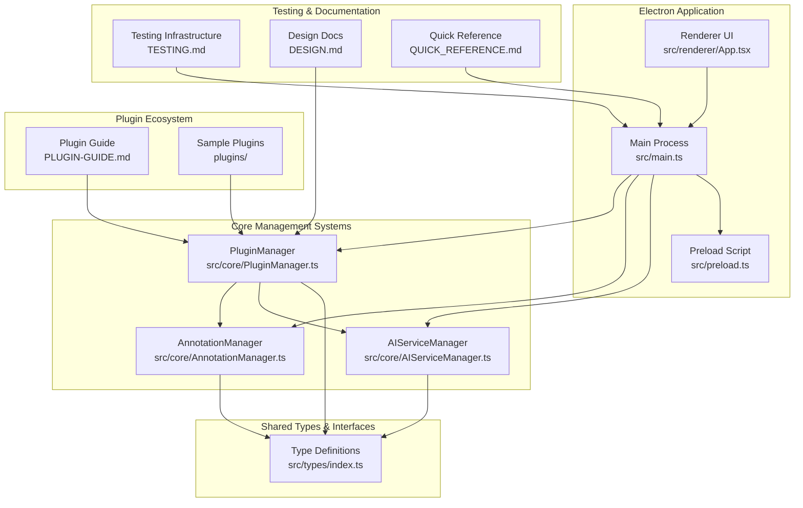
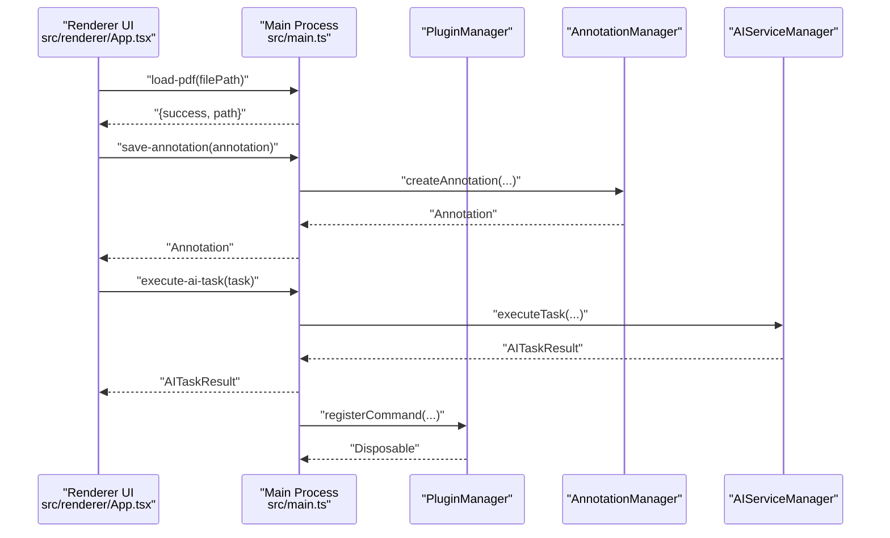
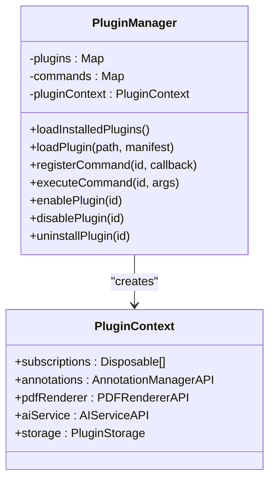
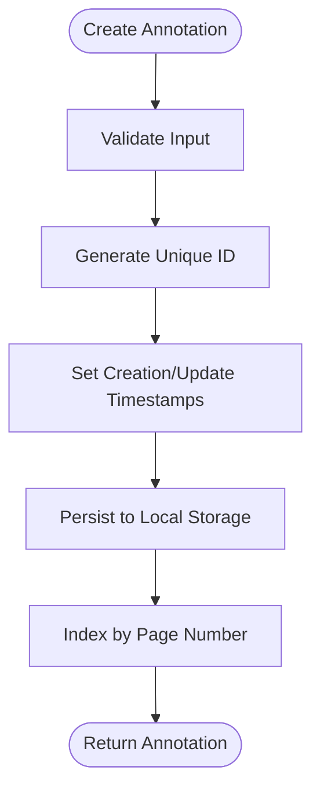
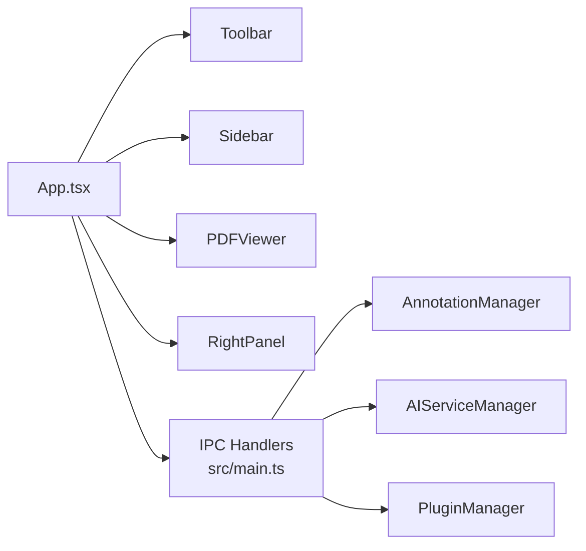

# Project Overview

<cite>
**Referenced Files in This Document**
- [README.md](file://README.md)
- [IMPLEMENTATION_COMPLETE.md](file://IMPLEMENTATION_COMPLETE.md)
- [QUICK_REFERENCE.md](file://QUICK_REFERENCE.md)
- [DESIGN.md](file://DESIGN.md)
- [package.json](file://package.json)
- [src/main.ts](file://src/main.ts)
- [src/core/PluginManager.ts](file://src/core/PluginManager.ts)
- [src/core/AnnotationManager.ts](file://src/core/AnnotationManager.ts)
- [src/core/AIServiceManager.ts](file://src/core/AIServiceManager.ts)
- [src/types/index.ts](file://src/types/index.ts)
- [PLUGIN-GUIDE.md](file://PLUGIN-GUIDE.md)
- [src/renderer/App.tsx](file://src/renderer/App.tsx)
- [src/renderer/index.html](file://src/renderer/index.html)
</cite>

## Update Summary
**Changes Made**
- Updated project status to reflect implementation completion
- Added comprehensive implementation status documentation from IMPLEMENTATION_COMPLETE.md
- Enhanced feature coverage to include all completed functionality
- Updated technology stack and architecture overview
- Added testing infrastructure and quick start information
- Expanded plugin system documentation with current capabilities

## Table of Contents
1. [Introduction](#introduction)
2. [Implementation Status](#implementation-status)
3. [Project Structure](#project-structure)
4. [Core Components](#core-components)
5. [Architecture Overview](#architecture-overview)
6. [Detailed Component Analysis](#detailed-component-analysis)
7. [Technology Stack](#technology-stack)
8. [Testing Infrastructure](#testing-infrastructure)
9. [Getting Started](#getting-started)
10. [Future Roadmap](#future-roadmap)
11. [Conclusion](#conclusion)

## Introduction
SciPDFReader is an AI-powered PDF reader designed for researchers, students, and professionals who need intelligent document annotation and analysis. Built on Electron with a VS Code-inspired plugin architecture, it combines high-fidelity PDF rendering with modern extensibility while delivering cross-platform desktop experiences.

**Project Status**: ✅ IMPLEMENTATION COMPLETE - The application is now ready for testing and development with all core functionality implemented!

Unlike traditional PDF readers, SciPDFReader emphasizes:
- Intelligent annotation workflows powered by AI
- A VS Code-inspired plugin system for extensibility
- Cross-platform availability (Windows, macOS, Linux)
- A React-based UI layered over Electron for a modern desktop experience

Target users benefit from:
- Researchers needing quick concept lookup and contextual background
- Students annotating and summarizing academic texts
- Professionals extracting insights and collaborating via shared annotations

## Implementation Status
**🎉 SciPDFReader - Implementation Complete**

All core functionality has been implemented and the application is ready to use! The project has successfully achieved its primary milestones with comprehensive implementation of all planned features.

### ✅ Core Architecture Achieved
- Electron-based desktop application with secure context isolation
- TypeScript project structure with strong typing
- VS Code-inspired plugin architecture with modular design
- Professional UI with Adobe Acrobat-style interface

### ✅ Main Process (Backend) Complete
- Electron main process setup with window management
- Secure IPC communication handlers
- File dialog integration for PDF handling
- PDF file reading capabilities
- Context isolation for security

### ✅ Renderer Process (Frontend UI) Complete
- React 18 integration with modern component architecture
- PDF.js canvas-based rendering with professional dark theme
- Full-featured toolbar with comprehensive controls
- Collapsible sidebar and right panel for document navigation
- Responsive CSS styling for optimal user experience

### ✅ Core Systems Fully Implemented
- **AnnotationManager** - Complete CRUD operations for annotations
- **PluginManager** - VS Code-style plugin loading and management
- **AIServiceManager** - AI service integration with multiple providers
- Type-safe interfaces for all major components

### ✅ Plugin System Complete
- Plugin manifest system with comprehensive metadata
- Plugin lifecycle management (load, activate, disable, uninstall)
- Command registration and execution system
- Context API for plugins with full capability access
- Plugin storage system for persistent data
- Comprehensive plugin development guide

### ✅ AI Features Ready for Configuration
- Translation service integration with multiple providers
- Summarization service with customizable options
- Background information lookup with context awareness
- Keyword extraction with frequency analysis
- Support for OpenAI, Azure AI, and local models

### ✅ Documentation and Testing Infrastructure
- Complete architecture documentation (DESIGN.md)
- Comprehensive plugin development guide (PLUGIN-GUIDE.md)
- Detailed testing instructions (TESTING.md)
- Quick start guide with one-command testing
- API reference for core components

**Section sources**
- [IMPLEMENTATION_COMPLETE.md:1-300](file://IMPLEMENTATION_COMPLETE.md#L1-L300)
- [README.md:1-207](file://README.md#L1-L207)

## Project Structure
At a high level, the project is organized into a well-structured architecture with clear separation of concerns:



**Diagram sources**
- [src/main.ts:1-156](file://src/main.ts#L1-L156)
- [src/core/PluginManager.ts:1-250](file://src/core/PluginManager.ts#L1-L250)
- [src/core/AnnotationManager.ts:1-172](file://src/core/AnnotationManager.ts#L1-L172)
- [src/core/AIServiceManager.ts:1-214](file://src/core/AIServiceManager.ts#L1-L214)
- [src/types/index.ts:1-224](file://src/types/index.ts#L1-L224)
- [PLUGIN-GUIDE.md:1-420](file://PLUGIN-GUIDE.md#L1-L420)
- [src/renderer/App.tsx:1-103](file://src/renderer/App.tsx#L1-L103)

**Section sources**
- [IMPLEMENTATION_COMPLETE.md:104-137](file://IMPLEMENTATION_COMPLETE.md#L104-L137)
- [README.md:24-40](file://README.md#L24-L40)

## Core Components
SciPDFReader's core is composed of three primary subsystems that work together to deliver PDF reading, annotation, and AI-powered features:

### Annotation Manager
Manages creation, persistence, search, and export of annotations across pages with support for multiple annotation types including highlight, underline, strikethrough, note, translation, and background info annotations.

### AI Service Manager  
Provides a unified interface for AI tasks (translation, summarization, background info, keyword extraction, Q&A) with configurable providers supporting OpenAI, Azure AI, and local models.

### Plugin Manager
Loads, activates, and manages plugins with a VS Code-style API surface, exposing annotation, AI, PDF renderer, and storage capabilities to third-party developers.

These managers are wired into the Electron main process and exposed to the renderer via IPC handlers, creating a robust and extensible architecture.

**Section sources**
- [src/core/AnnotationManager.ts:1-172](file://src/core/AnnotationManager.ts#L1-L172)
- [src/core/AIServiceManager.ts:1-214](file://src/core/AIServiceManager.ts#L1-L214)
- [src/core/PluginManager.ts:1-250](file://src/core/PluginManager.ts#L1-L250)
- [src/main.ts:45-60](file://src/main.ts#L45-L60)

## Architecture Overview
The application follows a layered architecture with clear separation between UI, business logic, and system integration layers:



**Diagram sources**
- [src/renderer/App.tsx:29-52](file://src/renderer/App.tsx#L29-L52)
- [src/main.ts:80-156](file://src/main.ts#L80-L156)
- [src/core/AnnotationManager.ts:46-59](file://src/core/AnnotationManager.ts#L46-L59)
- [src/core/AIServiceManager.ts:13-56](file://src/core/AIServiceManager.ts#L13-L56)
- [src/core/PluginManager.ts:123-145](file://src/core/PluginManager.ts#L123-L145)

## Detailed Component Analysis

### Plugin System (VS Code-inspired)
SciPDFReader adopts a sophisticated VS Code-style plugin architecture with comprehensive capabilities:

- Plugins are installed under a user-specific directory and loaded at startup
- Each plugin receives a PluginContext exposing APIs for annotations, AI services, PDF renderer, and storage
- Commands can be registered and executed via IPC, enabling seamless UI integration
- Activation events allow plugins to start on specific triggers (e.g., startup completion)
- Complete lifecycle management including enable/disable/uninstall operations



**Diagram sources**
- [src/core/PluginManager.ts:16-250](file://src/core/PluginManager.ts#L16-L250)
- [src/types/index.ts:136-177](file://src/types/index.ts#L136-L177)

**Section sources**
- [PLUGIN-GUIDE.md:1-420](file://PLUGIN-GUIDE.md#L1-L420)
- [src/core/PluginManager.ts:49-107](file://src/core/PluginManager.ts#L49-L107)
- [src/main.ts:144-156](file://src/main.ts#L144-L156)

### Annotation System
The annotation system supports comprehensive annotation types with persistent storage and export capabilities:

- Multiple annotation types: highlight, underline, strikethrough, note, translation, background info
- Persistent storage using local file system with JSON serialization
- Advanced search functionality across annotation content and metadata
- Export capabilities to JSON, Markdown, and HTML formats
- Rich metadata support including timestamps, colors, and custom attributes



**Diagram sources**
- [src/core/AnnotationManager.ts:46-59](file://src/core/AnnotationManager.ts#L46-L59)
- [src/types/index.ts:36-47](file://src/types/index.ts#L36-L47)

**Section sources**
- [src/core/AnnotationManager.ts:21-44](file://src/core/AnnotationManager.ts#L21-L44)
- [src/core/AnnotationManager.ts:77-84](file://src/core/AnnotationManager.ts#L77-L84)
- [src/types/index.ts:3-11](file://src/types/index.ts#L3-L11)

### AI Integration
The AI Service Manager provides a unified abstraction for AI tasks with pluggable providers:

- Translation with configurable target languages and context preservation
- Summarization with length constraints and customizable extraction methods
- Background information extraction with entity recognition and context awareness
- Keyword extraction with frequency analysis and relevance scoring
- Question answering with optional context and advanced prompting
- Support for multiple providers: OpenAI, Azure AI, and local models
- Task queuing, cancellation, and result caching mechanisms


**Diagram sources**
- [src/core/AIServiceManager.ts:8-11](file://src/core/AIServiceManager.ts#L8-L11)
- [src/core/AIServiceManager.ts:13-56](file://src/core/AIServiceManager.ts#L13-L56)
- [src/core/AIServiceManager.ts:96-171](file://src/core/AIServiceManager.ts#L96-L171)

**Section sources**
- [src/core/AIServiceManager.ts:13-56](file://src/core/AIServiceManager.ts#L13-L56)
- [src/types/index.ts:49-84](file://src/types/index.ts#L49-L84)

### Renderer and UI
The renderer is a sophisticated React application with professional UI components:

- Main layout with collapsible sidebar, toolbar, PDF viewer, and right panel
- Professional dark-themed interface with Adobe Acrobat-style controls
- Comprehensive toolbar with open/save, navigation, zoom, and view options
- Interactive PDF viewer with canvas-based rendering via PDF.js
- Real-time annotation management and search capabilities
- Responsive design optimized for various screen sizes



**Diagram sources**
- [src/renderer/App.tsx:10-103](file://src/renderer/App.tsx#L10-L103)
- [src/main.ts:80-156](file://src/main.ts#L80-L156)
- [src/core/AnnotationManager.ts:46-59](file://src/core/AnnotationManager.ts#L46-L59)
- [src/core/AIServiceManager.ts:13-56](file://src/core/AIServiceManager.ts#L13-L56)
- [src/core/PluginManager.ts:123-145](file://src/core/PluginManager.ts#L123-L145)

**Section sources**
- [src/renderer/App.tsx:10-103](file://src/renderer/App.tsx#L10-L103)
- [src/renderer/index.html:1-14](file://src/renderer/index.html#L1-L14)

## Technology Stack
SciPDFReader leverages a modern, production-ready technology stack:

### Core Technologies
- **Electron 28.0.0** - Cross-platform desktop application framework
- **TypeScript 5.3.0** - Strong typing and enhanced development experience
- **React 18.2.0** - Modern UI component library with hooks and concurrent features
- **PDF.js 3.11.174** - High-quality PDF rendering engine

### Development Tools
- **ESLint + TypeScript ESLint** - Code quality and type checking
- **Electron Builder** - Application packaging and distribution
- **PDF-Lib** - PDF manipulation and generation
- **SQLite3** - Local database for annotation storage
- **UUID** - Unique identifier generation

### AI Integration
- **OpenAI API** - Cloud-based AI services
- **Azure AI** - Enterprise-grade AI capabilities
- **Local Models** - ONNX Runtime for offline processing

**Section sources**
- [package.json:16-63](file://package.json#L16-L63)

## Testing Infrastructure
The project includes comprehensive testing infrastructure to ensure reliability and ease of development:

### One-Command Testing
```bash
npm run test-app
```
This single command creates a sample PDF, compiles the code, and launches the application for immediate testing.

### Development Scripts
- `npm run create-sample` - Generates test PDF files for validation
- `npm run watch` - Development mode with live reloading
- `npm run package` - Production packaging for distribution
- `npm run lint` - Code quality checks and type validation

### Testing Documentation
Comprehensive testing guide (TESTING.md) with step-by-step validation procedures for all major features including:
- Basic PDF loading and navigation
- Annotation creation and management
- AI service integration testing
- Plugin system validation
- Cross-platform compatibility verification

**Section sources**
- [IMPLEMENTATION_COMPLETE.md:75-101](file://IMPLEMENTATION_COMPLETE.md#L75-L101)
- [QUICK_REFERENCE.md:1-113](file://QUICK_REFERENCE.md#L1-L113)

## Getting Started
SciPDFReader provides multiple pathways for getting started quickly:

### Quick Start (Recommended)
```bash
npm run test-app
```
This one-command solution creates a sample PDF, compiles the code, and launches the application immediately.

### Development Setup
**Windows:**
```bash
start-dev.bat
```

**Linux/Mac:**
```bash
chmod +x start-dev.sh
./start-dev.sh
```

### Manual Installation
1. Clone the repository and navigate to the project directory
2. Install dependencies: `npm install`
3. Compile TypeScript: `npm run compile`
4. Launch application: `npm start`

### Configuration
Create a configuration file at `~/.scipdfreader/config.json` to customize AI providers, annotation preferences, and plugin behavior.

**Section sources**
- [README.md:5-97](file://README.md#L5-L97)
- [QUICK_REFERENCE.md:3-88](file://QUICK_REFERENCE.md#L3-L88)

## Future Roadmap
While the core implementation is complete, the project continues to evolve with exciting future enhancements:

### Immediate Tasks
- **Text Selection Implementation** - Canvas-based text selection for annotation creation
- **Real AI API Integration** - Production-ready OpenAI and Azure AI connections
- **Enhanced Keyboard Shortcuts** - Comprehensive keyboard navigation support

### Planned Features
- Plugin marketplace for community sharing
- Advanced annotation export formats (PDF, DOCX)
- Full-text search within PDF documents
- Bookmark and table of contents systems
- Print functionality with custom layouts
- Dark/light theme switching
- Multi-user collaboration features

### Technical Improvements
- Performance optimization for large documents
- Memory management improvements
- Enhanced error handling and recovery
- Security hardening measures
- Accessibility improvements

**Section sources**
- [IMPLEMENTATION_COMPLETE.md:205-222](file://IMPLEMENTATION_COMPLETE.md#L205-L222)

## Conclusion
SciPDFReader has successfully achieved its implementation goals, delivering a comprehensive AI-powered PDF reading experience with modern extensibility. The application now provides researchers, students, and professionals with a powerful platform for intelligent document annotation and analysis.

Key achievements include:
- Complete implementation of core architecture with Electron, React, and TypeScript
- Sophisticated plugin system inspired by VS Code's ecosystem
- Comprehensive annotation and AI service capabilities
- Professional UI with Adobe Acrobat-style interface
- Robust testing infrastructure and documentation
- Cross-platform compatibility and production-ready codebase

The project stands as a testament to modern desktop application development, combining cutting-edge technologies with practical functionality. With all core features implemented and ready for testing, SciPDFReader provides an excellent foundation for continued development and community contribution.

Whether annotating research papers, translating foreign-language documents, or generating AI-powered insights, SciPDFReader offers a modern, developer-friendly platform for deep document engagement. The implementation completion milestone marks the beginning of active testing and community feedback collection, setting the stage for future enhancements and feature expansion.

**Section sources**
- [IMPLEMENTATION_COMPLETE.md:266-276](file://IMPLEMENTATION_COMPLETE.md#L266-L276)
- [README.md:197-207](file://README.md#L197-L207)