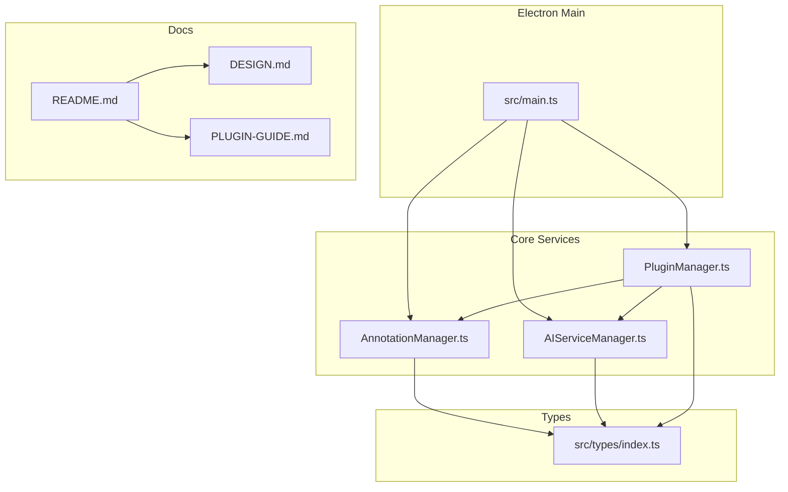
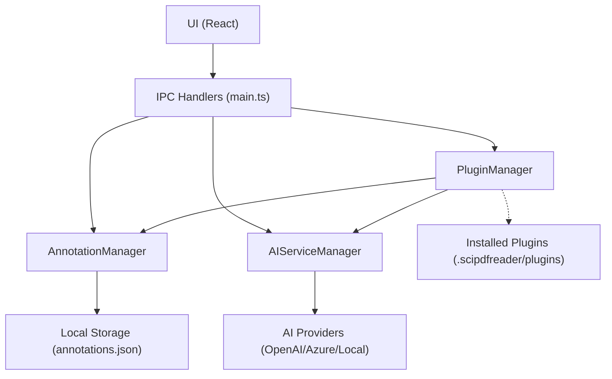
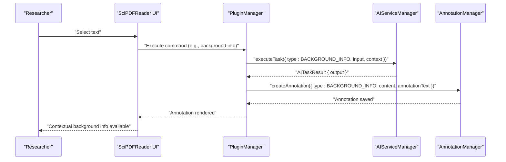
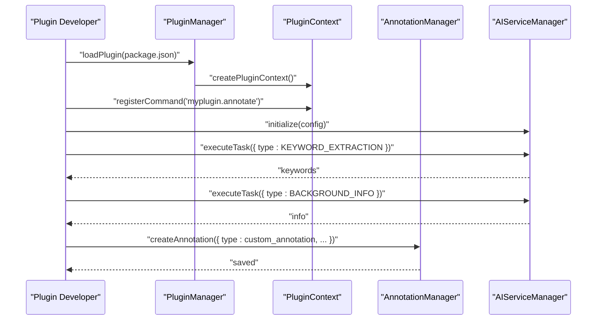
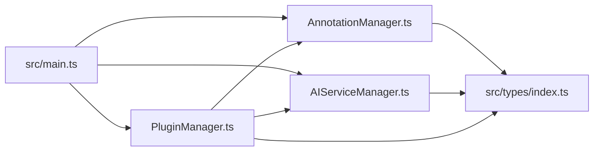

# Target Audience

<cite>
**Referenced Files in This Document**
- [README.md](file://README.md)
- [DESIGN.md](file://DESIGN.md)
- [PLUGIN-GUIDE.md](file://PLUGIN-GUIDE.md)
- [package.json](file://package.json)
- [src/main.ts](file://src/main.ts)
- [src/core/AnnotationManager.ts](file://src/core/AnnotationManager.ts)
- [src/core/AIServiceManager.ts](file://src/core/AIServiceManager.ts)
- [src/core/PluginManager.ts](file://src/core/PluginManager.ts)
- [src/types/index.ts](file://src/types/index.ts)
</cite>

## Table of Contents
1. [Introduction](#introduction)
2. [Project Structure](#project-structure)
3. [Core Components](#core-components)
4. [Architecture Overview](#architecture-overview)
5. [Detailed Component Analysis](#detailed-component-analysis)
6. [Dependency Analysis](#dependency-analysis)
7. [Performance Considerations](#performance-considerations)
8. [Troubleshooting Guide](#troubleshooting-guide)
9. [Conclusion](#conclusion)
10. [Appendices](#appendices)

## Introduction
This document describes SciPDFReader’s target audiences and how the application’s AI-powered annotation, plugin architecture, and cross-platform design meet their specific needs. It focuses on four primary user segments:
- Academic researchers: heavy annotation workflows, literature reviews, and AI-assisted content analysis
- Students: study habits, note-taking, and educational PDF processing
- Professionals: legal researchers, medical professionals, and business analysts requiring advanced document annotation and AI assistance
- Plugin developers: extending capabilities through a VS Code-inspired plugin ecosystem

It also outlines value propositions, use case scenarios, and alignment between features and workflows for each persona.

## Project Structure
SciPDFReader is an Electron-based desktop application with a React UI and modular core services:
- Electron main process initializes the app, manages IPC, and orchestrates core managers
- Core modules: AnnotationManager, AIServiceManager, PluginManager
- Types define the shared contracts for annotations, AI tasks, plugin manifests, and APIs
- Plugin development is guided by a dedicated guide aligned with VS Code’s model

**Diagram sources**
- [src/main.ts:1-156](file://src/main.ts#L1-L156)
- [src/core/AnnotationManager.ts:1-172](file://src/core/AnnotationManager.ts#L1-L172)
- [src/core/AIServiceManager.ts:1-214](file://src/core/AIServiceManager.ts#L1-L214)
- [src/core/PluginManager.ts:1-250](file://src/core/PluginManager.ts#L1-L250)
- [src/types/index.ts:1-224](file://src/types/index.ts#L1-L224)
- [README.md:1-196](file://README.md#L1-L196)
- [DESIGN.md:1-643](file://DESIGN.md#L1-L643)
- [PLUGIN-GUIDE.md:1-420](file://PLUGIN-GUIDE.md#L1-L420)

**Section sources**
- [README.md:13-29](file://README.md#L13-L29)
- [DESIGN.md:19-85](file://DESIGN.md#L19-L85)
- [src/main.ts:13-60](file://src/main.ts#L13-L60)
- [src/core/PluginManager.ts:38-47](file://src/core/PluginManager.ts#L38-L47)

## Core Components
- AnnotationManager: creates, updates, deletes, searches, and exports annotations; persists to local storage; registers default annotation types
- AIServiceManager: initializes providers, executes AI tasks (translation, summarization, background info, keyword extraction, question answering), supports batching and cancellation
- PluginManager: discovers, loads, activates, and manages plugins; exposes APIs to plugins for annotations, AI, and PDF rendering; handles command registration and lifecycle
- Types: define enums for annotation and AI task types, interfaces for annotations, AI tasks/results, plugin manifests, and plugin APIs

These components underpin the AI-powered annotation and plugin ecosystem described in the documentation.

**Section sources**
- [src/core/AnnotationManager.ts:46-112](file://src/core/AnnotationManager.ts#L46-L112)
- [src/core/AIServiceManager.ts:8-92](file://src/core/AIServiceManager.ts#L8-L92)
- [src/core/PluginManager.ts:72-121](file://src/core/PluginManager.ts#L72-L121)
- [src/types/index.ts:3-84](file://src/types/index.ts#L3-L84)

## Architecture Overview
The application follows a layered architecture:
- Electron main process initializes services and exposes IPC handlers
- Core managers coordinate annotation, AI, and plugin lifecycles
- Plugin system extends functionality via commands, annotations, and AI integrations
- Types define contracts for inter-module communication

**Diagram sources**
- [src/main.ts:45-60](file://src/main.ts#L45-L60)
- [src/main.ts:123-156](file://src/main.ts#L123-L156)
- [src/core/AnnotationManager.ts:153-170](file://src/core/AnnotationManager.ts#L153-L170)
- [src/core/AIServiceManager.ts:94-212](file://src/core/AIServiceManager.ts#L94-L212)
- [src/core/PluginManager.ts:38-47](file://src/core/PluginManager.ts#L38-L47)

## Detailed Component Analysis

### Academic Researchers
Primary needs:
- Literature review workflows requiring extensive annotation and cross-document comparison
- Need for AI-powered content analysis (translation, background info, summarization)
- Requirement for robust annotation persistence and export for synthesis

How SciPDFReader addresses these needs:
- AI-powered annotation pipeline: translation, background info, keyword extraction, and summarization
- Rich annotation types (highlights, notes, translations, background info) with persistent storage
- Export annotations to JSON/Markdown/HTML for synthesis and sharing
- Plugin extensibility to automate repetitive annotation tasks across large PDF sets

Value proposition:
- Time saved by automating translation and background information
- Enhanced productivity through AI-assisted summarization and keyword extraction
- Improved document analysis with searchable, exportable annotations

Use case scenario:
- Review a multi-volume research paper collection:
  - Select key terms and trigger “Background Info” to auto-generate contextual notes
  - Summarize long sections to accelerate comprehension
  - Export annotations to Markdown for literature review synthesis

**Diagram sources**
- [src/core/PluginManager.ts:137-145](file://src/core/PluginManager.ts#L137-L145)
- [src/core/AIServiceManager.ts:13-56](file://src/core/AIServiceManager.ts#L13-L56)
- [src/core/AnnotationManager.ts:46-59](file://src/core/AnnotationManager.ts#L46-L59)

**Section sources**
- [README.md:132-144](file://README.md#L132-L144)
- [src/core/AnnotationManager.ts:96-112](file://src/core/AnnotationManager.ts#L96-L112)
- [src/core/AnnotationManager.ts:114-151](file://src/core/AnnotationManager.ts#L114-L151)
- [src/types/index.ts:3-11](file://src/types/index.ts#L3-L11)

### Students
Primary needs:
- Study habits: quick note-taking, highlighting, and organizing course materials
- Educational PDF processing: translating foreign-language texts, generating concise summaries, and annotating key concepts
- Need for lightweight, cross-platform tooling that integrates with existing study routines

How SciPDFReader addresses these needs:
- AI-assisted translation and background info for multilingual learning
- Summarization to condense dense lecture notes and textbooks
- Flexible annotation types and export for study journals and flashcards

Value proposition:
- Faster comprehension through AI summarization and background info
- Streamlined note-taking with persistent, exportable annotations
- Cross-platform availability for seamless study across devices

Use case scenario:
- Prepare for an exam using course slides:
  - Translate unfamiliar terminology and annotate translations
  - Generate page summaries for quick review
  - Export annotations to Markdown for spaced repetition apps

**Section sources**
- [README.md:134-144](file://README.md#L134-L144)
- [src/core/AIServiceManager.ts:111-126](file://src/core/AIServiceManager.ts#L111-L126)
- [src/core/AnnotationManager.ts:114-151](file://src/core/AnnotationManager.ts#L114-L151)

### Professionals (Legal, Medical, Business)
Primary needs:
- Legal researchers: precise annotation of case law, citations, and legal concepts; need for exportable annotations for briefs
- Medical professionals: translating technical terms, annotating drug interactions, and summarizing clinical studies
- Business analysts: extracting insights from reports, generating executive summaries, and tagging key findings

How SciPDFReader addresses these needs:
- AI-powered translation and background info for specialized vocabularies
- Summarization and keyword extraction to distill dense documents
- Advanced annotation types and export formats for compliance and reporting

Value proposition:
- Reduced time spent on manual translation and concept lookup
- Structured, searchable annotations for legal discovery and medical record reviews
- Rapid synthesis of business intelligence from reports and research

Use case scenario:
- Review a legal brief:
  - Auto-generate background info for legal entities and precedents
  - Summarize factual findings to draft executive summaries
  - Export annotations to HTML for internal presentation decks

**Section sources**
- [README.md:132-144](file://README.md#L132-L144)
- [src/core/AIServiceManager.ts:128-137](file://src/core/AIServiceManager.ts#L128-L137)
- [src/core/AnnotationManager.ts:132-151](file://src/core/AnnotationManager.ts#L132-L151)

### Plugin Developers
Primary interests:
- Extend application capabilities with custom commands, annotation types, and AI integrations
- Reuse VS Code-like plugin APIs for annotations, AI services, and PDF rendering
- Build reusable tools for specific domains (e.g., legal terminology, medical concepts)

How SciPDFReader addresses these needs:
- Plugin architecture inspired by VS Code with activation, commands, and contribution points
- Rich plugin APIs for annotations, AI tasks, and PDF operations
- Clear plugin packaging and installation guidance

Value proposition:
- Rapid prototyping and distribution of domain-specific tools
- Consistent developer experience with familiar VS Code patterns
- Access to AI and annotation infrastructure without reinventing the wheel

Use case scenario:
- Build a plugin that auto-extracts legal citations and annotates definitions:
  - Register a custom annotation type
  - Implement a command that triggers AI keyword extraction and background info
  - Persist and export annotations for legal teams

**Diagram sources**
- [src/core/PluginManager.ts:72-121](file://src/core/PluginManager.ts#L72-L121)
- [src/core/PluginManager.ts:205-223](file://src/core/PluginManager.ts#L205-L223)
- [src/core/AnnotationManager.ts:46-59](file://src/core/AnnotationManager.ts#L46-L59)
- [src/core/AIServiceManager.ts:13-56](file://src/core/AIServiceManager.ts#L13-L56)

**Section sources**
- [PLUGIN-GUIDE.md:52-140](file://PLUGIN-GUIDE.md#L52-L140)
- [PLUGIN-GUIDE.md:142-238](file://PLUGIN-GUIDE.md#L142-L238)
- [src/core/PluginManager.ts:123-145](file://src/core/PluginManager.ts#L123-L145)

## Dependency Analysis
Key dependencies and relationships:
- Electron main process depends on core managers for IPC orchestration
- PluginManager depends on AnnotationManager and AIServiceManager to expose APIs to plugins
- AnnotationManager persists annotations locally; AIServiceManager supports multiple providers
- Types unify contracts across modules

**Diagram sources**
- [src/main.ts:45-60](file://src/main.ts#L45-L60)
- [src/core/AnnotationManager.ts:1-172](file://src/core/AnnotationManager.ts#L1-L172)
- [src/core/AIServiceManager.ts:1-214](file://src/core/AIServiceManager.ts#L1-L214)
- [src/core/PluginManager.ts:1-250](file://src/core/PluginManager.ts#L1-L250)
- [src/types/index.ts:1-224](file://src/types/index.ts#L1-L224)

**Section sources**
- [src/main.ts:45-60](file://src/main.ts#L45-L60)
- [src/core/PluginManager.ts:22-36](file://src/core/PluginManager.ts#L22-L36)

## Performance Considerations
- AI task batching and cancellation reduce overhead and improve responsiveness
- Local storage for annotations minimizes network dependency and speeds up recall
- Plugin activation events allow lazy initialization and reduced startup cost
- Cross-platform Electron build targets ensure broad device compatibility

[No sources needed since this section provides general guidance]

## Troubleshooting Guide
Common issues and resolutions:
- AI service not initialized: ensure provider configuration is set before executing tasks
- Annotation persistence failures: verify local data directory permissions and path resolution
- Plugin load errors: confirm plugin manifest validity and activation events
- IPC handler errors: check main process IPC registrations and error propagation

**Section sources**
- [src/core/AIServiceManager.ts:8-11](file://src/core/AIServiceManager.ts#L8-L11)
- [src/core/AnnotationManager.ts:153-170](file://src/core/AnnotationManager.ts#L153-L170)
- [src/core/PluginManager.ts:60-70](file://src/core/PluginManager.ts#L60-L70)
- [src/main.ts:123-156](file://src/main.ts#L123-L156)

## Conclusion
SciPDFReader’s AI-powered annotation and plugin architecture deliver measurable value across diverse user segments:
- Academic researchers gain automation for literature review and synthesis
- Students benefit from faster comprehension and streamlined note-taking
- Professionals achieve precision and speed in legal, medical, and business contexts
- Plugin developers can rapidly extend capabilities with familiar APIs

The documented features and workflows align closely with each persona’s needs, enabling time savings, enhanced productivity, and improved document analysis.

[No sources needed since this section summarizes without analyzing specific files]

## Appendices

### Feature Alignment Matrix
- AI-powered annotation: translation, background info, summarization, keyword extraction
- Annotation types: highlight, underline, strikethrough, note, translation, background info, custom
- Plugin APIs: annotations, AI service, PDF renderer, storage
- Cross-platform: Windows, macOS, Linux

**Section sources**
- [README.md:5-11](file://README.md#L5-L11)
- [README.md:132-144](file://README.md#L132-L144)
- [src/types/index.ts:3-11](file://src/types/index.ts#L3-L11)
- [src/types/index.ts:148-171](file://src/types/index.ts#L148-L171)
- [package.json:52-61](file://package.json#L52-L61)