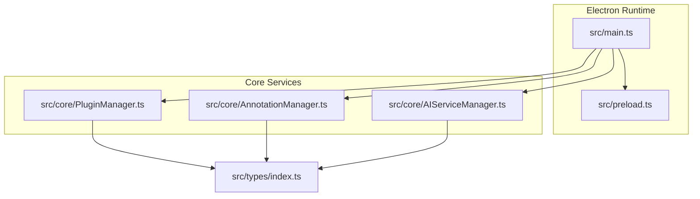
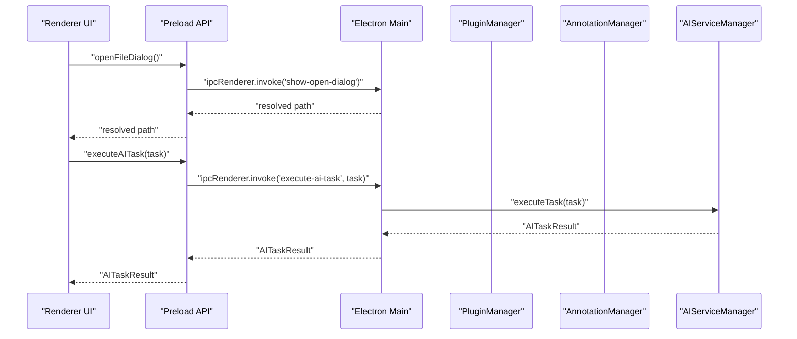
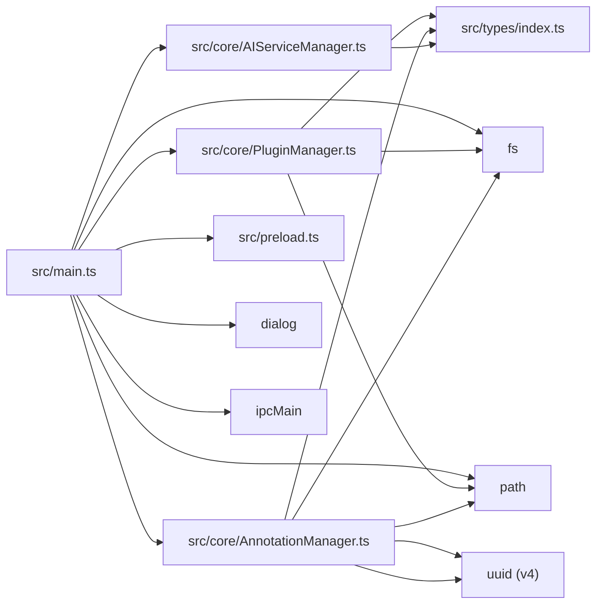

# Technology Stack

<cite>
**Referenced Files in This Document**
- [package.json](file://package.json)
- [tsconfig.json](file://tsconfig.json)
- [src/main.ts](file://src/main.ts)
- [src/preload.ts](file://src/preload.ts)
- [src/core/PluginManager.ts](file://src/core/PluginManager.ts)
- [src/core/AnnotationManager.ts](file://src/core/AnnotationManager.ts)
- [src/core/AIServiceManager.ts](file://src/core/AIServiceManager.ts)
- [src/types/index.ts](file://src/types/index.ts)
- [PLUGIN-GUIDE.md](file://PLUGIN-GUIDE.md)
- [README.md](file://README.md)
- [DESIGN.md](file://DESIGN.md)
</cite>

## Table of Contents
1. [Introduction](#introduction)
2. [Project Structure](#project-structure)
3. [Core Components](#core-components)
4. [Architecture Overview](#architecture-overview)
5. [Detailed Component Analysis](#detailed-component-analysis)
6. [Dependency Analysis](#dependency-analysis)
7. [Performance Considerations](#performance-considerations)
8. [Troubleshooting Guide](#troubleshooting-guide)
9. [Conclusion](#conclusion)
10. [Appendices](#appendices)

## Introduction
This document presents the technology stack and architectural choices for SciPDFReader. It explains how Electron (v28.x), React (v18.x), TypeScript, PDF.js (v3.x), SQLite3 (v5.x), and UUID are integrated to deliver a cross-platform desktop application with AI-powered annotation capabilities and a VS Code-inspired plugin architecture. It also covers build tools, development workflow, cross-platform considerations, and the rationale behind each choice for performance, maintainability, and extensibility.

## Project Structure
SciPDFReader follows a layered architecture:
- Electron main process orchestrates the app lifecycle, initializes services, and exposes secure IPC channels.
- A preload bridge exposes a minimal, typed API surface to the renderer process.
- Core modules implement the annotation, AI service, and plugin management domains.
- Types define shared interfaces and contracts across modules.
- The project integrates PDF.js for rendering and uses SQLite3 for local persistence.

**Diagram sources**
- [src/main.ts:1-156](file://src/main.ts#L1-L156)
- [src/preload.ts:1-34](file://src/preload.ts#L1-L34)
- [src/core/PluginManager.ts:1-250](file://src/core/PluginManager.ts#L1-L250)
- [src/core/AnnotationManager.ts:1-172](file://src/core/AnnotationManager.ts#L1-L172)
- [src/core/AIServiceManager.ts:1-214](file://src/core/AIServiceManager.ts#L1-L214)
- [src/types/index.ts:1-224](file://src/types/index.ts#L1-L224)

**Section sources**
- [README.md:13-29](file://README.md#L13-L29)
- [DESIGN.md:51-85](file://DESIGN.md#L51-L85)

## Core Components
- Electron main process: Creates the BrowserWindow, sets security preferences, loads the renderer HTML, initializes core services, and registers IPC handlers for file operations, annotations, AI tasks, and plugin commands.
- Preload bridge: Exposes a controlled API surface to the renderer via contextBridge, delegating to ipcRenderer.invoke and ipcRenderer.on.
- PluginManager: Manages plugin discovery, activation, command registration, and plugin lifecycle (enable/disable/uninstall). Provides plugin APIs for annotations, AI services, PDF renderer stub, and storage.
- AnnotationManager: Manages annotation CRUD, search, export, and persistence to a JSON file. Uses UUID for unique identifiers.
- AIServiceManager: Orchestrates AI tasks (translation, summarization, background info, keyword extraction, QA) with configurable providers and a simple queue/results store.
- Shared types: Define enums, interfaces, and contracts for annotations, AI tasks, plugin manifests, and renderer APIs.

**Section sources**
- [src/main.ts:13-156](file://src/main.ts#L13-L156)
- [src/preload.ts:5-33](file://src/preload.ts#L5-L33)
- [src/core/PluginManager.ts:16-250](file://src/core/PluginManager.ts#L16-L250)
- [src/core/AnnotationManager.ts:6-172](file://src/core/AnnotationManager.ts#L6-L172)
- [src/core/AIServiceManager.ts:3-214](file://src/core/AIServiceManager.ts#L3-L214)
- [src/types/index.ts:3-224](file://src/types/index.ts#L3-L224)

## Architecture Overview
SciPDFReader adopts a layered Electron architecture with a clear separation of concerns:
- Electron main process manages OS-level operations, security, and IPC.
- Renderer process (React-based UI) communicates via a typed preload bridge.
- Core services encapsulate domain logic for annotations, AI, and plugins.
- PDF rendering is planned to integrate with PDF.js, while the renderer API is currently a placeholder in the plugin manager.

**Diagram sources**
- [src/preload.ts:17-18](file://src/preload.ts#L17-L18)
- [src/preload.ts:14-15](file://src/preload.ts#L14-L15)
- [src/main.ts:106-142](file://src/main.ts#L106-L142)
- [src/core/AIServiceManager.ts:13-56](file://src/core/AIServiceManager.ts#L13-L56)

**Section sources**
- [src/main.ts:13-156](file://src/main.ts#L13-L156)
- [src/preload.ts:1-34](file://src/preload.ts#L1-L34)
- [DESIGN.md:51-85](file://DESIGN.md#L51-L85)

## Detailed Component Analysis

### Electron Framework (v28.x)
- Role: Cross-platform desktop runtime that bridges web technologies with native OS capabilities.
- Security: Enables context isolation and disables Node integration in the renderer, using a preload script to expose a minimal API surface.
- Lifecycle: Initializes BrowserWindow, loads renderer HTML, handles window lifecycle, and registers IPC handlers for file dialogs, PDF loading, annotations, AI tasks, and plugin commands.
- Build targets: Configured for Windows (NSIS), macOS (category), and Linux (AppImage).

**Section sources**
- [src/main.ts:15-43](file://src/main.ts#L15-L43)
- [src/main.ts:106-156](file://src/main.ts#L106-L156)
- [package.json:38-58](file://package.json#L38-L58)

### React (v18.x) Integration
- UI framework: Used for building the renderer-side user interface.
- JSX: Enabled in TypeScript compiler options for React JSX transform.
- Renderer composition: The main process loads a renderer HTML file; the preload bridge exposes typed IPC methods to the renderer.

**Section sources**
- [tsconfig.json:17](file://tsconfig.json#L17)
- [src/main.ts:29-30](file://src/main.ts#L29-L30)
- [DESIGN.md:28-33](file://DESIGN.md#L28-L33)

### TypeScript Implementation
- Compiler options: ES2020 target, CommonJS modules, DOM lib, source maps, strictness toggled off, ES module interop, skipLibCheck, resolveJsonModule, declaration and declarationMap enabled, JSX transform set to react-jsx.
- Strong typing: Shared types define enums, interfaces, and contracts for annotations, AI tasks, plugin manifests, and renderer APIs.
- Build scripts: compile, watch, dev, lint, package, dist, rebuild.

**Section sources**
- [tsconfig.json:2-18](file://tsconfig.json#L2-L18)
- [src/types/index.ts:1-224](file://src/types/index.ts#L1-L224)
- [package.json:7-16](file://package.json#L7-L16)

### PDF.js (v3.x) Integration
- Rendering engine: Integrated to provide high-quality PDF rendering and document processing.
- Current state: The PDF renderer API is a placeholder in the plugin manager; future implementation will integrate PDF.js for document loading, page rendering, text extraction, selection, and zoom controls.

**Section sources**
- [DESIGN.md:34-49](file://DESIGN.md#L34-L49)
- [src/core/PluginManager.ts:225-235](file://src/core/PluginManager.ts#L225-L235)

### SQLite3 (v5.x) Integration
- Purpose: Local data persistence for annotations and potentially other application data.
- Current usage: AnnotationManager persists annotations to a JSON file in the user data directory. SQLite3 is declared as a dependency; a migration to SQLite could improve scalability and querying performance.
- Storage path: Determined from APPDATA/HOME environment variables.

**Section sources**
- [src/core/AnnotationManager.ts:16-172](file://src/core/AnnotationManager.ts#L16-L172)
- [package.json:35](file://package.json#L35)

### UUID Library Usage
- Purpose: Generate unique identifiers for annotations.
- Implementation: Uses v4 (random) UUIDs during annotation creation.

**Section sources**
- [src/core/AnnotationManager.ts:46-59](file://src/core/AnnotationManager.ts#L46-L59)
- [package.json:36](file://package.json#L36)

### VS Code-Inspired Plugin Architecture
- Pattern: Inspired by VS Code’s extension model, enabling third-party plugins to contribute commands, annotation types, AI services, and UI extensions.
- Manifest: Plugins declare metadata, contribution points, and activation events.
- API surface: PluginManager creates a typed PluginContext exposing annotations, PDF renderer, AI service, and storage APIs.
- Lifecycle: Discovery, activation, command registration, enable/disable, and uninstall.

**Section sources**
- [PLUGIN-GUIDE.md:1-420](file://PLUGIN-GUIDE.md#L1-L420)
- [src/core/PluginManager.ts:16-250](file://src/core/PluginManager.ts#L16-L250)
- [src/types/index.ts:86-142](file://src/types/index.ts#L86-L142)

### Build Tools and Development Workflow
- Scripts: compile, watch, start, dev, rebuild, package, dist, lint.
- Linting: ESLint with TypeScript parser and plugin.
- Packaging: electron-builder configured for cross-platform targets.
- Development: TypeScript compilation, watch mode, and Electron runtime.

**Section sources**
- [package.json:7-16](file://package.json#L7-L16)
- [package.json:24-29](file://package.json#L24-L29)
- [package.json:38-58](file://package.json#L38-L58)

### Cross-Platform Compatibility and Optimizations
- Platforms: Windows (NSIS), macOS (category), Linux (AppImage).
- Security: Context isolation and preload bridge minimize exposure of Node APIs to the renderer.
- Performance: Future roadmap includes virtual scrolling, layer separation, Web Worker usage, caching, and batched AI requests.

**Section sources**
- [package.json:49-57](file://package.json#L49-L57)
- [src/main.ts:18-22](file://src/main.ts#L18-L22)
- [DESIGN.md:531-549](file://DESIGN.md#L531-L549)

## Dependency Analysis
The following diagram shows the primary dependencies among core modules and external libraries:

**Diagram sources**
- [src/main.ts:1-11](file://src/main.ts#L1-L11)
- [src/core/PluginManager.ts:1-6](file://src/core/PluginManager.ts#L1-L6)
- [src/core/AnnotationManager.ts:1-4](file://src/core/AnnotationManager.ts#L1-L4)
- [src/preload.ts:1](file://src/preload.ts#L1)

**Section sources**
- [src/main.ts:1-11](file://src/main.ts#L1-L11)
- [src/core/PluginManager.ts:1-6](file://src/core/PluginManager.ts#L1-L6)
- [src/core/AnnotationManager.ts:1-4](file://src/core/AnnotationManager.ts#L1-L4)

## Performance Considerations
- PDF rendering: Virtual scrolling, layer separation, Web Worker parsing, and caching are recommended to handle large documents efficiently.
- AI operations: Batch requests, result caching, fallback to local models, and graceful degradation when network is unavailable.
- Data storage: Incremental writes, compression, and indexing can improve annotation and document search performance.
- UI responsiveness: Avoid blocking the renderer thread; leverage asynchronous IPC and background processing.

**Section sources**
- [DESIGN.md:531-549](file://DESIGN.md#L531-L549)

## Troubleshooting Guide
- IPC communication failures: Verify preload exposes the correct methods and that main registers handlers for the invoked channel names.
- Plugin activation errors: Ensure plugin manifest is valid, main loads plugins from the expected user data directory, and activation events match expectations.
- Annotation persistence issues: Confirm the data directory exists and is writable; check JSON serialization/deserialization paths.
- AI service initialization: Ensure initialize() is called with a valid provider configuration before executing tasks.

**Section sources**
- [src/preload.ts:5-33](file://src/preload.ts#L5-L33)
- [src/main.ts:106-156](file://src/main.ts#L106-L156)
- [src/core/PluginManager.ts:49-107](file://src/core/PluginManager.ts#L49-L107)
- [src/core/AnnotationManager.ts:153-170](file://src/core/AnnotationManager.ts#L153-L170)
- [src/core/AIServiceManager.ts:8-11](file://src/core/AIServiceManager.ts#L8-L11)

## Conclusion
SciPDFReader’s technology stack combines Electron, React, TypeScript, and PDF.js to create a modern, cross-platform desktop application. The VS Code-inspired plugin architecture enables extensibility, while TypeScript ensures maintainability. PDF.js integration and SQLite3 support lay the groundwork for robust PDF rendering and persistent storage. The build and packaging pipeline, along with security-conscious Electron practices, provide a solid foundation for performance, reliability, and cross-platform compatibility.

## Appendices

### Technology Choices and Rationale
- Electron (v28.x): Cross-platform desktop runtime with mature ecosystem and strong community support.
- React (v18.x): Declarative UI with component-based architecture and excellent developer experience.
- TypeScript: Enhanced developer productivity, refactoring safety, and scalable codebases.
- PDF.js (v3.x): Mature, performant, and flexible PDF rendering library suitable for embedding in Electron.
- SQLite3 (v5.x): Robust embedded database for structured data persistence; can be adopted to replace JSON storage for scalability.
- UUID: Reliable unique ID generation for annotations and other entities.
- VS Code plugin model: Proven extensibility pattern that encourages a vibrant ecosystem.

**Section sources**
- [DESIGN.md:21-49](file://DESIGN.md#L21-L49)
- [README.md:106-119](file://README.md#L106-L119)